# ER simplificado MVP alineado al PRD

Este documento propone un **ER mínimo viable** para implementar el proyecto de inventario interno respetando el PRD sin intentar modelar desde el día 1 todo el universo.

La idea es enfocarse en lo que realmente mueve el MVP:

- autenticación y roles
- clientes y crédito
- productos y categorías
- bodegas
- stock por bodega
- lotes
- movimientos de inventario
- ventas/pedidos
- facturas y pagos
- aprobaciones
- auditoría básica
- recetas y producción mínima

---

## Objetivo del MVP

El MVP debería permitir operar de forma controlada:

1. catálogo de productos
2. inventario por bodega
3. entradas con lote
4. ajustes auditados
5. ventas con aprobación cuando aplique
6. despacho que descuenta inventario real
7. pagos ligados a factura
8. producción básica con receta y consumo de insumos
9. trazabilidad suficiente para histórico y revisión

---

## Diagrama ER simplificado del MVP

```mermaid
erDiagram
    COMPANY ||--o{ USER : has
    ROLE ||--o{ USER : assigns
    COMPANY ||--o{ CLIENT : has
    COMPANY ||--o{ WAREHOUSE : has
    COMPANY ||--o{ PRODUCT : owns
    COMPANY ||--o{ SUPPLIER : has
    COMPANY ||--o{ RECIPE : owns
    COMPANY ||--o{ SALES_ORDER : owns
    COMPANY ||--o{ PRODUCTION_ORDER : owns
    COMPANY ||--o{ APPROVAL_REQUEST : owns
    COMPANY ||--o{ AUDIT_LOG : owns

    CATEGORY ||--o{ PRODUCT : classifies
    CLIENT ||--o{ SALES_ORDER : places
    USER ||--o{ SALES_ORDER : creates
    USER ||--o{ SALES_ORDER : approves
    SALES_ORDER ||--o{ SALES_ORDER_ITEM : contains
    PRODUCT ||--o{ SALES_ORDER_ITEM : sold
    WAREHOUSE ||--o{ SALES_ORDER : dispatches_from

    SALES_ORDER ||--o{ INVOICE : generates
    INVOICE ||--o{ PAYMENT : receives
    CLIENT ||--o{ INVOICE : billed_to

    PRODUCT ||--o{ LOT : has
    SUPPLIER ||--o{ LOT : supplies
    WAREHOUSE ||--o{ LOT : stores
    PRODUCT ||--o{ WAREHOUSE_STOCK : balanced_in
    WAREHOUSE ||--o{ WAREHOUSE_STOCK : balanced_in
    PRODUCT ||--o{ STOCK_MOVEMENT : moves
    LOT ||--o{ STOCK_MOVEMENT : traces

    RECIPE ||--o{ RECIPE_INGREDIENT : defines
    PRODUCT ||--o{ RECIPE_INGREDIENT : used_as_input
    RECIPE ||--o{ PRODUCT : produces

    RECIPE ||--o{ PRODUCTION_ORDER : drives
    SALES_ORDER ||--o{ PRODUCTION_ORDER : may_trigger
    WAREHOUSE ||--o{ PRODUCTION_ORDER : executes_in
    USER ||--o{ PRODUCTION_ORDER : requests
    USER ||--o{ PRODUCTION_ORDER : start_approves
    USER ||--o{ PRODUCTION_ORDER : finish_approves
    PRODUCTION_ORDER ||--o{ PRODUCTION_CONSUMPTION : consumes
    PRODUCT ||--o{ PRODUCTION_CONSUMPTION : input
    LOT ||--o{ PRODUCTION_CONSUMPTION : from_lot
    PRODUCTION_ORDER ||--o{ PRODUCTION_OUTPUT : outputs
    PRODUCT ||--o{ PRODUCTION_OUTPUT : output
    LOT ||--o| PRODUCTION_OUTPUT : generated_lot
    PRODUCTION_ORDER ||--o{ PRODUCTION_WASTE : wastes
    PRODUCT ||--o{ PRODUCTION_WASTE : affected
    USER ||--o{ PRODUCTION_WASTE : records

    USER ||--o{ APPROVAL_REQUEST : resolves
    USER ||--o{ AUDIT_LOG : performs

    COMPANY {
      bigint id PK
      string name
      string legal_id
    }

    ROLE {
      bigint id PK
      string code
      string name
    }

    USER {
      bigint id PK
      bigint company_id FK
      bigint role_id FK
      string username
      string full_name
      string status
    }

    CLIENT {
      bigint id PK
      bigint company_id FK
      string code
      string name
      decimal credit_limit
      decimal credit_balance
      boolean credit_enabled
      boolean is_active
    }

    CATEGORY {
      bigint id PK
      bigint company_id FK
      string name
      string category_type
      boolean is_active
    }

    PRODUCT {
      bigint id PK
      bigint company_id FK
      bigint category_id FK
      bigint recipe_id FK
      string code
      string name
      string product_type
      string unit
      boolean is_active
      string lot_strategy
      decimal min_stock
    }

    SUPPLIER {
      bigint id PK
      bigint company_id FK
      string name
      boolean is_active
    }

    WAREHOUSE {
      bigint id PK
      bigint company_id FK
      string code
      string name
      boolean is_active
    }

    WAREHOUSE_STOCK {
      bigint id PK
      bigint warehouse_id FK
      bigint product_id FK
      decimal quantity
      decimal reserved_quantity
    }

    LOT {
      bigint id PK
      bigint product_id FK
      bigint supplier_id FK
      bigint warehouse_id FK
      string lot_number
      decimal original_quantity
      decimal available_quantity
      string status
      datetime entry_date
      datetime expiration_date
    }

    STOCK_MOVEMENT {
      bigint id PK
      bigint product_id FK
      bigint lot_id FK
      bigint warehouse_id FK
      bigint performed_by_user_id FK
      string movement_type
      decimal quantity
      string source_type
      bigint source_id
      string note
      datetime created_at
    }

    SALES_ORDER {
      bigint id PK
      bigint company_id FK
      bigint client_id FK
      bigint created_by_user_id FK
      bigint approved_by_user_id FK
      bigint warehouse_id FK
      string status
      decimal total
      boolean requires_approval
      string approval_reason
    }

    SALES_ORDER_ITEM {
      bigint id PK
      bigint sales_order_id FK
      bigint product_id FK
      decimal quantity
      decimal unit_price
      decimal discount_amount
    }

    INVOICE {
      bigint id PK
      bigint client_id FK
      bigint sales_order_id FK
      string number
      decimal amount
      string status
      datetime issued_at
      datetime due_at
    }

    PAYMENT {
      bigint id PK
      bigint invoice_id FK
      decimal amount
      string payment_method
      string reference
      datetime created_at
    }

    RECIPE {
      bigint id PK
      bigint company_id FK
      string code
      string name
      boolean is_active
    }

    RECIPE_INGREDIENT {
      bigint id PK
      bigint recipe_id FK
      bigint product_id FK
      decimal quantity
    }

    PRODUCTION_ORDER {
      bigint id PK
      bigint company_id FK
      bigint sales_order_id FK
      bigint recipe_id FK
      bigint warehouse_id FK
      bigint requested_by_user_id FK
      bigint approved_to_start_by_user_id FK
      bigint finished_approved_by_user_id FK
      decimal planned_quantity
      string status
    }

    PRODUCTION_CONSUMPTION {
      bigint id PK
      bigint production_order_id FK
      bigint product_id FK
      bigint lot_id FK
      decimal planned_quantity
      decimal consumed_quantity
    }

    PRODUCTION_OUTPUT {
      bigint id PK
      bigint production_order_id FK
      bigint product_id FK
      bigint generated_lot_id FK
      decimal produced_quantity
    }

    PRODUCTION_WASTE {
      bigint id PK
      bigint production_order_id FK
      bigint product_id FK
      decimal quantity
      string reason
      bigint recorded_by_user_id FK
      datetime created_at
    }

    APPROVAL_REQUEST {
      bigint id PK
      bigint company_id FK
      bigint requested_by_user_id FK
      bigint resolved_by_user_id FK
      string entity_type
      bigint entity_id
      string approval_type
      string status
      string reason
      datetime created_at
      datetime resolved_at
    }

    AUDIT_LOG {
      bigint id PK
      bigint company_id FK
      bigint user_id FK
      string entity_type
      bigint entity_id
      string action
      string reason
      datetime created_at
    }
```

---

## Tablas MVP recomendadas

## 1. Organización y seguridad

### `Company`
Empresa dueña de toda la operación.

### `Role`
Roles del sistema.

### `User`
Usuarios autenticados ligados a empresa y rol.

### Roles MVP sugeridos
- `admin`
- `supervisor`
- `warehouse`
- `sales`
- `executive`

---

## 2. Catálogo y comercial

### `Client`
Debe incluir al menos:
- datos generales
- `credit_limit`
- `credit_balance`
- `credit_enabled`
- `is_active`

### `Category`
Para agrupar productos por tipo.

### `Product`
Debe incluir al menos:
- `category_id`
- `recipe_id` opcional
- `product_type` (`FINISHED`, `RAW`, `PACKAGING`, `SUPPLY`)
- `is_active`
- `lot_strategy`
- `min_stock`

### `Supplier`
Proveedor base para entradas y lotes.

---

## 3. Inventario

### `Warehouse`
Entidad nueva obligatoria para cumplir PRD.

### `WarehouseStock`
Tabla pivote para stock por producto y bodega.

Regla:
- una fila por combinación `warehouse + product`

Campos mínimos:
- `quantity`
- `reserved_quantity`

### `Lot`
Todos los productos operativos deberían manejar lote.

Campos mínimos:
- `product_id`
- `supplier_id`
- `warehouse_id`
- `lot_number`
- `original_quantity`
- `available_quantity`
- `status`
- `entry_date`
- `expiration_date`

### `StockMovement`
Bitácora operativa de inventario.

Debe registrar:
- producto
- lote
- bodega
- usuario
- tipo de movimiento
- cantidad
- origen funcional (`sale_dispatch`, `manual_entry`, `adjustment`, `production_consume`, etc.)

---

## 4. Ventas

### `SalesOrder`
Corresponde al `Order` actual, pero más alineado al PRD.

Campos mínimos:
- `client_id`
- `created_by_user_id`
- `approved_by_user_id`
- `warehouse_id`
- `status`
- `requires_approval`
- `approval_reason`
- `total`

Estados sugeridos MVP:
- `DRAFT`
- `PENDING_APPROVAL`
- `APPROVED`
- `DISPATCHED`
- `CANCELLED`

### `SalesOrderItem`
Detalle de productos vendidos.

---

## 5. Facturación y pagos

### `Invoice`
Factura asociada a cliente y opcionalmente a venta.

### `Payment`
Pago asociado a factura.

Métodos MVP sugeridos:
- `CASH`
- `TRANSFER`
- `SINPE`
- `CARD`
- `CREDIT`

---

## 6. Producción mínima

### `Recipe`
Receta maestra del producto terminado.

### `RecipeIngredient`
Define cantidades estándar de insumos.

### `ProductionOrder`
Solicitud/orden de producción.

Estados sugeridos MVP:
- `DRAFT`
- `REQUESTED`
- `APPROVED_TO_START`
- `IN_PROGRESS`
- `PENDING_FINISH_APPROVAL`
- `FINISHED`
- `CANCELLED`
- `REJECTED`

Además conviene guardar por separado:
- `requested_by_user_id`
- `approved_to_start_by_user_id`
- `finished_approved_by_user_id`

### `ProductionConsumption`
Consumo real de insumos por lote.

### `ProductionOutput`
Salida de producto terminado y lote generado.

### `ProductionWaste`
Registro de merma por orden de producción.

Campos mínimos:
- `production_order_id`
- `product_id`
- `quantity`
- `reason`
- `recorded_by_user_id`
- `created_at`

Este split es mejor que dejar todo escondido en un `ProductionItem` ambiguo que después nadie sabe si era entrada, salida o sacrificio ritual.

---

## 7. Aprobaciones y auditoría

### `ApprovalRequest`
Tabla transversal para aprobaciones críticas.

Casos MVP:
- venta con crédito excedido
- ajuste relevante
- salida especial
- producción si se decide

### `AuditLog`
Bitácora general para cambios relevantes.

No reemplaza a `StockMovement`.

Diferencia:
- `StockMovement` = evento de inventario
- `AuditLog` = evento general del sistema

---

## Qué tablas actuales pueden reutilizarse casi directas

Se pueden reaprovechar con ajustes moderados:

- `Role`
- `User`
- `Client`
- `Product`
- `Supplier`
- `Lot`
- `StockMovement`
- `Order` → renombrable conceptualmente a `SalesOrder`
- `OrderItem` → `SalesOrderItem`
- `Invoice`
- `Payment`
- `Recipe`
- `RecipeIngredient`
- `ProductionOrder`

---

## Qué hay que crear sí o sí para el MVP PRD

Mínimo estas:

- `Warehouse`
- `WarehouseStock`
- `ApprovalRequest`
- `AuditLog`
- `ProductionConsumption`
- `ProductionOutput`
- `ProductionWaste`

Y probablemente ajustar:

- `Lot`
- `Product`
- `Order`
- `PaymentType`

---

## Reglas de diseño MVP importantes

1. **No borrar físicamente catálogos con historial**
2. **El stock ya no debe vivir solo en `product.quantity`**
3. **El lote debe ser entidad central del movimiento real**
4. **Toda salida real debe afectar bodega y lote**
5. **Las aprobaciones no deben quedar hardcodeadas por módulo**
6. **Toda orden de producción requiere aprobación de supervisor para iniciar**
7. **Toda orden de producción requiere aprobación de supervisor para finalizar**
8. **El inventario de insumos se descuenta al finalizar la producción, no al inicio**
9. **La merma de producción debe registrarse al finalizar junto con el incremento del producto terminado**
10. **La auditoría general debe existir desde MVP**

---

## Alcance que este ER MVP sí cubre

- inventario por bodega
- entradas con lote
- salidas ligadas a venta
- ajustes
- crédito comercial básico
- aprobaciones
- pagos parciales
- producción básica con doble aprobación
- registro de merma de producción
- trazabilidad mínima operativa

## Alcance que puede quedar para después

- múltiples precios por producto
- transferencias entre bodegas si el tiempo aprieta
- reportes avanzados
- forecasting
- promociones/combo
- multiempresa activa real
- integraciones externas

Aunque ojo: **bodegas y lotes no deberían patearse**, porque si se patean, luego toca rehacer medio modelo. Y eso siempre sale “barato” hasta que deja de salir barato.
