# ER propuesto para alinear `inventory-api` con el PRD

Este documento muestra un ER propuesto tomando como base el schema actual y agregando las entidades que hacen falta para cumplir mejor el PRD.

## Criterios usados

- reutilizar lo ya modelado en Prisma siempre que tenga sentido
- no romper la separación por dominios
- agregar soporte para multi-bodega, lotes obligatorios, auditoría, aprobaciones y precios múltiples
- mantener trazabilidad histórica

## Diagrama ER propuesto

```mermaid
erDiagram
    COMPANY ||--o{ USER : has
    ROLE ||--o{ USER : assigns
    COMPANY ||--o| COMPANY_CONFIG : has
    COMPANY ||--o{ REGION : has
    COMPANY ||--o| INVENTORY : owns
    INVENTORY ||--o{ CATEGORY : groups
    COMPANY ||--o{ WAREHOUSE : has
    COMPANY ||--o{ CLIENT : has
    REGION ||--o{ CLIENT : routes
    CLIENT ||--o{ CLIENT_CONTACT : has
    CLIENT ||--o{ CLIENT_REFERENCE : has

    COMPANY ||--o{ PRODUCT : owns
    CATEGORY ||--o{ PRODUCT : classifies
    RECIPE ||--o{ PRODUCT : outputs
    COMPANY ||--o{ RECIPE : owns
    RECIPE ||--o{ RECIPE_INGREDIENT : defines
    PRODUCT ||--o{ RECIPE_INGREDIENT : used_as_input

    COMPANY ||--o{ SUPPLIER : has
    PRODUCT ||--o{ PRODUCT_SUPPLIER : linked
    SUPPLIER ||--o{ PRODUCT_SUPPLIER : linked
    PRODUCT ||--o{ PRODUCT_PRICE : priced

    PRODUCT ||--o{ LOT : has
    SUPPLIER ||--o{ LOT : supplies
    WAREHOUSE ||--o{ LOT : stores
    PRODUCT ||--o{ WAREHOUSE_STOCK : balanced_in
    WAREHOUSE ||--o{ WAREHOUSE_STOCK : balanced_in

    PRODUCT ||--o{ STOCK_MOVEMENT : moves
    LOT ||--o{ STOCK_MOVEMENT : traces
    WAREHOUSE ||--o{ STOCK_MOVEMENT : source_or_target
    USER ||--o{ STOCK_MOVEMENT : performs

    COMPANY ||--o{ SALES_ORDER : owns
    CLIENT ||--o{ SALES_ORDER : places
    USER ||--o{ SALES_ORDER : created_by
    USER ||--o{ SALES_ORDER : approved_by
    SALES_ORDER ||--o{ SALES_ORDER_ITEM : contains
    PRODUCT ||--o{ SALES_ORDER_ITEM : sold
    WAREHOUSE ||--o{ SALES_ORDER : dispatches_from
    APPROVAL_REQUEST ||--o| SALES_ORDER : may_block

    SALES_ORDER ||--o{ INVOICE : generates
    CLIENT ||--o{ INVOICE : billed_to
    INVOICE ||--o{ PAYMENT : receives
    CLIENT ||--o{ CREDIT_APPROVAL : may_require
    USER ||--o{ CREDIT_APPROVAL : resolves

    COMPANY ||--o{ PRODUCTION_ORDER : owns
    SALES_ORDER ||--o{ PRODUCTION_ORDER : may_trigger
    RECIPE ||--o{ PRODUCTION_ORDER : follows
    USER ||--o{ PRODUCTION_ORDER : requested_by
    USER ||--o{ PRODUCTION_ORDER : start_approved_by
    USER ||--o{ PRODUCTION_ORDER : finish_approved_by
    PRODUCTION_ORDER ||--o{ PRODUCTION_CONSUMPTION : consumes
    PRODUCT ||--o{ PRODUCTION_CONSUMPTION : input
    LOT ||--o{ PRODUCTION_CONSUMPTION : from_lot
    PRODUCTION_ORDER ||--o{ PRODUCTION_OUTPUT : produces
    PRODUCT ||--o{ PRODUCTION_OUTPUT : output
    LOT ||--o| PRODUCTION_OUTPUT : generated_lot
    WAREHOUSE ||--o{ PRODUCTION_OUTPUT : stored_in
    PRODUCTION_ORDER ||--o{ PRODUCTION_WASTE : wastes
    PRODUCT ||--o{ PRODUCTION_WASTE : affected
    USER ||--o{ PRODUCTION_WASTE : records

    COMPANY ||--o{ TRANSFER_ORDER : owns
    WAREHOUSE ||--o{ TRANSFER_ORDER : source
    WAREHOUSE ||--o{ TRANSFER_ORDER : target
    TRANSFER_ORDER ||--o{ TRANSFER_ITEM : moves
    PRODUCT ||--o{ TRANSFER_ITEM : transferred
    LOT ||--o{ TRANSFER_ITEM : optional_lot
    USER ||--o{ TRANSFER_ORDER : requested_by
    USER ||--o{ TRANSFER_ORDER : approved_by

    USER ||--o{ APPROVAL_REQUEST : resolves
    USER ||--o{ AUDIT_LOG : performs
    COMPANY ||--o{ AUDIT_LOG : scopes

    COMPANY {
      bigint id PK
      string name
      string legal_id
    }

    ROLE {
      bigint id PK
      string code
      string name
    }

    USER {
      bigint id PK
      bigint company_id FK
      bigint role_id FK
      string username
      string full_name
      string status
    }

    COMPANY_CONFIG {
      bigint id PK
      bigint company_id FK
      decimal tax_percentage
      string currency
    }

    REGION {
      bigint id PK
      bigint company_id FK
      string name
    }

    INVENTORY {
      bigint id PK
      bigint company_id FK
    }

    CATEGORY {
      bigint id PK
      bigint inventory_id FK
      string name
      string category_type
    }

    WAREHOUSE {
      bigint id PK
      bigint company_id FK
      string code
      string name
      boolean is_active
    }

    CLIENT {
      bigint id PK
      bigint company_id FK
      bigint region_id FK
      string code
      string name
      decimal credit_limit
      decimal credit_balance
      boolean credit_enabled
      boolean is_active
    }

    CLIENT_CONTACT {
      bigint id PK
      bigint client_id FK
      string name
    }

    CLIENT_REFERENCE {
      bigint id PK
      bigint client_id FK
      string name
    }

    PRODUCT {
      bigint id PK
      bigint company_id FK
      bigint category_id FK
      bigint recipe_id FK
      string code
      string name
      string unit
      boolean is_active
      string lot_strategy
      decimal min_stock
    }

    PRODUCT_PRICE {
      bigint id PK
      bigint product_id FK
      string price_type
      decimal amount
      string currency
      datetime valid_from
      datetime valid_to
      boolean is_active
    }

    RECIPE {
      bigint id PK
      bigint company_id FK
      string code
      string name
      boolean is_active
    }

    RECIPE_INGREDIENT {
      bigint id PK
      bigint recipe_id FK
      bigint product_id FK
      decimal quantity
    }

    SUPPLIER {
      bigint id PK
      bigint company_id FK
      string name
      boolean is_active
    }

    PRODUCT_SUPPLIER {
      bigint product_id PK,FK
      bigint supplier_id PK,FK
    }

    WAREHOUSE_STOCK {
      bigint id PK
      bigint warehouse_id FK
      bigint product_id FK
      decimal quantity
      decimal reserved_quantity
      decimal min_stock_override
    }

    LOT {
      bigint id PK
      bigint product_id FK
      bigint supplier_id FK
      bigint warehouse_id FK
      string lot_number
      decimal original_quantity
      decimal available_quantity
      string status
      datetime entry_date
      datetime expiration_date
    }

    STOCK_MOVEMENT {
      bigint id PK
      bigint product_id FK
      bigint lot_id FK
      bigint source_warehouse_id FK
      bigint target_warehouse_id FK
      bigint performed_by_user_id FK
      string movement_type
      decimal quantity
      string source_type
      bigint source_id
      string note
    }

    SALES_ORDER {
      bigint id PK
      bigint company_id FK
      bigint client_id FK
      bigint user_id FK
      bigint approved_by_id FK
      bigint dispatch_warehouse_id FK
      string status
      decimal total
      boolean requires_approval
    }

    SALES_ORDER_ITEM {
      bigint id PK
      bigint sales_order_id FK
      bigint product_id FK
      decimal quantity
      decimal unit_price
    }

    INVOICE {
      bigint id PK
      bigint client_id FK
      bigint sales_order_id FK
      string number
      decimal amount
      string status
    }

    PAYMENT {
      bigint id PK
      bigint invoice_id FK
      decimal amount
      string payment_method
      string reference
    }

    CREDIT_APPROVAL {
      bigint id PK
      bigint client_id FK
      bigint sales_order_id FK
      bigint resolved_by_user_id FK
      string status
      string reason
    }

    APPROVAL_REQUEST {
      bigint id PK
      bigint company_id FK
      bigint requested_by_user_id FK
      bigint resolved_by_user_id FK
      string entity_type
      bigint entity_id
      string approval_type
      string status
      string reason
    }

    PRODUCTION_ORDER {
      bigint id PK
      bigint company_id FK
      bigint sales_order_id FK
      bigint recipe_id FK
      bigint requested_by_user_id FK
      bigint approved_to_start_by_user_id FK
      bigint finished_approved_by_user_id FK
      bigint warehouse_id FK
      decimal planned_quantity
      string status
    }

    PRODUCTION_CONSUMPTION {
      bigint id PK
      bigint production_order_id FK
      bigint product_id FK
      bigint lot_id FK
      decimal planned_quantity
      decimal consumed_quantity
    }

    PRODUCTION_OUTPUT {
      bigint id PK
      bigint production_order_id FK
      bigint product_id FK
      bigint generated_lot_id FK
      bigint warehouse_id FK
      decimal produced_quantity
    }

    PRODUCTION_WASTE {
      bigint id PK
      bigint production_order_id FK
      bigint product_id FK
      decimal quantity
      string reason
      bigint recorded_by_user_id FK
      datetime created_at
    }

    TRANSFER_ORDER {
      bigint id PK
      bigint company_id FK
      bigint source_warehouse_id FK
      bigint target_warehouse_id FK
      bigint requested_by_user_id FK
      bigint approved_by_user_id FK
      string status
    }

    TRANSFER_ITEM {
      bigint id PK
      bigint transfer_order_id FK
      bigint product_id FK
      bigint lot_id FK
      decimal quantity
    }

    AUDIT_LOG {
      bigint id PK
      bigint company_id FK
      bigint user_id FK
      string entity_type
      bigint entity_id
      string action
      json before_data
      json after_data
      string reason
      datetime created_at
    }
```



## Lectura rápida del modelo

### Ya existe o casi existe en el proyecto actual

- `Company`
- `Role`
- `User`
- `CompanyConfig`
- `Region`
- `Inventory`
- `Category`
- `Client`
- `ClientContact`
- `ClientReference`
- `Product`
- `Recipe`
- `RecipeIngredient`
- `Supplier`
- `ProductSupplier`
- `Lot`
- `StockMovement`
- `Order` / `OrderItem`
- `Invoice`
- `Payment`
- `ProductionOrder`
- `ProductionItem`

### Habría que agregar o refactorizar para cumplir mejor el PRD

- `Warehouse`
- `WarehouseStock`
- `ProductPrice`
- `ApprovalRequest`
- `CreditApproval`
- `ProductionConsumption`
- `ProductionOutput`
- `ProductionWaste`
- `TransferOrder`
- `TransferItem`
- `AuditLog`

## Mapeo de nombres con el schema actual

Para evitar confusión:

- `SALES_ORDER` en el diagrama corresponde al `Order` actual
- `SALES_ORDER_ITEM` corresponde a `OrderItem`
- el modelo `ProductionItem` actual es todavía muy liviano; probablemente terminaría partiéndose funcionalmente entre `ProductionConsumption`, `ProductionOutput` y `ProductionWaste`
- `PRODUCTION_ORDER` debería manejar estados más expresivos que el `OrderStatus` actual reutilizado desde ventas

## Observaciones importantes

1. El PRD empuja fuerte a multi-bodega. Eso vuelve insuficiente seguir usando solo `product.quantity` como stock global.
2. Si los lotes van a ser obligatorios, la salida real debería ejecutarse por lote y por bodega.
3. `AuditLog` no reemplaza `StockMovement`; lo complementa.
4. `ApprovalRequest` permite no meter lógica de aprobación hardcodeada en cada módulo.
5. `ProductPrice` evita meter columnas absurdas tipo `price2`, `price3`, `price_credito`, porque eso sería una porquería.

## Vista mínima por dominios

### Seguridad
- Company
- Role
- User
- AuditLog
- ApprovalRequest

### Comercial
- Client
- SalesOrder
- SalesOrderItem
- Invoice
- Payment
- CreditApproval

### Inventario
- Inventory
- Category
- Product
- Warehouse
- WarehouseStock
- Lot
- StockMovement
- TransferOrder
- TransferItem

### Producción
- Recipe
- RecipeIngredient
- ProductionOrder
- ProductionConsumption
- ProductionOutput
- ProductionWaste

### Compras / abastecimiento
- Supplier
- ProductSupplier
- Lot

```