# Inventori Inventory UI/UX Current-State Analysis

Implementation update (2026-09-17): the approved coordinated master-plan implementation has delivered the Inventory workspace, Product inventory applicability via `controlsInventory`, transparent system lots, initial inventory, location lifecycle, allowed-location backend enforcement, adjustments, and true transfers. Historical observations below are retained for audit context; the live repository state should be read together with `specs/inventory-ux-mvp/current-state.md` and `specs/inventori-product-inventory-master-plan/implementation-report.md`.

Current-state analysis only. No redesign or target architecture is proposed here.

## Scope and evidence base

Inspected frontend areas:

- Root/admin shell routes and manifest: `src/public/root/router.js`, `src/public/root/manifest.js`.
- Products: `src/public/root/views/products-admin.js`, `products-admin.renderers.js`, `products-admin.helpers.js`, `products-api.js`.
- Warehouses: `src/public/root/views/warehouses-admin.js`, `warehouses-admin.renderers.js`, `warehouses-admin.helpers.js`, `warehouses-api.js`.
- Lots / stock entry / lot QA: `src/public/root/views/lots-admin.js`, `lots-admin.renderers.js`, `lots-admin.helpers.js`, `inventory-api.js`.
- Movements: `src/public/root/views/movements-admin.js`, `movements-admin.renderers.js`, `movements-admin.helpers.js`, `inventory-api.js`.
- Warehouse operational SPA: `src/public/warehouse/app.js`, `views/inventory.js`, `views/receive-from-po.js`, `views/receipts.js`, `views/dispatching.js`, `views/production-new.js`, `views/production.renderers.js`, `views/production.controllers.js`, `api/warehouse-api.js`.
- Relevant backend contracts: `src/routes/product.routes.js`, `inventory.routes.js`, `warehouse.routes.js`; `src/schemas/product.schema.js`, `inventory.schema.js`; `src/services/product.service.js`, `inventory.service.js`, `receipt.service.js`, `production-execution.service.js`.

## 1. CONFIRMED CURRENT BEHAVIOR

### 1.1 Route map and navigation

| Area | Route(s) | Frontend component(s) | How user reaches it | Mode |
|---|---|---|---|---|
| Products | `/root/#products` | `views.productsAdmin` | Root landing/sidebar item `Productos`, visible to company admin or procurement/admin per `manifest.js` | Mixed catalog management + stock summary |
| Warehouses | `/root/#warehouses` | `views.warehousesAdmin` | Root route `warehouses` in router; manifest item exists in root shell | Operational setup only |
| Lots | `/root/#lots` | `views.lotsAdmin` | Root landing/sidebar item `Lotes`, visible to procurement/admin | Mixed: lot status view + manual stock entry + QA update |
| Movements | `/root/#movements` | `views.movementsAdmin` | Root landing/sidebar item `Movimientos`, visible to procurement/admin | Read-only inventory history |
| Warehouse inventory | `/warehouse/#inventory`, `/warehouse/#inventory?productId=<id>` | `warehouse/views/inventory.js` | Warehouse tab `Inventario`, permission `warehouse.receive` | Read-only stock by product/warehouse/lot |
| Warehouse receipt from PO | `/warehouse/#receive-from-po` | `warehouse/views/receive-from-po.js` | Hidden sub-route from `/warehouse/#receipts` button `+ Nueva desde OC`, permission `receipts.inspect` | Creates receipt document, not immediate stock |
| Warehouse receipts workflow | `/warehouse/#receipts`, `/warehouse/#receipts?id=<id>&step=<n>` | `warehouse/views/receipts.js` | Warehouse tab `Recepciones` | Operational receipt inspection/confirmation; confirmation creates inventory |
| Production create/execute | `/warehouse/#production`, `/warehouse/#production-new` inferred from production navigation; root route `/root/#produccion_ordenes` is admin read/supervision | Warehouse production views; root `production-orders-admin` | Warehouse tab `Produccion`; root production orders admin | Operational manufacturing in warehouse SPA; root supervision mixed with approve/cancel actions |
| Dispatch/sale consumption | `/warehouse/#dispatching` | `warehouse/views/dispatching.js` | Warehouse tab `Despachos`, permission `inventory.manage` | Operational sale/order dispatch; consumes stock |

### 1.2 Products

**Route and component**

- Route: `/root/#products`.
- Main component: `src/public/root/views/products-admin.js` registered as `views.productsAdmin` and selected by `router.js` for routeKey `products`.
- API client: `src/public/root/products-api.js` invokes:
  - `GET /api/products/`
  - `GET /api/products/:id`
  - `POST /api/products/`
  - `PUT /api/products/:id`
  - `DELETE /api/products/:id`

**Purpose as implemented today**

- Catalog listing and contextual detail for company products.
- Create/edit/deactivate product catalog records.
- Category/subcategory consultation and subcategory creation.
- Shows aggregate inventory values when returned by product API (`quantity`, `reservedQuantity`, `minStock`, `maxStock`) but does not manage stock directly.
- Product form header explicitly says it registers/updates catalog information “sin editar stock historico desde esta pantalla.”

**Permissions**

- View: `products.view` or `products.manage` via `productsHelpers.canViewProducts`.
- Manage: `products.manage` via `canManageProducts`.
- Categories: list with `products.view`, `products.manage`, `inventory.view`, or `inventory.manage`; create with `products.manage` or `inventory.manage`.
- Backend route policies are `product.list`, `product.detail`, `product.create`, `product.update`, `product.delete`, `product.category.list`, `product.category.create`.

**Available actions**

- Refresh product list.
- Open Categories dialog.
- Create product.
- Select product row and load detail.
- Edit selected product.
- Deactivate selected product.
- Create subcategory from categories dialog or product form.

**Forms and fields**

Product create/edit dialog fields:

- Main: `name *`, `code`, `subcategoryId`, `currency`, `price`, `minStock`, `maxStock`, `inCatalog`, `description`.
- Commercial presentation: `presentationType`, `netContent`, `netContentUnit *`, `density`, `kgConversionFactor` with conditional visibility/required behavior in `syncSizeFields`.
- No fields for initial stock, lots, warehouse assignment, supplier lot, existing lot numbers, or allowed warehouses are rendered.

Backend contract supports more than the frontend exposes:

- `product.schema.js` supports `initialLots`, `quantity`, `allowedWarehouseIds`, `requiresLot`, `requiresExpiration`, `authorizedSuppliers`, `lotStrategy`, etc.
- `product.service.js:createProduct` can create initial lots by calling `inventoryService.registerStockEntryInTransaction` for each `initialLot` if user has `inventory.manage`.
- Current product frontend `buildProductPayload` does not send `initialLots`, `quantity`, `allowedWarehouseIds`, `requiresLot`, `requiresExpiration`, or `lotStrategy`.

**Filters/search**

- Text search by code/name/description/subcategory/category client-side on loaded page.
- Subcategory filter client-side.
- Pagination via backend `page`/`pageSize`, then filters apply to current page only.

**Tables/cards and information displayed**

- Metrics: products visible, categories visible, active in page, low stock in page if inventory data exists.
- Table columns: Product, Category, Price, Stock, State, Actions.
- Detail shows product, code, subcategory, net content/unit, price, stock available/reserved/min/max, description, edit/deactivate buttons.

**Inventory information visible from product**

- Aggregate available/reserved/min/max stock only when product response includes stock fields.
- No warehouse-level stock, lot-level stock, or movement history from product detail.

**Navigation to related inventory areas**

- No direct links from product detail to Lots, Movements, stock-by-warehouse, or Warehouse Inventory.
- Categories dialog is reachable from Products.

**Empty/loading/error/success states**

- Loading: list shows “Cargando productos...”; detail shows “Cargando detalle del producto...”.
- Empty: no products, no filter results.
- Error: inline messages and list fallback state.
- Success: product created/updated/deactivated messages in page message.

**What happens when a product is created**

- Frontend submits product catalog payload to `POST /api/products/`.
- On success: closes dialog, reloads products, selects/saves returned product if possible, shows “Producto creado correctamente.”
- Frontend-created product starts with no stock because the form does not collect or send `quantity`/`initialLots`.
- Backend can support product creation with initial lots, but current UI does not expose that capability.

**Can initial stock be entered during product creation?**

- Confirmed UI behavior: no.
- Confirmed backend capability: yes, via `initialLots` in `createProductSchema` and `product.service.js:createProduct`, but not wired in product UI.

**Is warehouse assignment part of product creation/editing?**

- Confirmed UI behavior: no.
- Backend schema supports `allowedWarehouseIds`; current product UI does not display or submit it.

**Is lot tracking configured at product level?**

- Confirmed UI behavior: no exposed field.
- Backend schema has `requiresLot`, `requiresExpiration`, and `lotStrategy`; frontend product create/edit does not expose these.

### 1.3 Warehouses

**Route and component**

- Route: `/root/#warehouses`.
- Main component: `src/public/root/views/warehouses-admin.js`.
- API: `GET /api/warehouses/company`, `POST /api/warehouses/company` through `warehouses-api.js`.

**Purpose as implemented today**

- View and create company warehouses.
- The page copy explicitly says it does not promise stock or movement flows “que aun no estan soportados.”
- It represents warehouse master data, not inventory balances.

**Permissions**

- View: `inventory.view` or `inventory.manage`.
- Create: `inventory.manage`.
- Backend policies: `warehouse.company.list`, `warehouse.company.create`.

**Available actions**

- Refresh list.
- Create new warehouse.
- Filter list.
- No edit/deactivate/transfer/product assignment/stock entry from warehouse page.

**Create form fields**

- `code *`, `name *`, `warehouseType *`, `isSellableSource`, `isActive`.
- Type helper explains warehouse type; virtual warehouses disable sellable source.

**Filters/search**

- Search by code/name.
- Type, status active/inactive, nature physical/virtual, sellable yes/no.

**Tables/cards and information displayed**

- Metrics: Total, Active, Virtual, Sellable sources.
- Table columns: Code, Name, Type, Nature, Sellable source, Status, Updated.
- No stock columns and no product counts.

**Links/navigation to other inventory areas**

- No direct links to stock by warehouse, lots in warehouse, movements filtered by warehouse, or transfer/entry flows.

**Can products be assigned to warehouses?**

- Confirmed UI behavior: no.
- Backend product schema supports `allowedWarehouseIds`, but no current warehouse/product UI exposes it.

**Is inventory shown by warehouse?**

- On `/root/#warehouses`: no.
- On `/warehouse/#inventory?productId=<id>`: warehouse groupings for a selected product are shown.
- On `/root/#lots`: lots can be filtered by warehouse.
- On `/root/#movements`: movements can be filtered by warehouse.

**Are warehouse transfers handled here or elsewhere?**

- No warehouse transfer UI found in inspected frontend inventory areas.
- `lots-admin` stock entry reason list includes `TRANSFER_IN`, but this is a manual inbound entry reason and does not perform a paired outbound/inbound transfer.

### 1.4 Lots

**Route and component**

- Route: `/root/#lots`.
- Main component: `src/public/root/views/lots-admin.js`.
- APIs:
  - `GET /api/inventory/stocks`
  - `GET /api/inventory/alerts`
  - `GET /api/warehouses/company`
  - `GET /api/products/` for stock entry product select
  - `POST /api/inventory/entries`
  - `PATCH /api/inventory/lots/:id/qa`

**Purpose as implemented today**

- Show current lot-level stock state derived from `GET /api/inventory/stocks` response `lots`.
- Register manual stock entries, which create new lots.
- Register QA status/actions on an existing lot.
- It is both informational and operational.

**Permissions**

- View: `inventory.view` or `inventory.manage`.
- Stock entry: `inventory.manage`.
- Lot QA: `inventory.qa.manage`.
- Backend policies: `inventory.stocks.list`, `inventory.alerts.list`, `inventory.entries.create`, `inventory.lot-qa.update`.

**Available actions**

- Refresh.
- Register entry (hidden unless `inventory.manage`).
- Filter lots.
- Open lot detail drawer.
- From drawer: register QA if allowed and lot is executable for QA.
- From drawer: link “Ver en movimientos” to `#movements` only; it does not include lot filter.

**Lot page data gate**

- `lotsHelpers.assessLotDataGate` blocks full rendering if `stocks.lots` is empty or missing required fields: lot id/code, product id/name, warehouse id/name, quantity.
- If gate fails, page shows a degraded state: “Datos de lote insuficientes” and disables KPIs, filters, table, detail drawer, and QA.

**Filters/search**

- Search by lot code, product name/code, warehouse name.
- Warehouse, QA status, lot status, expiry state, alert status.

**Tables/cards and information displayed**

- KPIs: total lots, with alert, expiring soon, expired, QA pending/blocked, stock available.
- Table columns: Lot, Product, Warehouse, Available stock, QA status, Lot status, Expiration, Actions.
- Detail drawer: lot code, product, category, warehouse, available/total/reserved, QA status, lot status, expiration, alert count; action buttons for QA and movements link.

**Manual lot creation / stock entry**

- User cannot create a zero-stock lot record; lots are created as part of stock entry.
- `Registrar entrada de inventario` dialog fields:
  - `warehouseId *`
  - product search text input
  - `productId *`
  - `quantity *`
  - `internalLotNumber *`
  - `reasonCode *` with options PURCHASE, PRODUCTION_OUTPUT, INITIAL_LOAD, RETURN_FROM_CLIENT, TRANSFER_IN, MANUAL_ENTRY
  - `expirationDate`, `productionDate`, `manufacturerLotNumber`, `invoiceNumber`, `note` optional
- Submitting calls `POST /api/inventory/entries`.
- Backend `inventory.service.js:registerStockEntryInTransaction` always creates a new lot, increments warehouse stock/product quantity, creates warehouse-lot stock, creates movement `IN` with `sourceType: lot_entry`, `sourceId: lot.id`.
- Backend enforces an internal lot number. Duplicate requested internal lot numbers are resolved to a unique assigned number and may create an inventory alert.
- Warehouse type controls default lot status/QA on entry: quarantine warehouse creates `QUARANTINED`/`PENDING`; otherwise `AVAILABLE`/`APPROVED`.

**Can users manually register existing real-world lot numbers?**

- Yes, through `/root/#lots` → `Registrar entrada` → `internalLotNumber` and optional `manufacturerLotNumber`.
- For existing stock distributed across several real-world lots/warehouses, user must create one stock entry per lot/warehouse combination.
- If the same real-world internal lot number exists in multiple warehouses, backend uniqueness will resolve collision by assigning a different internal lot number; the original can be preserved only as manufacturer lot if user enters it there. This is a confirmed backend behavior in `resolveUniqueInternalLotNumber` usage, but exact assigned format depends on uninspected helper implementation.

**Traceability**

- Lot detail exposes current state and a generic navigation link to Movements.
- It does not display source operation inline.
- Movements can identify sourceType/sourceId if user manually filters/opens movement.
- Lot-to-movements link does not pre-filter by lotId.

### 1.5 Movements

**Route and component**

- Route: `/root/#movements`.
- Main component: `src/public/root/views/movements-admin.js`.
- APIs: `GET /api/inventory/movements`, `GET /api/warehouses/company` for warehouse filter.

**Purpose as implemented today**

- Read-only audited inventory history / Kardex-like movement log.
- Page copy says it does not edit or reverse historical events.

**Permissions**

- View: `inventory.view` or `inventory.manage`.
- Backend policy: `inventory.movements.list`.

**Available actions**

- Refresh.
- Apply/clear filters.
- Paginate.
- Open detail drawer.
- No manual create movement action.
- No adjustment UI exposed, although backend route `POST /api/inventory/adjustments` exists.

**Filters/search**

- Warehouse select by name from `GET /api/warehouses/company`.
- Product ID numeric input.
- Lot ID numeric input.
- No movement type filter.
- No date range filter.
- No product name/code search.
- No source type/source ID filter.

**Tables/cards and information displayed**

- Metrics: visible movements, count IN, count ADJUSTMENT, latest event.
- Table columns: Date/time, Type, Product, Lot, Warehouse, Change, Actor, action.
- Detail drawer shows date/time, type, product, warehouse, lot, change, registered by, reason code, source type, source ID, movement group, visible reference, note.

**Are movements generated automatically?**

Confirmed movement-generating operations from inspected services:

- Manual stock entry: `inventory.service.js:registerStockEntryInTransaction` creates movement `IN`, reason from entry, `sourceType: lot_entry`.
- Backend manual adjustment route: `inventory.service.js:adjustStock` creates movement `ADJUSTMENT`; no current inspected frontend UI calls it.
- Purchase receipt confirmation: `receipt.service.js:confirmPurchaseReceiptInTransaction` creates lot and movement `IN`, reason `PURCHASE_RECEIPT`, `sourceType: purchase_receipt`.
- Purchase receipt reversal creates movement `OUT`, reason `RECEIPT_REVERSAL`.
- Production completion: `production-execution.service.js:completeProductionOrder` creates finished-good lot and movement `IN`, reason `PRODUCTION_RECEIPT`, `sourceType: production_order`.
- Production execution consumes materials (`production-execution.service.js` movement `OUT`) and may create other `IN` movements for returns/reconciliations; exact UI steps for every production subcase were not exhaustively traced in this inventory-scope pass.
- Sales/order dispatch: `inventory.service.js` contains movement `OUT` around dispatch fulfillment and reservation/release movement types; warehouse `dispatching.js` confirms dispatch and can select/override lots.

**Can the originating operation/document be identified?**

- Movement detail displays `reasonCode`, `sourceType`, `sourceId`, `movementGroupId`, and a combined reference string.
- There are no frontend links from movement detail to the originating receipt, production order, dispatch/order, or lot.

### 1.6 Initial inventory / first stock entry

#### Scenario: company starts using Inventori; creates Product A; physically owns 250 units across 3 existing lots and 2 warehouses.

Current UI can represent this only as separate steps after product creation:

1. Create Product A in `/root/#products`.
   - Operation: `POST /api/products/` with catalog fields only.
   - Stock effect: none from current UI.
   - Lot effect: none.
   - Movement effect: none.
   - Final UI: Products page success message, list reload.
2. Ensure the two warehouses exist in `/root/#warehouses`.
   - Operation: `POST /api/warehouses/company` if missing.
   - Stock/lot/movement effect: none.
3. Go to `/root/#lots`.
   - Use `Registrar entrada` three times, one per existing lot/warehouse split.
   - Select Product A, select corresponding warehouse, enter quantity, internal lot number, optional manufacturer lot/expiration/production/invoice/note, choose reason `INITIAL_LOAD`.
   - Operation: each submit calls `POST /api/inventory/entries`.
   - Stock effect: each submit increments product total and warehouse stock.
   - Lot effect: each submit creates a new lot.
   - Movement effect: each submit creates an `IN` movement with `sourceType: lot_entry` and reason `INITIAL_LOAD`.
   - Final UI: Lots reload and shows entries if lot data gate passes.

Where it breaks or becomes unclear:

- Product creation itself cannot collect the initial 250 units or their lot/warehouse distribution, despite backend product create supporting `initialLots`.
- The user must know to leave Products and use Lots as the stock-entry tool.
- If the same real-world internal lot number exists in multiple warehouses, backend internal lot uniqueness may alter one value; the UI does not preview this consequence before submit.
- The system treats these as normal stock entries. There is no distinct UI mode for migration/initial load beyond selecting reason `INITIAL_LOAD`.

#### A. Create a product with zero stock

- Entry point: `/root/#products` → `Nuevo producto`.
- User actions: fill required product fields, save.
- Frontend/backend operation: `POST /api/products/` with catalog payload.
- Stock effect: product created with zero stock in backend service; no stock row/lot is created.
- Lot effect: none.
- Movement effect: none.
- Final page/state: dialog closes, Products reloads, success message.

#### B. Create a product that already has stock but no lots

- Current UI cannot cleanly represent stock without lots.
- Product form has no stock field.
- Lots stock entry requires `internalLotNumber *` and backend `createStockEntrySchema` requires it.
- Backend `adjustStock` also requires lot, but no current UI exposes adjustment.
- Practical UI outcome: user must either create lots or leave stock at zero.

#### C. Create a product with existing stock and existing lot numbers

- Current UI path: create product first with zero stock; then create one stock entry per existing lot from `/root/#lots`.
- Operation: `POST /api/inventory/entries` per lot.
- Stock/lot/movement effects: each entry increments stock, creates lot, creates IN movement.
- Final state: Lots and Movements show records if backend returns required data.
- Constraint: internal lot number is required and unique-resolved by backend.

#### D. Receive new inventory after normal operation

Two confirmed paths:

1. Manual entry from `/root/#lots`.
   - Operation: `POST /api/inventory/entries`.
   - Stock effect: immediate increment.
   - Lot effect: new lot created.
   - Movement effect: `IN`, `sourceType: lot_entry`.
   - Final state: Lots reloads with success message.

2. Purchase order receipt from `/warehouse/#receipts` → `+ Nueva desde OC`.
   - Select approved PO in `/warehouse/#receive-from-po`.
   - Enter received/rejected quantities, optional lot number/expiry per item, destination warehouse, received datetime, notes.
   - Operation: `POST /api/receipts` creates a receipt document with status `PENDING_INSPECTION`; no stock effect at this step.
   - Then `/warehouse/#receipts?id=<id>&step=...` inspection/confirmation flow.
   - Backend confirmation `POST /api/receipts/:id/confirm` creates lots and movements for accepted quantities.
   - Stock effect occurs on confirmation, not at initial receipt creation.

#### E. Manufacture a product

- Entry point: `/warehouse/#production` and production create flow (`production-new.js`) for creating orders.
- Create order fields include recipe/version, quantity, production lot code, origin warehouse, destination warehouse, responsible, planned date, priority.
- Operation: `POST /api/production/orders`.
- Stock effect at creation: none confirmed from inspected create form; material availability preview exists before submit.
- Execution consumes materials during production stages; backend `production-execution.service.js` creates `OUT` movement(s) for material consumption.
- Completion UI (`production.renderers.js`, `production.controllers.js`) asks produced quantity, destination warehouse, finished product lot code, production date, expiration date if required, observations.
- Operation: `POST /api/production/orders/:id/complete`.
- Stock effect: increments finished product in selected destination warehouse.
- Lot effect: creates finished-good lot with internal lot number resolved from lot code.
- Movement effect: creates `IN` movement with reason `PRODUCTION_RECEIPT`, source `production_order`.
- Final UI: toast “Orden completada ✓” and navigates back to production list.

#### F. Transfer existing inventory between warehouses

- No confirmed transfer UI found.
- `/root/#warehouses` does not transfer.
- `/root/#lots` has reason `TRANSFER_IN`, but only creates inbound stock/lots; no paired outbound movement from source warehouse.
- Backend inspected inventory routes do not expose a dedicated transfer endpoint.
- Current UI cannot represent a traceable balanced transfer cleanly.

#### G. Sell/consume inventory from a lot

- Sales/order dispatch path: `/warehouse/#dispatching`.
- UI shows orders, auto-allocated lots per product, and for lot-tracked items offers “Cambiar lote” override with available lot selector.
- Submit calls `POST /api/warehouse-orders/:id/dispatch` with optional `lotSelections`.
- Backend inventory dispatch code creates reservation/release/out movements and consumes lots; exact dispatch service path is in `inventory.service.js` and `warehouse-orders.routes.js`.
- Stock effect: decrements/resolves reserved stock on dispatch.
- Lot effect: selected/allocated lot stock is consumed/decremented.
- Movement effect: `OUT` movements are generated; reservations/releases may also be present.
- Final UI: dispatch view handles success/failure around dispatch; exact final navigation was not fully traced beyond inspected submit handler.

## 2. UX ISSUES / FRICTION

### UX-001 — Initial inventory is split from product creation despite backend support

- Severity: High
- Area: Products / Lots / Initial inventory
- User goal: Create a product and register stock the company already owns.
- Current behavior: Product form cannot enter initial stock/lots/warehouses. User must create product, leave Products, go to Lots, register each lot as a separate entry.
- User impact: Migration/onboarding requires understanding that “Lots” is the operational stock-entry page. Users may assume product stock visible in Products can be edited there.
- Evidence: `products-admin.js` form fields; `products-admin.helpers.js:buildProductPayload`; backend `product.schema.js:createProductSchema` and `product.service.js:createProduct` support `initialLots` but frontend does not send it.
- Business constraint: Lot/warehouse distribution is legitimate business complexity; current backend requires lot-level traceability for stock.

### UX-002 — Lot page mixes current-state lot view, stock entry creation, and QA

- Severity: Medium
- Area: Lots
- User goal: Understand lot status vs register new inventory vs perform QA.
- Current behavior: `/root/#lots` is titled and described as lot traceability/current state, but the primary operational action is `Registrar entrada`, which creates new stock/lots. Drawer also performs QA.
- User impact: Users may perceive lots as entities to manage manually instead of system-generated results of entries/receipts/production.
- Evidence: `lots-admin.js` header/actions; `lots-admin.renderers.js:renderEntryDialog`, `renderQaForm`, `renderLotDetailBody`.
- Business constraint: Manual stock entry is necessary for initial load/manual corrections, but it is not separated from daily traceability view.

### UX-003 — Products show aggregate stock but do not link to where stock actually lives

- Severity: Medium
- Area: Products
- User goal: From Product A, see its warehouses/lots/movement history.
- Current behavior: Product detail shows available/reserved stock but no links to Lots, Movements, or Warehouse Inventory with product context.
- User impact: User must manually navigate and remember product/lot IDs or search terms.
- Evidence: `products-admin.renderers.js:renderDetail` action row only has Edit/Deactivate.

### UX-004 — Movements filters require internal IDs and lack date/type filters

- Severity: High
- Area: Movements
- User goal: Investigate inventory history/Kardex.
- Current behavior: Filters are warehouse select, product ID input, lot ID input. No product search, lot code search, type, date range, or source document filter.
- User impact: Users must know internal product/lot IDs, which are not prominently exposed in Products/Lots. Filtering by real business identifiers is limited.
- Evidence: `movements-admin.js` filter bar; `movements-admin.helpers.js:createDefaultFilters/buildPaginationQuery`; `inventory.routes.js` only parses warehouseId/productId/lotId.

### UX-005 — Lot-to-movements navigation loses context

- Severity: Medium
- Area: Lots → Movements
- User goal: Trace a lot’s history.
- Current behavior: Lot drawer link goes to `#movements` without lotId filter.
- User impact: User must find or remember lot ID manually; lot code is not accepted by movement filter.
- Evidence: `lots-admin.renderers.js:renderLotDetailBody` creates `<a href="#movements">Ver en movimientos</a>`.

### UX-006 — Warehouse page does not show inventory despite warehouse-centric user questions

- Severity: Medium
- Area: Warehouses
- User goal: Understand what stock is in a warehouse.
- Current behavior: `/root/#warehouses` is warehouse master data only: type, active, sellable, virtual/physical. No stock summary or links to warehouse-filtered lots/movements.
- User impact: Users looking for inventory by warehouse must discover Lots/Movements/Warehouse Inventory separately.
- Evidence: `warehouses-admin.renderers.js:renderWarehousesTable`, `warehouses-admin.js` no stock API call.
- Business constraint: Warehouse setup is separate from stock operations, but the current page title may still attract warehouse-stock tasks.

### UX-007 — No clean UI for stock without lots

- Severity: Medium
- Area: Initial inventory / non-lot stock
- User goal: Register stock for a product that has no lot tracking.
- Current behavior: Current stock entry UI and backend require an internal lot number. Product form does not expose product-level lot strategy/requiresLot controls.
- User impact: Businesses without real lot tracking must invent internal lot numbers or cannot enter stock via current UI.
- Evidence: `lots-admin.renderers.js:renderEntryDialog` internal lot required; `inventory.schema.js:createStockEntrySchema` requires `internalLotNumber`; product UI omits `lotStrategy`/`requiresLot`.
- Business constraint: Backend appears to enforce lot traceability for stock entries.

### UX-008 — Transfer is represented only as a reason code, not a complete operation

- Severity: High
- Area: Transfers
- User goal: Move existing inventory from Warehouse A to Warehouse B.
- Current behavior: No transfer UI. `TRANSFER_IN` can be selected in manual entry, but it only creates inbound stock/new lot and an IN movement.
- User impact: User cannot create a balanced transfer with source decrement and destination increment from current UI.
- Evidence: `lots-admin.helpers.js:ENTRY_REASON_CODES`; no transfer endpoint/action found in inspected frontend; `inventory.routes.js` exposes entries and adjustments but no transfer route.

### UX-009 — System-generated entities can appear manually managed

- Severity: Medium
- Area: Lots / Movements
- User goal: Understand what must be directly maintained.
- Current behavior: Lots page lets user register entry, QA, and view lots; Movements page is read-only. Lots are created by manual entries, receipt confirmation, production completion, and possibly imports.
- User impact: Users may not understand whether lots should be created manually for every operation or are generated by receipts/production.
- Evidence: `inventory.service.js`, `receipt.service.js`, `production-execution.service.js` all create lots/movements automatically; `lots-admin.renderers.js` also exposes manual entry.

### UX-010 — Initial inventory and daily operations share the same entry form

- Severity: Medium
- Area: Initial inventory / Lots
- User goal: Migrate existing stock vs receive normal operational stock.
- Current behavior: Same stock entry dialog and endpoint handle initial load, purchase, production output, transfer in, return, manual entry via reason code.
- User impact: The user must choose the correct reason and understand implications. Migration-specific guidance is minimal.
- Evidence: `lots-admin.renderers.js:renderEntryDialog`; `lots-admin.helpers.js:ENTRY_REASON_CODES`; `inventory.service.js:registerStockEntryInTransaction`.

## 3. TECHNICAL CONSTRAINTS

1. **Lot traceability is enforced for inventory stock entries.** `inventory.schema.js:createStockEntrySchema` requires `internalLotNumber`; `inventory.service.js:registerStockEntryInTransaction` throws if there is no internal lot number.
2. **Backend product creation supports initial lot creation but frontend omits it.** `product.schema.js:createProductSchema` includes `initialLots`; `product.service.js:createProduct` creates stock entries in the same transaction.
3. **Product update cannot update quantity/reservedQuantity.** `updateProductSchema` omits `quantity` and `reservedQuantity`.
4. **Manual inventory adjustment endpoint exists but no inspected frontend uses it.** `inventory.routes.js` exposes `POST /api/inventory/adjustments`; no root/warehouse UI call found.
5. **Movement filtering contract is ID-based.** `inventory.routes.js` parses `warehouseId`, `productId`, `lotId`; frontend mirrors this.
6. **Purchase receipt creation and inventory impact are separate.** `receipt.service.js:createPurchaseReceipt` creates document status `PENDING_INSPECTION`; stock/lots/movements are created only in `confirmPurchaseReceiptInTransaction`.
7. **Production completion creates finished-good lot and movement automatically.** `production-execution.service.js:completeProductionOrder` creates lot, lot stock, warehouse stock, product quantity increment, and `IN` movement.
8. **Internal lot numbers are unique-resolved.** Manual/production receipt lot code may be assigned a different internal number when colliding; stock entry service records collision in note/alert.
9. **Lots page depends on stock API shape.** If `GET /api/inventory/stocks` does not provide sufficient lot fields, lots UI goes into degraded state.

## 4. UNCONFIRMED / NEEDS INVESTIGATION

1. **Exact production order creation route name in warehouse UI.** `production-new.js` exists and uses `createProductionOrder`; full navigation entry to that view was not exhaustively traced in this pass.
2. **Exact dispatch final state/navigation after successful sale dispatch.** `dispatching.js` was inspected enough to confirm lot override and dispatch endpoint use, but full post-success UI state was not fully documented.
3. **Exact lot collision assignment format.** The service confirms collision resolution, but the helper implementation/format was not inspected.
4. **Whether root production admin approval/cancel actions create inventory effects.** Root production orders admin has approve/cancel dialogs/actions; manufacturing inventory creation is confirmed in warehouse production completion, not root admin approval.
5. **Whether product import is reachable from current frontend.** Backend supports product import with initial stock rows; no current inspected root Products UI exposes import.
6. **Exact role-to-policy mapping.** Frontend checks permission strings; backend uses access-policy keys. The permission relationship is inferred from route names and helper checks, not fully mapped.

## 5. Duplicate responsibilities and overlapping views

- **Products vs Warehouse Inventory:** Products shows aggregate stock as part of catalog; Warehouse Inventory shows aggregate product stock and drills into warehouse/lot breakdown. They are separate routes with no contextual links.
- **Lots vs Warehouse Inventory detail:** Both expose lot/warehouse quantities. Lots is root/admin and broader with filters, QA, entry; Warehouse Inventory detail is read-only and product-first.
- **Lots vs Movements:** Lots shows current state; Movements shows history. Lot drawer says use Movements for history, but context is not passed.
- **Lots stock entry vs Purchase/Production auto lot creation:** Manual entry creates lots; receipts and production also create lots automatically. Users must know which operational flow should generate the lot.
- **Warehouses vs lot/movement filters:** Warehouse page manages warehouse master data; stock-by-warehouse information is only visible indirectly through Lots/Movements/Warehouse Inventory.

## 6. Initial inventory/migration vs normal daily operations

| Aspect | Initial inventory / migration today | Normal daily operations today |
|---|---|---|
| Product setup | Product created in Products with zero stock | Same |
| Stock entry | Manual entries in Lots, reason `INITIAL_LOAD`, one per lot/warehouse | Manual entries possible, but PO receipts and production completion generate stock automatically |
| Lots | Created manually by entry | Created by entries, receipt confirmation, production completion |
| Movements | IN movement per manual entry | IN/OUT/RESERVE/RELEASE/ADJUSTMENT/etc. depending on operation |
| Guidance | Reason code only; no dedicated migration flow | Operational workflows exist for receipts, production, dispatch |
| Traceability | Source appears as `lot_entry`, not a migration document | Source may identify purchase receipt, production order, order dispatch, etc. |

## 7. CURRENT-STATE FLOW MAP

```mermaid
flowchart TD
  Product[Product /root/#products]
  Warehouse[Warehouse /root/#warehouses]
  Stock[Stock balances]
  Lot[Lot records]
  Movement[Movements /root/#movements]
  StockEntry[Manual Stock Entry /root/#lots]
  POReceipt[PO Receipt /warehouse/#receive-from-po + #receipts]
  Production[Production /warehouse/#production]
  Transfer[Transfer]
  Sale[Sale/Consumption /warehouse/#dispatching]

  Product -->|catalog create/edit only; no current initial stock UI| Product
  Product -. shows aggregate quantity if API returns it .-> Stock
  Product -. no contextual link today .-> Lot
  Product -. no contextual link today .-> Movement

  Warehouse -->|create/list warehouse master data| Warehouse
  Warehouse -. used as selection/filter elsewhere .-> StockEntry
  Warehouse -. used as filter .-> Lot
  Warehouse -. used as filter .-> Movement

  StockEntry -->|POST /api/inventory/entries| Lot
  StockEntry -->|increments product + warehouse stock| Stock
  StockEntry -->|creates IN movement, source lot_entry| Movement

  POReceipt -->|create receipt document: no stock yet| POReceipt
  POReceipt -->|confirm receipt| Lot
  POReceipt -->|confirm receipt increments stock| Stock
  POReceipt -->|PURCHASE_RECEIPT IN movement| Movement

  Production -->|consume materials during execution| Stock
  Production -->|material OUT movements| Movement
  Production -->|complete order creates finished lot| Lot
  Production -->|complete order increments finished stock| Stock
  Production -->|PRODUCTION_RECEIPT IN movement| Movement

  Sale -->|dispatch selected/FIFO lots| Lot
  Sale -->|decrements/resolves reserved stock| Stock
  Sale -->|OUT / reserve / release movements| Movement

  Transfer -. no confirmed balanced transfer UI .-> Stock
  Transfer -. only TRANSFER_IN reason in manual entry .-> StockEntry

  Lot -->|current state view, filters, QA| Lot
  Lot -. generic link only, no lot filter .-> Movement
  Movement -->|read-only history; ID filters| Movement
  Stock -. read-only product/warehouse/lot view in /warehouse/#inventory .-> Lot
```

