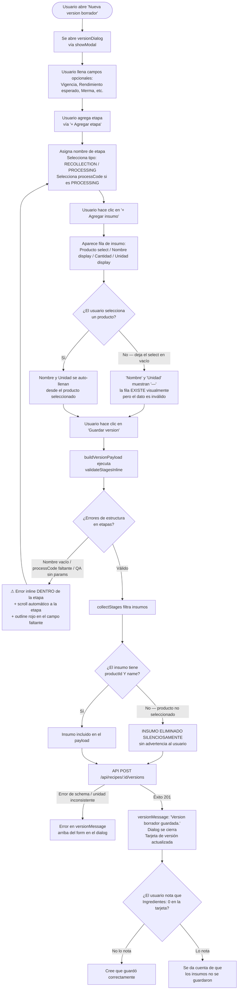
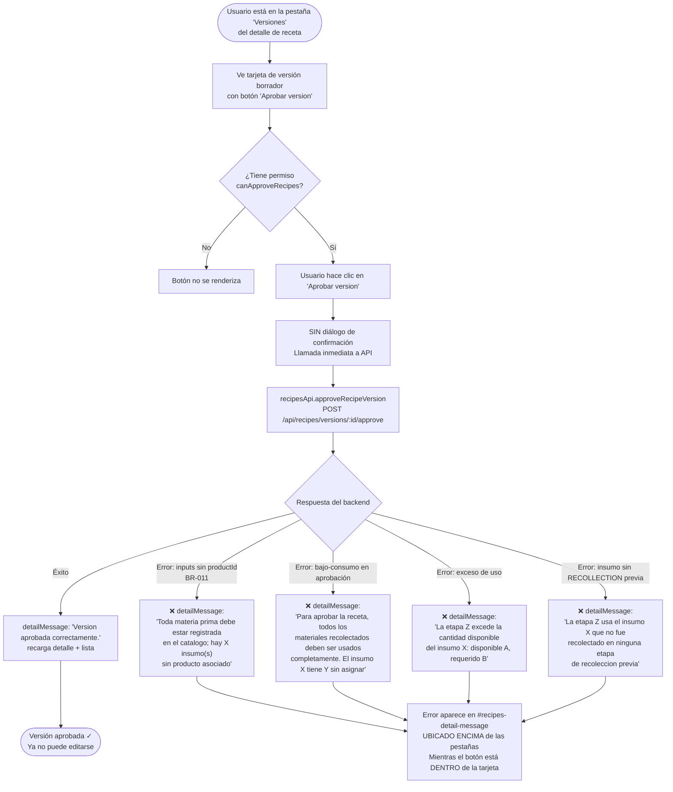
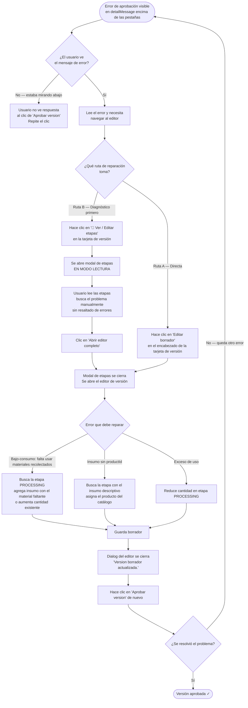
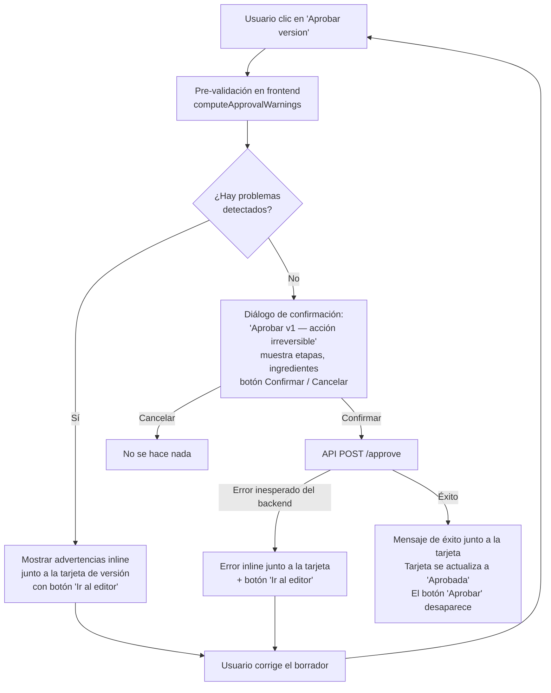

# Auditoría UX — Flujo: Aprobación de una versión de receta incompleta y reparación

**Auditor:** `ux-flow-auditor-00fbdc`  
**Fecha:** 2025-07  
**Modo:** MODE A — Flujo específico  
**Alcance:** Flujo completo de aprobación de una versión de receta que falla por materiales sin usar o sin asignar, más el flujo de reparación; con foco especial en la ubicación de alertas en el frontend y en qué ocurre cuando el usuario deja campos vacíos en el editor.

---

## Tabla de contenido

1. [Objetivo del usuario](#1-objetivo-del-usuario)
2. [Implementación relevante](#2-implementacion-relevante)
3. [Flujo actual reconstruido](#3-flujo-actual-reconstruido)
   - 3a. Flujo del editor de versión (guardado de borrador)
   - 3b. Flujo de aprobación y fallo
   - 3c. Flujo de reparación
4. [Restricciones de negocio](#4-restricciones-de-negocio)
5. [Mapa de ubicación de alertas en el frontend](#5-mapa-de-ubicacion-de-alertas-en-el-frontend)
6. [Qué pasa al dejar campos vacíos](#6-que-pasa-al-dejar-campos-vacios)
7. [Hallazgos UX](#7-hallazgos-ux)
8. [Flujo propuesto](#8-flujo-propuesto)
9. [Métricas: flujo actual vs. propuesto](#9-metricas-flujo-actual-vs-propuesto)
10. [Resumen de cambios recomendados](#10-resumen-de-cambios-recomendados)
11. [Prioridad y quick wins](#11-prioridad-y-quick-wins)
12. [Archivos y componentes afectados](#12-archivos-y-componentes-afectados)

---

## 1. Objetivo del usuario

> El usuario aprobador quiere **aprobar una versión borrador de receta**. La versión puede tener problemas: materiales recolectados no usados completamente, o insumos sin producto asignado en el catálogo. El usuario necesita entender qué está mal, saber dónde arreglarlo, y poder completar la aprobación con el menor esfuerzo posible.

---

## 2. Implementación relevante

| Archivo | Rol en este flujo |
|---|---|
| `src/public/root/views/recipes-admin.js` | Orquestador. Contiene el handler de `data-approve-recipe-version` y el destino del error: `detailMessage` |
| `src/public/root/views/recipes-admin.renderers.js` | Renderiza las tarjetas de versión, el botón "Aprobar version", la ubicación de `#recipes-detail-message` |
| `src/public/root/views/recipes-admin.version-editor.js` | Editor de borrador: `collectStages()`, `validateStagesInline()`, `buildVersionPayload()` |
| `src/public/root/views/recipes-admin.state.js` | `serializeVersionPayloadFromForm()` |
| `src/public/root/recipes-api.js` | `approveRecipeVersion()` — llama a `POST /api/recipes/versions/:id/approve` |
| `src/services/recipe.service.js` | `approveRecipeVersion()`, `assertAllStageInputsHaveProductId()`, `assertRecipeStageLineageAndAllocation()` |
| `src/schemas/recipe.schema.js` | `approveRecipeVersionSchema`, validaciones Zod de etapas e insumos |

---

## 3. Flujo actual reconstruido

### 3a. Flujo del editor de versión: guardado de borrador con campos incompletos



---

### 3b. Flujo de aprobación y fallo



---

### 3c. Flujo de reparación después de error de aprobación



---

## 4. Restricciones de negocio

### RN-01 — Versiones aprobadas son inmutables
**CONFIRMADO** (`recipe.service.js`):
```javascript
if (currentVersion.status === 'APPROVED') {
  throw createHttpError(409, 'Las versiones aprobadas son inmutables; cree una nueva version', 'conflict');
}
```
Aprobar es una **operación irreversible**. Una vez aprobada, la versión no puede editarse. Cualquier corrección requiere crear una nueva versión borrador.

### RN-02 — Aprobación requiere consumo total de materiales recolectados
**CONFIRMADO** (`recipe.service.js → assertRecipeStageLineageAndAllocation('approval')`):
En modo aprobación, cada material declarado en etapas RECOLLECTION debe ser consumido **al 100%** en etapas PROCESSING. No se permite bajo-consumo. En modo borrador, el bajo-consumo está permitido.

### RN-03 — Aprobación requiere que todos los insumos tengan producto de catálogo
**CONFIRMADO** (`recipe.service.js → assertAllStageInputsHaveProductId`):
Ningún `stageInput` puede tener `productId = null` en el momento de la aprobación. Los insumos descriptivos (sin producto) bloquean la aprobación.

### RN-04 — Los insumos PROCESSING solo pueden usar materiales previamente recolectados
**CONFIRMADO** (`assertRecipeStageLineageAndAllocation`):
Las etapas PROCESSING no pueden declarar materiales que no aparezcan en una etapa RECOLLECTION previa. La validación de linaje aplica tanto en borrador como en aprobación.

### RN-05 — La unidad del insumo debe coincidir con la unidad del producto en catálogo
**CONFIRMADO** (`assertStageInputsUnitConsistency`):
Si se declara un insumo con unidad distinta a la del producto en el catálogo, el guardado del borrador falla con un error específico. Esto se valida en POST y PUT de versiones, pero NO se valida en el frontend antes de guardar.

### RN-06 — Permiso separado para gestionar y para aprobar
**CONFIRMADO** (`recipes-admin.helpers.js`):
- `canManageRecipes` = permiso `recipes.manage` → puede crear/editar borradores
- `canApproveRecipes` = permiso `recipes.approve` → puede aprobar versiones

Un usuario puede tener uno sin el otro. El botón "Aprobar version" solo se renderiza si `canApproveRecipes && isDraft`.

---

## 5. Mapa de ubicación de alertas en el frontend

Este es el hallazgo más importante de la auditoría. El siguiente diagrama muestra la estructura del DOM en la vista de recetas y dónde aparece cada tipo de mensaje de error o éxito.

```
VISTA PRINCIPAL (recipes-admin)
│
├── #recipes-page-message          ← mensajes globales de carga/error de página
│
└── .warehouses-workspace (card principal)
    │
    ├── .products-workspace-grid
    │   │
    │   ├── #recipes-list-region   ← lista de recetas (izquierda)
    │   │
    │   └── <aside> #recipes-detail-card  ← panel de detalle (derecha)
    │       │
    │       ├── #recipes-detail-message  ◄──────── AQUÍ aparecen errores de APROBACIÓN
    │       │   aria-live="polite"         y éxitos de aprobación
    │       │
    │       └── #recipes-detail-region
    │           │
    │           └── .stack-section (render del detalle)
    │               ├── [Encabezado: nombre, código, tipo]
    │               │
    │               ├── [Tabs: Resumen / Versiones / Productos asociados]
    │               │                                    ↑
    │               └── [Panel activo — "Versiones"]     │ El usuario está aquí
    │                   │                                │ al hacer clic en
    │                   └── .stack-section               │ "Aprobar version"
    │                       ├── [+ Nueva version borrador]
    │                       └── <article class="products-entry-state">
    │                           ├── [Encabezado: v1 · DRAFT · "Editar borrador" · "Aprobar version"] ← BOTÓN AQUÍ
    │                           ├── [Métricas: Base, Ingredientes, Etapas, Rendimiento, Merma]
    │                           └── [🔬 Ver / Editar etapas]
```

### Distancia visual entre el botón y el error

| Elemento | Posición |
|---|---|
| Botón "Aprobar version" | Dentro de la tarjeta de versión → dentro del panel de "Versiones" → debajo de los tabs |
| `#recipes-detail-message` | Encima de los tabs → encima de todo el contenido del detalle |

**El usuario hace clic en "Aprobar version" (abajo), el error aparece arriba del panel, fuera del viewport si el usuario tiene el scroll bajo.** Esta es la fricción central del flujo de reparación.

---

### Mapa completo de mensajes por operación

| Operación | Resultado | Dónde aparece el mensaje | ID del elemento |
|---|---|---|---|
| Aprobar versión | Éxito | Encima de los tabs, panel de detalle | `#recipes-detail-message` |
| Aprobar versión | Error (bajo-consumo, sin productId, exceso) | Encima de los tabs, panel de detalle | `#recipes-detail-message` |
| Guardar versión borrador | Éxito | Arriba del formulario, DENTRO del dialog del editor | `#recipes-version-message` |
| Guardar versión borrador | Error del backend | Arriba del formulario, DENTRO del dialog del editor | `#recipes-version-message` |
| Guardar versión borrador | Error de estructura (falta etapa) | Arriba del formulario, DENTRO del dialog del editor | `#recipes-version-message` |
| Validación inline de etapa | Error (falta processCode, falta nombre) | DENTRO de la etapa afectada, con scroll automático | `.stage-error-msg` |
| Validación inline de etapa | processCode vacío | Borde rojo en el select + texto en `.stage-error-msg` | `processCodeEl.style.outline` |
| Crear receta (objeto base) | Error | DENTRO del dialog de receta | `#recipes-form-message` |
| Asignar receta a producto | Error | DENTRO del dialog de asignación | `#recipes-assignment-message` |

---

## 6. Qué pasa al dejar campos vacíos

Esta sección traza exactamente qué ocurre campo por campo cuando el usuario los deja vacíos en el editor de versión, y qué pista recibe para resolverlo.

### 6.1 Nombre de la etapa — campo vacío

| Aspecto | Detalle |
|---|---|
| **Comportamiento** | `validateStagesInline()` detecta el nombre vacío |
| **Alerta** | Texto rojo DENTRO de la sección de la etapa: "El nombre de la etapa es obligatorio." |
| **Scroll** | Automático a la primera etapa inválida |
| **Bloqueo** | Sí — no se puede guardar el borrador |
| **Facilidad de resolución** | ✅ Alta — el error está inline en el lugar exacto |

---

### 6.2 Código de proceso (processCode) — campo vacío en etapa PROCESSING

| Aspecto | Detalle |
|---|---|
| **Comportamiento** | `validateStagesInline()` detecta processCode vacío |
| **Alerta 1** | Borde rojo (outline) en el `<select>` de código de proceso |
| **Alerta 2** | Texto rojo dentro de la etapa: "Las etapas de procesamiento requieren un codigo de proceso." |
| **Scroll** | Automático a la primera etapa inválida |
| **Bloqueo** | Sí — no se puede guardar el borrador |
| **Facilidad de resolución** | ✅ Alta — doble señal visual (borde + texto) en el campo correcto |

---

### 6.3 Descripción del proceso (processLabel) — campo vacío cuando processCode = OTHER

| Aspecto | Detalle |
|---|---|
| **Comportamiento** | `validateStagesInline()` detecta processLabel vacío |
| **Alerta** | Borde rojo en el input + texto en `.stage-error-msg` |
| **Bloqueo** | Sí |
| **Facilidad de resolución** | ✅ Alta |

---

### 6.4 Parámetro QA — sin parámetros cuando QA es obligatorio

| Aspecto | Detalle |
|---|---|
| **Comportamiento** | `validateQaParamsInline()` detecta que no hay parámetros |
| **Alerta** | Texto rojo `.qa-params-empty-msg`: "Debes definir al menos un parametro esperado." — visible dentro del bloque QA de la etapa |
| **Bloqueo** | Sí — `validateStagesInline()` retorna false |
| **Facilidad de resolución** | ✅ Alta — la alerta está inline donde debe agregarse el parámetro |

---

### 6.5 Insumo de etapa — producto no seleccionado (select en blanco)

| Aspecto | Detalle |
|---|---|
| **Comportamiento** | `collectStages()` mapea la fila → `productId = Number('') || undefined = undefined`, `name = ''` (de `buildStageInputPatchFromProduct(null)`) → el filtro `.filter(si => si.productId && si.name)` **elimina silenciosamente la fila** |
| **Alerta** | ❌ **NINGUNA** — el draft se guarda con éxito ("Version borrador guardada.") sin mencionar que el insumo fue eliminado |
| **Indicador posterior** | La tarjeta de versión muestra "Ingredientes: 0" (si todos los insumos fueron eliminados) — pero este número tiene el mismo peso visual que los demás métricas |
| **Bloqueo** | No — el borrador se guarda sin el insumo |
| **Facilidad de resolución** | ❌ Muy baja — el usuario no sabe que ocurrió el problema |

**Escenario exacto:** El usuario agrega una fila de insumo, ingresa una cantidad (ej. 100), pero olvida seleccionar el producto. El "Nombre" y "Unidad" muestran "—". Al guardar, el sistema descarta la fila completamente y confirma éxito. El usuario cree que la receta está completa.

---

### 6.6 Insumo de etapa — cantidad no ingresada (input de número vacío)

| Aspecto | Detalle |
|---|---|
| **Comportamiento** | `Number(row.querySelector('.si-quantity').value) || undefined` → `quantity = undefined`. Si hay productId y name, el insumo SE INCLUYE pero con `quantity = undefined` |
| **Serialización** | El payload incluye `{ productId: X, name: "Producto", quantity: undefined, unit: "KG" }` |
| **Backend (borrador)** | `quantity` llega como `null` (JSON serializa `undefined` → omite el campo → backend lo recibe como null). La validación Zod acepta: `quantity: z.coerce.number().positive().optional().nullable()`. El insumo se guarda con `quantity = null` |
| **Impacto en aprobación** | `assertRecipeStageLineageAndAllocation` usa `Number(input.quantity) || 0` → quantity null = 0. Si la etapa es RECOLLECTION: se "recolectan" 0 kg. Si es PROCESSING: se "usan" 0 kg. El balance puede cuadrar en 0 pero el insumo es operativamente inútil |
| **Alerta** | ❌ **NINGUNA** — ni en el editor ni en la aprobación |
| **Facilidad de resolución** | ❌ Baja — el problema aparece en producción, no en el sistema |

---

### 6.7 Campos de versión opcionales — vacíos (vigencia, rendimiento, merma, tolerancias)

| Aspecto | Detalle |
|---|---|
| **Comportamiento** | `parseOptionalNumber()` y `parseOptionalDate()` retornan `undefined`. El payload no incluye estos campos. El backend los acepta como null |
| **Alerta** | Ninguna — son opcionales legítimamente |
| **Impacto** | Sin impacto en la aprobación |
| **Facilidad de resolución** | N/A — son opcionales |

---

## 7. Hallazgos UX

---

### UX-REC-001

**ID:** UX-REC-001  
**Severidad:** Critical  
**Área:** Botón "Aprobar version" — falta de confirmación  
**Objetivo del usuario:** Aprobar una versión de receta con seguridad

**Comportamiento actual:**  
El botón "Aprobar version" dispara la llamada al API **inmediatamente**, sin ningún diálogo de confirmación:

```javascript
// recipes-admin.js — handler del botón Aprobar
const approveVersionButton = target instanceof HTMLElement
  ? target.closest('[data-approve-recipe-version]') : null;
if (approveVersionButton instanceof globalScope.HTMLButtonElement) {
  const versionId = approveVersionButton.getAttribute('data-approve-recipe-version');
  if (!versionId) { return; }

  try {
    await recipesApi.approveRecipeVersion(session, versionId, {});   // ← directo, sin confirm()
    detailMessage.innerHTML = rootShellUi.renderInlineMessage('Version aprobada correctamente.', 'success');
    ...
```

**Problema:**  
La aprobación es **irreversible por diseño** (RN-01): una versión aprobada no puede editarse. Para corregir un error en una versión aprobada por accidente se debe crear una nueva versión desde cero. Un clic inadvertido en el botón incorrecto de la lista (si hay múltiples borradores) causa trabajo de recuperación costoso.

**Impacto en el usuario:**  
Riesgo de aprobar la versión equivocada o aprobar prematuramente una versión que aún estaba en revisión. La operación no tiene reversión posible en el sistema.

**Evidencia:**  
- `recipes-admin.js` — handler de `data-approve-recipe-version`: sin confirmación previa  
- `recipe.service.js` → `approveRecipeVersion`: marca estado como `APPROVED` de forma permanente  
- `recipe.service.js` → `updateRecipeVersion`: `if (currentVersion.status === 'APPROVED') throw 409`

**Restricción de negocio:** La irreversibilidad es una restricción de negocio legítima (integridad de auditoría). Lo que no es una restricción es la ausencia de confirmación.

**Principio UX:** *Error prevention* (Nielsen #5) — La acción destructiva / irreversible más importante del flujo no tiene ningún mecanismo de prevención.

**Recomendación:**  
Agregar un diálogo de confirmación modal antes de llamar al API:

```javascript
// Antes del try/catch de approveRecipeVersion:
const versionLabel = approveVersionButton.getAttribute('data-version-label') || 'esta version';
const confirmed = globalScope.confirm(
  `¿Aprobar ${versionLabel}?\n\nUna vez aprobada, la version no puede editarse. Cualquier corrección requiere crear una nueva version borrador.`
);
if (!confirmed) return;
```

O mejor, un mini-dialog `<dialog>` que muestre:
- El número de versión
- Cuántas etapas e ingredientes tiene
- La advertencia de irreversibilidad
- Botones "Confirmar aprobación" y "Cancelar"

**Mejora esperada:** Previene aprobaciones accidentales. La confirmación también actúa como recordatorio del impacto antes de comprometerse.

**Complejidad de implementación:** Baja-Media (usando `confirm()` nativo) o Media (usando `<dialog>` personalizado).

---

### UX-REC-002

**ID:** UX-REC-002  
**Severidad:** Critical  
**Área:** Insumos de etapa — eliminación silenciosa sin alerta  
**Objetivo del usuario:** Guardar un borrador con todos los insumos que ingresó

**Comportamiento actual:**  
Cuando el usuario agrega una fila de insumo en el editor pero **no selecciona un producto**, la función `collectStages()` filtra la fila silenciosamente. El mensaje de éxito aparece normalmente:

```javascript
// recipes-admin.version-editor.js — collectStages()
stageInputs: Array.from(inputRows).map((row) => {
  const productIdValue = row.querySelector('.si-product')?.value || '';
  const product = resolveProduct(productIdValue);
  const productPatch = recipesHelpers.buildStageInputPatchFromProduct(product);
  return {
    productId: Number(productIdValue) || undefined,   // undefined si no seleccionó
    name: productPatch.name,                           // '' si no seleccionó
    quantity: Number(row.querySelector('.si-quantity').value) || undefined,
    unit: productPatch.unit || undefined,
    inputQuantityBasis,
  };
}).filter((stageInput) => stageInput.productId && stageInput.name),  // ← FILTRO SILENCIOSO
```

```javascript
// recipes-admin.js — form submit de versionForm (éxito)
versionMessage.innerHTML = rootShellUi.renderInlineMessage(
  'Version borrador guardada.',  // ← mensaje de éxito sin advertencia de insumos eliminados
  'success'
);
```

**Problema:**  
El usuario ve "Version borrador guardada" y asume que su trabajo quedó guardado. Las filas incompletas desaparecen sin rastro. La tarjeta de versión muestra "Ingredientes: 0" si todos los insumos fueron descartados, pero este contador tiene el mismo peso visual que "Etapas: 2" o "Rendimiento esperado: No definido" — no es obvio que algo salió mal.

**Impacto en el usuario:**  
Alto: el usuario descubre el problema solo cuando intenta aprobar, recibe un error confuso, y no puede rastrear qué pasó con los insumos que "guardó". Puede llevarle varios ciclos de edición entender que debe seleccionar el producto antes de ingresar la cantidad.

**Evidencia:**  
- `recipes-admin.version-editor.js` → `collectStages()` → `.filter((si) => si.productId && si.name)`
- `recipes-admin.js` → submit de `versionForm` → sin inspección del conteo de insumos
- No hay ninguna advertencia en ninguna parte del código para este caso

**Restricción de negocio:** El filtro existe para evitar enviar insumos vacíos al backend. Es correcto. El problema es la ausencia de feedback al usuario sobre los insumos descartados.

**Principio UX:** *Visibility of system status* (Nielsen #1) — El sistema toma una decisión significativa (descartar datos del usuario) sin comunicarla.

**Recomendación:**  
Antes de llamar al API, calcular cuántos insumos fueron descartados y advertir al usuario:

```javascript
// En buildVersionPayload() o en el submit handler:
const totalInputRows = stagesList.querySelectorAll('.stage-input-row').length;
const validInputs = stages.reduce((sum, s) => sum + s.stageInputs.length, 0);
const droppedCount = totalInputRows - validInputs;

if (droppedCount > 0) {
  versionMessage.innerHTML = rootShellUi.renderInlineMessage(
    `${droppedCount} fila(s) de insumo sin producto seleccionado fueron ignoradas. Asigna un producto del catálogo a cada insumo para que quede guardado.`,
    'warning'
  );
  return;  // bloquear guardado y forzar corrección
}
```

Opción alternativa (menos estricta): guardar igualmente pero mostrar la advertencia junto al éxito para que el usuario decida si necesita editar.

**Mejora esperada:** El usuario entiende inmediatamente que tiene filas incompletas y puede corregirlas antes de creer que el trabajo está terminado.

**Complejidad de implementación:** Baja (comparar conteo antes y después del filtro).

---

### UX-REC-003

**ID:** UX-REC-003  
**Severidad:** High  
**Área:** Ubicación del error de aprobación  
**Objetivo del usuario:** Ver qué salió mal después de intentar aprobar

**Comportamiento actual:**  
El error de aprobación se escribe en `detailMessage` (`#recipes-detail-message`), que está posicionado **encima de las pestañas** del panel de detalle. El botón "Aprobar version" está **dentro de una tarjeta** en el contenido de la pestaña "Versiones", que a su vez está debajo de los tabs.

```
#recipes-detail-message  ← error aparece AQUÍ (arriba)
    [Tabs: Resumen | Versiones | Productos]
        [Panel de Versiones]
            [Tarjeta v1]
                [Botón "Aprobar version"]  ← usuario hizo clic AQUÍ (abajo)
```

Cuando el usuario hace clic en "Aprobar version", su mirada está en el área del botón (abajo del panel). El error aparece en un área diferente (arriba del panel). Si el panel tiene scroll, el error puede estar completamente fuera del viewport.

**Impacto en el usuario:**  
El usuario no ve respuesta al clic. Puede repetir la acción pensando que no respondió, o buscar activamente el mensaje sin saber dónde mirarlo.

**Evidencia:**  
```javascript
// recipes-admin.js — handler de aprobación
try {
  await recipesApi.approveRecipeVersion(session, versionId, {});
  detailMessage.innerHTML = rootShellUi.renderInlineMessage('Version aprobada correctamente.', 'success');
} catch (error) {
  detailMessage.innerHTML = rootShellUi.renderInlineMessage(error?.message || '...', 'error');
}
```
```javascript
// recipes-admin.renderers.js — el detailMessage está ANTES que los tabs
// En renderRecipeDetail():
return `
  <div class="stack-section">
    ${renderDetailHeader(...)}
    ${renderTabs(activeTab)}          ← tabs
    <div ...>${renderVersionsTab(...)}</div>  ← contenido que incluye el botón
  </div>
`;
// detailMessage está en el template HTML encima de detailRegion (renderRecipeDetail)
```

**Restricción de negocio:** Ninguna. La ubicación del mensaje es una decisión de diseño.

**Principio UX:** *Visibility of system status* (Nielsen #1) + *Spatial proximity* (Gestalt) — el feedback debe aparecer cerca del elemento que lo generó.

**Recomendación:**  
Dos opciones:

**Opción A (quick win):** Hacer scroll automático al `detailMessage` después de escribir el error:
```javascript
} catch (error) {
  detailMessage.innerHTML = rootShellUi.renderInlineMessage(error?.message, 'error');
  detailMessage.scrollIntoView({ behavior: 'smooth', block: 'start' });
}
```

**Opción B (mejor):** Escribir el error también inline dentro de la tarjeta de versión afectada, usando un elemento de mensaje local por versión (ej. `data-version-message="${versionId}"`). Esto mantiene el error junto al botón que lo disparó.

**Mejora esperada:** El usuario ve el error inmediatamente después de hacer clic, sin tener que buscar en otro lugar de la pantalla.

**Complejidad de implementación:** Baja para Opción A. Media para Opción B.

---

### UX-REC-004

**ID:** UX-REC-004  
**Severidad:** High  
**Área:** Ausencia de pre-validación de balance RECOLLECTION/PROCESSING antes de aprobar  
**Objetivo del usuario:** Saber que la versión está lista para aprobar antes de intentarlo

**Comportamiento actual:**  
El frontend tiene disponible la lógica de balance `computeRecollectedBalances()` en el editor de versiones. Esta función calcula exactamente si los materiales recolectados son consumidos completamente en las etapas PROCESSING. Sin embargo, **esta función no se ejecuta en ningún momento fuera del editor** — solo se usa para mostrar hints visuales durante la edición.

Al momento de hacer clic en "Aprobar version", el frontend no ejecuta ninguna validación previa. El único lugar donde se detecta el bajo-consumo es el backend, que responde con un error después de llamar al API.

**Impacto en el usuario:**  
El usuario descubre que el balance está incorrecto **solo después de intentar aprobar**. En una receta compleja con múltiples etapas, el error del backend identifica el insumo problemático por nombre, pero el usuario debe navegar al editor, recordar qué etapa tiene ese insumo, y ajustar cantidades sin una visualización del balance global.

**Evidencia:**  
```javascript
// computeRecollectedBalances existe y funciona en el editor:
function computeRecollectedBalances(upToSection) { ... }  // usado para hints en tiempo real

// Pero al aprobar, no se llama:
const approveVersionButton = target.closest('[data-approve-recipe-version]');
if (approveVersionButton) {
  // Llamada directa al API sin ninguna validación de balance previa
  await recipesApi.approveRecipeVersion(session, versionId, {});
}
```

**Restricción de negocio:** Ninguna. La validación de balance ya está implementada en el frontend para el editor. Reutilizarla antes de aprobar es técnicamente factible.

**Principio UX:** *Error prevention* (Nielsen #5) — El sistema tiene la información para detectar el problema antes de que el usuario lo cometa.

**Recomendación:**  
Antes de llamar al API de aprobación, ejecutar una validación de balance sobre la versión cargada y mostrar el resultado al usuario:

```javascript
// En el handler del botón "Aprobar version":
const version = getSelectedRecipeVersions().find(v => String(v?.id) === String(versionId));
if (version) {
  const warnings = computeApprovalWarnings(version);
  if (warnings.length > 0) {
    detailMessage.innerHTML = rootShellUi.renderInlineMessage(
      `Esta version tiene ${warnings.length} problema(s) que bloquearán la aprobación:\n${warnings.join('\n')}`,
      'warning'
    );
    detailMessage.scrollIntoView({ behavior: 'smooth', block: 'start' });
    return;
  }
}
// Si no hay advertencias, continuar con la aprobación (con confirmación)
```

Donde `computeApprovalWarnings(version)` replica la lógica de `assertRecipeStageLineageAndAllocation` en el frontend usando los datos de la versión cargada.

**Mejora esperada:** El usuario recibe el diagnóstico de problemas sin necesitar hacer un round-trip al servidor. Reduce ciclos de edición-aprobación-error.

**Complejidad de implementación:** Media (adaptar la lógica existente de `computeRecollectedBalances` para operar sobre datos de versión en lugar del formulario).

---

### UX-REC-005

**ID:** UX-REC-005  
**Severidad:** High  
**Área:** Error de aprobación — sin enlace de acción a la reparación  
**Objetivo del usuario:** Pasar del error al editor de versión para corregir el problema

**Comportamiento actual:**  
Cuando la aprobación falla, el mensaje de error aparece en `#recipes-detail-message`. El mensaje contiene el texto del error del backend (específico y útil) pero **no incluye ningún botón de acción** para ir directamente al editor del borrador.

```javascript
// El error se muestra así:
detailMessage.innerHTML = rootShellUi.renderInlineMessage(
  error?.message || 'No se pudo aprobar la version.',
  'error'
);
// renderInlineMessage() genera solo texto — no incluye botones de acción
```

Después de ver el error, el usuario debe:
1. Leer el error y entender qué problema tiene (a veces técnico: "insumo sin producto asociado")
2. Localizar visualmente el botón "Editar borrador" en la tarjeta de versión (abajo del panel)
3. Hacer clic en "Editar borrador"
4. En el editor, encontrar manualmente el problema (qué etapa, qué insumo)

**Impacto en el usuario:**  
El path crítico "error → corrección" requiere al menos 2-3 clics adicionales y búsqueda visual en una pantalla densa. En versiones con muchas etapas, encontrar el insumo problemático dentro del editor puede ser difícil.

**Evidencia:**  
- `recipes-admin.js` → error de aprobación: solo texto en `detailMessage`
- `recipes-admin.renderers.js` → `renderVersionsTab`: "Editar borrador" y "🔬 Ver / Editar etapas" son los únicos caminos al editor, ambos en la tarjeta de versión (separados del error)

**Restricción de negocio:** Ninguna.

**Principio UX:** *Help users recognize, diagnose, and recover from errors* (Nielsen #9).

**Recomendación:**  
El mensaje de error debe incluir un botón de acción contextual que lleve directamente al editor del borrador que falló:

```javascript
} catch (error) {
  const errorMsg = error?.message || 'No se pudo aprobar la version.';
  detailMessage.innerHTML = `
    <div class="inline-message inline-message--error">
      <p>${rootShellUi.escapeHtml(errorMsg)}</p>
      <button type="button" data-edit-recipe-version="${rootShellUi.escapeHtml(String(versionId))}"
              class="secondary-button" style="margin-top:0.5rem">
        ✏ Ir al editor para corregir
      </button>
    </div>
  `;
  detailMessage.scrollIntoView({ behavior: 'smooth', block: 'start' });
}
```

El botón usa el mismo `data-edit-recipe-version` que ya existe, por lo que el handler existente lo capturará automáticamente.

**Mejora esperada:** Reduce el tiempo de recuperación de errores de ~4 pasos a 2 pasos (leer error → clic en "Ir al editor").

**Complejidad de implementación:** Baja (modificar el catch del handler de aprobación).

---

### UX-REC-006

**ID:** UX-REC-006  
**Severidad:** High  
**Área:** Modal de etapas — sin diagnóstico de problemas en modo lectura  
**Objetivo del usuario:** Usar "🔬 Ver / Editar etapas" como herramienta de diagnóstico antes de editar

**Comportamiento actual:**  
El modal "🔬 Ver / Editar etapas" abre una vista de solo lectura de las etapas de la versión. La función `renderStagesModalContent()` muestra cada etapa con sus insumos en una tabla (nombre, producto, cantidad, unidad). No hay ningún indicador de:
- Si un insumo carece de producto (`si.product?.name || si.product?.code || '—'` muestra '—' sin señal visual de alerta)
- Si el balance de RECOLLECTION vs PROCESSING está desbalanceado
- Si algún insumo tiene cantidad null/0

```javascript
// recipes-admin.renderers.js — renderStagesModalContent()
// No hay resaltado de errores — todos los insumos se muestran igual
${inputs.map((si) => `
  <tr>
    <td>${rootShellUi.escapeHtml(si.name || '—')}</td>
    <td>${rootShellUi.escapeHtml(si.product?.name || si.product?.code || '—')}</td>  ← '—' sin advertencia
    <td>${rootShellUi.escapeHtml(si.quantity != null ? String(si.quantity) : '—')}</td>
    <td>${rootShellUi.escapeHtml(si.unit || '—')}</td>
  </tr>
`).join('')}
```

**Además:** Si el usuario llega al modal desde "🔬 Ver / Editar etapas" con la intención de editar (después del error de aprobación), debe hacer un clic adicional en "Abrir editor completo" para llegar al editor real. Este es un paso que no aporta valor para el flujo de reparación.

**Impacto en el usuario:**  
El usuario que usa el modal como diagnóstico no puede identificar visualmente cuál insumo tiene el problema. Debe comparar mentalmente la lista del modal contra el mensaje de error del backend.

**Evidencia:**  
- `recipes-admin.renderers.js` → `renderStagesModalContent()`: no hay resaltado de errores
- `recipes-admin.js` → handler de "Abrir editor completo": extra paso innecesario para el flujo de reparación

**Restricción de negocio:** Ninguna.

**Principio UX:** *Error diagnosis* — El sistema debería ayudar al usuario a identificar exactamente qué está mal, no solo describir el error en texto.

**Recomendación:**  
1. En el modal de etapas, resaltar las filas problemáticas en rojo cuando el contexto es post-error:
   - Insumos sin producto (`si.product === null`) → fila en rojo + ícono ⚠
   - Insumos con cantidad 0 o null → cantidad en naranja
2. Mostrar un resumen de balance RECOLLECTION vs PROCESSING al final del modal cuando hay etapas de ambos tipos.
3. Hacer que "🔬 Ver / Editar etapas" abra **directamente el editor** cuando la versión es un borrador (`isDraft = true`), eliminando el paso intermedio del modal de solo lectura (o al menos cambiar el texto del botón a "✏ Editar etapas" cuando es borrador).

**Mejora esperada:** El modal de diagnóstico muestra exactamente qué está mal. El flujo de reparación reduce un paso para borradores.

**Complejidad de implementación:** Media (requiere pasar contexto de errores al modal y calcular balance en el renderer).

---

### UX-REC-007

**ID:** UX-REC-007  
**Severidad:** Medium  
**Área:** Tarjeta de versión — contador "Ingredientes: 0" sin alerta de advertencia  
**Objetivo del usuario:** Confirmar que la versión tiene los ingredientes correctos antes de aprobar

**Comportamiento actual:**  
La tarjeta de versión muestra las métricas principales en un `detail-grid`:

```javascript
// recipes-admin.renderers.js
<div class="detail-grid">
  <article class="detail-item"><span>Base de cantidades</span><strong>...</strong></article>
  <article class="detail-item"><span>Ingredientes</span><strong>0</strong></article>  ← sin alerta
  <article class="detail-item"><span>Etapas</span><strong>2</strong></article>
  <article class="detail-item"><span>Rendimiento esperado</span><strong>No definido</strong></article>
  <article class="detail-item"><span>Merma esperada</span><strong>No definida</strong></article>
</div>
```

Cuando el usuario guardó el borrador con insumos incompletos (UX-REC-002), la métrica "Ingredientes" muestra `0`. Sin embargo, no hay ningún color especial, ícono de advertencia ni texto diferencial para indicar que 0 ingredientes en una versión de receta es probablemente un error.

**Impacto en el usuario:**  
El usuario que no sabe cuántos ingredientes debería tener la receta no detecta el problema hasta intentar aprobar.

**Evidencia:**  
- `recipes-admin.renderers.js` → `renderVersionsTab` → `detail-grid`
- El valor `version.ingredients.length` puede ser 0 sin ningún indicador de problema

**Principio UX:** *Recognition over recall* — el sistema debería señalar proactivamente estados potencialmente erróneos.

**Recomendación:**  
Agregar condicional visual para "Ingredientes: 0":

```javascript
const ingredientsCount = (version?.ingredients || []).length;
const ingredientsDisplay = ingredientsCount === 0
  ? `<span style="color:var(--color-warning,#a15c00)">⚠ 0 ingredientes — puede indicar insumos incompletos</span>`
  : rootShellUi.escapeHtml(String(ingredientsCount));
```

**Mejora esperada:** El usuario ve la advertencia en la tarjeta de versión y puede investigar antes de intentar aprobar.

**Complejidad de implementación:** Baja (condicional en el renderer).

---

### UX-REC-008

**ID:** UX-REC-008  
**Severidad:** Medium  
**Área:** Insumos con cantidad vacía — sin validación  
**Objetivo del usuario:** Guardar un borrador con cantidades válidas en todos los insumos

**Comportamiento actual:**  
Si el usuario agrega un insumo con producto seleccionado pero sin cantidad, el insumo se guarda con `quantity = null`. No hay advertencia ni validación en el frontend. En el backend (modo borrador), la validación Zod acepta `quantity: null` ya que el campo es `optional().nullable()`. El insumo queda en el borrador con cantidad nula, lo que lo hace operativamente inútil.

**Impacto en el usuario:**  
Bajo en aprobación (el balance de null=0 puede no bloquear), pero alto en producción: si se genera una orden de producción basada en esta receta, el insumo sin cantidad producirá un requerimiento de 0 unidades, que pasará desapercibido hasta ejecución.

**Evidencia:**  
```javascript
// collectStages() — la cantidad null pasa el filtro:
.filter((stageInput) => stageInput.productId && stageInput.name)
// productId ✓, name ✓ → el insumo con quantity=undefined pasa
```

**Principio UX:** *Error prevention* (Nielsen #5).

**Recomendación:**  
Agregar validación en `validateStagesInline()` o en `collectStages()`:
```javascript
if (!stageInput.quantity || stageInput.quantity <= 0) {
  // Mostrar advertencia inline en la fila del insumo
  // o bloquear guardado
}
```

Mostrar como advertencia (no bloqueo) para no interrumpir flujos de borrador en progreso donde la cantidad se definirá después.

**Complejidad de implementación:** Baja.

---

### UX-REC-009

**ID:** UX-REC-009  
**Severidad:** Low  
**Área:** Flujo de reparación — ruta de 2 clics hacia el editor via modal  
**Objetivo del usuario:** Ir al editor para corregir el problema lo más rápido posible

**Comportamiento actual:**  
Existen dos rutas desde la tarjeta de versión hacia el editor:

| Ruta | Clicks | Resultado |
|---|---|---|
| Clic en "Editar borrador" (header de tarjeta) | 1 | Abre el editor directamente |
| Clic en "🔬 Ver / Editar etapas" → "Abrir editor completo" | 2 | Primero modal de solo lectura, luego editor |

La ruta de 2 clics tiene el botón más prominente ("🔬 Ver / Editar etapas") en una posición dedicada debajo de las métricas. La ruta de 1 clic ("Editar borrador") está en el encabezado de la tarjeta, mezclado entre el badge de estado y el botón "Aprobar version".

Los usuarios que quieren diagnosticar antes de editar seguirán la ruta de 2 clics. Pero para el flujo de reparación post-error, es una fricción innecesaria si el diagnóstico ya fue dado por el mensaje de error del backend.

**Restricción de negocio:** El modal de solo lectura tiene valor para versiones aprobadas (donde no hay editor disponible). Para borradores es un paso opcional.

**Recomendación:**  
Cambiar el label del botón "🔬 Ver / Editar etapas" a "✏ Editar etapas" para borradores (`isDraft = true`) y que abra directamente el editor sin pasar por el modal de lectura. El modal de lectura sigue disponible para versiones aprobadas.

**Complejidad de implementación:** Baja.

---

## 8. Flujo propuesto

### Flujo propuesto para guardado de borrador (incorpora UX-REC-002, UX-REC-008)

```
Usuario edita versión → agrega insumos → intenta guardar
                                              ↓
                              buildVersionPayload detecta filas sin producto
                                              ↓
                          ┌─────────────────────────────────────────────┐
                          │ ⚠ Advertencia ANTES de guardar:             │
                          │ "2 fila(s) sin producto seleccionado.        │
                          │  Asigna un producto a cada insumo para      │
                          │  que quede registrado en el borrador."       │
                          │                                             │
                          │ [Corregir]  [Guardar de todas formas]        │
                          └─────────────────────────────────────────────┘
```

### Flujo propuesto para aprobación (incorpora UX-REC-001, UX-REC-003, UX-REC-004, UX-REC-005)



---

## 9. Métricas: flujo actual vs. propuesto

> ⚠️ Métricas heurísticas comparativas, no mediciones científicas.

### Escenario: borrador con insumos incompletos → corrección → aprobación

| Métrica | Flujo actual | Flujo propuesto |
|---|---|---|
| Pasos totales | 14 | 10 |
| Clicks sin valor añadido | 3 (cierre de modal diagnóstico, clic repetido por falta de feedback, búsqueda del botón editar) | 0 |
| Ciclos de error → corrección → retry | 2+ (no hay pre-validación) | 1 (pre-validación elimina la primera iteración) |
| Confirmaciones antes de acción irreversible | 0 | 1 (diálogo de confirmación) |
| Distancia visual error → acción | Alta (error arriba, botón abajo, sin scroll) | Baja (error junto al botón, con enlace directo al editor) |
| Ingredientes eliminados con advertencia | No | Sí |
| Pre-diagnóstico antes de llamar al API | No | Sí |

---

## 10. Resumen de cambios recomendados

| ID | Cambio | Archivos a modificar | Complejidad |
|---|---|---|---|
| UX-REC-001 | Diálogo de confirmación antes de aprobar (irreversible) | `recipes-admin.js` | **Baja** (confirm nativo) / **Media** (`<dialog>`) |
| UX-REC-002 | Detectar y advertir sobre insumos descartados antes de guardar borrador | `recipes-admin.version-editor.js` | **Baja** |
| UX-REC-003 | Scroll automático a `#recipes-detail-message` tras error de aprobación | `recipes-admin.js` | **Baja** |
| UX-REC-004 | Pre-validación de balance RECOLLECTION/PROCESSING antes de llamar al API de aprobación | `recipes-admin.js` (nueva función `computeApprovalWarnings`) | **Media** |
| UX-REC-005 | Botón "Ir al editor para corregir" en el mensaje de error de aprobación | `recipes-admin.js` | **Baja** |
| UX-REC-006 | Resaltar insumos problemáticos en el modal de etapas + directo al editor para borradores | `recipes-admin.renderers.js`, `recipes-admin.js` | **Media** |
| UX-REC-007 | Alerta visual cuando "Ingredientes: 0" en la tarjeta de versión | `recipes-admin.renderers.js` | **Baja** |
| UX-REC-008 | Advertencia de cantidad vacía en insumos del editor | `recipes-admin.version-editor.js` | **Baja** |
| UX-REC-009 | Botón "🔬 Ver/Editar etapas" → directamente al editor para borradores | `recipes-admin.js`, `recipes-admin.renderers.js` | **Baja** |

---

## 11. Prioridad y quick wins

### Prioridad 1 — Crítico, debe implementarse primero

| ID | Justificación |
|---|---|
| **UX-REC-001** | Aprobación irreversible sin confirmación = riesgo de pérdida de trabajo. Una línea de confirm() lo resuelve |
| **UX-REC-002** | Datos del usuario se eliminan silenciosamente. Causa el mayor daño cognitivo y pérdida de confianza en el sistema |

### Prioridad 2 — Alto impacto, complejidad baja (Quick Wins)

| ID | Justificación |
|---|---|
| **UX-REC-003** | Scroll al error = 1 línea de código. Resuelve el problema de "el usuario no ve la respuesta" |
| **UX-REC-005** | Botón de acción en el error = conecta el diagnóstico con la solución |
| **UX-REC-007** | Alerta en "Ingredientes: 0" = señal temprana antes de intentar aprobar |
| **UX-REC-009** | Botón de etapas directo al editor = elimina un clic del flujo de reparación |

### Prioridad 3 — Alto impacto, complejidad media

| ID | Justificación |
|---|---|
| **UX-REC-004** | Pre-validación de balance elimina ciclos de error → corrección → retry |
| **UX-REC-006** | Modal de diagnóstico con resaltado de errores |
| **UX-REC-008** | Prevención de cantidades nulas en insumos |

---

## 12. Archivos y componentes afectados

| Archivo | Hallazgos | Tipo de cambio |
|---|---|---|
| `src/public/root/views/recipes-admin.js` | UX-REC-001, UX-REC-003, UX-REC-004, UX-REC-005, UX-REC-009 | Handler de aprobación, scroll, pre-validación, botón en error |
| `src/public/root/views/recipes-admin.version-editor.js` | UX-REC-002, UX-REC-008 | `collectStages()`, `validateStagesInline()`, submit handler |
| `src/public/root/views/recipes-admin.renderers.js` | UX-REC-006, UX-REC-007, UX-REC-009 | `renderVersionsTab()`, `renderStagesModalContent()` |
| `src/services/recipe.service.js` | Ninguno — la lógica de backend es correcta y los mensajes de error son descriptivos | Solo lectura |
| `src/schemas/recipe.schema.js` | Ninguno — el esquema es correcto | Solo lectura |

---

*Auditoría generada por `ux-flow-auditor-00fbdc`. No se modificó ningún código de la aplicación durante este análisis.*
