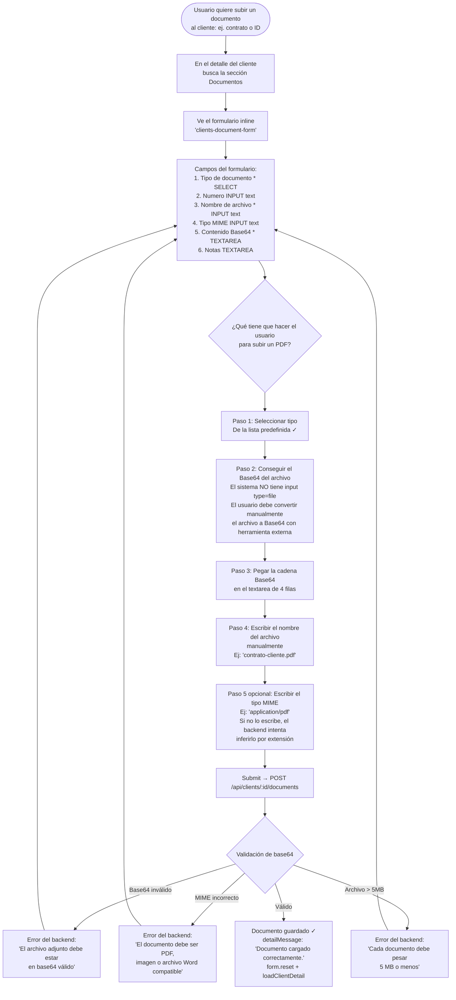
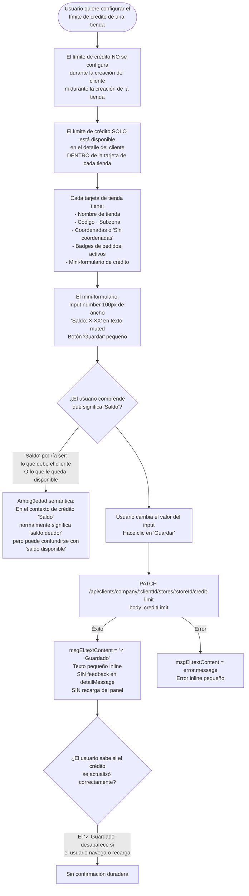
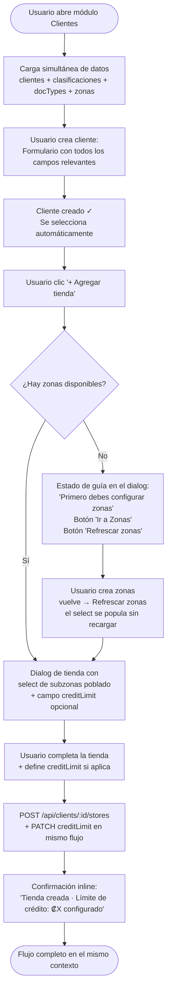

# Auditoría UX — Flujo: Crear cliente con nueva zona/subzona, tienda, documentos y límite de crédito

**Auditor:** `ux-flow-auditor-00fbdc`  
**Fecha:** 2025-07  
**Modo:** MODE A — Flujo específico  
**Alcance:** Creación de cliente → creación de zona + subzona cuando no existen → creación de tienda → carga de documentos → configuración de límite de crédito. Análisis del contrato actual del backend para determinar restricciones de negocio vs. complejidad de UX evitable.

---

## Tabla de contenido

1. [Objetivo del usuario](#1-objetivo-del-usuario)
2. [Implementación relevante](#2-implementacion-relevante)
3. [Flujo actual reconstruido](#3-flujo-actual-reconstruido)
4. [Restricciones de negocio confirmadas](#4-restricciones-de-negocio-confirmadas)
5. [Mapa de dependencias estructurales](#5-mapa-de-dependencias-estructurales)
6. [Hallazgos UX](#6-hallazgos-ux)
7. [Flujo propuesto](#7-flujo-propuesto)
8. [Métricas: flujo actual vs. propuesto](#8-metricas-flujo-actual-vs-propuesto)
9. [Resumen de cambios recomendados](#9-resumen-de-cambios-recomendados)
10. [Prioridad y quick wins](#10-prioridad-y-quick-wins)
11. [Archivos y componentes afectados](#11-archivos-y-componentes-afectados)

---

## 1. Objetivo del usuario

> El usuario administrador quiere **registrar un cliente nuevo con al menos una tienda**, asignándola a una subzona. Si no existe la subzona o la zona, debe crearlas primero. Luego quiere **subir documentos del cliente** (contrato, identificación, solicitud de crédito) y **configurar el límite de crédito** de la tienda.

Este es uno de los flujos de onboarding más frecuentes en un sistema comercial. Cualquier fricción en él impacta directamente la adopción del sistema.

---

## 2. Implementación relevante

| Archivo | Rol |
|---|---|
| `src/public/root/views/clients-admin.js` | Orquestador principal: carga datos, formularios de creación, handlers de submit |
| `src/public/root/views/clients-admin.renderers.js` | Renderiza el detalle del cliente: tiendas, documentos, formulario de crédito |
| `src/public/root/views/clients-admin.helpers.js` | `buildClientPayload`, `buildDocumentPayload`, `buildStorePayload` |
| `src/public/root/views/clients-admin.state.js` | `flattenZoneOptions` — aplana zonas/subzonas en lista plana |
| `src/public/root/views/clients-admin-store-dialog.js` | Dialog de creación de tienda: formulario + mapa Leaflet + geocoding |
| `src/public/root/views/zones-admin.js` | Módulo separado para crear zonas y subzonas |
| `src/public/root/clients-api.js` | API client: `listZones`, `createStore`, `uploadDocument`, `updateStoreCreditLimit`, `downloadDocument` |
| `src/schemas/client.schema.js` | Contratos de validación: `createCompanyClientSchema`, `createClientStoreSchema`, `uploadClientDocumentSchema`, `updateClientStoreCreditLimitSchema` |
| `src/services/client.service.js` | Lógica de negocio: validación de subregión, creación de tienda, documentos |
| `src/lib/client-document-types.js` | Catálogo de tipos de documento permitidos |
| `src/lib/sensitive-file-governance.js` | Validación de archivos Base64: tipos MIME, tamaño, extensión |

---

## 3. Flujo actual reconstruido

### 3a. Carga inicial — las zonas se cargan una sola vez al montar la vista

```javascript
// clients-admin.js — loadClients()
const [clientsResponse, classificationsResponse, documentTypesResponse, zonesResponse] = await Promise.all([
  clientsApi.listClients(session),
  clientsApi.listClassifications(session),
  clientsApi.listDocumentTypes(session),
  clientsApi.listZones(session),    // GET /api/regions/company
]);
zoneOptions = clientsState.flattenZoneOptions(zonesResponse);
```

Las zonas se cargan **una sola vez** al montar la vista. Si no hay zonas en ese momento, `zoneOptions = []`. Si el usuario crea zonas en el módulo separado y vuelve a clientes, la lista seguirá vacía **hasta que recargue la vista completa** (el botón "Actualizar" de la lista de clientes solo recarga clientes, no zonas).

---

### 3b. Flujo completo: escenario sin zonas ni subzonas

```mermaid
flowchart TD
    A([Usuario abre módulo Clientes]) --> B[loadClients:\nPROMESE.ALL con 4 APIs simultáneas]
    B --> C{¿Hay zonas en\n/api/regions/company?}
    C -->|No — empresa nueva| D[zoneOptions = array vacío\nSin indicador visible al usuario]
    C -->|Sí| E[zoneOptions poblado\nFlujo normal]
    D --> F[Usuario crea cliente:\nClic en 'Nuevo cliente']
    F --> G[Dialog de creación:\nNombre, Código, Clasificación,\nID, Tipo doc, Teléfono,\nEmail, Tipo pago, Días pago, Dirección]
    G --> H[Submit → POST /api/clients/company\nCliente creado ✓]
    H --> I[loadClients + loadClientDetail\nCliente seleccionado en detalle]
    I --> J[Usuario ve detalle:\nSección Tiendas vacía]
    J --> K[Clic en '+ Agregar tienda']
    K --> L[clientsAdminStoreDialog.open con\nzoneOptions vacío]
    L --> M[Dialog de tienda se abre:\nSelect de Subzona VACÍO\nSolo tiene 'Selecciona' con value='']
    M --> N[Usuario no puede completar el formulario:\nEl select es required\ny no tiene opciones válidas]
    N --> O{¿Qué entiende el usuario?}
    O -->|No entiende nada| P[❌ No hay mensaje de error\nNo hay guía\nNo hay enlace al módulo de zonas\nEl select simplemente está vacío]
    O -->|Busca el botón Submit| Q[Intenta hacer clic en 'Crear tienda'\nBrowser validation bloquea:\n'Selecciona un elemento de esta lista']
    P --> R[Usuario cierra el dialog\nfrustrdo]
    Q --> R
    R --> S[Usuario debe navegar manualmente\nal módulo de Zonas]
    S --> T[Crea Zona: nombre + código de ruta]
    T --> U[Selecciona la zona recién creada]
    U --> V[Crea Subzona dentro de la zona]
    V --> W[Navega de vuelta a Clientes]
    W --> X[Clientes se monta de nuevo\nO el usuario recarga la página]
    X --> Y{¿El cliente que estaba\ncreando sigue seleccionado?}
    Y -->|No — se pierde el contexto| Z[Usuario debe buscar el cliente\nen la lista de nuevo]
    Y -->|Sí — si navegó sin recargar| AA[El botón 'Actualizar' de clientes\nNO recarga zoneOptions\nEl select sigue vacío]
    AA --> AB[❌ El usuario debe recargar\nla página completa]
    Z --> AC[Selecciona el cliente\nloadClientDetail]
    AB --> AC
    AC --> AD[Ahora el dialog de tienda\ntiene subzonas disponibles]
    AD --> AE[Usuario completa el formulario de tienda]
```



---

### 3c. Flujo de carga de documentos



---

### 3d. Flujo de configuración de límite de crédito



---

### 3e. Flujo de descarga de documento — PROBLEMA CRÍTICO

```javascript
// clients-admin.js — handler de clic en [data-document-download]
if (target.matches('[data-document-download]')) {
  await clientsApi.downloadDocument(session, client.id, target.getAttribute('data-document-download'));
  detailMessage.innerHTML = rootShellUi.renderInlineMessage('Descarga autenticada solicitada correctamente.');
}

// clients-api.js — downloadDocument:
async function downloadDocument(session, clientId, documentId) {
  const response = await fetch(`/api/clients/${clientId}/documents/${documentId}/download`, { ... });
  const blob = await response.blob();   // ← el blob se obtiene...
  return {
    blob,                               // ← ...se retorna...
    fileName: response.headers.get('content-disposition') || '',
    mimeType: response.headers.get('content-type') || 'application/octet-stream',
  };
}

// El código que llama a downloadDocument:
await clientsApi.downloadDocument(...);   // ← el return value se DESCARTA COMPLETAMENTE
// El blob nunca se usa. Jamás se crea un ObjectURL. El archivo no se descarga.
```

**El archivo se descarga del servidor al navegador en memoria, pero nunca se entrega al usuario.** La descarga es efectivamente un no-op para el usuario final.

---

## 4. Restricciones de negocio confirmadas

### RN-01 — La tienda DEBE estar asociada a una subzona de la empresa
**CONFIRMADO** (`client.service.js`):
```javascript
const subregion = await regionRepository.findCompanySubregionById(payload.subregionId, BigInt(auth.companyId));
if (!subregion) {
  throw createHttpError(400, 'La tienda debe estar ligada a una subzona valida de la empresa', 'validation_error');
}
```
La subzona es obligatoria. Es una restricción de negocio real (define la ruta de ventas, territorio, asignación de agentes). No puede ser opcional.

### RN-02 — El límite de crédito es por tienda, no por cliente
**CONFIRMADO** (`client.schema.js`, `client.service.js`):
```javascript
const updateClientStoreCreditLimitSchema = z.object({
  creditLimit: z.number().min(0),
});
```
El `createCompanyClientSchema` y el `updateClientSchema` **no incluyen `creditLimit`**. El crédito se asigna por tienda individualmente. Esto es correcto: diferentes tiendas del mismo cliente pueden tener límites de crédito distintos.

### RN-03 — El `creditBalance` es gestionado por el sistema
**CONFIRMADO** (código del comentario en `client.schema.js`):
```javascript
// Per-store credit limit — creditBalance is system-managed, not user-editable
```
El saldo utilizado (`creditBalance`) se incrementa automáticamente al aprobar un pedido y se decrementa al aprobar un pago. El usuario solo puede editar `creditLimit`.

### RN-04 — Los documentos tienen restricciones de tipo y tamaño
**CONFIRMADO** (`sensitive-file-governance.js`):
- Tipos permitidos: PDF, JPEG, PNG, WebP, DOC, DOCX
- Tamaño máximo: 5 MB
- La extensión del archivo debe ser consistente con el tipo MIME
- El contenido debe ser Base64 válido

### RN-05 — La zona y subzona deben existir antes de crear la tienda
**CONFIRMADO**: No hay endpoint para crear zona+subzona+tienda en una sola transacción. La tienda referencia una `subregionId` existente. La dependencia es real y estructural.

### RN-06 — Las zonas se crean en un módulo separado (`zonesAdmin`)
**CONFIRMADO** (`zones-admin.js`): Las zonas y subzonas tienen su propio módulo de administración independiente del módulo de clientes. Esto es una decisión arquitectónica, no una restricción técnica inmovible.

---

## 5. Mapa de dependencias estructurales

El siguiente mapa muestra las dependencias que el usuario debe resolver antes de poder completar el flujo principal:

```
PREREQUISITO 1 (bloqueante):
┌─────────────────────────────────────────────────────────────┐
│  MÓDULO: Zonas (zones-admin)                                │
│  Crear Zona → Crear Subzona dentro de esa zona             │
│  Tiempo estimado: ~2 minutos en un sistema vacío           │
└─────────────────────────────────────────────────────────────┘
          ↓ (sin esto no se puede crear una tienda)

FLUJO PRINCIPAL:
┌─────────────────────────────────────────────────────────────┐
│  MÓDULO: Clientes (clients-admin)                          │
│  1. Crear Cliente                                          │
│  2. Crear Tienda (requiere subzona del paso 0)             │
│  3. Subir Documentos                                       │
│  4. Configurar Límite de Crédito (solo post-tienda)        │
└─────────────────────────────────────────────────────────────┘

IMPACTO DE "SIN ZONAS":
- El select de Subzona aparece vacío
- El formulario no puede enviarse
- No hay mensaje de error ni orientación
- El usuario debe abandonar el flujo actual
- El usuario pierde el contexto (qué cliente estaba creando)
```

---

## 6. Hallazgos UX

---

### UX-CLI-001

**ID:** UX-CLI-001  
**Severidad:** Critical  
**Área:** Descarga de documentos — el archivo no llega al usuario  
**Objetivo del usuario:** Descargar un documento del cliente para verlo

**Comportamiento actual:**  
El handler de descarga llama a `clientsApi.downloadDocument()` que obtiene el blob del servidor, pero el valor de retorno es descartado. El archivo nunca se descarga en el navegador del usuario:

```javascript
// clients-admin.js — handler de descarga
await clientsApi.downloadDocument(session, client.id, documentId);  // ← return descartado
detailMessage.innerHTML = rootShellUi.renderInlineMessage('Descarga autenticada solicitada correctamente.');
// Nunca se crea ObjectURL. Nunca se genera el <a download>.
```

```javascript
// clients-api.js — la función retorna el blob:
return {
  blob,                  // ← este blob nunca es utilizado por el caller
  fileName: ...,
  mimeType: ...,
};
```

**Problema:** El usuario hace clic en "Descargar", ve un mensaje de éxito, y no recibe ningún archivo. El servidor procesa la solicitud correctamente y envía el archivo, pero el frontend no hace nada con él.

**Impacto en el usuario:** Crítico. La funcionalidad de descarga está completamente rota. El usuario no puede recuperar los documentos que cargó. El mensaje de éxito "Descarga autenticada solicitada correctamente" aumenta la confusión porque confirma éxito cuando no hay resultado.

**Evidencia:**  
- `clients-admin.js` línea ~330: `await clientsApi.downloadDocument(...)` sin asignación de retorno  
- `clients-api.js` → `downloadDocument`: retorna `{ blob, fileName, mimeType }`  
- El `blob` retornado nunca se convierte a ObjectURL

**Restricción de negocio:** Ninguna. El backend funciona correctamente.

**Recomendación:**  
```javascript
// En clients-admin.js, reemplazar el handler de descarga:
try {
  setShellStatus('Descargando documento...');
  const { blob, fileName } = await clientsApi.downloadDocument(session, client.id, documentId);

  // Trigger de descarga nativa en el navegador
  const objectUrl = URL.createObjectURL(blob);
  const anchor = document.createElement('a');
  anchor.href = objectUrl;
  // Extraer filename del Content-Disposition si existe, si no usar el id
  const rawDisposition = fileName || '';
  const nameMatch = rawDisposition.match(/filename[^;=\n]*=((['"]).*?\2|[^;\n]*)/);
  anchor.download = nameMatch ? nameMatch[1].replace(/['"]/g, '') : `documento-${documentId}`;
  document.body.appendChild(anchor);
  anchor.click();
  document.body.removeChild(anchor);
  URL.revokeObjectURL(objectUrl);

  detailMessage.innerHTML = rootShellUi.renderInlineMessage('Documento descargado correctamente.');
} catch (error) {
  detailMessage.innerHTML = rootShellUi.renderInlineMessage(error.message || 'No se pudo descargar el documento.', 'error');
}
```

**Mejora esperada:** Los documentos se descargan correctamente.  
**Complejidad de implementación:** Baja (5-10 líneas de código).

---

### UX-CLI-002

**ID:** UX-CLI-002  
**Severidad:** Critical  
**Área:** Carga de documentos — campo "Contenido Base64" expuesto a usuarios finales  
**Objetivo del usuario:** Subir un documento (PDF, imagen) al cliente

**Comportamiento actual:**  
El formulario de documentos requiere que el usuario pegue manualmente el contenido del archivo en formato Base64 en un textarea. No hay selector de archivos (`<input type="file">`):

```html
<!-- clients-admin.renderers.js — formulario de documentos -->
<label><span>Nombre de archivo *</span><input name="fileName" type="text" required maxlength="255" /></label>
<label><span>Tipo MIME</span><input name="mimeType" type="text" maxlength="120" placeholder="application/pdf" /></label>
<label class="root-form-grid__full">
  <span>Contenido Base64 *</span>
  <textarea name="fileContentBase64" rows="4" required></textarea>
</label>
```

**Contraste con el agent app:** El mismo sistema, en la app del agente (`payment.js`), utiliza un `<input type="file">` con `FileReader` para convertir automáticamente el archivo a Base64:

```javascript
// src/public/agent/views/payment.js — forma correcta
const fileToBase64 = (file) => new Promise((resolve, reject) => {
  const reader = new FileReader();
  reader.onload = () => resolve(reader.result.split(',')[1]);
  reader.onerror = reject;
  reader.readAsDataURL(file);
});
const file = fileInput.files[0];
const fileContentBase64 = await fileToBase64(file);
receiptFile = { fileName: file.name, mimeType: file.type, fileContentBase64 };
```

**Problema:**  
1. Ningún usuario final sabe convertir un archivo a Base64 sin herramientas externas  
2. El campo "Nombre de archivo" debe escribirse manualmente cuando debería derivarse del archivo seleccionado  
3. El campo "Tipo MIME" expone terminología técnica que el backend puede inferir por extensión  
4. La inconsistencia dentro de la misma aplicación es inexplicable para el equipo de desarrollo  

**Impacto en el usuario:** Crítico. El flujo de carga de documentos es imposible de usar para cualquier usuario no técnico. Es probable que nadie lo esté utilizando actualmente, o que haya sido usado solo por desarrolladores con herramientas de conversión externas.

**Evidencia:**  
- `clients-admin.renderers.js` → `renderClientDetail()`: formulario sin `<input type="file">`  
- `src/public/agent/views/payment.js`: patrón correcto con FileReader  
- `buildDocumentPayload` en `clients-admin.helpers.js`: espera `fileContentBase64` como string en FormData

**Restricción de negocio:** El backend requiere Base64 (RN-04). Esto es correcto — es el contrato de la API. El problema es que la conversión la debe hacer el **sistema**, no el usuario.

**Principio UX:** *Recognition over recall* + *Cognitive load* — el sistema tiene toda la capacidad para hacer la conversión; exponerla al usuario es trasladarle trabajo técnico innecesario.

**Recomendación:**  
Reemplazar los tres campos técnicos por un selector de archivos nativo:

```html
<!-- Reemplazar en renderClientDetail() -->
<label class="root-form-grid__full">
  <span>Archivo * <small class="muted">(PDF, imagen o Word · máx. 5 MB)</small></span>
  <input id="clients-doc-file-input" type="file"
         accept=".pdf,.jpg,.jpeg,.png,.webp,.doc,.docx"
         required />
</label>
<!-- Campos ocultos que se llenan automáticamente: -->
<input type="hidden" name="fileName" id="clients-doc-filename" />
<input type="hidden" name="mimeType" id="clients-doc-mimetype" />
<input type="hidden" name="fileContentBase64" id="clients-doc-base64" />
```

Con el handler en JavaScript:
```javascript
fileInput.addEventListener('change', async () => {
  const file = fileInput.files[0];
  if (!file) return;
  if (file.size > 5 * 1024 * 1024) {
    showError('El archivo no puede superar 5 MB.');
    return;
  }
  const base64 = await fileToBase64(file);  // reutilizar la función del agent app
  fileNameInput.value = file.name;
  mimeTypeInput.value = file.type;
  base64Input.value = base64;
  fileLabel.textContent = `${file.name} (${(file.size / 1024).toFixed(0)} KB)`;
});
```

**Mejora esperada:** El usuario selecciona el archivo desde su explorador. El sistema hace la conversión. El flujo pasa de ser imposible para usuarios no técnicos a ser completable en 3 clics.  
**Complejidad de implementación:** Baja-Media (patrón ya implementado en el agent app, solo necesita portarse).

---

### UX-CLI-003

**ID:** UX-CLI-003  
**Severidad:** High  
**Área:** Dialog de tienda — select de subzona vacío sin orientación cuando no hay zonas  
**Objetivo del usuario:** Crear una tienda para un cliente en un sistema sin zonas configuradas

**Comportamiento actual:**  
Cuando `zoneOptions` está vacío (no hay zonas/subzonas configuradas en la empresa), el dialog de creación de tienda muestra un `<select required>` con una sola opción inválida:

```javascript
// clients-admin-store-dialog.js — buildDialogHtml()
const zoneOptionMarkup = zoneOptions
  .map((opt) => `<option value="${escapeHtml(opt.id)}">...</option>`)
  .join('');  // ← '' cuando zoneOptions está vacío

// HTML resultante:
<select name="subregionId" required>
  <option value="">Selecciona</option>
  <!-- vacío — ninguna opción válida -->
</select>
```

El usuario no recibe:
- Ninguna explicación de por qué no hay opciones
- Ningún enlace al módulo de Zonas para resolver el problema
- Ningún aviso al abrir el dialog ("Este cliente no tiene zonas configuradas")

Si el usuario intenta hacer clic en "Crear tienda", el navegador muestra su validación nativa: *"Selecciona un elemento de esta lista"* — mensaje del browser que no explica la causa raíz.

**Impacto en el usuario:**  
Alta fricción en el primer uso del sistema. El usuario aprende de inmediato que el módulo de clientes depende de zonas, pero no de manera útil. Debe salir del flujo, descubrir el módulo de Zonas, crear al menos una zona y una subzona, volver, posiblemente perder el contexto del cliente que estaba viendo, y encontrar que las zonas recién creadas **no aparecen** hasta que recargue la vista (ver UX-CLI-004).

**Evidencia:**  
- `clients-admin-store-dialog.js` → `buildDialogHtml()`: no hay estado de `zoneOptions.length === 0`  
- `clients-admin.js` → `loadClients()`: `zoneOptions` se llena solo al montar la vista, nunca se recarga con "Actualizar"  
- `clients-admin.state.js` → `flattenZoneOptions()`: retorna `[]` cuando no hay regiones

**Restricción de negocio:** La dependencia de subzona es real (RN-01, RN-05). Lo que no tiene justificación es la ausencia de orientación al usuario.

**Recomendación:**  
Dos opciones complementarias:

**Opción A (quick win):** Detectar `zoneOptions.length === 0` al abrir el dialog y mostrar un estado de guía en lugar del formulario:

```javascript
// En clients-admin-store-dialog.js — open()
if (zoneOptions.length === 0) {
  dialog.innerHTML = `
    <div class="page-header"><h3>Nueva tienda</h3>
      <button type="button" id="store-dialog-close" class="secondary-button">✕</button></div>
    <div class="inline-message inline-message--warning" style="margin:16px 0;">
      <strong>Primero debes configurar zonas y subzonas.</strong>
      <p>Las tiendas deben estar asociadas a una subzona geográfica de la empresa.
         Ve al módulo <strong>Zonas</strong> para crear la estructura de zonas antes de continuar.</p>
    </div>
    <div class="action-row">
      <button type="button" id="store-dialog-go-zones">Ir a Zonas</button>
      <button type="button" id="store-dialog-close-alt" class="secondary-button">Cancelar</button>
    </div>
  `;
  // handler para cerrar + navegar a zonas
  return;
}
```

**Opción B (mejor):** Implementar la creación inline de zona+subzona desde el dialog de tienda, usando un mini-formulario expandible. Esto elimina por completo la salida de contexto.

**Mejora esperada:** El usuario entiende qué necesita hacer, tiene un camino de acción claro, y no se siente perdido en un formulario que no puede completar.  
**Complejidad de implementación:** Opción A = Baja. Opción B = Alta.

---

### UX-CLI-004

**ID:** UX-CLI-004  
**Severidad:** High  
**Área:** Las zonas recién creadas no aparecen hasta recargar la página  
**Objetivo del usuario:** Crear una zona, volver a clientes y usarla de inmediato

**Comportamiento actual:**  
Las zonas se cargan **una sola vez** al montar la vista de clientes (en `loadClients()`). La variable `zoneOptions` nunca se actualiza después:

```javascript
// clients-admin.js — loadClients()
const zonesResponse = await clientsApi.listZones(session);
zoneOptions = clientsState.flattenZoneOptions(zonesResponse);
// zoneOptions no se vuelve a cargar nunca más en esta sesión de la vista
```

El botón "Actualizar" recarga solo clientes:
```javascript
refreshButton.addEventListener('click', loadClients);
// loadClients() hace el Promise.all de nuevo → SÍ recarga zonas
// CONFIRMADO: el botón Actualizar sí recarga zonas porque llama a loadClients()
```

**CORRECCIÓN PARCIAL:** El botón "Actualizar" sí llama a `loadClients()` que incluye `listZones()`. El problema ocurre cuando:
1. El usuario crea una zona en un módulo separado y vuelve a clientes **sin hacer clic en Actualizar**  
2. El usuario abre el dialog de tienda ANTES de hacer clic en Actualizar — el dialog usa `zoneOptions` del momento en que se abrió el dialog, no el actual

**Impacto real:** La fricción principal es que el usuario debe recordar hacer clic en "Actualizar" después de crear zonas en otro módulo, y que el dialog de tienda se abre con los datos que había al momento de hacer clic, sin posibilidad de refrescar las opciones desde dentro del dialog.

**Evidencia:**  
- `clients-admin.js` → `refreshButton.addEventListener('click', loadClients)` — sí recarga zonas  
- `clients-admin-store-dialog.js` → `open(clientId, clientName, session, zoneOptions, ...)` — recibe `zoneOptions` en el momento de apertura, no puede refrescarlas  
- Si el usuario navega desde Zonas → Clientes sin recargar, la vista SPA puede no montar de nuevo dependiendo del router

**Recomendación:**  
Cuando el dialog de tienda muestra "sin subzonas disponibles" (UX-CLI-003), agregar un botón "Refrescar zonas" que recargue `zoneOptions` sin cerrar el dialog:

```javascript
// En clients-admin.js, pasar una función refreshZones al dialog:
clientsAdminStoreDialog.open(
  clientId, clientName, session, zoneOptions,
  onSuccess,
  async () => {  // ← refreshZones callback
    const zonesResponse = await clientsApi.listZones(session);
    zoneOptions = clientsState.flattenZoneOptions(zonesResponse);
    return zoneOptions;  // el dialog repopula el select
  }
);
```

**Complejidad de implementación:** Media.

---

### UX-CLI-005

**ID:** UX-CLI-005  
**Severidad:** High  
**Área:** Límite de crédito — no configurable durante la creación de la tienda  
**Objetivo del usuario:** Configurar el límite de crédito de la tienda al momento de crearla

**Comportamiento actual:**  
El `creditLimit` **no existe** como campo en el formulario de creación de tienda:

```javascript
// clients-admin-store-dialog.js — buildStorePayload()
// Campos incluidos: name, code, storeType, phone, address, locationReference,
//                  attentionSchedule, province, canton, district, latitude, longitude, subregionId
// creditLimit → NO INCLUIDO
```

```javascript
// client.schema.js — createClientStoreSchema
// subregionId, code, name, storeType, locationReference, attentionSchedule,
// phone, address, latitude, longitude, province, canton, district, representatives
// creditLimit → NO INCLUIDO
```

El usuario que quiere configurar el crédito de una tienda debe:
1. Crear la tienda
2. Esperar a que el dialog se cierre
3. Localizar la tarjeta de la tienda recién creada en el detalle del cliente
4. Encontrar el mini-formulario de crédito (un input de 100px de ancho con un botón "Guardar")
5. Ingresar el valor
6. Hacer clic en "Guardar"

Este proceso es especialmente problemático si el cliente tiene múltiples tiendas: el usuario debe repetirlo para cada una.

**Evidencia:**  
- `clients-admin-store-dialog.js` → `buildDialogHtml()`: sin campo `creditLimit`  
- `clients-admin.renderers.js` → formulario `clients-store-credit-form` inline en tarjeta de tienda  
- `client.schema.js` → `createClientStoreSchema`: sin `creditLimit`  
- `client.schema.js` → `updateClientStoreCreditLimitSchema`: endpoint separado PATCH

**Restricción de negocio:** El `creditLimit` tiene su propio endpoint PATCH y su propio schema. Esto podría ser una decisión deliberada para separar la creación de la tienda del crédito (tal vez requiere aprobación por separado). **ESTADO: INFERRED** — no hay comentario en el código que explique la separación.

**Si la separación NO es un requisito de negocio:**  
Agregar `creditLimit` como campo opcional en el formulario de creación de tienda y en el payload de `buildStorePayload`. El backend requeriría aceptarlo en el `createClientStoreSchema`.

**Si la separación SÍ es un requisito de negocio** (ej. el crédito lo aprueba un área diferente):  
Al menos hacer que el mini-formulario de crédito sea más visible y fácil de encontrar después de crear la tienda. Una confirmación de éxito que diga "Tienda creada. Ahora puedes configurar el límite de crédito en la tarjeta de la tienda." guiaría al usuario.

**Complejidad de implementación:** Baja-Media (agregar campo al formulario) si no hay restricción de negocio.

---

### UX-CLI-006

**ID:** UX-CLI-006  
**Severidad:** Medium  
**Área:** Ambigüedad en la etiqueta "Saldo" en el formulario de crédito  
**Objetivo del usuario:** Entender cuánto crédito disponible tiene la tienda y cuánto ha utilizado

**Comportamiento actual:**  
El mini-formulario de crédito muestra:

```html
<!-- clients-admin.renderers.js -->
<label>
  <span style="white-space:nowrap;">Límite crédito</span>
  <input name="creditLimit" type="number" min="0" step="0.01" value="5000" style="width:100px;" />
</label>
<span class="muted" style="font-size:0.78rem;">Saldo: 1250.00</span>
<button type="submit" class="secondary-button">Guardar</button>
```

El término **"Saldo"** es ambiguo en este contexto:
- En contabilidad, "saldo" puede ser el saldo deudor (lo que el cliente debe)
- En terminología de crédito al consumidor, "saldo" puede ser el crédito disponible restante
- El backend usa `creditBalance` que se **incrementa** cuando se aprueba un pedido — por tanto es el **monto consumido/adeudado**, no el disponible

Un usuario que lee "Límite crédito: 5000 | Saldo: 1250" podría interpretar:
- ✓ Correcto: "el cliente debe 1250 de sus 5000 de límite"
- ✗ Erróneo: "al cliente le quedan 1250 disponibles de sus 5000"

No hay indicación de la moneda (₡, $, ningún símbolo).

**Impacto en el usuario:** Decisiones incorrectas de crédito basadas en una lectura errónea del saldo.

**Evidencia:**  
- `clients-admin.renderers.js` → tarjeta de tienda → `Saldo: ${creditBalance}`  
- `client.service.js` → `creditBalance: { increment: orderAmount }` al aprobar pedido → saldo sube = es el monto adeudado

**Recomendación:**  
Cambiar la etiqueta para eliminar la ambigüedad y agregar indicador de uso:

```html
<!-- Reemplazar -->
<span class="muted">Saldo: 1250.00</span>

<!-- Por -->
<span class="muted">Usado: ₡1,250.00 · Disponible: ₡3,750.00</span>
```

O con una barra de progreso simple si el límite > 0:
```
Límite: ₡5,000 [████████░░░░░░░░] 25% utilizado
```

**Complejidad de implementación:** Baja (cambio en el renderer).

---

### UX-CLI-007

**ID:** UX-CLI-007  
**Severidad:** Medium  
**Área:** Campos de cliente ausentes del formulario de creación  
**Objetivo del usuario:** Crear un cliente con todos sus datos en un solo paso

**Comportamiento actual:**  
El formulario de creación tiene estos campos:

| Campo en formulario de creación | Disponible en schema | Disponible en formulario de edición |
|---|---|---|
| `name` ✓ | ✓ | ✓ |
| `code` ✓ | ✓ | ✓ |
| `clientClassificationId` ✓ | ✓ | ✓ |
| `legalId` ✓ | ✓ | ✓ |
| `documentType` ✓ | ✓ | ✓ |
| `phone` ✓ | ✓ | ✓ |
| `emailBilling` ✓ | ✓ | ✓ |
| `paymentType` ✓ | ✓ | ✓ |
| `paymentDays` ✓ | ✓ | ✓ |
| `address` ✓ | ✓ | ✓ |
| `legalName` ❌ ausente | ✓ | ❌ tampoco |
| `commercialName` ❌ ausente | ✓ | ❌ tampoco |
| `emailCourtesy` ❌ ausente | ✓ | ❌ tampoco |
| `economicActivityCode` ❌ ausente | ✓ | Solo por consulta de ID |
| `economicActivityName` ❌ ausente | ✓ | Solo por consulta de ID |
| `province`, `canton`, `district` ❌ ausentes | ✓ | ❌ tampoco |

Los campos `legalName`, `commercialName` y `economicActivity*` tienen presencia en el backend y en `createCompanyClientService` (que crea la entidad legal separada) pero no en ningún formulario editable directamente.

**Impacto:** El usuario debe completar el cliente en dos o tres sesiones separadas, o los datos quedan incompletos. No se aplica progresive disclosure — los campos simplemente no existen.

**Restricción de negocio:** Los campos `economicActivityCode` y `economicActivityName` pueden obtenerse vía "Consultar identificacion" (lookup al API de Hacienda). Eso explica que no sean campos libres en el formulario principal. Pero `legalName`, `commercialName`, `province`, `canton`, `district` no tienen esa justificación.

**Recomendación:**  
Agregar `legalName`, `commercialName`, `province`, `canton`, `district` al formulario de edición (y opcionalmente al de creación). Los campos fiscales (`economicActivity*`) pueden seguir siendo solo vía lookup.

**Complejidad de implementación:** Baja para la edición (agregar campos al renderer). Media si se quieren en la creación (actualizar el helper y la vista).

---

### UX-CLI-008

**ID:** UX-CLI-008  
**Severidad:** Medium  
**Área:** Código muerto en `buildClientPayload` — `creditLimit` y `creditBalance`  
**Objetivo del usuario:** N/A — problema de consistencia interna

**Comportamiento actual:**  
```javascript
// clients-admin.helpers.js — buildClientPayload()
const numericFields = new Set(['clientClassificationId', 'paymentDays', 'creditLimit', 'creditBalance']);
const allowedFields = [
  ...
  'creditLimit',   // ← incluido en allowedFields
];
```

`creditLimit` y `creditBalance` están en la lista de campos permitidos del payload del cliente, pero:
1. El formulario de creación NO tiene ningún `<input name="creditLimit">`
2. El formulario de edición NO tiene ningún `<input name="creditLimit">`
3. El schema del backend `createCompanyClientSchema` / `updateClientSchema` **no incluye `creditLimit`**
4. El `creditLimit` es por tienda, no por cliente

Si alguien eventualmente agrega el campo al formulario creyendo que funciona, el backend lo ignorará silenciosamente (Zod `strict` no activo → campos extra se descartan).

**Impacto:** Confusión para futuros desarrolladores. `creditBalance` en particular no debería estar en `numericFields` porque es un campo de solo lectura (sistema-gestionado).

**Recomendación:**  
Eliminar `creditLimit` y `creditBalance` de `allowedFields` y `numericFields` en `buildClientPayload`.

**Complejidad de implementación:** Baja (limpieza de código).

---

### UX-CLI-009

**ID:** UX-CLI-009  
**Severidad:** Low  
**Área:** Feedback del mini-formulario de crédito — efímero e inconsistente  
**Objetivo del usuario:** Confirmar que el límite de crédito fue guardado

**Comportamiento actual:**  
Al guardar el límite de crédito:
```javascript
// clients-admin.js
if (msgEl) { msgEl.textContent = '✓ Guardado'; }
```

El texto "✓ Guardado" aparece en `.clients-store-credit-msg` como texto plano sin estilo, junto a un botón pequeño. No usa `renderInlineMessage`. No aparece en `detailMessage`. No hay recarga del panel.

Si el usuario hace scroll o realiza otra acción, el mensaje desaparece visualmente sin confirmación de que lo vio. Si hay un error:
```javascript
if (msgEl) { msgEl.textContent = err.message || 'Error'; }
```

El error aparece como texto plano — sin estilo de error, sin prominencia visual.

**Impacto:** Bajo. El usuario puede no ver la confirmación. Los errores del PATCH son difíciles de notar.

**Recomendación:**  
Usar el sistema de mensajes consistente (`renderInlineMessage`) para éxito y error, aunque sea inline en el formulario. Al menos aplicar color verde para éxito y rojo para error.

**Complejidad de implementación:** Baja.

---

### UX-CLI-010

**ID:** UX-CLI-010  
**Severidad:** Low  
**Área:** Formulario de creación de cliente — sin campo de dirección geográfica estructurada  
**Objetivo del usuario:** Crear el cliente con dirección estructurada (provincia, cantón, distrito)

**Comportamiento actual:**  
El formulario de creación tiene solo un `<textarea name="address">` de texto libre. El formulario de edición también. Los campos `province`, `canton`, `district` existen en el schema pero no en ningún formulario del frontend.

Contraste: el dialog de creación de tienda SÍ incluye `province`, `canton`, `district` como campos separados (auto-rellenados por geocoding).

**Impacto:** Bajo. La dirección del cliente se captura como texto libre, perdiendo la estructura que podría usarse para operaciones geográficas o reportes.

**Complejidad de implementación:** Baja.

---

## 7. Flujo propuesto

### 7a. Flujo de creación de cliente + tienda + crédito (propuesto)



### 7b. Flujo de carga de documentos (propuesto)

```
ACTUAL:
  1. Seleccionar tipo de documento
  2. Abrir herramienta externa de conversión a Base64
  3. Convertir el archivo
  4. Copiar cadena Base64 (miles de caracteres)
  5. Pegar en el textarea
  6. Escribir el nombre de archivo manualmente
  7. Escribir el tipo MIME manualmente
  8. Hacer clic en "Agregar documento"
  
  Resultado: Imposible para usuarios no técnicos

PROPUESTO:
  1. Seleccionar tipo de documento
  2. Seleccionar archivo desde explorador (input type="file")
     → nombre, MIME y Base64 se llenan automáticamente
  3. Hacer clic en "Agregar documento"
  
  Resultado: 3 pasos, usable por cualquier usuario
```

---

## 8. Métricas: flujo actual vs. propuesto

> ⚠️ Métricas heurísticas comparativas.

### Escenario completo: sistema vacío → cliente + zona + tienda + documento + crédito

| Métrica | Flujo actual | Flujo propuesto |
|---|---|---|
| Módulos que debe visitar el usuario | 2 (Zonas + Clientes) | 1 (Clientes, con guía integrada) |
| Pasos para crear tienda cuando no hay zonas | ~12 (navegar, crear zona, subzona, volver, refrescar, reseleccionar cliente, abrir dialog) | ~5 (aviso con botón de ir a zonas, refrescar sin salir) |
| Pasos para subir un documento | 8 (incl. conversión externa) | 3 (file picker) |
| Pasos para configurar crédito por tienda | 5 (crear tienda → encontrar tarjeta → editar input → guardar) | 3 (campo en el mismo dialog de creación) |
| Documentos que el usuario puede descargar | 0 (bug — el blob no se usa) | Los que subió |
| Errores silenciosos | 1 crítico (blob descartado) | 0 |
| Contexto perdido entre operaciones | Frecuente (navegación a Zonas pierde el cliente actual) | Ninguno (orientación inline) |

---

## 9. Resumen de cambios recomendados

| ID | Cambio | Archivos principales | Complejidad |
|---|---|---|---|
| **UX-CLI-001** | Usar el blob retornado por `downloadDocument` para generar descarga nativa | `clients-admin.js` | **Baja** |
| **UX-CLI-002** | Reemplazar textarea Base64 por `<input type="file">` + FileReader | `clients-admin.renderers.js`, `clients-admin.js` | **Media** |
| **UX-CLI-003** | Estado de guía en dialog de tienda cuando no hay zonas | `clients-admin-store-dialog.js` | **Baja** |
| **UX-CLI-004** | Callback de refresh de zonas inyectable en el dialog de tienda | `clients-admin.js`, `clients-admin-store-dialog.js` | **Media** |
| **UX-CLI-005** | Campo `creditLimit` en formulario de creación de tienda (si no hay restricción) | `clients-admin-store-dialog.js`, `client.schema.js` (backend) | **Media** |
| **UX-CLI-006** | Etiqueta "Saldo" → "Usado: X · Disponible: Y" + indicador de moneda | `clients-admin.renderers.js` | **Baja** |
| **UX-CLI-007** | Agregar campos faltantes al formulario de edición del cliente | `clients-admin.renderers.js` | **Baja** |
| **UX-CLI-008** | Eliminar `creditLimit`/`creditBalance` de `buildClientPayload` (código muerto) | `clients-admin.helpers.js` | **Baja** |
| **UX-CLI-009** | Estilizar mensajes del mini-formulario de crédito | `clients-admin.js`, `clients-admin.renderers.js` | **Baja** |
| **UX-CLI-010** | Agregar `province`, `canton`, `district` al formulario de cliente | `clients-admin.renderers.js` | **Baja** |

---

## 10. Prioridad y quick wins

### Crítico — Implementar de inmediato (funcionalidad rota)

| ID | Por qué es urgente |
|---|---|
| **UX-CLI-001** | La descarga de documentos está completamente rota. Es un bug, no un problema de UX. Los documentos se suben pero no se pueden recuperar. Impacta todos los clientes con documentos. |
| **UX-CLI-002** | La carga de documentos es imposible para usuarios no técnicos. La funcionalidad existe pero es inutilizable. El patrón correcto ya existe en el agent app. |

### Alto impacto, baja complejidad — Quick Wins

| ID | Justificación |
|---|---|
| **UX-CLI-003** | Estado de guía en el dialog vacío: ~20 líneas de código, elimina la confusión completa del usuario ante el select vacío |
| **UX-CLI-006** | Cambiar "Saldo" por "Usado/Disponible": 1 línea de template, elimina ambigüedad semántica |
| **UX-CLI-008** | Eliminar código muerto: 2 líneas menos, mejora mantenibilidad |
| **UX-CLI-009** | Estilizar mensajes de crédito: consistencia visual, ~5 líneas |

### Alto impacto, complejidad media

| ID | Justificación |
|---|---|
| **UX-CLI-004** | Refresh de zonas sin recargar la página: elimina la pérdida de contexto |
| **UX-CLI-005** | `creditLimit` en el dialog de creación: reduce 3 pasos del flujo (verificar restricción de negocio primero) |
| **UX-CLI-007** | Campos faltantes en edición de cliente: mejora completitud del perfil del cliente |

---

## 11. Archivos y componentes afectados

| Archivo | Hallazgos | Tipo de cambio |
|---|---|---|
| `src/public/root/views/clients-admin.js` | UX-CLI-001, UX-CLI-004, UX-CLI-009 | Handler de descarga, callback de refresh de zonas, mensajes de crédito |
| `src/public/root/views/clients-admin.renderers.js` | UX-CLI-002 (parcial), UX-CLI-006, UX-CLI-007, UX-CLI-009, UX-CLI-010 | Formulario de documentos, etiqueta de saldo, campos de cliente, campos geográficos |
| `src/public/root/views/clients-admin.helpers.js` | UX-CLI-008 | Eliminar campos muertos de `buildClientPayload` |
| `src/public/root/views/clients-admin-store-dialog.js` | UX-CLI-003, UX-CLI-004, UX-CLI-005 | Estado de sin zonas, callback de refresh, campo creditLimit |
| `src/schemas/client.schema.js` | UX-CLI-005 (si se agrega creditLimit a la tienda) | Agregar `creditLimit` a `createClientStoreSchema` |
| `src/services/client.service.js` | UX-CLI-005 (si aplica) | Solo lectura — la validación de subregión es correcta |

---

*Auditoría generada por `ux-flow-auditor-00fbdc`. No se modificó ningún código de la aplicación durante este análisis.*
