# Auditoría UX — Flujo: Crear un producto con una subcategoría nueva

**Auditor:** `ux-flow-auditor-00fbdc`  
**Fecha:** 2025-07  
**Modo:** MODE A — Flujo específico  
**Alcance:** Flujo completo para crear un producto con una subcategoría nueva desde la interfaz administrativa (AppShell root — vista `products-admin`)

---

## Tabla de contenido

1. [Objetivo del usuario](#1-objetivo-del-usuario)
2. [Implementación relevante](#2-implementacion-relevante)
3. [Flujo actual reconstruido](#3-flujo-actual-reconstruido)
4. [Restricciones de negocio identificadas](#4-restricciones-de-negocio-identificadas)
5. [Hallazgos UX](#5-hallazgos-ux)
6. [Flujo propuesto](#6-flujo-propuesto)
7. [Métricas: flujo actual vs. propuesto](#7-metricas-flujo-actual-vs-propuesto)
8. [Resumen de cambios recomendados](#8-resumen-de-cambios-recomendados)
9. [Prioridad y quick wins](#9-prioridad-y-quick-wins)
10. [Archivos y componentes afectados](#10-archivos-y-componentes-afectados)

---

## 1. Objetivo del usuario

> El usuario administrador desea **crear un producto nuevo** y clasificarlo dentro de una
> **subcategoría que todavía no existe** en el sistema.
>
> Resultado esperado: un producto creado, visible en el catálogo, correctamente clasificado
> bajo la nueva subcategoría, con unidad y datos comerciales básicos completos.

---

## 2. Implementación relevante

### Frontend (AppShell root SPA)

| Archivo | Rol |
|---|---|
| `src/public/root/views/products-admin.js` | Controlador principal. Gestiona estado, eventos y orquesta el flujo completo |
| `src/public/root/views/products-admin.helpers.js` | Helpers de negocio: `buildProductPayload`, `buildSubcategoryPayload`, `checkSubcategoryNameDuplicate`, permisos |
| `src/public/root/views/products-admin.renderers.js` | Renderizado de tabla, detalle, categorías, opciones de select |
| `src/public/root/views/products-admin.state.js` | Resolución de producto seleccionado, subtítulo de detalle |
| `src/public/root/categories-api.js` | Clientes HTTP: `listCategories`, `createCategory` |
| `src/public/root/products-api.js` | Clientes HTTP: `createProduct`, `updateProduct`, `listProducts` |

### Backend

| Archivo | Rol |
|---|---|
| `src/routes/product.routes.js` | Rutas REST: `POST /api/products/categories/company`, `POST /api/products/` |
| `src/schemas/product.schema.js` | Validación Zod: `createSubcategorySchema`, `createProductSchema` |
| `src/services/product.service.js` | Lógica de negocio: `createSubcategory`, `createProduct`, deriving de `inventoryType`, `sourcingMethod`, `sellableKind` |
| `src/repositories/product.repository.js` | Persistencia |

### Permisos relevantes

| Permiso | Controla |
|---|---|
| `products.view` | Ver catálogo y categorías |
| `products.manage` | Crear/editar productos y subcategorías |
| `inventory.manage` | También permite crear subcategorías |

---

## 3. Flujo actual reconstruido

### Diagrama

```mermaid
flowchart TD
    A([Usuario en vista Productos]) --> B[Clic en 'Nuevo producto']
    B --> C{Tiene permiso\nproducts.manage?}
    C -->|No| C1[Botón oculto — acceso denegado]
    C -->|Sí| D[Se abre diálogo modal\nde producto]
    D --> E{¿La subcategoría\ndeseada existe?}
    E -->|Sí| F[Selecciona subcategoría\nen el <select>]
    E -->|No| G[Clic en '+ Nueva'\nal lado del select]
    G --> H[Se abre diálogo\nde Categorías\nencima del modal]
    H --> I[Llena Nombre y\nselecciona categoría padre\nPT / MP / EM]
    I --> J{¿Nombre duplicado\nlocalmente?}
    J -->|Sí| J1[Advertencia inline.\nNo llama al API]
    J1 --> I
    J -->|No| K[Clic en 'Crear subcategoría']
    K --> L{API POST\n/api/products/categories/company}
    L -->|Error 409| L1[Mensaje de error\nen diálogo de categorías]
    L1 --> I
    L -->|Éxito 201| M[Se muestra mensaje de éxito\nLas categorías se recargan\nEl select del formulario\nde producto se actualiza]
    M --> N[Usuario cierra\nmanualmente el diálogo\nde categorías]
    N --> O[De vuelta en el formulario\nde producto — subcategoría\nrecién creada ya pre-seleccionada]
    F --> P[Completa el resto del formulario\nNombre, Código, Moneda,\nPrecio, Stock mín/máx, Unidad,\nTipo de presentación]
    O --> P
    P --> Q{form.reportValidity()?}
    Q -->|Inválido| Q1[Mensaje genérico:\n'Revisa los campos\nobligatorios']
    Q1 --> P
    Q -->|Válido| R[Clic en 'Guardar producto']
    R --> S[API POST /api/products/]
    S -->|Error| S1[Mensaje de error\nen el modal]
    S1 --> P
    S -->|Éxito 201| T[Modal se cierra\nLista de productos recargada\nMensaje de éxito en página]
    T --> U([Producto creado con\nsubcategoría nueva ✓])
```

### Secuencia narrativa paso a paso

| Paso | Actor | Acción / Sistema |
|---|---|---|
| 1 | Usuario | Navega a la vista **Productos** |
| 2 | Sistema | Carga categorías (`GET /api/products/categories/company`) y productos (`GET /api/products/?page=1`) en paralelo |
| 3 | Usuario | Hace clic en **"Nuevo producto"** |
| 4 | Sistema | Abre el modal `#products-form-dialog` via `showModal()`. Foco va al campo **Nombre** |
| 5 | Usuario | Observa el selector de subcategoría — la subcategoría deseada no existe |
| 6 | Usuario | Hace clic en **"+ Nueva"** (botón al lado del select de subcategoría) |
| 7 | Sistema | Abre el modal `#products-categories-dialog` **encima** del modal de producto |
| 8 | Sistema | Muestra el listado de categorías existentes y el formulario de nueva subcategoría |
| 9 | Usuario | Ingresa el nombre de la subcategoría y selecciona la categoría padre (PT / MP / EM) |
| 10 | Sistema | Al hacer clic en "Crear subcategoría", primero valida duplicados **localmente** (`checkSubcategoryNameDuplicate`) |
| 11 | Sistema | Si no hay duplicado, llama a `POST /api/products/categories/company` |
| 12 | Sistema | Éxito: recarga categorías, muestra mensaje de éxito, **actualiza inmediatamente** el select del formulario de producto con la nueva subcategoría seleccionada (UX-002) |
| 13 | Usuario | **Cierra manualmente** el diálogo de categorías |
| 14 | Usuario | Está de regreso en el formulario de producto. La subcategoría nueva ya está seleccionada |
| 15 | Usuario | Completa los campos restantes: Nombre, Código, Moneda, Precio, Stock, Unidad, Tipo de presentación |
| 16 | Usuario | Hace clic en **"Guardar producto"** |
| 17 | Sistema | `form.reportValidity()` — verifica campos requeridos nativamente |
| 18 | Sistema | Construye payload con `buildProductPayload()` y llama a `POST /api/products/` |
| 19 | Sistema | Éxito: cierra modal, recarga lista de productos, muestra mensaje de éxito en la página |

---

## 4. Restricciones de negocio identificadas

### RN-001 — Jerarquía de categorías: sistema de tres niveles fijos
**CONFIRMADO.** El sistema tiene tres categorías padre **fijas** definidas en código:
- `PT` → Producto Terminado
- `MP` → Materia Prima
- `EM` → Empaques

Los usuarios no pueden crear categorías padre. Solo pueden crear **subcategorías** dentro de estas tres. La elección de categoría padre tiene consecuencias derivadas:

| Categoría padre | `inventoryType` derivado | `sourcingMethod` derivado | `sellableKind` derivado |
|---|---|---|---|
| PT | `FINISHED_GOOD` | `PRODUCTION_OR_PURCHASE` | `STANDARD` |
| MP | `RAW_MATERIAL` | `PURCHASE_ONLY` | `NON_SELLABLE` |
| EM | `PACKAGING` | `PURCHASE_ONLY` | `NON_SELLABLE` |

Estos campos **no son editables en el formulario de producto** — se derivan silenciosamente del backend.

### RN-002 — Unicidad de subcategoría
**CONFIRMADO.** Una subcategoría no puede tener el mismo nombre (normalizado, case-insensitive) dentro de la misma categoría padre. El sistema valida esto primero en frontend (`checkSubcategoryNameDuplicate`) y luego en backend (`findSubcategoryByName` + manejo P2002).

### RN-003 — Permisos separados para crear vs. ver categorías
**CONFIRMADO.** Un usuario puede tener `products.view` (ver categorías) sin tener `products.manage` (crearlas). El botón "+ Nueva" se muestra si `canListCategories` pero se deshabilita si `!canCreateCategories`.

### RN-004 — Unidad obligatoria
**CONFIRMADO.** El campo `netContentUnit` es requerido en el formulario (`netContentUnitSelect.required = true`). Se usa como `unit` del producto en el sistema de inventario, recetas y warehouse.

### RN-005 — Campos derivados silenciosos
**CONFIRMADO.** El backend en `buildProductWriteData` deriva automáticamente: `inventoryType`, `productType`, `sourcingMethod`, `sellableKind`, `taxCategory`, `taxRate` (default 13%), `requiresLot` (default `true`), `lotStrategy` (`TRACKED`). El usuario no ve qué valores se van a persistir.

### RN-006 — Subcategoría independiente del producto en creación
**CONFIRMADO.** Las subcategorías son entidades separadas del producto. Se crean en `POST /api/products/categories/company` y luego se asocian al producto por ID. La subcategoría puede ser compartida por múltiples productos.

---

## 5. Hallazgos UX

---

### UX-001

**ID:** UX-001  
**Severidad:** High  
**Área:** Formulario de creación de producto — Diálogo de categorías  
**Usuario:** Administrador de catálogo  

**Objetivo del usuario:** Crear una subcategoría y retornar al flujo de creación de producto sin perder contexto.

**Comportamiento actual:**  
Cuando el usuario crea una subcategoría con éxito desde el diálogo de categorías, el sistema muestra un mensaje de éxito y actualiza el selector del formulario de producto. Sin embargo, **el diálogo de categorías no se cierra automáticamente**. El usuario debe buscar y hacer clic en "Cancelar" o en el botón de cierre para volver al formulario de producto.

**Problema:**  
El objetivo del usuario ya se cumplió (subcategoría creada y pre-seleccionada). Mantener el diálogo abierto después del éxito requiere una acción adicional sin valor y rompe el flujo mental del usuario. El usuario que abrió el diálogo desde "+ Nueva" espera ser retornado al contexto donde estaba.

**Impacto en el usuario:**  
El usuario debe buscar el botón de cierre, evaluar si debe hacer algo más en el diálogo, y reconstruir mentalmente en qué estado estaba el formulario de producto. Este friction point acumula confusión cuando el usuario no es frecuente.

**Evidencia:**  
```javascript
// products-admin.js — submit handler de categoriesForm
try {
  const subcategory = await categoriesApi.createCategory(session, payload);
  await loadCategories();
  categoriesForm.reset();
  renderCategoryOptions();
  categoriesMessage.innerHTML = rootShellUi.renderInlineMessage('Subcategoria creada correctamente.');
  // UX-001: persistir para pre-selección — correcto
  if (subcategory?.id) { lastCreatedSubcategoryId = subcategory.id; }
  // Aplica inmediatamente si el form de producto está abierto — correcto
  if (formSubcategoryInput && subcategory?.id) {
    formSubcategoryInput.value = String(subcategory.id);
  }
  // ⚠️ FALTA: closeCategoriesDialog() aquí
} catch (error) { ... }
```

**Restricción de negocio:** Ninguna. El cierre automático no viola ninguna regla de negocio.

**Principio UX:** *User control and freedom* (Nielsen #3) — El sistema debería reducir la necesidad de que el usuario navegue hacia atrás cuando el objetivo ya se completó.

**Recomendación:**  
Después de una creación exitosa, llamar a `closeCategoriesDialog()` automáticamente con un breve delay de ~400ms para que el mensaje de éxito sea visible antes del cierre:
```javascript
// Opción A: cierre inmediato (más limpio)
closeCategoriesDialog();

// Opción B: cierre con delay para feedback visible
setTimeout(() => closeCategoriesDialog(), 500);
```

**Mejora esperada:** Elimina 1 acción innecesaria. El usuario termina directamente en el formulario de producto con la subcategoría ya seleccionada.

**Complejidad de implementación:** Baja (una línea de código).

---

### UX-002

**ID:** UX-002  
**Severidad:** High  
**Área:** Formulario de creación de producto  
**Usuario:** Administrador de catálogo  

**Objetivo del usuario:** Entender qué tipo de producto está creando y qué consecuencias tendrá la categoría padre seleccionada.

**Comportamiento actual:**  
El selector de subcategoría muestra opciones agrupadas por categoría padre (PT / MP / EM via `<optgroup>`). Sin embargo, el formulario de producto **no muestra ningún indicador de qué valores derivados se aplicarán** según la subcategoría elegida. El sistema silenciosamente deriva `inventoryType`, `sourcingMethod`, `sellableKind`, y defaults de impuestos del tipo de categoría padre en el backend.

Un usuario que crea una subcategoría "Tapas plásticas" bajo "Empaques" y la asigna al producto **no sabe** que el sistema automáticamente:
- Configurará el producto como `inventoryType = PACKAGING`
- Establecerá `sourcingMethod = PURCHASE_ONLY` (no se puede producir internamente)
- Fijará `sellableKind = NON_SELLABLE` (no aparecerá para venta)
- Aplicará `taxRate = 13%` como default

**Problema:**  
El usuario toma la decisión de clasificación sin ver el impacto real. Un error de clasificación (ej. poner una materia prima bajo "Producto Terminado") puede generar problemas en producción, facturación y reportes que son difíciles de corregir.

**Impacto en el usuario:**  
Riesgo de clasificación incorrecta que impacta recetas, órdenes de producción, visibilidad en catálogo de ventas y comportamiento fiscal.

**Evidencia:**  
```javascript
// products-admin.js — La etiqueta del <optgroup> muestra la categoría padre
// pero no hay ningún tooltip, hint o descripción sobre su impacto
formSubcategoryInput.innerHTML = productsRenderers.renderCategoryOptions(
  categories, '', 'Sin subcategoria'
);
```
```javascript
// product.service.js — Derivaciones silenciosas en el backend
function deriveInventoryTypeFromCategoryType(categoryType) {
  switch (categoryType) {
    case 'MP': return 'RAW_MATERIAL';
    case 'EM': return 'PACKAGING';
    default:   return 'FINISHED_GOOD';
  }
}
// sourcingMethod, sellableKind, taxRate se derivan igual de silenciosamente
```

**Restricción de negocio:** Las derivaciones **son correctas** y necesarias para la integridad del inventario. No se recomienda eliminarlas. Se recomienda hacerlas visibles.

**Principio UX:** *Visibility of system status* (Nielsen #1) y *Recognition over recall* — El sistema toma decisiones importantes que el usuario debería poder verificar antes de confirmar.

**Recomendación:**  
Agregar un hint contextual debajo del selector de subcategoría que se actualice cuando el usuario cambia la selección. El hint debe mostrar qué tipo de inventario resultará:

```
[Subcategoria: Tapas plásticas ▼ ] [+ Nueva]
ℹ Clasificado como: Empaque · Solo compra · No vendible
```

Pseudocódigo del comportamiento:
```javascript
formSubcategoryInput.addEventListener('change', () => {
  const selectedOption = formSubcategoryInput.selectedOptions[0];
  const optgroupLabel = selectedOption?.closest('optgroup')?.label || '';
  const hint = resolveClassificationHint(optgroupLabel, categories);
  categoryHintEl.textContent = hint;
  categoryHintEl.hidden = !hint;
});
```

**Mejora esperada:** El usuario entiende antes de guardar qué tipo de producto está creando. Reduce errores de clasificación que son costosos de corregir.

**Complejidad de implementación:** Baja-Media (requiere agregar un elemento `<small>` en el HTML del formulario y un event listener en el select).

---

### UX-003

**ID:** UX-003  
**Severidad:** High  
**Área:** Formulario de creación de producto — Interrupción de flujo  
**Usuario:** Administrador de catálogo  

**Objetivo del usuario:** Crear un producto de principio a fin sin perder el contexto.

**Comportamiento actual:**  
Para crear una subcategoría nueva, el usuario debe abandonar el formulario de producto, navegar a un diálogo de gestión de categorías (que tiene propósito dual: listar Y crear), crear la subcategoría, y regresar. Aunque el sistema ya aplica la subcategoría al formulario de producto (UX-002 del código), el usuario experimenta una interrupción cognitiva.

El diálogo de categorías está diseñado para **gestión** (ver todo el árbol de categorías, crear subcategorías) pero se usa en este flujo para una tarea específica: crear una sola subcategoría. El usuario ve el listado completo de categorías existentes que no necesita en este momento.

**Problema:**  
La interrupción rompe el flujo mental. El usuario estaba en modo "crear producto" y fue forzado a modo "gestionar categorías". Al regresar, puede haber perdido qué campos había llenado en el formulario de producto (aunque el estado se preserva en el DOM).

**Impacto en el usuario:**  
Fricción cognitiva moderada-alta en una operación frecuente cuando el catálogo de subcategorías está en construcción inicial.

**Evidencia:**  
```javascript
// El mismo openCategoriesDialog() se usa tanto para el botón de cabecera
// como para el botón "+ Nueva" del formulario:
if (addSubcategoryButton) {
  addSubcategoryButton.addEventListener('click', (event) => {
    openCategoriesDialog(event.currentTarget);  // mismo handler
  });
}
openCategoriesButton.addEventListener('click', (event) => {
  openCategoriesDialog(event.currentTarget);    // mismo handler
});
```
El diálogo abierto desde "+ Nueva" es **idéntico** al de gestión administrativa de categorías.

**Restricción de negocio:** Ninguna. La creación de subcategorías es una operación separada que podría ocurrir en un contexto más reducido.

**Principio UX:** *Aesthetic and minimalist design* (Nielsen #8) — El diálogo de categorías muestra más información de la necesaria cuando se accede desde el flujo de creación de producto.

**Recomendación:**  
Implementar un **inline mini-form** que aparece contextualmente al lado del selector cuando el usuario hace clic en "+ Nueva", sin abrir el diálogo de gestión completo. Esto mantiene al usuario en el contexto de creación de producto:

```
[Subcategoria: ________________ ▼]  [+ Nueva]
                    ┌─────────────────────────────┐
                    │ Nueva subcategoría           │
                    │ Nombre: [______________]     │
                    │ Tipo:   [PT ▼ MP  EM]       │
                    │ [Crear] [Cancelar]           │
                    └─────────────────────────────┘
```

El mini-form solo necesita Nombre y Tipo de categoría padre. El código de subcategoría puede ser opcional y moverse al diálogo de gestión completa.

**Mejora esperada:** Elimina la interrupción de flujo. El usuario crea la subcategoría sin salir del contexto de creación de producto. El diálogo de categorías queda para gestión avanzada.

**Complejidad de implementación:** Media (nuevo componente inline, estado de visibilidad, reutilización de la lógica existente de `createCategory`).

---

### UX-004

**ID:** UX-004  
**Severidad:** Medium  
**Área:** Formulario de creación de producto — Campo Unidad  
**Usuario:** Administrador de catálogo  

**Objetivo del usuario:** Asignar la unidad correcta al producto.

**Comportamiento actual:**  
El campo de unidad del producto se llama **"Unidad *"** y aparece dentro del fieldset **"Presentación comercial"**, lo que sugiere que es un campo relacionado con la presentación (ej. la unidad en la que viene envasado el producto). Sin embargo, este campo es el `netContentUnit` del producto que **también se usa como `unit`** en el sistema completo (warehouse, recetas, supplier-quote, agente de ventas).

```javascript
// products-admin.helpers.js
// netContentUnit siempre se envía como `unit` del producto
const rawNetContentUnit = String(formData.get('netContentUnit') || '').trim();
const payload = {
  ...
  unit: rawNetContentUnit || undefined,  // usado en TODO el sistema
  ...
};
if (rawNetContentUnit) payload.netContentUnit = rawNetContentUnit;
```

La etiqueta "Presentación comercial" y la posición del campo crean la impresión de que es un campo opcional de clasificación comercial, cuando en realidad **es la unidad primaria del producto en todo el inventario**.

**Problema:**  
Un usuario puede no entender la importancia del campo. Si lo deja vacío o elige una unidad incorrecta, afecta recetas, recepciones de bodega y cálculos de producción. La obligatoriedad del campo (`required`) no compensa la confusión de contexto.

**Impacto en el usuario:**  
Error de configuración silencioso que se manifiesta más tarde en flujos de producción y recepción. Difícil de diagnosticar.

**Evidencia:**  
```javascript
// El campo "Unidad *" está dentro del fieldset "Presentación comercial"
// pero es la unidad fundamental del producto
netContentUnitSelect.required = true;  // siempre requerido
// Se usa como 'unit' en todos los contextos del sistema
payload.unit = rawNetContentUnit || undefined;
```

**Restricción de negocio:** El campo es obligatorio y fundamental. No puede omitirse ni moverse a "opcional".

**Principio UX:** *Match between system and real world* (Nielsen #2) — La ubicación y etiqueta del campo no refleja su importancia real en el sistema.

**Recomendación:**  
Mover el selector de "Unidad *" al fieldset de **"Datos principales"**, junto a Nombre y Código. Agregar un hint explicativo:

```
Nombre *: [______________]
Código:   [______________]
Unidad *: [KG ▼]  ← Unidad de inventario. Define cómo se mide este producto en recetas, bodegas y pedidos.
```

El tipo de presentación y los campos de conversión (netContent, density, kgFactor) quedan en "Presentación comercial" como enriquecimiento opcional.

**Mejora esperada:** El usuario entiende la importancia de la unidad y la asigna conscientemente. Reduce errores de configuración.

**Complejidad de implementación:** Baja (reordenar HTML en el template del formulario).

---

### UX-005

**ID:** UX-005  
**Severidad:** Medium  
**Área:** Formulario de creación de producto — Feedback de validación  
**Usuario:** Administrador de catálogo  

**Objetivo del usuario:** Entender qué está mal cuando el formulario no puede guardarse.

**Comportamiento actual:**  
Cuando `form.reportValidity()` falla, el sistema muestra el mensaje genérico:  
`"Revisa los campos obligatorios antes de continuar."`

El browser también muestra su propio tooltip nativo de validación. Sin embargo:
1. El mensaje del sistema no identifica **cuál campo** tiene el problema.
2. Si el error viene del backend (ej. producto con código duplicado), el mensaje de API sí es específico pero solo aparece en el área `#products-form-message` arriba del modal.
3. No hay scroll automático al campo inválido si el modal tiene desplazamiento vertical.

**Problema:**  
En un formulario con múltiples secciones (datos principales + presentación comercial), el usuario puede no ver qué campo falló, especialmente si el campo problemático está fuera del viewport del modal.

**Impacto en el usuario:**  
El usuario debe buscar manualmente el campo inválido. En formularios largos o con presentación comercial activa, esto puede ser frustrante.

**Evidencia:**  
```javascript
// products-admin.js — form submit handler
if (!form.reportValidity()) {
  formMessage.innerHTML = rootShellUi.renderInlineMessage(
    'Revisa los campos obligatorios antes de continuar.', 'error'
  );
  return;
}
```

**Restricción de negocio:** Ninguna.

**Principio UX:** *Help users recognize, diagnose, and recover from errors* (Nielsen #9).

**Recomendación:**  
1. Reemplazar el mensaje genérico con un listado de los campos inválidos encontrados mediante `form.querySelectorAll(':invalid')`.
2. Hacer scroll al primer campo inválido dentro del modal.

```javascript
const invalidFields = Array.from(form.querySelectorAll(':invalid'));
if (invalidFields.length > 0) {
  const labels = invalidFields.map(f =>
    f.closest('label')?.querySelector('span')?.textContent || f.name
  ).filter(Boolean);
  formMessage.innerHTML = rootShellUi.renderInlineMessage(
    `Completa estos campos obligatorios: ${labels.join(', ')}.`, 'error'
  );
  invalidFields[0].scrollIntoView({ behavior: 'smooth', block: 'center' });
  invalidFields[0].focus();
  return;
}
```

**Mejora esperada:** El usuario sabe exactamente qué campo falta. Reduce intentos fallidos de guardado.

**Complejidad de implementación:** Baja (ampliar el handler existente).

---

### UX-006

**ID:** UX-006  
**Severidad:** Medium  
**Área:** Formulario de creación de subcategoría — Contexto de categoría padre  
**Usuario:** Administrador de catálogo  

**Objetivo del usuario:** Crear la subcategoría en la categoría padre correcta.

**Comportamiento actual:**  
En el diálogo de categorías, el formulario de nueva subcategoría pide seleccionar la "Categoría padre *" desde un `<select>` que muestra: `Producto Terminado`, `Materia Prima`, `Empaques`. La etiqueta y los nombres son claros, pero el usuario que viene desde "+ Nueva" en el formulario de producto **no sabe cuál elegir** si no entiende la diferencia entre PT/MP/EM.

No hay ninguna descripción de qué significa cada categoría padre ni cómo afecta al producto.

**Problema:**  
El usuario puede crear la subcategoría bajo la categoría incorrecta. Un error típico: crear "Botellas 500ml" bajo "Producto Terminado" en lugar de "Empaques", lo que hace que el sistema trate al empaque como producto vendible y lo excluya de la gestión de materias primas.

**Impacto en el usuario:**  
Clasificación incorrecta con consecuencias en producción, inventario y fiscal. El error es fácil de cometer y no hay validación preventiva de negocio para detectarlo.

**Evidencia:**  
```html
<!-- products-admin.renderers.js — HTML del selector sin descripción contextual -->
<label><span>Categoria padre *</span>
  <select id="products-subcategory-parent-category" name="categoryId" required>
    <option value="">Selecciona una categoria</option>
    <!-- PT / MP / EM sin descripcion -->
  </select>
</label>
```
```javascript
// product.service.js — consecuencias silenciosas de la elección
function deriveInventoryTypeFromCategoryType(categoryType) {
  switch (categoryType) {
    case 'MP': return 'RAW_MATERIAL';
    case 'EM': return 'PACKAGING';
    default:   return 'FINISHED_GOOD';  // PT
  }
}
```

**Restricción de negocio:** La jerarquía de 3 categorías padre es un invariante del sistema (RN-001).

**Principio UX:** *Recognition over recall* — El usuario no debe memorizar qué significa PT/MP/EM.

**Recomendación:**  
Agregar descripciones concisas a cada opción del selector como texto de ayuda:

```
Categoría padre *:
  [Producto Terminado ▼]
  ℹ Los productos de esta categoría son vendibles y pueden producirse internamente.

  Opciones:
  • Producto Terminado — Vendible, producción interna posible
  • Materia Prima — No vendible, se compra a proveedores
  • Empaques — No vendible, se compra a proveedores
```

O bien, reemplazar el select por tarjetas de opción visuales con descripción:
```
┌──────────────────┐  ┌──────────────────┐  ┌──────────────────┐
│ 🏭 Prod. Termin. │  │ 🌾 Mat. Prima     │  │ 📦 Empaques      │
│ Vendible         │  │ Se compra         │  │ Se compra         │
│ Producción int.  │  │ No vendible       │  │ No vendible       │
└──────────────────┘  └──────────────────┘  └──────────────────┘
```

**Mejora esperada:** El usuario elige la categoría correcta desde el primer intento. Reduce clasificaciones incorrectas.

**Complejidad de implementación:** Baja para hints de texto, Media para tarjetas visuales.

---

### UX-007

**ID:** UX-007  
**Severidad:** Low  
**Área:** Formulario de creación de producto — Campos no expuestos  
**Usuario:** Administrador de catálogo avanzado  

**Objetivo del usuario:** Configurar completamente un producto en la creación inicial.

**Comportamiento actual:**  
El formulario de creación expone un subconjunto de campos. Varios campos relevantes para la operación no están accesibles:

| Campo ausente | Relevancia | Default silencioso |
|---|---|---|
| `requiresLot` | Controla si se requiere lote en recepciones | `true` siempre |
| `requiresExpiration` | Controla si se exige fecha de vencimiento | `false` siempre |
| `inventoryType` (explícito) | Tipo de inventario | Se deriva de la categoría padre |
| `sourcingMethod` | Define si se produce, compra o ambos | Se deriva del `inventoryType` |
| `taxExempt` / `taxRate` | Impuesto aplicable | 13% siempre (no exento) |
| `standardCost` / `realCost` | Costos contables | `null` |
| `sku` / `barcode` | Identificadores externos | `null` |

**Problema:**  
Un producto que no requiere trazabilidad por lote (ej. un artículo de oficina interno) queda con `requiresLot = true` y bloqueará los flujos de recepción de bodega que exigen lote. Un producto exento de IVA queda con `taxRate = 13%` hasta que alguien lo corrija en edición.

**Impacto en el usuario:**  
Operativo: los usuarios de bodega y facturación encuentran errores de configuración que requieren corrección posterior. No crítico si el administrador puede editar el producto, pero sí genera fricción en el primer uso.

**Evidencia:**  
```javascript
// product.service.js — defaults silenciosos
const requiresLot = payload.requiresLot ?? existingProduct?.requiresLot ??
  ((payload.lotStrategy ?? 'TRACKED') === 'TRACKED');  // true siempre para nuevos
// taxRate = 13% por defecto (deriveTaxDefaults)
const defaults = deriveTaxDefaults(taxExempt); // taxExempt no está en el form
```

**Restricción de negocio:** Los defaults actuales son conservadores y correctos para el caso típico. No todos los campos necesitan estar en el formulario de creación inicial.

**Principio UX:** *Progressive disclosure* — Los campos avanzados pueden moverse a una sección colapsable o a la pantalla de edición posterior.

**Recomendación:**  
Agregar dos checkboxes en los "Datos principales":
- `☑ Requiere lote` (default: checked) con hint: *"Obligatorio para trazabilidad en recepción de bodega"*
- `☐ Exento de IVA` (default: unchecked)

Estos dos cambios cubren los casos de error más frecuentes sin aumentar significativamente la complejidad del formulario.

Los campos avanzados (`sku`, `barcode`, `standardCost`, `sourcingMethod`) pueden quedar en la vista de edición.

**Mejora esperada:** Reduce correcciones post-creación para los casos más frecuentes (productos sin trazabilidad por lote, productos exentos de impuesto).

**Complejidad de implementación:** Baja (agregar 2 campos al HTML y a `buildProductPayload`).

---

### UX-008

**ID:** UX-008  
**Severidad:** Low  
**Área:** Tabla de productos — Columna "Categoría"  
**Usuario:** Administrador de catálogo  

**Objetivo del usuario:** Identificar rápidamente la subcategoría de cada producto en el listado.

**Comportamiento actual:**  
La tabla muestra la columna "Categoria" con el valor `product?.subcategory?.name || product?.category?.name || 'Sin categoria'`. El encabezado dice "Categoria" pero el valor mostrado es la **subcategoría** cuando existe. No hay distinción visual entre "categoría padre" y "subcategoría".

**Problema:**  
Si hay productos bajo "Materia Prima" y otros bajo "Azúcar" (subcategoría de MP), la columna muestra ambos nombres mezclados sin jerarquía. Usuarios nuevos no saben a qué nivel corresponde el valor mostrado.

**Impacto en el usuario:**  
Confusión leve en el listado. No impide completar la tarea pero reduce la claridad informacional.

**Evidencia:**  
```javascript
// products-admin.renderers.js
`<td data-label="Subcategoria">
  ${rootShellUi.escapeHtml(
    product?.subcategory?.name || product?.category?.name || 'Sin categoria'
  )}
</td>`
// El encabezado de tabla dice "Categoria" pero el valor es la subcategoría
```

**Restricción de negocio:** Ninguna.

**Principio UX:** *Consistency and standards* — Si el sistema se organiza en Categoría → Subcategoría, el listado debería reflejar ese modelo.

**Recomendación:**  
Cambiar la columna para mostrar la jerarquía completa cuando existe:
```
Empaque › Tapas plásticas
```
O si el espacio es limitado, usar solo la subcategoría con tooltip de la categoría padre:
```
Tapas plásticas [hover: Empaque]
```

**Mejora esperada:** Más claridad en el listado sin agregar columnas.

**Complejidad de implementación:** Baja (cambio en el renderer).

---

## 6. Flujo propuesto

### Mejoras incorporadas
- **UX-001:** Cierre automático del diálogo de categorías tras éxito de creación
- **UX-003:** Mini-form inline en lugar del diálogo completo de categorías (recomendación principal) — se muestra la versión con diálogo mejorado como alternativa

### Flujo propuesto (con mini-form inline para subcategoría nueva)

```mermaid
flowchart TD
    A([Usuario en vista Productos]) --> B[Clic en 'Nuevo producto']
    B --> D[Se abre modal de producto\nFoco en campo Nombre]
    D --> E[Llena Nombre, Código]
    E --> F{¿La subcategoría\nexiste?}
    F -->|Sí| G[Selecciona en el <select>]
    F -->|No| H[Clic en '+ Nueva'\nal lado del select]
    H --> H1[Mini-form inline aparece\ndebajo del select]
    H1 --> I[Ingresa Nombre de subcategoría\nElige tipo: PT / MP / EM\ncon descripciones visibles]
    I --> J{¿Duplicado\nlocal?}
    J -->|Sí| J1[Advertencia inline\nsugiere seleccionar existente]
    J1 --> I
    J -->|No| K[Clic en 'Crear']
    K --> L[API POST /categories/company]
    L -->|Error| L1[Error inline en mini-form]
    L1 --> I
    L -->|Éxito| M[Mini-form se cierra\nSubcategoría seleccionada en el <select>\nHint contextual del tipo aparece]
    G --> N{Tipo de categoría\nseleccionada}
    M --> N
    N --> N1[Hint contextual:\n'Producto terminado · Vendible'\no 'Materia prima · Solo compra'\netc.]
    N1 --> O[Completa Unidad, Precio,\nStock, Presentación\nReq. Lote, Exento IVA]
    O --> P[Clic en 'Guardar producto']
    P --> Q{Campos válidos?}
    Q -->|Inválido| Q1[Lista los campos faltantes\nScroll al primero\nFoco en campo inválido]
    Q1 --> O
    Q -->|Válido| R[API POST /api/products/]
    R -->|Error| R1[Error específico en modal]
    R1 --> O
    R -->|Éxito| S[Modal se cierra\nProducto resaltado en lista\nMensaje de éxito]
    S --> T([Flujo completado ✓])
```



### Comparación de pasos: flujo actual vs. propuesto

| # | Flujo Actual | Flujo Propuesto |
|---|---|---|
| 1 | Clic en "Nuevo producto" | Clic en "Nuevo producto" |
| 2 | Modal de producto se abre | Modal de producto se abre |
| 3 | Usuario ve que la subcategoría no existe | Usuario ve que la subcategoría no existe |
| 4 | Clic en "+ Nueva" → abre diálogo categorías | Clic en "+ Nueva" → mini-form inline aparece |
| 5 | Llena nombre + categoría padre + código (opcional) | Llena nombre + tipo (PT/MP/EM con descripciones) |
| 6 | Clic "Crear subcategoría" | Clic "Crear" |
| 7 | Éxito → mensaje en el diálogo | Éxito → mini-form desaparece, select actualizado, hint visible |
| 8 | **Clic manual en "Cancelar" del diálogo** ← fricción eliminada | — |
| 9 | De vuelta en el formulario con subcategoría seleccionada | Hint contextual confirma clasificación |
| 10 | Completa formulario | Completa formulario (Unidad en datos principales) |
| 11 | Clic "Guardar producto" | Clic "Guardar producto" |
| 12 | Éxito | Éxito |

**Pasos eliminados: 1 (cierre manual del diálogo) — reducción del 8%**  
**Cambio cualitativo mayor: sin interrupción de contexto en el flujo de creación**

---

## 7. Métricas: flujo actual vs. propuesto

> ⚠️ Estas métricas son heurísticas comparativas, no mediciones científicas.

| Métrica | Flujo actual | Flujo propuesto (UX-001 + UX-003) |
|---|---|---|
| Pasos totales | 12 | 11 |
| Decisiones del usuario | 4 | 4 |
| Inputs manuales requeridos | 6+ | 6+ |
| Transiciones de pantalla / modales | 3 (página → modal producto → modal categorías → modal producto) | 2 (página → modal producto con mini-form inline) |
| Confirmaciones explícitas | 2 | 2 |
| Cambios de contexto cognitivo | 2 | 1 |
| Acciones sin valor añadido (cierre manual) | 1 | 0 |
| Feedback contextual de clasificación | Ninguno | Visible (hint de tipo) |

### Quick wins independientes (sin refactorizar el diálogo)

Si solo se implementan **UX-001 + UX-002 + UX-004 + UX-005**:

| Métrica | Flujo actual | Solo quick wins |
|---|---|---|
| Pasos totales | 12 | 11 |
| Acciones sin valor | 1 | 0 |
| Feedback de clasificación | Ninguno | Visible |
| Campo Unidad en contexto correcto | No | Sí |
| Error feedback específico | Genérico | Campo-específico |

---

## 8. Resumen de cambios recomendados

| ID | Cambio | Archivo(s) a modificar | Complejidad |
|---|---|---|---|
| UX-001 | Agregar `closeCategoriesDialog()` tras éxito de creación de subcategoría | `products-admin.js` | **Baja** |
| UX-002 | Agregar hint contextual bajo el selector de subcategoría que muestra el tipo de inventario resultante | `products-admin.js`, `products-admin.renderers.js` | **Baja** |
| UX-003 | Implementar mini-form inline para crear subcategoría sin abrir el diálogo completo | `products-admin.js`, `products-admin.renderers.js`, `styles.css` | **Media** |
| UX-004 | Mover el campo "Unidad *" al fieldset "Datos principales" | `products-admin.js` (sección `render()`) | **Baja** |
| UX-005 | Reemplazar mensaje genérico de validación con lista de campos inválidos + scroll | `products-admin.js` (form submit handler) | **Baja** |
| UX-006 | Agregar descripciones a las opciones de categoría padre en el formulario de subcategoría | `products-admin.js` (sección `render()`), `products-admin.renderers.js` | **Baja** |
| UX-007 | Agregar `requiresLot` y `taxExempt` al formulario de creación | `products-admin.js` (render + helpers), `products-admin.helpers.js` | **Baja** |
| UX-008 | Mostrar jerarquía "Categoría › Subcategoría" en la tabla de productos | `products-admin.renderers.js` | **Baja** |

---

## 9. Prioridad y quick wins

### Prioridad 1 — Impacto alto, complejidad baja (Quick Wins)

| ID | Hallazgo | Por qué priorizar |
|---|---|---|
| **UX-001** | Cierre automático del diálogo tras crear subcategoría | 1 línea de código, elimina fricción en cada creación |
| **UX-004** | Mover "Unidad *" a datos principales | Reduce errores de configuración en campo crítico para todo el sistema |
| **UX-005** | Error de validación específico con scroll | Mejora la recuperación de errores en formulario frecuente |
| **UX-002** | Hint de tipo de inventario al seleccionar subcategoría | Previene errores de clasificación costosos de corregir |

### Prioridad 2 — Impacto alto, complejidad media

| ID | Hallazgo | Por qué priorizar |
|---|---|---|
| **UX-003** | Mini-form inline para subcategoría nueva | Elimina la interrupción de contexto más significativa del flujo |
| **UX-006** | Descripciones en selector de categoría padre | Previene clasificaciones incorrectas |

### Prioridad 3 — Impacto moderado

| ID | Hallazgo | Por qué priorizar |
|---|---|---|
| **UX-007** | Exponer `requiresLot` y `taxExempt` en creación | Reduce configuraciones incorrectas frecuentes |
| **UX-008** | Jerarquía en columna de tabla | Mejora la lectura del catálogo |

---

## 10. Archivos y componentes afectados

| Archivo | Hallazgos que lo afectan | Tipo de cambio |
|---|---|---|
| `src/public/root/views/products-admin.js` | UX-001, UX-002, UX-003, UX-004, UX-005, UX-006, UX-007 | Lógica de evento, HTML del template, handlers |
| `src/public/root/views/products-admin.helpers.js` | UX-007 | `buildProductPayload` para nuevos campos |
| `src/public/root/views/products-admin.renderers.js` | UX-002, UX-003, UX-006, UX-008 | Renders HTML de tabla y selectores |
| `src/public/styles.css` | UX-003 | Estilos del mini-form inline (si se implementa) |
| `src/public/root/categories-api.js` | Ninguno — API ya es correcta | — |
| `src/services/product.service.js` | Ninguno — lógica backend correcta | — |
| `src/schemas/product.schema.js` | Ninguno — validación correcta | — |

---

*Auditoría generada por `ux-flow-auditor-00fbdc`. Solo lectura — no se modificó ningún código de la aplicación durante este análisis.*
