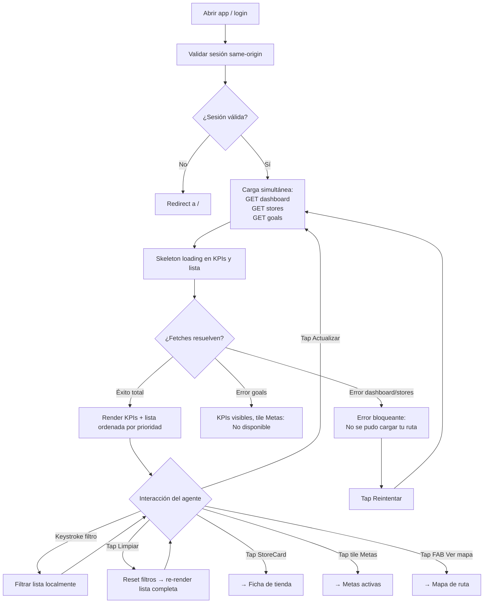

# Vista: Dashboard del agente

## Estado del documento
- Autor: `planning-agent-b3bfeb`
- Referencia UX/UI: `senior-ux-ui-designer-unpinned` (sesión `senior-ux-ui-designer-unpinned-session-afe28e`)
- Estado: listo para revisión de desarrollo/producto
- Alcance: especificación UX/UI para la pantalla `Dashboard` (punto de entrada) del workspace del agente comercial en `agent/*`

## Fuentes utilizadas
Este documento se apoya en fuentes verificadas del repositorio y en la UI legacy preservada:
- `docs/ui-guidelines.md`
- `docs/current-state.md`
- `src/routes/agent.routes.js`
- `src/services/agent-workspace.service.js`
- `src/services/agent-workspace-store-state.service.js`
- `src/repositories/agent-workspace.repository.js`
- `legacy-public-runtime/agent/workspace.html`
- `legacy-public-runtime/agent/workspace.js`

## Contexto actual verificado
- La SPA legacy del agente existe en `legacy-public-runtime/agent/` con `workspace.html` como pantalla principal y punto de entrada al día de trabajo del agente comercial.
- El backend expone `GET /api/agent/dashboard`, `GET /api/agent/stores` y `GET /api/agent/goals` bajo la política `agent.workspace.access`, todos montados en `src/routes/agent.routes.js`.
- El dashboard legacy ya implementa: KPIs (rutas asignadas, tiendas por visitar, cerca del límite, metas activas), lista de tiendas con filtros por nombre y zona, FAB "Ver mapa" y modal de metas.
- La lógica de ordenamiento de tiendas está centralizada en `sortStores()` dentro de `agent-workspace-store-state.service.js`, con prioridad `VENCIDA > PROXIMA_A_VENCER > NUEVA > AL_DIA` y desempate por `daysSinceReference` descendente, luego por nombre.
- El filtro en la implementación legacy re-fetcha al backend en cada keystroke. La pantalla nueva debe corregir esto: filtrar localmente sobre los datos ya cargados.
- La pantalla nueva debe modernizarse al AppShell actual (`agent/*`) manteniendo el contrato de endpoints verificado.

## Objetivo de la pantalla
Punto de entrada al día de trabajo del agente. Permite ver su ruta asignada, tiendas priorizadas por urgencia, acceso rápido a mapa y metas, con navegación directa a la ficha de cada tienda.

## Objetivo del usuario
- Saber de un vistazo cuántas tiendas tiene por visitar y cuántas están vencidas.
- Seleccionar la próxima tienda a visitar según prioridad, sin necesidad de analizar la lista.
- Filtrar por nombre o zona para encontrar una tienda específica rápidamente.
- Acceder al mapa para orientarse geográficamente.
- Ver el progreso de sus metas sin salir de la pantalla principal.

## Objetivo del negocio
- Digitalizar la planificación diaria del agente en campo.
- Priorizar automáticamente la atención a cuentas vencidas o cerca del límite de visita.
- Dar visibilidad operativa sin depender de llamadas al supervisor.

## Alcance MVP
### Incluye
- KPI grid: rutas asignadas, tiendas a visitar, cerca del límite, metas activas (tile navegable).
- Lista de tiendas ordenada por prioridad: `VENCIDA > PROXIMA_A_VENCER > NUEVA > AL_DIA`; dentro de cada grupo por `daysSinceReference` descendente.
- Filtro local por nombre/cliente y por zona/subzona (sin re-fetch).
- Botón `Limpiar` filtros.
- Caption con total de tiendas y count de vencidas.
- Tap en `StoreCard` → navega a ficha de tienda.
- Tap en tile Metas → navega a metas activas.
- FAB `Ver mapa` → navega a mapa de ruta.
- Botones: `Actualizar` (refresca datos), `Cerrar sesión`.
- Estados: loading (skeleton), empty (sin tiendas), empty por filtro (sin coincidencias), error bloqueante, error degradado (solo goals falla), success (toast `Ruta actualizada`).
- Responsive mobile-first.

### No incluye en esta fase
- Búsqueda con re-fetch al backend.
- Paginación de tiendas.
- Notificaciones push.
- Modo offline.
- Geolocalización automática en el dashboard.
- Analítica de productividad.

## Decisiones cerradas para desarrollo
### Orden de prioridad de la lista
La lista de tiendas se ordena en frontend sobre los datos del `GET /api/agent/stores`:
1. `VENCIDA`
2. `PROXIMA_A_VENCER`
3. `NUEVA`
4. `AL_DIA`

Dentro de cada grupo: `daysSinceReference` descendente. En caso de empate, por nombre de tienda (localeCompare `es`). Esta lógica replica exactamente `sortStores()` de `agent-workspace-store-state.service.js`.

### Filtro local
Cada keystroke filtra la lista localmente sobre `storesData` sin re-fetch. No hay botón `Buscar`. El filtro de nombre evalúa `store.name + ' ' + store.clientName`. El filtro de zona evalúa `store.regionName + ' ' + store.subregionName`.

### Carga paralela
`GET /api/agent/dashboard`, `GET /api/agent/stores` y `GET /api/agent/goals` se disparan simultáneamente al entrar usando `Promise.allSettled`.

### Error bloqueante
Si falla `GET /api/agent/dashboard` o `GET /api/agent/stores`, la pantalla no puede mostrarse. Si solo falla `GET /api/agent/goals`, el tile Metas muestra `—` y nota `No disponible`, pero el resto opera normalmente.

### Sesión
Validar sesión same-origin en la carga inicial. Si no hay sesión válida (`!session?.user || !session?.user?.companyId`), redirigir a `/`.

### StoreCard como touch target completo
Toda la card (min-height 80px) es el área tocable. No hay íconos pequeños ni zona de tap reducida.

### FAB posicionado fixed bottom-right
En mobile y tablet: FAB `56×56px` fixed bottom-right. En desktop: botón en el header.

## Contrato backend verificado
### Endpoints usados en esta pantalla
- `GET /api/agent/dashboard`
  ```json
  {
    "agent": { "id", "fullName", "username", "role": { "code", "name" } },
    "summary": {
      "routesAssignedCount",
      "storesToVisitCount",
      "nearLimitCount",
      "overdueCount",
      "newStoresCount"
    },
    "routes": [{ "id", "code", "name", "visitFrequencyDays", "nearLimitDays" }]
  }
  ```
- `GET /api/agent/stores`
  ```json
  {
    "summary": {
      "total",
      "byStatus": { "VENCIDA", "PROXIMA_A_VENCER", "NUEVA", "AL_DIA" }
    },
    "stores": [{ ...storeCard }]
  }
  ```
  Cada store card incluye: `id, clientId, clientName, legalEntityName, code, name, phone, address, locationReference, latitude, longitude, routeId, routeCode, routeName, visitFrequencyDays, nearLimitDays, regionName, subregionName, representativesCount, latestVisitAt, latestVisitComment, status, daysSinceReference, dueInDays, isNearLimit, pendingBalance, isNew`.

- `GET /api/agent/goals`
  ```json
  {
    "goals": [{ "title", "periodLabel", "targetAmount", "currentAmount", "progressPercent" }]
  }
  ```

### Autorización
Todos los endpoints están bajo la política `agent.workspace.access` con cookie same-origin. El `companyId` del usuario autenticado es requerido.

### Restricciones verificadas
- No presentar datos que no existan en el contrato verificado:
  - Sin GPS en tiempo real del agente.
  - Sin ranking automático de productividad.
  - Sin analítica de desempeño diario calculada en frontend.
  - El `summary.storesToVisitCount` del dashboard representa tiendas con status distinto de `AL_DIA`, no el total bruto.

## Usuarios esperados y permisos UX
### Usuarios con acceso esperado
- `sales_agent` con `agent.workspace.access`.
- `sales_supervisor` si tiene perfil de workspace activo.

### Restricciones UX alineadas con backend
- La validación de sesión y elegibilidad del usuario la realiza el backend en `getAgentContext()`.
- Si el usuario no tiene perfil comercial de agente, el backend devuelve 403. La UI debe tratar este caso como error bloqueante y mostrar mensaje claro.
- No hay acceso a esta pantalla para `admin` sin perfil de workspace de agente.

## Principios UX de la pantalla
1. **Prioridad visual sobre información completa**: mostrar solo lo necesario para elegir la próxima tienda. El detalle vive en la ficha de tienda.
2. **Urgencia explícita**: tiendas `VENCIDA` con borde lateral rojo visible (left border `4px` rojo en la `StoreCard`). La urgencia es perceptible sin leer el badge.
3. **Filtro sin botón de búsqueda**: keystroke filtra localmente sin presionar botón. Reduce un toque en un contexto de campo.
4. **Mapa como complemento, no principal**: el FAB existe pero no interrumpe. Muchos agentes operarán solo con la lista.

## Flujo UX general


## Posicionamiento en el shell del agente
```text
AgentShell
└── DashboardPage
    ├── AgentHeader (fixed 64px)
    │   ├── Eyebrow: WORKSPACE COMERCIAL
    │   ├── Sesión label: Hola, {nombre}
    │   └── Actions: [Actualizar] [Cerrar sesión]
    ├── KPIGrid (2×2 mobile, 4×1 tablet+)
    │   ├── KPITile — Rutas asignadas
    │   ├── KPITile — Tiendas a visitar
    │   ├── KPITile — Cerca del límite
    │   └── KPITile — Mis metas › (navegable → Metas activas)
    ├── FilterBar
    │   ├── SearchInput placeholder: Tienda o cliente...
    │   ├── SearchInput placeholder: Zona o subzona...
    │   └── Button [Limpiar]
    ├── ListCaption "{N} tienda(s) · {M} vencida(s)"
    ├── StoreList (scroll principal de la página)
    │   └── StoreCard × N
    └── FAB [Ver mapa] (fixed bottom-right, mobile/tablet)
```

## Estructura de la página

### Wireframe mobile 375px
```
┌─────────────────────────────────────┐  375px
│ WORKSPACE COMERCIAL                 │
│ Hola, {nombre}      [Act.] [Salir]  │  ← Header 64px (fixed)
├──────────────────┬──────────────────┤
│  Rutas asig.    │ Tiendas a visit. │
│       3          │        12        │  ← KPI grid 2×2
├──────────────────┼──────────────────┤
│  Cerca límite   │   Mis metas ›    │
│       2          │         4        │
├─────────────────────────────────────┤
│ [Tienda o cliente...              ] │
│ [Zona o subzona...                ] │  ← FilterBar
│                        [Limpiar]    │
├─────────────────────────────────────┤
│  12 tienda(s) · 3 vencida(s)        │  ← ListCaption
├─────────────────────────────────────┤
│ ┌──────────────────────────────┐    │
│ │▌ Tienda El Mango  [Vencida] │    │  ← StoreCard VENCIDA
│ │  Cliente ABC · R-01          │    │    (borde izq rojo 4px,
│ │  San José / Hatillo          │    │     fondo #FEF2F2)
│ │  18 día(s)    ₡ 45.200      │    │
│ └──────────────────────────────┘    │
│ ┌──────────────────────────────┐    │
│ │▌ Tienda La Palma [Por venc.] │    │  ← StoreCard PROXIMA
│ │  Cliente XYZ · R-01          │    │    (borde izq naranja,
│ │  Alajuela / Grecia           │    │     fondo #FFFBEB)
│ │   5 día(s)    ₡  8.000      │    │
│ └──────────────────────────────┘    │
│ ┌──────────────────────────────┐    │
│ │▌ Tienda El Roble   [Nueva]  │    │  ← StoreCard NUEVA
│ │  Cliente DEF · R-02          │    │    (borde izq verde,
│ │  Heredia / Barva             │    │     sin fondo especial)
│ │   0 día(s)    ₡      0      │    │
│ └──────────────────────────────┘    │
│ ┌──────────────────────────────┐    │
│ │  Farmacia Central  [Al día] │    │  ← StoreCard AL_DIA
│ │  Cliente GHI · R-01          │    │    (sin borde especial)
│ │  San José / Desamparados     │    │
│ │   2 día(s)    ₡      0      │    │
│ └──────────────────────────────┘    │
│                                     │
│                       ┌──────────┐  │
│                       │ Ver mapa │  │  ← FAB fixed bottom-right
│                       └──────────┘  │    16px margen
└─────────────────────────────────────┘
```

### Header
- Eyebrow: `WORKSPACE COMERCIAL`
- Sesión label: `Hola, {agent.fullName}`
- Acción secundaria: `Actualizar`
- Acción secundaria: `Cerrar sesión`
- En desktop: el FAB se convierte en botón adicional dentro del header.

### KPI Grid

| KPI | Fuente API | Color del número |
|-----|-----------|-----------------|
| Rutas asignadas | `summary.routesAssignedCount` | `#0F172A` siempre |
| Tiendas a visitar | `summary.storesToVisitCount` | `#16A34A` si >0, `#64748B` si =0 |
| Cerca del límite | `summary.nearLimitCount` | `#DC2626` si >0, `#64748B` si =0 |
| Mis metas | `goals.length` | `#16A34A` si >0, `#64748B` si =0 |

El tile `Mis metas ›` es un botón navegable con chevron visible. Si `GET /api/agent/goals` falla, muestra `—` y nota `No disponible` en `#64748B`.

**Propiedades visuales del tile KPI:**
- Alto mínimo: `104px`
- Padding: `20px`
- Fondo: `#FFFFFF`
- Borde: `1px solid #E2E8F0`
- Radio: `12px`
- Número: `28px`, bold, color según tabla
- Label: `11px`, `500`, `#64748B`
- Touch target: mínimo `44×44px`

### Barra de filtros
- Input 1: `type="search"`, placeholder `Tienda o cliente...`
  - Filtra sobre `store.name + ' ' + store.clientName`
- Input 2: `type="search"`, placeholder `Zona o subzona...`
  - Filtra sobre `store.regionName + ' ' + store.subregionName`
- Botón: `Limpiar` — limpia ambos inputs y re-renderiza la lista completa
- Event listener: `input` (no `change`) para respuesta en tiempo real
- Font-size de los inputs: `16px` para evitar zoom automático en iOS

### Lista de tiendas
- Caption: `{N} tienda(s) · {M} vencida(s)` donde `M` es el conteo de tiendas con `status === 'VENCIDA'` en la lista filtrada actualmente visible.
- La lista es el scroll principal de la página; no tiene scroll interno separado.
- El ordenamiento se aplica sobre el array completo antes del filtro, y el filtro respeta el orden ya establecido.

### StoreCard

**Left border 4px por status:**
| Status API | Left border | Fondo sutil |
|-----------|------------|------------|
| `VENCIDA` | `#DC2626` | `#FEF2F2` |
| `PROXIMA_A_VENCER` | `#F59E0B` | `#FFFBEB` |
| `NUEVA` | `#16A34A` | sin fondo especial |
| `AL_DIA` | sin borde especial | sin fondo especial |

**Contenido de cada StoreCard (de arriba a abajo):**
- Línea 1: `store.name` (bold, `16px`, `600`, `#0F172A`) + badge de status (pill, derecha)
- Línea 2: `{store.clientName || 'Sin cliente'} · {store.routeCode || 'Sin ruta'}` (secundario, `#64748B`)
- Línea 3: `{store.regionName || '-'} / {store.subregionName || '-'}` (secundario, `#64748B`)
- Línea 4: `{store.daysSinceReference} día(s)` + `₡ {store.pendingBalance}` (stats row, `#64748B`)

**Badges de status:**
| Status API | Label | Fondo | Texto |
|-----------|-------|-------|-------|
| `VENCIDA` | `Vencida` | `#DC2626` | `#FFFFFF` |
| `PROXIMA_A_VENCER` | `Por vencer` | `#F59E0B` | `#FFFFFF` |
| `NUEVA` | `Nueva` | `#16A34A` | `#FFFFFF` |
| `AL_DIA` | `Al día` | `#E2E8F0` | `#64748B` |

**Propiedades de interacción:**
- Toda la card es el touch target (`display: block`, `min-height: 80px`).
- Tap → navega a ficha de tienda con el `store.id` en la URL o el estado de navegación.
- Sin íconos pequeños ni zonas de tap reducidas.

### FAB (Floating Action Button)
- Label: `Ver mapa`
- Posición: `fixed`, `bottom: 16px`, `right: 16px`
- Tamaño mínimo: `56px` de alto; ancho suficiente para el label con padding horizontal
- Color: primary `#16A34A`, texto `#FFFFFF`
- En desktop (`1024px+`): se elimina el FAB y aparece botón en el header.

## Empty states
### Sin tiendas asignadas (lista vacía total)
- Ícono: `🗺️`
- Título: `Sin tiendas asignadas hoy`
- Texto: `No hay tiendas en tu ruta actual. Consulta con tu supervisor si esto es inesperado.`
- Sin CTA
- Se activa cuando `storesData.length === 0` después de una carga exitosa

### Sin resultados por filtro
- Ícono: `🔍`
- Título: `No encontramos tiendas con ese filtro`
- Texto: `Prueba con otro nombre, cliente o zona.`
- CTA: `Limpiar filtros`
- Se activa cuando `storesData.length > 0` pero `filteredStores().length === 0`

## Error states
### Error bloqueante (falla dashboard o stores)
- Reemplaza el contenido principal con un banner rojo visible dentro de la pantalla, no solo un toast.
- Título: `No se pudo cargar tu ruta`
- Texto: `Revisa tu conexión e intenta de nuevo.`
- CTA: `Reintentar` → vuelve a disparar la carga paralela

### Degradado (solo goals falla)
- El tile `Mis metas` muestra `—` como valor con nota `No disponible` en `#64748B`.
- El resto del dashboard opera normalmente.
- No se muestra banner de error adicional.

### Error de sesión / agente no elegible (403 del backend)
- Error bloqueante.
- Texto: `No tienes acceso al workspace comercial.`
- Si el error es de sesión expirada, redirigir a `/`.

### Success (actualización manual exitosa)
- Toast `aria-live="polite"`: `Ruta actualizada`
- Duración: 3 segundos, luego desaparece automáticamente

## Skeleton loading
- 4 tiles KPI: rectángulos animados de `104px` alto.
- 3 `StoreCard` placeholders: skeleton con líneas de ancho variable (`70%`, `50%`, `40%`).
- Sin spinner full-screen; el contenido carga in-place para no bloquear el scroll.
- La barra de filtros puede renderizarse sin esperar los datos, pero los inputs deben estar deshabilitados hasta que `storesData` esté disponible.

## Visual design
### Paleta
Alineada a `docs/ui-guidelines.md` y al shell actual:
- Primary: `#16A34A`
- Primary hover: `#15803D`
- Títulos / navegación fuerte: `#0F172A`
- Fondo app: `#F8FAFC`
- Superficie: `#FFFFFF`
- Borde: `#E2E8F0`
- Texto secundario: `#64748B`
- Warning: `#F59E0B`
- Danger: `#DC2626`

### Tono visual
Operacional y comercial en campo. No corporativo-genérico. La pantalla debe sentirse como la hoja de ruta diaria de un equipo en movimiento, no como un panel de control de oficina.

### Touch targets
Mínimo `44×44px` para todos los controles interactivos. `StoreCard`: `min-height 80px`.

### Tipografía clave
| Elemento | Tamaño | Peso | Color |
|----------|--------|------|-------|
| KPI número | `28px` | bold | según estado |
| KPI label | `11px` | `500` | `#64748B` |
| Nombre tienda en card | `16px` | `600` | `#0F172A` |
| Texto secundario card | `14px` | `400` | `#64748B` |
| Inputs / selects | `16px` | `400` | — |
| Eyebrow header | `11px` | `600` | `#64748B` |
| Sesión label | `14px` | `400` | `#64748B` |

## Responsive rules

| Breakpoint | KPI Grid | StoreList | FAB | Filtros |
|-----------|----------|-----------|-----|---------|
| Mobile `375px+` (prioridad) | `2×2` | full-width | `56×56px` fixed bottom-right | full-width apilados |
| Tablet `768px+` | `4×1` (una fila) | cards más anchas | FAB permanece | lado a lado |
| Desktop `1024px+` | `4×1` | 40% izquierda | FAB → botón en header | inline |

En desktop: layout split (lista+filtros izquierda 40%, panel o mini-mapa derecha 60%). En mobile y tablet: la lista ocupa el ancho completo.

## Consideraciones de campo
- **Sol**: contraste WCAG AA mínimo en todos los textos. Los badges siempre tienen texto sobre color sólido.
- **Una mano**: toda la `StoreCard` es el touch target; no hay ícono pequeño que presionar.
- **Guantes**: `StoreCard` con `min-height 80px`; sin gestos de precisión requeridos.
- **Distracción**: el ordenamiento por prioridad hace que lo más urgente aparezca al tope sin requerir análisis.
- **Pantalla al sol**: el fondo sutil de tarjeta `VENCIDA` (`#FEF2F2`) y el borde rojo deben ser visibles incluso con brillo reducido.

## Copy recomendado

| Elemento | Copy |
|----------|------|
| Eyebrow | `WORKSPACE COMERCIAL` |
| Sesión label | `Hola, {agent.fullName}` |
| KPI: rutas | `Rutas asignadas` |
| KPI: tiendas | `Tiendas a visitar` |
| KPI: límite | `Cerca del límite` |
| KPI: metas | `Mis metas ›` |
| Goals degradado | `No disponible` |
| Filtro 1 placeholder | `Tienda o cliente...` |
| Filtro 2 placeholder | `Zona o subzona...` |
| Botón limpiar filtros | `Limpiar` |
| List caption | `{N} tienda(s) · {M} vencida(s)` |
| Botón actualizar | `Actualizar` |
| Botón cerrar sesión | `Cerrar sesión` |
| FAB | `Ver mapa` |
| Toast éxito actualización | `Ruta actualizada` |
| Badge VENCIDA | `Vencida` |
| Badge PROXIMA_A_VENCER | `Por vencer` |
| Badge NUEVA | `Nueva` |
| Badge AL_DIA | `Al día` |
| Empty total título | `Sin tiendas asignadas hoy` |
| Empty total texto | `No hay tiendas en tu ruta actual. Consulta con tu supervisor si esto es inesperado.` |
| Empty filtro título | `No encontramos tiendas con ese filtro` |
| Empty filtro texto | `Prueba con otro nombre, cliente o zona.` |
| Empty filtro CTA | `Limpiar filtros` |
| Error bloqueante título | `No se pudo cargar tu ruta` |
| Error bloqueante texto | `Revisa tu conexión e intenta de nuevo.` |
| Error bloqueante CTA | `Reintentar` |
| Error acceso | `No tienes acceso al workspace comercial.` |

## Recomendaciones de implementación técnica
- Crear vista en `src/public/agent/views/dashboard.js`.
- Crear adaptador API en `src/public/agent/api/agent-api.js` con funciones: `fetchDashboard()`, `fetchStores()`, `fetchGoals()`.
- Reutilizar clases CSS del shell de agente existentes: `agent-shell`, `card`, `agent-page`, `page-header`, `agent-header`, `eyebrow`, `muted`, `toolbar-actions`, `secondary-button`, `dashboard-tile`, `agent-summary-button`, `client-command-bar`, `agent-filter-bar`, `field`, `agent-stores-list`, `agent-store-card`, `agent-store-card-top`, `route-agent-stats`, `badge`, `badge-warning`, `badge-success`, `message`, `agent-floating-map-button`.
- Nuevas clases CSS necesarias:
  - `agent-store-card--vencida`: `border-left: 4px solid #DC2626; background-color: #FEF2F2`
  - `agent-store-card--proxima`: `border-left: 4px solid #F59E0B; background-color: #FFFBEB`
  - `agent-store-card--nueva`: `border-left: 4px solid #16A34A`
  - `agent-kpi-grid`: grid `2×2` en mobile, `4×1` en tablet+
- Lógica de ordenamiento en frontend: aplicar `sortStores()` sobre `storesData` después del `GET /api/agent/stores`.
- Carga paralela con `Promise.allSettled` para manejar el fallo parcial de goals sin bloquear el dashboard.
- Filtros: event listener en `input` (no `change`) para respuesta en tiempo real sin re-fetch.
- El `GET /api/agent/stores` sí acepta params `name` y `zone`, pero en la nueva implementación no deben enviarse: se descarga el array completo y se filtra en memoria.
- Usar `credentials: 'same-origin'` en todos los fetches y reutilizar `src/public/shared/auth.js`.
- El toast de éxito debe usar `aria-live="polite"` para accesibilidad y desaparecer a los `3000ms`.

## Pruebas mínimas sugeridas
- Characterization del orden de prioridad de tiendas (`VENCIDA` first, luego `daysSinceReference` desc).
- Characterization del filtro local por nombre/cliente.
- Characterization del filtro local por zona/subzona.
- Render de KPI tiles con datos reales del dashboard (`routesAssignedCount`, `storesToVisitCount`, `nearLimitCount`).
- Render del tile Metas con goals exitosos y con degradado cuando `GET /api/agent/goals` falla.
- Empty state con lista vacía total (dashboard ok, stores devuelve `[]`).
- Empty state con filtro activo sin coincidencias.
- Error bloqueante cuando dashboard falla.
- Error bloqueante cuando stores falla.
- Toast `Ruta actualizada` al presionar `Actualizar` exitosamente.
- Validación de sesión y redirección a `/` si `session?.user?.companyId` no existe.
- Touch target de `StoreCard`: verificar `min-height 80px` en el DOM.
- FAB visible y no superpuesto al último item visible de la lista en mobile.

## Criterios de aceptación UX/UI
- La pantalla permite seleccionar la tienda más urgente en ≤ 3 toques desde el dashboard.
- Las tiendas `VENCIDA` son visualmente distinguibles sin necesidad de leer el badge (left border rojo).
- El filtro responde por keystroke sin botón de búsqueda y sin re-fetch.
- El tile de Metas es navegable y visualmente diferenciado del resto de tiles.
- El error de carga es visible dentro de la pantalla (no solo un toast).
- El diseño es funcional y legible en mobile `375px` con una sola mano.
- El FAB de mapa no interfiere con el scroll de la lista.
- La carga paralela de los tres endpoints no produce estados inconsistentes visibles al usuario.
- El degradado de goals (solo ese endpoint falla) no impide la operación principal.
- La sesión inválida redirige a `/` sin mostrar contenido parcial.

## Decisión de diseño
El Dashboard del agente debe verse como la **hoja de ruta diaria del equipo de campo**: un panel de control centrado en acción inmediata, con urgencias visuales claras (colores de status), acceso rápido a mapa y metas, y un filtro sin fricción. Debe aprovechar todos los datos del backend existente verificado (`/api/agent/dashboard`, `/api/agent/stores`, `/api/agent/goals`) sin inventar contratos, mantener la compatibilidad visual con el shell de agente actual, y corregir la ineficiencia del legacy (re-fetch por keystroke) con filtrado local sobre los datos ya cargados.
