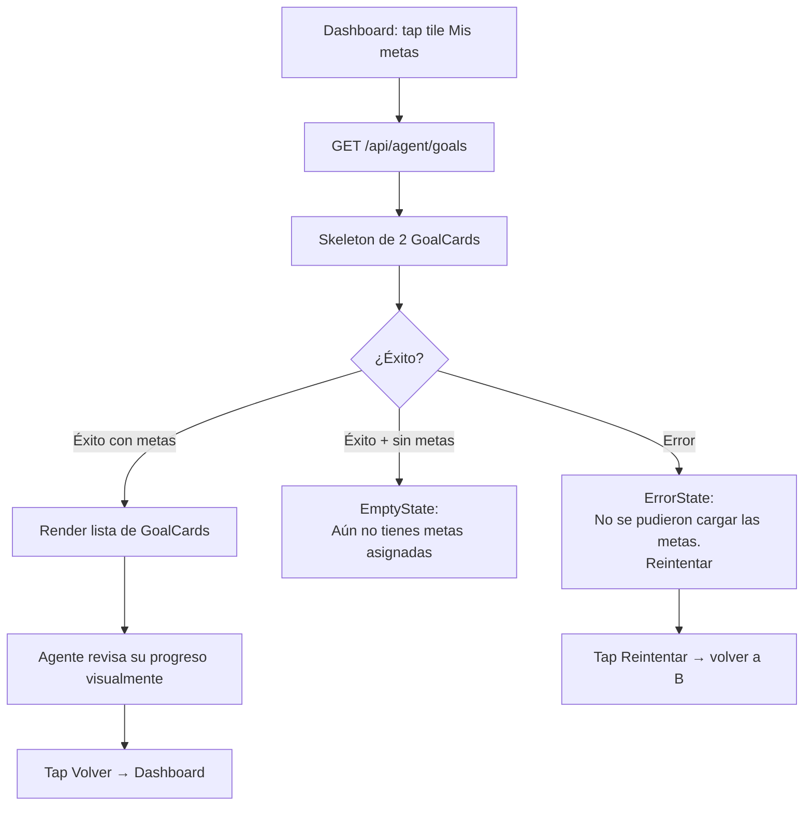

# Vista: Metas activas — Agente comercial

## Estado del documento
- Autor: `planning-agent-b3bfeb`
- Referencia UX/UI: `senior-ux-ui-designer-unpinned` (sesión `senior-ux-ui-designer-unpinned-session-afe28e`)
- Estado: listo para revisión de desarrollo/producto
- Alcance: especificación UX/UI para la pantalla `Metas activas` (P5) del workspace del agente comercial (`agent/*`)

## Fuentes utilizadas
Este documento se apoya en fuentes verificadas del repositorio y en la UI legacy preservada:
- `docs/ui-guidelines.md`
- `src/routes/agent.routes.js`
- `src/services/agent-workspace.service.js`
- `src/services/sales-route.service.js` (función `serializeGoal`)
- `legacy-public-runtime/agent/workspace.js` (función `renderGoals`, modal `#agent-goals-modal`)
- `legacy-public-runtime/agent/workspace.html` (estructura HTML del modal de metas legacy)
- `src/public/styles.css` (clases `.route-goal-progress`, `.route-goal-progress-bar`, `.agent-shell`, `.agent-header`, `.role-card`, `.muted`)

## Contexto actual verificado
- El workspace del agente comercial vive en `legacy-public-runtime/agent/` y actualmente sirve `workspace.html` + `workspace.js` como runtime legacy de `agent/*`.
- No existe aún un directorio `src/public/agent/` con una versión moderna del workspace; esta pantalla especifica la versión moderna que debe crearse.
- En el legacy, las metas se muestran en un modal (`#agent-goals-modal`) accesible desde el tile `Mis metas ›` del dashboard. El modal muestra metas como artículos con clase `role-card`, barra de progreso horizontal (`route-goal-progress` / `route-goal-progress-bar`) y una fila de stats con monto meta vs avance.
- El endpoint `GET /api/agent/goals` está montado en `src/routes/agent.routes.js`, protegido por `authorizeAccessPolicy('agent.workspace.access')`, y retorna `{ goals[] }` procesado por `agentWorkspaceService.listAgentGoals`.
- El serializer `serializeGoal` en `sales-route.service.js` calcula `progressPercent` con `Math.min(100, Math.max(0, (currentAmount / targetAmount) * 100))`: el porcentaje llega al frontend **capado en 100**. Para detectar "meta alcanzada o superada", la UI debe verificar `currentAmount >= targetAmount`.
- La asignación de metas al agente se hace desde la vista admin de Rutas (`#routes`), mediante `PUT /api/sales-routes/company/agents/:userId/goals`. Esta pantalla no expone ese flujo.
- El helper `currency()` de `workspace.js` ya usa `Intl.NumberFormat('es-CR', { style: 'currency', currency: 'CRC' })` y debe reutilizarse en la versión moderna.

## Objetivo de la vista
Mostrar el progreso de las metas comerciales del agente autenticado en una pantalla dedicada de solo lectura. Permite al agente revisar de un vistazo cuánto ha avanzado en cada meta, identificar riesgos de cumplimiento y celebrar metas alcanzadas, sin necesidad de contactar a su supervisor.

## Objetivo del usuario
- Ver de un vistazo cuánto ha avanzado en cada meta asignada.
- Saber si está en riesgo (progreso bajo) o en buen camino (progreso alto) según la señal de color de la barra.
- Identificar el periodo de cada meta para saber si le queda tiempo de cumplirla.
- Celebrar visualmente cuando alcanza o supera una meta.

## Objetivo del negocio
- Dar al agente visibilidad autónoma de su desempeño comercial sin necesidad de contactar al supervisor.
- Motivar al agente con señales visuales claras de progreso y logro.
- Reducir la carga de consultas de seguimiento al equipo administrativo.
- Preparar la base para futuras capacidades de seguimiento de desempeño en el workspace del agente.

## Alcance MVP
### Incluye
- Header con eyebrow, título y botón de regreso al Dashboard.
- Lista de GoalCards (una por meta activa).
- Por cada GoalCard: título, `periodLabel`, barra de progreso con color según porcentaje, badge de porcentaje, montos (`currentAmount` vs `targetAmount`).
- Estado meta alcanzada (`currentAmount >= targetAmount`): badge especial con emoji 🎉.
- Estado meta recién iniciada (`progressPercent === 0`): barra vacía sin texto adicional.
- Empty state cuando `goals[]` está vacío.
- Error state cuando falla el fetch, con CTA de reintento.
- Skeleton loading de 2 GoalCards durante el fetch inicial.
- Responsive mobile-first (375px prioritario).

### No incluye en esta fase
- Edición de metas desde esta pantalla.
- Historial de metas pasadas o cerradas.
- Comparación de desempeño entre agentes.
- Exportar informe de desempeño.
- Gráficos de tendencia histórica.
- Metas en formato de cantidad no monetaria si el contrato del API no las soporta.
- Proyección automática de cierre de meta.
- Fecha de creación de la meta (no existe en el contrato verificado).

## Decisiones cerradas para desarrollo

### Solo lectura estricta
Esta pantalla no expone ningún formulario, input ni botón de edición. La asignación y configuración de metas es responsabilidad exclusiva del admin desde `#routes`. No añadir botones de edición aunque el backend técnicamente lo permita vía otro endpoint.

### Detección de meta alcanzada
El backend capa `progressPercent` en 100 mediante `Math.min(100, ...)`. Para mostrar el badge especial "¡Meta alcanzada! 🎉", la UI debe evaluar `currentAmount >= targetAmount`, no `progressPercent > 100` (que nunca ocurrirá con el contrato actual).

### Color de la barra por porcentaje
| Rango | Color fill | Semántica |
|-------|-----------|-----------|
| 0–30% | `#DC2626` (rojo) | En riesgo |
| 31–70% | `#F59E0B` (ámbar) | En progreso |
| 71–99% | `#16A34A` (verde) | En buen camino |
| 100% (`currentAmount >= targetAmount`) | `#16A34A` (verde) | Meta alcanzada |

### Ancho mínimo de fill
Si `progressPercent > 0` y `progressPercent < 3`, mostrar ancho mínimo de `4px` para que el fill sea visible y no desaparezca visualmente. Implementar con `style="width: max(${pct}%, 4px)"` o clase CSS equivalente.

### Formato monetario
Usar `Intl.NumberFormat('es-CR', { style: 'currency', currency: 'CRC' })` consistente con el helper `currency()` del legacy y el resto del workspace.

### Acceso desde Dashboard
La pantalla se accede desde el tile "Mis metas ›" del dashboard del agente. El botón de regreso (`← Inicio`) debe llevar de vuelta al Dashboard. No existe navegación por tabs ni menú lateral en el workspace del agente.

### Sin paginación en MVP
En MVP todas las metas se muestran en una lista simple apilada. Típicamente un agente tiene pocas metas por periodo, lo que hace innecesaria la paginación en V1.

### Skeleton de carga
Mostrar 2 GoalCard skeletons (rectangles animados) durante el fetch. No usar spinner de pantalla completa.

## Contrato backend verificado

### Endpoint
`GET /api/agent/goals`
- Autorización: `agent.workspace.access` (cookie same-origin)
- Respuesta: `{ goals: GoalObject[] }`

### Forma de cada `GoalObject`
| Campo | Tipo | Descripción |
|-------|------|-------------|
| `id` | `string \| number` | Identificador de la meta |
| `title` | `string` | Nombre descriptivo de la meta |
| `periodLabel` | `string` | Periodo textual (ej. `"Junio 2025"`, `"Q2 2025"`) |
| `targetAmount` | `number` | Monto objetivo en CRC |
| `currentAmount` | `number` | Monto alcanzado hasta ahora en CRC |
| `progressPercent` | `number` | Porcentaje de avance, capado entre 0 y 100 |
| `notes` | `string \| null` | Notas opcionales del supervisor (no mostrar en MVP si no hay diseño definido) |
| `isActive` | `boolean` | Estado activo de la meta |

### Restricciones del contrato
No mostrar en esta pantalla datos que no existen en el contrato verificado:
- Ranking comparativo entre agentes.
- Proyección automática de cierre de meta.
- Fecha de creación de la meta.
- Histórico de cambios de la meta.
- Montos en otras monedas.

## Usuarios esperados y permisos UX
- `sales_agent` con permiso `agent.workspace.access`: usuario principal de esta pantalla.
- `sales_supervisor` si tiene perfil de workspace activo y la política `agent.workspace.access` aplicada.
- La UI no debe mostrar controles adicionales según el rol; la pantalla es idéntica para ambos perfiles con acceso.

## Principios UX de la vista
1. **Barra de progreso antes que número**: el porcentaje se percibe de un vistazo con la barra. Los montos exactos son el detalle secundario. La barra debe ser el elemento más prominente de cada GoalCard.
2. **Color como señal de urgencia, no decoración**: rojo en 0–30%, ámbar en 31–70%, verde en 71%+. Un agente con 15% de progreso al final del mes sabe visualmente que está en riesgo, sin necesidad de hacer cálculos.
3. **Sin fricción de edición**: pantalla de solo lectura. Sin formularios ni estados intermedios. Carga cognitiva mínima para el agente en campo.
4. **Contexto de periodo visible**: siempre mostrar `periodLabel` junto al título para que el agente sepa si la meta es mensual, trimestral o anual, y pueda evaluar si tiene tiempo de cumplirla.

## Flujo UX general


## Posicionamiento en el shell del agente
```text
AgentShell
└── GoalsPage
    ├── AgentHeader (estático o fixed)
    │   ├── [← Inicio]  (left)
    │   └── Eyebrow + Título  (center o left-aligned)
    └── GoalsContent
        ├── GoalCard × N  (si goals.length > 0)
        │   ├── CardHeader
        │   │   ├── TitleGroup: Title + PeriodLabel
        │   │   └── PercentBadge  (alineado a la derecha)
        │   ├── ProgressBar con fill coloreado
        │   └── AmountsRow: ₡currentAmount de ₡targetAmount
        ├── EmptyState  (si goals.length === 0)
        └── ErrorState  (si fetch falla)
```

## Decisión de navegación
### Recomendación principal
Implementar `GoalsPage` como pantalla dedicada dentro del AgentShell, accesible desde el Dashboard del agente. No mantener el patrón de modal del legacy (`#agent-goals-modal`), ya que el modal limita el espacio disponible para las cards y dificulta la lectura en pantallas pequeñas.

### Rechazo recomendado
No volver al patrón de modal del legacy. La pantalla dedicada permite más espacio por GoalCard, mejor lectura en campo bajo luz solar y una experiencia más nativa en mobile.

## Estructura de la página

## Header de la pantalla
### Orden exacto
1. Botón de regreso: `← Inicio`
2. Eyebrow: `PROGRESO COMERCIAL`
3. Título: `Mis metas`

### Reglas
- El botón `← Inicio` debe llevar de vuelta al Dashboard del agente.
- Sin acciones adicionales en el header (pantalla de solo lectura).
- No colocar `Cerrar sesión` dentro del header de la pantalla; el logout pertenece al shell global.
- El eyebrow debe ir en mayúsculas como referencia de contexto, consistente con el patrón del resto del workspace.

## Estructura de GoalCard
Por cada objeto en `goals[]`, renderizar una GoalCard con las siguientes sub-secciones:

### Encabezado de la card
- **Lado izquierdo**: `title` (16px bold, `#0F172A`) con `periodLabel` debajo (13px, `#64748B`).
- **Lado derecho**: `PercentBadge` alineado verticalmente al centro del `title`.

### PercentBadge
Badge redondeado (pill) con color de fondo sólido según rango de progreso:

| Condición | Fondo badge | Texto | Copy |
|-----------|-------------|-------|------|
| `currentAmount >= targetAmount` | `#16A34A` | `#FFFFFF` | `¡Meta alcanzada! 🎉` |
| `progressPercent >= 71` (y meta no alcanzada) | `#16A34A` | `#FFFFFF` | `{N}%` |
| `progressPercent >= 31` | `#F59E0B` | `#FFFFFF` | `{N}%` |
| `progressPercent <= 30` | `#DC2626` | `#FFFFFF` | `{N}%` |

El valor `{N}` es `progressPercent` redondeado a un decimal si lo tiene, o entero si termina en `.0`.

### ProgressBar
- **Track** (fondo): `#E2E8F0`, `height: 10px`, `border-radius: 999px`, ancho 100%.
- **Fill** (relleno): ancho = `min(progressPercent, 100)%`; si `progressPercent > 0 && progressPercent < 3`, aplicar ancho mínimo de `4px` para visibilidad.
- **Color del fill**: mismo esquema de color que el PercentBadge (rojo/ámbar/verde).
- **Accesibilidad**: el elemento fill (o su contenedor) debe incluir `role="progressbar"`, `aria-valuenow={progressPercent}`, `aria-valuemin="0"`, `aria-valuemax="100"`, `aria-label="Progreso de {title}: {N}%"`.
- Sin animación de transición en el primer render; puede añadirse en V2.

### AmountsRow
Fila de montos debajo de la ProgressBar:
- Formato: `{currentAmount formateado} de {targetAmount formateado}`
- `currentAmount`: color `#16A34A` si `currentAmount >= targetAmount`; color `#0F172A` si `currentAmount < targetAmount`.
- `targetAmount`: color `#64748B` siempre (es referencia, no logro).
- Usar `Intl.NumberFormat('es-CR', { style: 'currency', currency: 'CRC' })`.

### Estado: meta alcanzada (`currentAmount >= targetAmount`)
- PercentBadge muestra `¡Meta alcanzada! 🎉` con fondo `#16A34A`.
- ProgressBar fill ocupa ancho 100%, color `#16A34A`.
- `currentAmount` en `#16A34A`.

### Estado: meta recién iniciada (`progressPercent === 0`)
- Sin fill en la ProgressBar (o mínimo visual si el CSS aplica borde redondeado al track).
- Badge `0%` en rojo (`#DC2626`).
- No mostrar texto "Sin progreso"; la barra vacía comunica solo.

## Empty state

### Sin metas asignadas (`goals.length === 0`)
- Ícono: 🎯
- Título: `Aún no tienes metas asignadas`
- Texto: `Cuando tu supervisor configure tus metas, aparecerán aquí.`
- Sin CTA (la asignación de metas está fuera del control del agente).

## Error state

### Error de carga (`fetch` falla o devuelve error HTTP)
- Ícono: símbolo de error o advertencia simple.
- Título: `No se pudieron cargar las metas`
- Texto: `Revisa tu conexión e intenta de nuevo.`
- CTA: `[Reintentar]` — vuelve a ejecutar `GET /api/agent/goals`.

## Skeleton loading
- Mostrar 2 GoalCard skeletons durante el fetch inicial.
- Cada skeleton: rectángulo animado de aproximadamente `120px` de alto, con forma de card (bordes redondeados, misma estructura visual que una GoalCard real pero con blocks grises pulsantes).
- No usar spinner de pantalla completa.
- Implementar con CSS animation (`pulse` o `shimmer`) sin dependencias externas.

## Wireframe ASCII — Mobile 375px

Muestra 3 GoalCards con estados de progreso diferentes (riesgo, en camino y meta alcanzada):

```
┌──────────────────────────────────────┐
│ ← Inicio                             │  ← AgentHeader
│                                      │
│ PROGRESO COMERCIAL                   │
│ Mis metas                            │
├──────────────────────────────────────┤
│                                      │
│ ┌────────────────────────────────┐   │
│ │ Ventas mensuales      [18%]    │   │  ← badge rojo
│ │ Junio 2025                     │   │
│ │ ████░░░░░░░░░░░░░░░░░░░░░░░░   │   │  ← barra roja (~18%)
│ │ ₡180.000 de ₡1.000.000         │   │
│ └────────────────────────────────┘   │
│                                      │
│ ┌────────────────────────────────┐   │
│ │ Clientes nuevos       [55%]    │   │  ← badge ámbar
│ │ Q2 2025                        │   │
│ │ ████████████████░░░░░░░░░░░░   │   │  ← barra ámbar (~55%)
│ │ ₡275.000 de ₡500.000           │   │
│ └────────────────────────────────┘   │
│                                      │
│ ┌────────────────────────────────┐   │
│ │ Meta anual  [¡Meta alcanzada!🎉]│   │  ← badge verde especial
│ │ Año 2025                       │   │
│ │ ████████████████████████████   │   │  ← barra verde 100%
│ │ ₡2.500.000 de ₡2.000.000       │   │  ← currentAmount en verde
│ └────────────────────────────────┘   │
│                                      │
└──────────────────────────────────────┘
```

**Notas del wireframe:**
- El badge de porcentaje va alineado a la derecha del nombre de la meta.
- `periodLabel` va inmediatamente debajo del `title`, en texto secundario.
- La ProgressBar ocupa el ancho completo de la card.
- La fila de montos va siempre debajo de la barra.
- En la tercera card, `₡2.500.000` aparece en verde porque `currentAmount >= targetAmount`.

## Visual design

### Paleta
Alineada a `ui-guidelines.md` y al shell del agente:
- Primary: `#16A34A`, hover `#15803D`
- Títulos: `#0F172A`
- Texto secundario: `#64748B`
- Fondo app: `#F8FAFC`
- Superficie: `#FFFFFF`
- Borde: `#E2E8F0`
- Danger (barra riesgo): `#DC2626`
- Warning (barra progreso medio): `#F59E0B`

### GoalCard
- Fondo: `#FFFFFF`
- Borde: `1px solid #E2E8F0`
- Border-radius: `12px`
- Padding: `16px`
- Sombra sutil: `box-shadow: 0 1px 3px rgba(0,0,0,0.04)`
- Separación entre cards: `12px` (gap o margin-bottom)

### ProgressBar
- Track: `background: #E2E8F0`, `height: 10px`, `border-radius: 999px`
- Fill: colores por rango (ver tabla en sección Decisiones cerradas), `border-radius: 999px`
- El fill debe usar colores sólidos sin degradados para garantizar contraste bajo luz solar directa.

### PercentBadge
- Forma: pill redondeado (`border-radius: 999px`)
- Padding: `4px 10px`
- Font-size: `12px`, font-weight: `600`
- Para badge de meta alcanzada, el texto es más largo; asegurarse de que no se corte en pantallas pequeñas (puede ir en una segunda fila si es necesario, o fuente ligeramente más pequeña).

### Tono visual
Motivacional y operacional. El agente en campo necesita información clara y directa. No usar decoraciones complejas, gradientes ni sombras pronunciadas. Los colores de la barra son la comunicación principal.

## Responsive rules
| Breakpoint | Comportamiento |
|-----------|----------------|
| Mobile 375px+ (prioridad) | Cards apiladas full-width; ProgressBar `height: 10px`; PercentBadge alineado a la derecha del título; AmountsRow en fila debajo de la barra; padding horizontal `16px` en el contenedor. |
| Tablet 768px+ | Cards en 2 columnas si hay ≥ 4 metas; padding horizontal `24px`; header con más espacio vertical. |
| Desktop 1024px+ | Cards en 3 columnas; header con eyebrow + título más grandes; contenedor máximo de `960px` centrado. |

**Regla de campo**: la barra de progreso debe tener buen contraste bajo luz solar directa. Usar colores sólidos, no degradados. No usar solo el color para comunicar el estado: el badge `"{N}%"` siempre debe ser visible junto a la barra (color + texto redundante = accesibilidad bajo condiciones reales de campo).

## Consideraciones de accesibilidad
- ProgressBar: `role="progressbar"`, `aria-valuenow={progressPercent}`, `aria-valuemin="0"`, `aria-valuemax="100"`, `aria-label="Progreso de {title}: {N}%"`.
- El badge de meta alcanzada debe incluir texto accesible; no depender solo del emoji 🎉.
- El botón `← Inicio` debe ser un `<button>` o `<a>` con label explícito: `aria-label="Volver al inicio"`.
- El contraste de texto sobre los badges de color debe cumplir WCAG AA (texto blanco sobre rojo/ámbar/verde sólido lo cumple).

## Copy recomendado completo
| Elemento | Copy |
|----------|------|
| Eyebrow | `PROGRESO COMERCIAL` |
| Título de pantalla | `Mis metas` |
| Botón de regreso | `← Inicio` |
| Period label | `{periodLabel}` |
| Badge 0–30% | `{N}%` |
| Badge 31–70% | `{N}%` |
| Badge 71–99% | `{N}%` |
| Badge meta alcanzada | `¡Meta alcanzada! 🎉` |
| Fila de montos | `{currentAmount formateado} de {targetAmount formateado}` |
| aria-label ProgressBar | `Progreso de {title}: {N}%` |
| aria-label botón regreso | `Volver al inicio` |
| Empty — ícono | `🎯` |
| Empty — título | `Aún no tienes metas asignadas` |
| Empty — cuerpo | `Cuando tu supervisor configure tus metas, aparecerán aquí.` |
| Error — título | `No se pudieron cargar las metas` |
| Error — cuerpo | `Revisa tu conexión e intenta de nuevo.` |
| Error — CTA | `Reintentar` |

## Recomendaciones de implementación técnica
- Crear la vista en `src/public/agent/views/goals.js` como módulo moderno del workspace del agente, paralelo a la estructura de `src/public/root/views/`.
- Reutilizar el helper `currency()` del legacy (`legacy-public-runtime/agent/workspace.js`) extrayéndolo a un helper compartido si aún no existe en `src/public/shared/`.
- La lógica de color de la ProgressBar es puramente de frontend; calcular a partir de `progressPercent` y `currentAmount >= targetAmount`.
- Reutilizar clases CSS existentes: `agent-shell`, `agent-header`, `route-goal-progress`, `route-goal-progress-bar`, `role-card`, `muted`, `message`.
- Nuevas clases CSS propuestas: `agent-goal-card`, `agent-goal-card__header`, `agent-goal-card__title`, `agent-goal-card__period`, `agent-goal-percent-badge`, `agent-goal-amounts`, `agent-goals-list`, `agent-goals-skeleton`.
- La pantalla puede recibir los datos de `goals[]` ya en memoria si el dashboard los cargó previamente, para evitar un `GET` extra. Si no están en memoria, debe ejecutar `GET /api/agent/goals` de forma autónoma.
- El fetch debe usar `credentials: 'same-origin'` y reutilizar `src/public/shared/auth.js` si ya existe el helper correspondiente.
- No hardcodear colores de la ProgressBar en el CSS base; calcularlos en el JS de la vista para poder variarlos por porcentaje dinámicamente (usar `style` inline o clases modificadoras).

## Pruebas mínimas sugeridas para la vista
- Render de lista de GoalCards con datos reales del endpoint.
- ProgressBar: `width = min(progressPercent, 100)%` y ancho mínimo de `4px` cuando `progressPercent > 0 && progressPercent < 3`.
- Color de fill según rangos: 0–30% rojo `#DC2626`, 31–70% ámbar `#F59E0B`, 71%–99% verde `#16A34A`.
- Color del PercentBadge consistente con el color de fill de la barra.
- Badge especial `¡Meta alcanzada! 🎉` cuando `currentAmount >= targetAmount`.
- `currentAmount` formateado en verde (`#16A34A`) cuando `currentAmount >= targetAmount`.
- Formato de moneda `es-CR CRC` correcto (símbolo `₡`, separadores de miles en punto, decimales en coma).
- Empty state cuando `goals[]` está vacío: ícono 🎯, título y cuerpo correctos, sin CTA.
- Error state con CTA `Reintentar` funcional que vuelve a lanzar el fetch.
- Skeleton loading: 2 rectangles animados visibles durante el fetch.
- Accesibilidad: `role="progressbar"` con `aria-valuenow` correcto por cada GoalCard.
- Navegación: tap `← Inicio` regresa al Dashboard del agente.
- Responsive: pantalla funcional en viewport de 375px sin scroll horizontal.

## Criterios de aceptación UX/UI
- Las metas muestran progreso visual inmediato sin requerir interpretación de números por parte del agente.
- El color de la barra es legible bajo luz solar (colores sólidos, contraste WCAG AA).
- Una meta alcanzada (`currentAmount >= targetAmount`) es visualmente celebrada y claramente distinta de las metas en progreso.
- El periodo (`periodLabel`) de cada meta es visible junto al título en todas las GoalCards.
- La pantalla es completamente funcional en mobile 375px sin scroll horizontal ni elementos cortados.
- El error de carga es visible con un mensaje claro y ofrece una acción de reintento que funciona.
- El empty state explica correctamente por qué no hay metas y no genera confusión sobre un posible error técnico.
- El skeleton de carga evita el flash de contenido vacío durante el fetch.
- La pantalla no expone ningún control de edición ni formulario.

## Decisión de diseño
La pantalla de Metas activas debe verse como un **panel de progreso rápido**: cards simples con barra de progreso prominente, badge de porcentaje visible y montos concretos en formato local. La señal visual de urgencia (color rojo en progreso bajo) debe ser legible de un vistazo desde campo, bajo luz solar, sin requerir que el agente haga cálculos. El diseño es deliberadamente simple y de solo lectura porque el agente no controla sus metas — solo las observa y actúa en consecuencia. La pantalla dedicada (vs. el modal legacy) le da más espacio y dignidad a cada meta, y sienta las bases para enriquecer la experiencia en versiones futuras sin romper el contrato actual.
