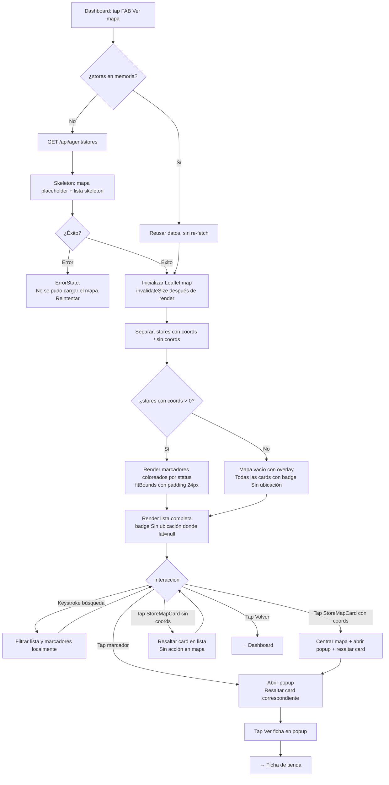

# Vista: Mapa de ruta — Agente comercial

## Estado del documento
- Autor: `planning-agent-b3bfeb`
- Referencia UX/UI: `senior-ux-ui-designer-unpinned` (sesión `senior-ux-ui-designer-unpinned-session-afe28e`)
- Estado: listo para revisión de desarrollo/producto
- Alcance: especificación UX/UI para la pantalla `Mapa de ruta` del workspace del agente comercial (P6)

## Fuentes utilizadas
Este documento se apoya en fuentes verificadas del repositorio y en la UI legacy preservada:
- `docs/ui-guidelines.md`
- `src/routes/agent.routes.js`
- `src/services/agent-workspace.service.js`
- `src/services/agent-workspace-store-state.service.js`
- `legacy-public-runtime/agent/workspace.html`
- `legacy-public-runtime/agent/workspace.js` (funciones `ensureMap`, `renderMap`, `renderMapClientList`)

## Contexto actual verificado
- En el workspace legacy (`workspace.html`), el mapa se muestra dentro de un modal (`#agent-map-modal`) que el agente abre pulsando el FAB `Ver mapa` (`#open-agent-map-button`).
- `workspace.js` implementa `ensureMap()` que inicializa `L.map('agent-map').setView(COSTA_RICA_CENTER, 8)` con Leaflet, `renderMap()` que agrega marcadores con el ícono por defecto de Leaflet, y `renderMapClientList()` que renderiza una lista lateral de tiendas filtrable por nombre o cliente.
- El legacy llama `agentMap.invalidateSize()` dentro de un `setTimeout` al abrir el modal para prevenir el bug de tiles grises; este patrón debe preservarse en la versión moderna.
- El legacy usa `fitBounds(bounds, { padding: [24, 24] })` cuando hay más de una tienda con coordenadas, y `setView(COSTA_RICA_CENTER, 8)` como fallback cuando ninguna tiene coords.
- `COSTA_RICA_CENTER = [9.7489, -83.7534]` está definido en el legacy y debe mantenerse como constante en la implementación moderna.
- El legacy usa el ícono azul por defecto de Leaflet; la versión moderna debe reemplazarlo con `L.divIcon` coloreado por status.
- En la versión moderna: pantalla dedicada (no modal), con layout vertical en mobile — mapa arriba (`~50vh` fijo), lista abajo (scrollable). Sin FAB que abre un modal.
- Los datos de stores pueden vivir en memoria desde el dashboard si se cargaron previamente; reutilizarlos sin re-fetch.
- El agente comercial opera principalmente desde **mobile**. Esta pantalla debe priorizarse en 375px antes que cualquier otro breakpoint.

## Objetivo de la pantalla
Ofrecer al agente comercial una visualización geográfica complementaria de las tiendas asignadas a su ruta. El agente usa esta pantalla para orientarse en campo, identificar qué tiendas urgentes tiene geográficamente cerca y seleccionar una para ir directamente a su Ficha de tienda.

## Objetivo del usuario
- Ver en el mapa dónde están sus tiendas asignadas.
- Identificar qué tiendas vencidas o próximas a vencer están geográficamente cerca entre sí.
- Buscar una tienda por nombre o cliente en la lista lateral.
- Seleccionar una tienda desde el mapa o desde la lista y navegar a su Ficha.

## Objetivo del negocio
- Ayudar al agente a planificar su recorrido de campo considerando la proximidad geográfica real.
- Priorizar visitas a tiendas urgentes en la misma zona geográfica.
- Dar visibilidad de la cobertura territorial real del agente dentro de su ruta asignada.

## Alcance MVP

### Incluye
- Header con eyebrow, título y botón `← Inicio` de regreso al Dashboard.
- `MapContainer` (~50vh en mobile): TileLayer de OpenStreetMap mediante Leaflet 1.9.4, marcadores coloreados por status usando `L.divIcon`.
- `MapCaption`: `{N} de {Total} tiendas en el mapa`.
- `FilterBar`: `SearchInput` con placeholder `Cliente o tienda...` que filtra lista y marcadores localmente por keystroke.
- `CoordinatesNotice`: nota informativa cuando hay tiendas sin coordenadas (no es un error; nunca usar rojo).
- `StoreMapList` (scrollable): lista de **todas** las tiendas del agente, con y sin coordenadas.
  - Tiendas con coords: tap → centra mapa + abre popup + resalta card.
  - Tiendas sin coords: badge gris `Sin ubicación` + tap → solo resalta card en lista, sin acción en mapa.
- `MarkerPopup` en Leaflet: nombre, cliente, región/subregión, CTA `Ver ficha →`.
- Marcador seleccionado: estilo ampliado con borde blanco.
- Card seleccionada: borde `2px solid #16A34A`.
- Geolocalización opcional (`navigator.geolocation`): punto azul de posición actual si el usuario la permite; no bloquea la pantalla si es denegada.
- Estados: loading (skeleton), error de carga, empty sin tiendas, empty por filtro, mapa sin ninguna coordenada, mapa parcial (algunas sin coords).
- Layout split vertical mobile-first: mapa arriba, lista abajo.

### No incluye en esta fase
- Rutas de navegación GPS o integración con Google Maps / Waze.
- Optimización automática del orden de visitas.
- Agrupación de marcadores (clustering).
- Capas de datos geográficos adicionales.
- Compartir ubicación del agente en tiempo real.
- Modo offline de tiles (caché de Leaflet).
- Guardar la posición del agente en el backend.

## Decisiones cerradas para desarrollo

### Lista siempre completa
La lista muestra **todas** las tiendas del agente, con y sin coordenadas. El mapa muestra solo las que tienen `latitude !== null && longitude !== null`. Esto evita que el agente crea que faltan tiendas en su ruta.

### Ausencia de coords = información, no error
Las tiendas sin coordenadas reciben un badge gris `Sin ubicación` en su card. No se usa rojo, ni texto de error, ni ícono de advertencia. La `CoordinatesNotice` es informativa. Si ninguna tienda tiene coords, el mapa muestra un overlay con texto neutro, nunca un estado de error.

### Reutilizar datos en memoria
Si los stores ya fueron cargados desde el Dashboard, deben reutilizarse sin re-fetch al montar la pantalla del mapa. Solo disparar `GET /api/agent/stores` si no hay datos en memoria.

### `invalidateSize()` obligatorio
Llamar `map.invalidateSize()` dentro de `setTimeout(() => map.invalidateSize(), 100)` después del primer render del contenedor del mapa. Previene el bug conocido de tiles grises, idéntico al patrón del legacy.

### Marcadores coloreados con DivIcon
Usar `L.divIcon({ className: 'agent-map-marker agent-map-marker--{status}', iconSize: [24, 24] })` para todos los marcadores. No usar el ícono azul default de Leaflet. Los colores siguen el sistema de diseño y el status de cada tienda.

### Split vertical en mobile
En mobile, el `MapContainer` tiene `height: 50vh` fijo. La `StoreMapList` ocupa `min-height: 50vh` scrollable debajo del mapa. El agente puede ver ambas vistas sin cambiar de pantalla.

### `fitBounds` con padding
Si hay más de una tienda con coords: `map.fitBounds(bounds, { padding: [24, 24] })` para que los marcadores no queden cortados por el borde del contenedor.

### Un solo marcador con coords
Si hay exactamente una tienda con coords: `map.setView([lat, lng], 13)` para un zoom más útil.

### Popup con CTA `Ver ficha →`
El popup del marcador incluye el nombre de la tienda, el cliente, la región/subregión y el botón `Ver ficha →` que navega a la Ficha de tienda con el `storeId` correcto.

### Geolocalización no bloqueante
Intentar `navigator.geolocation.getCurrentPosition()` una sola vez al montar la pantalla. Si se obtiene posición, mostrar punto azul (`L.circleMarker` o icono especial). Si el permiso es denegado o hay error, continuar normalmente sin mostrar ningún mensaje de error.

### Pinch/zoom nativo de Leaflet
No interferir con el scroll vertical de la lista. Si hay conflicto de eventos touch entre el mapa y el scroll de la lista, usar `tap: false` en la instancia de Leaflet.

## Contrato backend verificado

### Endpoint
`GET /api/agent/stores` → `{ stores[] }`

### Campos disponibles por store
- `id` (BigInt/string)
- `name` (string): nombre de la tienda
- `clientName` (string|null): nombre del cliente
- `routeCode` (string|null): código de ruta
- `regionName` (string|null): región
- `subregionName` (string|null): subregión/zona
- `status` (`VENCIDA` | `PROXIMA_A_VENCER` | `NUEVA` | `AL_DIA`)
- `latitude` (number|null): latitud WGS84 — **puede ser null; es la condición más común**
- `longitude` (number|null): longitud WGS84 — **puede ser null; es la condición más común**
- `daysSinceReference` (number)
- `pendingBalance` (number)

### Autorización
`agent.workspace.access` (cookie same-origin).

### Restricciones de contrato
No mostrar datos que no existen en el contrato actual:
- historial de posición del agente
- tiempo estimado de desplazamiento entre tiendas
- distancias en metros entre puntos
- ruta óptima calculada

## Usuarios esperados y permisos UX

### Usuarios con acceso esperado
- `sales_agent` con `agent.workspace.access`
- `sales_supervisor` si tiene perfil de workspace activo

### Restricciones UX alineadas con backend
- El acceso a la pantalla requiere `agent.workspace.access`.
- Si la sesión no tiene ese permiso, redirigir al login o al dashboard correcto.
- No mostrar datos de otras rutas ni de otros agentes; el backend ya filtra por `req.auth`.

## Principios UX de la pantalla

1. **Lista siempre completa**: el mapa muestra solo las tiendas con coordenadas, pero la lista muestra todas. El agente nunca debe dudar de si faltan tiendas.
2. **Ausencia de coords = información, no error**: nunca rojo ni mensajes de error para tiendas sin lat/lng. Badge gris `Sin ubicación` + nota informativa neutra.
3. **Split vertical en mobile**: mapa arriba (~50vh fijo), lista abajo (scrollable). El agente opera con una sola pantalla, sin tabs ni cambios de vista.
4. **Marcadores con color por status**: el agente ve en el mapa no solo dónde están las tiendas, sino cuáles son urgentes. Geografía y prioridad al mismo tiempo.

## Flujo UX general



## Posicionamiento en el shell del agente

```text
AgentShell
└── MapPage
    ├── AgentHeader (fixed 64px)
    │   ├── [← Inicio]
    │   └── Eyebrow + Título
    ├── MapContainer (height: 50vh, fijo)
    │   ├── Leaflet TileLayer (OpenStreetMap)
    │   ├── StoreMarkers (solo con lat ≠ null y lng ≠ null)
    │   │   └── DivIcon coloreado por status
    │   ├── UserLocationMarker (punto azul, si geolocalización disponible)
    │   └── MarkerPopup: nombre · cliente · región/subregión · [Ver ficha →]
    ├── MapCaption: "{N} de {Total} tiendas en el mapa"
    ├── FilterBar
    │   └── SearchInput "Cliente o tienda..."
    ├── CoordinatesNotice (condicional: solo si hay tiendas sin coords)
    └── StoreMapList (scrollable, min-height: 50vh)
        └── StoreMapCard × N (todas las tiendas, con y sin coords)
```

## Decisión de navegación
La pantalla del mapa es una pantalla dedicada dentro del shell `agent/*`, no un modal. La navegación de regreso es siempre hacia el Dashboard (`← Inicio`). El CTA `Ver ficha →` dentro del popup navega a la Ficha de tienda. Ninguna acción del mapa sale del contexto del workspace del agente.

## Wireframe — Mobile 375px

```
┌─────────────────────────────────────┐
│ ← Inicio        COBERTURA VISIBLE   │  ← AgentHeader 64px (fixed)
│                 Mapa de ruta        │
├─────────────────────────────────────┤
│                                     │
│   ·  ·     🔴         ·             │
│       ·  🟡    ·                    │  ← MapContainer
│   ·       🔴      🟢  ·             │    height: 50vh (fijo)
│         ·    ·  🔵                  │    TileLayer OSM
│    ·       🔴   ·    🔴             │    Marcadores coloreados
│        ·            ·               │    🔵 = posición actual (opcional)
│                                     │
├─────────────────────────────────────┤
│ 4 de 6 tiendas en el mapa          │  ← MapCaption (13px, #64748B)
├─────────────────────────────────────┤
│ 🔍 Cliente o tienda...              │  ← FilterBar / SearchInput
├─────────────────────────────────────┤
│ ℹ 2 tiendas no aparecen en el mapa │  ← CoordinatesNotice
│   porque no tienen ubicación        │    (borde left gris, fondo #F8FAFC)
│   registrada.                       │
├─────────────────────────────────────┤  ← StoreMapList (scrollable)
│ ┌─────────────────────────────────┐ │
│ │ Distribuidora García            │ │  ← StoreMapCard (con coords)
│ │ Tienda Centro San José          │ │    Seleccionada → borde verde
│ │ Región Central / Zona Norte     │ │
│ │ [Vencida]                       │ │
│ └─────────────────────────────────┘ │
│ ┌─────────────────────────────────┐ │
│ │ Comercial López                 │ │  ← StoreMapCard (con coords)
│ │ Tienda Barva                    │ │
│ │ Región Central / Heredia        │ │
│ │ [Por vencer]                    │ │
│ └─────────────────────────────────┘ │
│ ┌─────────────────────────────────┐ │
│ │ Sin cliente                     │ │  ← StoreMapCard (sin coords)
│ │ Tienda El Roble                 │ │    badge gris "Sin ubicación"
│ │ Región Central / Cartago        │ │
│ │ [Al día]  [Sin ubicación]       │ │
│ └─────────────────────────────────┘ │
│ ┌─────────────────────────────────┐ │
│ │ Ferretería Montoya              │ │  ← StoreMapCard (sin coords)
│ │ Tienda Alajuela Norte           │ │
│ │ Región Central / Alajuela       │ │
│ │ [Nueva]   [Sin ubicación]       │ │
│ └─────────────────────────────────┘ │
└─────────────────────────────────────┘
```

## Wireframe — Popup del marcador Leaflet

```
┌─────────────────────────────────────┐
│ Distribuidora García                │  ← nombre (bold, #0F172A)
│ Distribuidora García S.A.           │  ← clientName (#64748B, 13px)
│ Región Central · Zona Norte         │  ← región · subregión (#64748B, 12px)
│                                     │
│              [Ver ficha →]          │  ← CTA primary (navega a ficha)
└─────────────────────────────────────┘
         ▼  (punta del popup hacia el marcador)
```

## Estructura de la pantalla

### Header
- Eyebrow: `COBERTURA VISIBLE`
- Título: `Mapa de ruta`
- CTA back: `← Inicio` (navega al Dashboard)
- El header usa el componente `AgentHeader` existente en el shell.
- No incluir `Cerrar sesión` dentro del header de esta pantalla; el logout pertenece al shell global.

### MapContainer

- `id="agent-map"`, clase `routes-map` (reutilizada del legacy).
- `height: 50vh` fijo en mobile; `height: 60vh` en tablet; `height: 70vh` en desktop.
- Inicialización: `L.map('agent-map', { tap: false }).setView(COSTA_RICA_CENTER, 8)`.
  - `tap: false` previene conflictos entre el touch handler de Leaflet y el scroll vertical de la lista.
- TileLayer: `https://tile.openstreetmap.org/{z}/{x}/{y}.png` con attribution `© OpenStreetMap contributors`.
- Marcadores: solo tiendas con `latitude !== null && longitude !== null`.
- Color de marcadores por status:

| Status | Color | Clase CSS |
|--------|-------|-----------|
| `VENCIDA` | `#DC2626` | `agent-map-marker--vencida` |
| `PROXIMA_A_VENCER` | `#F59E0B` | `agent-map-marker--proxima` |
| `NUEVA` | `#16A34A` | `agent-map-marker--nueva` |
| `AL_DIA` | `#64748B` | `agent-map-marker--aldia` |

- Marcador seleccionado/activo: clase adicional `agent-map-marker--selected` (mayor tamaño, borde blanco más grueso).
- Si `storesWithCoords.length > 1`: `map.fitBounds(bounds, { padding: [24, 24] })`.
- Si `storesWithCoords.length === 1`: `map.setView([lat, lng], 13)`.
- Si `storesWithCoords.length === 0`: `map.setView(COSTA_RICA_CENTER, 8)` + overlay de texto `Ninguna tienda tiene ubicación registrada.`.
- Llamar `setTimeout(() => map.invalidateSize(), 100)` después del primer montaje del contenedor.
- Mantener un `L.layerGroup()` para los marcadores; al filtrar: `layerGroup.clearLayers()` + re-agregar solo los que coinciden.

### CSS de marcadores DivIcon

```css
/* Marcador base: forma de pin (teardrop) */
.agent-map-marker {
  width: 24px;
  height: 24px;
  border-radius: 50% 50% 50% 0;
  transform: rotate(-45deg);
  border: 2px solid white;
  box-shadow: 0 1px 4px rgba(0, 0, 0, 0.3);
}

/* Colores por status */
.agent-map-marker--vencida  { background-color: #DC2626; }
.agent-map-marker--proxima  { background-color: #F59E0B; }
.agent-map-marker--nueva    { background-color: #16A34A; }
.agent-map-marker--aldia    { background-color: #64748B; }

/* Marcador seleccionado: más grande, borde más grueso */
.agent-map-marker--selected {
  width: 32px;
  height: 32px;
  border: 3px solid #FFFFFF;
  box-shadow: 0 2px 8px rgba(0, 0, 0, 0.4);
}

/* Punto de geolocalización del usuario */
.agent-map-user-location {
  width: 14px;
  height: 14px;
  border-radius: 50%;
  background-color: #2563EB;
  border: 3px solid #FFFFFF;
  box-shadow: 0 0 0 3px rgba(37, 99, 235, 0.3);
}
```

### MarkerPopup
Al hacer click en un marcador, Leaflet abre el popup con:
- Nombre de la tienda (negrita, `#0F172A`).
- `clientName` debajo (o `Sin cliente`), color `#64748B`, 13px.
- `regionName · subregionName` en 12px `#64748B`.
- CTA `Ver ficha →` como botón o anchor con `data-store-id` que navega a la Ficha de tienda.
- Ancho máximo del popup: 220px para no salirse del viewport mobile.
- Al cerrar el popup, remover la clase `agent-map-marker--selected` del marcador y el borde activo de la card.

### MapCaption
- Texto: `{N} de {Total} tiendas en el mapa` donde `N` = tiendas con coords válidas, `Total` = todas las tiendas.
- Si `N = 0`: `0 de {Total} tiendas en el mapa`.
- Estado loading: `Cargando...` en gris.
- Fondo: `#F8FAFC`, texto `#64748B`, 13px, padding `4px 16px`, clase `agent-map-caption`.

### FilterBar
- `SearchInput` con placeholder `Cliente o tienda...`.
- Clase `muted` o equivalente para el placeholder.
- Filtrado local en cada keystroke sobre el array completo de `stores[]`.
- Criterio: coincidencia parcial (case-insensitive) en `store.name` o `store.clientName`.
- Al filtrar: actualizar simultáneamente la `StoreMapList` y los marcadores del `MapContainer`.
- Filtro vacío: restaurar lista completa y todos los marcadores.
- No hay botón de `Buscar`; el filtro es reactivo por keystroke.

### CoordinatesNotice
- Condicional: aparece solo cuando `storesWithoutCoords.length > 0`.
- Texto: `ℹ {N} tienda(s) no aparecen en el mapa porque no tienen ubicación registrada.`
- Estilo: fondo `#F8FAFC`, `border-left: 3px solid #64748B`, padding `8px 12px`, texto 13px `#64748B`.
- Clase sugerida: `agent-coordinates-notice`.
- **No usar**: rojo, badge de error, ícono de advertencia, ni texto que implique un fallo técnico.

### StoreMapList
- Muestra **todas** las tiendas del agente, con y sin coordenadas.
- `min-height: 50vh` en mobile; scroll independiente del mapa.
- Clase sugerida: `agent-map-client-list` (reutilizada del legacy).
- StoreMapCard por cada tienda:
  - Línea 1: `{clientName}` en negrita o `Sin cliente` en gris.
  - Línea 2: `{name}` (nombre de la tienda).
  - Línea 3: `{regionName} / {subregionName}` o solo lo disponible.
  - Badge de status: mismo sistema de badges del Dashboard.
  - Badge adicional (tiendas sin coords): `Sin ubicación` — fondo `#E2E8F0`, texto `#64748B`.
  - Card seleccionada/activa: `border: 2px solid #16A34A`.
  - Touch target: `min-height: 72px`, `padding: 12px`.
  - Clase sugerida: `agent-map-client-card` (reutilizada del legacy).
- Interacción con tienda **con coords**: tap → centra mapa + abre popup del marcador + resalta card + scroll de la lista hasta la card si estaba fuera del viewport.
- Interacción con tienda **sin coords**: tap → solo resalta la card en la lista; sin acción en el mapa.
- Solo una card puede estar seleccionada al mismo tiempo.

## Empty states

### Sin tiendas asignadas (total)
Se activa cuando `stores.length === 0` después de una carga exitosa.
- Ícono simple (mapa o pin vacío).
- Título: `No tienes tiendas asignadas.`
- Sin CTA: es un estado fuera del control del agente.

### Filtro sin resultados
Se activa cuando la búsqueda no produce ninguna coincidencia en el array filtrado.
- En la lista: texto `No encontramos tiendas con ese filtro.`
- En el mapa: sin marcadores (el filtro aplica a ambos simultáneamente).
- CTA: `Limpiar búsqueda` — limpia el input y restaura el estado anterior.

### Ninguna tienda tiene coordenadas
Se activa cuando `storesWithCoords.length === 0` pero `stores.length > 0`.
- **No es un error state**: es un estado informativo.
- Mapa: visible pero sin marcadores, con overlay centrado con texto: `Ninguna tienda tiene ubicación registrada.`
- Lista: todas las tiendas visibles, cada una con badge `Sin ubicación`.
- Caption: `0 de {Total} tiendas en el mapa`.
- `CoordinatesNotice` visible con el conteo total.

## Error states

### Error de carga inicial (GET stores falla)
Se activa cuando `GET /api/agent/stores` devuelve error o falla de red y no hay datos en memoria.
- El contenido de la pantalla se reemplaza por un banner de error.
- Título: `No se pudo cargar el mapa de tiendas.`
- Texto: `Revisa tu conexión e intenta de nuevo.`
- CTA: `Reintentar` — reintenta el fetch.
- Estilo del banner: no bloquear el header; el botón `← Inicio` debe seguir funcionando.

### Tiles de OSM no disponibles (sin señal para OpenStreetMap)
Se activa cuando Leaflet no puede cargar los tiles del mapa (sin conexión o señal insuficiente para OSM).
- El mapa muestra fondo gris (tiles no cargados); los marcadores sí se renderizan si Leaflet inicializó.
- La lista sigue funcionando normalmente; es independiente del estado de los tiles.
- Nota debajo del `MapCaption`: `Los tiles del mapa no están disponibles sin conexión. Usa la lista para navegar.`
- **No es un error bloqueante**: la pantalla sigue siendo útil a través de la lista.

## Skeleton loading
Se muestra mientras se espera la respuesta de `GET /api/agent/stores` (o mientras se prepara el render inicial):
- `MapContainer`: placeholder gris sólido `height: 50vh` con texto centrado `Cargando mapa...` en `#64748B`.
- `MapCaption`: texto `Cargando...` en `#64748B`.
- `StoreMapList`: 5 skeleton items animados (pulse animation), cada uno con altura `72px`.

## Visual design

### Paleta
Alineada a `ui-guidelines.md` y al shell del agente:
- Primary: `#16A34A`
- Primary hover: `#15803D`
- Títulos / navegación fuerte: `#0F172A`
- Fondo app: `#F8FAFC`
- Superficie: `#FFFFFF`
- Borde: `#E2E8F0`
- Texto secundario: `#64748B`
- Warning: `#F59E0B`
- Danger: `#DC2626`
- Info / geolocalización: `#2563EB`

### Tokens por status de tienda

| Status | Color marcador | Badge fondo / texto | Label |
|--------|---------------|---------------------|-------|
| `VENCIDA` | `#DC2626` | `#FEF2F2` / `#DC2626` | `Vencida` |
| `PROXIMA_A_VENCER` | `#F59E0B` | `#FFFBEB` / `#D97706` | `Por vencer` |
| `NUEVA` | `#16A34A` | `#F0FDF4` / `#16A34A` | `Nueva` |
| `AL_DIA` | `#64748B` | `#F1F5F9` / `#64748B` | `Al día` |

### StoreMapCard
- Fondo: `#FFFFFF`
- Borde normal: `1px solid #E2E8F0`
- Borde activo: `2px solid #16A34A`
- Border-radius: `12px`
- Padding: `12px`
- Touch target: `min-height: 72px`
- Sombra: ninguna en reposo; `box-shadow: 0 2px 8px rgba(0,0,0,0.08)` en hover (desktop).

### CoordinatesNotice
- Fondo: `#F8FAFC`
- `border-left: 3px solid #64748B`
- Padding: `8px 12px`
- Texto: `13px`, `#64748B`
- Sin icono de advertencia ni colores danger.

### MapCaption
- Fondo: `#F8FAFC`
- Texto: `13px`, `#64748B`
- Padding: `4px 16px`

### Tono visual
- Orientado a campo: limpio, legible en exteriores con luz solar.
- Priorizar contraste suficiente en los badges y marcadores para lectura rápida.
- La paleta del mapa debe contrastar con los tiles de OpenStreetMap (fondo cartográfico claro).

## Responsive rules

| Breakpoint | Comportamiento |
|-----------|----------------|
| Mobile 375px+ (prioridad) | Layout vertical: `MapContainer height: 50vh` fijo arriba; `FilterBar` + `CoordinatesNotice` + `StoreMapList min-height: 50vh` scrollable abajo. |
| Tablet 768px+ | Layout horizontal: mapa 60% a la izquierda; `FilterBar` + `CoordinatesNotice` + lista 40% a la derecha con scroll independiente. |
| Desktop 1024px+ | Layout horizontal: mapa 70%; sidebar lista 30% con scroll independiente; popup más ancho (hasta 280px) con más datos visibles. |

En tablet y desktop, el mapa puede crecer hasta `height: 100%` del contenedor padre si el layout horizontal lo permite. La lista siempre tiene scroll independiente del mapa.

## Copy recomendado completo

| Elemento | Copy |
|----------|------|
| Eyebrow | `COBERTURA VISIBLE` |
| Título | `Mapa de ruta` |
| Back | `← Inicio` |
| Caption con coords | `{N} de {Total} tiendas en el mapa` |
| Caption sin ninguna coord | `0 de {Total} tiendas en el mapa` |
| Caption loading | `Cargando...` |
| Mapa sin coords (overlay) | `Ninguna tienda tiene ubicación registrada.` |
| SearchInput placeholder | `Cliente o tienda...` |
| Badge sin coords | `Sin ubicación` |
| CoordinatesNotice | `ℹ {N} tienda(s) no aparecen en el mapa porque no tienen ubicación registrada.` |
| Popup CTA | `Ver ficha →` |
| Loading placeholder mapa | `Cargando mapa...` |
| Tiles sin señal | `Los tiles del mapa no están disponibles sin conexión. Usa la lista para navegar.` |
| Error carga título | `No se pudo cargar el mapa de tiendas.` |
| Error carga texto | `Revisa tu conexión e intenta de nuevo.` |
| Retry | `Reintentar` |
| Empty filtro lista | `No encontramos tiendas con ese filtro.` |
| Limpiar búsqueda | `Limpiar búsqueda` |
| Empty total | `No tienes tiendas asignadas.` |
| Sin cliente | `Sin cliente` |
| Badge VENCIDA | `Vencida` |
| Badge PROXIMA_A_VENCER | `Por vencer` |
| Badge NUEVA | `Nueva` |
| Badge AL_DIA | `Al día` |

## Recomendaciones de implementación técnica

- Crear la vista en `src/public/agent/views/map.js`.
- Reutilizar los datos de `storesData` del dashboard si están disponibles en el módulo de estado del workspace; evitar re-fetch innecesario.
- Separar en dos arrays al cargar: `storesWithCoords` (lat y lng distintos de null) y `storesWithoutCoords`.
- Usar `L.divIcon` para todos los marcadores: `className: 'agent-map-marker agent-map-marker--{status}'`, `iconSize: [24, 24]`, `iconAnchor: [12, 24]`, `popupAnchor: [0, -26]`. El status se mapea a la clase CSS correspondiente con fallback a `--aldia`.
- Mantener un `L.layerGroup().addTo(map)` de marcadores para filtrarlos sin reinicializar el mapa:
  ```js
  function renderMarkers(filteredStores) {
    layerGroup.clearLayers();
    filteredStores.forEach(store => {
      const marker = L.marker([store.latitude, store.longitude], { icon: buildIcon(store) });
      marker.bindPopup(buildPopupHtml(store));
      marker.on('click', () => highlightCard(store.id));
      layerGroup.addLayer(marker);
    });
  }
  ```
- Llamar `setTimeout(() => map.invalidateSize(), 100)` después del montaje del contenedor del mapa.
- Solicitar geolocalización una sola vez al montar con `navigator.geolocation.getCurrentPosition(successCb, _errCb)`; el callback de error debe ignorarse silenciosamente.
- Reutilizar clases CSS ya existentes: `agent-shell`, `card`, `page-header`, `agent-header`, `routes-map`, `agent-map-layout`, `agent-map-client-list`, `agent-map-client-card`, `muted`, `message`, `badge`, `badge-warning`, `badge-success`.
- Nuevas clases CSS necesarias: `agent-map-marker`, `agent-map-marker--vencida`, `agent-map-marker--proxima`, `agent-map-marker--nueva`, `agent-map-marker--aldia`, `agent-map-marker--selected`, `agent-map-user-location`, `agent-coordinates-notice`, `agent-map-card`, `agent-map-caption`.
- El popup HTML debe ser markup limpio sin inline styles; usar clases CSS para que no viole las guías del runtime.
- Si el archivo `map.js` supera las 400 líneas al implementar, considerar extraer: `map-markers.js` (lógica de marcadores y DivIcon), `map-list.js` (render y filtro de la lista) y `map-state.js` (selección activa y sincronización mapa-lista).

## Pruebas mínimas sugeridas

- Render de marcadores **solo** para tiendas con `latitude !== null && longitude !== null`.
- Render de lista completa incluyendo tiendas sin coords con badge `Sin ubicación`.
- `CoordinatesNotice` visible solo cuando `storesWithoutCoords.length > 0`.
- Badge `Sin ubicación` en color gris (`#E2E8F0` / `#64748B`), nunca rojo.
- Tap en `StoreMapCard` con coords: centra mapa + abre popup + resalta card.
- Tap en `StoreMapCard` sin coords: resalta card en lista; sin acción en mapa.
- Popup CTA `Ver ficha →` navega a Ficha de tienda con el `storeId` correcto.
- Filtro local por nombre: actualiza lista y marcadores simultáneamente.
- Filtro local por clientName: actualiza lista y marcadores simultáneamente.
- Filtro sin resultados: empty state en lista, sin marcadores en mapa.
- Limpiar búsqueda restaura estado completo (lista y marcadores).
- Empty state total cuando `stores.length === 0`.
- Error state cuando `GET /api/agent/stores` falla con network error.
- `invalidateSize()` llamado después del montaje del contenedor (no antes).
- Geolocalización concedida: punto azul visible en el mapa.
- Geolocalización denegada: sin error visible, pantalla funcional normalmente.
- Tiles no disponibles: lista sigue funcionando, nota informativa visible.
- Color de marcadores por status: VENCIDA=`#DC2626`, PROXIMA=`#F59E0B`, NUEVA=`#16A34A`, AL_DIA=`#64748B`.
- `fitBounds` con `padding: [24, 24]` aplicado cuando hay más de una tienda con coords.
- Marcador activo con clase `agent-map-marker--selected` al seleccionarlo.
- Solo una card y un marcador activos simultáneamente.

## Criterios de aceptación UX/UI

- Las tiendas sin coordenadas aparecen en la lista con badge `Sin ubicación`; no desaparecen silenciosamente.
- El mapa degrada elegantemente cuando no hay coordenadas: la lista siempre disponible y funcional.
- El filtro actualiza simultáneamente la lista y los marcadores del mapa.
- Los marcadores muestran el color correcto según el status de la tienda.
- Tocar un marcador abre el popup con datos de la tienda y la opción de ir a la Ficha.
- El mapa se renderiza correctamente sin tiles grises al abrir la pantalla (validar `invalidateSize`).
- La pantalla es funcional y usable en mobile 375px con el split vertical mapa/lista.
- La ausencia de coordenadas nunca genera mensajes en rojo ni texto que sugiera error técnico.
- El agente puede navegar a la Ficha de cualquier tienda tanto desde el popup del mapa como desde la lista.
- La pantalla no realiza re-fetch si los datos ya están en memoria desde el Dashboard.

## Decisión de diseño

El Mapa de ruta debe verse como una **herramienta de orientación geográfica complementaria**: el mapa muestra dónde están las tiendas y colorea los marcadores por urgencia, mientras la lista garantiza que ninguna tienda se pierda aunque no tenga coordenadas registradas. El split vertical en mobile (mapa arriba, lista abajo) permite al agente usar ambas vistas sin cambiar de pantalla. La ausencia de coordenadas se trata como información, no como error, preservando la confianza del agente en que la lista está completa y que el sistema no le está ocultando tiendas. El color de los marcadores convierte el mapa en una herramienta de priorización geográfica real: el agente no solo ve dónde están sus tiendas, sino cuáles requieren atención urgente en su zona actual.
