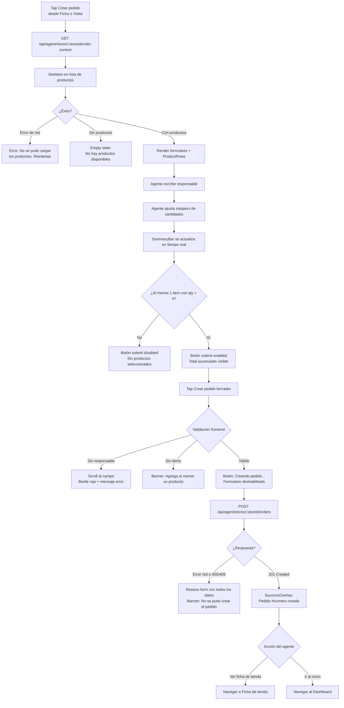

# Vista: Pedido borrador — Agente comercial

## Estado del documento
- Autor: `planning-agent-b3bfeb`
- Referencia UX/UI: `senior-ux-ui-designer-unpinned` (sesión `senior-ux-ui-designer-unpinned-session-afe28e`)
- Estado: listo para revisión de desarrollo/producto
- Alcance: especificación UX/UI para la pantalla `Pedido borrador` (P4) del workspace del agente comercial (`agent/*`)

## Fuentes utilizadas
Este documento se apoya en fuentes verificadas del repositorio y en la UI legacy preservada:
- `docs/ui-guidelines.md`
- `src/routes/agent.routes.js`
- `src/schemas/agent-workspace.schema.js`
- `src/services/agent-workspace.service.js`
- `src/services/agent-workspace-store-state.service.js`
- `legacy-public-runtime/agent/order-entry.html`
- `legacy-public-runtime/agent/order-entry.js`

## Contexto actual verificado
- La pantalla vive en el contexto `agent/*`, separado del shell administrativo `root/*`.
- `legacy-public-runtime/agent/order-entry.html` implementa el formulario de pedido con un grid de productos donde cada uno tiene un `input[type=number]` para la cantidad.
- `legacy-public-runtime/agent/order-entry.js` lee el `storeId` del query param, hace `GET /api/agent/stores/:storeId/order-context`, renderiza los productos con inputs numéricos y hace `POST /api/agent/stores/:storeId/orders` al crear el pedido.
- La validación frontend en el legacy verifica al menos un ítem con `quantity > 0`; si no, muestra mensaje inline. El `unitPrice` se toma del producto devuelto por el API; el agente no lo edita.
- En el legacy, el éxito se comunica mediante un mensaje inline (`#order-message`). No existe overlay ni modal de confirmación.
- El backend valida en `createAgentOrderSchema` que `items` tenga mínimo 1 elemento (`z.array(...).min(1).max(100)`). El campo `responsible` es `.optional().nullable()` en el contrato backend, pero se requiere como campo UX para identificar quién autorizó el pedido en campo.
- `serializeStoreCard` en `agent-workspace-store-state.service.js` expone `pendingBalance` como `invoiceSummary.visiblePendingBalance`, confirmando disponibilidad del saldo para el ContextStrip.
- `assertAgentOrderItemsAvailable` en el servicio lanza un `409` si la cantidad solicitada supera el stock disponible. Por tanto, la UI puede advertir pero no debe bloquear la creación; el backend es la autoridad final sobre disponibilidad.
- Los productos disponibles se serializan filtrando solo aquellos con `availableQuantity > 0` y lotes vendibles. El campo `availableQuantity` es un número con hasta 3 decimales.
- El `createAgentStoreOrder` delega en `orderService.createOrder` y responde con `201` y el objeto de pedido creado, cuyo `id` es el número de pedido mostrado al agente.

## Objetivo de la pantalla
Permitir al agente comercial crear un pedido de productos desde la tienda del cliente en campo. El agente selecciona cantidades de los productos disponibles y el sistema genera un borrador que sigue el flujo normal de aprobación.

## Objetivo del usuario
- Ver rápidamente qué productos están disponibles para la tienda visitada.
- Seleccionar cantidades con facilidad desde el celular, idealmente con una sola mano.
- Saber el total acumulado del pedido en tiempo real antes de confirmar.
- Crear el pedido con confirmación explícita del número asignado.
- Navegar de vuelta a la Ficha de tienda o al Dashboard después del éxito.

## Objetivo del negocio
- Digitalizar la toma de pedidos en campo sin necesidad de llamar al supervisor.
- Aumentar la conversión de visitas en pedidos registrados en el sistema.
- Generar borradores que siguen el flujo normal de aprobación y auditoría.

## Alcance MVP
### Incluye
- Header con eyebrow, título y botón Volver.
- ContextStrip fijo: nombre de tienda y saldo pendiente.
- Campo: Responsable del pedido (requerido en UX, texto, maxlength 255).
- Campo: Notas del pedido (opcional, textarea, maxlength 2000).
- Sección de productos: caption con conteo, ProductSearchInput para filtrar localmente, ProductRow × N.
- ProductRow: nombre, código, precio unitario, stock disponible, StepperInput `[−][qty][+]`.
- SummaryBar sticky al fondo: resumen de productos seleccionados y total en tiempo real, más botón de submit.
- Botón submit disabled cuando no hay ítems seleccionados; enabled cuando al menos un producto tiene `qty > 0`.
- Total calculado en tiempo real al ajustar steppers: `Σ (qty × unitPrice)`.
- SuccessOverlay modal no cerrable con Escape ni tap fuera: muestra número de pedido y dos CTAs de navegación.
- Producto con `availableQuantity === 0`: fila deshabilitada con badge `Sin stock`.
- Advertencia visual cuando `qty > availableQuantity` (no bloquea; el backend decide).
- Skeleton loading en lista de productos durante el GET del contexto.
- Estados: loading, empty, error, success, disabled, saving.
- Responsive mobile-first.

### No incluye en esta fase
- Edición del precio del producto (el agente no puede modificar el `unitPrice`).
- Guardar borrador sin enviar.
- Pedidos programados o con fecha futura.
- Selección de bodega (la bodega la define el flujo administrativo posterior).
- Historial de pedidos desde esta pantalla.
- Firma digital del cliente.
- Descuentos por producto o por cliente (el esquema los soporta con valor `0` por defecto).

## Decisiones cerradas para desarrollo
### StepperInput en lugar de input directo
Los botones `[−]` y `[+]` de mínimo 44×44 px son más precisos en campo que tipear números. El agente puede operar en calle, con guantes o con una sola mano. El input central sigue siendo editable directamente para quienes prefieren tipear.

### Total en tiempo real
El SummaryBar calcula y muestra el total acumulado cada vez que cambia un stepper. Fórmula: `Σ (qty × product.price)`. Sin latencia perceptible: el cálculo es local sobre el Map de cantidades.

### unitPrice del servidor
El `items[].unitPrice` en el payload es el `price` del producto devuelto por el API. El agente no puede modificarlo. La UI lo muestra como referencia en el ProductRow pero no expone un input de precio.

### Require al menos 1 ítem con qty > 0
La validación frontend bloquea el submit si ningún ítem tiene `qty > 0`. El backend también lo valida con `items.min(1)`. La UI muestra el botón disabled y, si se intenta hacer submit sin ítems, muestra un banner de advertencia.

### SuccessOverlay obligatorio
El agente debe confirmar la siguiente acción antes de salir. El overlay previene la confusión de "¿lo guardé o no?". No puede cerrarse accidentalmente con Escape ni tap fuera del card. Solo se cierra eligiendo una de las dos CTAs.

### Búsqueda local de productos
El ProductSearchInput filtra la lista renderizada localmente sin re-fetch al backend. La búsqueda cubre nombre y código del producto.

### Advertencia de stock excedido sin bloqueo
Si `qty > availableQuantity`, mostrar advertencia debajo del ProductRow. No bloquear el submit. El backend ejecuta `assertAgentOrderItemsAvailable` y devuelve `409` si la cantidad no es satisfacible al momento de la creación.

### Datos preservados en error de red
Si el POST falla, el formulario mantiene todos los datos incluyendo el Map de cantidades ya ingresadas. El agente no pierde el trabajo acumulado.

### Scroll al primer error de validación
Si hay error de validación al presionar submit, hacer scroll automático al primer campo con problema y enfocar el elemento visualmente.

### Campo Responsable requerido en UX
Aunque el backend acepta `responsible: null`, la UX lo requiere para identificar al autorizador del pedido en campo. La validación frontend impide el submit sin este campo.

## Contrato backend verificado
### Endpoints utilizados
- `GET /api/agent/stores/:storeId/order-context`
- `POST /api/agent/stores/:storeId/orders`

### Respuesta del GET order-context
```
{
  store: {
    id, clientId, clientName, legalEntityName, code, name, phone,
    address, locationReference, latitude, longitude,
    routeId, routeCode, routeName, visitFrequencyDays, nearLimitDays,
    regionName, subregionName, representativesCount,
    latestVisitAt, latestVisitComment, status, daysSinceReference,
    dueInDays, isNearLimit, pendingBalance, isNew
  },
  sellableProducts: {
    products: [
      { id, code, name, price, categoryName, subcategoryName,
        inCatalog, availableQuantity, warehouseCount, lotCount }
    ],
    suggestions: [...]
  }
}
```

### Body del POST orders
```json
{
  "responsible": "string (max 255, requerido por UX, opcional por backend)",
  "notes": "string | null (max 2000)",
  "items": [
    {
      "productId": "bigint",
      "quantity": "number (positive)",
      "unitPrice": "number (min 0)",
      "discountPercent": 0,
      "discountAmount": 0,
      "totalDiscount": 0
    }
  ]
}
```

### Respuesta del POST orders
- `201 Created`: objeto de pedido creado. El campo `id` es el número de pedido mostrado al agente.
- `400`: error de validación (sin ítems, campos inválidos).
- `404`: la tienda no pertenece a la cobertura del agente.
- `409`: stock insuficiente para uno o más productos al momento del POST.

### Autorización
- Política: `agent.workspace.access`
- Cookie same-origin (`credentials: 'same-origin'`) más `Content-Type: application/json` en el POST.

### Restricciones de datos
No mostrar datos que no existen en el contrato verificado:
- precio histórico o especial por cliente
- descuentos preferenciales por tienda
- catálogo de otras bodegas
- fecha estimada de entrega
- número de pedidos anteriores de esta tienda (está en `purchaseHistory`, no en `order-context`)

## Usuarios esperados y permisos UX
### Usuarios con acceso esperado
- `sales_agent` con `agent.workspace.access`
- `sales_supervisor` si tiene perfil de workspace activo con `agent.workspace.access`

### Restricciones UX alineadas con backend
- La pantalla debe validar sesión al cargar y redirigir al workspace si no hay `storeId` válido o sesión activa.
- Si la tienda no pertenece a la cobertura del agente, el backend devuelve `404`. La UI debe tratar esto como un estado de acceso denegado, no como error técnico.
- El agente no puede modificar el precio. La UI no expone ningún input de `unitPrice`.

## Principios UX de la pantalla
1. **Total en tiempo real**: el agente debe ver el monto acumulado mientras agrega cantidades. Evita pedidos excesivos o insuficientes al momento de cerrar la visita.
2. **Stepper en lugar de input directo**: con una mano y posiblemente guantes, tocar `[+]` o `[−]` es más preciso que tipear un número. Los botones de mínimo 44×44 px cumplen las guías de touch target.
3. **Búsqueda integrada en el catálogo**: con catálogos de 20 o más ítems, el filtro sobre la lista en memoria es esencial. No requiere cambiar de pantalla ni disparar una nueva llamada al backend.
4. **Confirmación explícita post-pedido**: el SuccessOverlay garantiza que el agente sabe que el pedido fue creado y puede ver el número asignado antes de navegar a otra pantalla.

## Flujo UX general


## Posicionamiento en el shell del agente
```text
AgentShell
└── OrderEntryPage
    ├── AgentHeader (fixed, 64px)
    │   ├── [← Volver]
    │   └── Eyebrow + Título
    ├── ContextStrip (sticky top: 64px, 48px)
    │   └── Nombre tienda · Saldo ₡{pendingBalance}
    ├── OrderForm (scrollable, padding-bottom: 88px para SummaryBar)
    │   ├── Campo: Responsable (requerido)
    │   ├── Campo: Notas (opcional)
    │   └── ProductsSection
    │       ├── Caption: "{N} productos · Ingresa cantidades para agregar"
    │       ├── ProductSearchInput
    │       └── ProductRow × N
    │           ├── Nombre + Código
    │           ├── Precio + Stock
    │           └── StepperInput [−][qty][+]
    ├── SummaryBar (sticky bottom, 72px + safe-area-inset)
    │   ├── Texto resumen izquierda
    │   └── [Crear pedido borrador]
    └── SuccessOverlay (visible tras POST 201)
        ├── Ícono ✓
        ├── Título: Pedido creado
        ├── Cuerpo: Pedido #{N} para {tienda}...
        ├── [Ver ficha de tienda]
        └── [Ir al inicio]
```

## Decisión de navegación recomendada
### Recomendación principal
La pantalla es una ruta dedicada dentro del shell del agente, navegable desde la Ficha de tienda (`?storeId=...`). Al confirmar el pedido, el SuccessOverlay obliga al agente a elegir explícitamente hacia dónde navegar: `Ver ficha de tienda` o `Ir al inicio`.

### Rechazo recomendado
No volver al formulario legacy `legacy-public-runtime/agent/order-entry.html`. La pantalla moderna reemplaza la lógica de inputs numéricos por StepperInput, agrega SummaryBar en tiempo real y SuccessOverlay explícito.

## Estructura de la pantalla

## Header
### Orden exacto
1. Botón de retroceso: `← Volver`
2. Eyebrow: `PEDIDO DESDE TIENDA`
3. Título: `Crear pedido`

### Reglas del header
- El botón `← Volver` navega a la Ficha de tienda con el mismo `storeId` (mismo destino que el botón `Volver` del legacy).
- El eyebrow va en mayúsculas para diferenciar el contexto operativo.
- No incluir `Cerrar sesión` ni acciones de shell en el header de la pantalla.

## ContextStrip
### Especificación
- Posición: sticky, `top: 64px` (debajo del AgentHeader fijo), altura `48px`.
- Fondo: `#F8FAFC`, `border-bottom: 1px solid #E2E8F0`.
- Contenido: `{store.name} · Saldo ₡{store.pendingBalance}`.
- Render inmediato desde los datos del GET order-context. No requiere llamada adicional.
- Si `pendingBalance` es `0` o nulo, mostrar `Saldo ₡0` de todas formas para mantener el patrón visual.

## Campo Responsable
### Especificación
- Label: `Responsable del pedido *`
- Placeholder: `Nombre de quien autoriza...`
- Tipo: `text`, `maxlength: 255`
- Requerido en UX: la validación frontend bloquea el submit si está vacío.
- Min-height: `48px`, `font-size: 16px` (evita zoom automático en iOS).
- En error: borde `#DC2626`, mensaje debajo `Ingresa el nombre del responsable.`

## Campo Notas
### Especificación
- Label: `Notas del pedido (opcional)`
- Placeholder: `Indicaciones de entrega, urgencia, observaciones...`
- Tipo: `textarea`, `rows: 3`, `maxlength: 2000`
- Opcional: no bloquea el submit si está vacío.

## Sección de productos
### Caption
- Texto: `{N} productos · Ingresa cantidades para agregar`
- `{N}` es la cantidad total de productos en la respuesta del API (antes de filtrar por búsqueda).
- Se actualiza si el usuario limpia la búsqueda.

### ProductSearchInput
- Placeholder: `Buscar producto...`
- Filtra la lista de ProductRows localmente por `name` o `code` del producto (case-insensitive).
- Sin re-fetch: opera sobre el array de productos ya cargados en memoria.
- Si no hay resultados: mostrar mensaje `No encontramos productos con ese nombre.` y CTA `Limpiar búsqueda`.
- El stepper de un producto filtrado fuera retiene su valor; si el agente limpia la búsqueda, la cantidad sigue ahí.

### ProductRow
Cada fila de producto contiene:
- **Línea 1**: nombre en negrita + código en secundario.
- **Línea 2**: precio `₡{price}` + `Stock: {availableQuantity}` — si `availableQuantity === 0`: badge gris `Sin stock` en lugar del stock.
- **StepperInput**: `[−][qty][+]` alineado a la derecha de la fila.
- **Estado activo** (`qty > 0`): fondo `#F0FDF4`, borde izquierdo `4px solid #16A34A`. Transición suave al cambiar de `qty === 0` a `qty > 0`.
- **Advertencia de stock excedido**: si `qty > availableQuantity`, mostrar debajo de la fila: `Cantidad mayor al stock disponible ({availableQuantity} unidades)`. Color warning `#F59E0B`.
- **Fila deshabilitada**: si `availableQuantity === 0`, toda la fila en estado disabled. StepperInput no interactuable. Badge `Sin stock`.
- Todos los datos de producto se escapan con `escapeHtml()` al renderizarse dinámicamente.

## StepperInput
### Especificación
- Composición: `[−]` `[valor]` `[+]` en línea horizontal.
- Botón `[−]`: mínimo `44×44px`, disabled cuando `qty === 0`.
- Input central: ancho ~48px, `text-align: center`, editable directamente. Valor inicial: `0`.
- Botón `[+]`: mínimo `44×44px`. Sin límite hard (el backend valida disponibilidad).
- `aria-label="Cantidad de {nombre del producto}"` en el input central.
- Cuando `qty > 0`: `border-color: #16A34A` en los tres elementos del stepper.

## SummaryBar sticky
### Especificación
- Posición: `sticky`, `bottom: 0`, altura `72px` + `padding-bottom: env(safe-area-inset-bottom)` para notch de iPhone.
- Fondo: `#FFFFFF`, `border-top: 1px solid #E2E8F0`.
- **Izquierda** (sin ítems): `Sin productos seleccionados` en color `#64748B`.
- **Izquierda** (con ítems): `{N} producto(s) · Total ₡{X}` donde `{X}` = `Σ (qty × product.price)`.
- **Derecha**: botón `[Crear pedido borrador]`.
  - Disabled cuando no hay ítems: `cursor: default`, opacidad reducida, sin hover effect.
  - Enabled cuando hay ítems: primary green `#16A34A`, hover `#15803D`.
- **Estado saving**: botón cambia a `Creando pedido...`, disabled, formulario deshabilitado.
- El formulario debe tener `padding-bottom` suficiente para que el último ProductRow no quede oculto detrás de la SummaryBar.

## SuccessOverlay
### Especificación
- Modal fijo sobre toda la pantalla, `position: fixed`, `inset: 0`, `z-index` sobre el formulario.
- Fondo backdrop: `rgba(0, 0, 0, 0.5)`.
- Card central: `background: #FFFFFF`, `border-radius: 16px`, `max-width: 360px`, `padding: 24px`, centrado.
- **No cerrable** con Escape ni tap fuera del card. Requiere decisión explícita.
- Ícono: checkmark `✓` en verde `#16A34A`, tamaño grande.
- Título: `Pedido creado` (`id="order-success-title"`).
- Cuerpo: `Pedido #{número} para {tienda} quedará en proceso de aprobación.`
- CTA 1 (primario): `[Ver ficha de tienda]` → navega a Ficha de tienda con el mismo `storeId`.
- CTA 2 (secundario): `[Ir al inicio]` → navega al Dashboard del agente.
- Atributos de accesibilidad: `role="dialog"`, `aria-modal="true"`, `aria-labelledby="order-success-title"`.
- Al aparecer, mover el foco al primer CTA del overlay.

## Skeleton loading
### Especificación
- **ContextStrip**: render inmediato. Los datos del `store` se conocen desde el inicio del GET.
- **Campos Responsable y Notas**: render inmediato. El formulario está vacío al cargar.
- **Lista de ProductRows**: mostrar 5 skeleton rows animadas (`animation: shimmer`) mientras dura el GET. Altura aproximada de `80px` cada una.
- **SummaryBar**: visible desde el inicio con estado `Sin productos seleccionados` y botón disabled.

## Empty states
### Sin productos disponibles
- Se activa cuando el GET devuelve `sellableProducts.products.length === 0`.
- Ícono: 📦
- Título: `No hay productos disponibles`
- Texto: `No hay productos disponibles para esta tienda en este momento. Consulta con tu supervisor si el catálogo no está actualizado.`
- CTA: `[← Volver a la ficha]`
- No mostrar SummaryBar ni botón de submit en este estado.

### ProductSearchInput sin resultados
- Se activa cuando el filtro local no encuentra coincidencias.
- Texto en la lista: `No encontramos productos con ese nombre.`
- CTA inline: `[Limpiar búsqueda]`
- El SummaryBar sigue visible con el total de ítems ya seleccionados (aunque no sean visibles por el filtro).

## Error states
### Error de carga (GET order-context falla)
- Banner en lugar del contenido de productos.
- Título: `No se pudo cargar los productos.`
- Texto: `Revisa tu conexión e intenta de nuevo.`
- CTA: `[Reintentar]` — vuelve a llamar al GET.
- No mostrar SummaryBar con botón enabled en este estado.

### Error de validación: sin responsable
- Scroll automático al campo Responsable.
- Borde del input en `#DC2626`.
- Mensaje debajo del campo: `Ingresa el nombre del responsable.`

### Error de validación: sin ítems
- Banner amarillo encima de la SummaryBar: `Agrega al menos un producto al pedido.`
- El botón submit permanece disabled.

### Error de red o servidor (POST falla)
- Restore completo del formulario: campos de texto y Map de cantidades se preservan intactos.
- Botón submit vuelve a `Crear pedido borrador` y se habilita.
- Banner rojo: `No se pudo crear el pedido. Revisa tu conexión.`
- CTA secundario dentro del banner: `[Reintentar]`

### Error 409 de stock (POST falla por disponibilidad)
- Mismo comportamiento de restore de formulario.
- Banner rojo con el mensaje del backend (ej. `Solo hay {N} unidades vendibles disponibles para {producto}`).
- El agente puede ajustar la cantidad y reintentarlo.

## Visual design
### Paleta
Alineada a `ui-guidelines.md`:
- Primary: `#16A34A`
- Primary hover: `#15803D`
- Títulos / navegación: `#0F172A`
- Fondo app: `#F8FAFC`
- Superficie: `#FFFFFF`
- Borde: `#E2E8F0`
- Texto secundario: `#64748B`
- Warning: `#F59E0B`
- Danger: `#DC2626`
- Success light: `#F0FDF4` (fondo de ProductRow activo)

### Tono visual
- Operacional, de campo y centrado en la tarea única.
- Debe sentirse como una toma de pedido rápida, no como un CRUD genérico.
- Jerarquía clara: datos de tienda arriba, catálogo en el centro, total y acción siempre visibles.

### Clases CSS reutilizadas del legacy
`agent-shell`, `card`, `agent-flow-page`, `page-header`, `agent-flow-header`, `agent-order-form`, `pricing-grid`, `toolbar-actions`, `agent-products-grid`, `agent-order-product-card`, `muted`, `message`

### Clases CSS nuevas requeridas
`agent-context-strip`, `agent-stepper`, `agent-stepper--active`, `agent-summary-bar`, `agent-product-row--selected`, `agent-product-row--disabled`, `agent-product-row--warning`, `agent-success-overlay`, `agent-search-input`

## Responsive rules
| Breakpoint | Comportamiento |
|---|---|
| Mobile 375px+ (prioridad) | ProductRow: layout vertical — nombre/código arriba, precio + stepper abajo. SummaryBar sticky 72px con `safe-area-inset-bottom`. ProductSearchInput full-width. |
| Tablet 768px+ | ProductRows en grilla de 2 columnas. Campos Responsable y Notas en fila side-by-side. |
| Desktop 1024px+ | Layout split: columna izquierda 40% con Responsable, Notas y SummaryBar; columna derecha 60% con catálogo de productos con scroll independiente. |

## Wireframe ASCII — Mobile 375px

```
┌────────────────────────────────────────┐
│ ← Volver                               │  ← AgentHeader (fixed, 64px)
│ PEDIDO DESDE TIENDA                    │
│ Crear pedido                           │
├────────────────────────────────────────┤
│ Tienda El Sol · Saldo ₡12,400          │  ← ContextStrip (sticky, 48px)
├────────────────────────────────────────┤
│                                        │
│ Responsable del pedido *               │  ← Campo requerido
│ ┌──────────────────────────────────┐   │
│ │ Nombre de quien autoriza...      │   │
│ └──────────────────────────────────┘   │
│                                        │
│ Notas del pedido (opcional)            │
│ ┌──────────────────────────────────┐   │
│ │ Indicaciones de entrega...       │   │
│ │                                  │   │
│ │                                  │   │
│ └──────────────────────────────────┘   │
│                                        │
│ 12 productos · Ingresa cantidades      │
│ ┌──────────────────────────────────┐   │
│ │ 🔍 Buscar producto...            │   │  ← ProductSearchInput
│ └──────────────────────────────────┘   │
│                                        │
│ ┌──────────────────────────────────┐   │
│ │ Arroz 500g                  [−][0][+]│  ← ProductRow (qty=0)
│ │ COD-001 · ₡850  Stock: 48   │   │
│ └──────────────────────────────────┘   │
│                                        │
│ ┌──────────────────────────────────┐   │
│ │ Frijoles 1kg               [−][2][+]│  ← ProductRow activo (qty>0)
│ │ COD-002 · ₡1,200  Stock: 30 │   │  ← Fondo #F0FDF4, borde verde
│ └──────────────────────────────────┘   │
│                                        │
│ ┌──────────────────────────────────┐   │
│ │ Aceite 1L                   [−][0][+]│
│ │ COD-003 · ₡1,500  Sin stock  │   │  ← Fila disabled, badge gris
│ └──────────────────────────────────┘   │
│                                        │
│ ┌──────────────────────────────────┐   │
│ │ Azúcar 2kg                 [−][5][+]│  ← ProductRow activo
│ │ COD-004 · ₡950  Stock: 3   │   │
│ │ ⚠ Cantidad mayor al stock          │  ← Advertencia (qty 5 > stock 3)
│ │   disponible (3 unidades)          │
│ └──────────────────────────────────┘   │
│                                        │
│ ... más productos ...                  │
│                                        │
├────────────────────────────────────────┤
│ 2 producto(s) · Total ₡7,150  [Crear] │  ← SummaryBar (sticky, 72px)
└────────────────────────────────────────┘

────── SuccessOverlay (tras POST 201) ──

┌────────────────────────────────────────┐
│ ░░░░░░░░░░░░░░░░░░░░░░░░░░░░░░░░░░░░ │  ← Backdrop rgba(0,0,0,0.5)
│ ░░ ┌──────────────────────────┐ ░░░░ │
│ ░░ │          ✓               │ ░░░░ │  ← Checkmark verde grande
│ ░░ │    Pedido creado         │ ░░░░ │
│ ░░ │                          │ ░░░░ │
│ ░░ │ Pedido #4821 para Tienda │ ░░░░ │
│ ░░ │ El Sol quedará en proceso│ ░░░░ │
│ ░░ │ de aprobación.           │ ░░░░ │
│ ░░ │                          │ ░░░░ │
│ ░░ │ [  Ver ficha de tienda  ]│ ░░░░ │  ← CTA primario
│ ░░ │ [      Ir al inicio     ]│ ░░░░ │  ← CTA secundario
│ ░░ └──────────────────────────┘ ░░░░ │
│ ░░░░░░░░░░░░░░░░░░░░░░░░░░░░░░░░░░░░ │
└────────────────────────────────────────┘
```

## Copy recomendado completo
| Elemento | Copy |
|---|---|
| Eyebrow | `PEDIDO DESDE TIENDA` |
| Título | `Crear pedido` |
| Botón retroceso | `← Volver` |
| ContextStrip | `{Tienda} · Saldo ₡{pendingBalance}` |
| Responsable label | `Responsable del pedido *` |
| Responsable placeholder | `Nombre de quien autoriza...` |
| Notas label | `Notas del pedido (opcional)` |
| Notas placeholder | `Indicaciones de entrega, urgencia, observaciones...` |
| Caption productos | `{N} productos · Ingresa cantidades para agregar` |
| Buscar producto | `Buscar producto...` |
| Stock label | `Stock: {N}` |
| Badge sin stock | `Sin stock` |
| StepperInput aria | `Cantidad de {nombre del producto}` |
| SummaryBar vacío | `Sin productos seleccionados` |
| SummaryBar con ítems | `{N} producto(s) · Total ₡{X}` |
| Botón submit | `Crear pedido borrador` |
| Botón submit loading | `Creando pedido...` |
| Advertencia stock | `Cantidad mayor al stock disponible ({N} unidades)` |
| Error responsable vacío | `Ingresa el nombre del responsable.` |
| Error sin ítems | `Agrega al menos un producto al pedido.` |
| Error de red | `No se pudo crear el pedido. Revisa tu conexión.` |
| Búsqueda sin resultados | `No encontramos productos con ese nombre.` |
| CTA limpiar búsqueda | `Limpiar búsqueda` |
| Error carga título | `No se pudo cargar los productos.` |
| Error carga texto | `Revisa tu conexión e intenta de nuevo.` |
| CTA reintentar | `Reintentar` |
| Success título | `Pedido creado` |
| Success cuerpo | `Pedido #{número} para {tienda} quedará en proceso de aprobación.` |
| CTA éxito 1 | `Ver ficha de tienda` |
| CTA éxito 2 | `Ir al inicio` |
| Empty title | `No hay productos disponibles` |
| Empty cuerpo | `No hay productos disponibles para esta tienda en este momento. Consulta con tu supervisor si el catálogo no está actualizado.` |
| Empty CTA | `← Volver a la ficha` |

## Recomendaciones de implementación técnica
- Crear la vista en `src/public/agent/views/order-entry.js` como refactor del legacy `legacy-public-runtime/agent/order-entry.js`.
- El `storeId` se obtiene de `new URLSearchParams(window.location.search).get('storeId')`.
- Mantener un `Map<productId, quantity>` como fuente de verdad de cantidades durante toda la sesión de la pantalla. Este Map se preserva ante errores de red.
- Recalcular el total con cada evento de cambio en el stepper: `Σ (qty × product.price)`. Reutilizar la misma función `currency()` del legacy para formato `₡{X}`.
- El payload `items[]` se construye filtrando solo las entradas del Map donde `quantity > 0`.
- `items[].unitPrice` = `product.price` del objeto producto del API. No editable por el agente.
- `items[].discountPercent`, `items[].discountAmount`, `items[].totalDiscount`: enviar siempre en `0` (el backend los acepta con ese default).
- Reutilizar `escapeHtml()` del legacy para todos los datos de producto renderizados dinámicamente.
- Reutilizar `credentials: 'same-origin'` en todos los fetch, y `Content-Type: application/json` en el POST.
- El SuccessOverlay debe bloquear el foco con un trap: al presionar Tab desde el último CTA, el foco vuelve al primero.
- La búsqueda local debe normalizarse: `texto.toLowerCase()` sobre `name` y `code` del producto.
- En mobile, asegurar que el input de Responsable y el textarea de Notas tengan `font-size: 16px` para evitar zoom automático de Safari/iOS.
- Añadir `padding-bottom` al formulario scrollable igual a la altura de la SummaryBar más el `safe-area-inset-bottom` para que el último producto sea accesible.

## Pruebas mínimas sugeridas
- Render de todos los ProductRows con datos reales devueltos por `GET /api/agent/stores/:storeId/order-context`.
- StepperInput incrementa y decrementa correctamente. El botón `[−]` está disabled cuando `qty === 0`.
- SummaryBar total se actualiza en tiempo real al cambiar cualquier stepper.
- Botón submit disabled cuando no hay ítems con `qty > 0`; enabled cuando hay al menos uno.
- Producto con `availableQuantity === 0`: fila completa en disabled con badge `Sin stock`.
- Advertencia de stock excedido cuando `qty > availableQuantity`. No bloquea el submit.
- Error de validación sin responsable: scroll al campo, borde rojo, mensaje debajo.
- Error de validación sin ítems: banner visible sobre SummaryBar.
- POST exitoso: SuccessOverlay visible con número de pedido y nombre de tienda.
- POST fallido por error de red: formulario preserva campos de texto y cantidades del Map; banner de error visible.
- POST fallido con 409: mensaje del backend visible en banner; agente puede ajustar cantidades y reintentar.
- Búsqueda local filtra por nombre y por código del producto (case-insensitive).
- Limpiar búsqueda restaura la lista completa y muestra las cantidades ya ingresadas.
- Empty state cuando `sellableProducts.products.length === 0`: no se muestra SummaryBar con submit.
- SuccessOverlay no se cierra con Escape ni tap fuera del card.
- CTA `Ver ficha de tienda` navega con el `storeId` correcto.
- CTA `Ir al inicio` navega al Dashboard del agente.
- Pantalla redirige al workspace si no hay `storeId` en query params o no hay sesión.

## Criterios de aceptación UX/UI
- El agente puede crear un pedido en ≤ 60 segundos con la lista de productos visible desde el inicio.
- El total del pedido se actualiza en tiempo real sin latencia perceptible (cálculo local).
- Los StepperInput son usables con una sola mano en viewport de 375px.
- Si el POST falla, el formulario no pierde los datos ni las cantidades ingresadas.
- El SuccessOverlay muestra el número de pedido antes de permitir la navegación.
- La pantalla es funcional sin scroll horizontal en cualquier ancho de viewport.
- Los ítems filtrados por la búsqueda retienen sus cantidades al limpiar el filtro.

## Decisión de diseño
La pantalla de Pedido borrador debe verse como una **toma de pedido de campo**: una lista de productos con cantidades acumulables, un total visible en tiempo real y una confirmación explícita del número de pedido creado. Los StepperInput reemplazan los inputs numéricos del legacy para maximizar la precisión con una mano. El SummaryBar sticky garantiza que el agente siempre sabe cuánto lleva acumulado sin necesidad de hacer scroll. El SuccessOverlay modal con decisión forzada elimina la ambigüedad de "¿se guardó o no?" en condiciones de campo con conectividad intermitente.
