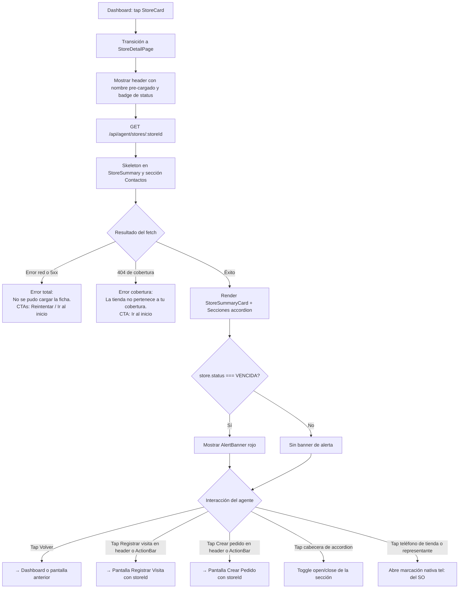

# Vista: Ficha de tienda — Agente comercial

## Estado del documento
- Autor: `planning-agent-b3bfeb`
- Referencia UX/UI: `senior-ux-ui-designer-unpinned` (sesión `senior-ux-ui-designer-unpinned-session-afe28e`)
- Estado: listo para revisión de desarrollo/producto
- Alcance: spec UX/UI para la pantalla `Ficha de tienda` del workspace del agente comercial (P2)

## Fuentes utilizadas
Este documento se apoya en fuentes verificadas del repositorio y en la UI legacy preservada:
- `docs/ui-guidelines.md`
- `src/routes/agent.routes.js`
- `src/services/agent-workspace.service.js`
- `src/services/agent-workspace-store-state.service.js`
- `src/repositories/agent-workspace.repository.js`
- `legacy-public-runtime/agent/workspace.html`
- `legacy-public-runtime/agent/workspace.js`

## Contexto actual verificado
- En `legacy-public-runtime/agent/workspace.html`, la ficha de tienda vive como el panel derecho del layout dividido del workspace. El detalle de la tienda se renderiza en `div#agent-store-detail` con clases `detail-grid agent-store-detail-grid`, y los botones `#open-visit-page-button` y `#open-order-entry-button` navegan a páginas separadas pasando `storeId` por query param.
- El historial de compras se renderiza en `div#agent-purchase-history` con clase `agent-history-list`. Los productos y sugeridos se renderizan en `div#agent-products-list` con clase `agent-products-list`.
- Los representantes de tienda se exponen en `store.representatives[]` vía `getAgentStoreDetail()` en `agent-workspace.service.js`.
- El backend expone un solo endpoint `GET /api/agent/stores/:storeId` que consolida: datos de la tienda, última visita, historial de compras con facturas, productos vendibles y sugeridos, y representantes.
- El campo `store.status` puede valer `VENCIDA`, `PROXIMA_A_VENCER`, `NUEVA` o `AL_DIA`, calculado en `agent-workspace-store-state.service.js` según la frecuencia de visita de la ruta y los días desde la última visita o creación de la tienda.
- En la versión moderna esta pantalla debe consolidarse como vista dedicada con `AgentHeader` fijo y `ActionBar` sticky, no como panel dentro del workspace dividido legacy.

## Objetivo de la pantalla
Pantalla de contexto completo antes y durante la visita a la tienda. El agente lee la situación de la cuenta y decide si registrar una visita, crear un pedido, o ambas acciones. Es el nodo central de la SPA del agente: se accede desde el Dashboard, el Mapa y el listado de tiendas, y es el origen de los flujos de Visita y Pedido.

## Objetivo del usuario
- Ver el nombre, cliente, ruta, zona y teléfono de la tienda.
- Saber cuándo fue la última visita y cuál es el saldo pendiente.
- Revisar el historial de pedidos y facturas asociadas.
- Ver los productos disponibles para un potencial pedido.
- Ver productos sugeridos de otras tiendas del mismo cliente.
- Llamar directamente al contacto de la tienda desde el teléfono móvil.
- Navegar a Registrar Visita o Crear Pedido sin perder el contexto de la tienda.

## Objetivo del negocio
- Dar al agente toda la información necesaria para actuar sobre la cuenta sin llamar al supervisor.
- Priorizar visualmente las cuentas vencidas para maximizar el cobro en terreno.
- Conectar la información comercial con la acción (visita + pedido) en un flujo fluido y sin fricciones.

## Alcance MVP
### Incluye
- Header fijo con nombre de tienda, badge de status, botones Volver, Registrar visita y Crear pedido.
- AlertBanner rojo cuando `store.status === 'VENCIDA'`.
- StoreSummaryCard: cliente, razón social, ruta, zona, teléfono como `tel:` link, dirección, referencia, última visita, próxima sugerida y saldo pendiente.
- ActionBar sticky: `[Registrar visita]` (50%) y `[Crear pedido]` (50%).
- AccordionSection Contactos — abierto por defecto.
- AccordionSection Historial de compras — cerrado por defecto, con pedidos y facturas anidadas.
- AccordionSection Productos disponibles — cerrado por defecto.
- AccordionSection Sugeridos por otras tiendas del cliente — cerrado por defecto.
- Estados: loading skeleton, error total, error de cobertura, empty por sección.
- Responsive mobile-first (375px prioridad).

### No incluye en esta fase
- Edición de datos de la tienda.
- Acción directa de pago desde esta pantalla.
- Chat o mensajes al supervisor.
- Cámara o adjunto de fotos.
- Verificación o visualización de GPS del agente.
- Mapa de ubicación de la tienda dentro de esta pantalla.

## Decisiones cerradas para desarrollo
### Dato de nombre pre-cargado
El header puede mostrar el nombre de la tienda inmediatamente usando los datos del StoreCard ya en memoria del estado de la SPA del dashboard. El fetch completo del detalle llega después y reemplaza el skeleton sin provocar flash de pantalla vacía.

### AlertBanner solo en VENCIDA
El `AlertBanner` solo aparece si `store.status === 'VENCIDA'`. No aparece para `PROXIMA_A_VENCER`, `NUEVA` ni `AL_DIA`. El status lo calcula `agent-workspace-store-state.service.js` a partir de la frecuencia de visita de la ruta y los días transcurridos desde la última visita o desde la creación de la tienda cuando no hay visitas.

### Teléfono como tel: link
El número de teléfono del store y de cada representante debe renderizarse como `<a href="tel:{phone}">{phone}</a>`. No se muestra botón de copiar número; la marcación nativa es la acción esperada en campo. Si el teléfono es nulo o vacío, el campo se omite del render.

### Saldo pendiente prominente
`purchaseHistory.pendingBalance` es el dato más prominente del StoreSummaryCard después del nombre de la tienda. Se muestra en `#DC2626` cuando es mayor a cero y en `#16A34A` cuando es igual a cero. El label en saldo cero debe ser `Sin saldo pendiente ✓`.

### Accordion por defecto
Contactos abierto por defecto porque el agente puede necesitar el teléfono del contacto de inmediato. Historial, Productos y Sugeridos cerrados por defecto; el agente los abre bajo demanda sin verse obligado a hacer scroll de toda la información al cargar.

### ActionBar en dos ubicaciones
Los CTAs `Registrar visita` y `Crear pedido` se repiten en el header fijo y en el ActionBar sticky debajo del StoreSummaryCard. El agente nunca busca los botones independientemente de cuánto haya scrolleado.

### Proxy de sugerencias incluido en el endpoint principal
`sellableProducts.suggestions[]` viene en el mismo response de `GET /api/agent/stores/:storeId`. No se dispara ningún GET adicional para sugerencias desde esta pantalla.

### Botones deshabilitados durante la carga
El ActionBar y los botones del header deben tener `disabled` mientras el fetch del detalle está en vuelo. Se habilitan al completar la carga exitosamente. Si termina en error total, permanecen deshabilitados.

### Representantes vs. contactos del cliente
`store.representatives[]` (personas físicas en el local) es distinto de `store.clientContacts[]` (contactos administrativos del cliente). La sección Contactos debe mostrar `representatives[]` como fuente primaria. Si `representatives[]` está vacío pero `clientContacts[]` tiene elementos, pueden mostrarse como fallback con etiqueta diferenciada.

## Contrato backend verificado
### Endpoint principal
`GET /api/agent/stores/:storeId` — autorización: `agent.workspace.access` (cookie `same-origin`)

Responde con la siguiente estructura consolidada:
```json
{
  "store": {
    "id": "bigint",
    "name": "string",
    "clientId": "bigint",
    "clientName": "string",
    "legalEntityName": "string | null",
    "code": "string | null",
    "phone": "string | null",
    "address": "string | null",
    "locationReference": "string | null",
    "routeId": "bigint | null",
    "routeCode": "string | null",
    "routeName": "string | null",
    "regionName": "string | null",
    "subregionName": "string | null",
    "status": "VENCIDA | PROXIMA_A_VENCER | NUEVA | AL_DIA",
    "daysSinceReference": "number",
    "dueInDays": "number",
    "pendingBalance": "number",
    "latestVisitAt": "ISO8601 | null",
    "latestVisitComment": "string | null",
    "attentionSchedule": "string | null",
    "representatives": [
      {
        "id": "bigint",
        "fullName": "string",
        "position": "string | null",
        "role": "string | null",
        "phonePrimary": "string | null",
        "phoneSecondary": "string | null",
        "isPrimaryContact": "boolean"
      }
    ],
    "clientContacts": [
      {
        "id": "bigint",
        "name": "string",
        "role": "string | null",
        "email": "string | null",
        "phone": "string | null",
        "mobile": "string | null"
      }
    ]
  },
  "latestVisit": {
    "visitedAt": "ISO8601",
    "comment": "string | null",
    "suggestedNextVisitAt": "ISO8601 | null",
    "motive": "string",
    "result": "string"
  },
  "visitHistory": ["..."],
  "purchaseHistory": {
    "pendingBalance": "number",
    "orders": [
      {
        "orderId": "bigint",
        "createdAt": "ISO8601",
        "status": "string",
        "total": "number",
        "pendingBalance": "number",
        "invoices": [
          {
            "number": "string",
            "status": "PAGADA | PENDIENTE | PARCIAL | VENCIDA",
            "issuedAt": "ISO8601",
            "dueAt": "ISO8601 | null",
            "originalAmount": "number",
            "appliedAmount": "number",
            "pendingAmount": "number"
          }
        ]
      }
    ]
  },
  "sellableProducts": {
    "products": [
      {
        "id": "bigint",
        "code": "string",
        "name": "string",
        "price": "number",
        "availableQuantity": "number",
        "categoryName": "string | null",
        "subcategoryName": "string | null"
      }
    ],
    "suggestions": [
      {
        "productId": "bigint",
        "productName": "string",
        "sourceStoreName": "string | null",
        "lastPurchasedAt": "ISO8601 | null"
      }
    ]
  }
}
```

### Endpoints relacionados (destino de navegación, no usados en esta pantalla)
- `POST /api/agent/visits` — destino al navegar a Registrar Visita
- `POST /api/agent/stores/:storeId/orders` — destino al navegar a Crear Pedido
- `GET /api/agent/stores/:storeId/order-context` — usado por la pantalla de creación de pedido

### Restricciones importantes
No presentar como dato real si no existe soporte verificado en el contrato actual:
- Ubicación GPS en tiempo real del agente.
- Calificación o rating de la tienda.
- Scoring crediticio calculado.
- Geolocalización de la tienda en tiempo real.
- Historial de visitas de otros agentes a la misma tienda.

## Usuarios esperados y permisos UX
### Usuarios con acceso esperado
- `sales_agent` con permiso `agent.workspace.access`.
- `sales_supervisor` si tiene perfil de workspace activo con `agent.workspace.access`.

### Restricciones UX alineadas con backend
- El endpoint `GET /api/agent/stores/:storeId` valida que la tienda pertenezca a la cobertura del agente autenticado.
- Si la tienda no pertenece a la cobertura, el backend responde `404` y la UI debe tratar esto como error de cobertura, no como error técnico genérico.
- La UI no debe ocultar o bloquear la pantalla basándose solo en el status de la tienda; el backend es la autoridad final sobre el acceso.
- El uso aprobado de endpoints en esta pantalla es únicamente `GET /api/agent/stores/:storeId`.

## Principios UX de la pantalla
1. **Saldo pendiente como señal primaria**: el monto pendiente es el dato más prominente después del nombre. Es la razón número uno para visitar una cuenta vencida y el primer indicador que el agente consulta al llegar a la tienda.
2. **Accordion para reducir scroll**: en mobile la información es extensa. Contactos abierto por defecto para acceso inmediato; historial y productos cerrados por demanda. El agente no debe scrollear hasta el fondo para encontrar el teléfono de contacto.
3. **Acciones siempre a la vista**: dos ubicaciones de CTA — header fijo y ActionBar sticky. El agente nunca busca los botones independientemente de su posición de scroll en la pantalla.
4. **Teléfono accionable**: todos los teléfonos abren marcación nativa (`tel:` link). En campo el agente necesita llamar, no memorizar ni transcribir el número.

## Flujo UX general


## Posicionamiento en el shell del agente
```text
AgentShell
└── StoreDetailPage
    ├── AgentHeader (fixed 64px)
    │   ├── [← Volver]
    │   ├── Eyebrow: FICHA DE TIENDA
    │   ├── Nombre tienda truncado + Badge status
    │   ├── [Registrar visita] (secondary)
    │   └── [Crear pedido] (primary)
    ├── AlertBanner (condicional, solo VENCIDA)
    │   └── ⚠ Esta cuenta está vencida. Prioriza el cobro hoy.
    ├── StoreSummaryCard
    │   ├── Campos de identidad (cliente, razón social, ruta, zona, dirección, referencia)
    │   ├── Teléfono (tel: link, color #16A34A)
    │   ├── Última visita y próxima sugerida
    │   └── SaldoBlock (prominente: rojo si >0, verde si =0)
    ├── ActionBar sticky (72px)
    │   ├── [Registrar visita] 50% (secondary)
    │   └── [Crear pedido] 50% (primary)
    ├── AccordionSection: Contactos ▼ (abierto por defecto)
    │   └── RepCard[] → nombre, posición, tel: link
    ├── AccordionSection: Historial de compras ▶ (cerrado)
    │   ├── SaldoTotal
    │   └── OrderCard[] → InvoiceCard[] anidadas
    ├── AccordionSection: Productos disponibles ▶ (cerrado)
    │   └── ProductPill[] → nombre, código, precio, disponibilidad
    └── AccordionSection: Sugeridos por otras tiendas ▶ (cerrado)
        └── SuggestionItem[] → producto, tienda origen, fecha
```

## Decisión de navegación recomendada
### Recomendación principal
Implementar la Ficha de tienda como pantalla dedicada dentro del shell del agente (`src/public/agent/views/store-detail.js`), accesible desde el Dashboard, el Mapa y el listado de tiendas. El `storeId` se pasa como parámetro de URL o estado de navegación interna de la SPA.

### Rechazo recomendado
No mantener la Ficha de tienda como panel lateral embebido en el workspace legacy. La versión moderna debe ser pantalla full con header propio y ActionBar sticky, no un `div` secundario dentro del layout dividido de `workspace.html`.

## Estructura de la página

## Header de página
### Orden exacto
1. Eyebrow: `FICHA DE TIENDA`
2. Nombre de tienda truncado con `...` si supera el ancho disponible
3. Badge de status (pill)
4. CTA secundaria: `Registrar visita`
5. CTA primaria: `Crear pedido`

### Badge de status
Sistema de colores idéntico al usado en el Dashboard del agente:
| Status API | Label visible | Fondo | Texto |
|-----------|--------------|-------|-------|
| `VENCIDA` | Vencida | `#DC2626` | `#FFFFFF` |
| `PROXIMA_A_VENCER` | Próx. a vencer | `#F59E0B` | `#FFFFFF` |
| `NUEVA` | Nueva | `#16A34A` | `#FFFFFF` |
| `AL_DIA` | Al día | `#64748B` | `#FFFFFF` |

### Reglas
- El nombre completo de la tienda aparece en el StoreSummaryCard aunque esté truncado en el header.
- Los botones del header permanecen `disabled` mientras el detalle está cargando.
- El header es fijo (`position: fixed`, `height: 64px`) y no hace scroll con el contenido.
- En mobile, el eyebrow puede omitirse para ganar espacio vertical; el badge de status es suficiente indicador contextual.
- No colocar logout ni navegación global del shell dentro del header de esta pantalla; el logout sigue en el shell global del agente.

## AlertBanner (solo status VENCIDA)
### Cuándo aparece
Solo cuando `store.status === 'VENCIDA'`. No aparece para ningún otro status.

### Visual
- Fondo: `#FEF2F2`
- Borde izquierdo: `4px solid #DC2626`
- Texto: `⚠ Esta cuenta está vencida. Prioriza el cobro hoy.`
- Padding: `12px 16px`
- Sin botón de cierre; es informativo y permanente durante la sesión de la ficha.

### Posición
Inmediatamente debajo del `AgentHeader` fijo y encima del `StoreSummaryCard`, para que sea visible al cargar sin necesidad de scroll.

## StoreSummaryCard
### Campos a mostrar
| Campo | Fuente en API | Regla de color o formato |
|-------|--------------|--------------------------|
| Cliente | `store.clientName` | `#0F172A` bold |
| Razón social | `store.legalEntityName` | `#64748B` secondary |
| Ruta | `store.routeCode` + `store.routeName` | `#64748B` |
| Zona | `store.regionName` + `store.subregionName` | `#64748B` |
| Teléfono | `store.phone` como `tel:` link | `#16A34A` underline |
| Dirección | `store.address` | `#64748B` |
| Referencia | `store.locationReference` | `#64748B` italic |
| Última visita | `latestVisit.visitedAt` | `#DC2626` si VENCIDA, `#64748B` si no |
| Último comentario | `latestVisit.comment` | `#64748B` |
| Próxima sugerida | `latestVisit.suggestedNextVisitAt` | `#16A34A` si fecha futura, `#DC2626` si ya pasó |
| Saldo pendiente | `purchaseHistory.pendingBalance` | `#DC2626` bold si >0, `#16A34A` bold si =0 |

### SaldoBlock
Sección visualmente separada dentro del card, con mayor jerarquía tipográfica:
- Label: `Saldo pendiente`
- Valor formateado con `Intl.NumberFormat('es-CR', { style: 'currency', currency: 'CRC' })`
- Color del valor: `#DC2626` si `pendingBalance > 0`; `#16A34A` si `pendingBalance === 0`
- Cuando es cero: mostrar `Sin saldo pendiente ✓`
- El bloque de saldo debe ser visible sin scroll en mobile 375px.

### Reglas de render
- Si `latestVisit` es `null`, mostrar `Sin visitas registradas` en el campo de última visita.
- Si `store.phone` es `null` o vacío, omitir el campo de teléfono del card.
- Si `store.locationReference` es `null`, omitir el campo de referencia.
- Ruta se muestra como `{routeCode} — {routeName}` si ambos existen; solo el disponible si uno falta.
- Zona se muestra como `{regionName} / {subregionName}` si ambos existen.

### Skeleton de carga
Durante el fetch activo se muestra un card skeleton de cuatro líneas de texto de ancho variable, simulando campos de identidad, campo de visita y bloque de saldo.

## ActionBar sticky
### Comportamiento
- `position: sticky`, `bottom: 0`
- Permanece en la parte inferior de la ventana al hacer scroll.
- Height: `72px`
- Fondo: `#FFFFFF`
- Borde superior: `1px solid #E2E8F0`
- Padding: `12px 16px`

### Botones
- Botón izquierdo (50%): `Registrar visita` — estilo `secondary-button`
- Botón derecho (50%): `Crear pedido` — estilo primario (`#16A34A`, texto `#FFFFFF`)

### Estado durante la carga
- Ambos botones con `disabled` y apariencia atenuada mientras el fetch del detalle está en vuelo.
- Se habilitan al completar la carga exitosamente.
- Si el fetch termina en error total, permanecen deshabilitados.

### Navegación al hacer tap
- `Registrar visita` → pantalla Registrar Visita pasando el `storeId`.
- `Crear pedido` → pantalla Crear Pedido pasando el `storeId`.

## AccordionSection: Contactos
### Cabecera
`Contactos ({N})` donde `{N}` es el total de representantes disponibles.

### Estado por defecto
Abierto al cargar la pantalla.

### Contenido: RepCard
Cada representante se muestra en una tarjeta compacta con:
- Nombre completo (`representative.fullName`) — bold
- Posición o cargo (`representative.position`) — secondary
- Teléfono principal (`representative.phonePrimary`) como `<a href="tel:{phone}">` — color `#16A34A`
- Si `isPrimaryContact === true`, mostrar badge `Principal` o indicador visual equivalente

### Orden de representantes
El representante con `isPrimaryContact === true` aparece primero. El resto en el orden que devuelve el backend (ya ordenado por `isPrimaryContact desc`, `fullName asc` en el repositorio).

### Empty state
`No hay contactos registrados para esta tienda.`

### Fallback de clientContacts
Si `representatives[]` está vacío pero `store.clientContacts[]` tiene elementos, mostrarlos bajo el subtítulo `Contactos del cliente` como fallback informativo, sin tratarlos como representantes de tienda.

## AccordionSection: Historial de compras
### Cabecera
`Historial de compras`

### Estado por defecto
Cerrado.

### Contenido al abrir
- SaldoTotal: bloque encabezado con `Saldo total pendiente: ₡{pendingBalance}` — color `#DC2626` si >0, `#64748B` si es cero
- Lista de `OrderCard` por cada pedido en `purchaseHistory.orders[]`

### OrderCard
Cada pedido muestra:
- `Pedido #{orderId}` — bold
- Fecha formateada en `dd/MM/yyyy`
- Badge de status del pedido
- Total: `₡{total}` formateado
- Saldo pendiente del pedido: `₡{pendingBalance}` — color `#DC2626` si >0

### InvoiceCard (anidada dentro de OrderCard)
Cada factura muestra:
- `Factura #{number}`
- Badge de status de factura
- Fecha de emisión formateada
- Fecha de vencimiento formateada o `—` si es nula
- Monto original: `₡{originalAmount}`
- Monto abonado: `₡{appliedAmount}`
- Monto pendiente: `₡{pendingAmount}` — color `#DC2626` si >0

### Badges de factura
| Valor API | Label visible | Fondo | Texto |
|-----------|--------------|-------|-------|
| `PAGADA` | Pagada | `#16A34A` | `#FFFFFF` |
| `PENDIENTE` | Pendiente | `#F59E0B` | `#FFFFFF` |
| `PARCIAL` | Parcial | `#F59E0B` | `#FFFFFF` |
| `VENCIDA` | Vencida | `#DC2626` | `#FFFFFF` |

### Empty state
`Esta tienda no tiene compras registradas aún.`

## AccordionSection: Productos disponibles
### Cabecera
`Productos disponibles ({N})` donde `{N}` es el total de productos con `availableQuantity > 0`.

### Estado por defecto
Cerrado.

### Contenido: ProductPill
Cada producto muestra:
- Nombre (`product.name`) — bold
- Código (`product.code`) — secondary
- Precio: `₡{price}` formateado
- Disponibilidad: `{availableQuantity} disponibles` — texto secondary

### Empty state
`No hay productos disponibles en este momento.`

### Notas
- La lista proviene de `sellableProducts.products[]` del response principal.
- No renderizar productos con `availableQuantity <= 0`; el backend ya los filtra antes de serializar.

## AccordionSection: Sugeridos por otras tiendas del cliente
### Cabecera
`Sugeridos por otras tiendas del cliente`

### Estado por defecto
Cerrado.

### Contenido: SuggestionItem
Cada sugerencia muestra:
- Nombre del producto (`suggestion.productName`) — bold
- Tienda de origen: `Comprado en: {sourceStoreName}` — secondary
- Fecha de última compra: `{lastPurchasedAt}` formateado — secondary

### Empty state
`Sin sugerencias disponibles.`

### Notas
- La lista proviene de `sellableProducts.suggestions[]` del mismo response principal. No se hace GET adicional.
- Si `sourceStoreName` es `null`, mostrar solo el nombre del producto sin referencia de origen.

## Empty states
| Sección | Copy |
|---------|------|
| Sin contactos | `No hay contactos registrados para esta tienda.` |
| Sin historial | `Esta tienda no tiene compras registradas aún.` |
| Sin productos | `No hay productos disponibles en este momento.` |
| Sin sugeridos | `Sin sugerencias disponibles.` |

## Error states
### Error total de carga (red o 5xx)
Se activa cuando el fetch de `GET /api/agent/stores/:storeId` falla por razón de red o error del servidor:
- Banner en el cuerpo de la pantalla, debajo del header.
- Título: `No se pudo cargar la ficha de la tienda.`
- Texto secundario: `Verifica tu conexión y vuelve a intentarlo.`
- CTA primaria: `Reintentar`
- CTA secundaria: `Ir al inicio`
- Los botones del header y del ActionBar permanecen deshabilitados.
- El skeleton de secciones se reemplaza por el banner de error.

### Error de cobertura (404)
Se activa cuando el backend responde `404` porque la tienda no pertenece a la cobertura del agente:
- Título: `La tienda no pertenece a tu cobertura asignada.`
- CTA única: `Ir al inicio`
- No mostrar `Reintentar` porque reintentar no resolverá un problema de cobertura.

## Skeleton loading
### Comportamiento durante el fetch activo
- Header: inmediato con nombre pre-cargado desde el estado del dashboard en memoria. Badge de status disponible si el StoreCard del dashboard ya lo expone.
- StoreSummaryCard: skeleton de cuatro filas de texto de ancho variable simulando campos de identidad, campo de visita y bloque de saldo.
- ActionBar: visible pero ambos botones con `disabled`.
- AccordionSection Contactos: abierta con skeleton de dos tarjetas de representante.
- AccordionSections Historial, Productos y Sugeridos: cerradas con skeleton de cabecera visible durante la carga.

### Transición al completar
Al completar la carga, el skeleton se reemplaza con datos reales sin flash visible. No realizar re-render completo de la pantalla; reemplazar solo las secciones que tenían skeleton.

## Visual design
### Paleta
Alineada a `ui-guidelines.md` y al sistema visual del agente comercial:
- Primary: `#16A34A`, hover `#15803D`
- Títulos / negrita: `#0F172A`
- Texto secundario: `#64748B`
- Fondo de app: `#F8FAFC`
- Superficie de cards: `#FFFFFF`
- Borde: `#E2E8F0`
- Warning: `#F59E0B`
- Warning light: `#FFFBEB`
- Danger: `#DC2626`
- Danger light: `#FEF2F2`
- Success: `#16A34A`

### Tono visual
Contextual, operacional y conciso. La pantalla debe sentirse como el **dossier del agente sobre la tienda** antes de entrar a ella: datos accionables (saldo, visita, pedido) y contextuales (historial, productos, contactos) organizados en acordeones para reducir la fricción de scroll en mobile.

### Clases CSS existentes a reutilizar
- `agent-shell`, `card`, `page-header`, `agent-header`
- `detail-grid`, `agent-store-detail-grid`, `detail-item`
- `agent-history-list`, `agent-block-card`
- `badge`, `badge-warning`, `badge-success`
- `muted`, `message`
- `agent-products-grid`

### Clases CSS nuevas necesarias
- `agent-alert-banner` — para el AlertBanner condicional de cuenta vencida
- `agent-action-bar` — para el ActionBar sticky de doble CTA
- `agent-summary-saldo` — para el SaldoBlock prominente en el StoreSummaryCard

## Wireframe ASCII — Mobile 375px
```
┌─────────────────────────────────────┐  ← 375px
│  ← Volver  TIENDA ABC  [VENCIDA]   │  AgentHeader (fixed 64px)
│           [Reg. visita] [Pedido]    │
├─────────────────────────────────────┤
│ ⚠ Esta cuenta está vencida.        │  AlertBanner (solo VENCIDA)
│   Prioriza el cobro hoy.            │  bg #FEF2F2 · borde-izq #DC2626
├─────────────────────────────────────┤
│ ┌─────────────────────────────────┐ │
│ │ FICHA DE TIENDA                 │ │  StoreSummaryCard
│ │                                 │ │
│ │ Cliente      Distribuidora XYZ  │ │
│ │ Razón social XYZ Comercial S.A. │ │
│ │ Ruta         RT-02 — Ruta Sur   │ │
│ │ Zona         San José / Centro  │ │
│ │ Teléfono     ☎ 2222-3333 →link │ │
│ │ Dirección    Av. 5, San José    │ │
│ │ Referencia   Frente al parque   │ │
│ │                                 │ │
│ │ Última visita   hace 18 días    │ │
│ │ Comentario    "Cobro pendiente" │ │
│ │ Próxima sug.  22/06/2025        │ │
│ │                                 │ │
│ │ ┌─────────────────────────────┐ │ │
│ │ │ Saldo pendiente             │ │ │  SaldoBlock
│ │ │ ₡ 125.000,00   (rojo)      │ │ │
│ │ └─────────────────────────────┘ │ │
│ └─────────────────────────────────┘ │
├─────────────────────────────────────┤
│ [ Registrar visita ] [Crear pedido] │  ActionBar sticky (72px)
├─────────────────────────────────────┤
│ ▼  Contactos (2)                    │  Accordion ABIERTO por defecto
│   ┌─────────────────────────────┐   │
│   │ Juan Pérez                  │   │  RepCard
│   │ Gerente de ventas           │   │
│   │ ☎ 8888-1234  → tel: link   │   │
│   └─────────────────────────────┘   │
│   ┌─────────────────────────────┐   │
│   │ María López  [Principal]    │   │  RepCard (contacto principal)
│   │ Administradora              │   │
│   │ ☎ 7777-5678  → tel: link   │   │
│   └─────────────────────────────┘   │
├─────────────────────────────────────┤
│ ▶  Historial de compras             │  Accordion CERRADO
├─────────────────────────────────────┤
│ ▶  Productos disponibles (24)       │  Accordion CERRADO
├─────────────────────────────────────┤
│ ▶  Sugeridos por otras tiendas      │  Accordion CERRADO
└─────────────────────────────────────┘
```

## Responsive rules
| Breakpoint | Comportamiento |
|-----------|----------------|
| Mobile 375px+ (prioridad) | Header fijo 64px; ActionBar sticky 72px; StoreSummaryCard en una columna; Accordeones full-width; `tel:` link activo en todos los teléfonos |
| Tablet 768px+ | StoreSummaryCard en grid de 2 columnas; Contactos e Historial lado a lado; Productos en grid de 2 columnas |
| Desktop 1024px+ | Split: StoreSummaryCard + ActionBar (35%) izquierda fija; Secciones accordion (65%) derecha con scroll independiente |

## Copy recomendado
| Elemento | Copy |
|----------|------|
| Eyebrow | `FICHA DE TIENDA` |
| Volver | `← Volver` |
| CTA secundaria header | `Registrar visita` |
| CTA primaria header | `Crear pedido` |
| AlertBanner VENCIDA | `⚠ Esta cuenta está vencida. Prioriza el cobro hoy.` |
| Saldo label | `Saldo pendiente` |
| Saldo cero | `Sin saldo pendiente ✓` |
| Última visita | `Última visita: hace {N} días` |
| Sin visitas previas | `Sin visitas registradas` |
| Próxima sugerida futura | `Próxima: {fecha}` |
| Próxima sugerida vencida | `Próxima: {fecha} (vencida)` |
| Sección Contactos | `Contactos ({N})` |
| Contacto principal | `Principal` |
| Contactos vacío | `No hay contactos registrados para esta tienda.` |
| Contactos del cliente fallback | `Contactos del cliente` |
| Sección Historial | `Historial de compras` |
| Saldo total historial | `Saldo total pendiente: ₡{N}` |
| Historial vacío | `Esta tienda no tiene compras registradas aún.` |
| Sección Productos | `Productos disponibles ({N})` |
| Productos vacío | `No hay productos disponibles en este momento.` |
| Sección Sugeridos | `Sugeridos por otras tiendas del cliente` |
| Sugeridos origen | `Comprado en: {sourceStoreName}` |
| Sugeridos vacío | `Sin sugerencias disponibles.` |
| Error total título | `No se pudo cargar la ficha de la tienda.` |
| Error total texto | `Verifica tu conexión y vuelve a intentarlo.` |
| Error cobertura | `La tienda no pertenece a tu cobertura asignada.` |
| Retry | `Reintentar` |
| Ir al inicio | `Ir al inicio` |
| ActionBar btn 1 | `Registrar visita` |
| ActionBar btn 2 | `Crear pedido` |

## Recomendaciones de implementación técnica
- Crear vista en `src/public/agent/views/store-detail.js`.
- El `storeId` se pasa como parámetro de URL (por ejemplo `/agent?view=store-detail&storeId=123`) o por estado de navegación interna de la SPA del agente.
- El nombre de la tienda para el header pre-cargado se toma del StoreCard ya en memoria del dashboard antes de que llegue el response del detalle, para evitar flash de pantalla vacía.
- Reutilizar el helper `currency()` de los archivos legacy para formatear montos con `Intl.NumberFormat('es-CR', { style: 'currency', currency: 'CRC' })`.
- Reutilizar clases CSS existentes: `agent-shell`, `card`, `page-header`, `agent-header`, `detail-grid`, `agent-store-detail-grid`, `detail-item`, `agent-history-list`, `agent-block-card`, `badge`, `badge-warning`, `badge-success`, `muted`, `message`, `agent-products-grid`.
- Agregar tres clases CSS nuevas: `agent-alert-banner`, `agent-action-bar`, `agent-summary-saldo`.
- El accordion puede implementarse con `<details>` + `<summary>` nativos del browser para no necesitar JavaScript extra de toggle, salvo que el diseño requiera animaciones de apertura personalizadas.
- Los botones del header y del ActionBar deben compartir el mismo handler de navegación para evitar duplicación de lógica (DRY).
- No hacer fetch adicional para sugerencias; ya vienen en el response principal de `GET /api/agent/stores/:storeId`.
- Usar `credentials: 'same-origin'` en el fetch, conforme a las convenciones de `ui-guidelines.md`.
- No hardcodear el `storeId` ni el `companyId` en el archivo JS público.

## Pruebas mínimas sugeridas
- Render de todos los campos del StoreSummaryCard con datos reales del contrato verificado.
- AlertBanner solo aparece cuando `store.status === 'VENCIDA'`; no aparece para `PROXIMA_A_VENCER`, `NUEVA` ni `AL_DIA`.
- Teléfono del store y de representantes renderizan como `<a href="tel:{phone}">` funcional.
- Saldo pendiente en `#DC2626` si `> 0` y en `#16A34A` si `=== 0`.
- `SaldoBlock` muestra `Sin saldo pendiente ✓` cuando el monto es cero.
- AccordionSection Contactos está abierta por defecto al cargar la pantalla.
- AccordionSections Historial, Productos y Sugeridos están cerradas por defecto al cargar.
- Cada accordion abre y cierra correctamente al hacer tap en la cabecera.
- Historial de compras muestra InvoiceCards anidadas dentro de las OrderCards.
- Badges de facturas muestran el color correcto para cada valor de status.
- Error total de carga muestra banner con título, texto secundario, CTA Reintentar y CTA Ir al inicio.
- Error 404 de cobertura muestra mensaje específico con CTA Ir al inicio únicamente.
- Loading skeleton cubre el StoreSummaryCard y la sección Contactos abierta durante el fetch.
- ActionBar y botones del header deshabilitados durante la carga, habilitados al completar exitosamente.
- Navegación correcta a Registrar Visita y a Crear Pedido pasando el `storeId`.
- Nombre de tienda en header se muestra inmediatamente desde el estado en memoria del dashboard sin esperar el fetch del detalle.

## Criterios de aceptación UX/UI
- El saldo pendiente es visible sin hacer scroll en cualquier tamaño de pantalla soportado.
- La tienda con `status === 'VENCIDA'` muestra el AlertBanner rojo inmediatamente al cargar, sin necesidad de scroll.
- El teléfono de la tienda y de los representantes es clickable y abre la marcación nativa del SO.
- Las acciones `Registrar visita` y `Crear pedido` son accesibles desde dos puntos de la pantalla (header fijo + ActionBar sticky), independientemente de la posición de scroll del agente.
- El historial de pedidos y facturas es legible en mobile 375px sin scroll horizontal.
- Los accordions abren y cierran correctamente sin romper el layout de la pantalla.
- El nombre de la tienda en el header no provoca salto visual al recibir el detalle completo del fetch.
- El diseño es visualmente consistente con el Dashboard y con el sistema visual del agente comercial.
- En error total, el agente siempre tiene una salida clara (Reintentar o Ir al inicio).

## Decisión de diseño
La Ficha de tienda debe verse como el **dossier operativo del agente**: una pantalla centrada en el contexto de la cuenta con información accionable (saldo pendiente, registrar visita, crear pedido) y contextual (historial, productos disponibles, contactos de la tienda) organizada en acordeones para reducir la fricción de scroll en mobile. Las dos ubicaciones de CTAs principales — header fijo y ActionBar sticky — garantizan que el agente puede actuar en cualquier momento sin buscar los botones. El saldo pendiente y el AlertBanner rojo son los elementos de mayor prioridad visual en una cuenta vencida, diseñados para que el agente tome acción sin necesitar instrucciones del supervisor.
