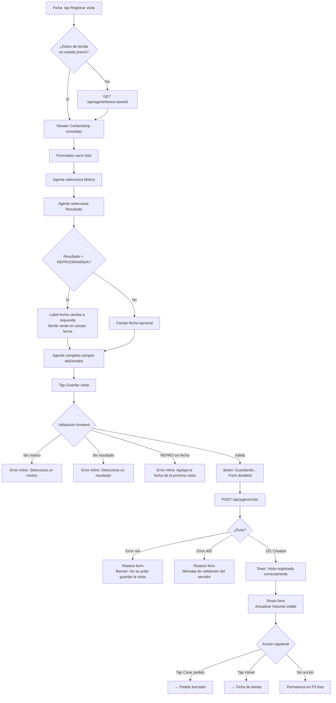

# Vista: Hoja de visita — Agente comercial

## Estado del documento
- Autor: `planning-agent-b3bfeb`
- Referencia UX/UI: `senior-ux-ui-designer-unpinned` (sesión `senior-ux-ui-designer-unpinned-session-afe28e`)
- Estado: listo para revisión de desarrollo/producto
- Alcance: especificación UX/UI para la pantalla `Hoja de visita` (P3) del workspace del agente comercial (`agent/*`)

## Fuentes utilizadas
Este documento se apoya en fuentes verificadas del repositorio y en la UI legacy preservada:
- `docs/ui-guidelines.md`
- `src/routes/agent.routes.js`
- `src/schemas/agent-workspace.schema.js`
- `src/services/agent-workspace.service.js`
- `legacy-public-runtime/agent/visit.html`
- `legacy-public-runtime/agent/visit.js`
- `legacy-public-runtime/agent/workspace.html`

## Contexto actual verificado
- La pantalla vive en el contexto `agent/*`, separado del shell administrativo `root/*`.
- El agente opera principalmente desde dispositivo móvil, de pie en la puerta de una tienda; la pantalla debe poder completarse en ≤30 segundos.
- `legacy-public-runtime/agent/visit.html` implementa el formulario de visita con motivo y resultado como `<select>`, un campo `datetime-local` y un `textarea` para comentario.
- `legacy-public-runtime/agent/visit.js` lee el `storeId` del query param (`params.get('storeId')`), hace `GET /api/agent/stores/:storeId` para el detalle de tienda, renderiza el formulario y hace `POST /api/agent/visits`. En caso de éxito, resetea el formulario y recarga el historial.
- `legacy-public-runtime/agent/visit.html` incluye un panel "Últimas visitas" que muestra hasta 6 visitas previas mediante `agent-block-card`.
- `legacy-public-runtime/agent/workspace.html` también embebe un formulario de visita inline con los mismos campos; en la versión moderna ese inline se migra a esta pantalla dedicada.
- El backend valida el body en `createAgentVisitSchema` (Zod): `clientStoreId` (BigInt coercible), `motive` enum, `result` enum, `comment` string nullable hasta 2000 caracteres, `suggestedNextVisitAt` datetime ISO 8601 nullable.
- En la versión moderna, los `<select>` de motivo y resultado se reemplazan por ButtonGroups táctiles de mínimo 48px de alto; no se introduce ninguna librería de componentes externa.
- El helper `currency()` del legacy formatea montos con `Intl.NumberFormat('es-CR', { style: 'currency', currency: 'CRC' })` y debe reutilizarse en la versión moderna.
- El agente solo puede registrar visitas a tiendas que pertenecen a su cobertura; el backend valida esto y devuelve 404 si la tienda no es accesible.

## Objetivo de la vista
Formulario operacional mínimo para registrar qué pasó en la visita a una tienda. Diseñado para completarse con rapidez desde el celular, de pie en el lugar, con el menor número de toques posible.

## Objetivo del usuario
- Registrar el motivo y resultado de la visita en pocos toques, sin abrir dropdowns.
- Añadir la fecha de la próxima visita cuando el resultado sea Reprogramada.
- Agregar un comentario rápido sobre lo que ocurrió en la visita.
- Ver las últimas visitas de la tienda para contexto inmediato antes de salir.
- Navegar a Crear pedido si corresponde hacerlo en la misma visita comercial.

## Objetivo del negocio
- Tener trazabilidad completa de las visitas comerciales en campo sin depender de que el agente recuerde registrarlas después.
- Reducir el tiempo de registro para que el agente no postergue el llenado.
- Conectar la visita con el pedido en un flujo encadenado natural dentro de la misma sesión de campo.

## Alcance MVP

### Incluye
- Header con eyebrow, título, botón Volver y botón Crear pedido.
- ContextStrip fijo: nombre de tienda, badge de estado, saldo y días desde la última visita.
- ButtonGroup táctil para motivo: Venta / Cobro / Seguimiento.
- ButtonGroup táctil para resultado: Exitosa / Pendiente / Sin contacto / Reprogramada (grid 2×2).
- Campo `datetime-local` para la próxima visita sugerida (requerido si resultado es REPROGRAMADA).
- Textarea para comentario de la visita (opcional, maxlength 2000).
- SubmitBar sticky: `[Guardar visita]` full-width con soporte `env(safe-area-inset-bottom)`.
- Panel de últimas visitas debajo del formulario (hasta 6, ordenadas por fecha descendente).
- Estados completos: loading, saving, success (toast + reset form + actualización del historial), error de validación frontend, error de red/servidor.
- Preservar datos del formulario cuando el POST falla.
- Responsive mobile-first.

### No incluye en esta fase
- Adjuntar fotos o archivos a la visita.
- Firma digital del cliente.
- Check-in geolocalizado automático.
- Notificación push al supervisor tras registrar la visita.
- Edición de visitas pasadas desde esta pantalla.

## Decisiones cerradas para desarrollo

### ButtonGroup en lugar de `<select>`
Con 3 motivos y 4 resultados, botones grandes táctiles son más rápidos en campo que abrir un menú desplegable. Un toque selecciona y confirma; no se requiere segundo toque para cerrar el dropdown.

### Campos obligatorios y opcionales
Solo 2 campos son obligatorios: motivo y resultado. Los otros 2 —fecha de próxima visita y comentario— son opcionales. La excepción es que el campo de fecha se vuelve obligatorio cuando el resultado es REPROGRAMADA (ver decisión siguiente). El agente puede registrar una visita válida en 5 segundos si solo llena motivo y resultado.

### REPROGRAMADA exige fecha
Cuando el agente selecciona Reprogramada como resultado, el campo de próxima visita pasa de opcional a obligatorio. El label cambia visualmente para indicarlo y el campo recibe borde de color primario como señal de atención. El frontend valida este requisito antes del submit.

### No auto-navegar al éxito
Tras un POST exitoso, la pantalla muestra un toast de confirmación y resetea el formulario, pero no redirige automáticamente. El agente decide qué hacer a continuación: iniciar un pedido (CTA en el header) o volver a la ficha (botón Volver). La acción más frecuente —Crear pedido— está disponible en el header durante toda la sesión de llenado.

### Datos preservados en error de red o servidor
Si el POST falla por error de red o error 4xx/5xx del servidor, el formulario conserva todos los datos ingresados. El agente no repite el trabajo. Se muestra un banner de error con un botón `[Reintentar]` que reenvía el mismo payload.

### SubmitBar con `env(safe-area-inset-bottom)`
En iOS, el SubmitBar sticky no debe quedar oculto detrás de la barra de inicio nativa. Se debe aplicar `padding-bottom: env(safe-area-inset-bottom)` para compensar el espacio del sistema.

### Historial debajo del formulario, sin navegación adicional
El panel de últimas visitas vive en el scroll natural de la misma pantalla, debajo del SubmitBar. El agente puede revisarlo después de registrar la nueva visita sin navegar a otra pantalla.

### Picker de fecha nativo
El campo de próxima visita usa `input[type="datetime-local"]`, que delega el picker al sistema operativo (iOS/Android). No se introduce ninguna librería JS de terceros para la selección de fecha.

### Carga de contexto de tienda
Si el agente llega desde la Ficha de tienda (P2), los datos de la tienda deben estar disponibles en el estado de navegación y no requieren un nuevo GET. Si la Hoja de visita se accede directamente por URL con `?storeId=`, se hace un `GET /api/agent/stores/:storeId` para cargar el contexto.

## Contrato backend verificado

### Endpoints utilizados en esta pantalla
- `GET /api/agent/stores/:storeId`
- `POST /api/agent/visits`

### Datos verificables del GET /api/agent/stores/:storeId
Según `agent-workspace.service.js` y `agent-workspace-store-state.service.js`, la pantalla puede mostrar con seguridad los siguientes campos:

Del objeto `store`:
- `name`
- `clientName`
- `routeCode`
- `regionName`
- `subregionName`
- `status` (VENCIDA / PROXIMA_A_VENCER / NUEVA / AL_DIA)
- `daysSinceReference`

Del objeto `latestVisit`:
- `visitedAt`
- `comment`

Del objeto `purchaseHistory`:
- `pendingBalance`

Del arreglo `visitHistory[]` (hasta 6 elementos ordenados por fecha descendente):
- `motive`
- `result`
- `visitedAt`
- `comment`

### Payload del POST /api/agent/visits
Body aceptado y validado por `createAgentVisitSchema`:
```json
{
  "clientStoreId": 42,
  "motive": "VENTA | COBRO | SEGUIMIENTO",
  "result": "EXITOSA | PENDIENTE | SIN_CONTACTO | REPROGRAMADA",
  "comment": "string | null",
  "suggestedNextVisitAt": "ISO 8601 | null"
}
```
Respuesta exitosa: `201 Created` con `{ visit: { ... } }`.

### Autorización
`agent.workspace.access` — cookie same-origin + `Content-Type: application/json` en el POST. El agente solo puede registrar visitas a tiendas que pertenecen a su cobertura; el backend devuelve 404 si la tienda no es accesible para el agente autenticado.

### Restricciones importantes
No presentar datos que no existen en el contrato verificado:
- Geolocalización automática de la visita al momento del registro.
- Firma digital del cliente en la visita.
- Adjuntos o fotografías vinculados a la visita.
- Estado de lectura o confirmación del supervisor.

## Usuarios esperados y permisos UX

### Usuarios con acceso esperado
- `sales_agent` con permiso `agent.workspace.access`.
- `sales_supervisor` con perfil de workspace activo y `agent.workspace.access`.

### Restricciones UX alineadas con backend
- La pantalla solo es accesible para usuarios con `agent.workspace.access`; cualquier acceso sin esa política debe redirigir al login.
- La validación de que la tienda pertenece a la cobertura del agente la hace el backend; la UI no debe asumir acceso a ninguna tienda sin confirmación del servidor.
- No exponer ningún dato administrativo de otras empresas ni de agentes distintos al autenticado.

## Principios UX de la vista
1. **ButtonGroup en lugar de `<select>`**: botones grandes táctiles permiten seleccionar motivo y resultado en un solo toque sin abrir menús desplegables. En campo, con el celular en una mano, esa diferencia importa.
2. **Formulario mínimo viable**: 2 campos obligatorios (motivo + resultado), 2 opcionales (fecha + comentario). El agente puede registrar una visita completa y válida en 5 segundos.
3. **Contexto fijo siempre visible**: el ContextStrip garantiza que el agente sabe exactamente a qué tienda está registrando la visita mientras llena el formulario, incluso en scroll.
4. **No auto-navegar al éxito**: el agente elige qué hacer después de registrar. La acción más frecuente —Crear pedido— está accesible en el header durante toda la sesión.

## Flujo UX general


## Posicionamiento dentro del AgentShell
```text
AgentShell
└── VisitPage
    ├── AgentHeader (fixed 64px)
    │   ├── [← Volver]
    │   ├── Eyebrow + Título
    │   └── [Crear pedido] (secondary)
    ├── ContextStrip (sticky top: 64px, 48px)
    │   ├── Nombre tienda · Badge status
    │   └── Saldo ₡{N} · Última visita hace {M} días
    ├── VisitForm (scrollable)
    │   ├── ButtonGroup: Motivo *
    │   │   └── [Venta] [Cobro] [Seguimiento]
    │   ├── ButtonGroup: Resultado *
    │   │   └── [Exitosa] [Pendiente] / [Sin contacto] [Reprogramada]
    │   ├── Input datetime-local: Próxima visita
    │   └── Textarea: Comentario (opcional)
    ├── SubmitBar (sticky bottom, 72px + safe-area)
    │   └── [Guardar visita] (primary, full-width)
    └── VisitHistorySection
        ├── Título: Últimas visitas
        └── VisitCard × 6 max
```

## Decisión de navegación recomendada

### Recomendación principal
Implementar la Hoja de visita como una página dedicada dentro del workspace del agente, accesible desde la Ficha de tienda mediante un CTA claro. La pantalla no debe intentar embeber el formulario de visita en la Ficha como ocurría en `workspace.html` legacy; debe ser una pantalla propia con su propio ciclo de carga, envío y retroalimentación.

### Rechazo recomendado
No volver a depender del formulario inline de `workspace.html` ni de `visit.html` legacy, porque ambos están fuera del runtime moderno soportado del agente y no implementan ButtonGroups táctiles ni ContextStrip.

## Estructura de la página

## Header de la pantalla

### Orden exacto
1. CTA back: `← Volver`
2. Eyebrow: `VISITA DE CAMPO`
3. Título: `Registrar visita`
4. CTA secondary: `Crear pedido`

### Reglas
- El header tiene posición fija (`position: fixed; top: 0`), altura 64px.
- `← Volver` navega de regreso a la Ficha de tienda correspondiente al `storeId` actual.
- `Crear pedido` es un botón secundario que navega al flujo de pedido borrador para la misma tienda.
- El botón `Crear pedido` debe permanecer visible y funcional en todo momento, incluso durante el guardado del formulario.
- No colocar `Cerrar sesión` dentro del header de esta pantalla; el logout queda en el shell global del agente.

## ContextStrip

### Especificación
- Posición: `sticky`, `top: 64px` (debajo del header fijo), altura: 48px.
- Fondo: `#F8FAFC`, borde inferior: `1px solid #E2E8F0`.
- Línea principal: `{nombre tienda}` · `[Badge status]`
- Línea secundaria (cuando hay visitas previas): `Saldo ₡{pendingBalance} · Última visita hace {N} días`
- Línea secundaria (cuando no hay visitas previas): `Saldo ₡{pendingBalance} · Sin visitas registradas`
- El badge de estado sigue la semántica visual del shell del agente: VENCIDA (rojo), PROXIMA_A_VENCER (amarillo), NUEVA (azul), AL_DIA (verde).

### Skeleton loading
- Si los datos de tienda no están disponibles en el estado de navegación, mostrar un placeholder gris animado en el ContextStrip mientras se resuelve el `GET /api/agent/stores/:storeId`.
- El placeholder debe ocupar el mismo espacio que el ContextStrip poblado para evitar saltos de layout.

## ButtonGroup — Motivo de la visita

### Especificación
- Label: `Motivo de la visita *`
- Opciones en fila horizontal (`display: flex`, `flex-wrap: wrap`):
  - `Venta` (valor: `VENTA`)
  - `Cobro` (valor: `COBRO`)
  - `Seguimiento` (valor: `SEGUIMIENTO`)
- Min-height por botón: 48px
- `role="group"` con `aria-labelledby` apuntando al label
- Cada opción es `<button type="button">` dentro del grupo; no se usa `<select>` ni `<input type="radio">`

### Estados visuales
| Estado | Estilos |
|--------|---------|
| No seleccionado | `background: #FFFFFF; border: 1px solid #E2E8F0; color: #0F172A` |
| Seleccionado | `background: #16A34A; color: #FFFFFF; border-color: #16A34A` |
| Focus | `outline: 2px solid #16A34A; outline-offset: 2px` |
| Error (sin selección al submit) | borde del grupo: `2px solid #DC2626` |

### Reglas
- Solo un botón puede estar seleccionado a la vez; al seleccionar uno, se deselecciona el anterior.
- La selección es inmediata, sin confirmación adicional.
- En error de validación (motivo faltante), el grupo completo recibe borde rojo y aparece el mensaje de error inline debajo.

## ButtonGroup — Resultado

### Especificación
- Label: `Resultado *`
- Opciones en grid 2×2 (`display: grid; grid-template-columns: 1fr 1fr`):
  - `Exitosa` (valor: `EXITOSA`)
  - `Pendiente` (valor: `PENDIENTE`)
  - `Sin contacto` (valor: `SIN_CONTACTO`)
  - `Reprogramada` (valor: `REPROGRAMADA`)
- Mismo tamaño mínimo (48px), mismos estados visuales y misma semántica de `role="group"` que el ButtonGroup de Motivo.

### Reglas
- Al seleccionar `Reprogramada`, el campo de próxima visita se convierte en obligatorio (ver sección siguiente).
- Al cambiar de `Reprogramada` a cualquier otro resultado, el campo de próxima visita vuelve a ser opcional y su label regresa al texto normal.

## Campo Próxima visita

### Especificación
- Tipo: `input[type="datetime-local"]` — usa el picker nativo del sistema operativo; no se introduce ninguna librería de terceros.
- Label normal: `Próxima visita sugerida`
- Label cuando resultado === REPROGRAMADA: `Próxima visita * (requerida para Reprogramada)`
- Min-height: 48px
- Border-radius: 8px
- Font-size: 16px (evita el zoom automático de iOS en campos más pequeños)

### Estados visuales del borde
| Estado | Borde |
|--------|-------|
| Reposo | `1px solid #E2E8F0` |
| Resultado REPROGRAMADA seleccionado | `2px solid #16A34A` |
| Focus | `border-color: #16A34A; box-shadow: 0 0 0 3px rgba(22,163,74,0.15)` |
| Error (REPROGRAMADA sin fecha al submit) | `border-color: #DC2626` |

## Textarea Comentario

### Especificación
- Label: `¿Qué pasó en la visita?`
- Placeholder: `Describe brevemente lo que ocurrió...`
- Atributos: `rows="4"`, `maxlength="2000"`
- Font-size: 16px
- Opcional; no se requiere para el submit salvo que haya lógica adicional de negocio confirmada.
- No debe mostrar resize manual en mobile; puede usarse `resize: vertical` en desktop.

## SubmitBar sticky

### Especificación
- Posición: `sticky; bottom: 0`
- Altura: 72px + `env(safe-area-inset-bottom)`
- Fondo: `#FFFFFF`
- Borde superior: `1px solid #E2E8F0`
- Contiene el botón `[Guardar visita]` de ancho completo (`width: 100%`), estilo primary.

### Estados del botón
| Estado | Apariencia |
|--------|-----------|
| Listo | `Guardar visita` — habilitado, `background: #16A34A` |
| Saving | `Guardando...` — `disabled`, `opacity: 0.7`, `pointer-events: none` en el form |
| Hover (desktop) | `background: #15803D` |

### Reglas
- Durante el estado saving, el formulario completo recibe `pointer-events: none; opacity: 0.7` para bloquear interacciones simultáneas.
- El SubmitBar nunca debe quedar detrás de la barra de inicio de iOS; se requiere `padding-bottom: env(safe-area-inset-bottom)`.

## Panel Últimas visitas

### Especificación
- Título: `Últimas visitas`
- Ubicación: debajo del SubmitBar en el scroll normal de la pantalla; no hay navegación adicional para accederlo.
- Máximo 6 tarjetas, ordenadas por fecha descendente.
- Se actualiza automáticamente después de un POST exitoso, insertando la nueva visita al tope de la lista.

### Estructura de cada VisitCard
- Línea 1 (bold): `{motive} · {result}`
- Línea 2 (muted): fecha y hora formateada con `toLocaleString('es-CR')`
- Línea 3: comentario de la visita, o `Sin comentario` en gris si está vacío

### Skeleton loading
- Mostrar 3 skeleton cards animadas mientras se carga el historial junto con el detalle de tienda.

## Wireframe ASCII — Mobile 375px
```
┌──────────────────────────────────────────────────┐ 375px
│  ← Volver   VISITA DE CAMPO   [Crear pedido]     │ ← Header fixed 64px
│             Registrar visita                      │
├──────────────────────────────────────────────────┤
│ Farmacias Cruz Verde  ● VENCIDA                  │ ← ContextStrip
│ Saldo ₡45.200 · Última visita hace 8 días        │   sticky top:64px / 48px
├──────────────────────────────────────────────────┤
│                                                  │
│  Motivo de la visita *                           │
│  ┌────────────┐ ┌────────────┐ ┌──────────────┐ │
│  │   Venta    │ │   Cobro    │ │ Seguimiento  │ │ ← ButtonGroup (3 en fila)
│  └────────────┘ └────────────┘ └──────────────┘ │   48px min-h
│                                                  │
│  Resultado *                                     │
│  ┌──────────────────┐  ┌──────────────────────┐ │
│  │     Exitosa      │  │       Pendiente       │ │ ← ButtonGroup 2×2
│  └──────────────────┘  └──────────────────────┘ │   48px min-h
│  ┌──────────────────┐  ┌──────────────────────┐ │
│  │  Sin contacto    │  │     Reprogramada      │ │
│  └──────────────────┘  └──────────────────────┘ │
│                                                  │
│  Próxima visita sugerida                         │
│  ┌────────────────────────────────────────────┐  │
│  │  dd/mm/aaaa  ── : ──  (picker nativo SO)  │  │ ← datetime-local 48px
│  └────────────────────────────────────────────┘  │
│                                                  │
│  ¿Qué pasó en la visita?                         │
│  ┌────────────────────────────────────────────┐  │
│  │ Describe brevemente lo que ocurrió...      │  │ ← Textarea
│  │                                            │  │   rows=4, maxlength=2000
│  │                                            │  │
│  │                                            │  │
│  └────────────────────────────────────────────┘  │
│                                                  │
│  ↕  scroll                                       │
├──────────────────────────────────────────────────┤
│                                                  │
│         [ Guardar visita ]  ← full-width         │ ← SubmitBar sticky
│                                                  │   72px + safe-area-inset
├──────────────────────────────────────────────────┤
│                                                  │
│  Últimas visitas                                 │
│  ┌────────────────────────────────────────────┐  │
│  │ VENTA · EXITOSA                            │  │ ← VisitCard 1
│  │ 12/05/2025, 10:30 a.m.                    │  │
│  │ Se cerró pedido de temporada alta.         │  │
│  └────────────────────────────────────────────┘  │
│  ┌────────────────────────────────────────────┐  │
│  │ COBRO · PENDIENTE                          │  │ ← VisitCard 2
│  │ 05/05/2025, 2:15 p.m.                     │  │
│  │ Sin comentario                             │  │
│  └────────────────────────────────────────────┘  │
│  ┌────────────────────────────────────────────┐  │
│  │ SEGUIMIENTO · REPROGRAMADA                 │  │ ← VisitCard 3
│  │ 28/04/2025, 9:00 a.m.                     │  │
│  │ Dueño no estaba; cita para el miércoles.  │  │
│  └────────────────────────────────────────────┘  │
└──────────────────────────────────────────────────┘
```

## Empty states

### Historial vacío (primera visita a la tienda)
- Texto: `Esta es la primera visita a esta tienda.`
- Estilo: `color: #64748B`, centrado en el contenedor del historial.
- No se muestra ninguna skeleton card en este caso; el mensaje reemplaza el área completa del historial.

## Error states

### Error de validación frontend — Motivo faltante
- Borde rojo `#DC2626` en el grupo del ButtonGroup de motivo.
- Mensaje inline debajo del grupo: `Selecciona un motivo antes de guardar.`
- El scroll hace foco al grupo de motivo si está fuera del viewport.

### Error de validación frontend — Resultado faltante
- Borde rojo `#DC2626` en el grupo del ButtonGroup de resultado.
- Mensaje inline debajo del grupo: `Selecciona un resultado antes de guardar.`

### Error de validación frontend — REPROGRAMADA sin fecha
- Borde rojo `#DC2626` en el campo datetime-local.
- Mensaje inline debajo del campo: `Agrega la fecha de la próxima visita.`

### Error de red o servidor
- Banner rojo debajo del formulario (no toast; permanece visible): `No se pudo guardar la visita. Revisa tu conexión.`
- CTA inline en el banner: `[Reintentar]` — reenvía el mismo payload sin modificar.
- El formulario NO se resetea; todos los datos ingresados se preservan.
- Si el servidor devuelve un mensaje de validación en el body de la respuesta 400, mostrarlo en lugar del texto genérico.

### Error de carga de contexto de tienda
- Si el `GET /api/agent/stores/:storeId` falla, el ContextStrip muestra: `No se pudo cargar la tienda.`
- El formulario se deshabilita completamente hasta que el contexto esté disponible.
- CTA: `[Reintentar]` en el ContextStrip.

### Success
- Toast verde (`background: #16A34A`, `color: #FFFFFF`), `aria-live="polite"`: `Visita registrada correctamente.`
- El formulario se resetea completamente: ButtonGroups sin selección, fecha vacía, textarea vacía.
- El historial se actualiza automáticamente insertando la nueva visita al tope.
- No hay redirección automática.

## Visual design

### Paleta
Alineada a `ui-guidelines.md` y al shell actual del agente:
- Primary: `#16A34A`
- Primary hover: `#15803D`
- Títulos / navegación fuerte: `#0F172A`
- Texto secundario: `#64748B`
- Fondo app: `#F8FAFC`
- Superficie: `#FFFFFF`
- Borde: `#E2E8F0`
- Warning: `#F59E0B`
- Danger: `#DC2626`

### Tokens de ButtonGroup
| Token | Valor |
|-------|-------|
| Seleccionado fondo | `#16A34A` |
| Seleccionado texto | `#FFFFFF` |
| Seleccionado borde | `#16A34A` |
| No seleccionado fondo | `#FFFFFF` |
| No seleccionado texto | `#0F172A` |
| No seleccionado borde | `#E2E8F0` |
| Focus outline | `2px solid #16A34A; offset: 2px` |
| Error borde | `2px solid #DC2626` |

### Tokens de FormField
| Token | Valor |
|-------|-------|
| Label color | `#0F172A` |
| Label font-size | `13px` |
| Label font-weight | `500` |
| Input min-height | `48px` |
| Input border | `1px solid #E2E8F0` |
| Input border-radius | `8px` |
| Input font-size | `16px` (evita zoom iOS) |
| Focus border | `#16A34A` |
| Focus shadow | `0 0 0 3px rgba(22,163,74,0.15)` |
| Error border | `#DC2626` |

### Tono visual
- Operacional, minimalista y táctil.
- Debe sentirse como una bitácora de campo ultrarrápida, no como un formulario de administración.
- Los ButtonGroups son el elemento visual dominante; deben verse inmediatamente como elementos interactivos sin confundirse con texto estático.
- Mantener alto contraste entre botón seleccionado y no seleccionado para uso bajo luz solar directa.

## Responsive rules

| Breakpoint | Comportamiento |
|-----------|----------------|
| Mobile 375px+ (prioridad) | ButtonGroup motivo: 3 botones en fila; Resultado: grid 2×2; SubmitBar sticky 72px con safe-area; Textarea full-width rows=4; ContextStrip una línea con overflow ellipsis si es necesario |
| Tablet 768px+ | Formulario centrado con max-width 600px; Panel de historial a la derecha en 2 columnas si el espacio lo permite |
| Desktop 1024px+ | Split: formulario (50%) a la izquierda + panel de historial de visitas (50%) en panel fijo a la derecha; SubmitBar dentro del contenedor del formulario en lugar de full-viewport |

## Copy recomendado completo

| Elemento | Copy |
|----------|------|
| Eyebrow | `VISITA DE CAMPO` |
| Título | `Registrar visita` |
| Botón back | `← Volver` |
| CTA header | `Crear pedido` |
| ContextStrip sub (con visita) | `Saldo ₡{N} · Última visita hace {M} días` |
| ContextStrip sub (sin visita) | `Saldo ₡{N} · Sin visitas registradas` |
| ContextStrip error | `No se pudo cargar la tienda.` |
| Motivo label | `Motivo de la visita *` |
| Btn Venta | `Venta` |
| Btn Cobro | `Cobro` |
| Btn Seguimiento | `Seguimiento` |
| Resultado label | `Resultado *` |
| Btn Exitosa | `Exitosa` |
| Btn Pendiente | `Pendiente` |
| Btn Sin contacto | `Sin contacto` |
| Btn Reprogramada | `Reprogramada` |
| Fecha label normal | `Próxima visita sugerida` |
| Fecha label REPRO | `Próxima visita * (requerida para Reprogramada)` |
| Comentario label | `¿Qué pasó en la visita?` |
| Comentario placeholder | `Describe brevemente lo que ocurrió...` |
| Submit listo | `Guardar visita` |
| Submit guardando | `Guardando...` |
| Error motivo | `Selecciona un motivo antes de guardar.` |
| Error resultado | `Selecciona un resultado antes de guardar.` |
| Error fecha REPRO | `Agrega la fecha de la próxima visita.` |
| Error red/servidor | `No se pudo guardar la visita. Revisa tu conexión.` |
| Retry | `Reintentar` |
| Toast éxito | `Visita registrada correctamente.` |
| Historial título | `Últimas visitas` |
| Historial vacío | `Esta es la primera visita a esta tienda.` |
| Historial sin comentario | `Sin comentario` |

## Recomendaciones de implementación técnica
- Crear la vista en `src/public/agent/views/visit.js` como refactor del legacy `legacy-public-runtime/agent/visit.js`.
- El `storeId` se pasa por URL param o estado de navegación; replicar el patrón `params.get('storeId')` del legacy hasta que exista un router de navegación más robusto.
- Implementar el ButtonGroup como `<div role="group" aria-labelledby="...">` con botones `<button type="button">` internos; no usar `<select>`, `<input type="radio">` ni ninguna librería de componentes.
- Reutilizar el helper `currency()` del legacy para formatear el saldo en el ContextStrip; no duplicar la función.
- Reutilizar clases CSS existentes donde corresponda: `agent-shell`, `card`, `agent-flow-page`, `page-header`, `agent-flow-header`, `agent-visit-form`, `pricing-grid`, `toolbar-actions`, `muted`, `message`, `agent-history-list`, `agent-block-card`.
- Introducir solo las clases CSS nuevas estrictamente necesarias: `agent-context-strip`, `agent-button-group`, `agent-button-group__btn`, `agent-button-group__btn--selected`, `agent-submit-bar`.
- Si los datos de tienda llegan en el estado de navegación desde la Ficha (P2), usar esos datos directamente para el ContextStrip y el historial sin repetir el GET; el GET se reserva para acceso directo por URL.
- El payload del POST debe construirse en el momento del submit, no en tiempo real con cada cambio de campo; esto evita inconsistencias si el usuario cambia un campo después de validar.
- Serializar `suggestedNextVisitAt` como ISO 8601 usando `new Date(inputValue).toISOString()`, igual que en el legacy `visit.js`.
- El estado saving debe aplicarse sobre el formulario completo (`pointer-events: none; opacity: 0.7`) y restaurarse tanto en éxito como en error para que el agente pueda reintentar.
- No introducir estado global compartido entre páginas del agente en esta fase; el estado de la visita vive exclusivamente en el scope de esta pantalla.

## Pruebas mínimas sugeridas
- Render de ContextStrip con datos correctos de la tienda (nombre, badge status, saldo, días desde última visita).
- Render de ContextStrip en estado "sin visitas previas" (`Sin visitas registradas`).
- ButtonGroup de motivo selecciona correctamente (solo un botón activo a la vez).
- ButtonGroup de resultado selecciona correctamente (solo un botón activo a la vez).
- Campo fecha es requerido cuando resultado === REPROGRAMADA; label cambia visualmente.
- Campo fecha es opcional cuando resultado !== REPROGRAMADA; label vuelve al texto normal.
- Error inline cuando motivo faltante al submit (borde rojo + mensaje).
- Error inline cuando resultado faltante al submit (borde rojo + mensaje).
- Error inline cuando REPROGRAMADA sin fecha al submit (borde rojo + mensaje).
- POST exitoso: toast visible por al menos 3 segundos, formulario se resetea, historial se actualiza con la nueva visita al tope.
- POST fallido por error de red: formulario preserva todos los datos, banner de error visible, botón Reintentar reenvía el mismo payload.
- POST fallido con 400 del servidor: mensaje del servidor visible, formulario preserva datos.
- Historial muestra máximo 6 visitas ordenadas por fecha descendente.
- Historial empty state cuando no hay visitas previas (`Esta es la primera visita a esta tienda.`).
- SubmitBar permanece visible en viewport mobile 375px sin quedar detrás de la barra de inicio iOS.
- ContextStrip permanece visible al hacer scroll hacia abajo en el formulario.
- Acceso sin `storeId` en URL redirige a workspace del agente.
- GET de tienda fallido: ContextStrip muestra error, formulario deshabilitado, CTA Reintentar visible.

## Criterios de aceptación UX/UI
- El formulario de visita puede completarse en ≤30 segundos contando solo motivo, resultado y submit.
- El ButtonGroup de motivo y resultado responde en un solo toque sin necesidad de abrir ningún menú desplegable.
- El ContextStrip de la tienda es visible en todo momento mientras el agente llena el formulario, incluso en scroll.
- Si el POST falla, el formulario no pierde ningún dato ingresado y el agente puede reintentar sin reescribir nada.
- El éxito se comunica con un toast claramente visible y el formulario se resetea automáticamente.
- La pantalla es operable con una sola mano en un dispositivo mobile de 375px de ancho.
- El campo de fecha es visualmente distinguible como obligatorio cuando el resultado es Reprogramada y como opcional en los demás casos.
- El panel de historial se actualiza automáticamente tras un POST exitoso sin necesidad de recargar la página.

## Decisión de diseño
La Hoja de visita debe verse como una **bitácora de campo ultrarrápida**: el mínimo de campos posibles, botones grandes táctiles en lugar de dropdowns, y un ContextStrip fijo que garantiza que el agente siempre sabe a qué tienda está registrando la visita. El historial al pie de la pantalla le da contexto inmediato sin cambiar de pantalla. El flujo encadenado hacia el pedido está disponible en el header para cuando ambas acciones se realizan en la misma visita. El formulario debe poder completarse con una sola mano, de pie, en 30 segundos o menos.
