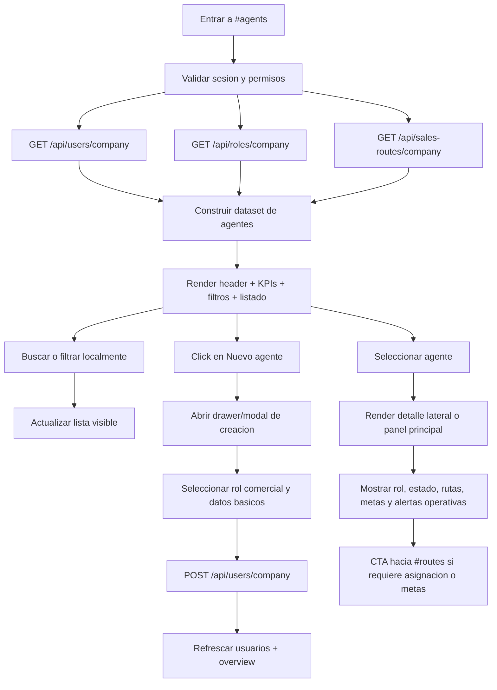

# Vista: Agentes comerciales

## Estado del documento
- Autor de consolidación: `sdd-planning-agent-e62277`
- Referencia de criterio UX/UI: `senior-ux-ui-designer-unpinned` (aplicado como guía conceptual; no se ejecutó un agente externo en esta sesión)
- Estado: listo para revisión de desarrollo/producto
- Alcance: especificación UX/UI para la futura vista `#agents` dentro de `/root/`

## Fuentes utilizadas
Este documento se apoya en fuentes verificadas del repositorio y en la UI legacy preservada:
- `docs/ui-guidelines.md`
- `docs/current-state.md`
- `docs/architecture.md`
- `docs/runtime-endpoint-catalog.md`
- `src/routes/user.routes.js`
- `src/services/user.service.js`
- `src/repositories/user.repository.js`
- `src/routes/role.routes.js`
- `src/services/role.service.js`
- `src/routes/sales-route.routes.js`
- `src/services/sales-route.service.js`
- `src/repositories/sales-route.repository.js`
- `src/routes/agent.routes.js`
- `src/services/agent-workspace.service.js`
- `src/security/access-policy-registry.js`
- `src/security/role-bundles.config.js`
- `src/schemas/user.schema.js`
- `legacy-public-runtime/root/users.html`
- `legacy-public-runtime/root/users.js`

## Contexto actual verificado
- En el AppShell actual de `/root/`, la ruta `#agents` existe en el manifiesto pero hoy cae en la vista neutral `in_process` (`docs/current-state.md`, `docs/architecture.md`).
- No existe una vista legacy dedicada de `agents.html`; la referencia más cercana en runtime legacy es `users.html`, que permite crear usuarios de empresa y sugiere descripciones para roles comerciales como `sales_agent`, `sales_supervisor` y `sales` (`legacy-public-runtime/root/users.js`).
- El backend no expone hoy un recurso administrativo dedicado `/api/agents/company`; la información necesaria para una vista de agentes se reparte entre:
  - `GET /api/users/company` para usuarios de la empresa;
  - `GET /api/roles/company` para roles asignables;
  - `GET /api/sales-routes/company` para agentes elegibles, asignaciones y metas comerciales;
  - `PUT /api/sales-routes/company/agents/:userId/goals` para guardar metas por agente.
- Los endpoints `/api/agent/**` existen, pero están protegidos por `agent.workspace.access` para el propio actor comercial y no deben asumirse como backend canónico de la consola administrativa de agentes.

## Objetivo de la vista
Permitir a administradores de empresa gestionar la superficie administrativa de agentes desde el shell moderno, con un flujo claro para:
- listar agentes comerciales y supervisores relevantes
- crear nuevos agentes comerciales de empresa
- revisar rol, estado y datos básicos
- revisar rutas asignadas y metas activas
- identificar agentes sin ruta o sin metas
- conectar la administración de agentes con las vistas de rutas y clientes sin duplicar lógica de negocio

## Objetivo del usuario
- Ver rápidamente qué agentes comerciales existen en la empresa.
- Detectar si un agente está listo para operar o si le falta ruta o metas.
- Crear un agente nuevo con el rol correcto.
- Entender la diferencia entre agente comercial, supervisor comercial y rol legado de ventas.
- Revisar a qué rutas está asignado cada agente.
- Ver metas activas sin cambiar de contexto innecesariamente.

## Objetivo del negocio
- Formalizar la capa humana de operación comercial dentro del shell moderno.
- Reducir errores al crear usuarios con roles incorrectos para operación en calle.
- Dar visibilidad a la cobertura de agentes antes de entrar a workspace, rutas o pedidos.
- Preparar la base administrativa para futuras capacidades de seguimiento, visitas y desempeño.

## Alcance MVP
### Incluye
- Listado de agentes y perfiles comerciales relevantes de la empresa.
- Búsqueda local por nombre, username, correo o rol.
- KPIs soportados por datos verificables.
- Creación de usuarios comerciales mediante `POST /api/users/company`.
- Filtro visual o segmentación por perfil comercial.
- Visualización de rutas asignadas por agente.
- Visualización de metas resumidas por agente.
- Identificación de agentes sin ruta y sin metas.
- Estados UX: loading, empty, error, success, disabled, saving.
- Responsive desktop/tablet/mobile.

### No incluye en esta fase
- Edición de usuarios existentes.
- Desactivación o borrado de agentes.
- Impersonación del workspace del agente.
- Consulta administrativa de `/api/agent/**` como backend principal de esta vista.
- Reasignación de rutas inline desde la propia vista si eso duplica flujos ya cubiertos por `#routes`.
- Edición avanzada de permisos por usuario.
- Analítica profunda de desempeño comercial.
- Paginación visual compleja.

## Decisiones cerradas para desarrollo
### Endpoint canónico de datos
- La vista debe usar `GET /api/users/company` como fuente canónica de usuarios de empresa.
- Debe usar `GET /api/sales-routes/company` como fuente canónica de datos administrativos comerciales complementarios: agentes elegibles, asignaciones y metas.
- Debe usar `GET /api/roles/company` para poblar el selector de roles disponibles en creación.
- La creación de agente debe usar `POST /api/users/company`.

### Composición del dataset de agentes
- Como no existe un endpoint administrativo único de agentes, la vista debe construir su dataset combinando:
  - usuarios de la empresa;
  - roles asignables;
  - agentes comerciales elegibles devueltos por `sales-routes/company`.
- La clave de join del dataset compuesto debe ser `user.id`.
- En caso de divergencia entre fuentes para un mismo usuario:
  - `users/company` es la fuente autoritativa para identidad y estado (`fullName`, `username`, `email`, `phone`, `status`, `role`);
  - `sales-routes/company` es la fuente autoritativa para enriquecimiento comercial (`assignmentsCount`, `goalsCount`, `goals`, rutas y datos observacionales comerciales).
- La UI no debe inventar un recurso lógico distinto a lo que hoy existe; debe tratar esta composición como adaptación de frontend.

### Segmentación comercial de usuarios
- La vista debe enfocarse en perfiles comerciales relevantes:
  - `sales_agent`
  - `sales_supervisor`
  - `sales` legado cuando exista
  - roles custom de compañía con señales comerciales suficientes
- Un rol custom debe clasificarse como `Otros comerciales` si cumple al menos una de estas señales operativas verificables:
  - el usuario aparece en `agents[]` del overview comercial; o
  - el rol/perfil expone permisos comerciales observables como `clients.view`, `sales.orders.create`, `sales.routes.view.own`, `sales.routes.view.all` o `customer.activities.manage`.
- Otros usuarios de empresa pueden quedar fuera de foco principal o mostrarse solo bajo un filtro secundario, para no convertir `#agents` en duplicado de `#users`.

### Rutas y metas como datos observacionales o vinculados
- La asignación de rutas y el guardado de metas ya tienen su backend operativo principal en `#routes`.
- En MVP, `#agents` debe priorizar observación y acceso contextual, no duplicar toda la edición de cobertura territorial.
- Si se exponen acciones hacia rutas o metas, deben ser enlaces o CTA de continuidad hacia `#routes`, no una segunda consola completa embebida.

### Límite de uso de `/api/agent/**`
- Los endpoints `/api/agent/**` pertenecen al workspace autenticado del propio agente y usan `agent.workspace.access`.
- La vista administrativa `#agents` no debe depender de esos endpoints para construir su experiencia principal.
- No asumir impersonación, elevación ni acceso administrativo indirecto a esa superficie mientras el backend no lo exponga explícitamente.

### Estrategia de resiliencia por endpoint
- Si falla `GET /api/users/company`, la vista debe bloquearse porque no existe base administrativa confiable para construir el listado.
- Si falla `GET /api/sales-routes/company`, la vista debe degradar parcialmente: mostrar personas comerciales, pero marcar rutas, metas y preparación operativa como no disponibles.
- Si falla `GET /api/roles/company`, la vista puede seguir mostrando listado y detalle, pero debe deshabilitar `+ Nuevo agente` o el drawer de creación hasta recuperar el catálogo de roles.

### Semántica de estado del agente
- En el baseline actual, `GET /api/users/company` expone `status` del usuario.
- No existe en el baseline inspeccionado una UI administrativa moderna para cambiar ese estado desde esta vista.
- Por ello, el estado debe tratarse como dato informativo de solo lectura en MVP.

### Creación de agentes
- El MVP sí puede permitir creación de agente porque `POST /api/users/company` ya existe.
- El formulario debe guiar la elección de rol comercial correcto y advertir cuando se elige el rol legado `sales`.
- No debe prometer edición posterior del usuario desde la misma vista mientras esa capacidad no exista en backend soportado.

## Contrato backend verificado
### Endpoints soportados actualmente
- `GET /api/users/company`
- `POST /api/users/company`
- `GET /api/roles/company`
- `GET /api/sales-routes/company`
- `PUT /api/sales-routes/company/agents/:userId/goals`
- `GET /api/agent/dashboard`
- `GET /api/agent/stores`
- `GET /api/agent/stores/:storeId`
- `GET /api/agent/stores/:storeId/purchase-history`
- `GET /api/agent/stores/:storeId/sellable-products`
- `GET /api/agent/stores/:storeId/order-context`
- `GET /api/agent/goals`
- `GET /api/agent/visits`
- `POST /api/agent/visits`
- `POST /api/agent/stores/:storeId/orders`

### Uso aprobado de endpoints en esta vista
Para `#agents`, el uso aprobado del MVP es:
- `GET /api/users/company`
- `POST /api/users/company`
- `GET /api/roles/company`
- `GET /api/sales-routes/company`

### Datos verificables en usuarios de empresa
Según `user.repository.js` y `user.service.js`, la UI puede contar o mostrar con seguridad:
- `id`
- `fullName`
- `username`
- `email`
- `phone`
- `status`
- `companyId`
- `role`
- `role.rolePermissions[].permission`

### Datos verificables del overview comercial
Según `sales-route.service.js`, la UI puede mostrar con seguridad sobre agentes elegibles:
- `id`
- `fullName`
- `username`
- `email`
- `phone`
- `status`
- `role`
- `permissionCodes`
- `assignmentsCount`
- `goalsCount`
- `goals[]`
- relación con rutas mediante `assignments` y `agentIds` en rutas serializadas

### Restricciones importantes
No presentar como dato real si no existe soporte verificado en el contrato actual:
- ubicación en tiempo real del agente
- check-in en vivo
- productividad diaria calculada automáticamente
- GPS o tracking continuo
- porcentaje de cumplimiento consolidado global si no se calcula explícitamente
- histórico administrativo completo de cambios de rol o ruta

## Usuarios esperados y permisos UX
### Usuarios con acceso esperado
- `admin` de compañía

### Restricciones UX alineadas con backend
- Crear usuarios por `POST /api/users/company`: confirmado para `admin`.
- Listar usuarios de empresa por `GET /api/users/company`: confirmado para `admin`.
- Overview comercial por `GET /api/sales-routes/company`: confirmado para `admin` y `sales_supervisor`.
- Como `GET /api/users/company` no tiene acceso confirmado para `sales_supervisor`, el baseline seguro del MVP es acceso visible y funcional para `admin`.
- Habilitar `sales_supervisor` en una fase posterior requiere convergencia explícita de autorización, no solo ajuste de UI.

## Principios UX de la vista
1. **La persona antes que la ruta**: la vista debe mostrar quién opera el territorio, no solo datos abstractos de asignación.
2. **Preparación operativa visible**: debe ser claro si el agente está listo para salir a operación.
3. **No duplicar Users ni Routes**: `#agents` debe integrar datos comerciales, no convertirse en clon de otra vista.
4. **Rol bien guiado**: la elección de perfil comercial debe ser comprensible para evitar errores de configuración.
5. **Compatibilidad con AppShell**: la experiencia debe sentirse nativa de `#routes`, `#zones` y `#clients`.

## Flujo UX general


## Posicionamiento dentro del AppShell
```text
AppShell
├── Sidebar
├── Header shell
└── MainContent
    └── AgentsPage
        ├── PageHeader
        ├── KPIGrid
        ├── FiltersBar
        ├── AgentsSplitLayout
        │   ├── AgentsList / Cards
        │   └── AgentDetailPanel
        └── CreateAgentDrawer
```

## Decisión de navegación recomendada
### Recomendación principal
Implementar `#agents` como una vista maestra con listado + detalle dentro del shell, y usar CTA contextuales hacia `#routes` cuando el usuario necesite gestionar asignaciones o metas a nivel profundo.

### Rechazo recomendado
No convertir `#agents` en simple clon de `#users`, porque perdería el valor comercial diferencial de rutas y metas.

## Estructura de la página

## Header de página
### Orden exacto
1. Eyebrow: `OPERACION COMERCIAL`
2. Título: `Agentes comerciales`
3. Subtítulo: `Administra usuarios comerciales, revisa su preparación operativa y conecta rutas y metas.`
4. Acciones

### Acciones del header
- Secundaria: `Actualizar`
- Primaria: `+ Nuevo agente`

### Reglas
- No colocar `Cerrar sesión` dentro del contenido de la vista.
- El logout sigue en el shell global.
- La CTA primaria debe permanecer visible en desktop y accesible en mobile.

## KPIs
### KPIs MVP recomendados
Deben derivarse solo de datos verificables de usuarios + overview comercial:
1. **Agentes comerciales**
2. **Con ruta asignada**
3. **Sin ruta asignada**
4. **Con metas activas**

### KPI opcional
5. **Supervisores comerciales** si se desea separar visualmente la capa de coordinación.

### Reglas de conteo
- Los conteos deben basarse en el dataset compuesto final del frontend.
- Si un usuario existe en `users/company` pero no aparece en `agents[]` del overview comercial, eso debe tratarse como señal de que no es agente elegible para operación de workspace, no como error técnico.

## Barra de filtros
### Controles
1. Búsqueda por texto
   - placeholder: `Nombre, usuario, correo o rol`
2. Filtro por perfil
   - `Todos`
   - `Agente comercial`
   - `Supervisor comercial`
   - `Ventas legado`
   - `Otros comerciales`
3. Filtro por preparación operativa
   - `Todos`
   - `Con ruta`
   - `Sin ruta`
   - `Con metas`
   - `Sin metas`
4. Acción `Limpiar`

## Vista principal: lista en desktop
### Columnas recomendadas
1. Agente
2. Rol
3. Estado
4. Rutas
5. Metas
6. Preparación
7. Acciones

### Contenido por columna
#### Agente
- Nombre completo
- username debajo
- correo o teléfono como metadata secundaria

#### Rol
- nombre del rol
- badge secundario si es `sales` legado

#### Estado
- valor de `status` como badge observacional

#### Rutas
- cantidad de rutas asignadas
- si aplica, chips breves con código de ruta

#### Metas
- cantidad de metas activas
- resumen corto si existe una principal o primera meta

#### Preparación
Mostrar máximo 2 badges visibles:
- `Con ruta` / `Sin ruta`
- `Con metas` / `Sin metas`
- Si el usuario comercial no tiene match en `agents[]` del overview, mostrar un badge explicativo como `Pendiente de datos comerciales` en lugar de dejar la fila ambigua o aparentemente rota.

#### Acciones
- `Ver detalle`
- `Ir a rutas` si requiere asignación o metas
- no mostrar `Editar` o `Desactivar` en MVP si no existe flujo soportado

## Vista principal mobile/tablet
### Recomendación
En mobile, usar cards apiladas de agente en vez de tabla horizontal.

### Estructura de card
- nombre
- username
- rol
- badges de preparación
- resumen de rutas y metas
- acciones principales

## Empty states
### Sin agentes comerciales
- Título: `Todavía no hay agentes comerciales configurados`
- Texto: `Crea el primer agente o asigna el rol comercial correcto a un usuario nuevo.`
- CTA: `+ Nuevo agente`

### Sin resultados por filtro
- Título: `No encontramos agentes con esos filtros`
- Texto: `Prueba limpiando la búsqueda o cambiando el perfil seleccionado.`
- CTA secundaria: `Limpiar filtros`

## Error state
### Bloqueo total por fallo administrativo base
- Se activa si falla `GET /api/users/company`.
- Mensaje visible dentro de la vista, no solo toast.
- CTA: `Reintentar`
- Texto sugerido: `No se pudo cargar la base administrativa de agentes.`

### Degradación parcial por fallo del overview comercial
- Se activa si falla `GET /api/sales-routes/company`.
- La lista de personas comerciales debe seguir visible.
- Mostrar banner informativo persistente indicando que rutas, metas y preparación comercial no están disponibles temporalmente.
- Texto sugerido: `No se pudo cargar el overview comercial. Se muestran solo datos administrativos.`

### Degradación parcial por fallo del catálogo de roles
- Se activa si falla `GET /api/roles/company`.
- El listado y el detalle pueden seguir visibles.
- La acción `+ Nuevo agente` debe quedar deshabilitada o el drawer debe mostrar estado de indisponibilidad.
- Texto sugerido: `No se pudo cargar el catálogo de roles. La creación de agentes está temporalmente deshabilitada.`

## Drawer / modal de creación de agente
### Recomendación UX
Usar drawer lateral ancho o modal fullscreen responsive para crear usuarios comerciales sin abandonar `#agents`.

### Campos soportados
- Nombre completo
- Usuario
- Correo
- Teléfono
- Rol
- Contraseña

### Reglas UX
- El selector de rol debe privilegiar perfiles comerciales primero.
- Si el usuario selecciona el rol legado `sales`, mostrar guidance: `Rol legado de ventas. Se recomienda usar agente o supervisor comercial para nuevos usuarios.`
- Si el rol seleccionado no parece comercial, la UI debe advertir antes de crear, o filtrarlo fuera del flujo principal si producto así lo define.
- Debe mostrarse ayuda visible bajo el campo de contraseña: `Mínimo 8 caracteres.`

### Copy recomendado
- botón: `Crear agente`
- éxito: `Agente creado correctamente.`
- error: `No se pudo crear el agente.`
- conflicto username: `El username ya existe.`

## Panel de detalle del agente
### Objetivo
Dar contexto operativo sin salir de la vista principal.

### Secciones recomendadas
1. Resumen
2. Datos de contacto
3. Rutas asignadas
4. Metas activas
5. Alertas o gaps operativos

### Resumen superior
Debe incluir:
- nombre del agente
- username
- rol
- estado
- badges `Con ruta` / `Sin ruta`, `Con metas` / `Sin metas`

### Datos de contacto
- correo
- teléfono
- username

### Rutas asignadas
- lista de rutas con código y nombre
- si no tiene rutas: mensaje claro con CTA `Ir a rutas`

### Metas activas
- lista resumida de metas
- si no tiene metas: mensaje claro con CTA `Ir a rutas`
- no duplicar en esta vista la tabla editable completa del módulo de rutas en MVP

### Alertas operativas
Ejemplos de alertas derivables:
- `Sin ruta asignada`
- `Sin metas activas`
- `Rol legado de ventas`

### Regla MVP
- Retirar del MVP la alerta `Perfil comercial no elegible` hasta que exista una regla exacta y verificable respaldada por contrato.

## Copy y semántica de roles
### Reglas
- `sales_agent`: describir como agente comercial operativo.
- `sales_supervisor`: describir como supervisor comercial con capacidad de coordinación.
- `sales`: tratar como rol legado y sugerir migración a perfiles más claros cuando corresponda.

## Visual design
### Paleta
Alineada a `ui-guidelines.md` y al shell actual:
- Primary: `#16A34A`
- Primary hover: `#15803D`
- Navegación fuerte / títulos: `#0F172A`
- Fondo app: `#F8FAFC`
- Superficie: `#FFFFFF`
- Borde: `#E2E8F0`
- Texto secundario: `#64748B`
- Warning suave: `#F59E0B`
- Danger controlado: `#DC2626`

### Tono visual
- Comercial, humano y operacional.
- Debe sentirse como una consola de equipo comercial, no como un CRUD genérico de usuarios.
- Mantener jerarquía visual clara entre persona, rol, rutas y metas.

## Responsive rules
### Desktop
- listado + panel de detalle
- drawer de creación lateral

### Tablet
- tabla simplificada o cards densas
- detalle debajo del listado o lateral colapsable

### Mobile
- cards apiladas
- drawer fullscreen
- CTA principal sticky si hace falta

## Mensajes
- `No se pudo cargar la consola de agentes.`
- `No se pudo cargar la base administrativa de agentes.`
- `No se pudo cargar el overview comercial. Se muestran solo datos administrativos.`
- `No se pudo cargar el catálogo de roles. La creación de agentes está temporalmente deshabilitada.`
- `Agente creado correctamente.`
- `El username ya existe.`
- `Este usuario no tiene rutas asignadas.`
- `Este usuario no tiene metas activas.`
- `Pendiente de datos comerciales.`
- `Rol legado de ventas. Se recomienda migrar nuevos usuarios a agente o supervisor comercial.`

## Recomendaciones de implementación técnica
- Crear una vista dedicada en `src/public/root/views/agents-admin.js`.
- Crear un adaptador de composición de datos (`src/public/root/agents-api.js`) para normalizar:
  - usuarios de empresa
  - roles asignables
  - agentes elegibles del overview comercial
  - relación rutas ↔ agentes
- Mantener el dataset compuesto en frontend como fuente de verdad de presentación.
- No consumir `/api/agent/**` desde esta vista administrativa salvo que exista una decisión explícita de autorización y contrato nuevo.
- Reutilizar patrones de split layout ya usados o propuestos para `#routes` y `#clients`.
- Mantener `#agents` como ruta shell soportada y evitar dependencia de HTML legacy.

## Pruebas mínimas sugeridas para la vista
- route governance de `#agents`
- characterization de composición de dataset desde múltiples endpoints
- characterization de filtros locales por perfil y preparación
- prueba de creación exitosa de agente
- prueba de conflicto por username duplicado
- prueba de render de agentes con y sin ruta
- prueba de render de agentes con y sin metas
- prueba de fallback cuando el overview comercial no devuelve agentes para todos los usuarios comerciales

## Criterios de aceptación UX/UI
- La vista permite identificar rápidamente agentes listos y no listos para operar.
- Crear un agente nuevo es claro y reduce confusión entre roles comerciales.
- La vista no se degrada a simple clon de `#users`.
- La relación entre agente, rutas y metas es visible sin duplicar la consola de rutas.
- El diseño es consistente con `#routes`, `#clients` y el shell moderno.

## Decisión de diseño
La página de agentes debe verse como una **consola administrativa del equipo comercial**: una superficie centrada en personas, con KPIs de preparación, listado filtrable, detalle contextual y creación guiada de perfiles comerciales. Debe aprovechar el backend real existente —usuarios, roles y overview de rutas— sin inventar un nuevo dominio, y debe conectar visualmente rutas y metas sin duplicar la lógica operativa ya concentrada en `#routes`.
