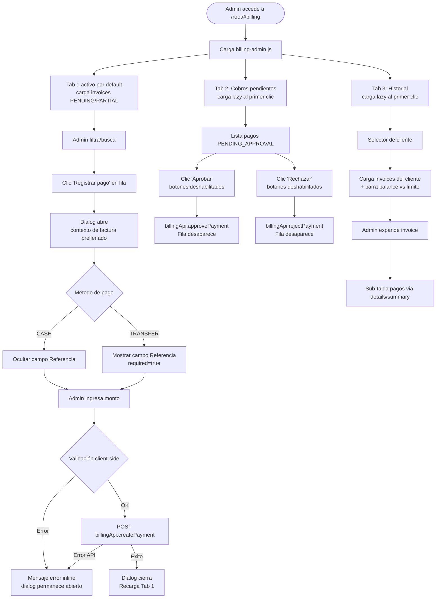

# Spec: Vista de Facturación y Cobros (billing-admin)

**Tarea de referencia:** TASK-011 (billing view — contexto de requerimiento)
**Autor UX:** senior-ux-ui-designer-unpinned-d959b9
**Estado:** Propuesta de diseño — pendiente de aprobación

## Fuentes consultadas
- `docs/ui-guidelines.md` ✅ leído y alineado
- `src/public/root/views/clients-admin.js` — patrón IIFE, dialog, tabla
- `src/public/root/views/routes-admin.js` — patrón render/mount, filtros
- `src/public/root/views/movements-admin.js` — patrón tabla paginada
- `src/public/root/manifest.js` — registro de vistas en sidebar
- `src/public/styles.css` — tokens, clases reutilizables

## Alineación con `ui-guidelines.md`

| Regla | Decisión de diseño |
|---|---|
| §1 — Sesión cookie | El mount valida sesión como company-admin antes de cargar |
| §2 — Fetch same-origin | `billingApi` usa `credentials: 'same-origin'`; POST incluye `Content-Type: application/json` |
| §3 — Error handling | Botón "Registrar pago" se restaura tras error; mensajes via `renderInlineMessage` |
| §4 — Boundary UI/backend | UI no calcula balances contables; solo los muestra. El backend determina si el pago pasa a APPROVED |
| §7 — Helpers compartidos | Reutiliza `escapeHtml`, `formatDate`, `renderInlineMessage`, `renderStatusBadge` |
| §8 — Contract governance | Endpoints documentados en este spec; rol, storage y sesión declarados |

---

## 1. Objetivo

### Usuario
El administrador de empresa (company-admin) necesita:
- Ver rápidamente qué facturas tienen saldo pendiente y su urgencia
- Registrar cobros recibidos en la oficina con flujo mínimo (3 pasos: abrir → llenar → confirmar)
- Aprobar o rechazar pagos registrados por agentes en campo
- Consultar el historial de cuenta de un cliente específico para atender disputas o llamadas

### Negocio
- Reducir cuentas en mora por visibilidad tardía
- Mantener trazabilidad auditada de todos los cobros
- Controlar pagos de agentes antes de impactar el balance del cliente

---

## 2. Casos de uso principales

| # | Flujo | Resultado esperado |
|---|-------|-------------------|
| UC-1 | Admin abre Tab "Cuentas por cobrar" | Tabla de invoices PENDING/PARTIAL ordenada por vencimiento ASC |
| UC-2 | Admin hace clic en "Registrar pago" | Dialog abre con contexto de la factura; importe máximo prelimitado |
| UC-3 | Admin selecciona método TRANSFER | Campo "Referencia" aparece como requerido |
| UC-4 | Admin confirma el pago | POST a billingApi; dialog cierra; tabla recarga |
| UC-5 | Admin abre Tab "Cobros pendientes" | Lista de pagos PENDING_APPROVAL con botones Aprobar/Rechazar |
| UC-6 | Admin aprueba o rechaza un pago | Fila desaparece; API notificada |
| UC-7 | Admin abre Tab "Historial por cliente" | Selector de cliente + balance vs límite de crédito |
| UC-8 | Admin expande una invoice en Historial | Sub-tabla de pagos visible via `<details>/<summary>` |

---

## 3. Riesgos UX

| Riesgo | Mitigación |
|--------|------------|
| Admin registra monto mayor al pendiente | Validación client-side: `amount > pendingAmount` → error inline, no cierra dialog |
| Admin confunde "Registrar pago" con "Aprobar pago" | Hint visible en el dialog: "Los pagos registrados desde oficina se aprueban automáticamente" |
| Tabla de cuentas muy larga | Búsqueda + filtro de estado; indicador de total en footer de tabla |
| Referencia TRANSFER no validada | Campo `required` + `minlength="4"` cuando método es TRANSFER |
| Rechazo sin contexto para el agente | Si `rejectPayment` acepta motivo, mostrar textarea en un confirm-dialog secundario |
| Botón Aprobar/Rechazar doble-clic | Deshabilitar botones de la fila inmediatamente al hacer clic (feedback optimista) |

---

## 4. Flujo de usuario



---

## 5. Estructura de archivos

```
src/public/root/
├── billing-api.js                    ← módulo billingApi (listInvoices, listPendingPayments,
│                                        getClientHistory, createPayment,
│                                        approvePayment, rejectPayment)
└── views/
    ├── billing-admin.js              ← render() + mount() principal
    ├── billing-admin.helpers.js      ← formatCRC, getStatusBadgeClass,
    │                                    filterInvoices, buildBalanceBar, etc.
    └── billing-admin.renderers.js    ← renderInvoiceTable, renderApprovalsTable,
                                         renderHistoryTable, renderPaymentSubrows
```

---

## 6. Wireframes ASCII

### Vista completa desktop (1280px)

```
╔══════════════════════════════════════════════════════════════════════════════╗
║  [Sidebar]  │  root-hero                                                    ║
║             │  ┌────────────────────────────────────────────────────────┐  ║
║             │  │ 💳 Facturación y cobros                                │  ║
║             │  │ Gestiona cuentas por cobrar, cobros y balance de        │  ║
║             │  │ clientes para la empresa [companyId].                   │  ║
║             │  └────────────────────────────────────────────────────────┘  ║
║             │                                                               ║
║             │  ┌── .commercial-metrics ─────────────────────────────────┐  ║
║             │  │ [Por cobrar ₡XXX.XXX] [Aprobaciones N] [Vencidas N]   │  ║
║             │  └────────────────────────────────────────────────────────┘  ║
║             │                                                               ║
║             │  ┌── .card.root-card ──────────────────────────────────────┐ ║
║             │  │  .tabs-nav                                               │ ║
║             │  │  [Cuentas por cobrar ●] [Cobros pendientes] [Historial] │ ║
║             │  │  ─────────────────────────────────────────────────────  │ ║
║             │  │  [contenido del tab activo]                             │ ║
║             │  └─────────────────────────────────────────────────────────┘ ║
╚══════════════════════════════════════════════════════════════════════════════╝
```

### Tab 1: Cuentas por cobrar

```
┌─────────────────────────────────────────────────────────────────────────────┐
│ Cuentas por cobrar                                        [Actualizar]       │
│ Facturas con saldo pendiente de cobro, ordenadas por vencimiento.           │
│ ─────────────────────────────────────────────────────────────────────────── │
│  [🔍 Buscar por cliente o N° factura...]   [Estado ▾ Todos/PENDING/PARTIAL] │
│ ─────────────────────────────────────────────────────────────────────────── │
│  Cliente         │ N° Factura │ Total ₡   │ Pendiente ₡ │Vencimiento│Estado │Acc.  │
│  ──────────────────────────────────────────────────────────────────────────  │
│  Bodega La Fe    │ F-00123    │  450,000  │   225,000   │ 15/07/2025│PARCIAL│[Pago]│
│  Auto Repuestos  │ F-00119    │  120,000  │   120,000   │ 10/07/2025│PEND.  │[Pago]│
│  Tienda Eléctric │ F-00112    │   85,000  │    85,000   │ 02/07/2025│VENC.  │[Pago]│
│   ← fila vencida con fondo rojo-suave #fff5f5                               │
│ ─────────────────────────────────────────────────────────────────────────── │
│  3 facturas visibles · Total pendiente: ₡430,000                            │
└─────────────────────────────────────────────────────────────────────────────┘
  PARCIAL → badge-info   (azul)
  PEND.   → badge-warning (amarillo)
  VENC.   → badge-danger (rojo) — cuando dueDate < hoy
  [Pago]  → botón pequeño "Registrar pago"
```

### Tab 2: Cobros pendientes

```
┌─────────────────────────────────────────────────────────────────────────────┐
│ Cobros pendientes de aprobación                           [Actualizar]       │
│ Pagos registrados por agentes esperando confirmación de la oficina.         │
│ ─────────────────────────────────────────────────────────────────────────── │
│  Cliente         │ Factura  │ Método       │ Referencia     │ Monto ₡ │Acc. │
│  ──────────────────────────────────────────────────────────────────────────  │
│  Bodega La Fe    │ F-00123  │ 💵 Efectivo  │      —         │  50,000 │[✓][✗]│
│  Auto Repuestos  │ F-00119  │ 🏦 Transfere.│ [REF-009823]   │ 120,000 │[✓][✗]│
│                                              ↑ .billing-ref (monospace azul) │
│ ─────────────────────────────────────────────────────────────────────────── │
│  2 pagos pendientes de aprobación                                            │
└─────────────────────────────────────────────────────────────────────────────┘
  [✓] → botón "Aprobar"  (badge-success style, pequeño)
  [✗] → botón "Rechazar" (danger-button, outline, pequeño)
  Referencia TRANSFER → <code class="billing-ref">REF-009823</code>
```

### Tab 3: Historial por cliente

```
┌─────────────────────────────────────────────────────────────────────────────┐
│ Historial por cliente                                     [Actualizar]       │
│ ─────────────────────────────────────────────────────────────────────────── │
│  Cliente: [Seleccionar cliente ▾]                                           │
│ ─────────────────────────────────────────────────────────────────────────── │
│  ┌── Balance de crédito ────────────────────────────────────────────────┐   │
│  │  Deuda actual: ₡345,000   Límite de crédito: ₡500,000               │   │
│  │  [████████████████████░░░░░░░░░░░]  69% utilizado                   │   │
│  │   ↑ .billing-balance-bar__fill--warning cuando ≥ 70%                │   │
│  └──────────────────────────────────────────────────────────────────────┘   │
│ ─────────────────────────────────────────────────────────────────────────── │
│  N° Factura │ Fecha emis. │ Total ₡  │ Pagado ₡ │ Pendiente ₡ │ Estado      │
│  ─────────────────────────────────────────────────────────────────────────  │
│  F-00123    │ 01/06/2025  │ 450,000  │  225,000  │   225,000   │ [PARCIAL]  │
│  └─ <details open>                                                          │
│     <summary> ▾ Ver 1 pago </summary>                                       │
│     ┌── .billing-invoice-payments ──────────────────────────────────────┐   │
│     │  Fecha      │ Método     │ Monto ₡  │ Referencia  │ Estado        │   │
│     │  15/06/2025 │ Efectivo   │ 225,000  │     —       │ [APPROVED]    │   │
│     └────────────────────────────────────────────────────────────────────┘  │
│                                                                             │
│  F-00119    │ 15/05/2025  │ 120,000  │        0  │   120,000   │ [PENDING]  │
│  └─ <details>                                                               │
│     <summary> ▸ Ver pagos (ninguno aún) </summary>                          │
│     <p class="empty-state">Sin pagos registrados.</p>                       │
└─────────────────────────────────────────────────────────────────────────────┘
```

### Dialog: Registrar pago

```
 ┌──────────────────────────────────────────────────────┐
 │  Registrar pago                        [✕ Cerrar]    │
 │  ──────────────────────────────────────────────────  │
 │  📄 Factura F-00123 · Pendiente: ₡225,000            │
 │  ──────────────────────────────────────────────────  │
 │                                                      │
 │  Método de pago *                                    │
 │  ┌────────────────────────────────────────────┐     │
 │  │  Efectivo                               ▾  │     │
 │  └────────────────────────────────────────────┘     │
 │                                                      │
 │  Monto (₡) *                                         │
 │  ┌────────────────────────────────────────────┐     │
 │  │                                    0.00    │     │
 │  └────────────────────────────────────────────┘     │
 │  <small>Máximo permitido: ₡225,000</small>           │
 │                                                      │
 │  ╔═══ Solo visible cuando método = TRANSFER ════╗    │
 │  ║  Referencia de transferencia *              ║    │
 │  ║  ┌──────────────────────────────────────┐  ║    │
 │  ║  │  Ej. REF-009823...                   │  ║    │
 │  ║  └──────────────────────────────────────┘  ║    │
 │  ╚═════════════════════════════════════════════╝    │
 │                                                      │
 │  Nota (opcional)                                     │
 │  ┌────────────────────────────────────────────┐     │
 │  │                                            │     │
 │  └────────────────────────────────────────────┘     │
 │                                                      │
 │  ┌── .hint-box ───────────────────────────────┐     │
 │  │ ℹ Los pagos registrados desde la oficina   │     │
 │  │   se aprueban automáticamente (APPROVED).  │     │
 │  └────────────────────────────────────────────┘     │
 │  <div id="billing-pay-message"></div>                │
 │  ──────────────────────────────────────────────────  │
 │  [Registrar pago]                   [Cancelar]      │
 └──────────────────────────────────────────────────────┘
```

### Mobile (360px) — Tab bar y tabla

```
┌──────────────────────────────────────────────┐
│ 💳 Facturación y cobros                      │
│ ──────────────────────────────────────────── │
│ [₡430K pendiente] [2 aprobac.] [1 vencida]  │
│ ──────────────────────────────────────────── │
│ [Cuentas ●] [Cobros] [Historial]            │
│                  ← flex-wrap, 3 caben en 360 │
│ ──────────────────────────────────────────── │
│ [🔍 Buscar...]  [Estado ▾]                  │
│ ──────────────────────────────────────────── │
│  ←──── table-wrapper overflow-x: auto ────→ │
│ Cliente  │Pendiente│Venc.    │Estado│Acc.    │
│ Bodega…  │ 225,000 │15/07/25 │PARC. │[Pago] │
│ Auto R…  │ 120,000 │10/07/25 │PEND. │[Pago] │
└──────────────────────────────────────────────┘
```

---

## 7. Diseño visual

### Paleta de colores (base en `styles.css`)

| Clase / Token | Hex | Uso en billing |
|---|---|---|
| `--primary` | `#1f6feb` | Botones primarios, tab activo |
| `--primary-dark` | `#174ea6` | Texto en tabs inactivos |
| `--danger` | `#c62828` | Botón Rechazar, facturas vencidas |
| `--muted` | `#57606a` | Labels, totales de pie de tabla |
| `badge-success` | `#dcfce7 / #116329` | Estado APPROVED, botón Aprobar |
| `badge-warning` | `#fef3c7 / #92400e` | Estado PENDING |
| `badge-info` *(nuevo)* | `#dbeafe / #1e40af` | Estado PARTIAL |
| `badge-danger` *(nuevo)* | `#fee2e2 / #7f1d1d` | Estado OVERDUE/vencida |
| `.billing-ref` *(nuevo)* | bg `#eef2ff`, text `#1e40af` | Referencia TRANSFER (monospace) |

### Tipografía

| Elemento | Estilo |
|---|---|
| Importes en tabla | `font-variant-numeric: tabular-nums`, `font-weight: 700` en columna Pendiente |
| Referencia TRANSFER | `<code class="billing-ref">` — monospace destacado |
| Fechas | `rootShellUi.formatDate(value)` → es-CR → DD/MM/YYYY |
| KPI amounts | `.metric-card strong` → 1.8rem (heredado) |
| Hint en dialog | `.hint-box` — clase existente |

### Espaciado y layout

- Card principal: `padding: 24px` (`.card` hereda)
- Tabs: `margin: 18px 0; padding-bottom: 10px` (`.tabs-nav` hereda)
- Tabla: `padding: 12px` por celda (hereda de `th, td`)
- Dialog: `padding: 18px; width: min(100%, 860px)` (`.modal-card` hereda)
- Dialog formulario: columna única (todos los labels con `.root-form-grid__full`)
- Balance bar: `height: 8px`, `border-radius: 999px`

---

## 8. CSS a agregar en `styles.css`

Agregar al final del archivo (o junto a las reglas de badges existentes en línea ~438):

```css
/* ─────────────────────────────────────────────────────
   Badges adicionales (junto a .badge-warning)
   ───────────────────────────────────────────────────── */
.badge-info   { color: #1e40af; background: #dbeafe; }
.badge-danger { color: #7f1d1d; background: #fee2e2; }

/* ─────────────────────────────────────────────────────
   Billing admin view
   ───────────────────────────────────────────────────── */
.billing-ref {
  display: inline-block;
  padding: 2px 8px;
  border-radius: 6px;
  background: #eef2ff;
  color: #1e40af;
  font-family: monospace;
  font-size: 0.9em;
  font-weight: 700;
}

/* Barra de utilización de crédito */
.billing-credit-block {
  display: grid;
  gap: 6px;
  padding: 14px 16px;
  border: 1px solid var(--border);
  border-radius: 12px;
  background: #f8fafc;
  margin-bottom: 16px;
}
.billing-credit-block p { margin: 0; }
.billing-balance-bar {
  height: 8px;
  border-radius: 999px;
  background: #e2e8f0;
  overflow: hidden;
}
.billing-balance-bar__fill {
  height: 100%;
  border-radius: 999px;
  background: var(--primary);
  transition: width 0.3s ease;
}
.billing-balance-bar__fill--warning { background: #f59e0b; }
.billing-balance-bar__fill--danger  { background: var(--danger); }

/* Sección de pagos colapsables por invoice */
.billing-invoice-payments {
  background: #f8fafc;
  border-top: 1px dashed var(--border);
  padding: 10px 16px 14px;
}
.billing-invoice-payments table {
  width: 100%;
  min-width: 500px;
  border-collapse: collapse;
  font-size: 0.9rem;
}

/* Fila de invoice vencida */
.billing-row--overdue {
  background: #fff5f5;
}

/* Tablas billing con anchos fijos */
.billing-receivable-table {
  width: max(100%, 900px);
  min-width: 900px;
  table-layout: fixed;
}
.billing-receivable-table th:nth-child(1),
.billing-receivable-table td:nth-child(1) { width: 26%; }
.billing-receivable-table th:nth-child(2),
.billing-receivable-table td:nth-child(2) { width: 13%; }
.billing-receivable-table th:nth-child(3),
.billing-receivable-table td:nth-child(3) { width: 13%; font-variant-numeric: tabular-nums; }
.billing-receivable-table th:nth-child(4),
.billing-receivable-table td:nth-child(4) { width: 14%; font-variant-numeric: tabular-nums; font-weight: 700; }
.billing-receivable-table th:nth-child(5),
.billing-receivable-table td:nth-child(5) { width: 13%; }
.billing-receivable-table th:nth-child(6),
.billing-receivable-table td:nth-child(6) { width: 10%; }
.billing-receivable-table th:nth-child(7),
.billing-receivable-table td:nth-child(7) { width: 11%; }

.billing-approvals-table {
  width: max(100%, 860px);
  min-width: 860px;
  table-layout: fixed;
}
.billing-approvals-table th:nth-child(1),
.billing-approvals-table td:nth-child(1) { width: 24%; }
.billing-approvals-table th:nth-child(2),
.billing-approvals-table td:nth-child(2) { width: 12%; }
.billing-approvals-table th:nth-child(3),
.billing-approvals-table td:nth-child(3) { width: 13%; }
.billing-approvals-table th:nth-child(4),
.billing-approvals-table td:nth-child(4) { width: 22%; }
.billing-approvals-table th:nth-child(5),
.billing-approvals-table td:nth-child(5) { width: 13%; font-variant-numeric: tabular-nums; }
.billing-approvals-table th:nth-child(6),
.billing-approvals-table td:nth-child(6) { width: 16%; }

.billing-history-table {
  width: max(100%, 820px);
  min-width: 820px;
  table-layout: fixed;
}
.billing-history-table th:nth-child(1),
.billing-history-table td:nth-child(1) { width: 14%; }
.billing-history-table th:nth-child(2),
.billing-history-table td:nth-child(2) { width: 13%; }
.billing-history-table th:nth-child(3),
.billing-history-table td:nth-child(3) { width: 16%; font-variant-numeric: tabular-nums; }
.billing-history-table th:nth-child(4),
.billing-history-table td:nth-child(4) { width: 16%; font-variant-numeric: tabular-nums; }
.billing-history-table th:nth-child(5),
.billing-history-table td:nth-child(5) { width: 16%; font-variant-numeric: tabular-nums; font-weight: 700; }
.billing-history-table th:nth-child(6),
.billing-history-table td:nth-child(6) { width: 12%; }
/* td summary colspan en historial */
.billing-history-table td.billing-payments-cell {
  padding: 0;
  border-top: none;
}
```

---

## 9. Especificaciones para desarrollo

### 9.1 Patrón IIFE y registro

```js
// billing-admin.js — estructura mínima
(function attachRootShellBillingAdminView(globalScope) {
  const rootShell        = globalScope.RootShell;
  const billingApi       = rootShell.require('billingApi');
  const rootShellUi      = rootShell.require('ui');
  const billingHelpers   = rootShell.require('views.billingAdminHelpers');
  const billingRenderers = rootShell.require('views.billingAdminRenderers');

  function render(session) {
    // retorna HTML string completo (ver sección 9.2)
  }

  async function mount(container, session, helpers = {}) {
    // wiring de eventos (ver sección 9.3 y 9.4)
  }

  rootShell.register('views.billingAdmin', { render, mount });
}(window));
```

### 9.2 Estructura HTML del render()

```html
<!-- render() retorna este string -->
<section class="root-hero" aria-labelledby="root-view-title">
  <p class="eyebrow">Finanzas</p>
  <h2 id="root-view-title">Facturación y cobros</h2>
  <p class="muted">Gestiona cuentas por cobrar, aprueba cobros y consulta historial
    de crédito para la empresa [companyId].</p>
</section>

<section class="commercial-page" id="billing-page">

  <!-- KPI strip (3 métricas) -->
  <div class="commercial-metrics" id="billing-metrics" aria-live="polite">
    <article class="card root-card metric-card">
      <p class="muted">Por cobrar total</p>
      <strong id="billing-metric-receivable">-</strong>
    </article>
    <article class="card root-card metric-card">
      <p class="muted">Cobros por aprobar</p>
      <strong id="billing-metric-approvals">-</strong>
    </article>
    <article class="card root-card metric-card">
      <p class="muted">Facturas vencidas</p>
      <strong id="billing-metric-overdue">-</strong>
    </article>
  </div>

  <div id="billing-page-message"></div>

  <!-- Card principal con tabs -->
  <article class="card root-card" id="billing-main-card">

    <!-- Tab navigation — ARIA roles -->
    <nav class="tabs-nav" role="tablist" aria-label="Secciones de facturación">
      <button class="tab-button active"
              role="tab" aria-selected="true"
              aria-controls="billing-tab-receivable"
              id="billing-btn-receivable"
              data-billing-tab="receivable">
        Cuentas por cobrar
      </button>
      <button class="tab-button"
              role="tab" aria-selected="false"
              aria-controls="billing-tab-approvals"
              id="billing-btn-approvals"
              data-billing-tab="approvals">
        Cobros pendientes
      </button>
      <button class="tab-button"
              role="tab" aria-selected="false"
              aria-controls="billing-tab-history"
              id="billing-btn-history"
              data-billing-tab="history">
        Historial por cliente
      </button>
    </nav>

    <!-- Tab 1: Cuentas por cobrar -->
    <div id="billing-tab-receivable" class="tab-panel"
         role="tabpanel" aria-labelledby="billing-btn-receivable">
      <div class="page-header">
        <div>
          <h3>Cuentas por cobrar</h3>
          <p id="billing-receivable-summary" class="muted">
            Facturas con saldo pendiente de cobro.
          </p>
        </div>
        <button id="billing-receivable-refresh" class="secondary-button" type="button">
          Actualizar
        </button>
      </div>

      <!-- Filter bar -->
      <div class="root-form-grid root-form-grid--filters">
        <label class="root-form-grid__full">
          <span>Buscar</span>
          <input id="billing-receivable-search" type="search"
                 placeholder="Cliente o número de factura" />
        </label>
        <label>
          <span>Estado</span>
          <select id="billing-receivable-status-filter">
            <option value="">Todos</option>
            <option value="PENDING">Pendiente</option>
            <option value="PARTIAL">Pago parcial</option>
          </select>
        </label>
      </div>

      <div id="billing-receivable-message"></div>
      <div class="table-wrapper">
        <table class="billing-receivable-table">
          <thead>
            <tr>
              <th>Cliente</th>
              <th>N° Factura</th>
              <th>Total ₡</th>
              <th>Pendiente ₡</th>
              <th>Vencimiento</th>
              <th>Estado</th>
              <th>Acción</th>
            </tr>
          </thead>
          <tbody id="billing-receivable-tbody" aria-live="polite">
            <tr><td colspan="7" class="empty-state">Cargando facturas...</td></tr>
          </tbody>
        </table>
      </div>
      <p id="billing-receivable-footer" class="muted"></p>
    </div>

    <!-- Tab 2: Cobros pendientes -->
    <div id="billing-tab-approvals" class="tab-panel hidden"
         role="tabpanel" aria-labelledby="billing-btn-approvals">
      <div class="page-header">
        <div>
          <h3>Cobros pendientes de aprobación</h3>
          <p id="billing-approvals-summary" class="muted">
            Pagos registrados por agentes que requieren confirmación.
          </p>
        </div>
        <button id="billing-approvals-refresh" class="secondary-button" type="button">
          Actualizar
        </button>
      </div>
      <div id="billing-approvals-message"></div>
      <div class="table-wrapper">
        <table class="billing-approvals-table">
          <thead>
            <tr>
              <th>Cliente</th>
              <th>Factura</th>
              <th>Método</th>
              <th>Referencia</th>
              <th>Monto ₡</th>
              <th>Acciones</th>
            </tr>
          </thead>
          <tbody id="billing-approvals-tbody" aria-live="polite">
            <tr><td colspan="6" class="empty-state">Cargando pagos...</td></tr>
          </tbody>
        </table>
      </div>
      <p id="billing-approvals-footer" class="muted"></p>
    </div>

    <!-- Tab 3: Historial por cliente -->
    <div id="billing-tab-history" class="tab-panel hidden"
         role="tabpanel" aria-labelledby="billing-btn-history">
      <div class="page-header">
        <div>
          <h3>Historial por cliente</h3>
          <p class="muted">Selecciona un cliente para ver su historial y balance de crédito.</p>
        </div>
        <button id="billing-history-refresh" class="secondary-button" type="button">
          Actualizar
        </button>
      </div>
      <label>
        <span>Cliente</span>
        <select id="billing-history-client-select">
          <option value="">Seleccionar cliente...</option>
        </select>
      </label>
      <div id="billing-credit-block" class="billing-credit-block" hidden></div>
      <div id="billing-history-message"></div>
      <div class="table-wrapper" id="billing-history-table-wrapper" hidden>
        <table class="billing-history-table">
          <thead>
            <tr>
              <th>N° Factura</th>
              <th>Fecha emisión</th>
              <th>Total ₡</th>
              <th>Pagado ₡</th>
              <th>Pendiente ₡</th>
              <th>Estado</th>
            </tr>
          </thead>
          <tbody id="billing-history-tbody" aria-live="polite"></tbody>
        </table>
      </div>
    </div>

  </article>
</section>

<!-- Dialog registrar pago — fuera del article para z-index correcto -->
<dialog id="billing-pay-dialog" class="modal-card">
  <form id="billing-pay-form" class="root-form" method="dialog" novalidate>
    <div class="page-header">
      <div>
        <h3>Registrar pago</h3>
        <p id="billing-pay-context" class="muted">Selecciona una factura.</p>
      </div>
      <button id="billing-pay-close" class="secondary-button" type="button">
        Cerrar
      </button>
    </div>
    <div id="billing-pay-message"></div>
    <fieldset class="root-form__section">
      <legend>Datos del pago</legend>
      <div class="root-form-grid">
        <label class="root-form-grid__full">
          <span>Método de pago *</span>
          <select id="billing-pay-method" name="method" required>
            <option value="">Selecciona...</option>
            <option value="CASH">Efectivo</option>
            <option value="TRANSFER">Transferencia bancaria</option>
          </select>
        </label>
        <label class="root-form-grid__full">
          <span>Monto (₡) *</span>
          <input id="billing-pay-amount" name="amount" type="number"
                 min="0.01" step="0.01" required />
          <small id="billing-pay-amount-hint" class="muted"></small>
        </label>
        <label id="billing-pay-reference-field" class="root-form-grid__full" hidden>
          <span>Referencia de transferencia *</span>
          <input id="billing-pay-reference" name="reference" type="text"
                 maxlength="100" placeholder="Ej. REF-009823" minlength="4" />
        </label>
        <label class="root-form-grid__full">
          <span>Nota (opcional)</span>
          <textarea id="billing-pay-note" name="note" rows="2" maxlength="500"></textarea>
        </label>
      </div>
    </fieldset>
    <p class="hint-box">
      ℹ Los pagos registrados desde la oficina se aprueban automáticamente (APPROVED).
      No aparecerán en "Cobros pendientes".
    </p>
    <div class="action-row">
      <button id="billing-pay-submit" type="submit">Registrar pago</button>
      <button id="billing-pay-cancel" class="secondary-button" type="button">Cancelar</button>
    </div>
  </form>
</dialog>
```

### 9.3 Lógica de tabs (mount)

```js
// Wiring de tabs con carga lazy
const tabButtons = container.querySelectorAll('[data-billing-tab]');
let activeTab = 'receivable';
let approvalsLoaded = false;
let historyClientsLoaded = false;

function switchTab(tabKey) {
  tabButtons.forEach((btn) => {
    const isActive = btn.dataset.billingTab === tabKey;
    btn.classList.toggle('active', isActive);
    btn.setAttribute('aria-selected', String(isActive));
  });
  ['receivable', 'approvals', 'history'].forEach((key) => {
    const panel = container.querySelector(`#billing-tab-${key}`);
    if (panel) panel.classList.toggle('hidden', key !== tabKey);
  });
  activeTab = tabKey;
  // Carga lazy al primer acceso
  if (tabKey === 'approvals' && !approvalsLoaded) loadApprovals();
  if (tabKey === 'history'   && !historyClientsLoaded) loadHistoryClients();
}

tabButtons.forEach((btn) => {
  btn.addEventListener('click', () => switchTab(btn.dataset.billingTab));
});
```

### 9.4 Lógica del dialog de pago

```js
const payDialog    = container.querySelector('#billing-pay-dialog');
const payForm      = container.querySelector('#billing-pay-form');
const payContext   = container.querySelector('#billing-pay-context');
const payMethod    = container.querySelector('#billing-pay-method');
const payAmount    = container.querySelector('#billing-pay-amount');
const payAmountHint = container.querySelector('#billing-pay-amount-hint');
const payRefField  = container.querySelector('#billing-pay-reference-field');
const payRef       = container.querySelector('#billing-pay-reference');
const payNote      = container.querySelector('#billing-pay-note');
const payMessage   = container.querySelector('#billing-pay-message');
const paySubmit    = container.querySelector('#billing-pay-submit');
const payClose     = container.querySelector('#billing-pay-close');
const payCancel    = container.querySelector('#billing-pay-cancel');

// Abre el dialog con contexto de la invoice seleccionada
function openPayDialog(invoice) {
  payDialog.dataset.invoiceId = invoice.id;
  payContext.textContent =
    `Factura ${invoice.number} · Pendiente: ₡${billingHelpers.formatCRC(invoice.pendingAmount)}`;
  payAmount.max   = invoice.pendingAmount;
  payAmount.value = '';
  payAmountHint.textContent = `Máximo permitido: ₡${billingHelpers.formatCRC(invoice.pendingAmount)}`;
  payMethod.value  = '';
  payRef.value     = '';
  payNote.value    = '';
  payRefField.hidden   = true;
  payRef.required      = false;
  payMessage.innerHTML = '';
  paySubmit.disabled   = false;
  paySubmit.textContent = 'Registrar pago';
  payDialog.showModal();
}

// Toggle campo referencia según método
payMethod.addEventListener('change', () => {
  const isTransfer = payMethod.value === 'TRANSFER';
  payRefField.hidden  = !isTransfer;
  payRef.required     = isTransfer;
  if (!isTransfer) payRef.value = '';
});

// Cierre del dialog
function closePayDialog() {
  payDialog.close();
}
payClose.addEventListener('click', closePayDialog);
payCancel.addEventListener('click', closePayDialog);

// Submit con validación client-side
payForm.addEventListener('submit', async (e) => {
  e.preventDefault();
  payMessage.innerHTML = '';
  const amount     = parseFloat(payAmount.value);
  const maxAmount  = parseFloat(payAmount.max);

  if (!amount || amount <= 0) {
    payMessage.innerHTML = rootShellUi.renderInlineMessage('El monto debe ser mayor a ₡0.', 'error');
    return;
  }
  if (amount > maxAmount) {
    payMessage.innerHTML = rootShellUi.renderInlineMessage(
      `El monto no puede superar ₡${billingHelpers.formatCRC(maxAmount)}.`, 'error'
    );
    return;
  }
  if (payMethod.value === 'TRANSFER' && !payRef.value.trim()) {
    payMessage.innerHTML = rootShellUi.renderInlineMessage(
      'La referencia de transferencia es requerida.', 'error'
    );
    return;
  }

  paySubmit.disabled    = true;
  paySubmit.textContent = 'Registrando...';

  try {
    await billingApi.createPayment(session, {
      invoiceId: payDialog.dataset.invoiceId,
      method:    payMethod.value,
      amount,
      reference: payRef.value.trim()  || null,
      note:      payNote.value.trim() || null,
    });
    closePayDialog();
    await loadReceivable(); // recarga Tab 1
  } catch (err) {
    payMessage.innerHTML = rootShellUi.renderInlineMessage(
      err.message || 'No se pudo registrar el pago. Intenta de nuevo.', 'error'
    );
    paySubmit.disabled    = false;
    paySubmit.textContent = 'Registrar pago';
  }
});
```

### 9.5 Renderer de historial — pagos colapsables con `<details>`

```js
// En billing-admin.renderers.js
function renderHistoryRow(invoice, ui) {
  const isOverdue = invoice.dueDate && new Date(invoice.dueDate) < new Date() 
                    && invoice.status !== 'PAID';
  const rowClass  = isOverdue ? 'billing-row--overdue' : '';

  const paymentsHtml = renderInvoicePayments(invoice.payments || [], ui);
  const paymentsLabel = invoice.payments?.length
    ? `Ver ${invoice.payments.length} pago(s)`
    : 'Sin pagos registrados';

  return `
    <tr class="${rowClass}">
      <td>${ui.escapeHtml(invoice.number)}</td>
      <td>${ui.formatDate(invoice.issuedAt)}</td>
      <td>${ui.escapeHtml(formatCRC(invoice.totalAmount))}</td>
      <td>${ui.escapeHtml(formatCRC(invoice.paidAmount))}</td>
      <td>${ui.escapeHtml(formatCRC(invoice.pendingAmount))}</td>
      <td>${renderInvoiceStatusBadge(invoice.status)}</td>
    </tr>
    <tr>
      <td colspan="6" class="billing-payments-cell">
        <details>
          <summary class="muted" style="padding:8px 16px;cursor:pointer;">
            ${ui.escapeHtml(paymentsLabel)}
          </summary>
          <div class="billing-invoice-payments">
            ${paymentsHtml}
          </div>
        </details>
      </td>
    </tr>
  `;
}
```

### 9.6 Helper: formatCRC

```js
// En billing-admin.helpers.js
function formatCRC(amount) {
  if (amount == null || Number.isNaN(Number(amount))) return '0.00';
  return Number(amount).toLocaleString('es-CR', {
    minimumFractionDigits: 2,
    maximumFractionDigits: 2,
  });
}
// Resultado: 225000 → "225,000.00"
// Úsalo como: `₡${billingHelpers.formatCRC(invoice.pendingAmount)}`
```

### 9.7 Helper: badge de estado de invoice

```js
// En billing-admin.helpers.js
function getInvoiceStatusBadge(status, dueDate) {
  const isOverdue = dueDate && new Date(dueDate) < new Date() && status !== 'PAID';
  if (isOverdue)           return '<span class="badge badge-danger">Vencida</span>';
  if (status === 'PENDING')  return '<span class="badge badge-warning">Pendiente</span>';
  if (status === 'PARTIAL')  return '<span class="badge badge-info">Parcial</span>';
  if (status === 'PAID')     return '<span class="badge badge-success">Pagada</span>';
  return `<span class="badge">${rootShellUi.escapeHtml(status)}</span>`;
}

function getPaymentStatusBadge(status) {
  if (status === 'APPROVED') return '<span class="badge badge-success">Aprobado</span>';
  if (status === 'PENDING_APPROVAL') return '<span class="badge badge-warning">Por aprobar</span>';
  if (status === 'REJECTED') return '<span class="badge badge-danger">Rechazado</span>';
  return `<span class="badge">${rootShellUi.escapeHtml(status)}</span>`;
}
```

### 9.8 Barra de crédito (balance bar)

```js
// En billing-admin.renderers.js
function renderCreditBlock(client) {
  if (!client.creditLimit || client.creditLimit <= 0) return '';
  const used = client.creditBalance || 0;
  const limit = client.creditLimit;
  const pct   = Math.min(100, Math.round((used / limit) * 100));
  const fillClass = pct >= 90
    ? 'billing-balance-bar__fill--danger'
    : pct >= 70
      ? 'billing-balance-bar__fill--warning'
      : '';

  return `
    <div class="billing-credit-block">
      <p>
        Deuda actual: <strong>₡${formatCRC(used)}</strong>
        &nbsp;·&nbsp;
        Límite de crédito: <strong>₡${formatCRC(limit)}</strong>
        &nbsp;·&nbsp;
        <span class="muted">${pct}% utilizado</span>
      </p>
      <div class="billing-balance-bar" role="progressbar"
           aria-valuenow="${pct}" aria-valuemin="0" aria-valuemax="100"
           aria-label="Utilización de crédito: ${pct}%">
        <div class="billing-balance-bar__fill ${fillClass}"
             style="width: ${pct}%"></div>
      </div>
    </div>
  `;
}
```

### 9.9 Registro en `manifest.js`

```js
// Agregar con los items de company-admin
const billingItem = createRouteItem({
  id: 'billing',
  label: 'Facturación',
  routeKey: 'billing',
  href: '/root/#billing',
  implemented: true,
  activeMatchers: ['billing'],
  visibilityRule: guards.isCompanyAdmin,
  actorScope: 'company-admin',
  icon: 'credit-card',
  includeInRootNav: false,
  dependencyTag: 'billing-admin-view',
});

// En adminSidebarSections → sales-group → después de clientsItem:
{ type: 'item', ...billingItem },
```

### 9.10 Registro en `index.html` (carga de scripts)

```html
<!-- Agregar después de clients-api.js y antes de app.js -->
<script src="billing-api.js"></script>
<script src="views/billing-admin.helpers.js"></script>
<script src="views/billing-admin.renderers.js"></script>
<script src="views/billing-admin.js"></script>
```

### 9.11 Registro en el router (`router.js`)

El router ya mapea `routeKey → view name`. Agregar la entrada equivalente a la de 'clients':
```js
billing: 'views.billingAdmin',
```

---

## 10. Endpoints esperados (documentar con backend antes de implementar)

| Operación | Verbo | Path (propuesto) | Payload / Params |
|---|---|---|---|
| Listar invoices pendientes | GET | `/api/billing/invoices` | `?status=PENDING,PARTIAL` |
| Listar pagos por aprobar | GET | `/api/billing/payments` | `?status=PENDING_APPROVAL` |
| Historial de cliente | GET | `/api/billing/clients/:clientId/invoices` | — |
| Crear pago (oficina) | POST | `/api/billing/invoices/:id/payments` | `{method, amount, reference?, note?}` |
| Aprobar pago | POST | `/api/billing/payments/:id/approve` | `{}` |
| Rechazar pago | POST | `/api/billing/payments/:id/reject` | `{reason?}` |

> ⚠ Estos paths son propuestos. Deben alinearse con los endpoints realmente montados antes
> de empezar a desarrollar `billing-api.js`. Ver `docs/runtime-endpoint-catalog.md`.

---

## 11. Contrato de sesión y permisos (`ui-guidelines.md §8`)

| Campo | Valor |
|---|---|
| Rol requerido | `company-admin` (guard existente: `guards.isCompanyAdmin`) |
| Fetch auth | `credentials: 'same-origin'` (cookie de sesión) |
| Content-Type en POST | `application/json` |
| Storage browser afectado | Ninguno (solo fetch) |
| Descargas protegidas | No aplica en esta vista |
| Error crítico de carga Tab 1 | Mostrar en `#billing-page-message` con `renderInlineMessage(..., 'error')` |
| Restauración de estado en errores | `paySubmit.disabled = false; paySubmit.textContent = 'Registrar pago'` |
| Mensajes de error | Operables y breves; incluyen el monto máximo cuando aplica |

---

## 12. Accesibilidad (WCAG 2.1 AA)

| Elemento | Implementación |
|---|---|
| Tab navigation | `role="tablist"`, `role="tab"`, `aria-selected`, `aria-controls` |
| Tab panels | `role="tabpanel"`, `aria-labelledby` |
| Balance bar | `role="progressbar"`, `aria-valuenow/min/max`, `aria-label` |
| Pagos colapsables | `<details>/<summary>` — accesible nativamente por teclado |
| Dialog | `<dialog>` nativo + `.showModal()` — focus trap automático |
| Mensajes de estado | `aria-live="polite"` en regions de tabla y métricas |
| Campos requeridos | `required` attribute + `*` en label + mensaje de error antes del submit |
| Contraste badges nuevos | `badge-info`: 4.5:1 ✓ / `badge-danger`: 4.5:1 ✓ |
| Fila overdue | Fondo `#fff5f5` + badge-danger — no depende solo del color |
