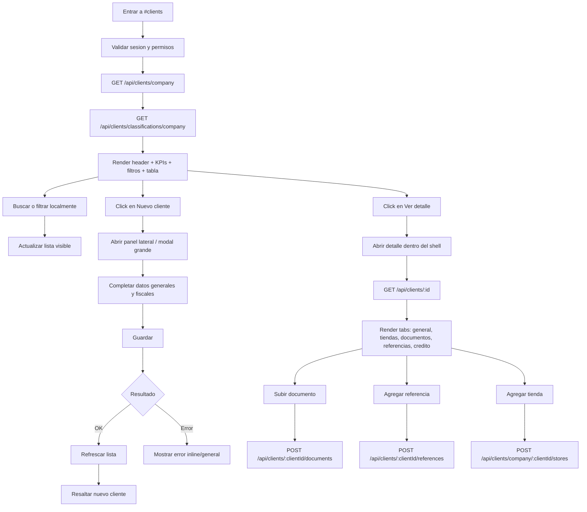

# Vista: Clientes

## Estado del documento
- Autor de consolidación: `sdd-planning-agent-e62277`
- Referencia de criterio UX/UI: `senior-ux-ui-designer-unpinned` (aplicado como guía conceptual; no se ejecutó un agente externo en esta sesión)
- Estado: listo para revisión de desarrollo/producto
- Alcance: especificación UX/UI para la futura vista `#clients` dentro de `/root/`

## Fuentes utilizadas
Este documento se apoya en fuentes verificadas del repositorio y en la UI legacy preservada:
- `docs/ui-guidelines.md`
- `docs/current-state.md`
- `docs/architecture.md`
- `docs/runtime-endpoint-catalog.md`
- `src/routes/client.routes.js`
- `src/services/client.service.js`
- `src/repositories/client.repository.js`
- `src/security/access-policy-registry.js`
- `src/security/role-bundles.config.js`
- `src/routes/region.routes.js`
- `src/routes/taxpayer.routes.js`
- `src/routes/economic-activity.routes.js`
- `README.md`
- `legacy-public-runtime/root/clients.html`
- `legacy-public-runtime/root/clients.js`
- `legacy-public-runtime/root/client-detail.html`

## Contexto actual verificado
- En el AppShell actual de `/root/`, la ruta `#clients` existe en el manifiesto pero hoy cae en la vista neutral `in_process` (`docs/current-state.md`, `docs/architecture.md`).
- El backend sí expone contratos reales de clientes para listar, ver detalle, crear, actualizar, eliminar, crear tiendas, subir documentos y registrar referencias (`src/routes/client.routes.js`).
- La autorización actual para clientes sigue un baseline `tenant-operational` basado en roles `admin` y `sales`, con borrado restringido a `admin` (`src/security/access-policy-registry.js`).
- La UI legacy preservada bajo `legacy-public-runtime/root/clients.*` y `client-detail.*` muestra una dirección funcional útil, pero no debe copiarse literalmente; debe adaptarse al AppShell root actual, a las guías de UI vigentes y al runtime soportado.

## Objetivo de la vista
Permitir a un administrador o usuario comercial autorizado gestionar clientes de la compañía desde el root shell moderno, con un flujo claro para:
- consultar clientes
- filtrar rápidamente
- crear y editar datos principales
- revisar tiendas, documentos y referencias
- navegar a detalle sin abandonar el shell soportado

## Objetivo del usuario
- Encontrar un cliente rápidamente por nombre, código, identificación o teléfono.
- Entender si el cliente está listo para operación comercial o si le faltan datos.
- Crear un cliente nuevo sin fricción.
- Editar datos básicos y fiscales sin entrar en un flujo confuso.
- Ver cuántas tiendas tiene, sus documentos y referencias comerciales.
- Descargar documentos privados de manera segura.

## Objetivo del negocio
- Centralizar la gestión de clientes dentro del AppShell soportado.
- Reducir errores operativos por clientes incompletos o mal clasificados.
- Hacer más visible el estado de preparación comercial/fiscal de cada cliente.
- Preparar una base escalable para integrar después crédito, rutas, agentes y visitas sin romper el contrato actual.

## Alcance MVP
### Incluye
- Listado de clientes de la empresa.
- Búsqueda local sobre el dataset cargado.
- Filtros locales de clasificación y estado operativo simple.
- KPIs soportados por datos verificables.
- Apertura de detalle de cliente dentro del shell.
- Creación y edición de cliente.
- Visualización de tiendas, documentos y referencias existentes.
- Carga de documentos privados de cliente.
- Creación de referencias comerciales.
- Descarga segura de documentos.
- Responsive desktop/tablet/mobile.
- Estados UX: loading, empty, error, success, disabled, saving.

### No incluye en esta fase
- Scoring crediticio avanzado.
- Timeline histórico de interacciones.
- Geolocalización o mapa en la vista principal.
- Edición inline masiva en tabla.
- Búsqueda server-side dedicada sobre todo el dataset.
- Paginación visual compleja distinta al contrato actual.
- Workflow completo de aprobación de crédito.
- Gestión de cobranza desde esta vista.

## Decisiones cerradas para desarrollo
### Endpoint canónico
- La vista nueva debe usar `GET /api/clients/company` y `POST /api/clients/company` como contrato canónico.
- `GET /api/clients/` y `POST /api/clients/` quedan como compatibilidad legacy, no como base de la UI nueva.

### Semántica de eliminación
- La acción visible en UI no debe llamarse `Eliminar`.
- El copy aprobado para MVP es **`Desactivar`** o **`Desactivar cliente`**, porque el backend hace `soft delete` (`isActive: false`, `deletedAt`) y no borrado físico.
- La vista no debe sugerir una operación irreversible.
- Esta semántica debe propagarse a todo el flujo: botón, confirmación modal, mensajes inline, toasts y estados vacíos relacionados.
- Ejemplos de copy consistentes:
  - confirmación: `¿Deseas desactivar este cliente?`
  - éxito: `Cliente desactivado correctamente.`
  - error: `No se pudo desactivar el cliente.`

### Regla para KPIs y conteos
- **Clientes totales** significa total de clientes activos/visibles en el dataset devuelto por el endpoint de listado.
- Los clientes con `deletedAt` no deben contarse ni mostrarse en la vista principal; el repositorio ya filtra `deletedAt: null`.
- `Inactivos` en badges o filtros se refiere a `isActive === false` dentro de clientes todavía visibles por listado, no a soft-deleted.

### Estrategia de carga para MVP
- El MVP arranca con **carga completa + filtros locales** sobre `GET /api/clients/company` sin `page` ni `pageSize`.
- No se introduce paginación visual en el día uno de esta vista.
- La compatibilidad paginada documentada en `README.md` queda registrada como capacidad futura y como umbral de escalamiento, no como comportamiento requerido del MVP.
- Disparador recomendado para evaluar V2: si una compañía supera aproximadamente **100–200 clientes visibles** o si pruebas reales muestran degradación perceptible en carga, búsqueda o render, debe abrirse un cambio de alcance explícito para una V2 con paginación simple del contrato actual.
- La decisión de pasar a V2 no debe tomarse ad-hoc en producción sin antes ajustar diseño, contrato consumido y pruebas de rendimiento del runtime.

### Lookup fiscal
- El lookup fiscal existe a nivel de rutas/integraciones (`taxpayer` y `economic-activities`), pero en MVP debe tratarse como ayuda opcional y no bloqueante.
- Si se implementa, cualquier error del lookup no debe impedir guardar el cliente.

### Catálogo para tiendas
- El selector de zona/subzona para `Agregar tienda` debe salir de `GET /api/regions/company`.
- Si la compañía no tiene subzonas, la vista debe mostrar guidance para crearla desde `#zones`.

### Modelo append-only en superficies relacionadas
- Tiendas, documentos y referencias se tratan como superficies append-only en MVP.
- La UI no debe ofrecer editar/eliminar esas entidades mientras no existan contratos soportados para ello.

### Estado de referencias
- El estado `Aprobada` / `Pendiente` puede mostrarse como dato de solo lectura.
- En MVP no se define ninguna acción de cambio de estado dentro de la vista de clientes.
- Si el backend recibe `approved` o `approvedBy` al crear la referencia, eso se considera detalle contractual existente, pero no habilita por sí mismo un workflow de aprobación en esta pantalla.
- El origen del estado, según el contrato actual, está en los datos enviados al crear la referencia; no hay evidencia en el baseline inspeccionado de un endpoint separado de aprobación posterior.
- Por ello, desarrollo no debe asumir que falta implementar una acción de aprobación en esta vista; el badge solo refleja el valor persistido.

### Visibilidad del lookup fiscal por rol
- Según `src/security/access-policy-registry.js`, `integration.taxpayer.lookup` e `integration.economic-activities.list` admiten roles `admin` y `sales`.
- Por lo tanto, el botón `Consultar identificación` puede considerarse visible para ambos roles en el baseline actual.
- Si en implementación se migra a visibilidad guiada por permisos efectivos, la UI deberá degradar con ocultamiento o deshabilitación condicional sin romper el flujo principal.

## Contrato backend verificado
### Endpoints soportados actualmente
- `GET /api/clients/`
- `GET /api/clients/company`
- `GET /api/clients/classifications/company`
- `GET /api/clients/document-types`
- `GET /api/clients/:id`
- `POST /api/clients/company`
- `POST /api/clients/` (compatibilidad legacy)
- `PUT /api/clients/:id`
- `DELETE /api/clients/:id`
- `POST /api/clients/company/:clientId/stores`
- `POST /api/clients/:clientId/documents`
- `POST /api/clients/:clientId/references`
- `GET /api/clients/:clientId/documents/:documentId/download`
- `GET /api/regions/company`
- `GET /api/taxpayer/lookup`
- `GET /api/economic-activities`

### Compatibilidad relevante del listado
- `README.md` documenta que `GET /api/clients` y `GET /api/clients/company` aceptan `page` y `pageSize`.
- Cuando esos query params se envían, la respuesta cambia a `{ items, pagination }`.
- Sin esos query params, se preserva la respuesta legacy basada en arreglo.
- Para este MVP, la vista debe consumir el formato de arreglo sin paginación.

### Datos verificables en el listado actual
Según `client.service.js` y `client.repository.js`, la UI puede contar o mostrar con seguridad:
- `id`
- `name`
- `code`
- `phone`
- `address`
- `paymentType`
- `creditLimit`
- `availableCredit`
- `creditDays`
- `isActive`
- `classification`
- `legalEntity`
- `stores`
- `storesCount`
- `contacts`
- `references`
- `documents`

### Restricciones importantes
No presentar como dato real si no existe soporte verificado en el contrato actual:
- score de riesgo crediticio calculado
- último pedido o última compra del cliente
- deuda vencida consolidada
- visitas recientes del cliente
- ruta asignada principal del cliente como dato garantizado en esta vista
- validación backend de completitud fiscal expresada como campo dedicado

## Usuarios esperados y permisos UX
### Usuarios con acceso esperado
- `admin` de compañía
- `sales`

### Restricciones UX alineadas con backend
- Crear/editar: visible para `admin` y `sales`.
- Documentos y referencias: visible para `admin` y `sales`.
- `Desactivar cliente`: solo visible para `admin`.
- `Consultar identificación`: visible para `admin` y `sales` en el baseline actual de access policies.
- La UI puede ocultar acciones no disponibles, pero el backend sigue siendo la autoridad final.

## Principios UX de la vista
1. **Buscar primero, editar después**: la vista principal debe facilitar localizar clientes en segundos.
2. **Estado visible**: debe ser obvio si un cliente está “listo” o “pendiente” en términos básicos.
3. **Detalle escalonado**: no saturar la tabla principal con todo; mover información densa a un panel/detalle.
4. **Seguridad silenciosa pero clara**: los documentos privados deben verse como contenido protegido, no como archivos públicos.
5. **Compatibilidad con AppShell**: la vista debe sentirse nativa de `#zones` y `#roles_permissions`, no como página legacy embebida.

## Flujo UX general


## Posicionamiento dentro del AppShell
```text
AppShell
├── Sidebar
├── Header shell
└── MainContent
    └── ClientsPage
        ├── PageHeader
        ├── KPIGrid
        ├── FiltersBar
        ├── ClientsTable / Cards
        └── ClientDetailPanel or routed detail view
```

## Decisión de navegación recomendada
### Recomendación principal
Implementar `#clients` como una **vista de lista** dentro del shell y el detalle como una de estas dos opciones:
1. **preferida**: subruta hash del shell (`#clients/:id` o `#clients-detail?id=...`) dentro del mismo runtime root; o
2. **alternativa aceptable**: panel lateral ancho / drawer-detail sobre la lista.

### Rechazo recomendado
No volver a depender de `/root/clients.html` ni `/root/client-detail.html`, porque hoy las rutas HTML legacy están fuera del runtime soportado.

## Estructura de la página

## Header de página
### Orden exacto
1. Eyebrow: `COMERCIAL`
2. Título: `Clientes`
3. Subtítulo: `Administra clientes, datos fiscales, tiendas y documentos privados de la compañía.`
4. Acciones

### Acciones del header
- Secundaria: `Actualizar`
- Primaria: `+ Nuevo cliente`

### Reglas
- No colocar `Cerrar sesión` en el contenido de la vista.
- El logout sigue en el shell global.
- En mobile, la primaria debe mantenerse visible arriba del fold si es posible.

## KPIs
### KPIs MVP recomendados
Deben derivarse solo de datos verificables del contrato actual:
1. **Clientes totales**
2. **Con tiendas**
3. **Sin tiendas**
4. **Con crédito** (`paymentType === CREDIT` o `creditLimit > 0`)

### KPIs opcionales si el dataset lo soporta con claridad
5. **Fiscal pendiente** (derivado solo por heurística visible: faltan `legalEntity`, `legalId` o `emailBilling` equivalente expuesto en detalle; si esta derivación no es robusta, no mostrar KPI)

### Card KPI
- Alto mínimo: `104px`
- Padding: `20px`
- Fondo: `#FFFFFF`
- Borde: `1px solid #E2E8F0`
- Radio: `12px`
- Número: `28px` semibold
- Label: `14px`, `#64748B`

## Barra de filtros
### Controles
1. Búsqueda por texto
   - placeholder: `Nombre, código, identificación o teléfono`
2. Filtro de clasificación
3. Filtro de estado
4. Acción `Limpiar`

### Estado recomendado del filtro `Estado`
Usar etiquetas basadas en datos realmente derivables:
- `Todos`
- `Sin tienda`
- `Con crédito`
- `Inactivos` si el contrato expone `isActive`

### No usar aún como filtro real
- `Fiscal pendiente` si no existe una derivación robusta y consistente.

## Vista principal: tabla en desktop
### Columnas recomendadas
1. Cliente
2. Código
3. Clasificación
4. Teléfono
5. Estado
6. Tiendas
7. Acciones

### Contenido por columna
#### Cliente
- Nombre como texto principal
- Debajo, metadata compacta:
  - razón social si existe
  - chips de tiendas principales si hay pocas
  - o resumen `3 tiendas`

#### Estado
Mostrar máximo 2 badges visibles para no saturar:
- `Activo` / `Inactivo`
- `Con tienda` / `Sin tienda`
- `Crédito` si aplica

#### Acciones
- `Ver detalle`
- `Editar`
- `Desactivar` solo para admin, idealmente dentro de menú overflow o confirmación secundaria

### Reglas de tabla
- Mantener filas escaneables.
- No convertir cada fila en panel visual pesado.
- Truncar texto largo con tooltip accesible si es necesario.

## Vista principal mobile/tablet
### Recomendación
En tablet pequeña y mobile, cambiar de tabla a **cards apiladas**.

### Estructura de card
- Nombre del cliente
- Código
- Clasificación
- Badges de estado
- Tiendas count
- Acciones principales

### Regla
- No forzar scroll horizontal de tabla en mobile como solución principal.

## Empty states
### Sin clientes
- Título: `Todavía no hay clientes registrados`
- Texto: `Crea el primer cliente para comenzar a registrar tiendas, documentos y referencias.`
- CTA: `+ Nuevo cliente`

### Sin resultados por filtro
- Título: `No encontramos clientes con esos filtros`
- Texto: `Prueba limpiando la búsqueda o cambiando la clasificación seleccionada.`
- CTA secundaria: `Limpiar filtros`

## Error state
### Error de carga inicial
- Mensaje visible dentro de la vista, no solo toast.
- CTA: `Reintentar`
- Texto sugerido: `No se pudieron cargar los clientes en este momento.`

## Panel de creación/edición
### Recomendación UX
Usar **drawer lateral ancho** o **modal fullscreen responsive** en lugar de enviar al usuario fuera de `#clients`.

### Orden de secciones
1. General
2. Fiscal
3. Crédito
4. Referencias
5. Documentos
6. Tiendas

### Justificación
Este orden coincide con el valor de captura progresiva observado en legacy, pero debe simplificarse y adaptarse al shell actual.

## Formulario: sección General
### Campos prioritarios
- Nombre comercial
- Código cliente
- Clasificación
- Teléfono
- Dirección

### Regla UX
- Los campos esenciales deben caber arriba del fold en desktop dentro del drawer.
- La clasificación debe explicar si es opcional.

## Formulario: sección Fiscal
### Campos soportados/relevantes
- Razón social
- Nombre comercial fiscal
- Tipo de identificación
- Identificación
- Correo de facturación
- Código de actividad económica
- Actividad económica

### Acciones auxiliares
- `Consultar identificación` como ayuda opcional sobre `GET /api/taxpayer/lookup`.
- Autocompletado de actividad económica opcional sobre `GET /api/economic-activities`.

### Regla UX
- Si lookup fiscal falla, tratarlo como ayuda opcional, no como bloqueo total del formulario.
- Si el lookup o el catálogo económico no responde, el usuario debe poder continuar cargando los datos manualmente.
- El fallo del lookup no debe dejar el formulario en estado inconsistente: sin loading colgado, sin campos permanentemente bloqueados y con posibilidad clara de reintentar o continuar manualmente.

## Formulario: sección Crédito
### Campos soportables visualmente
- Tipo de pago
- Límite de crédito
- Crédito disponible
- Días de crédito
- Descuento comercial si existe en payload real del schema futuro/actual de UI

### Regla
- No prometer aprobación de crédito desde esta pantalla si backend no la modela como workflow aquí.

## Sección Tiendas
### Objetivo
Permitir visualizar y agregar tiendas vinculadas al cliente.

### Datos visibles por tienda
- Nombre
- Código
- Zona / subzona
- Tipo
- Horario
- Indicador `Principal` si aplica
- Cantidad de representantes

### Acción principal
- `+ Agregar tienda`

### Dependencia UX
- Requiere catálogo previo de zonas/subzonas de compañía.
- Si no hay subzonas disponibles, mostrar guidance claro: `Primero debes crear subzonas en Zonas.`

## Sección Documentos
### Objetivo
Gestionar documentos privados del cliente sin exponer rutas públicas.

### Lista de documentos
Cada item debe mostrar:
- Tipo de documento
- Nombre de archivo
- Número documental si existe
- Estado
- Acción `Descargar`

### Acción primaria
- `+ Subir documento`

### Reglas UX críticas
- Mostrar explícitamente que son documentos privados.
- El upload debe mostrar restricciones visibles:
  - PDF, imagen o Word compatible
  - máximo 5 MB
- El frontend debe manejar blob download autenticado; no abrir links públicos directos.

## Sección Referencias
### Objetivo
Registrar referencias comerciales de forma rápida.

### Datos por referencia
- Nombre
- Contacto
- Teléfono
- Plazo
- Monto
- Estado `Aprobada` / `Pendiente` como dato de solo lectura

### Acción primaria
- `+ Agregar referencia`

### Regla UX
- No mostrar acciones de aprobar, editar o eliminar referencias en MVP.
- Si una referencia aparece `Pendiente`, la vista solo informa el estado; no resuelve el workflow de cambio.

## Detalle del cliente
### Recomendación de layout
Usar tabs o secciones ancla dentro del detalle:
- Resumen
- General
- Tiendas
- Representantes
- Documentos
- Referencias
- Crédito

### Resumen superior
Debe incluir:
- nombre del cliente
- código
- clasificación
- badges de estado
- teléfonos/correo principales
- CTA secundarias relevantes (`Editar`, `Descargar documento`, `Agregar tienda` según contexto)

## Visual design
### Paleta
Alineada a `ui-guidelines.md` y al shell actual:
- Primary: `#16A34A`
- Primary hover: `#15803D`
- Navegación fuerte / títulos: `#0F172A`
- Fondo app: `#F8FAFC`
- Superficie: `#FFFFFF`
- Borde: `#E2E8F0`
- Texto secundario: `#64748B`
- Warning suave: `#F59E0B`
- Danger controlado: `#DC2626`

### Tono visual
- Comercial, ordenado y administrativo.
- Debe sentirse más “operación de cartera/clientes” que “dashboard de marketing”.
- Evitar exceso de sombras o densidad visual alta.

## Responsive rules
### Desktop
- Tabla + drawer/detail ancho.
- Dos columnas en formularios cuando sea posible.

### Tablet
- Tabla simplificada o cards densas.
- Drawer puede cubrir 70%–85% del ancho.

### Mobile
- Cards apiladas.
- Filtros en stack vertical.
- Drawer fullscreen.
- Acciones críticas sticky al pie del panel si hace falta.

## Copy recomendado
### Header
- Título: `Clientes`
- Subtítulo: `Administra clientes, datos fiscales, tiendas y documentos privados de la compañía.`

### Botones
- `Actualizar`
- `+ Nuevo cliente`
- `Ver detalle`
- `Editar`
- `Desactivar cliente`
- `Guardar cliente`
- `Agregar tienda`
- `Subir documento`
- `Agregar referencia`

### Mensajes
- `No se pudieron cargar los clientes.`
- `Cliente guardado correctamente.`
- `Documento subido correctamente.`
- `No hay tiendas registradas para este cliente.`
- `No hay referencias registradas para este cliente.`
- `No hay documentos guardados para este cliente.`

## Recomendaciones de implementación técnica
- Crear una vista dedicada en `src/public/root/views/clients-admin.js`.
- Si la vista crece, extraer helpers similares a `zones-admin.helpers.js` para:
  - filtros locales
  - derivación de badges/estado
  - render de listas de documentos/referencias/tiendas
  - manejo de formularios del drawer
- Crear adaptador API dedicado (`src/public/root/clients-api.js`) si el consumo supera la complejidad tolerable del view controller.
- Mantener `#clients` como ruta shell soportada y evitar dependencia de HTML legacy.

## Pruebas mínimas sugeridas para la vista
- route governance de `#clients`
- characterization de filtros locales sobre dataset completo cargado
- characterization de semántica `Desactivar cliente` y exclusión de soft-deleted en conteos visibles
- characterization de badges/estado derivados
- prueba de render empty/error/loading
- prueba de upload/download de documentos privados con contrato autenticado
- prueba responsive básica si se agrega E2E

## Criterios de aceptación UX/UI
- La vista permite localizar clientes rápidamente.
- El usuario entiende de inmediato el estado básico del cliente.
- Crear/editar cliente no obliga a salir del shell.
- Documentos privados se perciben y operan como superficie protegida.
- El diseño es consistente con `#zones` y `#roles_permissions`.
- Mobile no depende de tabla horizontal como patrón principal.

## Decisión de diseño
La página de clientes debe verse como una **superficie maestra de gestión comercial**: una lista limpia, con filtros arriba, KPIs ligeros, tabla escaneable en desktop, cards en mobile y un detalle/proceso de edición progresivo dentro del mismo shell. Debe tomar lo útil de la UI legacy —filtros, resumen, secciones General/Fiscal/Crédito/Referencias/Documentos/Tiendas— pero reescrito para el AppShell actual, evitando navegación HTML legacy y reforzando claridad, seguridad documental y consistencia visual con las vistas modernas del runtime soportado.
