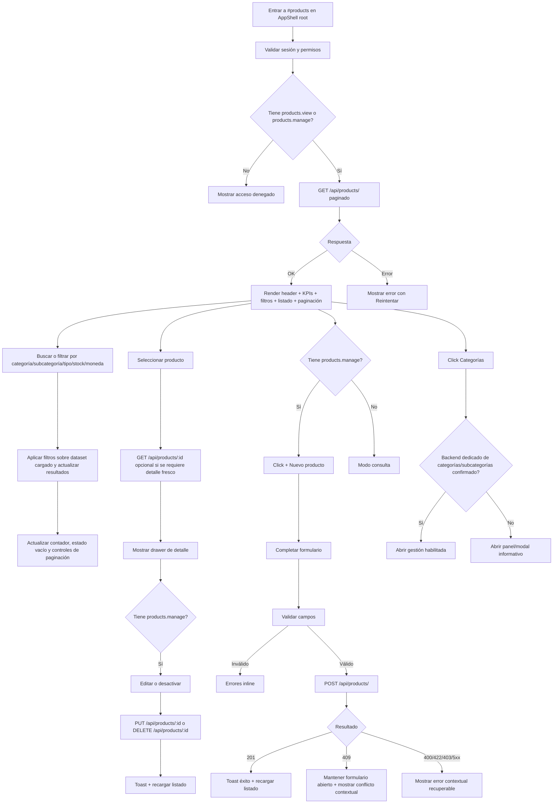

# Vista: Inventario / Productos

## Estado del documento
- Autor de consolidación UX/UI: `senior-ux-ui-designer-2a9dfb`
- Coordinación: `planning-agent-c2c92b`
- Estado: borrador listo para revisión de desarrollo/producto
- Alcance: especificación UX/UI para la futura vista moderna de inventario/productos dentro del AppShell root, bajo la ruta SPA `#products`.
- Tipo de entrega: especificación funcional, visual y de interacción. No incluye implementación.
- Nota de honestidad contractual: esta especificación separa explícitamente las capacidades verificadas para productos de las capacidades deseadas para categorías/subcategorías cuando no existe endpoint runtime dedicado confirmado.

## Fuentes utilizadas
Este documento se apoya en fuentes verificadas del repositorio:
- `docs/ui-guidelines.md`
- `docs/vistas/zones-view-spec.md`
- `docs/vistas/agents-view-spec.md`
- `docs/vistas/clients-view-spec.md`
- `docs/vistas/routes-view-spec.md`
- `docs/vistas/warehouses-view-spec.md`
- `src/routes/product.routes.js`
- `src/services/product.service.js`
- `src/repositories/product.repository.js`
- `src/schemas/product.schema.js`
- `README.md`
- `internal-docs/runtime-endpoint-catalog.md`
- Referencia legacy solo como contexto visual/no contractual: `legacy-public-runtime/root/products.html` y `legacy-public-runtime/root/products.js`

## Alineación con `ui-guidelines.md`
Se encontró y revisó `docs/ui-guidelines.md`. La vista debe respetar estas reglas:
- Usar sesión browser same-origin y fetch autenticado con `credentials: 'same-origin'` mediante helpers compartidos cuando existan.
- No persistir bearer tokens en storage ni reintroducir patrones legacy.
- Validar sesión/permisos al cargar; ocultar acciones no disponibles solo como mejora UX, no como seguridad.
- Mostrar errores visibles, breves y operables para red, autorización, validación o conflicto.
- No asumir capacidades no montadas en backend.
- Mantener separación de contexto: esta vista vive en `root/*`/AppShell administrativo, no en superficies `warehouse/*` operativas.
- Documentar endpoints consumidos, permisos requeridos, comportamiento responsive y estados principales.

# Análisis

## Contexto actual verificado
- La vista objetivo debe comportarse como una consola administrativa moderna de inventario/productos para usuarios de compañía dentro del AppShell root.
- El backend verificado para productos expone endpoints CRUD y de importación:
  - `GET /api/products/`
  - `GET /api/products/:id`
  - `POST /api/products/`
  - `PUT /api/products/:id`
  - `DELETE /api/products/:id`
  - `POST /api/products/import`
- `GET /api/products/` soporta paginación vía `parsePaginationQuery(req.query)`; si no se envía paginación, el servicio devuelve un arreglo completo.
- El repositorio incluye relaciones útiles para una vista de inventario: `category`, `subcategory`, `prices`, `warehouseStocks`, `warehouseLotStocks`, además de datos base de producto.
- El listado del repositorio filtra productos activos por defecto (`isActive: true`). Por tanto, los productos desactivados vía `DELETE /api/products/:id` no deben esperarse en la lista estándar.
- `DELETE /api/products/:id` no elimina físicamente en la implementación verificada; llama a `deactivateCompanyProduct`, por lo que la UI debe comunicarlo como `Desactivar producto`, no como eliminación irreversible.
- La importación de productos puede crear categorías implícitamente cuando cada fila trae `categoryName`; esto está verificado en `product.service.js`, pero no equivale a un contrato runtime de administración independiente de categorías.
- No se verificó un endpoint actual dedicado para listar, crear, editar o eliminar categorías desde la capa de rutas inspeccionada.

## Decisiones cerradas para desarrollo
### Ruta, naming visible y patrón de navegación
- La ruta SPA del AppShell para esta superficie se mantiene como `#products`.
- El título visible de la página debe ser coherente con el alcance más amplio de inventario sin cambiar el nombre técnico de la ruta. La referencia aprobada en esta especificación es `Inventario y productos`.
- La vista debe alinearse con los patrones actuales del AppShell root ya usados por `#agents`, `#clients`, `#routes`, `#zones` y `#warehouses`.

### Estrategia de carga y paginación MVP
- La experiencia del MVP debe ser paginada desde el día uno; no queda diferida a V2.
- `GET /api/products/` ya soporta paginación, por lo que la UI debe consumir la variante paginada como contrato principal de la vista.
- La navegación/filtro debe funcionar sobre esa experiencia paginada y evitar presentar el listado completo como supuesto contractual.
- Aproximadamente **100 productos visibles** es el umbral práctico de revisión para validar si el diseño, densidad, filtros y métricas por página siguen siendo suficientemente claros, pero no el disparador para agregar paginación porque esta ya forma parte del MVP.

### Categorías y subcategorías
- La vista debe soportar filtrado por **categoría y subcategoría** desde el MVP.
- La jerarquía visible debe ser `Categoría / Subcategoría` cuando exista subcategoría, sin sobrecargar la tabla principal.
- El catálogo de negocio debe contemplar como mínimo estas categorías visibles: `Envases`, `Tapas`, `Materia prima`, `Productos`, `Afiliaciones`, `Misceláneos`.
- Si el PRD o backend oficial de la compañía define categorías adicionales, deben integrarse como parte del catálogo de negocio autoritativo de esta superficie.
- Las subcategorías pueden existir y crearse debajo de cada categoría, pero la creación/edición directa desde UI sigue dependiendo de habilitación backend confirmada.

### Precio, stock y moneda como fuentes de verdad MVP
- El precio principal mostrado en listado, KPIs contextuales y resumen principal debe salir de `product.price` + `product.currency`.
- `prices[]` permanece como detalle complementario/contextual para vistas secundarias, no como fuente principal del listado.
- El stock visible y los KPIs de stock deben basarse en el agregado de `warehouseStocks`.
- `warehouseLotStocks` queda como soporte de detalle por bodega/lote y no como fuente principal del stock resumido.
- El filtro de moneda del MVP debe basarse en `product.currency`, no en monedas presentes dentro de `prices[]`.

### Gestión de categorías en fase 1
- Si la gestión standalone de categorías/subcategorías todavía no está habilitada por backend, la acción de cabecera `Categorías` debe abrir un panel/modal informativo y honesto.
- Ese panel puede explicar el catálogo esperado, la jerarquía categoría/subcategoría y el estado actual de habilitación, pero no debe aparentar que guarda cambios directamente.
- Si en una fase posterior se habilita backend dedicado, este documento deberá actualizarse con los endpoints, payloads, permisos y errores antes de activar guardado directo.

## Objetivo del usuario
- Consultar rápidamente productos activos de la compañía dentro de una consola administrativa de inventario.
- Buscar productos por código, nombre, descripción, tipo, categoría o subcategoría visible.
- Filtrar productos por categoría y subcategoría como criterio principal de navegación.
- Entender el precio principal y la disponibilidad visible de stock por producto sin ambigüedad de fuentes.
- Crear, editar y desactivar productos usando únicamente contratos verificados.
- Consultar el catálogo de categorías/subcategorías y su estado de habilitación desde una acción honesta de cabecera cuando la gestión standalone aún no exista.

## Objetivo del negocio
- Centralizar la administración de catálogo e inventario en una consola clara del AppShell.
- Reducir fricción para mantener productos activos, precios base, mínimos/máximos y clasificación comercial.
- Ordenar el inventario a partir de una jerarquía explícita de categorías y subcategorías sin inventar capacidades runtime no confirmadas.
- Minimizar errores operativos mostrando estados, stock agregado por bodega y límites con jerarquía visual clara.

## Casos de uso principales
1. Administrador consulta inventario y revisa KPIs de productos activos dentro de una vista paginada.
2. Usuario busca un producto por código/nombre y abre su detalle.
3. Usuario filtra productos por categoría y subcategoría.
4. Usuario con permisos crea un producto nuevo.
5. Usuario con permisos edita campos base de un producto existente.
6. Usuario con permisos desactiva un producto, entendiendo que desaparece del listado activo estándar.
7. Usuario abre la acción `Categorías` del header; si no hay endpoint confirmado, la UI informa el catálogo esperado y la dependencia backend sin simular guardado.
8. Usuario importa productos, con posible creación implícita de categorías desde `categoryName`, si el equipo decide exponer importación en esta vista.

## Riesgos UX
- Confundir `DELETE` con eliminación permanente cuando el backend realmente desactiva.
- Prometer administración directa de categorías/subcategorías sin endpoint runtime dedicado.
- Dejar ambigua la fuente del precio principal entre `price` y `prices[]`.
- Dejar ambigua la fuente del stock visible entre `quantity`, `warehouseStocks` y `warehouseLotStocks`.
- Sobrecargar la tabla con campos técnicos de producto, jerarquía de categorías, precios, stock por bodega y lotes al mismo tiempo.
- Mezclar flujos root/admin con tareas operativas de bodega como QA, ajustes o entradas complejas.
- Mostrar KPIs como cifras oficiales cuando se calculan localmente y no desde un endpoint agregado.

## Alcance MVP
### Incluye
- Vista root-shell moderna para inventario/productos bajo la ruta `#products`.
- Experiencia paginada desde el día uno mediante `GET /api/products/` usando el contrato paginado como comportamiento principal de la vista.
- Búsqueda por texto sobre campos visibles.
- Filtro por categoría y subcategoría como requisito funcional del MVP.
- Filtros por tipo de producto, estado de stock derivado, moneda y estado activo visible cuando aplique.
- KPIs derivados localmente del dataset cargado o página actual, marcados como `Calculado localmente` cuando no provengan de endpoint agregado.
- Tabla desktop y tarjetas mobile.
- Jerarquía visible `Categoría / Subcategoría` en listados y detalle, sin forzar columnas excesivas.
- Drawer/panel de detalle con datos del producto, categoría/subcategoría, precio principal, `prices[]` como contexto y stock/lotes disponibles en la respuesta.
- Creación de producto con `POST /api/products/`.
- Edición de producto con `PUT /api/products/:id`.
- Desactivación de producto con `DELETE /api/products/:id`, comunicada como `Desactivar producto`.
- Acción `Categorías` en header con comportamiento honesto: gestión directa si existe backend dedicado o panel/modal informativo si todavía no existe.
- Estados: loading, empty, filtered empty, error, success, disabled, saving y degraded.

### No incluye en esta fase
- CRUD standalone persistente de categorías/subcategorías si no se confirma endpoint dedicado.
- Edición/eliminación directa de categorías/subcategorías sin contrato.
- Ajustes de stock, QA de lotes, transferencias o movimientos desde esta vista root.
- Reglas de pricing avanzadas que desplacen a `product.price` como precio principal del listado.
- Exportaciones/reportes si no hay contrato específico.
- Dashboard financiero de costos/margen si no hay métricas backend confirmadas.
- Administración de bodegas; esa capacidad pertenece a la vista de bodegas.

## Contrato backend verificado
### Endpoints soportados actualmente
| Método | Endpoint | Uso en UI | Autorización observada |
|---|---|---|---|
| `GET` | `/api/products/` | Listar productos activos en la experiencia paginada del MVP | `products.view` o `products.manage` |
| `GET` | `/api/products/:id` | Obtener detalle de producto | `products.view` o `products.manage` |
| `POST` | `/api/products/` | Crear producto | `products.manage` |
| `PUT` | `/api/products/:id` | Actualizar producto | `products.manage` |
| `DELETE` | `/api/products/:id` | Desactivar producto | `products.manage` |
| `POST` | `/api/products/import` | Importar productos; puede crear categorías implícitas por `categoryName` | `products.import` o `products.manage` |

### Campos de producto verificados para mostrar o editar con cautela
Campos base presentes en schema/servicio/repositorio:
- `id`
- `companyId`
- `categoryId`
- `subcategoryId`
- `recipeId`
- `createdByUserId`
- `code`
- `name`
- `description`
- `productType`
- `sellableKind`
- `unit`
- `cabysCode`
- `currency`
- `price`
- `quantity`
- `reservedQuantity`
- `taxExempt`
- `taxCategory`
- `taxRate`
- `density`
- `densityUnit`
- `isActive`
- `lotStrategy`
- `inCatalog`
- `netContent`
- `conversionFactor`
- `kgConversionFactor`
- `minStock`
- `maxStock`
- `standbyStock`

Relaciones incluidas verificadas:
- `category`
- `subcategory`
- `prices`
- `warehouseStocks` con `warehouse`
- `warehouseLotStocks` con `warehouse` y `lot`
- `createdByUser`
- `supplierLinks` con `supplier`

### Validaciones verificadas de creación/edición
- `name`: requerido en creación, mínimo 2, máximo 255.
- `code`: opcional, máximo 50.
- `description`: opcional, máximo 2000.
- `productType`, `sellableKind`: opcionales, máximo 50.
- `unit`: opcional, máximo 30.
- `currency`: opcional, máximo 10.
- `price`: opcional, número mayor o igual a 0.
- `quantity`: opcional en creación, número mayor o igual a 0; omitido en actualización.
- `reservedQuantity`: opcional en creación pero un producto nuevo no puede iniciar con cantidad reservada mayor a 0; omitido en actualización.
- `minStock`, `maxStock`, `standbyStock`: opcionales, números mayor o igual a 0.
- Si `quantity > 0` al crear, `initialLots` debe distribuir las existencias por bodega y la suma de lotes debe coincidir con la cantidad total.
- `initialLots` con existencias requiere permiso `inventory.manage` además de la capacidad de crear producto.

## Tratamiento explícito de categorías y subcategorías
### Requisito de filtro y navegación
- La vista debe incluir filtros `Categoría` y `Subcategoría` como parte del MVP.
- Si existe endpoint dedicado de categorías/subcategorías en una fase posterior, ambos filtros deben alimentarse desde ese catálogo autoritativo.
- Con el contrato actual verificado, los filtros pueden alimentarse de forma defensiva desde `product.category` y `product.subcategory` presentes en los productos cargados/paginados.
- Si no hay categorías o subcategorías disponibles en la respuesta cargada, los filtros deben permanecer operables con estados `Todas las categorías` y `Todas las subcategorías`, sin presentar la ausencia como error del sistema.
- Cuando la vista esté operando sobre una página del listado, la UI debe comunicar que las opciones visibles provienen del dataset cargado en esa página/sesión mientras no exista catálogo backend dedicado.

### Catálogo visible de negocio
- La especificación debe tratar como base del catálogo visible, al menos, las categorías: `Envases`, `Tapas`, `Materia prima`, `Productos`, `Afiliaciones`, `Misceláneos`.
- Si el PRD define categorías adicionales, deben incorporarse como parte del catálogo de negocio autoritativo para la vista.
- Cada categoría puede contener subcategorías administrables a nivel de negocio, aunque la UI no debe simular su guardado directo sin backend confirmado.

### Requisito de gestión directa
La experiencia deseada incluye gestión de categorías/subcategorías desde la consola de inventario, pero el estado contractual hoy es:
- Soportado/verificado: creación implícita de categorías durante `POST /api/products/import` cuando una fila trae `categoryName` y no existe categoría equivalente en el inventario.
- No verificado hoy: endpoint runtime dedicado tipo `GET /api/categories`, `POST /api/categories`, `PUT /api/categories/:id`, `GET /api/subcategories` o similar.
- Conclusión UX: la acción `Categorías` del header debe existir, pero su comportamiento depende de la habilitación backend real.

### Comportamiento aprobado por fase
#### Fase 1 honesta sin endpoint de categorías/subcategorías
- Mantener filtros `Categoría` y `Subcategoría` activos con fuente honesta basada en datos cargados o catálogo soportado por backend si existiera.
- La acción `Categorías` debe abrir un panel/modal informativo dentro del AppShell.
- Ese panel debe mostrar:
  - catálogo base esperado de categorías;
  - explicación de la jerarquía categoría/subcategoría;
  - estado actual de habilitación backend;
  - nota de que la importación puede crear categorías implícitas mediante `categoryName`.
- No abrir formularios que aparenten guardar categorías o subcategorías standalone.

#### Fase 1B si se confirma backend dedicado antes de desarrollo
- Habilitar CTA `+ Nueva categoría` y, si aplica, `+ Nueva subcategoría` dentro del panel o área de categorías.
- Consumir únicamente endpoints dedicados documentados por backend.
- Actualizar este documento con método, path, payload, permisos, reglas de unicidad y errores antes de implementar guardado directo.

#### Importación como alternativa soportada pero no equivalente
- Si se expone importación, el modal debe explicar: `Las categorías incluidas como categoryName en el archivo pueden crearse automáticamente durante la importación.`
- No presentar esta importación como sustituto completo de administración de categorías/subcategorías, porque no permite editar, ordenar, desactivar ni auditar esa jerarquía por sí misma.

## Permisos y actores
### Actores esperados
- Administrador de compañía con permisos de productos/inventario.
- Usuario administrativo con `products.view` para consulta.
- Gestor de productos con `products.manage` para crear, editar y desactivar.
- Usuario con `products.import` o `products.manage` para importación.
- Usuario con `inventory.manage` si crea producto con existencias iniciales/lotes.

### Matriz UX de permisos
| Capacidad | `products.view` | `products.manage` | `products.import` | `inventory.manage` |
|---|---:|---:|---:|---:|
| Ver vista | Sí | Sí | No por sí solo | No por sí solo |
| Listar productos | Sí | Sí | No | No |
| Buscar/filtrar | Sí | Sí | No | No |
| Ver detalle | Sí | Sí | No | No |
| Crear producto | No | Sí | No | No |
| Editar producto | No | Sí | No | No |
| Desactivar producto | No | Sí | No | No |
| Importar productos | No | Sí | Sí | No |
| Crear con lotes iniciales | No | Sí, si también tiene `inventory.manage` | No | Requerido adicional |
| Crear categoría directa | Dependiente de backend futuro | Dependiente de backend futuro | No equivalente | No equivalente |

### Reglas de interfaz por permiso
- Resolver visibilidad por permisos efectivos, no por nombre de rol.
- Si solo tiene lectura, ocultar o deshabilitar CTAs de creación, edición, importación y desactivación.
- Si el backend responde 403, mostrar estado contextual y conservar datos no sensibles del formulario para corrección de permisos/sesión.
- El frontend nunca debe considerar ocultar botones como sustituto de autorización backend.

## Principios UX de la vista
1. **KPIs primero**: el usuario debe entender volumen, stock y alertas antes de entrar al detalle.
2. **Categoría y subcategoría como eje de navegación**: ambos filtros deben ser visibles, fáciles de usar y coherentes entre listado y detalle.
3. **Honestidad de capacidades**: no mostrar gestión directa de categorías/subcategorías como operable si el backend no está confirmado.
4. **Fuentes de verdad explícitas**: precio principal desde `product.price` + `product.currency`; stock visible desde agregado de `warehouseStocks`.
5. **Acciones seguras y reversibles visualmente**: usar `Desactivar`, no `Eliminar`.
6. **Densidad empresarial controlada**: tabla escaneable en desktop y tarjetas simples en mobile.
7. **Mobile first**: las tareas de consulta, filtro, paginación y detalle deben funcionar sin scroll horizontal.
8. **Accesibilidad WCAG**: contraste, foco visible, labels explícitos, estados anunciables y no depender solo del color.
9. **Consistencia AppShell**: superficies, toolbar, tablas, drawers, modales y toasts deben alinearse explícitamente con los patrones actuales del AppShell root, no con una referencia contractual de Material Design 3.

# Flujo UX



## Posicionamiento dentro del AppShell
```text
AppShell
├── Sidebar
├── Header shell
└── MainContent
    └── ProductsPage (#products)
        ├── PageHeader
        ├── KPIGrid
        ├── ToolbarSearchFilters
        ├── CategorySubcategoryPanel
        ├── InventoryContent
        │   ├── ProductsTableDesktop
        │   └── ProductCardsMobile
        ├── PaginationBar
        ├── ProductDetailDrawer
        ├── CreateEditProductDrawer
        └── CategoriesInfoModal / EnabledCategoryManagementPanel
```

# Wireframe

## Estructura de pantalla
### Header de página
Orden recomendado:
1. Eyebrow: `INVENTARIO`
2. Título: `Inventario y productos`
3. Subtítulo: `Consulta, clasifica y administra los productos activos de la compañía.`
4. Acciones:
   - Secundaria: `Actualizar`
   - Secundaria condicional: `Importar` si tiene `products.import` o `products.manage`
   - Secundaria: `Categorías`
     - Si no existe backend dedicado para gestión standalone, abre panel/modal informativo.
     - Si existe backend dedicado confirmado, abre gestión habilitada.
   - Primaria: `+ Nuevo producto` solo con `products.manage`

### KPIs recomendados
Los KPIs no cuentan con endpoint agregado verificado; deben calcularse localmente y marcarse como tal si no provienen de backend específico.
1. **Productos activos** — total de productos cargados o `totalItems` cuando la respuesta paginada lo provea.
2. **Con stock** — productos con stock agregado visible mayor a 0 calculado desde `warehouseStocks`.
3. **Bajo mínimo** — productos donde el stock agregado desde `warehouseStocks` sea menor a `minStock` cuando `minStock` exista.
4. **Categorías visibles** — categorías únicas derivadas del dataset cargado o catálogo disponible.
5. **Subcategorías visibles** — subcategorías únicas derivadas del dataset cargado cuando existan.
6. Opcional: **Con lotes visibles** — productos con `warehouseLotStocks.length > 0`.

Reglas:
- El stock visible no debe basarse en una redacción ambigua de `quantity o warehouseStocks`; para esta vista el origen aprobado es el agregado de `warehouseStocks`.
- Si el KPI se calcula solo sobre la página actual por paginación, el label debe decir `En esta página` o mostrarse ayuda contextual equivalente.
- No presentar `Bajo mínimo` si no hay `minStock` o stock suficiente para calcularlo; usar estado `Sin datos suficientes`.

### Filtros y búsqueda
Componentes:
- Input `Buscar por código, nombre o descripción...`
- Select `Categoría`: `Todas` + categorías derivadas o catálogo confirmado.
- Select `Subcategoría`: `Todas` + subcategorías derivadas o catálogo confirmado; idealmente dependiente de la categoría seleccionada cuando la fuente lo permita.
- Select `Tipo`: valores únicos de `productType` cargados.
- Select `Stock`: `Todos`, `Con stock`, `Sin stock`, `Bajo mínimo`.
- Select `Moneda`: valores únicos de `product.currency` si aplica.
- Toggle/chip `En catálogo` si `inCatalog` se usa visualmente.
- Acción `Limpiar filtros` visible cuando exista filtro activo.
- Contador: `N de M productos`.
- Controles de paginación visibles desde MVP: tamaño de página si se aprueba, navegación anterior/siguiente y contexto de página actual.

### Tabla/listado desktop
Columnas recomendadas:
1. `Producto`
   - nombre principal;
   - código como chip/mono secundario;
   - descripción truncada opcional.
2. `Clasificación`
   - `category.name` si existe;
   - `subcategory.name` debajo o como metadato secundario cuando exista;
   - fallback `Sin categoría` / `Sin subcategoría`.
3. `Tipo`
   - `productType` normalizado visualmente.
4. `Precio`
   - `product.currency` + `product.price` como fuente principal del listado.
   - `prices[]` no debe desplazar este valor en la tabla principal.
5. `Stock`
   - stock agregado visible calculado desde `warehouseStocks`;
   - chip `Bajo mínimo` si aplica.
6. `Cobertura`
   - conteo de bodegas con stock y lotes visibles si están incluidos.
7. `Estado`
   - `Activo`, `En catálogo`, chips según campos.
8. `Acciones`
   - `Ver detalle`;
   - menú con `Editar` y `Desactivar` solo con `products.manage`.

### Tarjetas mobile
Cada tarjeta debe mostrar:
- Nombre del producto.
- Código.
- Categoría y subcategoría en jerarquía compacta.
- Precio principal (`product.currency` + `product.price`).
- Stock agregado visible y chip de estado.
- Chips: tipo, en catálogo, bajo mínimo si aplica.
- Acción principal: `Ver detalle`.
- Menú secundario solo si hay permisos.

## Wireframe desktop
```text
┌──────────────────────────────────────────────────────────────────────────────┐
│ AppShell / Inventario                                                        │
├──────────────────────────────────────────────────────────────────────────────┤
│ INVENTARIO                         [Actualizar] [Importar] [Categorías] [+]  │
│ Inventario y productos                                                       │
│ Consulta, clasifica y administra los productos activos de la compañía.       │
│                                                                              │
│ ┌──────────────┐ ┌──────────────┐ ┌──────────────┐ ┌──────────────────────┐ │
│ │ Activos 128  │ │ Con stock 94 │ │ Bajo mín. 8  │ │ Categorías visibles 12│ │
│ │ calc. local  │ │ calc. local  │ │ calc. local  │ │ calc. local           │ │
│ └──────────────┘ └──────────────┘ └──────────────┘ └──────────────────────┘ │
│                                                                              │
│ ┌──────────────────────┐ ┌─────────────┐ ┌──────────────┐ ┌─────────┐       │
│ │ Buscar por código... │ │ Categoría ▾ │ │ Subcategoría▾│ │ Stock ▾ │       │
│ └──────────────────────┘ └─────────────┘ └──────────────┘ └─────────┘       │
│ 42 de 128 productos                                     [Limpiar filtros]    │
│                                                                              │
│ ┌──────────────────────────────────────────────────────────────────────────┐ │
│ │ Producto      Clasificación        Tipo      Precio   Stock   Estado ... │ │
│ ├──────────────────────────────────────────────────────────────────────────┤ │
│ │ Café molido   Productos            FINISHED  CRC 2500 48      Activo ... │ │
│ │ CAF-001       Molidos                                [Bajo mínimo]       │ │
│ ├──────────────────────────────────────────────────────────────────────────┤ │
│ │ Empaque 250g  Envases              PACKAGING CRC 900  300     Activo ... │ │
│ │ EMP-250       Bolsas                                                           │ │
│ └──────────────────────────────────────────────────────────────────────────┘ │
│ Página 1 de 7                                       [Anterior] [Siguiente] │
└──────────────────────────────────────────────────────────────────────────────┘
```

## Wireframe mobile
```text
┌──────────────────────────────┐
│ INVENTARIO                   │
│ Inventario y productos       │
│ Consulta y administra los    │
│ productos activos.           │
│ [+ Nuevo producto]           │
│ [Actualizar] [Importar]      │
├──────────────────────────────┤
│ [Activos 128] [Con stock 94] │
│ [Bajo mín. 8] [Categorías 12]│
├──────────────────────────────┤
│ [Buscar...]                  │
│ [Categoría ▾] [Subcat. ▾]    │
│ [Stock ▾] [Moneda ▾]         │
│ 42 de 128 productos          │
│ [Anterior] [Siguiente]       │
├──────────────────────────────┤
│ ┌──────────────────────────┐ │
│ │ Café molido              │ │
│ │ CAF-001                  │ │
│ │ Alimentos · FINISHED     │ │
│ │ CRC 2.500 · Stock 48     │ │
│ │ [Activo] [Bajo mínimo]   │ │
│ │ [Ver detalle]            │ │
│ └──────────────────────────┘ │
│ ┌──────────────────────────┐ │
│ │ Empaque 250g             │ │
│ │ EMP-250                  │ │
│ │ Empaques · PACKAGING     │ │
│ │ Stock 300                │ │
│ │ [Activo]                 │ │
│ └──────────────────────────┘ │
└──────────────────────────────┘
```

## Drawer de detalle
```text
┌──────────────────────────────────────┐
│ Café molido                    [X]   │
│ CAF-001 · Productos / Molidos        │
├──────────────────────────────────────┤
│ Resumen                              │
│ Tipo: FINISHED_PRODUCT               │
│ Precio principal: CRC 2.500          │
│ Unidad: UN                           │
│ En catálogo: Sí                      │
│                                      │
│ Stock                                │
│ Total visible: 48                    │
│ Mínimo: 60  [Bajo mínimo]            │
│ Bodegas con stock: 2                 │
│ Lotes visibles: 3                    │
│                                      │
│ Bodegas                              │
│ - Principal: 40                      │
│ - Reserva: 8                         │
│                                      │
│ [Editar] [Desactivar producto]       │
└──────────────────────────────────────┘
```

## Drawer de creación/edición de producto
```text
┌──────────────────────────────────────┐
│ Nuevo producto                       │
│ Registra los datos base del producto │
├──────────────────────────────────────┤
│ Nombre *                             │
│ [ Café molido                      ] │
│ Código                               │
│ [ CAF-001                          ] │
│ Categoría                            │
│ [ Seleccionar categoría disponible ] │
│ Subcategoría                         │
│ [ Seleccionar subcategoría         ] │
│ [Gestionar categorías] abre panel    │
│ Tipo de producto                     │
│ [ FINISHED_PRODUCT                 ] │
│ Precio / Moneda                      │
│ [ 2500 ] [ CRC ]                     │
│ Stock mínimo / máximo                │
│ [ 60 ] [ 500 ]                       │
│ [●] En catálogo   [●] Activo         │
├──────────────────────────────────────┤
│                [Cancelar] [Guardar]  │
└──────────────────────────────────────┘
```

# Diseño Visual

## Estilo general
- La vista debe alinearse explícitamente con los patrones actuales del AppShell root ya usados por `#agents`, `#clients`, `#routes`, `#zones` y `#warehouses`; no debe presentarse como una implementación contractual de Material Design 3.
- Superficies limpias, cards sobrias, chips semánticos, foco visible y jerarquía clara consistentes con el shell actual.
- Apariencia empresarial moderna: sobria, densa pero legible, orientada a escaneo de datos.
- Prioridad visual: título → KPIs → filtros/jerarquía de categorías → tabla/tarjetas → detalle.
- No copiar literalmente la UI legacy; usarla solo como referencia de capacidades históricas.

## Colores recomendados
Usar tokens del AppShell si existen. Referencias semánticas:
- Fondo página: `#F8FAFC`
- Superficie/card: `#FFFFFF`
- Texto principal: `#0F172A`
- Texto secundario: `#64748B`
- Borde: `#E2E8F0`
- Primario inventario: `#16A34A`
- Hover primario: `#15803D`
- Info/categoría: `#2563EB` sobre `#DBEAFE`
- Stock correcto: `#16A34A` sobre `#DCFCE7`
- Bajo mínimo/advertencia: `#D97706` sobre `#FEF3C7`
- Sin stock/inactivo: `#475569` sobre `#F1F5F9`
- Error/destructivo: `#DC2626` sobre `#FEE2E2`

## Tipografía
- Usar la familia definida por el AppShell.
- Título de página: 28–32 px, semibold/bold.
- Subtítulo: 14–16 px, regular.
- KPI número: 28 px, semibold.
- Labels y chips: 12–14 px, medium.
- Tabla: 14 px base; metadatos 12–13 px.
- Código de producto: chip o texto monoespaciado.

## Espaciado
- Contenedor: 16 px mobile, 24 px tablet, 32 px desktop.
- Gap secciones: 20–24 px.
- Cards KPI: padding 16 px mobile, 20 px desktop.
- Toolbar: 12–16 px de gap interno; filtros apilables en mobile.
- Tabla/cards: padding 16–20 px.
- Drawer: 24 px desktop, 16–20 px mobile, acciones sticky al pie.

## Componentes reutilizables
- `PageHeader`
- `KPIGrid` / `KPICard`
- `SearchInput`
- `FilterSelect`
- `CategoryFilter`
- `SubcategoryFilter`
- `StatusChip`
- `StockChip`
- `DataTable`
- `EntityCard`
- `ProductDetailDrawer`
- `ProductFormDrawer`
- `CategoryDependencyNotice`
- `EmptyState`
- `ErrorState`
- `Toast`

# Recomendaciones

## Comportamiento de detalle
- Abrir drawer lateral en desktop y pantalla/drawer full-height en mobile.
- Usar `GET /api/products/:id` al abrir detalle si se requiere información fresca; si el listado ya trae relaciones suficientes, puede abrir inmediato y refrescar en segundo plano.
- El resumen principal debe mostrar `Categoría` y `Subcategoría` de forma explícita cuando existan.
- El precio principal del resumen debe mostrarse desde `product.currency` + `product.price`.
- `prices[]` puede mostrarse en una sección secundaria tipo `Precios relacionados` o `Contexto de precios`, nunca sustituyendo el precio principal del resumen.
- Mostrar stock por bodega/lote solo si viene en la respuesta; el total visible debe salir del agregado de `warehouseStocks`.
- `warehouseLotStocks` debe presentarse como detalle complementario por lote/bodega y no como sustituto del stock agregado principal.
- Si no hay `warehouseStocks` o `warehouseLotStocks`, mostrar `Sin stock registrado en la información disponible`.

## Creación y edición de producto
### Campos recomendados para MVP
- `name` requerido.
- `code` opcional.
- `description` opcional.
- `categoryId` opcional si hay categoría existente seleccionable.
- `subcategoryId` opcional si existe subcategoría seleccionable dentro de la categoría elegida.
- `productType` opcional.
- `sellableKind` opcional.
- `unit` opcional.
- `currency` opcional.
- `price` opcional.
- `minStock`, `maxStock`, `standbyStock` opcionales.
- `taxExempt`, `taxCategory`, `taxRate` opcionales si producto los considera necesarios.
- `inCatalog` e `isActive` como switches opcionales.

### Existencias iniciales
- La creación con `quantity > 0` obliga a capturar `initialLots` y requiere permiso adicional `inventory.manage`.
- Recomendación MVP: separar `Datos del producto` de `Existencias iniciales` en un step opcional o colapsable.
- Si el usuario no tiene `inventory.manage`, ocultar/deshabilitar captura de existencias iniciales con copy: `Necesitas permiso de gestión de inventario para registrar existencias iniciales.`

### Desactivación
- Etiqueta de acción: `Desactivar producto`.
- Confirmación: `El producto dejará de aparecer en el listado activo. Esta acción no elimina el registro histórico.`
- Éxito: `Producto desactivado correctamente.`
- No usar `Eliminar permanentemente` ni iconografía de destrucción irreversible.

## Estados UX
### Loading inicial
- Skeletons para KPIs, toolbar y 6–8 filas/tarjetas.
- Texto accesible: `Cargando inventario y productos...`.

### Empty sin productos
- Título: `Aún no hay productos activos`
- Descripción: `Crea el primer producto para empezar a organizar el inventario de la compañía.`
- CTA: `+ Nuevo producto` si tiene `products.manage`.
- Si solo lectura: `Cuando un usuario con gestión de productos cree productos, aparecerán aquí.`

### Empty por filtros
- Título: `No encontramos productos con esos filtros`
- Descripción: `Prueba cambiando la búsqueda, la categoría o limpiando los filtros aplicados.`
- CTA: `Limpiar filtros`.

### Error de carga
- Título: `No pudimos cargar el inventario`
- Descripción: `Revisa tu conexión o intenta nuevamente.`
- Acción: `Reintentar`.

### Estado degradado de categorías
- Título: `Gestión directa de categorías no disponible`
- Descripción: `No hay un endpoint runtime confirmado para gestionar categorías o subcategorías desde esta vista. Los filtros usan la información visible en los productos cargados o el catálogo actualmente disponible.`
- Acción opcional: `Ver requisito backend` o abrir el panel/modal informativo de categorías.

### Error de guardado
- Validación: errores inline junto al campo.
- 403: `No tienes permisos para realizar esta acción.`
- Conflicto 409: mantener el formulario abierto y mostrar un error contextual recuperable, por ejemplo: `Ya existe un producto con ese código. Revisa el dato e inténtalo nuevamente.`
- Si el conflicto aplica a otro identificador único respaldado por backend, reutilizar el mismo patrón contextual sin perder la captura del usuario.
- Error genérico: `No pudimos guardar el producto. Inténtalo nuevamente.`
- Importación con error: `No pudimos importar los productos. Revisa el archivo y vuelve a intentarlo.`

### Success
- Crear: `Producto creado correctamente.`
- Editar: `Producto actualizado correctamente.`
- Desactivar: `Producto desactivado correctamente.`
- Importar: `Importación procesada correctamente.` con resumen si el endpoint lo devuelve.
- Toasts con `aria-live="polite"`.

## Responsive
- Mobile first: cards apiladas, filtros en grid de 2 columnas o acordeón.
- `< 768px`: tarjetas, header apilado, acciones en bloque, drawer full-height.
- `768–1023px`: tabla compacta o cards 2 columnas según densidad.
- `>= 1024px`: tabla completa y drawer lateral.
- Evitar scroll horizontal obligatorio.
- Acciones destructivas o de edición deben quedar dentro de menú accesible en mobile.

## Accesibilidad WCAG
- Contraste mínimo 4.5:1 para texto normal.
- Foco visible en inputs, selects, botones, menús y filas accionables.
- Labels explícitos asociados a campos de formulario.
- Errores asociados con `aria-describedby`.
- Chips con texto, no solo color.
- Tabla con headers semánticos; tarjetas mobile como lista de artículos con headings.
- Confirmación de desactivación con foco atrapado y retorno de foco al disparador.
- Toasts y errores globales anunciados por regiones live.

## Copy recomendado
### Términos preferidos
- Usar `Producto` para entidades del catálogo.
- Usar `Inventario` para la consola/página completa y `Inventario y productos` como título visible de la vista.
- Usar `Categoría` para clasificación principal y `Subcategoría` para segundo nivel.
- Usar `Desactivar`, no `Eliminar`, para `DELETE /api/products/:id`.
- Usar `Bajo mínimo`, no `stock crítico`, salvo que negocio defina otro estándar.

### Microcopy clave
- Header: `Consulta, clasifica y administra los productos activos de la compañía.`
- Búsqueda: `Buscar por código, nombre o descripción...`
- Categoría fallback: `Categorías presentes en los productos cargados.`
- Subcategoría fallback: `Subcategorías presentes en los productos cargados.`
- Gestión de categorías no habilitada: `La gestión directa de categorías y subcategorías requiere habilitar el contrato backend correspondiente.`
- Desactivar: `El producto dejará de aparecer en el listado activo. No se eliminará el registro histórico.`

## Restricciones explícitas sobre capacidades no soportadas
La UI no debe prometer ni mostrar como operable:
- Crear, editar o eliminar categorías o subcategorías standalone sin endpoint confirmado.
- Listado global/autoritativo de categorías o subcategorías si solo se derivan desde productos cargados.
- Filtro global server-side de categoría/subcategoría cuando se usa solo filtrado local/página actual.
- Recuperación de productos inactivos si el listado estándar solo devuelve activos.
- Eliminación irreversible de productos.
- Ajustes, transferencias, QA o movimientos de inventario desde esta vista si no se consumen sus endpoints específicos con diseño propio.
- Exportación de inventario si no hay endpoint definido.
- Métricas oficiales de costo, margen o rotación si no hay contrato agregado.

# Especificaciones para Desarrollo

## Carga inicial
1. Validar sesión y permisos efectivos desde el mecanismo compartido del AppShell.
2. Si el usuario no tiene `products.view` ni `products.manage`, mostrar acceso denegado.
3. Ejecutar `GET /api/products/` con `credentials: 'same-origin'` usando experiencia paginada desde el primer render.
4. Normalizar la respuesta paginada y tratar `items` + metadatos de paginación como contrato principal de la vista.
5. Construir filtros locales desde datos cargados, incluyendo categorías derivadas de `product.category`, subcategorías derivadas de `product.subcategory` y moneda derivada de `product.currency`.
6. Calcular KPIs localmente y marcar como `Calculado localmente` si no provienen de backend agregado.
7. Calcular el stock visible por producto a partir del agregado de `warehouseStocks`.
8. Manejar defensivamente errores HTTP y respuestas no JSON.

## Filtros
Aplicar en este orden recomendado:
1. Texto de búsqueda.
2. Categoría.
3. Subcategoría.
4. Tipo de producto.
5. Stock.
6. Moneda.
7. En catálogo/estado si se expone.

Reglas críticas:
- La relación subcategoría debe depender visualmente de la categoría seleccionada cuando la fuente de datos lo permita.
- Si la vista depende de dataset paginado sin catálogo backend dedicado, los filtros locales se aplican de forma honesta sobre el dataset cargado y no deben presentarse como búsqueda global no soportada.

## Creación
1. Mostrar `+ Nuevo producto` solo con `products.manage`.
2. Construir payload con campos soportados por `createProductSchema`.
3. No enviar `quantity > 0` sin `initialLots` completos.
4. Si se capturan lotes iniciales, exigir/validar permiso `inventory.manage` en UX y esperar validación backend.
5. Enviar `POST /api/products/` con JSON y credenciales same-origin.
6. En éxito, cerrar drawer, limpiar formulario, mostrar toast y recargar listado/página actual.
7. Si el backend responde `409`, mantener el formulario abierto y mostrar error contextual recuperable sobre el identificador en conflicto.
8. En otros errores, mantener formulario y mostrar mensajes inline/globales.

## Edición
1. Mostrar `Editar` solo con `products.manage`.
2. Usar `PUT /api/products/:id`.
3. No enviar `quantity` ni `reservedQuantity` en actualización; están omitidos por schema.
4. Mantener copy de éxito/error claro.
5. Si el backend responde `409`, mantener el formulario abierto y mostrar error contextual recuperable alineado con el patrón de bodegas.
6. Recargar detalle/listado tras éxito.

## Desactivación
1. Mostrar `Desactivar producto`, no `Eliminar`.
2. Pedir confirmación explícita.
3. Consumir `DELETE /api/products/:id`.
4. En éxito 204, cerrar confirmación/detalle, mostrar toast y recargar listado.
5. No prometer recuperación/reactivación si no hay endpoint verificado.

## Importación
1. Mostrar `Importar` si tiene `products.import` o `products.manage`.
2. Consumir `POST /api/products/import` si el equipo decide exponer este flujo en MVP.
3. Explicar que `categoryName` puede crear categorías implícitamente durante importación.
4. No vender esta capacidad como CRUD de categorías o subcategorías.
5. Mostrar resumen `created`, `updated`, `skipped` si la respuesta lo devuelve.

## Categorías: dependencia backend para gestión directa
Antes de implementar guardado directo de categorías/subcategorías, desarrollo/producto debe confirmar y documentar:
- Endpoint de listado de categorías.
- Endpoint de creación de categoría.
- Endpoint de creación/listado de subcategorías si aplica.
- Payload requerido (`name`, `categoryType`, parent/jerarquía, etc.).
- Permisos requeridos.
- Reglas de unicidad y errores.
- Relación con inventario/compañía.
- Si existe edición/desactivación.

Sin esa confirmación:
- La acción `Categorías` debe abrir panel/modal informativo, no un formulario que aparente guardar.
- El formulario de categoría/subcategoría no debe enviar requests a rutas inventadas.

## Criterios de aceptación MVP
- La vista respeta `docs/ui-guidelines.md` y usa sesión same-origin.
- La ruta SPA implementada para esta superficie es `#products`.
- Un usuario con `products.view` puede ver, buscar, filtrar por categoría y subcategoría, paginar y abrir detalle.
- Un usuario con `products.manage` puede crear, editar y desactivar productos.
- La acción `Categorías` del header es honesta: abre gestión real solo si existe backend dedicado o un panel/modal informativo si no existe.
- La acción de desactivación no se comunica como eliminación irreversible.
- El filtro de categoría y subcategoría existe y funciona sobre una fuente honesta: datos cargados o endpoint confirmado.
- El precio principal del listado se muestra desde `product.price` + `product.currency`; `prices[]` queda como contexto secundario.
- El stock visible y los KPIs de stock usan como fuente el agregado de `warehouseStocks`; `warehouseLotStocks` queda para detalle.
- El filtro de moneda se basa en `product.currency`.
- Los conflictos `409` en creación/edición mantienen el formulario abierto y muestran error contextual recuperable.
- Los KPIs no se presentan como métricas oficiales si se calculan localmente.
- La vista funciona en mobile sin scroll horizontal obligatorio.
- No se muestran acciones de stock, QA, transferencias, exportación o categorías CRUD sin contrato verificado.
- Los estados loading, empty, filtered empty, error, success, disabled y degraded están contemplados.
