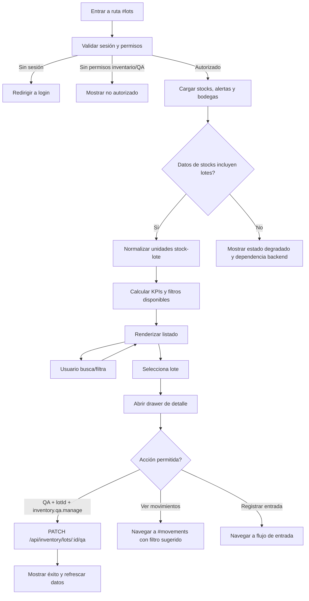

# Vista: Lotes

## Estado del documento
- Autor de consolidación UX/UI: `senior-ux-ui-designer-5b6241`
- Coordinación: `planning-agent-c2c92b`
- Estado: borrador listo para revisión de producto/desarrollo.
- Alcance: especificación UX/UI para la futura vista moderna `#lots` dentro del AppShell root.
- Tipo de entrega: especificación funcional, visual y de interacción. No incluye implementación.
- Nota de honestidad contractual: no se verificó un endpoint standalone de listado/detalle de lotes en la capa runtime inspeccionada. La experiencia MVP solo puede avanzar a implementación completa si `GET /api/inventory/stocks` se confirma como fuente suficiente de campos de lote; de lo contrario, debe mantenerse como estado bloqueado/degradado y documentarse una dependencia backend antes de activar capacidades adicionales.

## Fuentes utilizadas
Se encontró y revisó `docs/ui-guidelines.md`. Esta especificación se apoya en fuentes verificadas del repositorio:
- `docs/ui-guidelines.md`
- `docs/vistas/inventory-view-spec.md`
- `docs/vistas/warehouses-view-spec.md`
- `docs/runtime-endpoint-catalog.md`
- `internal-docs/runtime-endpoint-catalog.md`
- `docs/openapi/runtime-baseline.openapi.json` como evidencia parcial de contratos runtime formalizados
- Contexto de arquitectura actual de AppShell/root manifest documentado en `docs/architecture.md` y `docs/current-state.md`

## Alineación con `ui-guidelines.md`
La implementación de `#lots` debe respetar:
- Fetch autenticado con `credentials: 'same-origin'` y helpers compartidos cuando existan.
- No persistir bearer tokens ni tenant IDs en storage público.
- Validar sesión y permisos efectivos al cargar; la UI puede ocultar acciones como mejora UX, pero el backend sigue siendo la autoridad.
- Consumir únicamente endpoints montados/verificados o documentar una dependencia backend antes de implementar una acción.
- Mostrar errores visibles y recuperables para red, autorización, validación y respuestas degradadas.
- Mantener la vista dentro de `root/*`/AppShell administrativo; no mezclar con superficies `warehouse/*` operativas.

# Análisis

## Contexto actual verificado
- La ruta SPA planificada para la vista es `#lots`.
- El root-shell manifest ya contiene entradas pendientes para `#products`, `#lots`, `#movements` y `#warehouses`.
- No existe evidencia verificada de una página legacy standalone `lots.html` que pueda copiarse literalmente.
- El catálogo runtime verificado para inventario/bodegas/lotes incluye:
  - `GET /api/inventory/alerts`
  - `GET /api/inventory/alerts/:id`
  - `PATCH /api/inventory/alerts/:id/status`
  - `GET /api/inventory/stocks`
  - `GET /api/inventory/movements`
  - `POST /api/inventory/entries`
  - `PATCH /api/inventory/lots/:id/qa`
  - `POST /api/inventory/adjustments`
  - `GET /api/warehouses/company`
  - `POST /api/warehouses/company`
- Productos dispone de detalle/agregado con `warehouseLotStocks`, `warehouseStocks`, `category`, `subcategory` y campos relacionados a lotes a través del agregado de producto.
- No se debe prometer edición, eliminación, transferencia, consumo o creación directa de lotes si no hay contrato verificado para esas acciones.

## Relación de información de inventario
La navegación y el copy deben comunicar una IA coherente:
- **Bodegas** = estructura/configuración donde existe o se organiza el inventario.
- **Productos** = catálogo y visibilidad comercial/operativa del inventario.
- **Lotes** = trazabilidad y estado de unidades de stock por lote.
- **Movimientos** = historial de entradas, ajustes, traslados si existieran, y cambios registrados.

## Dependencia de taxonomía de Productos
El comportamiento de categoría/subcategoría en `#lots` hereda la taxonomía y fuente definidas por la vista/especificación de Productos (`#products`). En el MVP, Lots debe usar la misma fuente disponible para productos o los campos `category`/`subcategory` incluidos en el agregado de producto, sin crear una taxonomía paralela. Si Productos migra después a una fuente backend dedicada para categorías/subcategorías, Lots debe consumir esa misma fuente para mantener consistencia de filtros, etiquetas y jerarquía.

## Nota obligatoria de navegación/sidebar
`Bodegas` debe aparecer dentro del grupo de inventario en el sidebar/navigation del AppShell, junto a `Productos`, `Lotes` y `Movimientos`. Actualmente exponer solo productos/lotes/movimientos dentro del grupo de inventario no es coherente con la planificación existente de bodegas ni con la relación IA descrita arriba. Recomendación de orden del grupo:
1. `Bodegas` (`#warehouses`)
2. `Productos` (`#products`)
3. `Lotes` (`#lots`)
4. `Movimientos` (`#movements`)

## Objetivo de la vista
Dar visibilidad operativa y de trazabilidad sobre lotes o unidades stock-lote, permitiendo encontrar riesgos de vencimiento, QA, disponibilidad y ubicación sin convertir la vista en un módulo de movimientos ni en un CRUD de lotes no soportado.

## Objetivo del usuario
- Consultar lotes disponibles o relacionados con stock por producto y bodega.
- Identificar lotes próximos a vencer, vencidos, bloqueados o con alerta.
- Revisar el estado QA de un lote cuando exista información suficiente.
- Abrir un detalle contextual del lote sin perder el listado.
- Navegar a producto, bodega, alerta o movimientos relacionados cuando corresponda.
- Ejecutar únicamente acciones verificadas: registrar QA si tiene permiso y contrato disponible; registrar entrada como flujo conectado si el usuario tiene gestión de inventario.

## Objetivo del negocio
- Reducir pérdidas por vencimiento y errores de trazabilidad.
- Mejorar control de QA y visibilidad de stock por lote.
- Separar claramente monitoreo de lotes de la auditoría histórica de movimientos.
- Mantener integridad contractual evitando acciones no soportadas por backend.

## Casos de uso principales
1. Responsable de inventario revisa lotes próximos a vencer por bodega.
2. Encargado QA filtra lotes pendientes o bloqueados y registra resultado QA cuando está permitido.
3. Administrador consulta qué producto y bodega originan una alerta de inventario.
4. Usuario de lectura busca un lote por código/número para entender disponibilidad y estado.
5. Usuario navega desde un lote a movimientos relacionados para ver historia, sin editar el lote desde esta vista.

## Riesgos UX
- Confundir `Lotes` con `Movimientos`: la vista debe explicar que lotes muestra estado actual/trazabilidad, mientras movimientos muestra historia.
- Prometer acciones no soportadas: no mostrar editar, eliminar, transferir o consumir lote.
- Usar filtros que el backend no soporte sin fallback claro: para MVP se permite filtrado local solo sobre datos cargados.
- Sobrecargar la tabla con demasiada trazabilidad: priorizar vencimiento, QA, stock y ubicación.
- Mostrar KPIs como absolutos si provienen de reconstrucción local parcial; deben marcarse como estimados/degradados.

## Alcance MVP
### Incluye
- Entrada SPA `#lots` en AppShell root.
- Listado de lotes/unidades stock-lote derivado de `GET /api/inventory/stocks` **solo cuando la respuesta exponga datos suficientes de lote**, complementado por alertas y producto agregado cuando sea necesario.
- Consulta de alertas mediante `GET /api/inventory/alerts` para estados de vencimiento/operabilidad.
- Consulta de bodegas mediante `GET /api/warehouses/company` para filtros y etiquetas de ubicación.
- Filtros por producto, categoría, subcategoría, bodega, estado de lote, estado QA y vencimiento/alerta cuando los datos estén disponibles.
- KPIs de visibilidad operativa calculados desde datos verificados/cargados.
- Drawer de detalle contextual de lote.
- Acción `Registrar QA` solo si existe `lotId` verificable y el usuario tiene `inventory.qa.manage`, usando `PATCH /api/inventory/lots/:id/qa`.
- Acción secundaria `Ver movimientos` como navegación a `#movements` con parámetros/filtro sugerido, no como edición de historial.
- Acción `Registrar entrada` como navegación/flujo conectado si el usuario tiene `inventory.manage`, usando el contrato `POST /api/inventory/entries` en la superficie que corresponda.

### No incluye en esta fase
- Crear lote manualmente desde `#lots` sin entrada de stock.
- Editar datos maestros de lote.
- Eliminar, archivar o fusionar lotes.
- Transferir lotes entre bodegas desde esta vista.
- Consumir lotes o registrar salida directa desde esta vista.
- Ajustar stock desde el detalle de lote, salvo navegación explícita a un flujo de ajustes soportado.
- Prometer detalle standalone de lote si no hay endpoint dedicado.
- Exportación masiva o impresión de etiquetas.

## Contrato backend verificado
| Capability UI | Endpoint verificado | Permisos observados | Uso en `#lots` | Restricción |
|---|---|---|---|---|
| Alertas de inventario | `GET /api/inventory/alerts` | `inventory.view`, `inventory.manage`, `inventory.qa.manage` | KPI de alertas, filtro de vencimiento/estado, vínculos al drawer | No sustituye listado completo de lotes |
| Detalle de alerta | `GET /api/inventory/alerts/:id` | `inventory.view`, `inventory.manage`, `inventory.qa.manage` | Contexto ampliado si el lote está asociado a una alerta | Solo si se conoce `alertId` |
| Estado de alerta | `PATCH /api/inventory/alerts/:id/status` | `inventory.manage`, `inventory.qa.manage` | Posible acción contextual de reconocer/resolver alerta | No cambia stock ni datos de lote |
| Existencias | `GET /api/inventory/stocks` | `inventory.view`, `inventory.manage` | Fuente principal propuesta para listar stock-lote si la respuesta incluye campos suficientes de lote | Si no incluye lote, bloquear implementación completa de `#lots`; solo se permite estado degradado/diagnóstico y queda pendiente dependencia backend |
| Movimientos | `GET /api/inventory/movements` | `inventory.view`, `inventory.manage` | Navegación/consulta histórica relacionada | La vista `#lots` no debe duplicar historial completo |
| Entrada de stock | `POST /api/inventory/entries` | `inventory.manage` | Flujo conectado para crear stock/lote vía entrada, no creación directa | Requiere UI/form específico de entrada |
| QA de lote | `PATCH /api/inventory/lots/:id/qa` | `inventory.qa.manage` | Acción soportada desde detalle cuando hay `lotId` | No equivale a editar lote completo |
| Ajuste de stock | `POST /api/inventory/adjustments` | `inventory.manage` | Solo navegación a flujo de ajuste si se define | No prometer ajuste inline en MVP |
| Bodegas | `GET /api/warehouses/company` | `inventory.view`, `inventory.manage` | Filtro y nombres de bodega | No implica stock por bodega si no está en stocks |

## Gate de implementación: dependencia backend de datos de lote
Para mover `#lots` a implementación completa, desarrollo/producto debe confirmar primero que `GET /api/inventory/stocks` retorna items con campos suficientes de lote: `lotId`, `lotNumber/code`, `productId`, `productName`, `warehouseId`, `warehouseName`, `quantity`, `availableQuantity`, `reservedQuantity`, `expirationDate`, `qaStatus`, `lotStatus` y vínculo confiable a alertas cuando aplique.

Este punto es un **gate real de implementación**, no un modo operativo permanente. Si `GET /api/inventory/stocks` no expone esos campos, la vista completa de `#lots` no debe avanzar más allá de una pantalla degradada/diagnóstica y se requiere un contrato nuevo o ampliado de consulta de stock-lote antes de prometer listado, KPIs, filtros o drawer completos.

### Criterio de salida del gate
- Confirmación técnica de que `GET /api/inventory/stocks` entrega lot-level fields suficientes para normalizar `LotStockUnit`.
- Confirmación de cómo se relacionan alertas con lote: por `lotId`, por producto/bodega/fecha o por un contexto explícito equivalente.
- Confirmación de que `PATCH /api/inventory/lots/:id/qa` recibe IDs compatibles con los `lotId` expuestos en stocks.
- Actualización de esta especificación si se decide crear un endpoint dedicado futuro, sin inventarlo antes de su verificación.

## Posicionamiento de alertas
`#lots` puede incluir acciones contextuales sobre alertas relacionadas con el lote visible, por ejemplo reconocer o resolver una alerta usando `PATCH /api/inventory/alerts/:id/status` cuando exista `alertId` y permisos suficientes. Estas acciones son contextuales al lote y no convierten `#lots` en un centro completo de alertas.

Esto no bloquea ni contradice una futura vista especializada `#alerts`. Ambas superficies son complementarias: `#lots` prioriza trazabilidad/estado actual de unidades stock-lote, mientras una futura `#alerts` podría priorizar bandeja operativa, asignación, SLA, volumen y gestión transversal de alertas.

## Permisos y actores
- `inventory.view`: puede ver listado, filtros, KPIs, detalle y navegar a movimientos.
- `inventory.manage`: además puede acceder a flujos conectados de entrada/ajuste cuando existan en UI.
- `inventory.qa.manage`: puede ver alertas y ejecutar `Registrar QA` sobre lote verificable.
- Actores esperados: administrador de compañía, responsable de inventario, encargado de bodega, QA/supervisor de calidad. La implementación debe guiarse por permisos efectivos, no por nombre de rol.

## Principios UX
- Mobile first y responsive.
- Alineación con los patrones actuales del AppShell root aprobados para `#warehouses` e inventario/productos: superficies limpias, tarjetas consistentes, jerarquía clara, esquinas redondeadas, foco visible y densidad empresarial moderada.
- Heurísticas de Nielsen: visibilidad del estado del sistema, prevención de errores, consistencia, reconocimiento antes que memoria.
- WCAG: contraste AA, navegación por teclado, estados no dependientes solo de color, etiquetas claras para filtros.
- Dashboard empresarial: KPIs arriba, filtros rápidos, tabla accionable y mínimos clics.

# Flujo UX



# Wireframe

## Desktop
```text
┌──────────────────────────────────────────────────────────────────────────────┐
│ AppShell / Inventario                                                        │
│ [Bodegas] [Productos] [Lotes activo] [Movimientos]                           │
├──────────────────────────────────────────────────────────────────────────────┤
│ Lotes                                                                        │
│ Trazabilidad y estado actual de unidades de stock por lote.                  │
│ [Registrar entrada] [Ver movimientos]                         [Actualizar]   │
├──────────────────────────────────────────────────────────────────────────────┤
│ [Total lotes] [Con alerta] [Próx. a vencer] [QA pendiente/bloqueado] [Stock] │
├──────────────────────────────────────────────────────────────────────────────┤
│ Buscar lote/producto...  Bodega ▾  Categoría ▾  QA ▾  Vencimiento ▾ [Limpiar]│
├──────────────────────────────────────────────────────────────────────────────┤
│ Lote       Producto       Bodega       Stock disp.  QA        Vence    Alert │
│ LOT-001    Envase 500ml   Principal    1,240        Aprobado  20/09/26  --   │
│ LOT-002    Tapa azul      Secundaria   320          Pendiente 10/02/26  ⚠    │
│ LOT-003    Materia prima  QA           0            Bloqueado 05/01/26  ⚠    │
└──────────────────────────────────────────────────────────────────────────────┘
                           ┌────────────────────────────────────┐
                           │ Drawer: Detalle de lote            │
                           │ LOT-002 · Tapa azul                │
                           │ Producto, categoría, subcategoría  │
                           │ Bodega, stock, QA, vencimiento     │
                           │ Alertas relacionadas               │
                           │ [Registrar QA] [Ver movimientos]   │
                           └────────────────────────────────────┘
```

## Mobile
```text
┌──────────────────────────────┐
│ Lotes                        │
│ Trazabilidad de stock        │
│ [Registrar entrada]          │
├──────────────────────────────┤
│ Total lotes        128       │
│ Con alerta          12       │
├──────────────────────────────┤
│ Buscar...                    │
│ [Filtros] [Actualizar]       │
├──────────────────────────────┤
│ LOT-002              ⚠       │
│ Tapa azul                    │
│ Bodega: Secundaria           │
│ Stock: 320 · QA pendiente    │
│ Vence: 10/02/26              │
│ [Ver detalle]                │
├──────────────────────────────┤
│ LOT-001                      │
│ Envase 500ml                 │
│ Stock: 1,240 · QA aprobado   │
└──────────────────────────────┘
```

## Estado degradado por dependencia de lotes
Este estado solo debe usarse cuando `GET /api/inventory/stocks` responde, pero no expone campos suficientes para construir unidades stock-lote. No es la experiencia objetivo ni un estado permanente aprobado para operación diaria.

```text
┌──────────────────────────────────────────────────────────────────────────────┐
│ AppShell / Inventario                                                        │
│ [Bodegas] [Productos] [Lotes activo] [Movimientos]                           │
├──────────────────────────────────────────────────────────────────────────────┤
│ Lotes                                                                        │
│ Trazabilidad y estado actual de unidades de stock por lote.                  │
│                                                        [Actualizar]          │
├──────────────────────────────────────────────────────────────────────────────┤
│ ⚠ Datos de lote insuficientes                                                │
│ La consulta de existencias está disponible, pero no incluye lotId/código de  │
│ lote y campos mínimos para listar lotes con seguridad.                       │
│                                                                              │
│ Para implementar esta vista completa, confirmar o ampliar                    │
│ GET /api/inventory/stocks con campos de lote suficientes.                    │
│                                                                              │
│ [Reintentar] [Ver productos] [Ver movimientos]                               │
├──────────────────────────────────────────────────────────────────────────────┤
│ Secciones deshabilitadas hasta cerrar el gate:                               │
│ - KPIs de lotes                                                              │
│ - Filtros de vencimiento/QA/lote                                             │
│ - Tabla de lotes                                                             │
│ - Drawer de detalle y acción QA                                              │
└──────────────────────────────────────────────────────────────────────────────┘
```

Comportamiento del estado degradado:
- Mantener navegación disponible hacia `#products`, `#warehouses` y `#movements`.
- No renderizar KPIs estimados como si fueran operativos si falta `lotId` o número/código de lote.
- No mostrar `Registrar QA` porque no existe lote verificable para `PATCH /api/inventory/lots/:id/qa`.
- Registrar internamente la causa para soporte/desarrollo si existe mecanismo de logging UI, sin exponer trazas técnicas al usuario final.

# Diseño Visual

## Estructura de pantalla
1. **Header**
   - Breadcrumb: `Inventario / Lotes`.
   - Título: `Lotes`.
   - Descripción: `Trazabilidad y estado actual de unidades de stock por lote.`
   - Acciones: `Registrar entrada`, `Ver movimientos`, `Actualizar`.
2. **KPIs**
   - Tarjetas compactas con tendencia/estado si hay datos suficientes.
3. **Filtros y búsqueda**
   - Barra sticky debajo de KPIs en desktop; panel colapsable en mobile.
4. **Listado**
   - Tabla en desktop/tablet; cards en mobile.
5. **Drawer de detalle**
   - Panel lateral en desktop; bottom sheet/fullscreen dialog en mobile.

## Header y acciones
- `Registrar entrada`: visible si `inventory.manage`; dirige al flujo soportado de entrada, no crea lotes directamente desde la tabla.
- `Ver movimientos`: navega a `#movements`; si hay lote seleccionado, puede pasar filtro sugerido por hash/query interno del shell.
- `Actualizar`: recarga stocks, alertas y bodegas.
- `Registrar QA`: no va en header; solo aparece en drawer si hay `lotId` y permiso `inventory.qa.manage`.

## KPIs propuestos
- **Total lotes visibles**: conteo de unidades stock-lote cargadas.
- **Lotes con alerta**: lotes asociados a alertas activas o no resueltas.
- **Próximos a vencer**: vencimiento dentro del umbral definido por producto/negocio. Si no existe una regla backend o de negocio configurada, el MVP usará la convención local de **30 días** para visualización y filtros. Esta convención no es una regla autoritativa de backend ni debe persistirse como decisión de lifecycle.
- **Vencidos**: lotes con fecha de vencimiento pasada.
- **QA pendiente/bloqueado**: conteo por `qaStatus` cuando esté disponible.
- **Stock disponible en lotes**: suma de cantidad disponible cuando el campo exista.

Si los KPIs se calculan desde una respuesta parcial o reconstruida localmente, deben mostrar chip `Estimado` y tooltip: `Calculado con los datos disponibles en esta carga.`

## Filtros y búsqueda
- Búsqueda libre por número/código de lote, producto, SKU/código de producto y bodega.
- Filtro por producto.
- Filtro por categoría y subcategoría cuando provengan del agregado de producto.
- Filtro por bodega desde `GET /api/warehouses/company`.
- Filtro por estado de lote: disponible, sin stock, vencido, próximo a vencer, con alerta; solo si los datos permiten calcularlo.
- Filtro por QA: pendiente, aprobado, rechazado/bloqueado, no aplica/desconocido.
- Filtro por alerta: todas, con alerta activa, reconocida, resuelta.
- Botón `Limpiar filtros` visible cuando exista algún filtro activo.

## Tabla/lista/cards
Columnas desktop recomendadas:
1. Lote
2. Producto
3. Categoría/Subcategoría
4. Bodega
5. Stock disponible
6. Estado QA
7. Vencimiento
8. Alerta/estado operativo
9. Acción secundaria: `Ver detalle`

Comportamiento:
- Orden por defecto: alertas/vencidos primero, próximos a vencer, QA pendiente/bloqueado, luego vencimiento ascendente.
- No comunicar este orden como garantía backend si se aplica en cliente.
- Filas clicables abren drawer; mantener botón visible para accesibilidad.
- Badges semánticos:
  - Verde: `Aprobado`, `Disponible`.
  - Ámbar: `Próximo a vencer`, `QA pendiente`, `Alerta reconocida`.
  - Rojo: `Vencido`, `Bloqueado`, `Alerta activa`.
  - Gris: `Sin dato`, `Sin stock`.

## Tratamiento visual de `sourceConfidence`
Cada fila/card debe reflejar la confiabilidad del dato normalizado:
- `verified`: presentación normal, sin badge obligatorio. Puede omitirse el chip para reducir ruido visual.
- `partial`: chip `Parcial` junto al lote o en una columna secundaria. Tooltip/help text: `Información construida con datos incompletos; algunos campos pueden no estar disponibles.`
- `estimated`: chip `Estimado`. Tooltip/help text: `Calculado con los datos disponibles en esta carga; no representa una confirmación backend completa.`

El MVP no requiere filtro por confiabilidad. En una fase posterior podría agregarse un filtro `Calidad de dato` si soporte u operación lo necesita.

## Drawer de detalle
Contenido mínimo:
- Encabezado: lote, producto, estado principal.
- Resumen: stock disponible, stock total, bodega, vencimiento, QA.
- Producto: link a la ruta técnica ya decidida `#products`, idealmente preservando contexto de producto/lote cuando el router lo permita.
- Bodega: link a `#warehouses` filtrado o contextual.
- Alertas relacionadas: estado y acción contextual `Reconocer`/`Resolver` solo si existe `alertId`, contrato verificado y permiso suficiente. Esta acción contextual no reemplaza una futura vista especializada `#alerts`.
- Movimientos relacionados: CTA `Ver en movimientos`; no cargar historial completo en el drawer salvo que la vista de movimientos exponga filtro soportado.
- Acción QA: formulario breve con estado, observación y confirmación según contrato real de `PATCH /api/inventory/lots/:id/qa`.

## Colores
- Base: superficies claras con fondo neutro `#F8FAFC` o token equivalente.
- Primario del sistema: `#16A34A` para acciones principales, foco de marca y estados seleccionados del AppShell.
- Éxito: verde para lotes aprobados/disponibles.
- Advertencia: ámbar para próximos a vencer o QA pendiente.
- Error: rojo para vencidos/bloqueados.
- Texto: alto contraste, no depender solo del color; todos los estados deben tener texto.

## Tipografía y espaciado
- Tipografía sans-serif del AppShell; escala consistente con las vistas modernas aprobadas de root.
- Título 24–28 px desktop, 20–24 px mobile.
- Cuerpo 14–16 px; tabla mínima 13–14 px con densidad cómoda.
- Grid de 8 px; tarjetas KPI con padding 16–20 px; separación de secciones 24 px.
- Touch targets mínimos de 44 px.

# Recomendaciones

## Estados de la vista
- **Loading**: skeletons para KPIs y 6 filas/cards; copy `Cargando lotes...`.
- **Empty inicial**: `Aún no hay lotes visibles` + CTA `Registrar entrada` si `inventory.manage`.
- **Empty filtrado**: `No encontramos lotes con esos filtros` + `Limpiar filtros`.
- **Error**: `No pudimos cargar los lotes. Intenta nuevamente.` + `Reintentar`.
- **Unauthorized/Forbidden**: `No tienes permisos para consultar lotes de inventario.`
- **Degradado / gate pendiente**: `La consulta de existencias no incluye datos suficientes de lote. La vista completa requiere confirmar o ampliar la fuente de datos antes de implementarse.`
- **Success QA**: `QA del lote actualizado correctamente.`
- **Error QA**: `No pudimos actualizar el QA del lote. Revisa los datos e intenta nuevamente.`

## Copy guidance
- Usar `lote` para la unidad trazable y `movimiento` para eventos históricos.
- Evitar `editar lote`, `eliminar lote`, `transferir lote` o `consumir lote` hasta tener contratos verificados.
- Para estados desconocidos usar `Sin dato`, no `Normal` ni `Disponible` por defecto.
- Mensaje de separación con Movimientos: `Esta vista muestra el estado actual del lote. Para ver el historial, consulta Movimientos.`

## Responsive
- Mobile first: cards con lote, producto, bodega, stock, QA y vencimiento.
- Filtros avanzados en bottom sheet o panel colapsable.
- Drawer en mobile debe ocupar pantalla completa o bottom sheet alto, con acciones sticky abajo.
- En desktop, tabla con drawer lateral de 420–520 px.
- KPIs en 1 columna mobile, 2 columnas tablet, 4–5 columnas desktop según ancho.

## Accesibilidad
- Foco visible en filtros, filas accionables, botones y drawer.
- Drawer con `aria-modal`, título asociado y retorno de foco al cerrar.
- Badges con texto explícito; no solo color/icono.
- Tabla con encabezados semánticos y labels para orden/filtros.
- Mensajes de error en regiones anunciables (`aria-live`) cuando aplique.

## Restricciones explícitas de capacidades no soportadas
- No mostrar `Editar lote`.
- No mostrar `Eliminar lote`.
- No mostrar `Transferir lote`.
- No mostrar `Consumir lote`.
- No mostrar `Crear lote` como acción directa; usar `Registrar entrada` si corresponde.
- No mostrar historial completo dentro del drawer si no se integra con `GET /api/inventory/movements` de forma paginada/filtrable y documentada.
- No asumir endpoint `GET /api/inventory/lots` ni `GET /api/inventory/lots/:id` hasta que sea verificado.

# Especificaciones para Desarrollo

## Estructura de componentes sugerida
```text
LotsPage (#lots)
├── LotsHeader
├── InventoryNavigationGroupNote / Sidebar config
├── LotsKpiGrid
├── LotsFilterBar
├── LotsDataView
│   ├── LotsTableDesktop
│   └── LotCardsMobile
├── LotDetailDrawer
└── SharedStateBanners
```

## Carga de datos MVP
1. Validar sesión y permisos efectivos.
2. Cargar en paralelo:
   - `GET /api/inventory/stocks`
   - `GET /api/inventory/alerts`
   - `GET /api/warehouses/company`
3. Normalizar datos a un modelo UI `LotStockUnit` solo si existen campos de lote suficientes.
4. Enriquecer con alertas por `lotId`, producto o fecha cuando el vínculo sea confiable.
5. Calcular filtros y KPIs desde el dataset normalizado.
6. Si faltan campos críticos (`lotId` o número/código de lote), detener la implementación completa en estado degradado/gate pendiente; no renderizar KPIs operativos, tabla completa, drawer accionable ni acciones QA.

## Modelo UI mínimo sugerido
```text
LotStockUnit
- lotId?: string
- lotCode?: string
- productId?: string
- productName?: string
- productCode?: string
- categoryName?: string
- subcategoryName?: string
- warehouseId?: string
- warehouseName?: string
- quantity?: number
- availableQuantity?: number
- reservedQuantity?: number
- qaStatus?: string
- lotStatus?: string
- expirationDate?: string
- alertIds?: string[]
- sourceConfidence: 'verified' | 'partial' | 'estimated'
```

## Reglas de acciones
- `Registrar QA`:
  - Requiere `inventory.qa.manage`.
  - Requiere `lotId` real.
  - Usa `PATCH /api/inventory/lots/:id/qa`.
  - Debe refrescar datos después de éxito.
- `Reconocer/Resolver alerta`:
  - Requiere `inventory.manage` o `inventory.qa.manage`.
  - Usa `PATCH /api/inventory/alerts/:id/status` con estados soportados `ACKNOWLEDGED` / `RESOLVED`.
  - No debe comunicar que resuelve stock o QA automáticamente.
- `Registrar entrada`:
  - Requiere `inventory.manage`.
  - Debe ir al flujo de entrada soportado por `POST /api/inventory/entries`.
- `Ver movimientos`:
  - Requiere permiso de lectura/gestión de inventario.
  - Navega a `#movements` con contexto si el router lo soporta.

## Reglas de navegación IA
- En el sidebar del AppShell, el grupo `Inventario` debe incluir explícitamente:
  - `Bodegas` → `#warehouses`
  - `Productos` → `#products`
  - `Lotes` → `#lots`
  - `Movimientos` → `#movements`
- `Bodegas` no debe quedar separado en administración genérica si la experiencia agrupa productos/lotes/movimientos como inventario.
- `Lotes` debe estar visualmente separado de `Movimientos` mediante descripción y rutas distintas.

## Validaciones y manejo de errores
- No intentar QA si falta `lotId`.
- No calcular vencimiento si `expirationDate` no existe; mostrar `Sin fecha`.
- Si falla alertas pero carga stocks, renderizar listado con banner: `Las alertas no están disponibles temporalmente.`
- Si falla bodegas pero carga stocks, renderizar IDs/nombres disponibles desde stocks y deshabilitar filtro de bodega enriquecido.
- Si falla stocks, la vista no puede listar lotes; mostrar error. Si stocks responde pero sin campos mínimos de lote, mostrar estado degradado/gate pendiente y tratarlo como bloqueo de implementación completa.

## Criterios de aceptación UX
- `#lots` muestra header, KPIs, filtros y listado/drawer sin acciones no soportadas solo después de cerrar el gate de datos de lote en `GET /api/inventory/stocks`.
- La navegación de inventario contiene `Bodegas`, `Productos`, `Lotes` y `Movimientos` en el mismo grupo.
- La vista no llama endpoints de lotes standalone inexistentes.
- QA solo aparece con permiso `inventory.qa.manage` y `lotId` verificable.
- El usuario entiende que Movimientos es historial y Lotes es estado/trazabilidad actual.
- En mobile se puede buscar, filtrar, abrir detalle y cerrar drawer sin pérdida de contexto.
- Todos los estados principales tienen copy claro y acción de recuperación cuando aplique.
- Si los campos mínimos de lote no están disponibles, la pantalla degradada se muestra como bloqueo explícito y no como modo operativo final.
