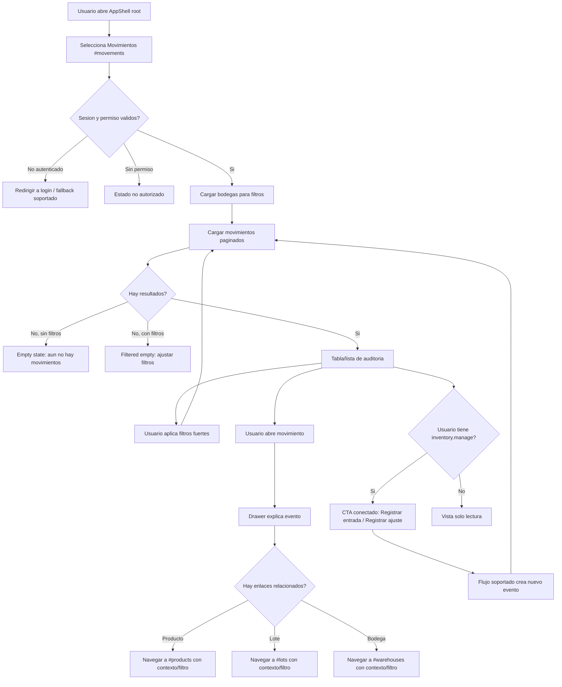

# Vista: Movimientos de inventario

## Estado del documento
- Autor de consolidación UX/UI: `senior-ux-ui-designer-961859`
- Coordinación: `planning-agent-c2c92b`
- Estado: borrador listo para revisión de producto/desarrollo.
- Alcance: especificación UX/UI para la futura vista moderna `#movements` dentro del AppShell root.
- Tipo de entrega: especificación funcional, visual y de interacción. No incluye implementación.
- Enfoque de producto: vista de auditoría e historial operativo de inventario. No es un dashboard estadístico principal ni una superficie de edición histórica.
- Nota de honestidad contractual: no se deben inventar endpoints de edición, eliminación, reversa o transferencia de movimientos. Las acciones de creación, si aparecen, deben navegar a flujos conectados soportados como entradas o ajustes, nunca modificar eventos históricos.

## Fuentes utilizadas
Se encontró y revisó `docs/ui-guidelines.md`. Esta especificación se apoya en fuentes verificadas del repositorio y en el contexto runtime entregado:
- `docs/ui-guidelines.md`
- `docs/vistas/inventory-view-spec.md`
- `docs/vistas/lots-view-spec.md`
- `docs/vistas/warehouses-view-spec.md`
- `docs/runtime-endpoint-catalog.md`
- `docs/openapi/runtime-baseline.openapi.json`
- `docs/architecture.md`
- `docs/current-state.md`
- `src/routes/inventory.routes.js`
- `src/services/inventory.service.js`
- `src/repositories/inventory.repository.js`
- `prisma/migrations/20260526173957_init/migration.sql`
- `prisma/migrations/20260629000000_inventory_warehouse_lot_ledger/migration.sql`

## Alineación con `ui-guidelines.md`
La implementación de `#movements` debe respetar:
- Fetch autenticado con `credentials: 'same-origin'` y helpers compartidos cuando existan.
- No persistir bearer tokens, IDs de tenant ni filtros sensibles en storage público.
- Validar sesión y permisos efectivos al cargar; ocultar acciones sin permiso solo como mejora UX.
- Consumir únicamente endpoints montados/verificados o documentar dependencias antes de activar una capacidad.
- Mostrar errores visibles y recuperables para red, autorización, respuestas no JSON o estados degradados.
- Mantener la superficie dentro de `root/*`/AppShell administrativo, sin mezclarla con pantallas operativas `warehouse/*`.
- Documentar permisos esperados, endpoints consumidos, contrato de sesión, estados y reglas responsive.

# Análisis

## Contexto actual verificado
- Ruta SPA planificada: `#movements`.
- El AppShell root ya contempla `#movements` como entrada pendiente del contexto administrativo.
- `GET /api/inventory/movements` existe, está montado en `src/routes/inventory.routes.js` y soporta paginación mediante `parsePaginationQuery(req.query)`.
- `GET /api/inventory/movements` acepta filtros backend verificados por:
  - `warehouseId`
  - `productId`
  - `lotId`
- La respuesta de movimientos incluye relaciones verificadas en repositorio:
  - `product: true`
  - `lot: true`
  - `warehouse: true`
  - `user: { id, fullName, username }`
- Los campos de movimiento evidenciados por migraciones incluyen, entre otros:
  - `id`
  - `companyId`
  - `warehouseId`
  - `productId`
  - `lotId` opcional
  - `movementType`
  - `quantity`
  - `quantityBefore` opcional
  - `quantityAfter` opcional
  - `sourceType` opcional
  - `sourceId` opcional
  - `reasonCode`
  - `movementGroupId` opcional
  - `note` opcional
  - `userId` opcional
  - `createdAt`
- `GET /api/inventory/stocks` existe, pero `#movements` no debe duplicar el rol de estado actual de `Stocks`/`Lotes`.
- `POST /api/inventory/entries` existe y puede tratarse como flujo conectado para registrar una entrada nueva.
- `POST /api/inventory/adjustments` existe y puede tratarse como flujo conectado para registrar un ajuste nuevo.
- `GET /api/warehouses/company` existe y puede enriquecer filtros/etiquetas de bodega.
- Existen endpoints de alertas de inventario, pero no son la superficie primaria de esta vista; solo deben aparecer como contexto si el movimiento trae una relación o referencia verificable.
- El agregado de producto incluye `category`, `subcategory`, `warehouseStocks`, `warehouseLotStocks`; Movements puede enlazar a producto/lote/bodega cuando estos datos existan en el payload, sin inventar campos.

## Objetivo de la vista
Permitir revisar, filtrar y entender el historial audit-oriented de eventos de inventario: qué cambió, cuándo ocurrió, quién lo registró, sobre qué producto/lote/bodega impactó y qué operación o referencia lo originó.

## Objetivo del usuario
- Encontrar rápidamente eventos históricos de inventario por producto, lote, bodega, actor o referencia visible.
- Entender el impacto de cada movimiento con antes/después cuando el backend lo entregue.
- Ver el origen operacional del evento mediante `sourceType`, `sourceId`, `reasonCode`, nota y grupo de movimiento cuando existan.
- Abrir un detalle lateral sin perder el contexto del listado paginado.
- Navegar a vistas relacionadas de Producto, Lote o Bodega cuando existan IDs suficientes.
- Iniciar flujos conectados de `Registrar entrada` o `Registrar ajuste` si tiene permiso, dejando claro que no editan el historial.

## Objetivo del negocio
- Mejorar trazabilidad y control interno sobre cambios de inventario.
- Reducir tiempo de investigación ante diferencias de stock, reclamos o auditorías.
- Separar claramente estado actual (`Lotes`/`Stocks`) de historia de eventos (`Movimientos`).
- Proteger integridad del ledger evitando edición o eliminación visual de eventos históricos no soportada por backend.
- Dar una base operable para auditoría sin convertir la pantalla en BI pesado.

## Casos de uso principales
1. Auditor interno busca movimientos de un producto en una bodega durante una investigación operacional.
2. Responsable de inventario filtra por lote para entender la secuencia de entradas, reservas, liberaciones o ajustes registrados.
3. Supervisor revisa quién registró un ajuste y qué referencia/razón lo originó.
4. Usuario de lectura abre el detalle de un movimiento para explicar el cambio de cantidad.
5. Usuario con `inventory.manage` inicia un flujo conectado para registrar entrada o ajuste nuevo.
6. Usuario navega desde un movimiento hacia `#products`, `#lots` o `#warehouses` para revisar contexto actual.

## Riesgos UX
- Presentar la vista como dashboard estadístico y ocultar el objetivo de auditoría.
- Confundir `Movimientos` con `Lotes`: Lotes muestra estado actual/trazabilidad de stock-lote; Movimientos muestra historial/eventos.
- Prometer acciones no soportadas: editar, eliminar, revertir, transferir o corregir un movimiento histórico.
- Mostrar KPIs como totales oficiales si solo se calculan desde la página actual.
- Sobrecargar la tabla con demasiados datos técnicos; el detalle debe absorber explicación extensa.
- Hacer búsquedas locales que parezcan globales cuando el backend solo filtra por IDs y paginación.
- Usar colores azules/índigo ajenos a la familia visual actual; la vista debe mantener primario `#16A34A`.

## Alcance MVP
### Incluye
- Entrada SPA `#movements` dentro del AppShell root.
- Listado paginado de movimientos usando `GET /api/inventory/movements`.
- Filtros backend verificados por `warehouseId`, `productId` y `lotId`.
- Filtros UI complementarios, honestamente marcados como locales si solo operan sobre datos cargados: tipo de movimiento, actor visible, razón, referencia y rango rápido de fecha si el endpoint no lo soporta.
- Consulta de bodegas con `GET /api/warehouses/company` para selector de bodega y nombres legibles.
- Tabla/lista de auditoría con orden descendente por evento más reciente, coherente con backend (`id desc`).
- Drawer/panel de detalle para explicar claramente el evento.
- KPIs ligeros y contextuales, subordinados a la auditoría.
- Navegación cruzada a Producto, Lote y Bodega cuando existan datos/IDs.
- CTAs conectados `Registrar entrada` y `Registrar ajuste` solo para usuarios con `inventory.manage` y como navegación a flujos soportados.

### No incluye en esta fase
- Edición de movimientos históricos.
- Eliminación o archivado de movimientos.
- Reversar movimientos desde la tabla o detalle.
- Transferencias entre bodegas si no existe contrato verificado.
- BI avanzado, gráficos de tendencia complejos, forecast o conciliación contable.
- Exportación regulatoria firmada o descarga masiva si no se define contrato específico.
- Búsqueda global server-side por texto si el endpoint no la soporta.
- Crear o editar producto, lote o bodega desde esta vista.
- Resolver alertas desde esta vista como acción primaria.

## Contrato backend verificado
| Capability UI | Endpoint verificado | Permisos observados | Uso en `#movements` | Restricción |
|---|---|---|---|---|
| Listar movimientos | `GET /api/inventory/movements` | `inventory.view`, `inventory.manage` | Fuente principal del historial paginado | No provee edición/reversa/eliminación |
| Filtro por bodega | `GET /api/inventory/movements?warehouseId=...` | `inventory.view`, `inventory.manage` | Filtrado server-side principal | Requiere ID de bodega válido |
| Filtro por producto | `GET /api/inventory/movements?productId=...` | `inventory.view`, `inventory.manage` | Filtrado server-side desde navegación o selector | No inventar búsqueda textual si no existe |
| Filtro por lote | `GET /api/inventory/movements?lotId=...` | `inventory.view`, `inventory.manage` | Filtrado server-side desde `#lots` o detalle | Solo si hay `lotId` verificable |
| Bodegas | `GET /api/warehouses/company` | `inventory.view`, `inventory.manage` | Enriquecer filtro y etiquetas | No modifica movimientos |
| Stocks | `GET /api/inventory/stocks` | `inventory.view`, `inventory.manage` | Contexto opcional de estado actual en enlaces/drawer | No duplicar rol de Lotes/Stocks |
| Registrar entrada | `POST /api/inventory/entries` | `inventory.manage` | Flujo conectado para crear nuevo evento de entrada | No edita historial existente |
| Registrar ajuste | `POST /api/inventory/adjustments` | `inventory.manage` | Flujo conectado para crear nuevo evento de ajuste | No es reversa de movimiento histórico |
| Alertas | `GET /api/inventory/alerts` y relacionados | `inventory.view`, `inventory.manage`, `inventory.qa.manage` | Contexto secundario si hay relación verificable | No superficie primaria |

## Permisos y actores
### Actores principales
- **Administrador de compañía / inventario**: consulta historial, filtra, abre detalle e inicia entradas/ajustes si tiene `inventory.manage`.
- **Supervisor de inventario**: revisa eventos por bodega/producto/lote, identifica responsable y origen.
- **Auditor interno o usuario de lectura**: consulta movimientos con `inventory.view`, sin acciones de creación.
- **Encargado QA**: puede necesitar contexto de movimientos, pero esta vista no reemplaza el flujo QA de lotes.

### Reglas de permiso UI
- Carga/listado: requiere `inventory.view` o `inventory.manage` según política observada.
- Acciones `Registrar entrada` y `Registrar ajuste`: mostrar solo con `inventory.manage`.
- No mostrar acciones de edición, borrado, reversa ni transferencia aunque el usuario tenga permisos amplios, porque no hay contrato verificado.
- Si el backend responde `403`, mostrar estado no autorizado y orientar a solicitar permisos.

## Preguntas abiertas para producto/desarrollo
- ¿Se habilitará filtro server-side por fecha, tipo de movimiento, `reasonCode`, `sourceType` o usuario en una fase posterior?
- ¿Existirá una ruta de detalle de producto/lote/bodega que acepte parámetros desde el AppShell, o solo navegación al listado con filtro sugerido?
- ¿El formato paginado estándar devuelve `items`, `totalItems`, `page`, `pageSize` y metadatos equivalentes en todos los ambientes?
- ¿Se permitirá exportación auditada en V2? Si sí, debe definirse endpoint y permisos antes de diseñar CTA.

# Flujo UX



# Wireframe

## Desktop / tablet horizontal

```text
┌──────────────────────────────────────────────────────────────────────────────┐
│ AppShell root                                                                │
├───────────────┬──────────────────────────────────────────────────────────────┤
│ Sidebar       │ Movimientos de inventario                         [Entrada] │
│ Inventario    │ Historial auditado de eventos de stock             [Ajuste] │
│  Bodegas      │                                                              │
│  Productos    │ [KPI Mov. visibles] [KPI Entradas] [KPI Ajustes] [Ultimo ev.]│
│  Lotes        │                                                              │
│ >Movimientos  │ ┌──────────────────────────────────────────────────────────┐ │
│               │ │ Buscar en resultados cargados...                         │ │
│               │ │ Bodega [Todas v] Producto [ID/filtro] Lote [ID/filtro]   │ │
│               │ │ Tipo [Todos v] Fecha [Local/si soporta] [Limpiar]        │ │
│               │ └──────────────────────────────────────────────────────────┘ │
│               │                                                              │
│               │ ┌──────────────────────────────────────────────────────────┐ │
│               │ │ Fecha/hora │ Evento │ Producto │ Lote │ Bodega │ Actor │ │
│               │ │ 2026-..   │ + IN   │ Envase A │ L-01 │ Central│ Ana   │ │
│               │ │            │ Antes 10 -> Despues 25  Ref: entrada #123  │ │
│               │ │ 2026-..   │ ADJ    │ Tapa B   │ —    │ Norte  │ Luis  │ │
│               │ └──────────────────────────────────────────────────────────┘ │
│               │                         < Anterior  Página 1 de N  Siguiente>│
├───────────────┴──────────────────────────────────────────────────────────────┤
│ Drawer al seleccionar movimiento                                             │
│ ┌──────────────────────────────────────────────────────────────────────────┐ │
│ │ Movimiento #987                         [Cerrar]                         │ │
│ │ Qué cambió: Ajuste manual de +5 unidades                                  │ │
│ │ Cuándo: 2026-06-29 10:45                                                  │ │
│ │ Quién: Ana Gómez (@agomez)                                                 │ │
│ │ Producto: Envase A [Ver producto]                                          │ │
│ │ Lote: L-01 [Ver lote]                                                      │ │
│ │ Bodega: Central [Ver bodega]                                               │ │
│ │ Cantidad: antes 10 → después 15                                            │ │
│ │ Operación/ref.: manual_adjustment · sourceId 123 · reason MANUAL_ADJUSTMENT│ │
│ │ Nota: Corrección por conteo físico                                         │ │
│ └──────────────────────────────────────────────────────────────────────────┘ │
└──────────────────────────────────────────────────────────────────────────────┘
```

## Mobile first

```text
┌──────────────────────────────┐
│ Movimientos                  │
│ Historial de inventario      │
│ [Entrada] [Ajuste]           │
├──────────────────────────────┤
│ Mov. visibles 24  Ultimo 10m │
├──────────────────────────────┤
│ Buscar...                    │
│ [Filtros] Bodega: Todas      │
├──────────────────────────────┤
│ 10:45  Ajuste +5             │
│ Envase A · Lote L-01         │
│ Bodega Central · Ana Gómez   │
│ Antes 10 → Después 15        │
│ Ref: MANUAL_ADJUSTMENT       │
├──────────────────────────────┤
│ 09:10  Entrada +20           │
│ Tapa B · Sin lote visible    │
│ Bodega Norte · Sistema       │
│ [Ver detalle]                │
├──────────────────────────────┤
│ < Ant.      Página 1      Sig.│
└──────────────────────────────┘
```

# Diseño Visual

## Principios UX
- **Auditoría primero**: la jerarquía visual debe iniciar por evento, tiempo, actor y entidades afectadas.
- **Filtros fuertes**: bodega, producto y lote deben estar siempre accesibles; son la forma principal de investigación.
- **Explicabilidad**: cada detalle debe responder: qué cambió, cuándo, quién, dónde, sobre qué producto/lote y por qué referencia.
- **Solo lectura histórica**: los eventos se muestran como registros inmutables.
- **Consistencia AppShell**: seguir patrones visuales actuales de vistas root, no introducir Material Design 3.
- **Mobile first**: en pantallas pequeñas usar tarjetas densas y drawer como bottom sheet o vista apilada.
- **Accesibilidad WCAG**: contraste AA, foco visible, labels explícitos y navegación por teclado.

## Colores
- Primario compartido de familia: `#16A34A` para CTA principal, foco y acentos activos.
- Verde suave para fondos de énfasis positivo: `#DCFCE7` / texto `#166534`.
- Neutros: texto principal `#111827`, secundario `#6B7280`, bordes `#E5E7EB`, fondo app `#F9FAFB`, superficie `#FFFFFF`.
- Advertencia/ajuste: ámbar `#D97706` con fondo `#FEF3C7` para movimientos de ajuste o información que requiere atención.
- Salida/reserva negativa: rojo controlado `#DC2626` con fondo `#FEE2E2`, evitando alarmismo si es operación normal.
- Información secundaria: gris/teal discreto, no azul/índigo dominante.

## Tipografía
- Usar la tipografía existente del AppShell.
- Título de página: 24-28 px desktop, 20-22 px mobile, peso 700.
- Subtítulo/descripción: 14-15 px, peso 400, color secundario.
- Tabla: 13-14 px, números tabulares si están disponibles.
- Badges de evento: 12 px, peso 600, con texto claro (`Entrada`, `Salida`, `Ajuste`, `Reserva`, `Liberación`).

## Espaciado y layout
- Mobile first con padding 16 px.
- Desktop con padding 24 px y max-width fluido dentro del AppShell.
- Cards/KPIs con radio 14-16 px y borde neutro.
- Filtros en contenedor sticky opcional bajo header en desktop si la tabla crece.
- Drawer de detalle: 420-520 px de ancho en desktop; bottom sheet o pantalla completa en mobile.

## Componentes reutilizables
- `PageHeader`: título, descripción y acciones conectadas.
- `AuditKpiCard`: KPI liviano con etiqueta de alcance (`página actual` / `filtro actual`).
- `FilterBar`: búsqueda local, select de bodega, productoId, lotId, tipo, limpiar.
- `MovementTypeBadge`: semántica de tipo de movimiento.
- `MovementTable`: tabla paginada desktop.
- `MovementCardList`: lista de tarjetas mobile.
- `MovementDetailDrawer`: explicación del evento.
- `EntityLink`: link a producto/lote/bodega solo cuando hay ID/dato verificable.
- `StateBlock`: loading, empty, error, unauthorized, degraded.

# Recomendaciones

## Estructura de pantalla
1. **Header de página**
   - Título: `Movimientos de inventario`.
   - Subtítulo: `Historial auditado de entradas, ajustes y cambios de stock.`
   - Acción primaria opcional: `Registrar entrada` si `inventory.manage`.
   - Acción secundaria opcional: `Registrar ajuste` si `inventory.manage`.
   - Copy auxiliar bajo acciones: `Estas acciones crean nuevos eventos; no modifican movimientos históricos.`

2. **KPIs ligeros/contextuales**
   - `Movimientos visibles`: cantidad de items visibles o total paginado si la respuesta lo provee.
   - `Entradas en resultados`: conteo contextual de `movementType = IN` sobre página/filtro cargado.
   - `Ajustes en resultados`: conteo contextual de `movementType = ADJUSTMENT` sobre página/filtro cargado.
   - `Último evento`: fecha/hora del primer item si el orden es descendente.
   - Deben llevar etiqueta de alcance: `según filtro actual` o `página actual` si no hay total global por tipo.

3. **Filtros y búsqueda**
   - Filtro de bodega con datos de `GET /api/warehouses/company`.
   - Producto: campo por ID/contexto recibido desde navegación; si no hay endpoint de autocomplete verificado, no prometer búsqueda server-side por nombre.
   - Lote: campo por ID/contexto recibido desde `#lots`; si el payload trae lot number, permitir búsqueda local sobre datos cargados.
   - Tipo de movimiento: filtro local sobre página cargada si el backend no lo soporta.
   - Rango de fecha: puede existir como UI local/degradada únicamente si se comunica su alcance; idealmente esperar soporte backend para auditoría real.
   - Botón `Limpiar filtros` visible.

4. **Tabla/lista de auditoría**
   - Columnas desktop recomendadas:
     - Fecha/hora
     - Evento/tipo
     - Producto
     - Lote
     - Bodega
     - Cantidad/cambio
     - Actor
     - Referencia
   - Acciones por fila:
     - `Ver detalle` / click de fila.
     - No incluir menú de editar/eliminar/revertir.
   - Paginación visible al final y, si la tabla es larga, resumen superior: `Mostrando X-Y de Z` cuando exista metadato.

5. **Drawer de detalle**
   - Título: `Movimiento #ID`.
   - Bloques explicativos:
     - `Qué cambió`: tipo, signo, cantidad y antes/después si existe.
     - `Cuándo`: `createdAt` formateado.
     - `Quién`: `user.fullName` o `user.username`; fallback `Usuario no disponible`.
     - `Dónde`: bodega.
     - `Producto/Lote`: links si existen.
     - `Operación o referencia`: `sourceType`, `sourceId`, `reasonCode`, `movementGroupId`.
     - `Nota`: mostrar solo si existe.
   - CTA de cierre claro y soporte `Esc`.

## Copy guidance
- Usar lenguaje de auditoría: `evento`, `historial`, `registro`, `referencia`, `actor`, `origen`.
- Evitar lenguaje de edición: no usar `corregir movimiento`, `borrar`, `deshacer`, `revertir`.
- Para CTAs conectados:
  - `Registrar entrada`.
  - `Registrar ajuste`.
  - Texto de ayuda: `Creará un nuevo movimiento en el historial.`
- Para filtros locales: `Busca dentro de los resultados cargados`.
- Para datos faltantes: `No informado` o `Sin dato disponible`, no `N/A` como etiqueta principal.

## Estados
- **Loading inicial**: skeleton de KPIs, filtros deshabilitados y 6 filas skeleton.
- **Loading por filtro/paginación**: mantener tabla anterior atenuada y mostrar indicador no bloqueante.
- **Empty sin datos**: `Aún no hay movimientos de inventario registrados.` CTA conectado a entrada/ajuste solo si tiene permiso.
- **Empty filtrado**: `No encontramos movimientos con estos filtros.` Acciones: `Limpiar filtros`, revisar bodega/producto/lote.
- **Error de red/servidor**: mensaje visible con `Reintentar`; no ocultar tabla rota.
- **Unauthorized 403**: `No tienes permiso para ver movimientos de inventario.` Indicar permiso requerido de forma operable.
- **Degradado**: si bodegas no carga pero movimientos sí, permitir lista y mostrar `Los nombres/filtros de bodega pueden estar incompletos`.
- **Datos parciales**: si `quantityBefore/quantityAfter`, usuario o lote no vienen, mostrar fallback explícito sin bloquear.

## Responsive guidance
- `>=1024 px`: tabla completa, filtros en una o dos filas, drawer lateral.
- `768-1023 px`: tabla con columnas críticas y algunas columnas colapsadas en segunda línea.
- `<768 px`: tarjetas por movimiento; filtros en panel colapsable; detalle como bottom sheet o vista completa.
- Mantener CTAs principales visibles pero no dominantes; en mobile pueden ir en menú de acciones si compiten con filtros.
- Touch targets mínimos 44 px.

## Distinción explícita frente a Lotes
- `Lotes (#lots)`: responde `¿cuál es el estado actual del lote/stock-lote?`, vencimiento, QA, disponibilidad y ubicación actual.
- `Movimientos (#movements)`: responde `¿qué eventos ocurrieron y quién los registró?`, secuencia histórica, referencia operacional y cambios de cantidad.
- Desde Lotes se puede navegar a Movimientos con `lotId`; desde Movimientos se puede volver a Lotes para revisar estado actual si existe lote.
- No mostrar en Movimientos paneles extensos de QA/vencimiento propios de Lotes, salvo como contexto secundario enlazable.

## Coherencia de navegación/sidebar
La IA del grupo inventario debe mantenerse coherente:
1. `Bodegas` (`#warehouses`) = estructura/configuración.
2. `Productos` (`#products`) = catálogo y visibilidad de inventario.
3. `Lotes` (`#lots`) = estado actual y trazabilidad por lote.
4. `Movimientos` (`#movements`) = auditoría/historial de eventos.

Si el sidebar agrupa inventario, `Movimientos` debe aparecer junto a esas vistas y no bajo reportes/BI para evitar posicionarlo como dashboard estadístico.

# Especificaciones para Desarrollo

## Modelo normalizado recomendado para UI
Normalizar cada item recibido desde `GET /api/inventory/movements` a un objeto de presentación sin inventar datos:
- `id`
- `createdAt`
- `movementType`
- `quantity`
- `quantityBefore` opcional
- `quantityAfter` opcional
- `reasonCode`
- `sourceType` opcional
- `sourceId` opcional
- `movementGroupId` opcional
- `note` opcional
- `productId`, `productName`, `productCode` si vienen en `product`
- `lotId`, `lotNumber` si vienen en `lot`
- `warehouseId`, `warehouseName` si vienen en `warehouse`
- `actorName`, `actorUsername` si viene `user`

## Fetch y sesión
- Usar `credentials: 'same-origin'`.
- Reutilizar helpers compartidos de auth/fetch si existen en `src/public/shared/*` o `src/public/root/*.shared.js`.
- Manejar parse defensivo de JSON y errores HTTP.
- No almacenar tokens ni datos sensibles.

## Requests MVP
- Carga inicial:
  - `GET /api/warehouses/company`
  - `GET /api/inventory/movements?page=1&pageSize=<valor>` o convención paginada vigente.
- Filtros server-side:
  - `warehouseId`
  - `productId`
  - `lotId`
- Al cambiar filtro server-side, reiniciar a página 1.
- Debounce para filtros locales de búsqueda: 250-350 ms.

## Restricciones explícitas de capacidades no soportadas
- No implementar botones ni menús para `Editar movimiento`.
- No implementar `Eliminar movimiento`.
- No implementar `Revertir movimiento`.
- No implementar `Transferir` desde esta vista.
- No simular actualización histórica con cambios locales.
- No hacer POST/PATCH/DELETE contra rutas no verificadas.
- No presentar alertas como módulo principal de esta vista.
- No prometer exportación hasta contar con endpoint y permisos.

## Accesibilidad
- Tabla con encabezados semánticos y labels claros.
- Cada filtro debe tener label visible o `aria-label` equivalente.
- Badges no deben depender solo del color; incluir texto.
- Drawer debe atrapar foco, cerrarse con `Esc` y devolver foco a la fila origen.
- Contraste mínimo AA.
- Estados de error anunciables por tecnología asistiva.

## Criterios de aceptación UX
- La primera pantalla comunica claramente que es historial/auditoría, no dashboard BI.
- Un usuario puede responder en menos de 2 clics: qué cambió, cuándo, quién, producto/lote/bodega y referencia.
- Los filtros por bodega/producto/lote usan contrato verificado y actualizan resultados paginados.
- El detalle nunca ofrece editar, borrar ni revertir.
- CTAs de entrada/ajuste se muestran solo como creación de nuevos eventos y solo con permisos.
- Mobile permite revisar movimientos y abrir detalle sin scroll horizontal obligatorio.
- Si faltan datos relacionados, la UI lo expresa con fallback claro y no rompe la vista.
