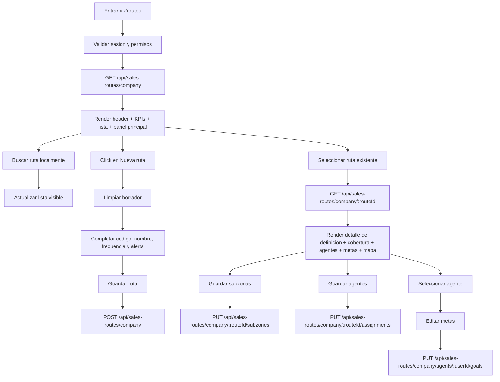

# Vista: Rutas comerciales

## Estado del documento
- Autor de consolidación: `sdd-planning-agent-e62277`
- Referencia de criterio UX/UI: `senior-ux-ui-designer-unpinned` (aplicado como guía conceptual; no se ejecutó un agente externo en esta sesión)
- Estado: listo para revisión de desarrollo/producto
- Alcance: especificación UX/UI para la futura vista `#routes` dentro de `/root/`

## Fuentes utilizadas
Este documento se apoya en fuentes verificadas del repositorio y en la UI legacy preservada:
- `docs/ui-guidelines.md`
- `docs/current-state.md`
- `docs/architecture.md`
- `docs/runtime-endpoint-catalog.md`
- `src/routes/sales-route.routes.js`
- `src/services/sales-route.service.js`
- `src/repositories/sales-route.repository.js`
- `src/routes/region.routes.js`
- `src/security/access-policy-registry.js`
- `src/security/role-bundles.config.js`
- `legacy-public-runtime/root/routes.html`
- `legacy-public-runtime/root/routes.js`
- `legacy-public-runtime/root/routes.shared.js`

## Contexto actual verificado
- En el AppShell actual de `/root/`, la ruta `#routes` existe en el manifiesto pero hoy cae en la vista neutral `in_process` (`docs/current-state.md`, `docs/architecture.md`).
- El backend sí expone contratos reales para listar rutas de compañía, crear, ver detalle, editar, actualizar subzonas, actualizar asignaciones de agentes y actualizar metas por agente (`src/routes/sales-route.routes.js`).
- La autorización actual para esta superficie está restringida a `admin` y `sales_supervisor` (`src/security/access-policy-registry.js`).
- La UI legacy preservada en `legacy-public-runtime/root/routes.*` ya muestra una consola compuesta por lista lateral, definición de ruta, cobertura, asignaciones, metas y mapa. Esa referencia es útil, pero no debe copiarse literalmente; debe adaptarse al AppShell root actual y a las guías de UI vigentes.

## Objetivo de la vista
Permitir a usuarios administrativos y supervisores comerciales gestionar rutas de venta de la compañía desde el shell moderno, con un flujo claro para:
- consultar rutas existentes
- crear o editar definición básica de la ruta
- asignar cobertura territorial por subzonas
- asignar agentes elegibles
- revisar metas comerciales por agente
- visualizar cobertura en tiendas y mapa

## Objetivo del usuario
- Entender rápidamente cuántas rutas, subzonas, tiendas y agentes están cubiertos.
- Crear una nueva ruta sin salir del shell.
- Saber qué subzonas pertenecen a cada ruta y evitar conflictos.
- Ver qué agentes están formalmente asignados a cada ruta.
- Consultar la cobertura real de tiendas y su geografía.
- Administrar metas comerciales de agentes sin perder el contexto de operación.

## Objetivo del negocio
- Formalizar la relación entre territorio, rutas y agentes.
- Evitar superposición de subzonas entre rutas.
- Dar trazabilidad básica a la cobertura comercial de la compañía.
- Preparar una base operativa para workspace del agente, metas y visitas sin rediseñar contratos existentes.

## Alcance MVP
### Incluye
- Listado de rutas de la compañía.
- Búsqueda local por código o nombre.
- KPIs soportados por datos verificables.
- Creación de ruta.
- Edición de definición básica de ruta.
- Asignación de subzonas a una ruta.
- Asignación de agentes elegibles a una ruta.
- Administración de metas por agente elegible.
- Visualización de tiendas cubiertas por la ruta.
- Visualización de mapa con tiendas que tengan coordenadas.
- Estados UX: loading, empty, error, success, disabled, saving.
- Responsive desktop/tablet/mobile.

### No incluye en esta fase
- Optimización automática de recorrido.
- Secuenciación de visitas o agenda diaria.
- Drag-and-drop geográfico de cobertura.
- Edición masiva multi-ruta simultánea.
- Reasignación automática por carga de trabajo.
- Historial de cambios por ruta.
- Analítica avanzada de productividad por ruta.
- Paginación visual compleja.

## Decisiones cerradas para desarrollo
### Endpoint canónico
- La vista nueva debe usar `GET /api/sales-routes/company` como endpoint canónico de overview.
- La creación debe usar `POST /api/sales-routes/company`.
- El detalle debe usar `GET /api/sales-routes/company/:routeId`.
- La edición básica debe usar `PUT /api/sales-routes/company/:routeId`.

### Estrategia de carga para MVP
- El MVP arranca con una **carga completa del overview** usando `GET /api/sales-routes/company`.
- La búsqueda de rutas en el panel lateral es local sobre ese dataset.
- No se introduce paginación visual en día uno.
- Si la cantidad de rutas, subzonas o tiendas cargadas produce degradación perceptible, debe abrirse un cambio de alcance explícito para V2 antes de introducir virtualización o nuevas estrategias de carga.

### Semántica de estado de ruta
- No existe endpoint dedicado de borrado de rutas en el baseline inspeccionado.
- La ruta puede persistir con `isActive` mediante el endpoint de actualización.
- Por lo tanto, la UI MVP no debe prometer `Eliminar ruta`.
- La acción de `Desactivar ruta` queda pospuesta fuera del MVP hasta cerrar reglas de negocio adicionales.
- Si se expone en una fase posterior, el copy recomendado es `Marcar inactiva` o `Desactivar ruta`, nunca `Eliminar`.
- En V1, `isActive` debe tratarse como dato informativo de solo lectura si llega en el contrato.
- Si el equipo considera que el badge `Activa/Inactiva` no aporta valor real en esta fase, puede omitirse del listado V1; si se mantiene, debe entenderse como estado observacional, no accionable.

### Cobertura territorial
- Cada subzona debe pertenecer a una sola ruta.
- La UI debe tratar esta restricción como regla explícita de negocio, no como detalle oculto del backend.
- El conflicto de subzona ya asignada debe mostrarse con mensaje claro y contextual.
- Aunque el backend expone `DELETE /api/sales-routes/company/:routeId/subzones/:subzoneId`, esa capacidad queda fuera de alcance de la UI MVP.
- En V1, la interacción aprobada para subzonas es únicamente selección local + `Guardar subzonas` mediante `PUT` bulk.

### Elegibilidad de agentes
- No todos los usuarios de la compañía son elegibles para asignación de ruta.
- La vista debe usar solo el conjunto `agents` devuelto por el overview, ya filtrado por backend según elegibilidad operacional del workspace del agente.
- La UI no debe inventar reglas locales adicionales para determinar elegibilidad.

### Metas comerciales
- Las metas no cuelgan del recurso `route` directamente; el guardado real se hace por agente mediante `PUT /api/sales-routes/company/agents/:userId/goals`.
- En la UI, las metas pueden vivir dentro de la vista de rutas por contexto operativo, pero el selector de agente es obligatorio para editar metas.
- No debe sugerirse que las metas son compartidas por toda la ruta; son metas del agente seleccionado.
- El guardado debe tratarse como **replace-all** del arreglo de metas del agente: el frontend debe persistir siempre el set completo que desea conservar, no solo filas modificadas.

### Cobertura y mapa
- El mapa solo debe mostrar tiendas con coordenadas válidas.
- Si una ruta no tiene tiendas con coordenadas, la UI debe comunicarlo como limitación de datos, no como error técnico.
- La tabla de cobertura sí puede mostrar tiendas sin coordenadas.

## Contrato backend verificado
### Endpoints soportados actualmente
- `GET /api/sales-routes/company`
- `POST /api/sales-routes/company`
- `GET /api/sales-routes/company/:routeId`
- `PUT /api/sales-routes/company/:routeId`
- `PUT /api/sales-routes/company/:routeId/subzones`
- `DELETE /api/sales-routes/company/:routeId/subzones/:subzoneId`
- `PUT /api/sales-routes/company/:routeId/assignments`
- `PUT /api/sales-routes/company/agents/:userId/goals`
- `GET /api/regions/company`

### Datos verificables del overview
Según `sales-route.service.js`, la UI puede contar o mostrar con seguridad en el overview:
- `summary.routesCount`
- `summary.subzonesCount`
- `summary.storesCount`
- `summary.assignedAgentsCount`
- `routes[]`
- `zones[]`
- `agents[]`

### Datos verificables por ruta
En cada ruta serializada, la UI puede mostrar con seguridad:
- `id`
- `code`
- `name`
- `visitFrequencyDays`
- `nearLimitDays`
- `isActive`
- `subzonesCount`
- `storesCount`
- `mappedStoresCount`
- `assignmentsCount`
- `subzoneIds`
- `agentIds`
- `subzones[]`
- `agents[]`
- `stores[]`

### Datos verificables por agente elegible
- `id`
- `fullName`
- `username`
- `email`
- `phone`
- `status`
- `role`
- `permissionCodes`
- `assignmentsCount`
- `goalsCount`
- `goals[]`

### Restricciones importantes
No presentar como dato real si no existe soporte verificado en el contrato actual:
- tiempo óptimo de recorrido
- ranking automático de rutas
- estimación de combustible o costo logístico
- orden recomendado de visita por tienda
- productividad calculada por ruta sin métrica backend dedicada
- auditoría histórica detallada de cambios en asignaciones

## Usuarios esperados y permisos UX
### Usuarios con acceso esperado
- `admin` de compañía
- `sales_supervisor`

### Restricciones UX alineadas con backend
- Crear ruta: visible para `admin` y `sales_supervisor`.
- Editar definición, subzonas y asignaciones: visible para `admin` y `sales_supervisor`.
- Guardar metas: visible para `admin` y `sales_supervisor`.
- La UI puede ocultar acciones no disponibles, pero el backend sigue siendo la autoridad final.

## Principios UX de la vista
1. **Territorio primero**: debe ser evidente qué cubre una ruta y qué no.
2. **Una ruta, una cobertura clara**: la vista debe ayudar a evitar ambigüedad territorial.
3. **Asignación operacional visible**: agentes y metas deben entenderse como parte de la operación comercial, no como administración abstracta.
4. **Mapa como apoyo, no como dependencia**: la vista debe seguir siendo útil aunque no haya coordenadas.
5. **Compatibilidad con AppShell**: la experiencia debe sentirse nativa de `#zones` y `#roles_permissions`, no como pantalla legacy embebida.

## Flujo UX general


## Posicionamiento dentro del AppShell
```text
AppShell
├── Sidebar
├── Header shell
└── MainContent
    └── RoutesPage
        ├── PageHeader
        ├── KPIGrid
        ├── RoutesSplitLayout
        │   ├── RoutesListPanel
        │   └── RouteWorkspace
        │       ├── RouteDefinitionCard
        │       ├── RouteCoverageCard
        │       ├── RouteAssignmentsCard
        │       ├── AgentGoalsCard
        │       └── CoverageMapCard
```

## Decisión de navegación recomendada
### Recomendación principal
Implementar `#routes` como una **consola maestra única** dentro del shell, sin obligar a navegar a páginas secundarias para definición, cobertura o metas.

### Rechazo recomendado
No volver a depender de `/root/routes.html`, porque las rutas HTML legacy están fuera del runtime soportado.

## Estructura de la página

## Header de página
### Orden exacto
1. Eyebrow: `OPERACION COMERCIAL`
2. Título: `Rutas comerciales`
3. Subtítulo: `Define cobertura territorial, agentes asignados y metas por agente de la compañía.`
4. Acciones

### Acciones del header
- Secundaria: `Actualizar`
- Primaria: `+ Nueva ruta`

### Reglas
- No colocar `Cerrar sesión` dentro del contenido de la vista.
- El logout sigue en el shell global.
- La CTA primaria debe mantenerse visible arriba del fold en desktop y mobile si es posible.

## KPIs
### KPIs MVP recomendados
Deben derivarse solo de datos verificables del overview:
1. **Rutas activas/visibles**
2. **Subzonas cubiertas**
3. **Tiendas cubiertas**
4. **Agentes asignados**

### KPI opcional
5. **Tiendas mapeadas** solo si se decide incorporar `mappedStoresCount` de forma agregada sin cálculos ambiguos en frontend.

### Card KPI
- Alto mínimo: `104px`
- Padding: `20px`
- Fondo: `#FFFFFF`
- Borde: `1px solid #E2E8F0`
- Radio: `12px`
- Número: `28px` semibold
- Label: `14px`, `#64748B`

## Layout principal
### Recomendación
Usar layout split en desktop:
- columna izquierda fija o semiestable con lista de rutas
- panel principal a la derecha con definición, cobertura, asignaciones, metas y mapa

### Proporción sugerida
- lista izquierda: 28%–32%
- panel principal: 68%–72%

### Tablet y mobile
- En tablet, la lista puede colapsar arriba y el panel principal abajo.
- En mobile, usar secciones apiladas y convertir la lista lateral en bloque superior o drawer contextual.

## Panel lateral: lista de rutas
### Elementos
- título `Rutas`
- contador visible de resultados
- búsqueda local
- lista scrolleable de rutas

### Tarjeta de ruta en lista
Cada item debe mostrar:
- código
- nombre
- resumen corto:
  - subzonas
  - tiendas
  - agentes

### Estado opcional en tarjeta
- El badge `Activa` / `Inactiva` es opcional en V1.
- Si se muestra, debe entenderse como dato de solo lectura.
- Si se omite, no se considera incumplimiento del MVP mientras el resto de la información operativa permanezca visible.

### Acciones
- seleccionar ruta
- no mostrar acciones destructivas inline en el listado

### Empty states
- sin rutas: `Todavía no hay rutas creadas.`
- sin coincidencias: `No hay rutas con ese filtro.`

## Panel principal: definición de ruta
### Objetivo
Editar la definición básica de la ruta seleccionada o capturar una nueva.

### Campos soportados
- Código
- Nombre
- Frecuencia mínima de visita (días)
- Alerta previa (días)
- Estado activo/inactivo solo si se decide exponerlo explícitamente en MVP

### Regla UX
- Si no hay ruta seleccionada, mostrar estado guía: `Seleccione o cree una ruta.`
- El guardado debe sentirse independiente del guardado de subzonas, agentes o metas.

### Copy recomendado
- botón: `Guardar ruta`
- éxito: `Ruta guardada correctamente.`
- error: `No se pudo guardar la ruta.`

## Panel de cobertura territorial
### Objetivo
Asignar subzonas a la ruta actual.

### Fuente de datos
- overview `zones[]`
- cada grupo por región con subzonas seleccionables

### Interacción recomendada
- checkboxes por subzona agrupados por región
- resumen superior del impacto de cobertura seleccionado
- acción principal: `Guardar subzonas`

### Reglas UX críticas
- La UI debe dejar claro que una subzona no puede pertenecer a dos rutas.
- Si el backend devuelve conflicto, mostrar el nombre de la subzona y la ruta en conflicto si viene en el mensaje.
- Si no existen subzonas en la compañía, mostrar guidance: `Primero debes crear subzonas en Zonas.`

## Panel de agentes asignados
### Objetivo
Asignar formalmente la ruta a agentes elegibles.

### Fuente de datos
- `agents[]` del overview

### Interacción recomendada
- lista de checkboxes o selector multiopción simple
- cada agente con:
  - nombre
  - username
  - rol
- acción principal: `Guardar agentes`

### Regla UX crítica
- La UI no debe listar usuarios no elegibles; debe confiar en la selección ya filtrada por backend.

## Panel de metas comerciales
### Objetivo
Administrar metas del agente seleccionado dentro del contexto de rutas.

### Interacción recomendada
1. seleccionar agente
2. ver metas existentes
3. agregar meta
4. editar valores
5. guardar metas

### Campos por meta
- Título
- Periodo
- Objetivo
- Avance
- Notas

### Reglas UX
- Si no hay agente seleccionado, deshabilitar `Agregar meta` y `Guardar metas`.
- Si el agente no tiene metas, mostrar estado claro invitando a crear la primera.
- La tabla de metas debe evitar parecer una hoja financiera compleja; mantenerla operacional y simple.

## Panel de cobertura y mapa
### Objetivo
Mostrar la huella real de la ruta seleccionada.

### Componentes
- mapa
- tabla de tiendas cubiertas

### Datos por tienda
- Tienda
- Cliente
- Subzona
- Teléfono
- Ubicación

### Reglas UX
- Si no hay ruta seleccionada: `Seleccione una ruta para ver su cobertura.`
- Si no hay tiendas: `Esta ruta aún no cubre tiendas activas.`
- Si no hay coordenadas: `La ruta seleccionada no tiene tiendas con coordenadas registradas.`
- El mapa no debe bloquear el resto de la experiencia si Leaflet no inicializa; la tabla sigue siendo la fuente principal de cobertura.

## Error states
### Error de carga inicial
- Mensaje visible dentro de la vista, no solo toast.
- CTA: `Reintentar`
- Texto sugerido: `No se pudo cargar la consola de rutas.`

### Error de conflicto territorial
- Texto sugerido: `La subzona seleccionada ya pertenece a otra ruta.`
- Si hay detalle disponible, anexarlo: `La subzona X ya pertenece a la ruta Y.`

### Error de elegibilidad de agente
- Texto sugerido: `Solo se pueden asignar agentes elegibles para el workspace comercial.`

### Error de unicidad de código
- Tratar el `409` de código duplicado como error de negocio recuperable.
- Mantener el draft del formulario sin limpiar los campos.
- Señalar visualmente el campo `Código` cuando sea posible.
- Textos sugeridos:
  - creación: `Ya existe una ruta con ese código en la empresa.`
  - edición: `Ya existe otra ruta con ese código en la empresa.`

## Visual design
### Paleta
Alineada a `ui-guidelines.md` y al shell actual:
- Primary: `#16A34A`
- Primary hover: `#15803D`
- Navegación fuerte / títulos: `#0F172A`
- Fondo app: `#F8FAFC`
- Superficie: `#FFFFFF`
- Borde: `#E2E8F0`
- Texto secundario: `#64748B`
- Warning suave: `#F59E0B`
- Danger controlado: `#DC2626`

### Tono visual
- Operacional, administrativo y territorial.
- Debe sentirse más como consola de cobertura comercial que como CRM genérico.
- Mantener densidad media-alta, pero con jerarquía clara entre lista, definición y cobertura.

## Responsive rules
### Desktop
- split layout completo
- lista lateral persistente
- panel principal con cards apiladas

### Tablet
- lista arriba o lateral colapsable
- cards de cobertura y asignaciones en una columna

### Mobile
- lista de rutas arriba
- cards apiladas
- mapa al final
- tablas simplificadas o cards para tiendas si hace falta

## Copy recomendado
### Header
- Título: `Rutas comerciales`
- Subtítulo: `Define cobertura territorial, agentes asignados y metas por agente de la compañía.`

### Botones
- `Actualizar`
- `+ Nueva ruta`
- `Guardar ruta`
- `Guardar subzonas`
- `Guardar agentes`
- `Agregar meta`
- `Guardar metas`
- `Desactivar ruta` si se expone esta acción en MVP

### Mensajes
- `No se pudo cargar la consola de rutas.`
- `Ruta guardada correctamente.`
- `Ya existe una ruta con ese código en la empresa.`
- `Ya existe otra ruta con ese código en la empresa.`
- `Subzonas actualizadas correctamente.`
- `Agentes actualizados correctamente.`
- `Metas actualizadas correctamente.`
- `Seleccione una ruta para continuar.`

## Recomendaciones de implementación técnica
- Crear una vista dedicada en `src/public/root/views/routes-admin.js`.
- Si la vista crece, extraer helpers para:
  - filtros locales de rutas
  - normalización visual de KPIs
  - render de subzonas agrupadas
  - render de asignaciones de agentes
  - tabla editable de metas
  - adaptación de cobertura para mapa y tabla
- Crear adaptador API dedicado (`src/public/root/routes-api.js`) si el view controller supera una complejidad razonable.
- Mantener `#routes` como ruta shell soportada y evitar dependencia de HTML legacy.
- Mantener el draft de metas en frontend como **fuente de verdad completa por agente** mientras el usuario edita.
- El payload de `Guardar metas` debe serializar siempre el arreglo completo visible para el agente seleccionado, incluyendo metas no modificadas que deban conservarse.
- No implementar en V1 una llamada UI directa al `DELETE` individual de subzona; toda persistencia de cobertura debe pasar por el `PUT` bulk aprobado.

## Pruebas mínimas sugeridas para la vista
- route governance de `#routes`
- characterization del split layout y estados empty/error/loading
- characterization de búsqueda local por código/nombre
- prueba de conflicto al guardar subzonas
- prueba de asignación de agentes elegibles
- prueba de edición/guardado de metas por agente
- prueba de render de cobertura con y sin coordenadas
- prueba de degradación funcional cuando el mapa no puede renderizarse

## Criterios de aceptación UX/UI
- La vista permite localizar y seleccionar rutas rápidamente.
- La cobertura territorial de la ruta es entendible sin inspección técnica del backend.
- La asignación de subzonas y agentes se siente clara y controlada.
- Las metas están contextualizadas por agente y no inducen a error sobre su alcance.
- La experiencia sigue siendo útil aunque no existan coordenadas para el mapa.
- El diseño es consistente con `#zones`, `#roles_permissions` y el shell moderno.

## Decisión de diseño
La página de rutas debe verse como una **consola operativa de cobertura comercial**: una lista de rutas a la izquierda y un workspace a la derecha donde el usuario define la ruta, asigna subzonas, vincula agentes, gestiona metas por agente y revisa la cobertura real en tiendas y mapa. Debe tomar lo útil de la UI legacy —resumen, búsqueda, subzonas, agentes, metas y mapa— pero reescrito para el AppShell actual, reforzando claridad territorial, consistencia visual y respeto estricto por las restricciones reales del backend.
