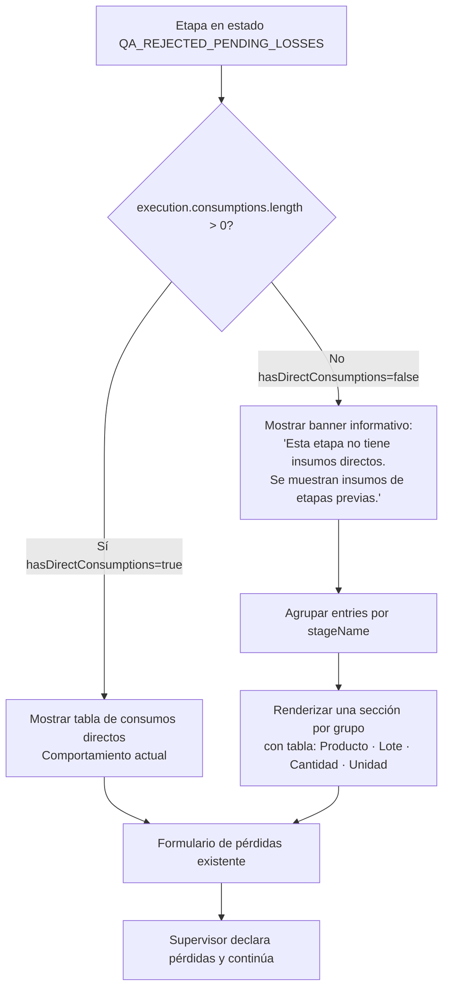
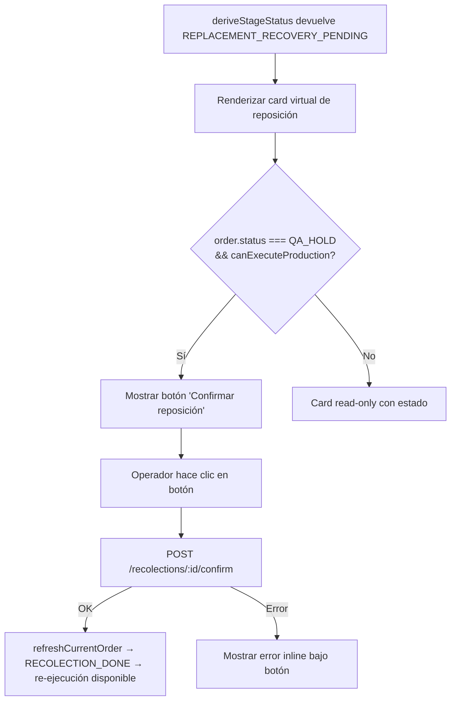
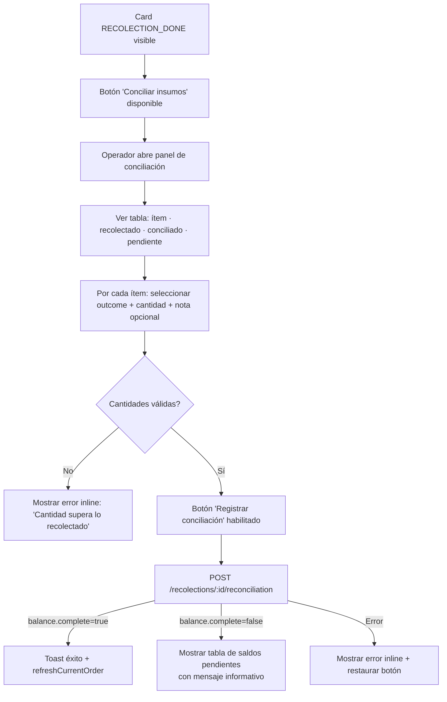
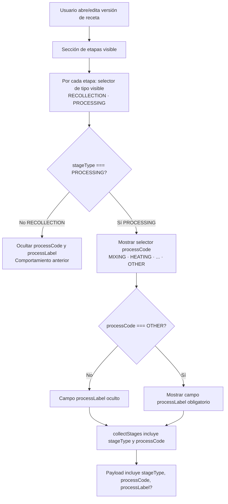

# TASK-007 · qa-rejection-material-reconciliation-amendment
## Especificación UX/UI

**Autor:** senior-ux-ui-designer-unpinned-debf3b  
**Fecha:** 2025  
**Estado:** Pendiente de aprobación  
**Archivos destino:** `production.renderers.js`, `production.renderers.rejection.js`, `production.controllers.rejection.js`, `warehouse-api.js`, `recipes-admin.version-editor.js`, `styles.css`

---

## Paso 0 — ui-guidelines.md

✅ **Encontrado y revisado:** `inventory-api/docs/ui-guidelines.md`

Reglas aplicadas en este documento:

| Regla | Aplicación |
|-------|-----------|
| §2 fetch | `credentials: 'same-origin'` vía `InventoryAuth.fetchJson`. Sin tokens hardcodeados. |
| §3 errores | Mensajes visibles en pantalla. Estado de botón restaurado tras fallo. |
| §4 boundary | UI solo construye payloads y valida experiencia. Backend es autoridad de negocio. |
| §7 helpers | Se reutilizan `escapeHtml`, `wh-alert`, `wh-badge`, `wh-step-section`, `wh-error-msg`. |
| §8 contrato | Endpoints, permisos y mensajes documentados por pantalla. |

**Nota pre-existente encontrada:** `wh-badge--warning` está referenciada en `production.renderers.js` (línea 43) pero **no existe en `styles.css`**. Esta clase debe añadirse como parte de este ticket para que `QA_REJECTED_LOSSES_DONE` se renderice correctamente.

---

## Paso 1 — Preguntas identificadas

Preguntas que el equipo debe responder antes de implementar:

1. **Feature 1 (scope):** ¿El campo `relevantInputScope` viene persistido en el objeto `execution` devuelto por `GET /api/production/orders/:id`, o solo en la respuesta del endpoint de rechazo QA? Si es solo en la respuesta, el controller debe cachearlo por `executionId`.
2. **Feature 3 (reconciliación):** ¿El objeto `recolection` incluye `collectedItems[]` con `{productId, lotId, quantity, unit, productName?}` en el GET de la orden? ¿O se obtienen de otro endpoint?
3. **Feature 3:** ¿El panel de conciliación aparece después de `RECOLECTION_DONE` o también mientras el recolection está pendiente?
4. **Feature 4:** ¿El campo `stageType` en versiones no-DRAFT debe ser read-only en el editor?

**Supuestos documentados para continuar:**

- **S1:** `execution.relevantInputScope` está disponible en el objeto de ejecución devuelto por el GET de la orden. Si no, el controller cacheará la respuesta del rechazo en `Map<executionId, relevantInputScope>`.
- **S2:** El card `REPLACEMENT_RECOVERY_PENDING` usa la misma lista `recolection.requiredItems`.
- **S3:** `recolection.collectedItems[]` está disponible en el objeto `recolection` dentro de `order.recolectionStages[]`.
- **S4:** La reconciliación se activa desde un botón en el card `RECOLECTION_DONE`.
- **S5:** `stageType` y `processCode` son editables solo en versiones DRAFT.

---

# Análisis

## Paso 2 — Definición por feature

### Feature 1 · Scope ampliado de insumos relevantes

| Dimensión | Descripción |
|-----------|-------------|
| **Objetivo del usuario** | El supervisor entiende qué materiales deben evaluarse para pérdidas, aunque la etapa rechazada no tenga consumos propios. |
| **Objetivo del negocio** | Registro de pérdidas completo y auditable, trazando insumos de etapas previas cuando corresponde. |
| **Casos de uso** | UC-1: etapa rechazada sin consumos directos → scope de etapas previas. UC-2: etapa con consumos → tabla actual. |
| **Riesgos UX** | Confusión si el usuario ve insumos de "otras etapas" sin explicación. Scroll largo con muchas etapas. |

### Feature 2 · Card REPLACEMENT_RECOVERY_PENDING

| Dimensión | Descripción |
|-----------|-------------|
| **Objetivo del usuario** | Distinguir claramente "tengo el material disponible" de "necesito conseguir material nuevo". |
| **Objetivo del negocio** | Evitar que el operador confirme disponibilidad cuando en realidad necesita reprocurar materiales. |
| **Casos de uso** | UC-1: ver card con advertencia. UC-2: confirmar reposición cuando material nuevo llega. |
| **Riesgos UX** | Confusión visual entre RECOLECTION_PENDING y REPLACEMENT_RECOVERY_PENDING. |

### Feature 3 · Panel de conciliación

| Dimensión | Descripción |
|-----------|-------------|
| **Objetivo del usuario** | Registrar qué pasó con cada material recolectado: usado, devuelto o descartado. |
| **Objetivo del negocio** | Integridad de inventario post-rechazo. Cierre del ciclo de trazabilidad de materiales. |
| **Casos de uso** | UC-1: ver balance actual. UC-2: asignar outcome+cantidad por ítem. UC-3: ver restante si incompleto. |
| **Riesgos UX** | Cantidades que no cierran el balance. Balance incompleto sin aviso claro. |

### Feature 4 · processCode en recetas

| Dimensión | Descripción |
|-----------|-------------|
| **Objetivo del usuario** | El administrador clasifica cada etapa con su código de proceso de forma guiada. |
| **Objetivo del negocio** | Catálogo de procesos consistente. Trazabilidad por tipo de proceso. |
| **Casos de uso** | UC-1: crear etapa PROCESSING + código. UC-2: código OTHER → campo libre. UC-3: crear RECOLLECTION sin código. UC-4: editar versión existente con valores precargados. |
| **Riesgos UX** | Olvidar processCode cuando es obligatorio. Confusión entre seleccionar OTHER y el campo libre. |

---

# Flujo UX

## Feature 1 · Flujo: Insumos relevantes tras rechazo QA



## Feature 2 · Flujo: REPLACEMENT_RECOVERY_PENDING



## Feature 3 · Flujo: Panel de conciliación



## Feature 4 · Flujo: processCode en editor de etapas



---

# Wireframe

## Feature 1 · Insumos relevantes — sin consumos directos

```
┌─────────────────────────────────────────────────────────────────┐
│ ℹ️  Esta etapa no tiene insumos directos. Se muestran los       │  ← wh-alert wh-alert--info
│     insumos de etapas previas incluidas en el alcance.          │
└─────────────────────────────────────────────────────────────────┘

  Insumos del alcance relevante (estrategia: OPTION_A)
  ┄┄┄┄┄┄┄┄┄┄┄┄┄┄┄┄┄┄┄┄┄┄┄┄┄┄┄┄┄┄┄┄┄┄┄┄┄┄┄┄┄┄┄┄┄┄┄┄┄┄┄

  ▸ Etapa: Recolección  (orden 0)
  ┌───────────────────┬─────────────┬───────────┬────────┐
  │ Producto          │ Lote        │ Cantidad  │ Unidad │
  ├───────────────────┼─────────────┼───────────┼────────┤
  │ Harina de trigo   │ LOT-050     │ 3.000     │ KG     │
  │ Azúcar refinada   │ LOT-023     │ 1.500     │ KG     │
  └───────────────────┴─────────────┴───────────┴────────┘

  ▸ Etapa: Mezclado  (orden 1)
  ┌───────────────────┬─────────────┬───────────┬────────┐
  │ Aceite vegetal    │ LOT-041     │ 0.500     │ L      │
  └───────────────────┴─────────────┴───────────┴────────┘

 ─────────────────────────────────────────────────────────
 Registrar pérdidas del intento fallido
 [Sin consumos directos. El formulario de pérdidas aplica
  sobre los insumos del alcance mostrado arriba si
  corresponde declararlos como perdidos.]

  [ Declarar pérdidas y continuar ]
```

## Feature 2 · Card REPLACEMENT_RECOVERY_PENDING vs RECOLECTION_PENDING

```
── RECOLECTION_PENDING (actual) ───────────────────────────────────
┌─────────────────────────────────────────────────────────────────┐
│ 📦 Recolección de material                                      │
│ Estado: [Recolección — pendiente]  ← badge morado (hold)        │
│                                                                  │
│ Se debe confirmar que el material indicado está disponible       │
│ antes de re-ejecutar la etapa.                                   │
│                                                                  │
│ • Harina de trigo: 3 KG                                         │
│ • Aceite vegetal: 0.5 L                                         │
│                                                                  │
│ [ ✓ Confirmar disponibilidad de material ]                       │
└─────────────────────────────────────────────────────────────────┘

── REPLACEMENT_RECOVERY_PENDING (nuevo) ───────────────────────────
┌─────────────────────────────────────────────────────────────────┐  ← borde izquierdo ámbar
│ 🔄 Reposición de materiales requerida                           │
│ Estado: [Reposición de materiales — pendiente] ← badge ámbar    │
│                                                                  │
│ ⚠️ Los materiales fueron dañados o se perdieron durante el      │
│ proceso. Se requiere conseguir nuevos materiales antes           │
│ de re-ejecutar la etapa.                                         │
│                                                                  │
│ Materiales a reponer:                                            │
│ • Harina de trigo: 3 KG                                         │
│ • Aceite vegetal: 0.5 L                                         │
│                                                                  │
│ [ ✓ Confirmar reposición de materiales ]                         │
└─────────────────────────────────────────────────────────────────┘
```

## Feature 3 · Panel de conciliación

```
Conciliación de insumos recolectados
══════════════════════════════════════════════════════════════════
Estado: Balance incompleto — quedan ítems por conciliar.

┌──────────────┬────────────┬────────────┬────────────┬──────────────────────────┬────────────────────┐
│ Producto     │ Lote       │ Recolectado│ Conciliado │ Destino *                │ Notas              │
├──────────────┼────────────┼────────────┼────────────┼──────────────────────────┼────────────────────┤
│ Harina       │ LOT-050    │ 3.000 KG   │ — KG       │ [▾ Selecciona destino] ▾│ [                ]│
│              │            │            │ [  2.000  ]│  ○ Usado en re-ejecución│                    │
│              │            │            │            │  ○ Devuelto a bodega     │                    │
│              │            │            │            │  ○ Descartado            │                    │
├──────────────┼────────────┼────────────┼────────────┼──────────────────────────┼────────────────────┤
│ Aceite veg.  │ LOT-041    │ 0.500 L    │ — L        │ [▾ Selecciona destino] ▾│ [                ]│
│              │            │            │ [  0.500  ]│                          │                    │
└──────────────┴────────────┴────────────┴────────────┴──────────────────────────┴────────────────────┘

 ⚠️ Saldo pendiente: 1.000 KG de Harina (LOT-050) sin conciliar.

 [ Registrar conciliación ]       ← primary-button, deshabilitado si hay validaciones pendientes
```

## Feature 4 · Editor de etapa de receta — con processCode

```
┌─────────────────────────────────────────────────────────────────┐
│ Etapa de producción                                              │
├─────────────────────────────────────────────────────────────────┤
│ Nombre *           [Mezclado de ingredientes              ]      │
│                                                                  │
│ Tipo de etapa *    ○ Recolección     ● Procesamiento            │
│                                                                  │
│ Código de proceso *                                              │  ← visible solo si PROCESSING
│  [▾ Selecciona código de proceso                           ▾]   │
│  ┌─────────────────────────────────────────────────────────┐   │
│  │ Mezclado (MIXING)                                        │   │
│  │ Calentamiento (HEATING)                                  │   │
│  │ Enfriamiento (COOLING)                                   │   │
│  │ Llenado (FILLING)                                        │   │
│  │ Tapado (CAPPING)                                         │   │
│  │ Sellado (SEALING)                                        │   │
│  │ Etiquetado (LABELING)                                    │   │
│  │ Empaque (PACKAGING)                                      │   │
│  │ Control de calidad (QUALITY_CHECK)                       │   │
│  │ Otro (OTHER)                                             │   │
│  └─────────────────────────────────────────────────────────┘   │
│                                                                  │
│ Descripción del proceso *       ← visible solo si OTHER          │
│  [                                                         ]    │
│  Describe el proceso específico que no está en el catálogo.     │
│                                                                  │
│ ☐ QA obligatorio                                                │
│                                                                  │
│ Instrucciones                                                    │
│  [                                                         ]    │
│                                                                  │
│ Insumos de esta etapa                      [ + Agregar insumo ] │
│  ┌──────────────┬───────────┬──────────┬────────┬───────┐      │
│  │ Producto     │ Nombre *  │ Cantidad │ Unidad │       │      │
│  └──────────────┴───────────┴──────────┴────────┴───────┘      │
│                                                                  │
│ [ Quitar etapa ]                                                 │
└─────────────────────────────────────────────────────────────────┘
```

---

# Diseño Visual

## Sistema de diseño base (verificado en `styles.css`)

| Token | Valor | Uso |
|-------|-------|-----|
| `--wh-pending` | `#d97706` | Texto ámbar (warning leve) |
| `--wh-pending-bg` | `#fffbeb` | Fondo ámbar |
| `--wh-confirmed` | `#16a34a` | Verde confirmado |
| `--wh-rejected` | `#dc2626` | Rojo error/rechazo |
| `--wh-hold` | `#9333ea` | Morado (recolección pendiente) |
| `--wh-accent` | `#0891b2` | Azul cyan (info/acento) |
| `--wh-accent-light` | `#ecfeff` | Fondo info |
| `--border` | `#d0d7de` | Bordes generales |
| `--card` | `#ffffff` | Fondo de card |
| `--text` | `#1f2328` | Texto principal |
| `--muted` | `#57606a` | Texto secundario |

## Mapa de colores por estado (Warehouse)

| Estado | Badge class | Color texto | Color fondo | Semántica |
|--------|-------------|-------------|-------------|-----------|
| `RECOLECTION_PENDING` | `wh-badge--hold` | morado `#9333ea` | `#faf5ff` | Material disponible, confirmar |
| `REPLACEMENT_RECOVERY_PENDING` | `wh-badge--pending` | ámbar `#d97706` | `#fffbeb` | Material dañado, reponer |
| `QA_REJECTED_LOSSES_DONE` | `wh-badge--warning` ⚠️ | naranja `#ea580c` | `#fff7ed` | (clase faltante, ver CSS §) |
| `RECOLECTION_DONE` | `wh-badge--confirmed` | verde | `#f0fdf4` | Completo |

## Distinción visual Feature 2 (card de reposición)

Para diferenciar `REPLACEMENT_RECOVERY_PENDING` de `RECOLECTION_PENDING`:

| Elemento | RECOLECTION_PENDING | REPLACEMENT_RECOVERY_PENDING |
|----------|---------------------|------------------------------|
| Ícono de título | 📦 | 🔄 |
| Badge | `wh-badge--hold` (morado) | `wh-badge--pending` (ámbar) |
| Borde izquierdo card | `3px solid #9333ea` | `3px solid #d97706` |
| Fondo card | blanco | `#fffbeb` (ámbar muy claro) |
| Botón acción | "Confirmar disponibilidad" | "Confirmar reposición" |
| Mensaje | "Material disponible, confirmar" | "Material dañado, reponer" |

## Tipografía y espaciado

- **Títulos de sección:** `font-size: 0.95rem; font-weight: 700` (clase `wh-step-section__title`)
- **Texto meta / captions:** `font-size: 0.8rem; color: var(--muted)` (clase `wh-item-card__meta`)
- **Alertas:** `font-size: 0.875rem; line-height: 1.5`
- **Espaciado interno cards:** `padding: 14px`
- **Gap entre ítems:** `gap: 6px` (card), `gap: 12px` (lista)
- **Border-radius cards:** `10px` (item-card), `8px` (alerts)

---

# Recomendaciones UX

1. **Feature 1 — Contexto explícito:** No mostrar la tabla de scope sin el banner explicativo. El operador de bodega no debe tener que inferir por qué ve insumos de otras etapas.

2. **Feature 1 — Agrupación por etapa:** La agrupación reduce la carga cognitiva vs una lista plana. Usar encabezados de grupo con el nombre de la etapa y su orden.

3. **Feature 2 — Jerarquía visual:** La diferencia entre RECOLECTION y REPLACEMENT_RECOVERY debe ser inmediatamente obvia en un vistazo. El borde de color en el lado izquierdo del card actúa como indicador de categoría (patrón establecido en Material Design).

4. **Feature 2 — Mensaje de advertencia:** El texto debe ser directo y operacional: qué pasó, qué hay que hacer, no términos técnicos como "recovery type".

5. **Feature 3 — Validación progresiva:** No esperar al submit para mostrar errores de cantidad. Validar en `blur` del campo de cantidad y mostrar inline.

6. **Feature 3 — Balance visual:** Mostrar "Recolectado", "Conciliado" y "Pendiente" en columnas separadas para que el operador pueda cerrar el balance mentalmente.

7. **Feature 4 — Visibilidad condicional progresiva:** La revelación secuencial (tipo → processCode → processLabel si OTHER) sigue el patrón de progressive disclosure de Nielsen. No mostrar todos los campos a la vez.

8. **Feature 4 — Labels en español:** Los labels en español son obligatorios para operadores no técnicos. El código técnico (MIXING, HEATING) puede estar entre paréntesis como referencia.

---

# Especificaciones para Desarrollo

## A · CSS — Adiciones requeridas en `styles.css`

Añadir al bloque de badges de warehouse (después de la línea `.wh-badge--hold`):

```css
/* TASK-007: warning badge — para QA_REJECTED_LOSSES_DONE y usos futuros */
.wh-badge--warning { background: var(--wh-partial-bg); color: var(--wh-partial); }

/* TASK-007: card de reposición con acento visual ámbar */
.wh-stage-card--replacement {
  background: var(--wh-pending-bg);
  border-left: 3px solid var(--wh-pending);
}
```

**Contexto en styles.css:** Estas líneas van después de la línea 4530 (`.wh-badge--hold`) y antes del bloque `.wh-stepper`.

---

## B · Feature 1 · Scope ampliado de insumos

### B.1 · Nueva función: `renderRelevantInputScope(relevantInputScope)`

**Archivo destino:** `production.renderers.rejection.js`

**Descripción:** Renderiza el scope de insumos relevantes cuando la etapa rechazada no tiene consumos directos. Agrupa las entradas por `stageName`.

```javascript
/**
 * TASK-007 (qa-rejection-material-reconciliation-amendment):
 * Renders the relevant input scope section shown when hasDirectConsumptions=false.
 *
 * Groups entries by stageName and renders one table per group.
 * Called from renderStageLossForm when consumptions array is empty
 * and execution.relevantInputScope is present.
 *
 * @param {object} relevantInputScope — { scopeStrategy, failedStageId,
 *   hasDirectConsumptions, entries[] }
 * @returns {string} HTML
 */
function renderRelevantInputScope(relevantInputScope) {
  const entries = Array.isArray(relevantInputScope?.entries)
    ? relevantInputScope.entries
    : [];

  if (!entries.length) {
    return `<p class="wh-item-card__meta">
      No se encontraron insumos relevantes de etapas previas.
    </p>`;
  }

  // Agrupar por stageName (preservar orden por stageOrder)
  const groups = new Map();
  for (const entry of entries) {
    const key = String(entry.stageName || entry.recipeStageId || '—');
    if (!groups.has(key)) {
      groups.set(key, { stageName: key, stageOrder: entry.stageOrder ?? 0, rows: [] });
    }
    groups.get(key).rows.push(entry);
  }

  // Ordenar grupos por stageOrder ascendente
  const sortedGroups = Array.from(groups.values())
    .sort((a, b) => Number(a.stageOrder) - Number(b.stageOrder));

  const groupsHtml = sortedGroups.map((group) => {
    const rows = group.rows.map((entry) => `
      <tr>
        <td>Producto #${escapeHtml(String(entry.productId ?? '—'))}</td>
        <td>Lote #${escapeHtml(String(entry.lotId ?? '—'))}</td>
        <td style="text-align:right">${escapeHtml(String(Number(entry.quantity ?? 0).toFixed(3)))}</td>
        <td>${escapeHtml(String(entry.unit || '—'))}</td>
      </tr>
    `).join('');

    return `
      <div style="margin-bottom:0.75rem">
        <p style="margin:0 0 0.35rem;font-size:0.8rem;font-weight:700;color:var(--muted)">
          ▸ Etapa: ${escapeHtml(group.stageName)}
          <span style="font-weight:400">(orden ${escapeHtml(String(group.stageOrder))})</span>
        </p>
        <div style="overflow-x:auto">
          <table style="width:100%;border-collapse:collapse;font-size:0.875rem">
            <thead>
              <tr style="background:var(--bg)">
                <th style="padding:6px 8px;text-align:left;border-bottom:1px solid var(--border)">Producto</th>
                <th style="padding:6px 8px;text-align:left;border-bottom:1px solid var(--border)">Lote</th>
                <th style="padding:6px 8px;text-align:right;border-bottom:1px solid var(--border)">Cantidad</th>
                <th style="padding:6px 8px;text-align:left;border-bottom:1px solid var(--border)">Unidad</th>
              </tr>
            </thead>
            <tbody>${rows}</tbody>
          </table>
        </div>
      </div>
    `;
  }).join('');

  return `
    <section aria-label="Insumos del alcance relevante"
             style="border:1px solid var(--border);border-radius:8px;padding:0.75rem;margin-top:0.5rem">
      <p style="margin:0 0 0.5rem;font-size:0.85rem;font-weight:700">
        Insumos del alcance relevante
        <span style="font-weight:400;color:var(--muted);font-size:0.8rem">
          — estrategia: ${escapeHtml(String(relevantInputScope?.scopeStrategy || 'OPTION_A'))}
        </span>
      </p>
      ${groupsHtml}
    </section>
  `;
}
```

### B.2 · Modificación: `renderStageLossForm`

**Archivo destino:** `production.renderers.rejection.js`

**Cambio:** Cuando `consumptions.length === 0` Y existe `relevantInputScope`, mostrar:
1. Banner de contexto (`wh-alert wh-alert--info`)
2. Sección de scope (nueva función `renderRelevantInputScope`)
3. Párrafo explicativo en el formulario de pérdidas

**Bloque de lógica a añadir al inicio de `renderStageLossForm`:**

```javascript
// TASK-007 (reconciliation-amendment): detect indirect scope
const hasDirectConsumptions = consumptions.length > 0;
const relevantInputScope = execution?.relevantInputScope ?? null;

// Banner de scope indirecto (solo cuando no hay consumos directos)
const indirectScopeBanner = (!hasDirectConsumptions && relevantInputScope)
  ? `
    <div class="wh-alert wh-alert--info" role="note" style="margin-bottom:0.5rem">
      ℹ️ Esta etapa no tiene insumos directos. Se muestran los insumos de etapas
      previas incluidas en el alcance del rechazo.
    </div>
    ${renderRelevantInputScope(relevantInputScope)}
  `
  : '';

// Nota en el formulario de pérdidas cuando no hay consumos propios
const noDirectConsumptionsNote = !hasDirectConsumptions
  ? `<p class="wh-item-card__meta" style="margin-bottom:0.5rem">
      Esta etapa no tiene consumos propios registrados.
      Si los materiales de etapas previas (mostrados arriba) fueron afectados,
      el registro de pérdidas debe realizarse desde la etapa origen correspondiente.
    </p>`
  : '';
```

**Integración en el return del HTML:** El `indirectScopeBanner` va antes del `tableHtml`, y `noDirectConsumptionsNote` va como primer elemento dentro de la `<section>`.

### B.3 · Mensajes en español

| Situación | Mensaje |
|-----------|---------|
| Sin consumos directos, con scope | "ℹ️ Esta etapa no tiene insumos directos. Se muestran los insumos de etapas previas incluidas en el alcance del rechazo." |
| Sin consumos directos, sin scope | "No se encontraron insumos relevantes de etapas previas." |
| Sin consumos en ningún lado | "No hay consumos registrados en esta ejecución." |

### B.4 · Accesibilidad

- El banner informativo usa `role="note"` y `class="wh-alert wh-alert--info"`.
- La sección de scope usa `aria-label="Insumos del alcance relevante"`.
- Las tablas tienen `<thead>` con `<th>` correctos.
- Orden de lectura: banner → scope → formulario de pérdidas → botón.

---

## C · Feature 2 · Card REPLACEMENT_RECOVERY_PENDING

### C.1 · Actualizaciones en `production.renderers.js`

**Añadir al objeto `STAGE_STATUS_LABELS`:**
```javascript
REPLACEMENT_RECOVERY_PENDING: 'Reposición de materiales — pendiente',
```

**Añadir al objeto `STAGE_STATUS_BADGE`:**
```javascript
REPLACEMENT_RECOVERY_PENDING: 'wh-badge--pending',
```

**Actualizar `renderOrderDetail`** — ampliar el array de estados que generan virtual card:

```javascript
// Antes:
const virtualRecolectionVm = ['RECOLECTION_PENDING', 'RECOLECTION_DONE'].includes(vm.status)
  ? productionState.buildRecolectionStageViewModel(order, vm.execution)
  : null;

// Después (TASK-007 reconciliation-amendment):
const virtualRecolectionVm = [
  'RECOLECTION_PENDING',
  'RECOLECTION_DONE',
  'REPLACEMENT_RECOVERY_PENDING',   // ← nuevo
].includes(vm.status)
  ? productionState.buildRecolectionStageViewModel(order, vm.execution)
  : null;
```

### C.2 · Actualización en `production.state.js`

**Actualizar `buildRecolectionStageViewModel`** — manejar estado de reposición:

```javascript
// En buildRecolectionStageViewModel, línea que define status:
// Antes:
status: recolection.status === 'COMPLETED' ? 'RECOLECTION_DONE' : 'RECOLECTION_PENDING',

// Después:
status: recolection.status === 'COMPLETED'
  ? 'RECOLECTION_DONE'
  : recolection.recoveryType === 'REPLACEMENT_RECOVERY'
    ? 'REPLACEMENT_RECOVERY_PENDING'
    : 'RECOLECTION_PENDING',
```

### C.3 · Nueva función: `renderReplacementRecoveryStageItem`

**Archivo destino:** `production.renderers.js` (añadir junto a `renderRecolectionStageItem`)

```javascript
/**
 * TASK-007 (reconciliation-amendment): Renders the virtual REPLACEMENT_RECOVERY card.
 * Visually distinct from RECOLECTION_PENDING: amber border, different icon/text/button.
 *
 * @param {any} order
 * @param {{stage:any, status:string, recolection:any}} vm
 * @param {{canExecuteProduction:boolean}} permissions
 * @returns {string}
 */
function renderReplacementRecoveryStageItem(order, vm, permissions) {
  const { stage, recolection } = vm;
  const orderId = escapeHtml(String(order.id ?? ''));
  const recolectionId = escapeHtml(String(recolection?.id ?? ''));
  const requiredItems = Array.isArray(recolection?.requiredItems)
    ? recolection.requiredItems
    : [];

  const itemsList = requiredItems.length
    ? `<ul aria-label="Materiales a reponer"
            style="margin:0.5rem 0 0 1rem;padding:0;list-style:disc">
        ${requiredItems.map((it) =>
          `<li>${escapeHtml(it.productName || `Producto #${it.productId}`)}: ` +
          `<strong>${escapeHtml(String(it.quantity ?? ''))}</strong> ` +
          `${escapeHtml(it.unit || '')}</li>`
        ).join('')}
       </ul>`
    : '';

  const canConfirm = order.status === 'QA_HOLD'
    && permissions.canExecuteProduction;

  return `<li class="wh-item-card wh-stage-card wh-stage-card--virtual wh-stage-card--replacement"
              style="border-left:3px solid var(--wh-pending);background:var(--wh-pending-bg)">
    <h3 class="wh-item-card__name">🔄 ${escapeHtml(stage?.name || 'Reposición de materiales')}</h3>
    <p class="wh-item-card__meta">Estado: ${renderStageBadge('REPLACEMENT_RECOVERY_PENDING')}</p>
    <div class="wh-alert wh-alert--warning" role="note" style="margin-top:0.5rem">
      ⚠️ Los materiales del intento anterior fueron dañados o se perdieron.
      Se requiere conseguir nuevos materiales antes de re-ejecutar la etapa.
    </div>
    ${requiredItems.length
      ? `<p class="wh-item-card__meta" style="margin-top:0.5rem;font-weight:600">
           Materiales a reponer:
         </p>
         ${itemsList}`
      : ''}
    ${canConfirm
      ? `<div class="wh-stage-actions" style="margin-top:0.75rem">
           <button type="button"
                   class="primary-button wh-confirm-recolection-submit-btn"
                   data-order-id="${orderId}"
                   data-recolection-id="${recolectionId}"
                   aria-label="Confirmar que los materiales de reposición están disponibles">
             ✓ Confirmar reposición de materiales
           </button>
           <p class="recolection-confirm-error wh-error-msg" hidden
              role="alert" aria-live="assertive"></p>
         </div>`
      : `<p class="wh-item-card__meta" style="margin-top:0.5rem">
           La confirmación está disponible para operadores con permiso de ejecución
           cuando la orden está en estado QA_HOLD.
         </p>`}
  </li>`;
}
```

### C.4 · Actualizar `renderOrderDetail` para usar la nueva función

```javascript
// En el map de stagesVm:
const stagesHtml = stagesVm.map((vm) => {
  const stageHtml = renderStageItem(order, vm, permissions);

  // TASK-007 (reconciliation-amendment): separar virtual cards por tipo
  let virtualCardHtml = '';
  if (['RECOLECTION_PENDING', 'RECOLECTION_DONE'].includes(vm.status)) {
    const virtualVm = productionState.buildRecolectionStageViewModel(order, vm.execution);
    if (virtualVm) {
      virtualCardHtml = renderRecolectionStageItem(order, virtualVm, permissions);
    }
  } else if (vm.status === 'REPLACEMENT_RECOVERY_PENDING') {
    const virtualVm = productionState.buildRecolectionStageViewModel(order, vm.execution);
    if (virtualVm) {
      virtualCardHtml = renderReplacementRecoveryStageItem(order, virtualVm, permissions);
    }
  }

  return stageHtml + virtualCardHtml;
}).join('');
```

### C.5 · Event handler — el botón reutiliza `attachRecolectionConfirmHandlers`

El botón `wh-confirm-recolection-submit-btn` ya es el mismo selector del handler existente en `production.controllers.rejection.js`. No se necesita un nuevo handler, solo garantizar que el handler existente llame a `refreshCurrentOrder` tras confirmar.

**Verificar** que `attachRecolectionConfirmHandlers` (o el equivalente en controllers) cubra el caso de `REPLACEMENT_RECOVERY_PENDING`. Si el handler solo verifica `status === 'RECOLECTION_PENDING'` antes de habilitar el botón, esa guarda debe actualizarse.

### C.6 · Mensajes

| Situación | Mensaje |
|-----------|---------|
| Estado card | "Los materiales del intento anterior fueron dañados o se perdieron. Se requiere conseguir nuevos materiales antes de re-ejecutar la etapa." |
| Botón acción | "✓ Confirmar reposición de materiales" |
| Sin permiso | "La confirmación está disponible para operadores con permiso de ejecución cuando la orden está en estado QA_HOLD." |
| Error al confirmar | Toast: "No se pudo confirmar la reposición. Intente de nuevo." |
| Éxito | Toast: "Reposición confirmada. La etapa ya puede re-ejecutarse." |

### C.7 · Accesibilidad

- Card usa `<li>` dentro de `<ul>` de etapas (estructura existente).
- Botón con `aria-label` descriptivo (no solo el texto visible del botón).
- Alerta con `role="note"`.
- Error inline con `role="alert"` y `aria-live="assertive"`.

---

## D · Feature 3 · Panel de conciliación de insumos

### D.1 · Nueva función API: `reconcileRecolection`

**Archivo destino:** `warehouse-api.js`

```javascript
/**
 * TASK-007 (reconciliation-amendment):
 * POST /api/production/orders/:orderId/recolections/:recolectionId/reconciliation
 *
 * Registers the outcome for each collected item:
 * outcomes[].outcome: 'USED' | 'RETURNED' | 'DISCARDED'
 *
 * Permission: production.execute
 *
 * @param {any} session
 * @param {string|bigint} orderId
 * @param {string|bigint} recolectionId
 * @param {{ outcomes: Array<{productId:string, lotId:string,
 *   quantity:number, outcome:string, notes?:string}> }} payload
 */
function reconcileRecolection(session, orderId, recolectionId, payload) {
  return safeFetch(
    session,
    `/api/production/orders/${orderId}/recolections/${recolectionId}/reconciliation`,
    {
      method: 'POST',
      body: JSON.stringify(payload),
    },
  );
}
```

Registrar en el objeto del `WarehouseShell.register('warehouseApi', { ... })`:
```javascript
reconcileRecolection,
```

### D.2 · Nueva función renderer: `renderReconciliationPanel`

**Archivo destino:** `production.renderers.rejection.js`

```javascript
/**
 * TASK-007 (reconciliation-amendment):
 * Renders the material reconciliation panel for a completed recolection.
 *
 * Shows one row per collected item with:
 * - Product name + lot
 * - Quantity collected (read-only)
 * - Outcome selector: USED | RETURNED | DISCARDED
 * - Quantity field (must not exceed collected)
 * - Optional notes
 *
 * @param {any} recolection  — recolectionStage object (status: COMPLETED)
 * @param {string} orderId
 */
function renderReconciliationPanel(recolection, orderId) {
  const recolectionId = escapeHtml(String(recolection?.id ?? ''));
  const oid = escapeHtml(String(orderId));
  const collectedItems = Array.isArray(recolection?.collectedItems)
    ? recolection.collectedItems
    : [];

  if (!collectedItems.length) {
    return `
      <section class="wh-step-section"
               aria-label="Conciliación de insumos recolectados"
               data-order-id="${oid}"
               data-recolection-id="${recolectionId}">
        <h4 class="wh-step-section__title">Conciliación de insumos</h4>
        <p class="wh-item-card__meta">
          No hay ítems recolectados para conciliar en esta etapa.
        </p>
      </section>
    `;
  }

  const OUTCOME_LABELS = {
    USED: 'Usado en re-ejecución',
    RETURNED: 'Devuelto a bodega',
    DISCARDED: 'Descartado',
  };

  const rows = collectedItems.map((item, idx) => {
    const productId = escapeHtml(String(item.productId ?? ''));
    const lotId = escapeHtml(String(item.lotId ?? ''));
    const collected = Number(item.quantity ?? 0);
    const unit = escapeHtml(String(item.unit || ''));
    const productName = escapeHtml(item.productName || `Producto #${item.productId}`);
    const lotLabel = escapeHtml(item.lotNumber || `Lote #${item.lotId}`);

    const outcomeOptions = ['USED', 'RETURNED', 'DISCARDED'].map((code) =>
      `<option value="${code}">${escapeHtml(OUTCOME_LABELS[code])}</option>`
    ).join('');

    return `
      <div class="wh-reconciliation-row"
           data-product-id="${productId}"
           data-lot-id="${lotId}"
           data-collected="${escapeHtml(String(collected))}"
           data-unit="${unit}"
           style="border:1px solid var(--border);border-radius:8px;
                  padding:0.75rem;margin-bottom:0.5rem">
        <p style="margin:0 0 0.35rem;font-weight:600">
          ${productName}
          <span style="color:var(--muted);font-weight:400">· ${lotLabel}</span>
        </p>
        <p class="wh-item-card__meta" style="margin:0 0 0.5rem">
          Recolectado: <strong>${escapeHtml(String(collected.toFixed(3)))} ${unit}</strong>
        </p>
        <div style="display:grid;grid-template-columns:1fr auto;gap:0.5rem;align-items:end;flex-wrap:wrap">
          <label>
            <span style="font-size:0.8rem;font-weight:600;display:block;margin-bottom:0.25rem">
              Destino *
            </span>
            <select class="wh-reconciliation-outcome"
                    aria-label="Destino de ${productName}"
                    aria-required="true">
              <option value="">Selecciona destino...</option>
              ${outcomeOptions}
            </select>
          </label>
          <label>
            <span style="font-size:0.8rem;font-weight:600;display:block;margin-bottom:0.25rem">
              Cantidad *
            </span>
            <input type="number"
                   class="wh-reconciliation-qty"
                   min="0.001"
                   max="${escapeHtml(String(collected))}"
                   step="0.001"
                   value="${escapeHtml(String(collected.toFixed(3)))}"
                   aria-label="Cantidad para ${productName}"
                   aria-required="true" />
          </label>
        </div>
        <label style="display:block;margin-top:0.35rem">
          <span style="font-size:0.8rem;color:var(--muted);display:block;margin-bottom:0.25rem">
            Notas (opcional)
          </span>
          <input type="text"
                 class="wh-reconciliation-notes"
                 maxlength="500"
                 placeholder="Observación del operador..."
                 aria-label="Notas para ${productName}" />
        </label>
        <p class="wh-reconciliation-row-error wh-error-msg" hidden
           role="alert" aria-live="polite"></p>
      </div>
    `;
  }).join('');

  return `
    <section class="wh-step-section"
             aria-label="Conciliación de insumos recolectados"
             data-order-id="${oid}"
             data-recolection-id="${recolectionId}">
      <h4 class="wh-step-section__title">Conciliación de insumos recolectados</h4>
      <p class="wh-item-card__meta" style="margin-bottom:0.5rem">
        Registra qué ocurrió con cada material recolectado:
        si fue usado en la re-ejecución, devuelto a bodega o descartado.
      </p>

      <div class="wh-reconciliation-rows">
        ${rows}
      </div>

      <!-- Balance incompleto: visible solo tras envío parcial -->
      <div class="wh-reconciliation-balance-warning"
           hidden
           role="status"
           aria-live="polite"
           style="background:var(--wh-pending-bg);border:1px solid rgba(217,119,6,0.25);
                  border-radius:8px;padding:0.75rem;margin-top:0.5rem">
        <p style="margin:0;font-weight:700;color:var(--wh-pending)">
          ⚠️ Balance incompleto
        </p>
        <p class="wh-reconciliation-balance-detail"
           style="margin:0.25rem 0 0;font-size:0.875rem;color:var(--wh-pending)"></p>
      </div>

      <p class="wh-reconciliation-error wh-error-msg"
         hidden role="alert" aria-live="assertive"></p>

      <div class="wh-form-actions" style="margin-top:0.75rem;display:flex;gap:0.5rem;flex-wrap:wrap">
        <button type="button"
                class="secondary-button wh-reconciliation-cancel-btn">
          ← Volver
        </button>
        <button type="button"
                class="primary-button wh-reconciliation-submit-btn"
                data-order-id="${oid}"
                data-recolection-id="${recolectionId}">
          Registrar conciliación
        </button>
      </div>
    </section>
  `;
}
```

### D.3 · Botón de acceso al panel en `renderRecolectionStageItem`

Añadir al card `RECOLECTION_DONE` un botón para abrir la conciliación:

```javascript
// En renderRecolectionStageItem, después del canConfirm block:
const canReconcile = order.status !== 'CANCELLED'
  && status === 'RECOLECTION_DONE'
  && permissions.canExecuteProduction
  && Array.isArray(recolection?.collectedItems)
  && recolection.collectedItems.length > 0;

// Añadir en el HTML del card (después del if canConfirm):
${canReconcile
  ? `<div class="wh-stage-actions" style="margin-top:0.5rem">
       <button type="button"
               class="secondary-button wh-open-reconciliation-btn"
               data-order-id="${escapeHtml(String(orderId))}"
               data-recolection-id="${escapeHtml(String(recolectionId))}"
               aria-label="Abrir panel de conciliación de insumos">
         📋 Conciliar insumos
       </button>
     </div>
     <div class="wh-reconciliation-slot"></div>`
  : ''}
```

### D.4 · Event handler: `attachReconciliationHandlers`

**Archivo destino:** `production.controllers.rejection.js`

```javascript
/**
 * TASK-007 (reconciliation-amendment):
 * Attaches handlers for the reconciliation panel.
 *
 * Wires:
 * - .wh-open-reconciliation-btn → render panel into .wh-reconciliation-slot
 * - .wh-reconciliation-submit-btn → POST reconciliation, show balance or success
 * - .wh-reconciliation-cancel-btn → hide panel
 * - .wh-reconciliation-qty (input) → validate max on blur
 *
 * @param {HTMLElement} container
 * @param {any} session
 * @param {{ warehouseApi:any, app:any, rejectionRenderers:any }} deps
 * @param {any} order — full order object (to find recolection data)
 */
function attachReconciliationHandlers(container, session, deps, order) {
  // 1. Abrir panel
  container.querySelectorAll('.wh-open-reconciliation-btn').forEach((btn) => {
    btn.addEventListener('click', () => {
      const orderId = btn.getAttribute('data-order-id');
      const recolectionId = btn.getAttribute('data-recolection-id');
      const recolection = (order?.recolectionStages || []).find(
        (r) => String(r.id) === String(recolectionId),
      );
      if (!recolection) { return; }

      const slot = btn.closest('li')?.querySelector('.wh-reconciliation-slot');
      if (!slot) { return; }

      slot.innerHTML = deps.rejectionRenderers.renderReconciliationPanel(recolection, orderId);
      slot.scrollIntoView({ behavior: 'smooth', block: 'start' });

      // Wiring interno del panel (validación de cantidad)
      slot.querySelectorAll('.wh-reconciliation-qty').forEach((input) => {
        input.addEventListener('blur', () => {
          const row = input.closest('.wh-reconciliation-row');
          const max = Number(row?.dataset?.collected ?? Infinity);
          const val = Number(input.value);
          const errEl = row?.querySelector('.wh-reconciliation-row-error');
          if (errEl) {
            if (val > max + 0.0001) {
              errEl.textContent = `La cantidad no puede superar lo recolectado (${max.toFixed(3)}).`;
              errEl.hidden = false;
            } else if (val <= 0) {
              errEl.textContent = 'La cantidad debe ser mayor a 0.';
              errEl.hidden = false;
            } else {
              errEl.hidden = true;
            }
          }
        });
      });
    });
  });

  // 2. Cerrar panel
  container.addEventListener('click', (e) => {
    if (e.target.matches('.wh-reconciliation-cancel-btn')) {
      const slot = e.target.closest('.wh-reconciliation-slot');
      if (slot) { slot.innerHTML = ''; }
    }
  });

  // 3. Enviar conciliación
  container.addEventListener('click', async (e) => {
    const btn = e.target.closest('.wh-reconciliation-submit-btn');
    if (!btn) { return; }

    const orderId = btn.getAttribute('data-order-id');
    const recolectionId = btn.getAttribute('data-recolection-id');
    const panel = btn.closest('section');
    if (!panel) { return; }

    // Recopilar filas
    const rows = Array.from(panel.querySelectorAll('.wh-reconciliation-row'));
    const outcomes = [];
    let hasValidationError = false;

    for (const row of rows) {
      const productId = row.dataset.productId;
      const lotId = row.dataset.lotId;
      const collected = Number(row.dataset.collected ?? 0);
      const outcome = row.querySelector('.wh-reconciliation-outcome')?.value;
      const qty = Number(row.querySelector('.wh-reconciliation-qty')?.value || 0);
      const notes = row.querySelector('.wh-reconciliation-notes')?.value?.trim() || undefined;
      const rowErr = row.querySelector('.wh-reconciliation-row-error');

      if (!outcome) {
        if (rowErr) {
          rowErr.textContent = 'Selecciona el destino para este ítem.';
          rowErr.hidden = false;
        }
        hasValidationError = true;
        continue;
      }
      if (qty <= 0 || qty > collected + 0.0001) {
        if (rowErr) {
          rowErr.textContent = qty <= 0
            ? 'La cantidad debe ser mayor a 0.'
            : `La cantidad no puede superar lo recolectado (${collected.toFixed(3)}).`;
          rowErr.hidden = false;
        }
        hasValidationError = true;
        continue;
      }
      if (rowErr) { rowErr.hidden = true; }
      outcomes.push({ productId, lotId, quantity: qty, outcome, notes });
    }

    if (hasValidationError) { return; }
    if (!outcomes.length) {
      const errEl = panel.querySelector('.wh-reconciliation-error');
      if (errEl) {
        errEl.textContent = 'Agrega al menos un ítem a conciliar.';
        errEl.hidden = false;
      }
      return;
    }

    btn.disabled = true;
    btn.textContent = 'Registrando...';

    try {
      const result = await deps.warehouseApi.reconcileRecolection(
        session, orderId, recolectionId, { outcomes },
      );

      if (result?.balance?.complete === false) {
        // Balance incompleto: mostrar aviso con saldos pendientes
        const balanceWarning = panel.querySelector('.wh-reconciliation-balance-warning');
        const balanceDetail = panel.querySelector('.wh-reconciliation-balance-detail');
        if (balanceWarning && balanceDetail) {
          const remaining = Array.isArray(result.balance.remainingBalances)
            ? result.balance.remainingBalances
                .map((b) => `${b.quantity?.toFixed(3) ?? '?'} ${b.unit ?? ''} de ${b.productName || `Producto #${b.productId}`} (Lote #${b.lotId})`)
                .join('; ')
            : 'Revisar saldos.';
          balanceDetail.textContent = `Saldo pendiente: ${remaining}`;
          balanceWarning.hidden = false;
        }
        btn.disabled = false;
        btn.textContent = 'Registrar conciliación';
        deps.app.showToast('Conciliación parcial registrada. Quedan ítems por conciliar.', 'warning');
      } else {
        // Balance completo
        deps.app.showToast('Conciliación completada correctamente.');
        if (typeof deps.app.refreshCurrentOrder === 'function') {
          await deps.app.refreshCurrentOrder();
        }
      }
    } catch (err) {
      btn.disabled = false;
      btn.textContent = 'Registrar conciliación';
      const errEl = panel.querySelector('.wh-reconciliation-error');
      if (errEl) {
        errEl.textContent = err?.message || 'No se pudo registrar la conciliación. Intente de nuevo.';
        errEl.hidden = false;
      }
    }
  });
}
```

### D.5 · Mensajes en español

| Situación | Mensaje |
|-----------|---------|
| Sin ítems recolectados | "No hay ítems recolectados para conciliar en esta etapa." |
| Campo destino vacío | "Selecciona el destino para este ítem." |
| Cantidad excede máximo | "La cantidad no puede superar lo recolectado (X.XXX)." |
| Cantidad ≤ 0 | "La cantidad debe ser mayor a 0." |
| Sin outcomes | "Agrega al menos un ítem a conciliar." |
| Balance incompleto | "⚠️ Balance incompleto · Saldo pendiente: X.XXX KG de Producto (Lote #Y)" |
| Balance completo (toast) | "Conciliación completada correctamente." |
| Balance parcial (toast) | "Conciliación parcial registrada. Quedan ítems por conciliar." |
| Error de red | err.message o "No se pudo registrar la conciliación. Intente de nuevo." |

### D.6 · Tratamiento de errores

| Error | Comportamiento |
|-------|---------------|
| Validación de fila | Error inline bajo la fila. Botón no se deshabilita todavía. |
| Respuesta 4xx del API | Error inline en `.wh-reconciliation-error`. Botón restaurado. |
| Error de red / timeout | Error inline en `.wh-reconciliation-error`. Botón restaurado. |
| `balance.complete = false` | Panel permanece abierto. Aviso ámbar con saldo pendiente. |
| `balance.complete = true` | Toast verde. `refreshCurrentOrder()`. Panel se limpia. |

### D.7 · Accesibilidad

- Panel principal con `aria-label="Conciliación de insumos recolectados"`.
- Errores de fila con `role="alert"` y `aria-live="polite"`.
- Error global con `role="alert"` y `aria-live="assertive"`.
- Balance incompleto con `role="status"` y `aria-live="polite"`.
- Selectores con `aria-label` y `aria-required="true"`.
- Inputs numéricos con `aria-label` y `aria-required="true"`.
- Botón submit se deshabilita con `disabled` durante el request y texto cambia a "Registrando..." para feedback inmediato.

---

## E · Feature 4 · Campo processCode en editor de etapas de receta

### E.1 · Catálogo de códigos de proceso

```javascript
// Constante a añadir en recipes-admin.version-editor.js (scope local de createVersionEditor)
const PROCESS_CODES = [
  { value: 'MIXING',         label: 'Mezclado' },
  { value: 'HEATING',        label: 'Calentamiento' },
  { value: 'COOLING',        label: 'Enfriamiento' },
  { value: 'FILLING',        label: 'Llenado' },
  { value: 'CAPPING',        label: 'Tapado' },
  { value: 'SEALING',        label: 'Sellado' },
  { value: 'LABELING',       label: 'Etiquetado' },
  { value: 'PACKAGING',      label: 'Empaque' },
  { value: 'QUALITY_CHECK',  label: 'Control de calidad' },
  { value: 'OTHER',          label: 'Otro' },
];

// Options HTML para el selector
function renderProcessCodeOptions(selectedCode) {
  return '<option value="">Selecciona un proceso...</option>'
    + PROCESS_CODES.map(({ value, label }) => {
      const selected = value === selectedCode ? ' selected' : '';
      return `<option value="${rootShellUi.escapeHtml(value)}"${selected}>`
           + `${rootShellUi.escapeHtml(label)} (${rootShellUi.escapeHtml(value)})`
           + `</option>`;
    }).join('');
}
```

### E.2 · Modificación de `addStageSection` en `recipes-admin.version-editor.js`

**Cambio en el innerHTML** — añadir los nuevos campos al `products-form-grid` existente, antes del bloque de QA:

```javascript
// En addStageSection, sección de innerHTML:
// TASK-007: stageType y processCode

// Campo stageType — radio buttons
const stageType = String(data.stageType || 'RECOLLECTION');
const isProcessing = stageType === 'PROCESSING';
const processCode = String(data.processCode || '');
const processLabel = rootShellUi.escapeHtml(data.processLabel || '');

// HTML a insertar en el products-form-grid, después del campo stage-name:
`
<fieldset class="products-field-full"
          style="border:none;padding:0;margin:0;display:grid;gap:4px">
  <legend style="font-size:0.875rem;font-weight:600;color:#374151;margin-bottom:4px">
    Tipo de etapa *
  </legend>
  <div style="display:flex;gap:1rem">
    <label style="display:flex;align-items:center;gap:6px;cursor:pointer">
      <input type="radio" class="stage-type-radio" name="stage-type-${escapeUniqueId}"
             value="RECOLLECTION" ${!isProcessing ? 'checked' : ''} />
      <span>Recolección</span>
    </label>
    <label style="display:flex;align-items:center;gap:6px;cursor:pointer">
      <input type="radio" class="stage-type-radio" name="stage-type-${escapeUniqueId}"
             value="PROCESSING" ${isProcessing ? 'checked' : ''} />
      <span>Procesamiento</span>
    </label>
  </div>
</fieldset>

<div class="stage-process-fields" style="${isProcessing ? '' : 'display:none'}">
  <label class="products-field-wide">
    <span>Código de proceso *</span>
    <select class="stage-process-code" aria-required="true">
      ${renderProcessCodeOptions(processCode)}
    </select>
    <span class="products-field-hint">
      Identifica el tipo de proceso para trazabilidad y automatización.
    </span>
  </label>
  <label class="stage-process-label-field products-field-full"
         style="${processCode === 'OTHER' ? '' : 'display:none'}">
    <span>Descripción del proceso *</span>
    <input class="stage-process-label"
           type="text"
           value="${processLabel}"
           maxlength="100"
           placeholder="Describe el proceso específico..."
           aria-required="true" />
    <span class="products-field-hint">
      Requerido cuando el código es "Otro". Describe el proceso de forma breve.
    </span>
  </label>
</div>
`
```

**Nota sobre `escapeUniqueId`:** Para hacer el `name` de los radio buttons único por etapa, usar un counter de sección o el índice de la etapa en el DOM (`stagesList.children.length`).

### E.3 · Event listeners en `addStageSection`

Añadir al final de `addStageSection`, después de los listeners existentes:

```javascript
// TASK-007: stageType + processCode interacciones
const stageTypeRadios = section.querySelectorAll('.stage-type-radio');
const processFields = section.querySelector('.stage-process-fields');
const processCodeSelect = section.querySelector('.stage-process-code');
const processLabelField = section.querySelector('.stage-process-label-field');

function toggleProcessFields() {
  const selectedType = section.querySelector('.stage-type-radio:checked')?.value;
  if (processFields) {
    processFields.style.display = selectedType === 'PROCESSING' ? '' : 'none';
  }
  // Limpiar processCode si cambia a RECOLLECTION
  if (selectedType !== 'PROCESSING' && processCodeSelect) {
    processCodeSelect.value = '';
  }
  if (processLabelField) {
    processLabelField.style.display = 'none';
  }
}

function toggleProcessLabelField() {
  if (!processCodeSelect || !processLabelField) { return; }
  const isOther = processCodeSelect.value === 'OTHER';
  processLabelField.style.display = isOther ? '' : 'none';
  // Limpiar el campo si ya no aplica
  if (!isOther) {
    const labelInput = processLabelField.querySelector('.stage-process-label');
    if (labelInput) { labelInput.value = ''; }
  }
}

stageTypeRadios.forEach((radio) => {
  radio.addEventListener('change', toggleProcessFields);
});

if (processCodeSelect) {
  processCodeSelect.addEventListener('change', toggleProcessLabelField);
}
```

### E.4 · Modificación de `collectStages`

```javascript
// En collectStages, dentro del map de .stage-section:
// TASK-007: recoger stageType, processCode, processLabel
const stageType = section.querySelector('.stage-type-radio:checked')?.value || 'RECOLLECTION';
const processCode = stageType === 'PROCESSING'
  ? (section.querySelector('.stage-process-code')?.value || undefined)
  : undefined;
const processLabel = processCode === 'OTHER'
  ? (section.querySelector('.stage-process-label')?.value?.trim() || undefined)
  : undefined;

return {
  name: section.querySelector('.stage-name').value.trim(),
  stageType,
  processCode,
  processLabel,
  instructions: section.querySelector('.stage-instructions').value.trim() || undefined,
  qaMandatory,
  expectedParameters: qaMandatory ? collectQaParams(section) : [],
  stageInputs: /* ... existente */,
};
```

### E.5 · Validación en `buildVersionPayload`

Añadir validación de `processCode` obligatorio para etapas PROCESSING:

```javascript
// En buildVersionPayload, después del check de qaValid:
// TASK-007: validar processCode para etapas PROCESSING
let processCodeValid = true;
stagesList.querySelectorAll('.stage-section').forEach((section) => {
  const stageType = section.querySelector('.stage-type-radio:checked')?.value;
  if (stageType === 'PROCESSING') {
    const code = section.querySelector('.stage-process-code')?.value;
    if (!code) {
      // Resaltar el campo
      const select = section.querySelector('.stage-process-code');
      if (select) {
        select.style.borderColor = 'var(--danger, #c62828)';
        select.focus();
      }
      processCodeValid = false;
    }
    if (code === 'OTHER') {
      const label = section.querySelector('.stage-process-label')?.value?.trim();
      if (!label) {
        const labelInput = section.querySelector('.stage-process-label');
        if (labelInput) {
          labelInput.style.borderColor = 'var(--danger, #c62828)';
          labelInput.focus();
        }
        processCodeValid = false;
      }
    }
  }
});

if (!processCodeValid) {
  throw new Error(
    'Una etapa de tipo "Procesamiento" requiere un código de proceso. ' +
    'Si seleccionas "Otro", debes describir el proceso.'
  );
}
```

### E.6 · Precarga al editar versión (`openEditVersionDialog`)

En el `forEach` de `version.stages` → `addStageSection`:

```javascript
(version.stages || []).forEach((stage) => addStageSection({
  name: stage.name,
  instructions: stage.instructions,
  qaMandatory: Boolean(stage.qaMandatory),
  expectedParameters: Array.isArray(stage.expectedParameters) ? stage.expectedParameters : [],
  stageInputs: (stage.stageInputs || []).map(/* ... */),
  // TASK-007: nuevos campos
  stageType: stage.stageType || 'RECOLLECTION',
  processCode: stage.processCode || '',
  processLabel: stage.processLabel || '',
}));
```

### E.7 · Mensajes de validación en español

| Situación | Mensaje |
|-----------|---------|
| PROCESSING sin processCode | "Una etapa de tipo 'Procesamiento' requiere un código de proceso." |
| OTHER sin processLabel | "Si seleccionas 'Otro', debes describir el proceso." |
| Mensaje combinado | "Una etapa de tipo 'Procesamiento' requiere un código de proceso. Si seleccionas 'Otro', debes describir el proceso." |

### E.8 · Tratamiento de errores

| Error | Comportamiento |
|-------|---------------|
| processCode vacío | Borde rojo en el select, focus automático, throw en buildVersionPayload |
| processLabel vacío con OTHER | Borde rojo en el input, focus automático |
| Corrección tras error | Al cambiar el valor, restaurar borde al color normal (`select.style.borderColor = ''`) via listener `change` |

### E.9 · Accesibilidad

- Radio buttons agrupados en `<fieldset>` con `<legend>` descriptivo.
- Selector de proceso con `aria-required="true"`.
- Campo libre con `aria-required="true"` (solo visible cuando aplica).
- Hints descriptivos con clase `products-field-hint` (patrón existente).
- Focus automático en el campo con error al intentar guardar.

---

## F · Contrato de sesión y permisos por feature

| Feature | Endpoint | Permiso requerido | Auth |
|---------|----------|-------------------|------|
| F1 (scope) | Lectura de `execution.relevantInputScope` | `production.view` | `credentials: 'same-origin'` |
| F2 (replacement confirm) | `POST /recolections/:id/confirm` | `production.execute` | `credentials: 'same-origin'` |
| F3 (reconciliación) | `POST /recolections/:id/reconciliation` | `production.execute` | `credentials: 'same-origin'` |
| F4 (processCode) | `PUT /recipes/:id/versions/:vid` (existente) | `recipes.manage` | `credentials: 'same-origin'` |

---

## G · Responsive / Mobile-first

La SPA de warehouse corre en tablets de bodega (landscape ≥768px) y computadoras (≥1024px). Las decisiones de responsive para este ticket:

| Componente | Mobile/tablet | Desktop |
|------------|--------------|---------|
| Tabla de scope (F1) | `overflow-x:auto` para scroll horizontal | Tabla completa |
| Card REPLACEMENT (F2) | Stack vertical, botón full-width | Flex horizontal, botón normal |
| Filas de conciliación (F3) | `grid-template-columns: 1fr` | `grid-template-columns: 1fr auto` |
| Editor de tipo de etapa (F4) | Radios en columna | Radios en fila (flex) |

---

## H · Secuencia de archivos a modificar

| # | Archivo | Cambio |
|---|---------|--------|
| 1 | `styles.css` | Añadir `.wh-badge--warning` y `.wh-stage-card--replacement` |
| 2 | `production.renderers.js` | Añadir `REPLACEMENT_RECOVERY_PENDING` a LABELS/BADGE. Añadir `renderReplacementRecoveryStageItem`. Actualizar `renderOrderDetail`. |
| 3 | `production.renderers.rejection.js` | Añadir `renderRelevantInputScope`. Modificar `renderStageLossForm`. Añadir `renderReconciliationPanel`. Exportar en register. |
| 4 | `production.state.js` | Actualizar `buildRecolectionStageViewModel` para `REPLACEMENT_RECOVERY_PENDING`. |
| 5 | `production.controllers.rejection.js` | Añadir `attachReconciliationHandlers`. Verificar cobertura de confirm para recovery. |
| 6 | `warehouse-api.js` | Añadir `reconcileRecolection`. Registrar en `WarehouseShell.register`. |
| 7 | `recipes-admin.version-editor.js` | Añadir catálogo PROCESS_CODES. Modificar `addStageSection`, `collectStages`, `buildVersionPayload`, `openEditVersionDialog`. |

---

## I · Checklist de implementación

- [ ] `wh-badge--warning` añadido a `styles.css`
- [ ] `wh-stage-card--replacement` añadido a `styles.css`
- [ ] `REPLACEMENT_RECOVERY_PENDING` en LABELS y BADGE de `production.renderers.js`
- [ ] `renderRelevantInputScope` implementado y exportado en `production.renderers.rejection.js`
- [ ] `renderStageLossForm` modificado para usar scope cuando `consumptions.length === 0`
- [ ] `renderReconciliationPanel` implementado y exportado
- [ ] `renderReplacementRecoveryStageItem` implementado y exportado en `production.renderers.js`
- [ ] `renderOrderDetail` actualizado para manejar `REPLACEMENT_RECOVERY_PENDING`
- [ ] `buildRecolectionStageViewModel` actualizado en `production.state.js`
- [ ] `reconcileRecolection` añadido a `warehouse-api.js` y registrado
- [ ] `attachReconciliationHandlers` implementado en `production.controllers.rejection.js`
- [ ] `PROCESS_CODES` catálogo añadido a `recipes-admin.version-editor.js`
- [ ] `addStageSection` actualizado con tipo + processCode
- [ ] `collectStages` actualizado para recoger stageType/processCode/processLabel
- [ ] `buildVersionPayload` valida processCode obligatorio para PROCESSING
- [ ] `openEditVersionDialog` precarga stageType/processCode/processLabel
- [ ] Revisión de accesibilidad: todos los `aria-*` presentes
- [ ] Prueba en viewport tablet 768px (overflow-x en tablas)
- [ ] No hay hardcoded tokens, IDs de tenant, ni permisos en archivos públicos (§2, §4)
