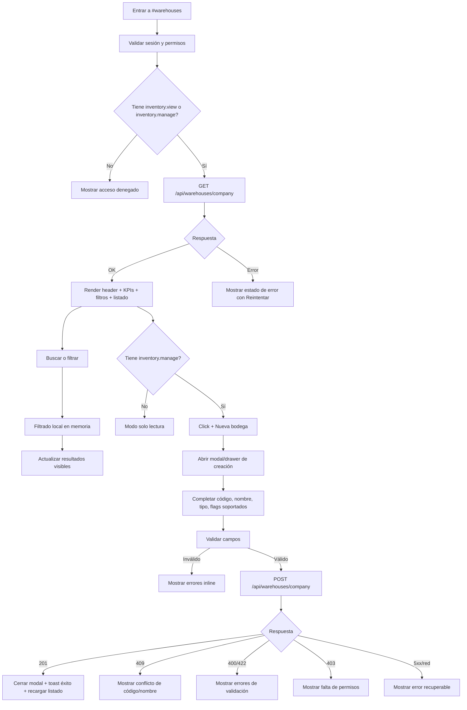

# Vista: Bodegas

## Estado del documento
- Autor de consolidación UX/UI: `senior-ux-ui-designer-f2bc83`
- Coordinación: `planning-agent-c2c92b`
- Estado: borrador listo para revisión de desarrollo/producto
- Alcance: especificación UX/UI para la futura vista moderna `#warehouses` dentro del AppShell root.
- Tipo de entrega: especificación funcional, visual y de interacción. No incluye implementación.

## Fuentes utilizadas
Este documento se alinea con fuentes verificadas del repositorio:
- `docs/ui-guidelines.md`
- `docs/vistas/zones-view-spec.md`
- `docs/vistas/agents-view-spec.md`
- `docs/vistas/clients-view-spec.md`
- `docs/vistas/routes-view-spec.md`
- `src/routes/warehouse.routes.js`
- `src/services/warehouse.service.js`
- `src/repositories/warehouse.repository.js`
- `src/lib/warehouse-types.js`
- `src/schemas/warehouse.schema.js`
- `src/security/access-policy-registry.js`
- `internal-docs/runtime-endpoint-catalog.md`
- `README.md`
- Referencia legacy solo como contexto visual/no contractual: `legacy-public-runtime/root/warehouses.html` y `legacy-public-runtime/root/warehouses.js`

## Contexto actual verificado
- La vista objetivo pertenece al futuro AppShell moderno root, bajo la ruta `#warehouses` o equivalente del shell.
- No debe implementarse como reactivación literal de la pantalla legacy removida.
- El backend soportado actualmente para esta superficie expone solo:
  - listado de bodegas de compañía;
  - creación de bodega de compañía.
- La respuesta de listado incluye:
  - `items` con bodegas;
  - `summary` agregado;
  - `warehouseTypes` disponibles.
- No hay contrato verificado para editar, eliminar, ver movimientos, consultar stock por bodega ni configurar reglas avanzadas desde esta vista.
- El backend ordena las bodegas por `isActive desc`, `warehouseType asc`, `name asc`; la UI no debe comunicar otro criterio server-side como garantía.

## Alineación con `ui-guidelines.md`
La implementación debe seguir estas reglas:
- Usar sesión browser same-origin y fetch autenticado con `credentials: 'same-origin'` mediante helpers compartidos cuando existan.
- No persistir bearer tokens en storage ni reintroducir patrones legacy.
- Validar sesión/permisos al cargar la vista; ocultar acciones no disponibles solo como mejora UX, no como mecanismo de seguridad.
- Mostrar errores visibles, breves y operables para fallos de red, autorización, validación o conflicto.
- No asumir capacidades no montadas en backend.
- Mantener separación de contexto: esta vista vive en `root/*`/AppShell administrativo, no en superficies `warehouse/*` operativas.
- Documentar endpoints consumidos, permisos requeridos, comportamiento responsive y estados principales.

## Objetivo de la vista
Permitir a usuarios administrativos consultar y crear bodegas de la compañía desde una experiencia moderna, clara y segura, distinguiendo bodegas físicas/virtuales, fuentes vendibles y estado activo sin prometer funcionalidades operativas aún no soportadas.

## Objetivo del usuario
- Ver rápidamente todas las bodegas configuradas para la compañía.
- Entender qué bodegas son físicas o virtuales.
- Identificar cuáles pueden ser origen vendible.
- Ver cuáles están activas/inactivas.
- Buscar y filtrar bodegas localmente por código, nombre, tipo y estado.
- Crear una nueva bodega con los campos actualmente soportados.

## Objetivo del negocio
- Ordenar la base operativa del inventario por ubicación/tipo de bodega.
- Reducir errores en configuración inicial de inventario y venta.
- Dar visibilidad administrativa antes de construir flujos posteriores de stock, movimientos o picking.
- Mantener gobernanza de permisos: lectura para perfiles con visibilidad de inventario y creación solo para perfiles con gestión de inventario.

## Alcance MVP
### Incluye
- Listado de bodegas de la compañía mediante `GET /api/warehouses/company`.
- KPIs derivados de `summary`: total, activas, virtuales y fuentes vendibles.
- Búsqueda local sobre datos cargados.
- Filtros locales por tipo de bodega, naturaleza física/virtual, fuente vendible y estado.
- Vista de lista/tabla responsive con tarjetas en mobile.
- Panel o modal de creación mediante `POST /api/warehouses/company`.
- Selector de tipo alimentado por `warehouseTypes` de la respuesta de listado.
- Validaciones UX básicas alineadas con `createWarehouseSchema`.
- Estados: loading, empty, filtered empty, error, unauthorized/forbidden, saving, success.
- Permisos visibles: lectura con `inventory.view` o `inventory.manage`; creación solo con `inventory.manage`.

### No incluye en esta fase
- Edición de bodegas existentes.
- Eliminación, archivado o reactivación mediante endpoint propio.
- Vista de detalle navegable por bodega.
- Movimientos de inventario por bodega.
- Stock disponible por bodega.
- Transferencias entre bodegas.
- Auditoría histórica de cambios.
- Paginación server-side como requisito visual del MVP, aunque el backend pueda aceptar query de paginación en la ruta.
- Importación masiva.
- Reglas de prioridad, picking, reposición o capacidad física.

## Decisiones cerradas para desarrollo
### Principio de permisos
- La vista debe guiarse por **permiso efectivo, no por nombre de rol**.
- `inventory.view` e `inventory.manage` son la referencia canónica para decidir visibilidad y habilitación de acciones.
- Los nombres de rol solo pueden usarse como contexto descriptivo de actores esperados, nunca como condición de UI o seguridad.
- Si una combinación futura de roles concede los permisos correctos, la vista debe comportarse según esos permisos sin requerir cambios de copy o lógica.

### Estrategia de carga para MVP
- El MVP arranca con **carga completa + búsqueda y filtros locales** sobre `GET /api/warehouses/company`.
- No se introduce paginación visible en el día uno de la vista.
- El disparador de V2 para paginación debe considerarse cuando la compañía tenga aproximadamente **100–150 bodegas visibles** o cuando exista degradación perceptible en carga, búsqueda o render del listado.
- La transición a V2 no debe hacerse de forma implícita; requiere ajuste deliberado de diseño, contrato consumido y validación de rendimiento.

### Resiliencia de KPIs
- `summary` sigue siendo el contrato preferido y esperado para poblar los KPI cards.
- Si `summary` no está disponible pero `items` sí, la UI puede reconstruir métricas localmente para mantener continuidad operativa.
- Cuando ocurra ese fallback, cada KPI reconstruido debe marcarse de forma discreta como estimado con:
  - label: `Estimado`
  - tooltip/help text: `Calculado localmente porque el resumen no estuvo disponible.`
- La ausencia de `summary` no debe reinterpretarse como cambio contractual silencioso; debe tratarse como resiliencia del cliente.

### Regla de tipo de bodega y fuente vendible
- `defaultSellableSource` debe reaplicarse cada vez que cambie `warehouseType`, no solo en la carga inicial del formulario.
- Si el nuevo tipo es virtual, la UI debe forzar `isSellableSource = false`, dejar el control deshabilitado y explicar el motivo.
- Si el cambio de tipo ajusta automáticamente el valor de fuente vendible, mostrar microcopy contextual: `La fuente vendible se ajustó según el tipo de bodega seleccionado.`
- Para tipos virtuales, el mensaje explicativo aprobado es: `Las bodegas virtuales no pueden configurarse como fuente vendible.`

## Contrato backend verificado
### Endpoints soportados actualmente
| Método | Endpoint | Uso en UI | Permiso/política |
|---|---|---|---|
| `GET` | `/api/warehouses/company` | Cargar listado, resumen y tipos disponibles | `warehouse.company.list` basado en `inventory.view` o `inventory.manage` |
| `POST` | `/api/warehouses/company` | Crear bodega de compañía | `warehouse.company.create` basado en `inventory.manage` |

### Respuesta verificada de listado
La UI puede consumir con seguridad:
- `items[]`
- `summary`
- `warehouseTypes[]`

Campos verificados por item:
- `id`
- `companyId`
- `code`
- `name`
- `warehouseType`
- `warehouseTypeLabel`
- `warehouseTypeDescription`
- `isVirtual`
- `isSellableSource`
- `isActive`
- `createdAt`
- `updatedAt`

Campos verificados en `summary`:
- `total`
- `active`
- `virtual`
- `sellable`

Campos verificados en `warehouseTypes[]`:
- `value`
- `label`
- `description`
- `isVirtual`
- `defaultSellableSource`

### Payload verificado para creación
`POST /api/warehouses/company` acepta:
- `code` requerido, string trim, mínimo 2, máximo 40.
- `name` requerido, string trim, mínimo 2, máximo 120.
- `warehouseType` requerido, uno de los valores soportados.
- `isSellableSource` opcional boolean.
- `isActive` opcional boolean.

### Tipos soportados actualmente
La UI debe obtenerlos preferentemente desde `warehouseTypes`, pero puede contemplar estos valores como contrato conocido de referencia:
- `GENERAL` — General
- `RAW_MATERIAL` — Materia prima
- `FINISHED_GOODS` — Producto terminado
- `PACKAGING` — Empaque
- `QUARANTINE` — Cuarentena
- `RETURNS` — Devoluciones
- `PRODUCTION` — Producción
- `ADMIN_VIRTUAL` — Administrativa virtual
- `COURSES_VIRTUAL` — Virtual
- `AFFILIATIONS_VIRTUAL` — Afiliaciones virtual

### Reglas de negocio verificadas del backend
- El código se normaliza en backend con trim, mayúsculas y reemplazo de espacios por guiones.
- Si el tipo de bodega es virtual, `isSellableSource` se fuerza a `false`.
- Si `isActive` no se envía, el backend crea la bodega como activa.
- Si existe conflicto de código o nombre, el backend responde error de conflicto con mensaje equivalente a: `Ya existe una bodega con ese codigo o nombre`.
- La definición de `isVirtual` viene del tipo de bodega, no debe editarse como campo independiente en UI.

## Permisos y actores
### Actores esperados
- Administrador de compañía con permisos de inventario.
- Usuario operativo/administrativo con `inventory.view` para consulta.
- Usuario gestor con `inventory.manage` para crear bodegas.

### Matriz UX de permisos
| Capacidad | `inventory.view` | `inventory.manage` |
|---|---:|---:|
| Ver página | Sí | Sí |
| Cargar listado | Sí | Sí |
| Buscar/filtrar localmente | Sí | Sí |
| Ver KPIs | Sí | Sí |
| Abrir crear bodega | No | Sí |
| Enviar creación | No | Sí |

### Reglas de interfaz por permiso
- Resolver acceso y acciones por permiso efectivo (`inventory.view`, `inventory.manage`), no por nombre de rol.
- Si el usuario solo tiene `inventory.view`, mostrar la vista en modo consulta y ocultar/deshabilitar `+ Nueva bodega`.
- Si se decide mostrar el CTA deshabilitado para educación, debe incluir tooltip/copy: `Necesitas permiso de gestión de inventario para crear bodegas.`
- Si el backend responde 403 al cargar, mostrar estado de acceso denegado y no renderizar datos parciales.
- Si el backend responde 403 al crear, mantener el modal abierto y mostrar mensaje contextual.

## Principios UX de la vista
1. **Inventario entendible antes que exhaustivo**: mostrar lo soportado sin mezclar stock, movimientos o configuraciones futuras.
2. **Tipos como guía operativa**: cada tipo debe explicar su uso mediante label y descripción.
3. **Estados visibles**: activa/inactiva, virtual/física y fuente vendible deben poder detectarse en menos de 5 segundos.
4. **Acciones seguras**: creación simple, con validación clara y sin campos no soportados.
5. **Consistencia AppShell**: mantener patrones de las vistas `#agents`, `#routes`, `#clients` y `#zones`.
6. **Mobile first**: la consulta y creación deben funcionar sin depender de tablas anchas.
7. **Accesibilidad WCAG**: semántica, contraste, foco visible y mensajes asociados a campos.

## Flujo UX


## Posicionamiento dentro del AppShell
```text
AppShell
├── Sidebar
├── Header shell
└── MainContent
    └── WarehousesPage (#warehouses)
        ├── PageHeader
        ├── KPIGrid
        ├── ToolbarSearchFilters
        ├── WarehousesContent
        │   ├── WarehousesTableDesktop
        │   └── WarehousesCardsMobile
        └── CreateWarehouseModalOrDrawer
```

## Estructura de pantalla
### Header de página
Orden recomendado:
1. Eyebrow: `INVENTARIO`
2. Título: `Bodegas`
3. Subtítulo: `Administra las bodegas físicas y virtuales disponibles para la operación de inventario.`
4. Acciones:
   - Secundaria: `Actualizar`
   - Primaria: `+ Nueva bodega` solo con `inventory.manage`

Reglas:
- No colocar logout dentro de la vista; pertenece al shell global.
- Mantener `Actualizar` disponible aunque no haya bodegas.
- La CTA primaria debe quedar visible above the fold en desktop y al inicio del contenido en mobile.

### KPIs
Usar cuatro cards derivadas de `summary`:
1. **Bodegas totales** — `summary.total`
2. **Activas** — `summary.active`
3. **Virtuales** — `summary.virtual`
4. **Fuentes vendibles** — `summary.sellable`

Comportamiento:
- Si `summary` falta inesperadamente pero `items` existe, la UI puede calcular fallback local solo para mantener resiliencia, pero no debe cambiar el contrato documentado.
- Cuando se use fallback local, cada KPI afectado debe mostrar la marca discreta `Estimado` con ayuda/tooltip: `Calculado localmente porque el resumen no estuvo disponible.`
- Los KPIs no son filtros por defecto; pueden volverse clicables solo si el equipo decide patrón consistente y accesible.
- En mobile: grid 2x2 o cards horizontales compactas.

### Toolbar de búsqueda y filtros
Componentes:
- Input de búsqueda con placeholder: `Buscar por código, nombre o tipo...`
- Filtro `Tipo`: todos + opciones de `warehouseTypes`.
- Filtro `Naturaleza`: `Todas`, `Físicas`, `Virtuales`.
- Filtro `Fuente vendible`: `Todas`, `Sí`, `No`.
- Filtro `Estado`: `Todas`, `Activas`, `Inactivas`.
- Acción `Limpiar filtros` visible cuando exista algún filtro activo.

Reglas:
- La búsqueda es local y debe aplicar sobre `code`, `name`, `warehouseTypeLabel`, `warehouseTypeDescription` y `warehouseType`.
- Debounce recomendado: 150–250 ms.
- Mostrar contador: `N de M bodegas`.
- No llamar al servidor en cada búsqueda/filtro en MVP.

## Comportamiento del listado
### Desktop/tablet ancho: tabla
Columnas recomendadas:
1. `Bodega`
   - nombre como texto principal;
   - código como monoespaciado o chip secundario.
2. `Tipo`
   - label del tipo;
   - descripción truncada a 1–2 líneas con tooltip opcional.
3. `Naturaleza`
   - chip `Física` o `Virtual`.
4. `Fuente vendible`
   - chip/ícono `Sí` o `No`.
5. `Estado`
   - chip `Activa` o `Inactiva`.
6. `Actualizada`
   - fecha relativa o formato local corto basado en `updatedAt`.

Acciones por fila:
- MVP: no incluir menú de editar/eliminar.
- Se permite una acción informativa no destructiva como expandir/ver detalles inline si no requiere endpoint adicional.
- Si se incluye menú contextual, debe mostrar únicamente acciones soportadas; no dejar opciones deshabilitadas de edición/borrado salvo que producto lo pida explícitamente como roadmap.

### Mobile: tarjetas
Cada tarjeta debe mostrar:
- Nombre.
- Código.
- Tipo.
- Chips: `Física/Virtual`, `Vendible/No vendible`, `Activa/Inactiva`.
- Descripción del tipo en texto secundario.
- Fecha de actualización en pie de tarjeta.

### Detalle inline opcional
Al seleccionar una fila/tarjeta se puede expandir un bloque con:
- `ID` solo si es útil para soporte; preferible ocultarlo por defecto.
- Descripción completa del tipo.
- Fecha de creación.
- Fecha de actualización.
No debe incluir stock, movimientos ni acciones no soportadas.

## Flujo de creación
### Patrón recomendado
- Desktop: modal centrado de ancho 560–640 px.
- Mobile: bottom sheet/drawer full-width con acciones sticky al pie.

### Título y copy
- Título: `Nueva bodega`
- Descripción: `Crea una bodega física o virtual para organizar la operación de inventario de la compañía.`

### Campos del formulario
1. `Código` requerido
   - Placeholder: `Ej. PT-01`
   - Ayuda: `Se guardará en mayúsculas; los espacios se convertirán en guiones.`
   - Validación UX: 2–40 caracteres tras trim.
2. `Nombre` requerido
   - Placeholder: `Ej. Bodega producto terminado`
   - Validación UX: 2–120 caracteres tras trim.
3. `Tipo de bodega` requerido
   - Select con opciones de `warehouseTypes`.
   - Cada opción debe mostrar label y, si el componente lo permite, descripción corta.
4. `Fuente vendible` opcional
   - Switch o checkbox.
   - Debe inicializarse y reaplicarse desde `defaultSellableSource` cada vez que cambie el `Tipo de bodega`, salvo que el nuevo tipo sea virtual.
   - Si el cambio de tipo ajusta automáticamente el valor, mostrar feedback no bloqueante: `La fuente vendible se ajustó según el tipo de bodega seleccionado.`
   - Si el tipo seleccionado es virtual, forzar `false`, deshabilitar el control y mostrar copy auxiliar: `Las bodegas virtuales no pueden configurarse como fuente vendible.`
5. `Activa` opcional
   - Switch activo por defecto.
   - Ayuda: `Una bodega inactiva queda visible para referencia, pero no debe usarse como opción operativa en flujos futuros.`

### Validaciones y errores inline
- Código vacío: `Ingresa un código de bodega.`
- Código corto: `El código debe tener al menos 2 caracteres.`
- Código largo: `El código no puede superar 40 caracteres.`
- Nombre vacío: `Ingresa un nombre de bodega.`
- Nombre corto: `El nombre debe tener al menos 2 caracteres.`
- Nombre largo: `El nombre no puede superar 120 caracteres.`
- Tipo vacío: `Selecciona un tipo de bodega.`
- Conflicto 409: `Ya existe una bodega con ese código o nombre. Revisa los datos e inténtalo nuevamente.`
- Error genérico: `No pudimos crear la bodega. Inténtalo nuevamente.`

### Acciones del formulario
- Primaria: `Crear bodega`
- Secundaria: `Cancelar`
- Estado saving: botón primario deshabilitado con label `Creando...`
- Al éxito:
  - cerrar modal/drawer;
  - limpiar formulario;
  - recargar `GET /api/warehouses/company`;
  - mostrar toast: `Bodega creada correctamente.`
  - opcional: resaltar temporalmente la nueva fila/tarjeta si el `id` recién creado aparece en el listado recargado.

## Estados UX
### Loading inicial
- Mostrar skeletons para header secundario/KPIs/listado.
- Evitar layout shift: reservar altura aproximada de KPIs y tabla.
- Copy accesible para lectores de pantalla: `Cargando bodegas...`

### Empty state sin bodegas
Mostrar cuando `items.length === 0` y no hay filtros activos:
- Título: `Aún no hay bodegas configuradas`
- Descripción: `Crea la primera bodega para organizar el inventario físico o virtual de la compañía.`
- CTA: `+ Nueva bodega` si tiene `inventory.manage`.
- Si solo tiene lectura: `Cuando un usuario con gestión de inventario cree bodegas, aparecerán aquí.`

### Empty state por filtros
- Título: `No encontramos bodegas con esos filtros`
- Descripción: `Prueba cambiando la búsqueda o limpiando los filtros aplicados.`
- CTA secundaria: `Limpiar filtros`.

### Error de carga
- Título: `No pudimos cargar las bodegas`
- Descripción: `Revisa tu conexión o intenta nuevamente.`
- Acción: `Reintentar`.
- No ocultar el error crítico ni mostrar lista vacía como si fuera estado real.

### Acceso denegado
- Título: `No tienes acceso a bodegas`
- Descripción: `Necesitas permisos de inventario para consultar esta información.`
- Acción opcional: `Volver al inicio` o navegación provista por AppShell.

### Éxito
- Toast breve, no bloqueante: `Bodega creada correctamente.`
- Duración sugerida: 4–6 segundos.
- Debe ser anunciado con región `aria-live="polite"`.

## Diseño visual
### Sistema y estilo
- La vista debe alinearse explícitamente con los patrones actuales del AppShell root ya usados por `#agents`, `#clients`, `#routes` y `#zones`; no debe presentarse como una implementación literal de Material Design 3 ni depender de ese sistema como referencia contractual.
- Debe sentirse como una superficie administrativa/comercial de Inventori: header de página dentro del shell, KPIs compactos, toolbar de búsqueda y filtros arriba, contenedor principal limpio y estados vacíos/errores consistentes con las demás vistas root-shell.
- Estética: empresarial moderna, clara, de densidad moderada y orientada a escaneo rápido.
- Priorizar jerarquía visual: título → KPIs → filtros → listado.
- Reutilizar, cuando existan, patrones/tokens/componentes equivalentes del AppShell (`PageHeader`, grid de KPIs, toolbar de filtros, tabla administrativa, cards mobile, modal/drawer de creación y toast no bloqueante).

### Colores recomendados
Usar tokens del sistema del AppShell si existen. Referencias semánticas para mantener consistencia con las demás vistas root-shell comerciales/administrativas:
- Fondo página: `#F8FAFC`
- Superficie/card: `#FFFFFF`
- Texto principal: `#0F172A`
- Texto secundario: `#64748B`
- Bordes: `#E2E8F0`
- Primario de la vista y acento principal de acciones/enfoque: `#16A34A`
- Éxito/activo: `#16A34A` sobre fondo suave `#DCFCE7`
- Advertencia/fuente vendible: `#D97706` sobre fondo suave `#FEF3C7`
- Virtual/info: `#7C3AED` sobre fondo suave `#EDE9FE`
- Inactivo/neutral: `#475569` sobre fondo `#F1F5F9`
- Error: `#DC2626`

### Tipografía
- Usar la familia definida por AppShell.
- Título página: 28–32 px, semibold/bold.
- KPI número: 28 px, semibold.
- Labels: 12–14 px, medium.
- Tabla: 14 px base, 12–13 px para metadatos.
- Código de bodega: preferible monoespaciado o chip con tracking ligero.

### Espaciado
- Contenedor principal: 16 px mobile, 24 px tablet, 32 px desktop.
- Gap entre secciones: 20–24 px.
- Cards KPI: padding 16 px mobile, 20 px desktop.
- Tabla/card list: padding 16–20 px.
- Modal: padding 24 px desktop, 16–20 px mobile.

### Componentes reutilizables
- `PageHeader`
- `KPIGrid` / `KPICard`
- `SearchInput`
- `FilterSelect`
- `StatusChip`
- `DataTable`
- `EntityCard`
- `EmptyState`
- `ErrorState`
- `CreateWarehouseForm`
- `Toast`

## Wireframes
### Desktop
```text
┌──────────────────────────────────────────────────────────────────────────────┐
│ AppShell / Inventario                                                        │
├──────────────────────────────────────────────────────────────────────────────┤
│ INVENTARIO                                      [Actualizar] [+ Nueva bodega]│
│ Bodegas                                                                      │
│ Administra las bodegas físicas y virtuales disponibles para inventario.      │
│                                                                              │
│ ┌──────────────┐ ┌──────────────┐ ┌──────────────┐ ┌──────────────────────┐ │
│ │ Totales  12  │ │ Activas  10  │ │ Virtuales 3  │ │ Fuentes vendibles 2  │ │
│ └──────────────┘ └──────────────┘ └──────────────┘ └──────────────────────┘ │
│                                                                              │
│ ┌─────────────────────────────┐ ┌──────────┐ ┌──────────┐ ┌──────────────┐ │
│ │ Buscar por código, nombre...│ │ Tipo     │ │ Naturaleza│ │ Estado       │ │
│ └─────────────────────────────┘ └──────────┘ └──────────┘ └──────────────┘ │
│ 12 de 12 bodegas                                            [Limpiar filtros]│
│                                                                              │
│ ┌──────────────────────────────────────────────────────────────────────────┐ │
│ │ Bodega              Tipo                 Naturaleza Vendible Estado Act. │ │
│ ├──────────────────────────────────────────────────────────────────────────┤ │
│ │ Producto terminado  Producto terminado   Física     Sí       Activa ... │ │
│ │ PT-01               Bodega física para producto disponible...            │ │
│ ├──────────────────────────────────────────────────────────────────────────┤ │
│ │ Cursos digitales    Virtual              Virtual    No       Activa ... │ │
│ │ CURSOS              Bodega virtual para productos sin almacén físico     │ │
│ └──────────────────────────────────────────────────────────────────────────┘ │
└──────────────────────────────────────────────────────────────────────────────┘
```

### Mobile
```text
┌──────────────────────────────┐
│ INVENTARIO                   │
│ Bodegas                      │
│ Administra bodegas físicas   │
│ y virtuales.                 │
│ [+ Nueva bodega]             │
│ [Actualizar]                 │
├──────────────────────────────┤
│ [Totales 12] [Activas 10]    │
│ [Virtuales 3] [Vendibles 2]  │
├──────────────────────────────┤
│ [Buscar...]                  │
│ [Tipo ▾] [Estado ▾]          │
│ [Naturaleza ▾] [Vendible ▾]  │
│ 12 de 12 bodegas             │
├──────────────────────────────┤
│ ┌──────────────────────────┐ │
│ │ Producto terminado       │ │
│ │ PT-01                    │ │
│ │ Producto terminado       │ │
│ │ [Física] [Vendible]      │ │
│ │ [Activa]                 │ │
│ │ Actualizada: 12/03/2025  │ │
│ └──────────────────────────┘ │
│ ┌──────────────────────────┐ │
│ │ Cursos digitales         │ │
│ │ CURSOS                   │ │
│ │ [Virtual] [No vendible]  │ │
│ │ [Activa]                 │ │
│ └──────────────────────────┘ │
└──────────────────────────────┘
```

### Modal/drawer de creación
```text
┌──────────────────────────────────────┐
│ Nueva bodega                         │
│ Crea una bodega física o virtual...  │
├──────────────────────────────────────┤
│ Código *                             │
│ [ PT-01                            ] │
│ Se guardará en mayúsculas...         │
│                                      │
│ Nombre *                             │
│ [ Bodega producto terminado        ] │
│                                      │
│ Tipo de bodega *                     │
│ [ Producto terminado              ▾] │
│ Bodega física para producto...       │
│                                      │
│ [●] Fuente vendible                  │
│ [●] Activa                           │
├──────────────────────────────────────┤
│                [Cancelar] [Crear]    │
└──────────────────────────────────────┘
```

## Guía de copy
### Términos preferidos
- Usar `Bodega`, no alternar con `almacén` salvo que el backend/producto lo estandarice.
- Usar `Fuente vendible` para `isSellableSource`.
- Usar `Virtual` / `Física` para `isVirtual`.
- Usar `Activa` / `Inactiva` para `isActive`.

### Microcopy recomendado
- Header: `Administra las bodegas físicas y virtuales disponibles para la operación de inventario.`
- Búsqueda: `Buscar por código, nombre o tipo...`
- Ayuda código: `Se guardará en mayúsculas; los espacios se convertirán en guiones.`
- Ajuste por cambio de tipo: `La fuente vendible se ajustó según el tipo de bodega seleccionado.`
- Ayuda tipo virtual: `Las bodegas virtuales no pueden configurarse como fuente vendible.`
- Empty: `Crea la primera bodega para organizar el inventario físico o virtual de la compañía.`

## Responsive y accesibilidad
### Responsive
- Mobile first: construir primero cards apiladas y luego mejorar a tabla en desktop.
- Breakpoint sugerido:
  - `< 768px`: cards + filtros en dos filas o acordeón.
  - `768–1023px`: tabla compacta o cards en grid 2 columnas según densidad.
  - `>= 1024px`: tabla completa.
- El modal de creación debe convertirse en drawer/bottom sheet en mobile.
- Mantener acciones principales visibles sin scroll horizontal.

### Accesibilidad WCAG
- Contraste mínimo 4.5:1 para texto normal.
- Foco visible en inputs, selects, switches, botones y filas expandibles.
- Labels explícitos asociados a cada campo.
- Errores inline asociados mediante `aria-describedby`.
- Toasts y errores globales con `aria-live`.
- No depender solo del color para diferenciar activa/inactiva o virtual/física; usar texto en chips.
- Tabla con encabezados semánticos; en mobile, cards con estructura de lista y headings.
- El switch `Fuente vendible` deshabilitado para virtual debe explicar por qué y mantener disponible el texto: `Las bodegas virtuales no pueden configurarse como fuente vendible.`

## Restricciones explícitas sobre datos/capacidades no soportadas
La UI no debe prometer ni mostrar como disponible:
- Botones de `Editar`, `Eliminar`, `Archivar`, `Reactivar` o `Ver movimientos` si no existe endpoint verificado.
- Conteos de productos, stock, lotes, costos, capacidad o ubicaciones internas por bodega.
- Indicadores de salud de inventario por bodega.
- Historial de cambios o auditoría.
- Transferencias entre bodegas.
- Descargas/exportaciones si no hay contrato definido.
- Paginación server-side obligatoria como funcionalidad visible, salvo que se formalice en el AppShell.
- Reglas de venta o fulfillment más allá de mostrar `isSellableSource`.

## Especificaciones para desarrollo
### Carga inicial
1. Validar sesión y permisos efectivos desde el mecanismo compartido del AppShell.
2. Resolver acceso por permisos efectivos, no por nombre de rol.
3. Si tiene `inventory.view` o `inventory.manage`, ejecutar `GET /api/warehouses/company`.
4. Renderizar `items`, `summary` y `warehouseTypes`.
5. Si `summary` no existe pero `items` sí, calcular KPI locales y marcarlos como `Estimado`.
6. Mantener datos en memoria para búsqueda/filtros locales.
7. Manejar defensivamente respuestas no JSON o errores HTTP.

### Creación
1. Mostrar CTA solo para `inventory.manage`.
2. Construir payload con:
   - `code`: valor trim del formulario;
   - `name`: valor trim;
   - `warehouseType`: value seleccionado;
   - `isSellableSource`: boolean si aplica;
   - `isActive`: boolean.
3. Reaplicar `defaultSellableSource` cada vez que cambie el `warehouseType`.
4. Si el tipo seleccionado es virtual, forzar `isSellableSource: false`, deshabilitar el control y mostrar el mensaje correspondiente; el backend también lo forzará.
5. Enviar `POST /api/warehouses/company` con JSON y credenciales same-origin.
6. En éxito 201, recargar listado completo.
7. En error, restaurar estado del botón y conservar datos ingresados.

### Filtros locales
Aplicar en este orden recomendado:
1. Texto de búsqueda.
2. Tipo.
3. Naturaleza física/virtual.
4. Fuente vendible.
5. Estado.

### Formato de fechas
- Usar formato local consistente con otras vistas del AppShell.
- Si `updatedAt` falta, usar `createdAt`; si ambos faltan, mostrar `Sin fecha`.

### Telemetría/logs
- No loggear tokens, cookies ni payloads sensibles.
- Si se registra error en consola durante desarrollo, evitar incluir información sensible de sesión.

### Criterios de aceptación MVP
- Un usuario con `inventory.view` puede ver listado, KPIs, buscar y filtrar, pero no crear.
- Un usuario con `inventory.manage` puede ver y crear bodegas.
- La creación valida campos antes de enviar.
- Al crear una bodega válida se muestra éxito y el listado se actualiza.
- Al intentar crear duplicado se muestra error claro de conflicto.
- En mobile no hay scroll horizontal obligatorio para completar la tarea principal.
- La pantalla no muestra acciones de edición/eliminación/movimientos/stock no soportadas.
- Los chips de `Física/Virtual`, `Fuente vendible` y `Activa/Inactiva` son legibles y accesibles.
