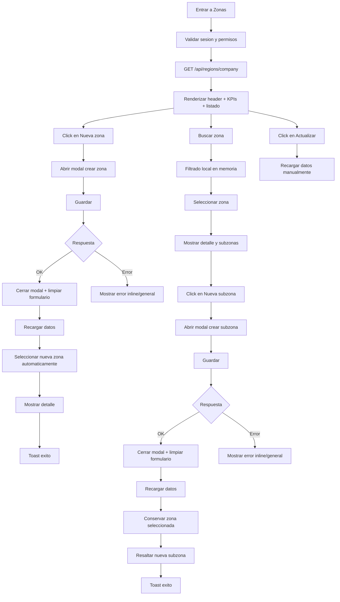

# Vista: Zonas y subzonas

## Estado del documento
- Autor de consolidación: `senior-ux-ui-designer-unpinned-1015c2`
- Estado: listo para revisión de desarrollo/producto
- Alcance: especificación UX/UI para la vista `/root/zones.html`

## Fuentes utilizadas
Este documento consolida lo definido en conversación y lo alinea con las fuentes verificadas del repositorio:
- `docs/ui-guidelines.md`
- `docs/prd_actualizacion_catalogo_precios.md`
- `docs/runtime-endpoint-catalog.md`
- `src/routes/region.routes.js`
- `src/services/region.service.js`
- `legacy-public-runtime/root/zones.html`
- `legacy-public-runtime/root/zones.js`

## Objetivo de la vista
Permitir a un administrador organizar la estructura territorial de la empresa mediante zonas y subzonas, de forma clara, escalable y consistente con el AppShell de Inventori.

## Objetivo del usuario
- Ver las zonas registradas de su empresa.
- Consultar rápidamente las subzonas de una zona seleccionada.
- Crear una nueva zona.
- Crear una nueva subzona dentro de una zona existente.
- Encontrar una zona o subzona por nombre o código.

## Objetivo del negocio
- Mantener una estructura territorial consistente para soportar rutas, agentes y clientes.
- Reducir desorden operativo al momento de asignar cobertura comercial.
- Preparar la base para futuras capacidades sobre rutas y cobertura sin prometer datos aún no soportados por backend.

## Alcance MVP
### Incluye
- Listado de zonas de la empresa.
- Selección de zona.
- Visualización de subzonas de la zona seleccionada.
- Creación de zona.
- Creación de subzona.
- Búsqueda local de zonas.
- Búsqueda local de subzonas dentro de la zona seleccionada.
- Estados UX: loading, empty, error, success, hover, focus, selected, disabled.
- Responsive desktop/tablet/mobile.

### No incluye en esta fase
- Edición de zona.
- Edición de subzona.
- Eliminación o archivado.
- Estado activa/inactiva.
- KPIs de subzonas sin ruta o sin clientes como dato real.
- Relación visible con rutas o clientes desde esta vista.
- Endpoint de búsqueda server-side.
- Paginación.

## Contrato backend verificado
### Endpoints soportados actualmente
- `GET /api/regions/company`
- `POST /api/regions/company`
- `POST /api/regions/company/:regionId/subregions`

### Datos verificables en la respuesta actual
La respuesta actual permite trabajar con:
- Zona:
  - `id`
  - `companyId`
  - `name`
  - `routeCode`
  - `createdAt`
  - `updatedAt`
  - `subregions`
- Subzona:
  - `id`
  - `regionId`
  - `name`
  - `routeCode`
  - `createdAt`
  - `updatedAt`

### Restricciones importantes
No mostrar como dato real en esta vista, porque no está soportado por el contrato verificado:
- ruta asociada a cada subzona
- cantidad de clientes/tiendas por subzona
- estado activa/inactiva
- alertas calculadas de cobertura

## Alineación con `ui-guidelines.md`
La implementación de la vista debe:
- vivir dentro del runtime actual y del AppShell existente
- usar fetch autenticado con helpers ya existentes
- depender de sesión same-origin
- validar sesión/permisos al cargar
- mostrar errores visibles y operables
- no mover reglas críticas de negocio al frontend
- documentar endpoints consumidos y comportamiento responsive

## Flujo UX


## Estructura de la página
La vista no debe definir un layout externo propio. Debe renderizarse dentro del AppShell.

```text
AppShell
├── Sidebar
├── Topbar (si existe)
└── MainContent
    └── ZonesPage
```

## Contenedor principal
```css
.page {
  width: 100%;
  min-width: 0;
  max-width: 1600px;
  margin-inline: auto;
  padding: 24px 32px 40px;
}
```

### Breakpoints de padding
- Hasta 1024px: `padding: 24px;`
- Mobile: `padding: 16px;`

### Regla clave
- No utilizar anchos fijos en el contenido principal.
- Evitar scroll horizontal global.

## Header de página
### Orden exacto
1. Eyebrow opcional: `OPERACIÓN`
2. Título: `Zonas y subzonas`
3. Subtítulo: `Organiza la cobertura territorial utilizada para asignar rutas, agentes y clientes.`
4. Acciones

### Acciones del header
- Secundaria: `Actualizar`
- Primaria: `+ Nueva zona`

### Regla explícita
- No incluir `Cerrar sesión` o `Salir` en el header.
- El cierre de sesión permanece exclusivamente en el sidebar/footer del shell.

### Medidas
- Separación eyebrow/título: `4px`
- Separación título/subtítulo: `8px`
- Separación header/KPIs: `24px`
- Alto de botones: `40px`
- Gap entre botones: `8px`

## Identidad visual de Inventori
La vista debe usar la identidad global del producto, no una paleta específica para Zonas.

### Colores
- Primary: `#16A34A`
- Primary hover: `#15803D`
- Sidebar y encabezados fuertes: `#0F172A`
- Fondo de aplicación: `#F8FAFC`
- Superficies: `#FFFFFF`
- Bordes: `#E2E8F0`
- Texto secundario: `#64748B`

### Uso
- Verde `#16A34A`: acción principal, selección, estados positivos.
- Azul oscuro `#0F172A`: estructura, títulos y navegación.
- No usar una paleta alternativa solo para esta vista.

## KPIs
### MVP soportado
Solo mostrar KPIs basados en datos verificables actualmente:
- Zonas registradas
- Subzonas registradas

### Futuros KPIs reservados
No mostrar aún como dato real:
- Subzonas sin ruta
- Subzonas sin clientes

### Grid desktop
```css
.kpi-grid {
  display: grid;
  grid-template-columns: repeat(4, minmax(0, 1fr));
  gap: 16px;
}
```

### Ajuste MVP recomendado
Aunque el grid soporte 4 slots, en MVP solo deben renderizarse métricas realmente soportadas.

### Card KPI
- Alto mínimo: `104px`
- Padding: `20px`
- Fondo: `#FFFFFF`
- Borde: `1px solid #E2E8F0`
- Radius: `12px`
- Sin sombra o sombra muy ligera
- Número: `28px`, semibold
- Label: `14px`, `#64748B`

## Layout maestro-detalle
```css
.zones-layout {
  display: grid;
  grid-template-columns: minmax(280px, 360px) minmax(0, 1fr);
  gap: 24px;
  align-items: start;
}
```

### Reglas clave
- El panel izquierdo nunca debe medir menos de `280px` en desktop.
- El panel derecho debe usar `min-width: 0` para evitar overflow horizontal.

## Panel izquierdo: listado de zonas
### Orden exacto
1. Encabezado `Zonas`
2. Contador total
3. Campo de búsqueda
4. Filtro de estado solo si existe soporte futuro
5. Lista
6. Estado vacío o error

### Búsqueda de zonas
#### Definición funcional
En el MVP, la búsqueda se realiza en memoria sobre las zonas devueltas por `GET /api/regions/company`.

#### Reglas
- No se introduce endpoint adicional.
- No hay paginación en esta fase.
- El filtro es local y case-insensitive.
- Buscar por:
  - nombre
  - código (`routeCode`)

#### Campo
- Alto: `40px`
- Placeholder: `Buscar por nombre o código`
- Icono: `Search`
- Debounce recomendado: `250–300ms`
- Debe conservar label accesible aunque visualmente se oculte.

### Filtro
No mostrar filtros `Activas`, `Inactivas` o `Con alertas` en MVP porque no existe soporte real en el contrato actual.

### Item de zona
- Alto mínimo: `64px`
- Padding: `12px 16px`
- Radius: `8px`
- Gap interno: `4px`
- Separación entre items: `4px`

### Contenido del item
- Nombre de zona
- Código
- Cantidad de subzonas

### Estados visuales del item
#### Default
- Fondo: transparente
- Título: `#0F172A`
- Metadata: `#64748B`

#### Hover
- Fondo: `#F1F5F9`

#### Focus
- Ring: `2px solid #16A34A`
- Offset: `2px`

#### Selected
- Fondo: `rgba(22,163,74,0.12)`
- Borde izquierdo: `3px solid #16A34A`
- Título: `#166534`
- Font weight: `600`

### Regla explícita
- No usar un bloque verde sólido para la selección.

## Panel derecho: detalle de zona
### Estado sin selección
Texto:
- Título: `Selecciona una zona`
- Descripción: `Elige una zona del listado para consultar sus subzonas y estado de cobertura disponible.`

Puede usar icono `MapPinned`, pero no una ilustración grande.

### Estado con selección
Orden del bloque:
1. Nombre de la zona
2. Código
3. Métrica resumida: cantidad de subzonas registradas
4. Acciones
5. Separador
6. Búsqueda de subzonas
7. Tabla/listado de subzonas
8. Estado vacío o error según corresponda

### Acciones visibles en MVP
- `+ Nueva subzona`

### Acciones fuera de alcance por ahora
No mostrar todavía:
- `Editar`
- `Ver rutas`
- acciones ligadas a clientes

## Búsqueda de subzonas
### Definición funcional
La búsqueda de subzonas también es local en memoria y actúa solo sobre la zona seleccionada.

### Reglas
- Buscar por:
  - nombre
  - código (`routeCode`)
- Case-insensitive
- Sin roundtrip al backend

## Tabla/listado de subzonas
### MVP
No incluir columna de acciones vacía.

### Estructura MVP
- Nombre
- Código

### Regla explícita
La columna de acciones solo se agregará cuando exista al menos una acción real soportada por backend.

## Modales
### Desktop
- Crear zona: modal `480px`
- Crear subzona: modal `520px`

### Mobile
- Drawer inferior o pantalla completa
- Ancho: `100%`
- Altura máxima: `90vh`
- Acciones sticky al fondo

## Formulario: crear zona
### Orden de campos
1. Nombre
2. Código
3. Cancelar
4. Guardar

### Reglas
- Limpiar el formulario después de un guardado exitoso.
- Cerrar el modal después de un guardado exitoso.

### Manejo de duplicados
Backend actual puede devolver conflicto por nombre duplicado.
Mostrar error visible y comprensible en el modal.

## Formulario: crear subzona
### Contexto
Debe mostrar la zona padre como referencia contextual.

### Orden de campos
1. Zona padre (solo lectura o texto contextual)
2. Nombre
3. Código
4. Cancelar
5. Guardar

### Reglas
- No mostrar campos no soportados por backend actual.
- Limpiar formulario tras éxito.
- Cerrar modal tras éxito.

## Comportamiento después de crear una zona
### Flujo obligatorio
1. Guardar
2. Respuesta exitosa
3. Cerrar modal
4. Limpiar formulario
5. Refrescar datos con `GET /api/regions/company`
6. Seleccionar automáticamente la nueva zona
7. Mostrar su detalle
8. Mostrar toast de éxito

### Regla sobre búsqueda activa
Si la búsqueda actual oculta la nueva zona creada, debe resolverse de manera que el usuario pueda verla inmediatamente. La implementación puede:
- limpiar la búsqueda al seleccionar la nueva zona, o
- garantizar visibilidad del nuevo registro

## Comportamiento después de crear una subzona
### Flujo obligatorio
1. Guardar
2. Respuesta exitosa
3. Cerrar modal
4. Limpiar formulario
5. Refrescar datos con `GET /api/regions/company`
6. Conservar la zona seleccionada
7. Actualizar la lista/tabla de subzonas
8. Resaltar temporalmente la nueva subzona
9. Mostrar toast de éxito

### Resaltado temporal
- Fondo suave verde claro
- Duración recomendada: `2–3 segundos`
- Sin animaciones agresivas

## Botón `Actualizar`
### Rol UX
`Actualizar` es una acción secundaria de recarga manual y recuperación.

### Regla explícita
No forma parte del flujo normal después de guardar.

### Flujo correcto
Guardar → éxito → recargar automáticamente → actualizar selección/detalle → mostrar toast.

## Responsive
### Desktop: `>= 1200px`
- KPIs en una fila cuando existan suficientes métricas soportadas
- Layout maestro-detalle
- Acciones en línea

### Tablet: `768px–1199px`
- KPIs en dos columnas
- Panel izquierdo: `280px`
- Panel derecho flexible
- Si hubiera tablas anchas en el futuro, usar scroll interno y no global

### Mobile: `< 768px`
No mostrar maestro-detalle simultáneo.

#### Flujo mobile
Vista 1:
- header
- acciones
- KPIs
- búsqueda
- lista de zonas

Vista 2:
- botón `Volver a zonas`
- nombre y código de zona
- acción `+ Nueva subzona`
- métricas
- búsqueda de subzonas
- subzonas como lista o cards

### Regla explícita
En mobile, listado y detalle son vistas consecutivas, no dos columnas comprimidas.

## Estados UX obligatorios
### Loading
- Skeleton para KPIs
- Skeleton para 5 items de listado
- Skeleton para listado/tabla de subzonas
- No usar spinner centrado como estado principal de la pantalla

### Empty global
Texto:
- `Aún no hay zonas registradas`
- `Crea la primera zona para comenzar a organizar la cobertura territorial.`

Acción:
- `Crear primera zona`

### Empty de búsqueda
Texto:
- `No encontramos zonas con ese criterio.`

Acción:
- `Limpiar búsqueda`

### Empty de subzonas
Texto:
- `Esta zona todavía no tiene subzonas.`

Acción:
- `Crear subzona`

### Error de carga
Texto:
- `No pudimos cargar las zonas. Verifica tu conexión e inténtalo nuevamente.`

Acción:
- `Reintentar`

### Success
- Toast: `Zona creada correctamente.`
- Toast: `Subzona creada correctamente.`
- Duración recomendada: `4 segundos`

### Error de formulario
- Mensaje inline por campo cuando aplique
- Mensaje general si el backend devuelve un error no asociado a un campo
- No comunicar errores únicamente mediante color

## Iconografía
Usar únicamente iconos Lucide.

### Set aprobado
- `MapPinned`: zonas
- `Search`: búsqueda
- `Plus`: crear
- `RefreshCw`: actualizar
- `TriangleAlert`: advertencias
- `CheckCircle2`: correcto
- `ChevronLeft`: volver en mobile

### Tamaños
- Navegación/acciones: `20px`
- KPI: `22–24px`
- Inline: `16px`
- Stroke: `2px`

## Accesibilidad
La vista debe cumplir criterios WCAG y buenas prácticas de usabilidad:
- focus visible en todos los elementos interactivos
- navegación por teclado completa
- labels accesibles en inputs de búsqueda y formularios
- contraste suficiente
- no depender solo del color para comunicar estados
- mensajes de feedback expuestos en regiones adecuadas (`aria-live` si aplica)
- modal con foco gestionado correctamente

## Especificación de comportamiento técnico
### Sesión y acceso
- Validar sesión al cargar.
- Si no existe usuario autorizado, redirigir fuera del flujo según contrato actual.

### Fetch
- Reutilizar los helpers autenticados existentes.
- Mantener `credentials: 'same-origin'`.
- Mostrar mensajes operables ante error.

### Búsqueda
- Realizarla localmente con los datos ya cargados.
- No introducir endpoint adicional.

### Estado local recomendado
- lista completa de zonas cargadas
- término de búsqueda de zonas
- zona seleccionada
- término de búsqueda de subzonas
- estado de loading
- estado de error
- estado de modal crear zona
- estado de modal crear subzona
- identificador temporal del último registro creado para resaltado

## Criterios de aceptación visual y funcional
- La página ocupa todo el ancho disponible del área principal sin generar scroll horizontal global.
- El contenido respeta el padding del shell.
- La acción principal es `+ Nueva zona`.
- El botón `Salir` no aparece en la página.
- El panel izquierdo nunca mide menos de `280px` en desktop.
- El panel derecho usa `min-width: 0`.
- La selección de una zona se distingue mediante fondo suave y borde verde, no con bloque verde sólido.
- La búsqueda del MVP es local en memoria.
- Después de crear una zona, esta queda seleccionada automáticamente.
- Después de crear una subzona, se conserva la zona seleccionada.
- La nueva subzona se resalta temporalmente.
- La tabla/listado MVP de subzonas no incluye columna de acciones vacía.
- `Actualizar` funciona como recarga manual secundaria, no como paso necesario del flujo normal.
- En mobile, listado y detalle son vistas consecutivas.
- No se muestran métricas o acciones no soportadas por backend actual.
- Las reglas críticas permanecen en backend.

## Resumen para implementador
Mantener arquitectura maestro-detalle dentro del AppShell usando la identidad visual de Inventori. Implementar búsqueda local en memoria para zonas y subzonas. Usar `+ Nueva zona` como acción principal y `Actualizar` como acción secundaria manual. Al crear una zona, cerrarla, limpiar formulario, recargar, seleccionar automáticamente la nueva zona y mostrar su detalle. Al crear una subzona, conservar la zona seleccionada, recargar y resaltar temporalmente el nuevo registro. No mostrar acciones, métricas o estados que el backend actual no soporta.
