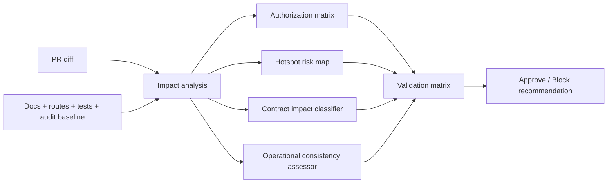

# Solution Architecture
## 1. Architecture summary
The proposed solution is a planning and governance layer for merge-readiness that respects the current layered monolith. It does not redesign runtime architecture. Instead, it adds a specification-driven review workflow that derives risk, required validations and documentation sync obligations from the real PR diff and the current repository baseline.

## 2. Design goals
- Use the smallest safe change to improve merge safety.
- Reuse existing docs, tests and scripts already present in the repository.
- Make authorization ownership explicit for touched endpoints.
- Detect contractual and operational regressions before merge.
- Separate minimum checks from expanded checks.
- Block analysis when mandatory evidence is missing.

## 3. Proposed components
1. **PR impact analyzer specification**
   - A planning artifact or future script/process that maps changed files to modules, endpoints, contracts and hotspots.
2. **Pre-merge checklist classifier**
   - A ruleset that selects minimum and expanded commands from changed file paths.
3. **Authorization matrix generator**
   - A ruleset/document that maps affected endpoints to route middleware, access policy, service checks and tenant scope.
4. **Hotspot risk assessor**
   - A ruleset focused on sensitive files such as `inventory.service.js`, `agent-workspace.service.js`, `product.service.js`, `access-policies.js`, `src/public/root/**` and `src/public/styles.css`.
5. **Contract impact classifier**
   - A decision layer using runtime catalog, contract manifest and critical contract matrix.
6. **Operational consistency assessor**
   - A ruleset for DB+filesystem, pagination and build/baseline-sensitive changes.
7. **Validation matrix**
   - A single output listing minimum and expanded tests/commands required for the actual diff.

## 4. Responsibilities
| Component | Responsibility |
|---|---|
| PR impact analyzer | Freeze actual changed scope from diff; identify touched modules, routes, endpoints and hotspots |
| Pre-merge checklist classifier | Select required commands by changed surface |
| Authorization matrix generator | Ensure every changed endpoint has explicit auth ownership |
| Hotspot risk assessor | Raise risk and require finer task fragmentation for sensitive files |
| Contract impact classifier | Decide whether a change is non-contractual, internal-contractual or externally observable |
| Operational consistency assessor | Review DB+filesystem, pagination, Prisma/build and baseline operational risks |
| Validation matrix | Provide runnable minimum vs expanded checks for implementation/review |

## 5. Proposed data flow

## 6. Domain changes
No production domain model changes are proposed. The domain change is governance-only: formalizing how merge risk is analyzed and documented.

## 7. API changes
No runtime API change is proposed by the planning package itself.

If implementation later adds tooling, it should avoid changing application endpoints. Any outputs should be generated as documentation artifacts or internal CI/process helpers.

## 8. Database changes
No database changes are proposed.

## 9. Validation and business rules
### 9.1 PR impact-freezing procedure
1. **Collect the real changed-file set** from the PR diff or an equivalent reviewed changed-file list.
2. **Normalize each changed path** into one or more affected surfaces:
   - runtime route surface;
   - middleware/security surface;
   - service/use-case surface;
   - repository/persistence surface;
   - browser runtime surface;
   - governance/docs/contracts surface;
   - operational/build surface.
3. **Map changed paths to mounted modules** using `src/app.js` as the router-mount source of truth.
4. **Derive affected endpoints** from the mounted route file plus `docs/runtime-endpoint-catalog.md`.
5. **Classify contract exposure** against `docs/runtime-endpoint-catalog.md`, `docs/runtime-contract-manifest.json`, `docs/critical-contract-matrix.json`, `docs/current-state.md`, and `docs/architecture.md`.
6. **Detect hotspot overlap** against the baseline hotspot set:
   - `src/services/inventory.service.js`
   - `src/services/agent-workspace.service.js`
   - `src/services/product.service.js`
   - `src/security/access-policies.js`
   - `src/public/root/**`
   - `src/public/styles.css`
7. **Assign merge risk** as low, medium, or high using the heuristics below.
8. **Emit a blocked result instead of an exact impact map** when the real diff is unavailable.

### 9.2 Path-to-surface mapping rules
| Changed path pattern | Primary impacted module | Endpoint discovery source | Extra review notes |
|---|---|---|---|
| `src/routes/*.routes.js` | Mounted HTTP route module | `src/app.js` + route file + runtime endpoint catalog | Direct endpoint impact; authorization review required |
| `src/middlewares/authenticate.js` | Authentication boundary | All protected routes in `src/app.js` + endpoint catalog | Treat as cross-cutting auth risk |
| `src/middlewares/authorize*.js` | Authorization boundary | Protected routes using the middleware + endpoint catalog | Rebuild authorization matrix for touched endpoints |
| `src/security/access-policies.js` | Access-policy facade / policy entrypoint | Routes using `authorizeAccessPolicy(...)` + endpoint catalog | Baseline hotspot |
| `src/services/*.js` | Application/business flow | Caller route files, service consumers, endpoint catalog | Check hidden service-level auth/scope ownership |
| `src/repositories/*.js` | Persistence adapter | Calling services + affected route surface | Review transactional and tenant-scope effects |
| `src/public/root/**` | Root shell/browser runtime | `docs/current-state.md`, `docs/architecture.md`, runtime validators | Baseline hotspot; may be observable without API change |
| `src/public/styles.css` | Shared browser presentation | Root/public runtime docs and E2E/runtime tests | Baseline hotspot; visual/runtime regression risk |
| `docs/runtime-*`, `docs/critical-contract-matrix.json`, `docs/current-state.md`, `docs/architecture.md` | Contract/documentation governance | Contract artifacts themselves | Review for contract classification drift |
| `prisma/**`, `scripts/**`, `Dockerfile`, `docker-compose*.yml`, `.env*.example`, `src/routes/health.routes.js`, browser-session files | Build and operational baseline | Production/readiness docs and validators | Elevate operational risk |

### 9.3 Risk heuristics
#### Low risk
Apply when all of the following are true:
- no hotspot is touched;
- no auth/security boundary is touched;
- no route contract or browser-runtime contract is affected;
- no persistence, Prisma, build, deployment, or readiness asset is affected;
- change is limited to low-impact docs or isolated governance text.

#### Medium risk
Apply when any of the following is true and no high-risk trigger applies:
- a route file, service, repository, or contract artifact is touched for a bounded module;
- tenant-owned data flows are affected but auth ownership is unchanged and traceable;
- a list endpoint or payload shape may be indirectly affected;
- documentation or contract artifacts for mounted runtime are changed without hotspot overlap.

#### High risk
Apply when any of the following is true:
- any baseline hotspot is touched;
- `authenticate.js`, `authorize*.js`, or `src/security/access-policies.js` is touched;
- multiple layers for the same sensitive flow are touched together, such as route + service + repository;
- Prisma schema, migrations, build scripts, Docker, env, health, readiness, or browser-session infrastructure is touched;
- DB + filesystem flows, payment receipts, or client documents are touched;
- observable browser runtime under `src/public/root/**` or `src/public/styles.css` is touched;
- the change spans many files across unrelated modules and cannot be reviewed as a small bounded slice.

### 9.4 Required output shape for future PR analysis
For a real PR diff, the impact map output must include at minimum:
- changed file list;
- affected modules;
- mounted route files and derived endpoints;
- affected contract artifacts;
- hotspot matches;
- risk classification (`low`, `medium`, `high`);
- blocked/partial/complete analysis state with rationale.

### 9.5 Baseline rules preserved
- Treat missing PR diff as a hard blocker for exact impact classification.
- Map touched files to routes/endpoints using `src/app.js`, `src/routes/*.routes.js` and `docs/runtime-endpoint-catalog.md`.
- For changed endpoints, identify whether effective security lives in:
  - `authenticate`
  - `authorize`
  - `authorizePermission`
  - `authorizeAccessPolicy`
  - service-level scope checks
- If a hotspot is touched, require expanded tests and task fragmentation.
- Use `docs/runtime-contract-manifest.json` to distinguish OpenAPI-covered vs intentionally excluded routes.
- Use file-path heuristics for operational checks:
  - `src/security/**`, auth middleware, protected routes -> auth characterization
  - `src/public/root/**`, `src/public/styles.css` -> root shell/public runtime checks
  - `src/services/payment*.js`, `src/services/client.service.js`, storage libs -> DB+filesystem checks
  - `prisma/**`, `scripts/**`, `package.json`, Docker/env/health/session code -> build and operational baseline checks

### 9.6 Contract impact classification
For every real PR touching runtime, contract, or browser-runtime surfaces, the merge-readiness output must classify the change as exactly one of:
- `sin cambio contractual`
- `cambio contractual interno`
- `cambio contractual observable`

The classification is a planning/governance conclusion only. It does not itself change runtime behavior.

#### 9.6.1 Authoritative evidence sources
Contract classification must use these sources together, not in isolation:
- `docs/runtime-endpoint-catalog.md`
- `docs/runtime-contract-manifest.json`
- `docs/critical-contract-matrix.json`
- `docs/current-state.md`
- `docs/architecture.md`
- mounted routes and runtime wiring from `src/app.js` plus the touched route files when endpoint ownership must be confirmed

Use them with this precedence for contractual classification:
1. mounted runtime behavior from `src/app.js` and touched route/runtime files;
2. `docs/runtime-endpoint-catalog.md` as the endpoint inventory baseline;
3. `docs/runtime-contract-manifest.json` to distinguish OpenAPI-covered versus intentionally excluded runtime surfaces;
4. `docs/critical-contract-matrix.json` for the minimum critical contract slice that must not drift silently;
5. `docs/current-state.md` and `docs/architecture.md` for observable behavior and governance context.

#### 9.6.2 Classification definitions
##### `sin cambio contractual`
Use this when the touched change does not alter the observable runtime contract and does not alter internal runtime-governance artifacts in a way that changes expected consumers, reviewers, or operators.

Typical examples:
- comment-only or documentation-only edits outside authoritative runtime/contract descriptions;
- internal cleanup that preserves endpoint shape, mounted paths, auth-visible behavior, payload shape, status semantics, browser runtime behavior, and critical operational expectations;
- test-only or governance-only changes that do not revise authoritative runtime claims.

##### `cambio contractual interno`
Use this when the change affects contract-governance or runtime interpretation inside the repository boundary, but is not yet externally observable to supported consumers.

Typical examples:
- updating contract/governance artifacts to better reflect existing runtime reality without changing runtime behavior;
- changing internal route/service wiring or implementation details while preserving mounted endpoint shape, status semantics, and supported browser/runtime behavior;
- adjusting intentionally excluded runtime/governance artifacts where the supported consumer-facing behavior remains unchanged but the repository's internal contract analysis must be refreshed.

This classification still requires documentation and test review because silent drift inside contract artifacts can mislead future PR analysis.

##### `cambio contractual observable`
Use this when a supported consumer or supported browser/runtime surface can observe a meaningful contract difference.

Observable differences include any change to:
- mounted route path, HTTP method, or endpoint availability;
- request validation expectations, required fields, accepted shapes, or auth-visible request prerequisites that consumers must satisfy;
- response shape, response semantics, status-code behavior, pagination semantics, or masking/404 behavior that consumers rely on;
- supported browser runtime under `src/public/root/**` or shared presentation/runtime contract under `src/public/styles.css` when behavior visible to users changes;
- critical contract slices documented in `docs/critical-contract-matrix.json`.

If a change is observable, the merge plan must require authoritative documentation and related tests to be updated before approval.

#### 9.6.3 OpenAPI-covered vs intentionally excluded surfaces
Use `docs/runtime-contract-manifest.json` to separate these cases:
- **OpenAPI-covered runtime surface**
  - a touched endpoint or runtime behavior is represented by the contract governance model and must be reviewed for spec/runtime consistency.
- **Intentionally excluded runtime surface**
  - the endpoint or browser runtime is intentionally outside partial OpenAPI coverage, but it is still a supported runtime surface and may still be contractually observable.

Important rule:
- exclusion from OpenAPI does **not** mean `sin cambio contractual`.
- the embedded browser runtime under `src/public/root/**` and related shared styles can still be `cambio contractual observable` even when they are governed outside OpenAPI.

#### 9.6.4 Classification procedure
For each touched route, runtime surface, or contract artifact:
1. identify the mounted runtime surface from `src/app.js`, touched route files, or supported browser runtime entrypoints;
2. check whether the surface is represented in `docs/runtime-endpoint-catalog.md`;
3. use `docs/runtime-contract-manifest.json` to determine whether the surface is OpenAPI-covered or intentionally excluded;
4. compare the touched behavior against `docs/critical-contract-matrix.json` to detect critical contract drift;
5. compare with `docs/current-state.md` and `docs/architecture.md` to decide whether supported observable behavior changes;
6. classify the result as one of the three allowed states;
7. if evidence is missing or the real diff is unavailable, emit `blocked` or `partial` instead of inventing a precise classification.

#### 9.6.5 Decision heuristics
| Condition | Classification |
|---|---|
| Only non-authoritative docs or isolated governance text changed; no supported runtime surface changed | `sin cambio contractual` |
| Runtime/governance artifacts or internal implementation changed, but mounted behavior and supported browser/runtime behavior remain the same | `cambio contractual interno` |
| Supported endpoint behavior, supported browser runtime behavior, critical contract slice, or consumer-visible status/payload semantics changed | `cambio contractual observable` |
| Evidence missing or diff unavailable | `blocked` / `partial`, not a fabricated classification |

#### 9.6.6 Required PR-review output for contract classification
For each touched contractual surface in a real PR review, record at minimum:
| Field | Meaning |
|---|---|
| Touched file / surface | The changed path or supported runtime surface |
| Mounted runtime scope | Route family, endpoint family, or browser runtime area |
| Contract source references | Which of the authoritative sources were consulted |
| OpenAPI status | `covered`, `intentionally-excluded`, or `not-applicable` |
| Critical contract impact | Whether `docs/critical-contract-matrix.json` is affected |
| Classification | `sin cambio contractual`, `cambio contractual interno`, or `cambio contractual observable` |
| Required follow-up | Docs/tests/artifacts that must be refreshed before approval |
| Analysis state | `complete`, `partial`, or `blocked` |

#### 9.6.7 Mandatory documentation-sync rules
When a real PR changes supported runtime behavior, runtime-governance artifacts, or roadmap-tracked architectural direction, the merge-readiness output must state exactly which documentation artifacts must be refreshed before approval.

Core rules:
- never describe roadmap intent as already implemented behavior;
- never update `docs/current-state.md` with desired future state that is not yet present in the repository/runtime;
- never update `docs/action-plan.md` or `docs/tasks.md` as if they were authoritative runtime truth;
- if a change is classified as `cambio contractual observable`, documentation refresh is mandatory before approval;
- if the diff is missing, documentation-sync output may define the rules but must not claim a PR-specific doc update list.

#### 9.6.8 Documentation update matrix by change type
| Change type / touched surface | Must update | Conditionally update | Must not misuse |
|---|---|---|---|
| `sin cambio contractual` with no supported runtime drift | None required by default; keep existing docs unchanged | Relevant spec/review notes only if governance reasoning needs recording | Do not create fake runtime doc churn for unchanged behavior |
| `cambio contractual interno` affecting contract/governance artifacts only | The touched contract/governance artifacts themselves, such as `docs/runtime-endpoint-catalog.md`, `docs/runtime-contract-manifest.json`, `docs/critical-contract-matrix.json` | `docs/current-state.md` or `docs/architecture.md` only if they currently describe the internal governance model inaccurately | Do not present internal governance refresh as external consumer-visible behavior |
| `cambio contractual observable` for mounted API/runtime behavior | `docs/current-state.md`; authoritative contract artifacts touched by the surface; relevant OpenAPI/runtime-contract artifacts when applicable | `docs/architecture.md` if the implemented runtime structure, supported surface ownership, or architectural responsibilities changed materially | Do not leave observable behavior changed without authoritative runtime docs/tests updates |
| Supported browser runtime changes under `src/public/root/**` or `src/public/styles.css` | `docs/current-state.md` when user-visible supported behavior changes; any runtime-contract/governance artifacts that track the supported browser surface | `docs/architecture.md` if shell/module ownership or supported runtime boundaries changed materially | Do not assume OpenAPI exclusion removes the need for documentation refresh |
| Roadmap / implementation-plan-only change with no implemented runtime change | `docs/action-plan.md` and/or `docs/tasks.md` when the roadmap itself is the changed artifact | Feature-spec planning docs when the change is local to the spec package | Do not update `docs/current-state.md` or `docs/architecture.md` as though runtime behavior already exists |
| Architecture responsibility or module-boundary clarification backed by implemented code | `docs/architecture.md` | `docs/current-state.md` if observable behavior or supported operational ownership also changed | Do not rewrite architecture docs as speculative future design |

#### 9.6.9 Documentation artifact roles
Use each documentation artifact for its intended purpose:
- `docs/current-state.md`
  - authoritative description of what is actually implemented and supported now.
- `docs/architecture.md`
  - authoritative description of the implemented architecture, runtime ownership boundaries, and material design constraints.
- `docs/action-plan.md`
  - roadmap / follow-up work planning, not proof that behavior is already implemented.
- `docs/tasks.md`
  - work tracking and execution backlog, not authoritative runtime behavior.
- `docs/runtime-endpoint-catalog.md`
  - endpoint inventory and mounted runtime surface baseline.
- `docs/runtime-contract-manifest.json`
  - machine-readable governance record separating covered versus intentionally excluded runtime surfaces.
- `docs/critical-contract-matrix.json`
  - minimum critical contract slice that must stay aligned with supported runtime behavior.

#### 9.6.10 Documentation-sync output shape for PR review
For each real PR requiring documentation refresh, record at minimum:
| Field | Meaning |
|---|---|
| Touched runtime or governance surface | Changed file/path or supported runtime area |
| Contract classification | `sin cambio contractual`, `cambio contractual interno`, or `cambio contractual observable` |
| Required docs to update | Exact docs/artifacts that must be refreshed before approval |
| Why each doc changes | Current-state, architecture, contract artifact, or roadmap rationale |
| Tests/validators tied to the doc change | Existing governance/contract tests that should be run |
| Prohibited documentation mistake | Example: documenting roadmap as implemented or omitting observable runtime changes |
| Analysis state | `complete`, `partial`, or `blocked` |

### 9.7 Large-service safe-change strategy
When a real PR touches a large service hotspot, the merge-readiness output must treat the change as a bounded behavioral slice, not as a free-form refactor. This strategy is additive governance only; it does not force a runtime redesign.

#### 9.7.1 Prohibited large-service proposal shapes
The following proposal shapes must be marked unsafe unless an approved amendment explicitly justifies them:
- sweeping multi-capability edits inside one large service without a per-capability split;
- mixing structural cleanup, naming cleanup, file moves, and behavior changes in the same fragment;
- broad reinterpretation of current behavior without characterization or equivalent existing regression evidence;
- cross-module batching such as route + service + repository + policy rewrites for multiple unrelated flows in one fragment;
- hotspot edits that cannot identify one bounded use case and its validation evidence.

#### 9.7.2 Mandatory fragmentation rules
For every touched large service hotspot:
1. split the review plan by one bounded use case or policy seam at a time;
2. describe the preserved behavior expectation for that fragment before proposing cleanup or reshaping;
3. attach at least one validation item to each fragment, using existing characterization or regression suites first;
4. keep structural-only work separate from functional behavior changes unless the repository cannot support separation and that limitation is documented;
5. if the changed code spans multiple independent capabilities, require multiple fragments even when the files are the same.

#### 9.7.3 Characterization-first rule
If a fragment changes logic inside a large service and current behavior is not trivially obvious from the route boundary alone, characterization or equivalent existing regression evidence must be identified before approving a broad rewrite proposal.

Allowed evidence sources include:
- existing characterization tests already listed in the validation matrix;
- adjacent tenant-scope, contract, or browser-runtime regression tests that exercise the touched behavior;
- explicit current-state documentation when no stronger executable evidence exists, provided the resulting gap is documented honestly.

Do not claim coverage that the repository does not actually have.

#### 9.7.4 Fragment output shape
Each proposed fragment for a large service must record at minimum:
| Field | Meaning |
|---|---|
| Hotspot | Touched large-service path |
| Fragment name | One bounded use case or policy seam |
| Preserved behavior | Observable behavior expected to remain stable |
| Change type | `structural-only`, `behavioral`, or `mixed-with-justification` |
| Callers / affected routes | Known route files, services, or policies that rely on the fragment |
| Minimum validation | Required baseline commands plus the closest regression or characterization evidence |
| Expanded validation | Additional suites when the hotspot risk map indicates elevated coupling |
| Blocking reason if not fragmentable | Why the proposal must stop or be amended |

#### 9.7.5 Service-specific fragmentation baselines
| Large service hotspot | Preferred fragment seams | Minimum validation expectation per fragment | Blocking indicators |
|---|---|---|---|
| `src/services/inventory.service.js` | alerts, stocks, movements, entries, lots, QA, adjustments, inventory-order interaction seams | baseline commands + `tests/inventory-alerts-tenant-scope.test.js`; add order/inventory characterization when route or contract behavior is involved | one fragment tries to rewrite several inventory capabilities together; stock mutation and structural cleanup are mixed without preserved-behavior notes |
| `src/services/agent-workspace.service.js` | dashboard visibility, route debt, store debt, invoice summary, payment summary, actor-scope guardrails | baseline commands + closest auth characterization from the authorization plan; document current agent-scope test gap when applicable | authenticate-only route behavior is being reinterpreted without service-scope evidence; multiple actor-scope rules are changed together without split validation |
| `src/services/product.service.js` | catalog visibility, product mutation, pricing-adjacent behavior, inventory-adjacent product effects, tenant-scope rules | baseline commands + product-route or tenant-scope regression evidence relevant to the touched use case | catalog refactor, pricing behavior, and inventory side effects are bundled together; no bounded validation is assigned |

#### 9.7.6 Review decision rule for large services
- If the proposal is already split into bounded fragments with explicit preserved behavior and validation per fragment, it may proceed through normal hotspot review.
- If the proposal touches a large service hotspot but remains a broad multi-capability rewrite, mark the review output as at least high risk and require fragmentation before approval.
- If the proposal cannot be fragmented without changing architecture or inventing behavior, stop and request a specification amendment instead of silently widening scope.

### 9.8 DB + filesystem operational consistency review
When a real PR touches client-document flows, payment-receipt flows, protected file download paths, or the storage helpers they depend on, the merge-readiness output must include an explicit DB+filesystem consistency review.

This review is mandatory because the repository relies on manual compensation rather than an atomic distributed transaction across database and private file storage.

#### 9.8.1 Activation criteria
Activate this review when the diff touches any of these surfaces:
- `src/services/client.service.js`
- `src/services/payment.service.js`
- `src/services/payment-receipt-evidence.service.js`
- private file-storage helpers such as `src/lib/client-document-storage.js` or `src/lib/payment-receipt-storage.js`
- repository methods that create, replace, delete, or fetch client-document/payment-receipt metadata
- protected download endpoints for client documents or payment receipts

#### 9.8.2 Required review matrix
For each touched DB+filesystem flow, record at minimum:
| Field | Meaning |
|---|---|
| Flow | Business flow under review |
| DB write | Record created/updated/deleted in the database |
| Filesystem write | Private file operation performed on disk |
| Rollback / compensation path | Existing cleanup behavior when one side fails |
| Partial-failure mode | Residual inconsistency risk if compensation also fails |
| Access boundary | Route/service ownership that protects the file-backed resource |
| Minimum validation | Existing tests or commands that must run |
| Additional evidence needed | Operational/log/manual evidence still required before approval |

#### 9.8.3 Baseline sensitive-flow matrix
| Flow | DB write | Filesystem write | Rollback / compensation path | Partial-failure mode | Access boundary | Minimum validation | Additional evidence needed |
|---|---|---|---|---|---|---|---|
| Client document upload in `src/services/client.service.js` | `createClientDocument(...)` reserves/persists metadata before file persistence | `fs.mkdir(...)` + `fs.writeFile(...)` through `persistPrivateClientDocumentFile(...)` into private storage | On file-write failure, `deleteClientDocument(documentId, clientId, companyId)` is attempted | If DB cleanup also fails, metadata may remain without a file and the service returns controlled 500 cleanup-failure error | company-scoped service lookup via `findCompanyClientById(...)`; protected download path from `buildProtectedClientDocumentUrl(...)` and download lookup by tenant/client/document | `node --test tests/client-document-security.test.js tests/client-document-governance.test.js` | If PR changes cleanup order, storage root, or repository delete semantics, require explicit compensation-path review notes and failure-mode evidence |
| Payment receipt creation in `src/services/payment.service.js` + `src/services/payment-receipt-evidence.service.js` | transactional `createPayment(...)` plus `createPaymentReceipt(...)` metadata | `fs.mkdir(...)` + `fs.writeFile(...)` through `persistPaymentReceiptFile(...)` into private storage | If receipt creation flow throws after file persistence, cleanup attempts `deletePaymentReceiptFile(...)`; transaction boundary protects DB writes when the DB side fails first | If file cleanup also fails after persistence, private orphan file risk remains and the service returns controlled 500 cleanup-failure error | company scope via `assertCompanyScope(auth)`; read scope via `resolvePaymentReadScope(auth)`; protected receipt URL from `buildProtectedPaymentReceiptUrl(...)` | `node --test tests/payment-receipt-security.test.js tests/payment-tenant-scope.test.js` | If PR changes transaction boundary, storage reference generation, or file cleanup path, require explicit review of orphan-file handling and transactional assumptions |
| Payment receipt replacement in `src/services/payment-receipt-evidence.service.js` | transactional `markPaymentReceiptsAsReplaced(...)` + `createPaymentReceipt(...)` for the new current receipt | writes the new private file; historical file references remain governed by metadata state | On post-write failure, cleanup attempts `deletePaymentReceiptFile(...)` for the newly written file | If cleanup fails, the new file can remain even when the intended replacement flow did not complete cleanly; metadata/file-history interpretation must be reviewed | same payment auth boundary as receipt creation; protected receipt download remains company-scoped and ownership-scoped | `node --test tests/payment-receipt-security.test.js tests/payment-tenant-scope.test.js` | If PR changes replacement semantics, old-file retention policy, or receipt history behavior, require explicit note on whether legacy files remain intentionally or need extra cleanup |
| Protected file download for client documents or payment receipts | no new DB write by default; DB metadata lookup gates access | `fs.access(...)` and later stream/read from private path | no rollback because it is read-only; the key check is controlled failure when metadata exists but file is missing | missing file with existing metadata returns controlled error/not-found path rather than leaking storage internals; stale metadata remains an operational cleanup concern | tenant/company-scoped metadata lookup in service methods before absolute path resolution | `node --test tests/client-document-security.test.js tests/payment-receipt-security.test.js` | If PR changes download path resolution or error mapping, require explicit proof that missing-file and cross-tenant denial behavior remain controlled |

#### 9.8.4 Review rules
- Treat DB+filesystem changes as at least medium risk, and high risk when payment receipts, protected file downloads, or both DB and storage helpers are touched together.
- Require characterization or equivalent regression evidence for success and partial-failure paths when the touched flow already has such tests.
- If a PR changes compensation logic, reviewers must record whether the resulting failure mode is improved, preserved, or newly widened.
- If no existing test covers the specific failure path, document the gap explicitly and request targeted evidence instead of assuming atomic safety.
- Do not claim atomic rollback across DB and filesystem unless the repository actually introduces such a mechanism and the specification is amended accordingly.

#### 9.8.5 Missing-diff behavior
Without the real diff, the spec may define the baseline matrix and activation rules, but it must not claim that a specific PR changed a particular DB+filesystem flow.

### 9.9 Sensitive list and pagination review
When a real PR touches list endpoints, list services, list repositories, `src/lib/pagination.js`, or heavy-endpoint payload shaping, the merge-readiness output must include an explicit list/pagination review.

This review is mandatory because the repository mixes optional pagination, fully unpaginated list endpoints, and heavy list/detail payloads whose consumer contract is already relied on by UI and service integrations.

#### 9.9.1 Activation criteria
Activate this review when the diff touches any of these surfaces:
- `src/lib/pagination.js`
- any route using `parsePaginationQuery(...)`
- any service using `buildPaginatedResponse(...)`
- list repository methods that accept optional pagination objects or return unpaginated collections
- `src/lib/heavy-endpoint-governance.js` or related heavy-endpoint baseline artifacts
- list endpoints or heavy read endpoints such as `/api/clients/*`, `/api/payments/*`, `/api/inventory/*`, `/api/invoices/*`, `/api/products/*`, `/api/users/*`, `/api/roles/company`, `/api/warehouses/company`, or `/api/agent/*`

#### 9.9.2 Required review matrix
For each touched list or heavy read endpoint, record at minimum:
| Field | Meaning |
|---|---|
| Endpoint | Route or route family under review |
| Current response shape | Current collection contract such as array, `{ items, pagination }`, `{ summary, stores }`, or split collections |
| Current pagination state | `supports optional pagination`, `unpaginated`, or `not a list` |
| Consumer sensitivity | Why consumers may depend on the current shape, size, or ordering |
| Default decision if touched | `preserve contract`, `harden in another PR`, or `block` |
| Blocking triggers | Changes that must not pass without stronger evidence or a separate approved scope |
| Minimum validation | Existing tests or commands that must run |
| Additional evidence needed | Consumer-impact proof, payload evidence, or follow-up work still required |

#### 9.9.3 Decision rules
- **Preserve contract** when the PR keeps the current response shape, optional-vs-required pagination semantics, tenant/actor scope behavior, and practical payload expectations.
- **Harden in another PR** when the current endpoint is known to be heavy or fully unpaginated, but the proposed change would otherwise bundle consumer-visible pagination/payload hardening with unrelated work.
- **Block** when the PR removes existing pagination support, changes response shape for a list endpoint without explicit consumer analysis, or materially widens payload size/richness on an already sensitive endpoint without equivalent validation.
- Treat removal of pagination metadata, default page-size changes, or changing "optional pagination" into "always paginated" as observable contract changes unless proven otherwise.
- Treat newly added nested collections, summary objects, or deep serialization in list responses as payload-risk changes even if the top-level route path stays the same.

#### 9.9.4 Baseline sensitive endpoint matrix
| Endpoint | Current response shape | Current pagination state | Consumer sensitivity | Default decision if touched | Blocking triggers | Minimum validation | Additional evidence needed |
|---|---|---|---|---|---|---|---|
| `GET /api/clients/` via `clientService.listClients(...)` | array without query params; `{ items, pagination }` when `page`/`pageSize` are supplied | supports optional pagination | legacy alias plus tenant-scoped client listing; nested client serialization and UI dependencies | preserve contract | removing optional pagination, changing alias semantics, or widening client payload without consumer review | `node --test tests/pagination.test.js tests/client-tenant-scope.test.js tests/heavy-endpoint-governance.test.js` | if payload grows, record why alias consumers remain safe or defer the change |
| `GET /api/clients/company` via `clientService.listCompanyClients(...)` | array without query params; `{ items, pagination }` when paginated | supports optional pagination | company-admin/UI list dependency and heavy-endpoint baseline coverage | preserve contract | changing optional pagination semantics, removing `items/pagination` structure, or adding deeper nested payloads | `node --test tests/pagination.test.js tests/client-tenant-scope.test.js tests/heavy-endpoint-governance.test.js` | if hardening is desired, schedule separate PR with consumer sign-off |
| `GET /api/payments/` via `paymentService.listPayments(...)` | array without query params; `{ items, pagination }` when paginated | supports optional pagination | company/own-scope filtering plus receipt metadata serialization | preserve contract | removing pagination support, changing list scope semantics, or adding heavier receipt/history payloads to each item | `node --test tests/pagination.test.js tests/payment-tenant-scope.test.js tests/heavy-endpoint-governance.test.js` | if payload expands, require explicit note on read-scope and receipt-metadata impact |
| `GET /api/invoices/` via `invoiceService.listInvoices(...)` | array without query params; `{ items, pagination }` when paginated | supports optional pagination | tenant-scoped financial list consumed by admin/sales flows | preserve contract | changing pagination defaults/shape, altering tenant-scoped list semantics, or attaching heavier nested detail per invoice row | `node --test tests/pagination.test.js tests/invoice-tenant-scope.test.js` | if consumer-visible invoice row shape changes, require contract-classification output too |
| `GET /api/products/` via `productService.listProducts(...)` | array without query params; `{ items, pagination }` when paginated | supports optional pagination | permission-aware serialization can already vary by actor permissions | preserve contract | forcing mandatory pagination, widening product row payload, or changing permission-aware serialization in list mode without review | `node --test tests/pagination.test.js` | if serialization changes, record permission-sensitive consumer impact explicitly |
| `GET /api/inventory/movements` via `inventoryService.listMovements(...)` | array without query params; `{ items, pagination }` when paginated | supports optional pagination | operational movement history with filters and possible hotspot coupling to inventory flows | preserve contract | changing filter+pagination interaction, removing optional pagination, or widening row payload substantially | `node --test tests/pagination.test.js` | if inventory hotspot code is touched, also activate hotspot review and related inventory regression evidence |
| `GET /api/inventory/alerts` via `inventoryService.listInventoryAlerts(...)` | array without query params when repository returns array; `{ items, pagination }` when paginated | supports optional pagination | permission-sensitive alert workload with filters and tenant scope | preserve contract | changing permission-sensitive alert list shape, filter semantics, or pagination behavior without equivalent tenant/permission evidence | `node --test tests/pagination.test.js tests/inventory-alerts-tenant-scope.test.js` | if alert serialization expands, require note on operator workflow and permission impact |
| `GET /api/users/`, `GET /api/users/company`, `GET /api/roles/company`, `GET /api/warehouses/company` | array without query params; `{ items, pagination }` when paginated for the corresponding list route | supports optional pagination | admin/root UI dependencies and paginated metadata already covered in service tests | preserve contract | removing pagination metadata, forcing a different collection envelope, or widening row payload in governance/admin surfaces without docs review | `node --test tests/pagination.test.js` | if route is also contract-governed in docs, activate contract/documentation review |
| `GET /api/inventory/stocks` via `inventoryService.listStocks(...)` | `{ items, lots }` split collections | unpaginated | heavy inventory snapshot with dual collections already governed as a heavy endpoint | harden in another PR | adding more nested collections, widening stock+lot payload, or trying to introduce pagination together with unrelated inventory changes | `node --test tests/heavy-endpoint-governance.test.js` | if pagination hardening is proposed, isolate it in a dedicated PR with payload before/after evidence |
| `GET /api/invoices/inconsistencies` via `invoiceService.listInvoiceDebtInconsistencies(...)` | `{ summary, invoices }` | unpaginated | root/admin financial inconsistency review with summary coupling and potentially large invoice sets | harden in another PR | adding more summary dimensions plus larger invoice rows, or changing to paginated output inside an unrelated financial change | `node --test tests/invoice-tenant-scope.test.js tests/heavy-endpoint-governance.test.js` | if hardening is proposed, require explicit consumer/UI review because summary + collection shape is currently coupled |
| `GET /api/agent/stores`, `GET /api/agent/goals`, `GET /api/agent/visits` | `{ summary, stores }`, `{ goals }`, or `{ visits }` style full collections | unpaginated | actor-scoped mobile/agent workflows and service-owned authorization make payload growth harder to reason about | harden in another PR | increasing collection depth, adding nested financial/inventory payloads, or introducing pagination while changing actor-scope behavior in the same PR | `node --test tests/agent-workspace-tenant-scope.test.js tests/heavy-endpoint-governance.test.js` | document existing agent-scope characterization gap if the touched change depends on service-owned actor filtering |
| `GET /api/agent/stores/:storeId` and similar heavy read/detail endpoints | deep object such as store detail with purchase history and sellable product snapshot | not a list but payload-sensitive | heavy detail payload is governed because nested size/cost can drift without route-path change | block | turning detail endpoints into broader aggregate payloads without explicit heavy-endpoint analysis | `node --test tests/heavy-endpoint-governance.test.js` | if detail payload widens materially, require payload evidence and consumer review before approval |

#### 9.9.5 Review rules
- If the real diff touches `src/lib/pagination.js`, treat the PR as at least medium risk and require endpoint-by-endpoint analysis for all directly affected consumers.
- If the real diff touches any endpoint already cataloged in `src/lib/heavy-endpoint-governance.js`, require the review output to mention whether payload class, response shape, or cost drivers changed.
- For endpoints with optional pagination today, do not assume consumers always send `page`/`pageSize`; preserve both code paths unless an approved contract change says otherwise.
- For endpoints without pagination today, the merge-readiness output must explicitly say whether the PR preserves the current unpaginated contract, defers hardening, or must be blocked.
- If a PR increases payload size or nested depth for an unpaginated endpoint, mark it as at least medium risk and high risk when the endpoint is also a hotspot or heavy-endpoint-governed surface.
- If no existing test covers the touched list shape, document the gap instead of claiming pagination or payload safety by inspection alone.

#### 9.9.6 Missing-diff behavior
Without the real diff, the spec may define baseline sensitive endpoints and decision rules, but it must not claim that a concrete PR preserved, deferred, or blocked a specific list endpoint.

### 9.10 Multiplatform build and operational-baseline review
When a real PR touches Prisma, schema, scripts, build, Docker, environment examples, health/readiness, browser-session store infrastructure, or deployment-governance artifacts, the merge-readiness output must include an explicit build/operational-baseline review.

This review is mandatory because the repository has a documented Windows/Prisma fragility, split workflow ownership between the application root and the hosted-repository root, and a production baseline that depends on validators plus operational smoke evidence rather than on runtime code inspection alone.

#### 9.10.1 Activation criteria
Activate this review when the diff touches any of these surfaces:
- `prisma/**`
- `scripts/**` related to build, Prisma, workflow validation, restore readiness, or operational readiness
- `package.json` when scripts, engines, build dependencies, Prisma versions, or operational validators change
- `Dockerfile`
- `docker-compose*.yml`
- `.env*.example`
- `src/routes/health.routes.js`
- browser-session store infrastructure or session baseline wiring
- `docs/production-baseline.md`, `docs/production-operations-runbook.md`, `docs/restore-readiness-baseline.md`

#### 9.10.2 Required review matrix
For each touched build/baseline-sensitive surface, record at minimum:
| Field | Meaning |
|---|---|
| Touched surface | File or file family under review |
| Operational contract | What baseline or workflow expectation the surface currently owns |
| Risk elevation | `medium` or `high`, with rationale |
| Mandatory validators | Repository commands that must run |
| Additional evidence needed | Docker/compose/manual/workflow evidence still required before approval |
| Workflow ownership note | Whether evidence comes from `inventory-api/` or parent-root `.github/workflows/` |
| Windows/Prisma note | Whether the documented Windows risk is implicated, preserved, or widened |

#### 9.10.3 Baseline gate matrix
| Touched surface | Operational contract | Risk elevation | Mandatory validators | Additional evidence needed | Workflow ownership note | Windows/Prisma note |
|---|---|---|---|---|---|---|
| `prisma/**`, Prisma version changes, `scripts/prisma-*`, or `package.json` build/dependency changes | Prisma client generation, schema compatibility, committed migration execution path, and multiplatform build expectations | high | `npm run build`, `npm run validate:production-baseline`, `npm run validate:workflow-baseline` | if the diff changes schema/build behavior, request evidence that the parent-root `windows-prisma-build.yml` lane remains applicable or that equivalent Windows evidence exists; when operational baseline files also change, add restore/operational validators | workflow evidence resolves from parent-root `.github/workflows/`, not `inventory-api/.github/workflows/` | treat Windows/Prisma instability as open; do not claim closure from Linux-only local success |
| `Dockerfile`, `docker-compose.prod.yml`, deployment scripts, or `.env.production.example` | production image contract, compose smoke contract, required production variables, and deploy/readiness baseline | high | `npm run validate:production-baseline`, `npm run validate:restore-readiness`, `npm run validate:operational-readiness`, `npm run validate:workflow-baseline` | when Docker/build surfaces change, require documented compose/build evidence from `docs/production-baseline.md` such as `docker compose -f docker-compose.prod.yml config` and `docker build -t inventory-api:operational-smoke .` before merge approval | operational smoke evidence is defined in parent-root `.github/workflows/operational-smoke.yml` even though the application-root workflow directory is empty | Windows Prisma risk stays relevant if the image/build flow still executes Prisma generate or Prisma deploy steps |
| `src/routes/health.routes.js`, readiness wiring, restore-readiness docs/scripts, operational-readiness docs/scripts | liveness/readiness contract, restore validation contract, structured operational evidence, and public baseline documentation | medium, or high when readiness semantics change together with Docker/session/build surfaces | `npm run validate:restore-readiness`, `npm run validate:operational-readiness`, `npm run validate:workflow-baseline` | if `/health/ready` semantics or restore/runbook contracts change, require explicit note on downstream operational checks and any manual smoke still needed | validators inspect both in-app docs and parent-root workflow smoke definitions | Windows note usually preserved unless the same diff also touches Prisma/build tooling |
| browser-session store infrastructure, Redis session baseline wiring, or auth/session operational scripts | supported production browser-session persistence and readiness dependency on Redis store availability | medium, or high when coupled with Docker/env/health changes | `npm run validate:production-baseline`, `npm run validate:operational-readiness`, `npm run validate:workflow-baseline` | if the supported store mode or readiness dependency changes, require explicit note on Redis assumptions and whether dedicated Redis workflow coverage still matches | parent-root workflow evidence includes `redis-browser-session-tests.yml` and operational smoke materialization | Windows note preserved unless Prisma/build files are also touched |
| workflow-governance docs or validators only, including `docs/production-baseline.md` and `scripts/validate-workflow-baseline.js` | documentation and validator alignment for hosted workflow contracts | medium | `npm run validate:workflow-baseline`, plus any specific validator whose contract text changed | require explicit note that `inventory-api/.github/workflows/` remains empty and that hosted workflow truth lives in the parent root | must name the parent-root workflow file(s) relied on | Windows note preserved as documented repository risk unless the PR changes the Windows lane contract itself |

#### 9.10.4 Review rules
- Treat Prisma/schema/build/dependency changes as at least high risk.
- Treat Docker/compose/env/health/session baseline changes as at least medium risk, and high risk when they are combined in the same PR.
- When `npm run validate:production-baseline` fails only because local production variables are not populated, document it as an environment prerequisite rather than as proof that the baseline contract is invalid.
- Do not claim workflow coverage from `inventory-api/.github/workflows/`; the current hosted workflow evidence lives in the parent repository root and that ownership split must be stated explicitly.
- Do not treat the existence of `windows-prisma-build.yml` or local Linux build success as closure of the documented Windows/Prisma risk; only record whether the PR touches the risk surface and whether equivalent evidence was supplied.
- If a PR changes operational baseline docs without updating the corresponding validators, or changes validators without preserving the documented baseline contract, classify it as at least medium risk and require reconciliation before approval.

#### 9.10.5 Missing-diff behavior
Without the real diff, the spec may define activation rules and required gates, but it must not claim that a concrete PR satisfied or skipped any operational-baseline requirement.

## 10. Error handling
Planning outputs should use explicit states:
- **Complete**: diff and baseline available; impact classified.
- **Partial**: baseline available, but one or more supporting artifacts are missing; assumptions/open questions documented.
- **Blocked**: no PR diff or mandatory evidence for requested scope.

## 11. Security
Security focus remains on preserving existing controls, not redesigning them.
Key concerns to model:
- hybrid authorization ownership
- tenant scope enforcement in services
- root/global actor scope in access policies
- browser-session boundaries handled by `authenticate.js`
- document/receipt protected download paths

### 11.1 Authorization matrix purpose
For every endpoint affected by a real PR diff, the review output must include an authorization matrix row that makes ownership explicit across:
- authentication boundary;
- route-level authorization middleware;
- access policy / roles / permissions declared at the route boundary;
- additional service-level actor or tenant checks;
- expected tenancy scope.

The matrix is mandatory because the repository uses hybrid authorization ownership rather than a single uniform mechanism.

### 11.2 Authorization matrix columns
The markdown matrix for each affected endpoint must contain at minimum these columns:
| Column | Meaning |
|---|---|
| Method | HTTP method of the affected endpoint |
| Path | Mounted runtime path |
| Route file | Source route module that owns the endpoint |
| Authentication | Whether `authenticate` is required |
| Route authorization middleware | `authorize`, `authorizePermission`, `authorizeAccessPolicy`, or equivalent observed at route level |
| Route policy / roles / permissions | Concrete policy name, allowed roles, or allowed permissions observed at route level |
| Ownership pattern | One of the approved observable ownership categories from section 11.4 |
| Service-level validation | Additional checks in the called service such as actor profile, company scope, ownership scope, or lifecycle guardrails |
| Expected tenancy scope | `global-root`, `company-admin`, tenant-wide, own-record-only, or service-scoped actor boundary |
| Minimum tests required | Existing auth/authorization characterization or tenant-scope tests to execute for the touched endpoint family |

### 11.3 Authorization ownership derivation procedure
For each changed endpoint, derive the matrix row in this order:
1. Start from `src/app.js` to identify the mounted route module.
2. Inspect the route file to capture:
   - `router.use(authenticate)` or equivalent auth boundary;
   - per-endpoint `authorize(...)`, `authorizePermission(...)`, or `authorizeAccessPolicy(...)` usage;
   - request validation and parsing relevant to the endpoint.
3. If `authorizeAccessPolicy(...)` is used, inspect the split authorization seam to record:
   - `src/security/access-policies.js` for facade usage and stable middleware entrypoint;
   - `src/security/access-policy-registry.js` for policy name, mode (`role` or `permission`), allowed roles/permissions, boundary, and transition metadata;
   - `src/security/access-policy-actor-scope.js` for actor-scope semantics and denied-path behavior when present.
4. Inspect the called service method to capture additional ownership checks, especially:
   - company scope assertions such as `assertCompanyScope(auth)`;
   - actor profile checks such as `scope(auth)` / `getAgentContext(auth)`;
   - ownership or permission narrowing such as own-record read scope;
   - lifecycle restrictions that affect who may mutate the resource.
5. Record expected tenancy scope from the combined route + service behavior, not from route middleware alone.

### 11.4 Authorization ownership categories
The matrix should classify endpoint ownership using one of these observable patterns:
- **Route-owned role authorization**
  - example shape: `authenticate` + `authorize(...)`
- **Route-owned permission authorization**
  - example shape: `authenticate` + `authorizePermission(...)`
- **Route-owned access-policy authorization**
  - example shape: `authenticate` + `authorizeAccessPolicy(...)` with facade behavior in `access-policies.js`, policy details in `access-policy-registry.js`, and actor-scope semantics in `access-policy-actor-scope.js`
- **Service-strengthened authorization**
  - example shape: route boundary exists, but service adds company, actor-profile, or ownership checks
  - current repository example: `src/routes/agent.routes.js` now uses `authorizeAccessPolicy('agent.workspace.access')` while `src/services/agent-workspace.service.js` still revalidates company membership, actor identity, assigned routes, and agent profile eligibility

### 11.5 Baseline examples to preserve in future PR reviews
The spec may document baseline example rows for current runtime families, but those examples do not replace the PR-specific matrix that must be rebuilt from the real diff.

| Method | Path | Route file | Authentication | Route authorization middleware | Route policy / roles / permissions | Ownership pattern | Service-level validation | Expected tenancy scope | Minimum tests required |
|---|---|---|---|---|---|---|---|---|---|
| `GET` | `/api/companies/root/companies` | `src/routes/company.routes.js` | `authenticate` | `authorizeAccessPolicy(...)` | `company.root-companies.list` -> role `root` + actorScope `global-root` | Route-owned access-policy authorization + service-strengthened authorization | `companyService.listCompaniesForRoot(req.auth)` revalidates root/global scope at service level | `global-root` | `node --test tests/company-authorization-characterization.test.js`; `node --test tests/authorization-convergence-characterization.test.js` |
| `GET` | `/api/roles/company` | `src/routes/role.routes.js` | `authenticate` | `authorizeAccessPolicy(...)` | `role.company.list` -> role `admin` + actorScope `company-admin` | Route-owned access-policy authorization + service-strengthened authorization | `roleService.listAssignableRoles(req.auth, ...)` preserves tenant-admin governance for company roles | `company-admin` | `node --test tests/company-authorization-characterization.test.js`; `node --test tests/authorization-convergence-characterization.test.js` |
| `GET` | `/api/payments/:id` | `src/routes/payment.routes.js` | `authenticate` | `authorizeAccessPolicy(...)` | `payment.detail` -> permission-governed payment policy | Route-owned access-policy authorization + service-strengthened authorization | `assertCompanyScope(auth)`, `resolvePaymentReadScope(auth)`, and `findCompanyPaymentById(...)` narrow reads to tenant and, for some actors, own submitted payments only | tenant-wide or own-record-only depending on permission bundle | `node --test tests/administrative-authorization-characterization.test.js`; `node --test tests/payment-tenant-scope.test.js` |
| `PATCH` | `/api/inventory/alerts/:id/status` | `src/routes/inventory.routes.js` | `authenticate` | `authorizeAccessPolicy(...)` | `inventory.alerts.update-status` -> permission-governed inventory policy | Route-owned access-policy authorization | inventory service performs tenant-scoped alert lookup and update flow under authenticated company context | tenant-wide inventory scope within the actor company | `node --test tests/authorization-convergence-characterization.test.js`; `node --test tests/inventory-alerts-tenant-scope.test.js` |
| `GET` | `/api/agent/dashboard` | `src/routes/agent.routes.js` | `authenticate` | `authorizeAccessPolicy(...)` | `agent.workspace.access` -> permission `sales.orders.create` + actorScope `agent-workspace-user` | Route-owned access-policy authorization + service-strengthened authorization | `scope(auth)`, `getAgentContext(auth)`, assigned-route filtering, and agent-profile validation in `agent-workspace.service.js` | service-scoped actor boundary inside authenticated tenant | `node --test tests/access-policies.test.js`; `node --test tests/authorization-convergence-characterization.test.js` |

### 11.6 Missing-diff behavior for authorization matrix output
If the real diff is unavailable, the spec may document the matrix structure, derivation procedure, and baseline examples, but it must not claim a final endpoint-specific matrix for a PR that has not been inspected.

## 12. Observability
The planning package should require evidence from existing validation commands and tests, not invent new observability systems.
Potential future outputs may include:
- merge-risk summary in markdown
- authorization matrix markdown/CSV/JSON
- validation checklist markdown

## 13. Testing strategy
### 13.1 Minimum baseline checklist
The mandatory minimum checklist for any reviewed PR is:
- `npm run lint`
- `npm run typecheck`
- `npm run build`
- `npm run test`

These commands are repository-backed and currently exist in `package.json`.

### 13.2 Expanded checklist selection rule
Expanded checks are selected from the real changed-file set. They are additive and do not replace the minimum baseline.

### 13.3 Changed-surface to validation matrix
| Changed surface | Minimum checklist | Expanded commands/tests | Selection rule |
|---|---|---|---|
| Any code or governance PR | `npm run lint`, `npm run typecheck`, `npm run build`, `npm run test` | None by default | Always required |
| `src/public/root/**`, `src/public/styles.css`, supported public runtime assets | Minimum checklist | `npm run lint:public-runtime`, `npm run validate:public-runtime`, `node --test tests/public-surface-characterization.test.js tests/root-shell-route-governance.test.js`, `node --test tests/root-shell-modularity-governance.test.js`, `node --test tests/browser-e2e.e2e.js` | Required when root shell, embedded UI, or public runtime behavior is touched |
| `src/middlewares/authenticate.js`, `src/middlewares/authorize*.js`, `src/security/**`, protected route files | Minimum checklist | `node --test tests/auth-hardening-characterization.test.js`, `node --test tests/browser-session-auth-boundary.test.js`, `node --test tests/administrative-authorization-characterization.test.js`, `node --test tests/company-authorization-characterization.test.js`, `node --test tests/authorization-convergence-characterization.test.js` | Required when authn/authz ownership or protected route behavior is touched |
| `src/services/payment*.js`, `src/services/client.service.js`, storage libraries, document/receipt endpoints | Minimum checklist | `node --test tests/payment-receipt-security.test.js tests/payment-tenant-scope.test.js`, `node --test tests/client-document-security.test.js tests/client-document-governance.test.js` | Required when DB + filesystem or protected file flows are touched |
| list/pagination helpers, list route families, heavy-endpoint-governed reads, or affected list services | Minimum checklist | `node --test tests/pagination.test.js`, `node --test tests/heavy-endpoint-governance.test.js`, `node --test tests/client-tenant-scope.test.js`, `node --test tests/payment-tenant-scope.test.js`, `node --test tests/invoice-tenant-scope.test.js`, `node --test tests/inventory-alerts-tenant-scope.test.js`, `node --test tests/agent-workspace-tenant-scope.test.js` | Required when list contract, pagination semantics, payload size, or heavy read behavior is touched |
| `docs/runtime-*`, `docs/critical-contract-matrix.json`, `docs/current-state.md`, `docs/architecture.md`, contract-governance scripts | Minimum checklist | `npm run validate:workflow-baseline`, `node --test tests/openapi-contract-consistency.test.js tests/runtime-contract-governance.test.js tests/governance-baseline-sync-guardrails.test.js` | Required when runtime contract or governance documentation is touched |
| `src/services/inventory.service.js`, `src/routes/inventory.routes.js`, `src/routes/order.routes.js`, order/inventory flows | Minimum checklist | `node --test tests/inventory-alerts-tenant-scope.test.js`, `node --test tests/order-lifecycle-contract-characterization.test.js` | Required when inventory/order behaviors or their route contracts are touched |
| `prisma/**`, `scripts/**`, `Dockerfile`, `docker-compose*.yml`, `.env*.example`, `src/routes/health.routes.js`, session-store infrastructure | Minimum checklist | `npm run validate:production-baseline`, `npm run validate:restore-readiness`, `npm run validate:operational-readiness`, `npm run validate:workflow-baseline` | Required when build, schema, deployment, readiness, or operational baseline surfaces are touched |

#### 13.3.1 PR-review output contract for the test matrix
For a real changed-file set, the review output must always produce two explicit lists:
1. **Minimum list**
   - always the same baseline commands:
     - `npm run lint`
     - `npm run typecheck`
     - `npm run build`
     - `npm run test`
2. **Expanded list**
   - the union of all expanded commands/tests activated by the touched surfaces from the matrix above.

For each expanded entry, record:
- triggering surface;
- reason the command/test is required;
- whether it is mandatory before merge or advisory additional evidence;
- any known prerequisite or local-environment limitation.

If multiple surface families are touched together, keep one merged expanded list but preserve per-surface traceability in the review notes.

### 13.4 Direct-test command rule
When a relevant validation does not exist as an npm script, the checklist must reference it explicitly as a direct Node test command, for example:
- `node --test tests/public-surface-characterization.test.js`
- `node --test tests/auth-hardening-characterization.test.js`
- `node --test tests/openapi-contract-consistency.test.js tests/runtime-contract-governance.test.js`

### 13.5 Missing-diff behavior
If the real diff is unavailable, the spec may document the matrix and selection rules, but it must not claim that a specific PR needs only the minimum or expanded set. The PR-specific checklist result remains blocked until changed files are supplied.

### 13.6 Authorization characterization activation plan
When a real diff touches security, auth middleware, protected routes, access policies, or service-level actor/tenant checks, authorization characterization must be selected before proposing any new tests.

#### 13.6.1 Explicit activation criteria
Activate the authorization characterization plan when the diff includes any of these surfaces:
- `src/middlewares/authenticate.js`
- `src/middlewares/authorize.js`
- `src/middlewares/authorizePermission.js`
- `src/security/access-policies.js`
- any protected route file under `src/routes/*.routes.js`
- any service file that strengthens authorization through actor, company, ownership, or tenant checks such as:
  - `src/services/company.service.js`
  - `src/services/payment.service.js`
  - `src/services/agent-workspace.service.js`
  - `src/services/inventory.service.js`
- any route or service change that may alter 401, 403, or 404 behavior for protected resources.

#### 13.6.2 Required authorization case families
For each touched protected endpoint family, the plan must explicitly evaluate and, when applicable, execute coverage for:
- allowed access;
- denied access;
- tenant-scope enforcement;
- actor-scope or ownership enforcement;
- expected 401 unauthenticated behavior;
- expected 403 forbidden behavior;
- expected 404 masking or not-found behavior when ownership/service scope intentionally hides the resource.

#### 13.6.3 Reuse-first characterization suite map
The existing repository tests are the first-line safety net and must be reused before proposing new files.

| Existing test file | Primary authorization concern | Typical activation examples | Minimum cases covered |
|---|---|---|---|
| `tests/auth-hardening-characterization.test.js` | Authentication boundary hardening, throttling, request identity, public/auth entrypoint protections | `authenticate.js`, login flow, auth headers, public vs protected auth edges | 401/auth-boundary behavior and auth hardening regressions |
| `tests/browser-session-auth-boundary.test.js` | Browser-session authentication, cookie/session auth boundary, `/api/auth/*` browser behavior | browser-session changes, cookie auth changes, `/api/auth/me`, `/api/auth/logout`, session-store/auth boundary | allowed browser-session auth flows, unauthenticated/session invalidation edges |
| `tests/administrative-authorization-characterization.test.js` | Route-level admin/root/permission guards on protected routers | `user.routes.js`, `role.routes.js`, `order.routes.js`, `payment.routes.js` | allowed and denied route-guard behavior |
| `tests/company-authorization-characterization.test.js` | Root-vs-tenant company scope and service-strengthened root checks | `company.routes.js`, `company.service.js` | allowed and denied root/company scope behavior plus tenant-scope denial |
| `tests/authorization-convergence-characterization.test.js` | Centralized access-policy convergence across route families | `access-policies.js`, role/region/warehouse/sales-route/economic-activity protected routes | allowed and denied policy-based route authorization |

#### 13.6.4 Endpoint-to-suite selection heuristics
Use the smallest existing suite set that matches the touched ownership pattern:
- **Authentication boundary touched**
  - run `tests/auth-hardening-characterization.test.js`
  - add `tests/browser-session-auth-boundary.test.js` when browser cookie/session flows are involved
- **Route-owned role or permission authorization touched**
  - run `tests/administrative-authorization-characterization.test.js`
- **Route-owned access-policy authorization touched**
  - run `tests/authorization-convergence-characterization.test.js`
  - add `tests/administrative-authorization-characterization.test.js` when the changed route family already has direct guard characterization there
- **Root/global vs tenant company scope touched**
  - run `tests/company-authorization-characterization.test.js`
- **Service-strengthened authorization touched**
  - select the route-level suite for the endpoint family plus the closest existing service-scope characterization file
  - examples:
    - company root scope -> `tests/company-authorization-characterization.test.js`
    - payment route guards -> `tests/administrative-authorization-characterization.test.js`
    - agent workspace actor scope -> no direct dedicated characterization file currently exists, so document the gap and avoid inventing fake existing coverage

#### 13.6.5 Coverage gap handling rule
If no existing characterization file covers the touched authorization pattern:
1. record the gap explicitly in the PR/spec review output;
2. identify the closest existing suite still worth running for adjacent guardrails;
3. recommend a new targeted characterization test only after existing suites have been listed;
4. do not claim existing coverage for agent-scope or tenant-scope behavior that the repository does not actually test today.

Known current gap examples from repository inspection:
- no dedicated authorization characterization file focused on `src/routes/agent.routes.js` + `src/services/agent-workspace.service.js` actor-scope behavior;
- no dedicated authorization characterization file focused on inventory route/service authorization beyond adjacent tenant-scope tests documented elsewhere in the validation matrix.

#### 13.6.6 PR-review output shape for authorization characterization
For each affected authorization surface in a real PR review, document:
- touched file;
- affected endpoint family;
- ownership pattern from the authorization matrix;
- reused existing characterization suites to run;
- case families expected from those suites: allowed, denied, tenant-scope, actor-scope, 401, 403, 404;
- any uncovered gap requiring a new targeted characterization test.

## 14. Compatibility and migration
- Keep the process additive: add governance artifacts without changing runtime behavior.
- Prefer documentation/process first, then optional automation.
- Preserve existing route contracts unless a specific PR intentionally changes them and updates docs/tests.
- Do not force pagination or auth redesign through this work; only require explicit analysis.

## 15. Alternatives considered
### Alternative A: Manual reviewer guidance only
Rejected as sole solution because it is too easy to apply inconsistently and does not guarantee traceability.

### Alternative B: Full CI redesign with architectural governance engine
Rejected for now because it is larger than necessary and violates the instruction to avoid redesign.

### Alternative C: Incremental spec + optional guardrails
Accepted because it fits the current repository and can start with documentation and existing commands/tests.

## 16. Risks and trade-offs
- Without the real diff, the architecture can only define the process, not the exact impacted endpoints.
- Path-based heuristics may miss indirect effects if ownership is hidden inside services.
- Documentation drift already exists in the repo, so some baseline references need verification during implementation.
- The absence of `.github/workflows/` in the inspected tree limits CI-specific planning certainty.

## 17. Architecture decision
Adopt an additive merge-readiness governance layer based on repository inspection, current docs, existing tests and path-to-surface rules. Keep runtime architecture unchanged. Block exact PR assessment until the diff is supplied.
