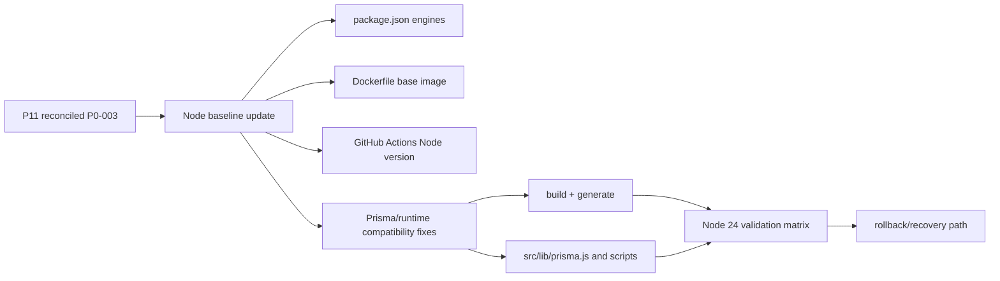

# Solution Architecture
## 1. Architecture summary
La migración propuesta mueve coordinadamente el baseline de Node 20 a Node.js 24 LTS en package, contenedor, scripts y GitHub Actions, con un workstream técnico central para compatibilidad Prisma/runtime. La estrategia aprobada es incremental: primero aislar la incompatibilidad real observada, luego alinear baseline y finalmente validar Linux/Windows/Docker con evidencia explícita.

## 2. Design goals
- Migrar el baseline a Node.js 24 LTS con evidencia real, no solo declarativa.
- Resolver o aislar la incompatibilidad `PrismaClient is not a constructor`.
- Mantener separado el baseline Windows rename-lock preexistente de regresiones nuevas.
- Preservar comportamiento externo y minimizar cambios no necesarios.

## 3. Proposed components
### 3.1 Baseline version alignment
Actualizar coordinadamente:
- `package.json -> engines.node`
- `Dockerfile` base image
- todos los workflows `.github/workflows/*.yml` que hoy fijan Node 20
- cualquier script/guidance que codifique explícitamente la preferencia por Node 20

### 3.2 Prisma/runtime compatibility slice
Investigar y corregir/aislar el error observado en Node 24:
- `TypeError: PrismaClient is not a constructor`
- traza desde `src/lib/prisma.js`

Áreas técnicas probables:
- compatibilidad de versiones `prisma` / `@prisma/client`
- cliente generado bajo Node 24
- patrón CommonJS `require('@prisma/client')`
- scripts que instancian `new PrismaClient()` directamente

### 3.3 Validation matrix by platform
#### Linux / primary CI
Validación mínima obligatoria:
- `npm ci`
- `npm run build`
- `npm run lint`
- `npm run typecheck`
- `npm run test`
- `npm run test:e2e:browser` si el workflow aplica
- `docker build`
- smoke/health/contract validations cuando el workflow actual los cubra

#### Windows / Prisma build evidence
Validación mínima:
- ejecutar workflow `windows-prisma-build` en Node 24
- clasificar si los fallos observados siguen siendo `windows_rename_lock` baseline o si aparece incompatibilidad nueva de Node 24

#### Docker/runtime
Validación mínima:
- build de imagen con Node 24
- arranque/smoke o al menos healthcheck y validaciones operativas actualmente soportadas

### 3.4 Dependency update policy
Si se requiere tocar dependencias:
- limitar el cambio a paquetes implicados por compatibilidad Node 24
- justificar por archivo o por grupo mínimo (`prisma`, `@prisma/client`, eventualmente tooling relacionado)
- evitar upgrades amplios no relacionados

### 3.5 Rollback and isolation policy
- Si Node 24 rompe baseline crítico, revertir cambios coordinados en package/Docker/workflows.
- Si un problema queda sin resolver, documentarlo como excepción/aprobación explícita con alcance acotado; no marcar la migración como cerrada falsamente.

## 4. Responsibilities
- **package.json:** declarar baseline Node soportado.
- **Dockerfile:** materializar el runtime/base image objetivo.
- **Workflows:** ejecutar validación obligatoria bajo Node 24.
- **Prisma bootstrap (`src/lib/prisma.js`, scripts):** asegurar compatibilidad real de cliente generado e inicialización.
- **Docs/specs:** separar baseline actual, target state, riesgos y recovery.

## 5. Proposed data flow
1. Ajustar baseline declarado a Node 24 en package/Docker/workflows.
2. Reejecutar Prisma generate/build bajo Node 24.
3. Identificar y corregir/aislar incompatibilidad en `src/lib/prisma.js` o dependencias Prisma relacionadas.
4. Revalidar lint/typecheck/tests/browser/Docker/smoke bajo Node 24.
5. Clasificar evidencia Windows separando rename-lock baseline de regresiones nuevas.
6. Consolidar documentación y rollback.

## 6. Domain changes
No hay cambios funcionales de dominio.

## 7. API changes
No se proponen cambios de API externa.

## 8. Database changes
No se requieren migraciones de esquema. Puede requerirse regeneración del Prisma client con versión compatible.

## 9. Validation and business rules
- Ningún baseline Node 24 se considera válido sin pasar build y runtime mínimo.
- `PrismaClient is not a constructor` debe resolverse o aislarse explícitamente.
- `windows_rename_lock` no debe usarse como explicación automática de fallos nuevos no equivalentes.
- Cualquier upgrade de dependencia debe quedar justificado.

## 10. Error handling
- Si Prisma falla bajo Node 24, registrar si el problema está en generate, importación o runtime instantiation.
- Si Docker/build falla, aislar si el origen es Node base image, OpenSSL/system libs o generación Prisma.
- Si Windows falla, clasificar entre rename-lock baseline y regresión nueva.

## 11. Security
- No cambia el modelo de seguridad de aplicación.
- Mejora gobernanza de plataforma al alinear runtime soportado y validado.
- Evita releases sobre baseline no validado.

## 12. Observability
- Mantener evidencia de workflows actualizados y comandos ejecutados.
- Conservar clasificación explícita de fallos por plataforma.
- Documentar cualquier excepción restante con owner y condición de salida.

## 13. Testing strategy
- Ejecutar matriz mínima de validación bajo Node 24.
- Asegurar que `tests/taxpayer-characterization.test.js` deje de fallar por el bootstrap Prisma o que el problema quede aislado y explicado.
- Validar Windows Prisma build con clasificación explícita.
- Validar Docker build y smoke contractuales existentes.

## 14. Compatibility and migration
- Mantener CommonJS y contratos externos actuales salvo ajuste técnico mínimo.
- Preferir cambios pequeños en bootstrap Prisma o dependencias compatibles antes que rediseños de módulo completos.
- Hacer la migración coordinada; evitar baseline mixto Node 24 en package pero Node 20 en CI/Docker.

## 15. Alternatives considered
### A. Cambiar solo `engines.node` y workflows
Rechazada: deja Docker y runtime real sin validar.

### B. Mantener Node 20 indefinidamente y documentar la intención de migración
Rechazada: contradice la decisión aprobada de P11 y deja abierto P0-003.

### C. Migrar baseline completo y resolver/aislar incompatibilidades observadas con validación real
Aceptada.

## 16. Risks and trade-offs
- La migración puede destapar deuda de Prisma/tooling no visible en Node 20.
- Un upgrade mínimo de dependencias puede ser inevitable y requerir revalidación amplia.
- Mantener separación entre baseline Windows y regresiones nuevas añade disciplina, pero evita diagnósticos erróneos.

## 17. Architecture decision
El substream `p11-node24-runtime-migration` implementará el P0-003 reconciliado de P11 mediante una migración coordinada del baseline Node a 24 LTS en package, Docker y GitHub Actions, con un slice técnico específico para compatibilidad Prisma/runtime y una matriz mínima de validación Linux/Windows/Docker. El cierre solo será válido con evidencia reproducible o con excepciones explícitamente aprobadas y acotadas.
