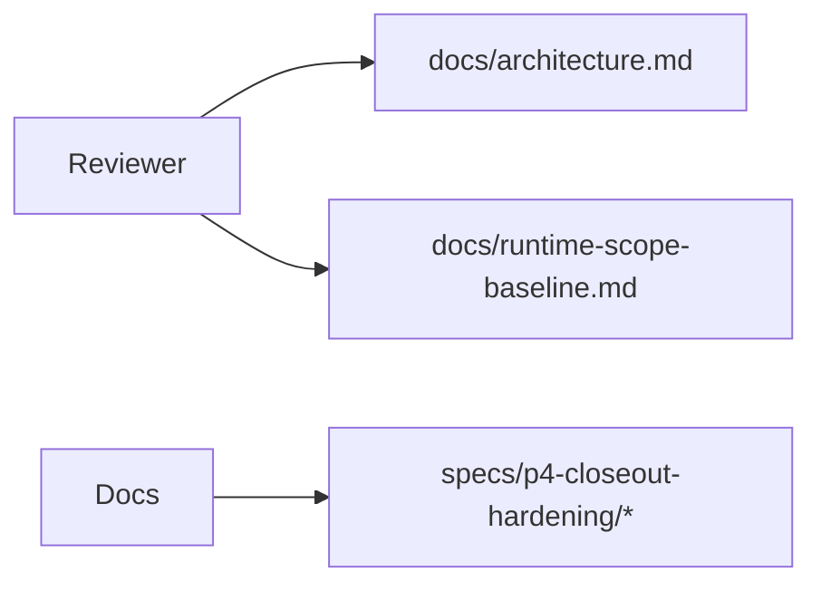
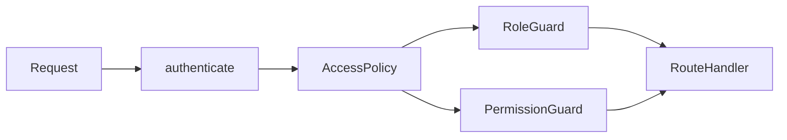
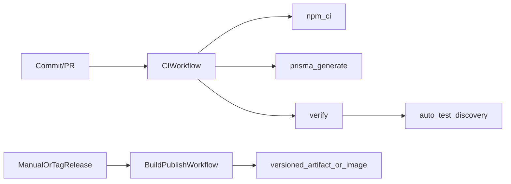

# Solution Architecture
## 1. Architecture summary
Se propone un cierre incremental de P4 en cinco frentes coordinados: restauración de trazabilidad documental, normalización de referencias, encapsulación monetaria segura con `Decimal`, gobernanza centralizada de autorización y automatización de calidad con descubrimiento automático de pruebas. La arquitectura mantiene el monolito actual y evita introducir capas nuevas innecesarias.

## 2. Design goals
- Restaurar auditabilidad del repositorio.
- Reducir riesgo monetario sin migraciones de esquema innecesarias.
- Hacer explícita la política de autorización sin romper compatibilidad inmediata.
- Permitir una migración progresiva de superficies operativas hacia permisos.
- Versionar un baseline mínimo de CI y un CD parcial controlado para build/publicación sin deploy.
- Evitar omisiones silenciosas de pruebas nuevas.

## 3. Proposed components
1. **Paquete de especificación P4 de cierre**
   - Ubicación: `specs/p4-closeout-hardening/`
   - Propósito: fuente versionada de requisitos, análisis, arquitectura, plan y tareas.

2. **Punteros documentales corregidos**
   - Ubicación esperada: `docs/architecture.md`, `docs/runtime-scope-baseline.md`, `docs/audit/current-code-audit.md`, `docs/audit/current-code-audit.html` y otros artefactos documentales versionados relacionados.
   - Propósito: eliminar referencias rotas y consolidar un nombre canónico único en toda la documentación distribuida.

3. **Utilidad monetaria decimal**
   - Ubicación probable: `src/lib/money.js` o módulo equivalente.
   - Propósito: operaciones `sum`, `subtract`, `compare`, `maxZero`, `toNumber`, `toFixedScale` sobre `Prisma.Decimal`/`@prisma/client` `Decimal`.

4. **Política central de autorización**
   - Ubicación probable: `src/security/access-policies.js` o `src/lib/access-policy.js`.
   - Propósito: mapear fronteras por dominio/endpoints, distinguiendo reglas por rol, por permiso y mixtas de compatibilidad.

5. **Middleware/adaptador de autorización gobernado**
   - Opcional y recomendado si se implementa refactor mínimo de rutas.
   - Propósito: permitir expresar reglas desde una política central sin cambiar la semántica efectiva de acceso.

6. **Ejecución automática de pruebas**
   - Ubicación probable: `package.json` y opcionalmente `scripts/run-tests.js`.
   - Propósito: descubrir pruebas automáticamente en `tests/` y servir como comando estándar local/CI.

7. **Workflow CI versionado**
   - Ubicación probable: `.github/workflows/quality-gates.yml`.
   - Propósito: ejecutar `npm ci`, `prisma generate` y el pipeline `verify` en cambios de ramas/PR.

8. **CD parcial controlado**
   - Ubicación probable: `.github/workflows/build-and-publish.yml` o archivo equivalente.
   - Propósito: construir, versionar y publicar artefactos o imágenes de forma controlada, sin ejecutar despliegue automático a ambientes.

## 4. Responsibilities
- **Specs P4:** preservar contexto y trazabilidad del cierre.
- **Docs corregidos:** servir como entradas confiables para humanos y auditoría.
- **Utilidad monetaria:** aislar precisión decimal y reglas de redondeo.
- **Política de autorización:** centralizar reglas y facilitar revisión.
- **Rutas/middlewares:** aplicar la política conservando comportamiento.
- **CI:** asegurar ejecución repetible de gates mínimos.
- **CD parcial:** automatizar build y publicación reproducible sin asumir despliegue operativo.
- **Runner de pruebas:** evitar que nuevas pruebas queden fuera.

## 5. Proposed data flow
### 5.1 Trazabilidad documental


### 5.2 Cálculo monetario propuesto
```mermaid
flowchart LR
Invoice/Payment data --> MoneyLib[Decimal money utility]
MoneyLib --> DerivedState[appliedAmount/pendingAmount/overpayment validation]
DerivedState --> Services
Services --> API/Repositories
```

### 5.3 Gobernanza de autorización propuesta


### 5.4 Calidad continua propuesta


## 6. Domain changes
- No se proponen cambios funcionales de dominio en estados de factura, pago o permisos.
- Sí se propone cambiar la representación interna de cálculos derivados monetarios para que use `Decimal` hasta el borde de serialización o comparación final.
- La política de autorización se vuelve un artefacto explícito de aplicación, no sólo un comportamiento disperso en rutas.
- Se habilita una migración progresiva de endpoints operativos desde role-based access hacia permission-based access cuando exista cobertura y compatibilidad suficientes.

## 7. API changes
- **Objetivo principal:** ningún cambio de contrato HTTP obligatorio.
- Posibles cambios internos:
  - Reemplazo de guards directos por wrappers basados en política central.
  - Comentarios/documentación o nombres de helpers más explícitos.
- Si se corrigen descripciones documentales, deben preservarse las rutas reales existentes.

## 8. Database changes
- No se requieren cambios de esquema para esta iniciativa.
- Se reutilizan campos `Decimal` ya presentes en `prisma/schema.prisma`.
- No se requieren migraciones para CI, documentación o descubrimiento de pruebas.

## 9. Validation and business rules
- Referencias canónicas sólo a archivos existentes.
- Una sola convención de nombre para el paquete P4 aprobado.
- Montos derivados calculados con `Decimal` y redondeo explícito a 2 decimales.
- Sobrepago validado mediante comparación decimal, no binaria.
- Definición explícita de fronteras:
  - **Por rol:** accesos platform/globales y algunos endpoints administrativos legados.
  - **Por permiso:** operaciones de negocio granulares por tenant.
  - **Mixtas:** permitidas sólo si la política lo documenta y justifica por compatibilidad o transición.
- La política debe identificar explícitamente endpoints en transición progresiva hacia permisos.
- El comando estándar de pruebas debe descubrir automáticamente nuevos tests.
- Todas las piezas documentales versionadas del baseline consultable deben quedar sin referencias rotas a `specs/p3-*` o `specs/p4-*` inexistentes.
- El CD de esta iniciativa sólo puede llegar hasta build, versionado y publicación controlada; deploy queda fuera.

## 10. Error handling
- Mantener `createHttpError` y semántica HTTP actual.
- Si la utilidad monetaria recibe valores inválidos, debe fallar de forma explícita y trazable.
- Si una policy key de autorización no existe, el fallo debe ser visible en pruebas y desarrollo; no debe degradar silenciosamente a acceso abierto.
- El workflow CI debe fallar ante lint, typecheck, pruebas o scripts inválidos.

## 11. Security
- No reducir restricciones actuales de autenticación ni autorización.
- La centralización de políticas debe hacer más auditable quién accede a qué.
- No introducir secretos en el repositorio para habilitar CI.
- El workflow de build/publicación debe usar triggers controlados (manuales, por tag o equivalentes) y no debe contener pasos de deploy a ambientes.

## 12. Observability
- Reusar auditoría existente para rechazos de autenticación/autorización.
- Opcionalmente añadir comentarios o metadata de política en puntos de acceso para facilitar auditoría de código.
- La observabilidad mínima del cierre será evidenciada por specs, pruebas y workflow versionado.

## 13. Testing strategy
- Pruebas unitarias para utilidad monetaria decimal.
- Pruebas de regresión para `invoice-financial-state.js`, `payment.service.js` y cualquier helper relacionado.
- Pruebas de autorización para garantizar que la política central preserva accesos actuales en rutas críticas.
- Prueba de caracterización o script de validación para asegurar que la documentación versionada distribuida no contiene referencias rotas a specs inexistentes.
- Validación del nuevo comando de pruebas con fixture o verificación manual agregando un test nuevo detectado automáticamente.
- Validación del workflow CI mediante ejecución local equivalente y revisión estática del YAML.
- Validación del workflow de build/publicación mediante revisión estática del YAML, verificación de triggers y prueba controlada de empaquetado/versionado si el entorno lo permite.

## 14. Compatibility and migration
- La compatibilidad deseada es total a nivel de contratos HTTP y estados de negocio.
- La migración documental consiste en consolidar referencias al nuevo paquete canónico en Markdown y artefactos derivados distribuidos.
- La migración de autorización debe ser incremental: primero política/documentación, luego adopción progresiva en rutas operativas hacia permisos donde se apruebe.
- La migración de pruebas debe mantener el mismo set actual y además descubrir nuevos archivos.
- La migración de release automation debe quedarse en build/publicación de artefactos o imágenes, sin incorporar despliegue.

## 15. Alternatives considered
1. **No corregir docs y dejar sólo audit findings.**
   - Rechazada: no cierra la trazabilidad.
2. **Reescribir toda autorización a permisos de una vez.**
   - Rechazada por riesgo y alcance.
3. **Añadir librería externa de dinero.**
   - No preferida inicialmente porque Prisma ya expone `Decimal` utilizable.
4. **Mantener lista manual de tests con disciplina humana.**
   - Rechazada: no elimina el riesgo estructural.
5. **Implementar CD completo inmediatamente.**
   - Rechazada por falta de definición de infraestructura/secrets en el repo inspeccionado.
6. **No versionar ninguna automatización de release hasta tener infraestructura final.**
   - Rechazada porque se pierde valor inmediato; sí conviene avanzar hasta build/publicación sin deploy.

## 16. Risks and trade-offs
- Centralizar autorización sin cambiar semántica puede requerir un periodo híbrido temporal.
- La migración progresiva a permisos debe evitar expandir acceso por errores de mapeo.
- Cambiar cálculos monetarios puede descubrir discrepancias históricas hoy ocultas por redondeo binario.
- Un workflow CI o de build/publicación puede requerir ajustes si algunas pruebas o builds dependen de entorno no descrito.
- Corregir también artefactos derivados aumenta el esfuerzo pero elimina ambigüedad documental persistente.

## 17. Architecture decision
Se aprueba una estrategia de cierre P4 incremental y conservadora:
1. crear el paquete canónico `specs/p4-closeout-hardening/`;
2. alinear documentación activa a ese paquete;
3. encapsular cálculos monetarios derivados con `Decimal` sin cambiar el esquema;
4. definir una política central de autorización preservando compatibilidad;
5. versionar CI mínimo y descubrimiento automático de pruebas;
6. versionar un CD parcial controlado para build, versionado y publicación sin despliegue automático.
