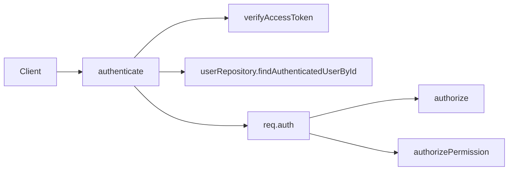
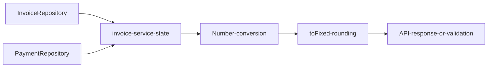

# Current State Analysis
## 1. System overview
El sistema inspeccionado es un monolito Node.js/Express con capas `routes -> services -> repositories -> Prisma`, autenticación JWT y UI embebida servida desde `src/public/`. La aplicación principal se monta desde `src/app.js` y arranca por `src/server.js`. Confirmado por la estructura del repositorio y `package.json`.

## 2. Relevant repository structure
- `src/app.js`: bootstrap de Express y montaje de rutas.
- `src/routes/`: endpoints HTTP por dominio.
- `src/services/`: lógica de aplicación y dominio.
- `src/repositories/`: acceso a datos vía Prisma.
- `src/middlewares/authenticate.js`: autenticación JWT + recarga de usuario.
- `src/middlewares/authorize.js`: autorización por rol.
- `src/middlewares/authorizePermission.js`: autorización por permisos.
- `src/lib/auth.js`: emisión/verificación de JWT con `role` y `permissions`.
- `prisma/schema.prisma`: modelos persistentes, incluidos campos `Decimal` para montos.
- `tests/`: pruebas con `node:test`.
- `docs/architecture.md`: puntero documental del baseline aprobado hacia `specs/p4-closeout-hardening/architecture.md`.
- `docs/runtime-scope-baseline.md`: baseline documental alineado con la referencia canónica aprobada para P4.

## 3. Current components
### 3.1 Autenticación y autorización
**Confirmado:**
- `src/lib/auth.js` firma tokens con `role`, `permissions` y `companyId`.
- `src/middlewares/authenticate.js` verifica el JWT, recarga usuario desde repositorio y recalcula permisos efectivos desde `rolePermissions` activas.
- `src/middlewares/authorize.js` permite acceso por lista de roles.
- `src/middlewares/authorizePermission.js` permite acceso por lista de permisos.

**Confirmado:** coexistencia de ambos enfoques en rutas activas.
- Rutas por rol: `src/routes/company.routes.js`, `client.routes.js`, `invoice.routes.js`, `order.routes.js`, `user.routes.js`, `role.routes.js`, `region.routes.js`, `sales-route.routes.js`, `taxpayer.routes.js`, `geocoding.routes.js`.
- Rutas por permisos: `src/routes/inventory.routes.js`, `product.routes.js`, `warehouse.routes.js`, `order.routes.js`, `payment.routes.js`.

**Confirmado:** la política de acceso evolucionó en etapas distintas y ahora cuenta con un registro central en `src/security/access-policies.js`, reutilizado por rutas administrativas y operativas sin ampliar el acceso efectivo del baseline.
- El registro central ya gobierna también rutas de clientes y superficies de integración de consulta (`client.routes.js`, `geocoding.routes.js`, `taxpayer.routes.js`) con semántica equivalente a la previa, pero ahora auditable desde una fuente única.

### 3.2 Dominio financiero
**Confirmado:**
- Persistencia usa `Decimal` en Prisma para montos como `Invoice.amount` y `Payment.amount` (`prisma/schema.prisma`, modelos financieros).
- `src/lib/money.js` centraliza utilidades decimales para suma, resta, comparación y serialización monetaria a 2 decimales.
- `src/services/invoice-financial-state.js` calcula `appliedAmount`, `pendingAmount` y `paidAt` con utilidades decimales en vez de sumas intermedias en `Number`.
- `src/services/payment.service.js` usa comparación decimal explícita en `assertNoApprovalOverpayment` y valida los comprobantes sensibles antes de persistir el pago.
- `src/services/agent-workspace.service.js` conserva serialización numérica de salida, pero ya calcula saldos derivados con utilidades decimales antes de serializar.
- `src/lib/sensitive-file-governance.js` centraliza reglas homogéneas de tamaño, MIME, extensión y base64 válido para documentos sensibles de clientes y comprobantes de pago.
- `src/schemas/client.schema.js` reutiliza la gobernanza sensible compartida para validar cargas base64 de documentos de clientes con inferencia segura de MIME y rechazo explícito de mismatch MIME/extensión.

**Confirmado:** existen pruebas de sincronización y lifecycle financiero (`tests/invoice-payment-sync-characterization.test.js`, `tests/payment-lifecycle-schema-characterization.test.js`, `tests/payment-tenant-scope.test.js`).

### 3.3 Documentación y trazabilidad
**Confirmado:**
- `inventory-api/specs/p4-closeout-hardening/` existe como paquete canónico aprobado y contiene `requirements.md`, `current-state.md`, `architecture.md`, `implementation-plan.md`, `tasks.md`, `traceability.md`, `risks.md`, `decisions.md`, `advisor-review.md`, `domain-analysis.md`, `implementation-report.md` y `metadata.yaml`.
- `docs/architecture.md` y `docs/runtime-scope-baseline.md` ya apuntan al paquete canónico aprobado.
- `docs/audit/current-code-audit.md` y `docs/audit/current-code-audit.html` quedaron alineados con la referencia canónica vigente.
- Persisten referencias históricas dentro del baseline auditado para explicar el drift anterior, pero ya no gobiernan los punteros activos del repositorio.

### 3.4 Automatización y calidad
**Confirmado:**
- `package.json` define `verify` con lint, typecheck, lint de runtime público, validación de runtime público, `prisma generate` y `npm run test`.
- `package.json` define `test` mediante `node scripts/run-tests.js`, que descubre automáticamente `tests/**/*.test.js` y preserva un orden estable para la suite histórica.
- `.github/workflows/quality-gates.yml` versiona un baseline CI mínimo con `npm ci`, `npm run build` y `npm run verify` para `push`, `pull_request` y `workflow_dispatch`.
- `.github/workflows/build-and-publish.yml` versiona el CD parcial aprobado con triggers controlados (`push` sobre tags `v*` y `workflow_dispatch`), build Docker, empaquetado de imagen y publicación de artefactos en GitHub Actions sin deploy.

**Confirmado:** el proyecto ya no depende sólo de ejecución local/manual para sus gates básicos de calidad ni para un baseline mínimo de build/publicación controlada; deploy sigue fuera de alcance.
- `src/lib/throttle-store.js` ya no depende exclusivamente de memoria local en runtime normal: expone modo por archivo versionable/configurable para endurecer throttling de login y lookups sensibles sin infraestructura externa pesada.

## 4. Current data flow
### 4.1 Autenticación

### 4.2 Cálculo financiero derivado actual

**Confirmado:** el flujo crítico factura/pago ya no usa conversión intermedia a `Number`; el endurecimiento aprobado conserva aritmética decimal hasta la serialización final a 2 decimales.

## 5. Current domain model
### 5.1 Seguridad
- `Role`, `Permission` y `RolePermission` en `prisma/schema.prisma` sustentan permisos efectivos.
- `User.role` y `User.companyId` definen además alcance organizacional.

### 5.2 Finanzas
- `Invoice.amount` y `Payment.amount` son `Decimal @db.Decimal(14, 2)`.
- Los estados de factura (`InvoiceStatus`) y pago (`PaymentLifecycleStatus`) están modelados en Prisma.

## 6. Current APIs or interfaces
- Endpoints administrativos por rol: ejemplos `GET /api/companies/`, `POST /api/users/company`, `GET /api/invoices/inconsistencies`.
- Endpoints operativos por permisos: ejemplos `POST /api/payments/:id/approve`, `POST /api/orders/`, `GET /api/products/`, `POST /api/inventory/entries`.
- `docs/openapi/runtime-baseline.openapi.json` es un contrato parcial verificado por `tests/openapi-contract-consistency.test.js`.

## 7. Current database behavior
- Persistencia monetaria y de cantidades está modelada con `Decimal` en Prisma.
- No se observaron cambios de base de datos requeridos únicamente para corregir referencias documentales, CI o descubrimiento de pruebas.
- **Inferred:** la mitigación del riesgo monetario puede resolverse a nivel de lógica de aplicación reutilizando `Decimal`, sin migración de esquema.

## 8. Existing tests
**Confirmado:** suite `node:test` en `tests/` con cobertura de:
- autorización administrativa: `tests/administrative-authorization-characterization.test.js`
- autorización de compañías: `tests/company-authorization-characterization.test.js`
- sincronización factura/pago: `tests/invoice-payment-sync-characterization.test.js`
- gobernanza de documentos sensibles: `tests/client-document-governance.test.js`, `tests/client-document-schema-governance.test.js`, `tests/payment-receipt-security.test.js`
- baseline productivo: `tests/production-baseline-characterization.test.js`
- superficie pública: `tests/public-surface-characterization.test.js`
- consistencia OpenAPI: `tests/openapi-contract-consistency.test.js`

**Confirmado:** el comando estándar detecta automáticamente nuevas pruebas compatibles bajo `tests/` mediante `scripts/run-tests.js`, sin editar `package.json` por cada archivo nuevo.

## 9. Current limitations
- Persisten advertencias de auditoría en pruebas cuando no hay base de datos local para registrar eventos, aunque no rompen la suite caracterizada.
- `npm run build` puede sufrir fallas transitorias de bloqueo de archivos Prisma en Windows (`EPERM`) antes de un rerun exitoso.
- La publicación baseline actual usa `actions/upload-artifact`; la publicación a container registry queda pendiente de una definición posterior de destino y secretos.

## 10. Technical debt related to the change
- Deuda de gobernanza de autorización híbrida.
- Pendiente futuro de publicación a registry externo si se aprueba un destino operativo real.
- Dependencia de validación estática manual del YAML en entornos locales sin parser disponible por defecto.
- Riesgo ambiental intermitente de Prisma en Windows durante `npm run build`.

## 11. Risks
- Riesgo de auditoría: no se puede reconstruir el cierre aprobado desde el repositorio actual.
- Riesgo financiero: drift de precisión en validación de sobrepago o saldos derivados.
- Riesgo de seguridad/gobernanza: inconsistencias al evolucionar permisos y roles.
- Riesgo operativo: el baseline de CI/CD parcial ya está versionado, pero la publicación externa a registry aún no está definida.
- Riesgo de cobertura: mitigado para pruebas nuevas por autodiscovery; permanece el riesgo de dependencia ambiental en runners no homogéneos.

## 12. Relevant files
- `.github/workflows/quality-gates.yml`
- `.github/workflows/build-and-publish.yml`
- `package.json`
- `docs/architecture.md`
- `docs/runtime-scope-baseline.md`
- `docs/audit/current-code-audit.md`
- `src/lib/auth.js`
- `src/middlewares/authenticate.js`
- `src/middlewares/authorize.js`
- `src/middlewares/authorizePermission.js`
- `src/routes/company.routes.js`
- `src/routes/order.routes.js`
- `src/routes/payment.routes.js`
- `src/routes/product.routes.js`
- `src/routes/inventory.routes.js`
- `src/security/access-policies.js`
- `src/lib/money.js`
- `src/services/invoice-financial-state.js`
- `src/services/payment.service.js`
- `src/services/agent-workspace.service.js`
- `prisma/schema.prisma`
- `tests/administrative-authorization-characterization.test.js`
- `tests/company-authorization-characterization.test.js`
- `tests/access-policies.test.js`
- `tests/invoice-payment-sync-characterization.test.js`
- `tests/money.test.js`
- `tests/openapi-contract-consistency.test.js`
- `tests/production-baseline-characterization.test.js`

## 13. Implementation updates
- 2026-07-21: `TASK-002` normalized active and derived repository documentation pointers from historical `p4-audit-hardening` / missing `p3-*` references to the approved canonical package `specs/p4-closeout-hardening/`.
- 2026-07-21: `TASK-003` replaced critical invoice/payment derived-money calculations with centralized decimal-safe helpers and added financial regression coverage in `tests/money.test.js`.
- 2026-07-21: `TASK-004` centralized approved authorization rules in `src/security/access-policies.js` and added policy characterization coverage without expanding effective access.
- 2026-07-21: post-closeout follow-up hardened throttling storage, unified sensitive file governance and extended centralized policy usage to clients/geocoding/taxpayer while preserving observable behavior.
- 2026-07-21: the closeout follow-up also aligned `src/schemas/client.schema.js` with shared sensitive-file governance and updated payload segmentation characterization to the centralized access-policy contract.
- 2026-07-21: `TASK-005` replaced manual `package.json` test enumeration with `scripts/run-tests.js` autodiscovery for `tests/**/*.test.js` while preserving stable suite ordering.
- 2026-07-21: `TASK-006` versioned `.github/workflows/quality-gates.yml` as the approved minimal CI baseline around `npm ci`, `npm run build` and `npm run verify`, without requiring deployment secrets.
- 2026-07-21: `TASK-007` versioned `.github/workflows/build-and-publish.yml` with controlled tag/manual triggers and GitHub artifact publication of versioned Docker build outputs, explicitly excluding deploy.
