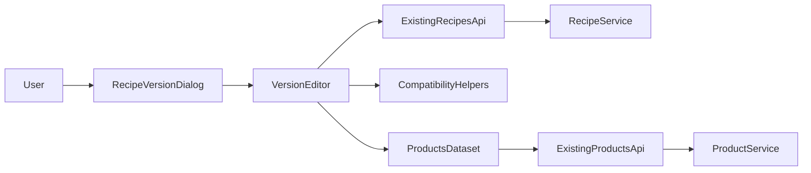

# Solution Architecture
## 1. Architecture summary
Se propone una mejora **frontend-first** y **sin cambios de persistencia** sobre el root shell administrativo de recetas. La solución reutiliza los contratos actuales de recetas y productos para agregar copy contextual, labels enriquecidos, warnings de compatibilidad, hints para `UN` y badges de revisión visibles.

## 2. Design goals
- Reducir errores de interpretación sin cambiar el modelo de datos.
- Hacer evidente cuándo usar `PER_FINISHED_UNIT` para materiales discretos.
- Aclarar la dependencia operativa entre `PROCESSING` (incluyendo `CAPPING` y envasado/empaque) y `RECOLLECTION`.
- Mejorar el descubrimiento de insumos en catálogos grandes usando el dataset ya cargado cuando sea suficiente.
- Mantener compatibilidad con recetas, productos y órdenes actuales.
- Evitar introducir soporte híbrido de base por etapa o por insumo.

## 3. Proposed components
### 3.1 `src/public/root/views/recipes-admin.renderers.js`
Actualizar el markup del diálogo de versión y de las superficies de revisión para:
- mejorar copy de `quantityBasis`
- agregar zonas visibles para warnings/hints
- mostrar badges/resúmenes de `quantityBasis`, `stageType`, `processCode` y compatibilidad discreta

### 3.2 `src/public/root/views/recipes-admin.version-editor.js`
Ampliar la lógica del editor para:
- construir labels enriquecidos de productos
- calcular warnings de compatibilidad según `quantityBasis` y metadata del producto
- aplicar hints/step/feedback para cantidades `UN`
- ofrecer búsqueda o filtros cliente-side por categoría, subcategoría, nombre y código cuando el dataset actual lo permita
- mostrar guía explícita para `PROCESSING`/`CAPPING`/envasado y para ausencia de `RECOLLECTION` previa

### 3.3 `src/public/root/views/recipes-admin.helpers.js`
Agregar helpers pequeños y reutilizables para:
- formatear etiquetas de producto para selectores
- identificar producto discreto COUNT/UN
- derivar mensajes de compatibilidad sin duplicar lógica de strings en múltiples sitios
- encapsular lógica de búsqueda/filtro cliente-side si se introduce para no inflar el editor principal

### 3.4 Tests de caracterización y vista
Actualizar `tests/root-shell-recipes-admin-view-characterization.test.js` y, si conviene, agregar pruebas puntuales para helpers nuevos.

## 4. Responsibilities
- **Renderer**: estructura HTML estable, copy y zonas de visualización.
- **Version editor**: comportamiento interactivo, warnings dinámicos y ajustes de inputs.
- **Helpers**: clasificación simple de productos discretos y construcción de etiquetas/mensajes.
- **Backend existente**: mantener validación/persistencia/serialización actual sin cambios estructurales.

## 5. Proposed data flow

### Interaction flow
1. La vista carga productos y recetas con los endpoints actuales.
2. El editor forma labels enriquecidos usando metadata ya disponible del producto.
3. Al cambiar `quantityBasis`, `processCode` o producto seleccionado, el editor recalcula hints y warnings.
4. Al revisar la versión, los renderers muestran badges y resúmenes operativos sin alterar payloads.
5. El submit sigue enviando el mismo contrato actual.

## 6. Domain changes
- **No hay cambio de entidades o invariantes persistidos.**
- Se agrega una capa de interpretación UX sobre invariantes existentes.
- Se explicita que `PER_FINISHED_UNIT` es el modo recomendado para relaciones discretas simples como `1 tapa por producto terminado`.

## 7. API changes
- **No propuestos.**
- La solución debe consumir endpoints actuales de productos y recetas.

## 8. Database changes
- **No propuestos.**
- No se requieren migraciones Prisma para este alcance incremental.

## 9. Validation and business rules
- Mantener la validación actual de backend para `quantityBasis`, `stageType`, `processCode` y unidad consistente con producto.
- Agregar validación UX incremental para `UN` como warning o feedback preventivo no bloqueante.
- Mostrar warning cuando `quantityBasis = PER_OUTPUT_KG` y el producto sea COUNT/UN o la unidad visible sea `UN`.
- Mostrar hint positivo cuando `quantityBasis = PER_FINISHED_UNIT` y el producto sea COUNT/UN.
- Mostrar guía explícita cuando `processCode = CAPPING` y cuando otras etapas `PROCESSING` equivalentes dependan de recolección previa.
- Reusar la lógica existente de disponibilidad por recolección previa y volverla más explicativa.
- Si se replica en superficies equivalentes de bodega, mantener copy y señales consistentes sin introducir nueva lógica de dominio.

## 10. Error handling
- No cambiar la semántica de errores HTTP actuales.
- Los nuevos mensajes UX deben vivir en el cliente y no reemplazar errores de backend.
- Cuando el usuario no pueda agregar insumos a una etapa `PROCESSING`, la interfaz debe explicar el motivo antes de llegar a un fallo de servidor.

## 11. Security
- No se introducen nuevos permisos ni ampliación de superficie API.
- La metadata visible en el selector debe limitarse a datos de catálogo ya disponibles para el usuario actual.
- Debe respetarse el shaping actual de productos que oculta datos de inventario cuando faltan permisos.

## 12. Observability
- No se requieren cambios de logging backend.
- La observabilidad de esta mejora se apoyará principalmente en pruebas automatizadas y validación manual guiada.

## 13. Testing strategy
- Characterization tests de renderer/editor para copy, badges, warnings y labels.
- Pruebas de helper para clasificación COUNT/UN y mensajes de compatibilidad.
- Pruebas de no regresión sobre presencia de `quantityBasis` y wiring del editor.
- Validación manual de escenarios:
  - receta `PER_FINISHED_UNIT` con `1 tapa UN`
  - receta `PER_OUTPUT_KG` con insumo COUNT/UN y warning visible
  - etapa `CAPPING` o proceso de envasado/empaque sin `RECOLLECTION` previa
  - búsqueda cliente-side de insumos por categoría, subcategoría, nombre y código si entra en alcance
  - revisión de versión con badges de base y etapa
  - consistencia de copy en superficies equivalentes de bodega si son afectadas

## 14. Compatibility and migration
- Compatibilidad hacia atrás total esperada.
- No hay migración de datos.
- El payload de receta y producto permanece compatible.

## 15. Alternatives considered
### A. Rediseñar `quantityBasis` por etapa o por insumo
Rechazado para este spec por alto impacto transversal en esquema, backend, producción, UI y compatibilidad.

### B. Agregar validación backend dura para bloquear COUNT/UN en recetas por kg
Rechazado como primer paso porque contradice el hallazgo de que el caso es técnicamente soportado y puede ser válido según el producto.

### C. Resolver solo con documentación externa
Insuficiente; la fricción ocurre en el flujo interactivo y debe mitigarse inline.

## 16. Risks and trade-offs
- Más lógica en el editor puede aumentar complejidad local.
- Warnings demasiado agresivos pueden confundir o parecer bloqueos.
- Mantener `quantityBasis` global deja pendiente la limitación de recetas híbridas, pero evita un cambio profundo prematuro.

## 17. Architecture decision
**Decisión:** implementar una mejora incremental de UX en el root shell de recetas, replicando copy/señales en superficies equivalentes de bodega cuando sea incremental y seguro, sin cambios de API ni base de datos, y dejar el soporte híbrido real como follow-up fuera de alcance.
