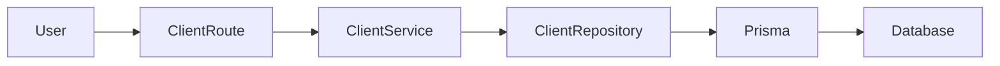
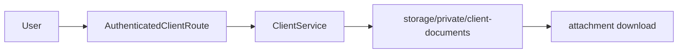

# Current State Analysis

## 1. System overview
El backend inspeccionado vive en `inventory-api/` y usa Node.js + Express + Prisma + PostgreSQL. La API está organizada por capas `routes -> services -> repositories -> Prisma` y las rutas protegidas dependen de `authenticate` y `authorize` (`inventory-api/src/middlewares/authenticate.js`, `inventory-api/src/middlewares/authorize.js`).

## 2. Relevant repository structure
- `docs/audit/audit.json`: auditoría base con defectos críticos AUD-001, AUD-002, AUD-003, AUD-012 y AUD-013.
- `inventory-api/src/app.js`: bootstrap Express, static hosting y logging.
- `inventory-api/src/routes/*.routes.js`: definición de endpoints.
- `inventory-api/src/services/*.service.js`: reglas de negocio.
- `inventory-api/src/repositories/*.repository.js`: acceso Prisma.
- `inventory-api/src/schemas/*.schema.js`: validación Zod.
- `inventory-api/prisma/schema.prisma`: modelo de datos.
- No existe directorio de pruebas formal ni scripts de test en `inventory-api/package.json`.

## 3. Current components
### 3.1 Autenticación y contexto
**Confirmado:** `authenticate` valida JWT, recarga usuario desde base, verifica usuario/rol/empresa activos y coloca `req.auth = { sub, username, role, permissions, companyId }` (`inventory-api/src/middlewares/authenticate.js`).

### 3.2 Clientes
**Confirmado:**
- `GET /api/clients`, `GET /api/clients/:id`, `PUT /api/clients/:id` y `DELETE /api/clients/:id` ahora reciben `req.auth` y aplican scoping por `auth.companyId` (`inventory-api/src/routes/client.routes.js`, `inventory-api/src/services/client.service.js`, `inventory-api/src/repositories/client.repository.js`).
- Usuarios root sin `companyId` son rechazados con `403` en estos flujos empresariales.
- `GET /api/clients/company` sigue filtrando por `auth.companyId` mediante `findCompanyClients(companyId)`.
- `POST /api/clients` ya no acepta `companyId` como parte del contrato validado; usa el mismo contrato empresarial que `POST /api/clients/company` y fuerza la empresa desde `req.auth`.
- `PUT /api/clients/:id` también elimina `companyId` del payload validado antes de persistir.
- `POST /api/clients/company` sigue derivando `companyId` desde `req.auth` y valida clasificación por empresa.

### 3.3 Facturas
**Confirmado:**
- `GET /api/invoices` y `GET /api/invoices/:id` ahora reciben `req.auth` en el servicio y aplican scoping por empresa derivado de `client.companyId` (`inventory-api/src/routes/invoice.routes.js`, `inventory-api/src/services/invoice.service.js`, `inventory-api/src/repositories/invoice.repository.js`).
- `POST /api/invoices`, `PUT /api/invoices/:id` y `DELETE /api/invoices/:id` ahora reciben `req.auth`, validan referencias por tenant y scopean mutaciones por empresa visible.
- La creación y actualización de facturas validan que `clientId` pertenezca a la empresa autenticada y que `orderId`, cuando existe, también pertenezca a esa empresa.
- `GET /api/invoices/inconsistencies` ya usaba `assertCompanyScope(auth)` y filtra por `client.companyId` en `findInvoicesForDebtReview(companyId)`.
- El modelo `Invoice` no contiene `companyId`; la pertenencia tenant se deriva por `clientId` y opcionalmente `orderId` (`inventory-api/prisma/schema.prisma`).

### 3.4 Pagos
**Confirmado:**
- `GET /api/payments` y `GET /api/payments/:id` ahora reciben `req.auth` y aplican scoping tenant derivado por `payment -> invoice -> client.companyId` (`inventory-api/src/routes/payment.routes.js`, `inventory-api/src/services/payment.service.js`, `inventory-api/src/repositories/payment.repository.js`).
- `POST /api/payments`, `PUT /api/payments/:id` y `DELETE /api/payments/:id` ahora reciben `req.auth`, validan `invoiceId` dentro del tenant autenticado y scopean mutaciones por empresa visible.
- `Payment` no contiene `companyId`; la pertenencia tenant se deriva a través de `invoice -> client -> companyId` (`inventory-api/prisma/schema.prisma`).
- La creación y actualización de pagos validan que `invoiceId` pertenezca a la empresa autenticada antes de persistir cambios.

### 3.5 Documentos de clientes
**Confirmado:**
- `persistClientDocumentFile()` guarda archivos bajo `inventory-api/src/public/uploads/client-documents/<companyId>/<clientId>/...` (`inventory-api/src/services/client.service.js`).
- `app.js` sirve `inventory-api/src/public` con `express.static(...)`, por lo que cualquier archivo bajo `/uploads/...` queda expuesto como activo estático público (`inventory-api/src/app.js`).
- El modelo `ClientDocument` persiste `fileUrl` y la UI lo usa directamente en enlaces `href` (`inventory-api/prisma/schema.prisma`, `inventory-api/src/public/root/client-detail.js`, `inventory-api/src/public/root/clients.js`).

### 3.6 Logging
**Confirmado:**
- `app.js` usa logging diferenciado por ambiente a través de `src/lib/logging.js`.
- En `development` se mantiene `morgan('dev')` y el error completo puede registrarse para diagnóstico.
- En `staging`, `test` y `production` las requests se registran con formato estructurado mínimo que incluye método, ruta, status, duración y `errorCode` saneado.
- El middleware de error ya no hace `console.error(error)` completo fuera de `development`; usa una entrada saneada con método, ruta, status y `errorCode`.
- `config.js` canaliza la advertencia de `JWT_SECRET` mediante logging por ambiente; en no-dev la advertencia se emite en formato estructurado saneado.

### 3.7 Calidad y pruebas
**Confirmado:**
- `inventory-api/package.json` aún no define scripts `test`, `lint`, `typecheck` ni `build`.
- Ya existe una prueba mínima con `node:test` en `inventory-api/tests/logging.test.js` para validar la política de logging.

## 4. Current data flow
### 4.1 Flujo actual de clientes inseguro

**Confirmado:** en varias operaciones el flujo no incorpora `auth.companyId`, por lo que el repositorio consulta por id global o lista completa.

### 4.2 Flujo actual de documentos

**Actualizado:** los documentos nuevos se almacenan fuera de `src/public`, la descarga pasa por `GET /api/clients/:clientId/documents/:documentId/download` y requiere autenticación + scoping tenant. El frontend interno ya no abre `fileUrl` como activo público directo; ahora descarga mediante `fetch` autenticado.

## 5. Current domain model
**Confirmado:**
- `Client` incluye `companyId` (`inventory-api/prisma/schema.prisma`).
- `Order` incluye `companyId` y referencia `clientId`/`clientStoreId`.
- `Invoice` referencia `clientId` y `orderId`, pero no tiene `companyId` propio.
- `Payment` referencia `invoiceId`, pero no tiene `companyId` propio.
- `ClientDocument` guarda `clientId`, metadatos del archivo y `fileUrl`.

## 6. Current APIs or interfaces
### Clientes
- `GET /api/clients`
- `GET /api/clients/company`
- `GET /api/clients/:id`
- `POST /api/clients`
- `POST /api/clients/company`
- `PUT /api/clients/:id`
- `DELETE /api/clients/:id`
- `POST /api/clients/:clientId/documents`
- `GET /api/clients/:clientId/documents/:documentId/download`

### Facturas
- `GET /api/invoices`
- `GET /api/invoices/inconsistencies`
- `GET /api/invoices/:id`
- `POST /api/invoices`
- `PUT /api/invoices/:id`
- `DELETE /api/invoices/:id`

### Pagos
- `GET /api/payments`
- `GET /api/payments/:id`
- `POST /api/payments`
- `PUT /api/payments/:id`
- `DELETE /api/payments/:id`

## 7. Current database behavior
**Confirmado:**
- Prisma usa `findUnique`, `findFirst`, `findMany`, `create`, `update`, `delete` sin políticas tenant automáticas (`inventory-api/src/repositories/*.repository.js`).
- La integridad tenant de `Invoice` y `Payment` depende de joins lógicos desde `client`/`invoice`, no de columna `companyId` directa.
- El esquema sigue usando `fileUrl`, pero ahora como URL lógica protegida (`/api/clients/:clientId/documents/:documentId/download`) y no como ruta pública estática.
- Existe un script operativo `inventory-api/scripts/migrate-client-documents-to-private-storage.js` para mover documentos históricos desde rutas públicas legacy a almacenamiento privado.

## 8. Existing tests
**Actualizado:** existen pruebas mínimas con `node:test` en `inventory-api/tests/` para logging, tenant isolation de clientes/facturas/pagos y descarga protegida de documentos. Sigue pendiente formalizar `npm test` en `inventory-api/package.json`.

## 9. Current limitations
- Aislamiento tenant inconsistente entre módulos.
- Endpoints legacy inseguros permanecen activos junto a algunos endpoints ya scopeados (`/api/clients/company`).
- La descarga protegida ya está implementada, pero la ejecución efectiva de la migración histórica depende de contar con base de datos accesible durante la operación.
- Sin infraestructura de pruebas para prevenir regresiones.
- Logging no diferenciado suficientemente por ambiente.

## 10. Technical debt related to the change
- Duplicidad de rutas de clientes con y sin scoping.
- Entidades financieras sin `companyId` directo.
- `fileUrl` se reutiliza como URL lógica protegida; la ubicación física se deriva de `companyId`, `clientId`, `documentId` y extensión del archivo.
- Eliminaciones físicas en clientes, facturas y pagos siguen presentes.
- La migración histórica de documentos requiere validación operativa en un entorno con base de datos disponible.

## 11. Risks
- Corregir scoping puede romper consumidores que hoy dependen de acceso global incorrecto.
- Mover documentos a almacenamiento privado impactará enlaces existentes y posiblemente archivos ya cargados.
- Introducir pruebas mínimas requerirá definir una convención nueva en el proyecto.
- Cambios de logging pueden reducir observabilidad si no se diseñan flags claros.

## 13. Validation drift update by `baseline-audit-agent-b9bb2c`

### Differences detected between this document and the actual repository state
- The earlier statement that client documents are still stored under `src/public/uploads/...` is no longer accurate for new uploads; the current code uses private storage via `inventory-api/src/lib/client-document-storage.js` and protected downloads.
- The earlier statement that `inventory-api/package.json` has no `test` script is no longer accurate; a reproducible `test` script now exists.
- The earlier statement that there is only a minimal logging test is outdated; the test suite now includes tenant-scope and document-security tests.
- The earlier limitations section saying logging is not sufficiently differentiated by environment is outdated; current code does differentiate logging behavior by environment.

### Current closure snapshot
- `npm test` exists in `inventory-api/package.json`.
- Tenant isolation fixes for clients, invoices and payments are present in the codebase.
- Protected client document download flow is present in the codebase.
- Prior implementation documentation claims successful execution of tests and Docker-assisted validation.
- This closure pass did not independently rerun those commands.

## 15. Follow-up stabilization update from `specs/p0-extra-inclusion`
- Follow-up package `specs/p0-extra-inclusion/` is now implemented and validated.
- `inventory-api/package.json` now includes `lint`, `typecheck`, `build`, and `verify` scripts in addition to `test`.
- `.github/workflows/p0-quality-gates.yml` now runs the mandatory quality gates in CI using the same repository scripts.
- Final clean-environment evidence was recorded after `npm ci` and supported-runtime execution under Node 20.
- A real GitHub Actions run is now durably linked at `https://github.com/Kmena/inventory-api/actions/runs/29287056129` with job evidence at `https://github.com/Kmena/inventory-api/actions/runs/29287056129/job/86942014049?pr=20`; the recorded outcome was `failure` at `npm run lint`, which satisfies evidence capture without implying CI success.
- Supported runtime is now explicit repository contract: `inventory-api/package.json` declares `engines.node` as `>=20 <21`, README documents Node 20.x, CI is pinned to Node 20, and Docker remains aligned.
- Clean database replay evidence was expanded: the canonical replay sequence is documented and migration invocation was recorded, but seed/bootstrap remains operationally blocked by target-environment inconsistency during replay.
- The original closure gap around missing quality gates is therefore resolved by the follow-up approved package, while historical notes above are preserved as an earlier snapshot.

## 16. Closure interpretation after follow-up package
- Original-package closure status in isolation remains a historical snapshot only; it should not be used without the approved follow-up package.
- Combined interpretation after `specs/p0-extra-inclusion/`:
  - repository-level mandatory quality gates now exist and have supported-runtime passing evidence under Node 20;
  - real GitHub Actions execution evidence is now linked, but the captured run outcome is a real `failure`, not a green CI result;
  - clean-database replay evidence is improved but still operationally inconclusive because seed/bootstrap could not be closed reliably in the observed environment.
- Therefore, the original P0 package is now better evidenced and back-linked, but this documentation does not reinterpret the recorded CI failure or the replay inconsistency as resolved facts.

## 14. Relevant files
- `docs/audit/audit.json`
- `inventory-api/src/app.js`
- `inventory-api/src/config.js`
- `inventory-api/src/lib/logging.js`
- `inventory-api/src/middlewares/authenticate.js`
- `inventory-api/src/middlewares/authorize.js`
- `inventory-api/src/routes/client.routes.js`
- `inventory-api/src/routes/invoice.routes.js`
- `inventory-api/src/routes/payment.routes.js`
- `inventory-api/src/services/client.service.js`
- `inventory-api/src/services/invoice.service.js`
- `inventory-api/src/services/payment.service.js`
- `inventory-api/src/repositories/client.repository.js`
- `inventory-api/src/repositories/invoice.repository.js`
- `inventory-api/src/repositories/payment.repository.js`
- `inventory-api/src/schemas/client.schema.js`
- `inventory-api/src/schemas/invoice.schema.js`
- `inventory-api/src/schemas/payment.schema.js`
- `inventory-api/src/lib/client-document-storage.js`
- `inventory-api/scripts/migrate-client-documents-to-private-storage.js`
- `inventory-api/prisma/schema.prisma`
- `inventory-api/src/public/root/client-detail.js`
- `inventory-api/src/public/root/clients.js`
- `inventory-api/package.json`
- `inventory-api/tests/`
